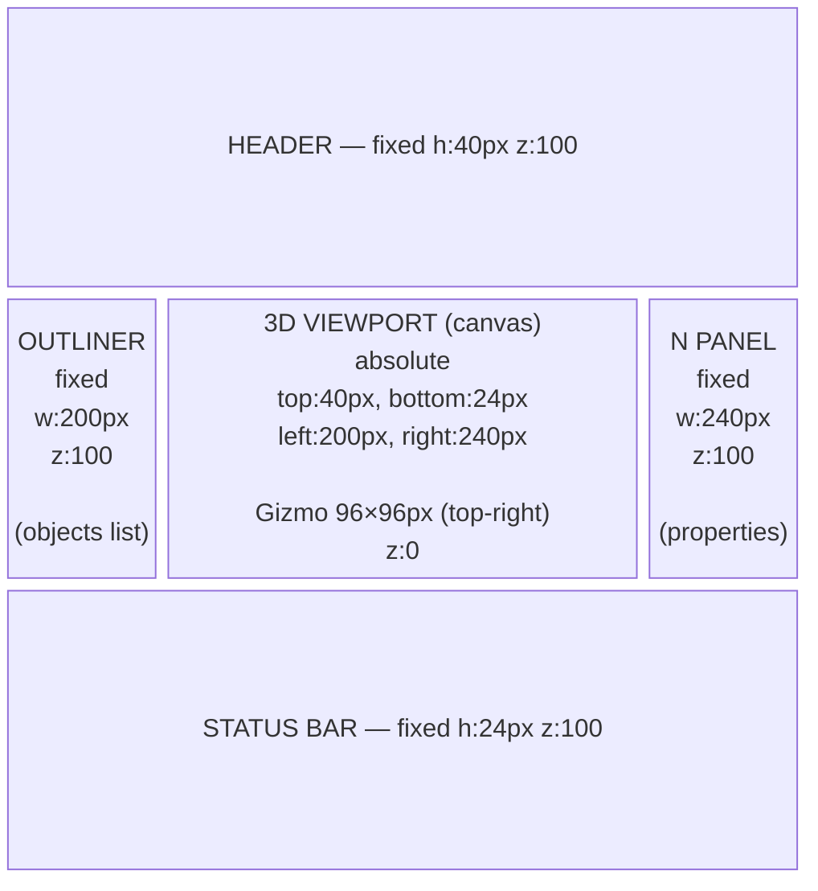
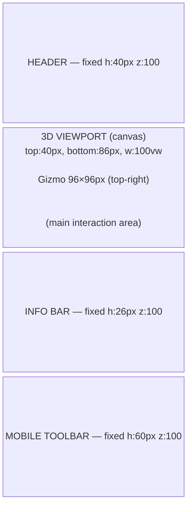

# Layout Design

Defines the placement, dimensions, and responsive behavior of UI components in easy-extrude.

> **When to update this document**
> - When changing the dimensions, position, or z-index of a component
> - When adding a new UI element (panel, drawer, modal, etc.)
> - When the number or order of slots in the mobile toolbar changes
> - When changing responsive breakpoints

---

## Responsive Breakpoints

| Category | Condition | Key Changes |
|----------|-----------|-------------|
| **Desktop** | `window.innerWidth >= 768` | Sidebars always visible, toolbar hidden |
| **Mobile** | `window.innerWidth < 768` | Sidebars become drawers, toolbar shown |

> Touch input detection uses `matchMedia('(pointer: coarse)')`.
> This is independent of the `innerWidth` size check.

---

## Desktop Layout



### Component Dimensions (Desktop)

| Component | Size | Position | z-index |
|-----------|------|----------|---------|
| Header | w:100vw, h:40px | fixed top:0 left:0 | 100 |
| Outliner sidebar | w:200px, h:calc(100vh-64px) | fixed top:40px left:0 | 100 |
| N Panel sidebar | w:240px, h:calc(100vh-64px) | fixed top:40px right:0 | 100 |
| 3D Canvas | w:calc(100vw-440px), h:calc(100vh-64px) | absolute top:40px | 0 |
| Status bar | w:100vw, h:24px | fixed bottom:0 left:0 | 100 |
| Gizmo | w:96px, h:96px | absolute top:48px right:248px | 50 |
| Toast | w:auto, max-w:320px | fixed bottom:32px, centered | 150 |
| Context menu | w:auto | absolute (cursor position) | 200 |
| Mode dropdown | w:140px | absolute (below button) | 200 |

---

## Mobile Layout



**Drawers (overlay, not in main flow):**

- **Outliner Drawer** — slides in from left: `fixed top:40px bottom:0 left:0`, w:200px, z:110
- **N Panel Drawer** — slides in from right: `fixed top:40px bottom:0 right:0`, w:240px, z:110

### Component Dimensions (Mobile)

| Component | Size | Position | z-index |
|-----------|------|----------|---------|
| Header | w:100vw, h:40px | fixed top:0 left:0 | 100 |
| 3D Canvas | w:100vw, h:calc(100vh-126px) | top:40px | 0 |
| Info bar | w:100vw, h:26px | fixed bottom:60px left:0 | 100 |
| Mobile toolbar | w:100vw, h:60px | fixed bottom:0 left:0 | 100 |
| Outliner drawer | w:200px, h:calc(100vh-40px) | fixed top:40px left:0 | 110 |
| N Panel drawer | w:240px, h:calc(100vh-40px) | fixed top:40px right:0 | 110 |
| Toast | w:auto, max-w:280px | fixed bottom:**96px**, centered | 150 |
| Context menu | w:auto | absolute (tap position) | 200 |
| Gizmo | w:96px, h:96px | absolute top:48px right:8px | 50 |

> **Toast bottom** must be toolbar (60px) + margin (36px) = **96px**.
> On desktop (no toolbar): bottom:32px.

---

## Header Internal Layout

### Desktop
```
[≡] [↶↷] │ [Mode▾] │ ──flex:1── status ──flex:1── │ [Export] [Import] [Save/Load]
```

### Mobile
```
[≡] [↶↷] │ [Mode▾] │ visibility:hidden (flex:1 spacer) │ [⋯] [N]
```

- `_headerStatusEl` must use **`visibility:hidden`**, not `display:none`.
  → It must continue to function as a `flex:1` spacer. Using `display:none` breaks the layout.

---

## Mobile Toolbar Slot Design

The toolbar maintains a **fixed slot count** per state.
Empty slots are filled with `{spacer: true}` to prevent layout shifts.

| App State | Slot 1 | Slot 2 | Slot 3 | Slot 4 | Slot 5 |
|-----------|--------|--------|--------|--------|--------|
| grab.active | ✓ Confirm | Stack | ✕ Cancel | — | — |
| faceExtrude.active | ✓ Confirm | ✕ Cancel | — | — | — |
| **Object Mode** (no selection) | + Add | Edit (disabled) | Delete (disabled) | — | — |
| **Object Mode** (selection) | + Add | Edit | Delete | — | — |
| **Object Mode** (Frame selected) | Rotate | Grab | Delete | Add Frame | spacer |
| Edit · 2D-Sketch | ← Object | Extrude (disabled) | — | — | — |
| Edit · 2D-Extrude | ✓ Confirm | ✕ Cancel | — | — | — |
| Edit · 3D | ← Object | Vertex | Edge | Face | Extrude (disabled*) |

`*` Extrude is enabled when a face is included in editSelection.

---

## z-index Hierarchy

```
z:200  ── Modal dialogs (rename, unit conversion)
        ── Dropdown menus (mode selector, ⋯ menu, add menu, context menu)

z:150  ── Toast notifications

z:110  ── Drawers (Outliner, N Panel) ← overlaps header

z:100  ── Header (fixed top)
        ── Mobile toolbar (fixed bottom)
        ── Status bar / Info bar (fixed bottom)

z:50   ── Gizmo (overlay on Three.js canvas)

z:10   ── Three.js labels (MeasureLine distance labels)

z:0    ── 3D canvas (Three.js renderer)
```

---

## N Panel Internal Layout

```
┌─────────────────────────────────┐
│  [×] Close (mobile only)        │
├─────────────────────────────────┤
│  ITEM  Property Group           │
│  ─────────────────────────────  │
│  Name:                          │
│  ┌───────────────────────────┐  │
│  │ Cube                      │  │
│  └───────────────────────────┘  │
│  Description:                   │
│  ┌───────────────────────────┐  │
│  │                           │  │
│  └───────────────────────────┘  │
├─────────────────────────────────┤
│  TRANSFORM  ─────────────────── │
│  Location (World):              │
│  X: [  1.00]  Y: [  0.00]      │
│  Z: [  0.00]                    │
│  Rotation (RPY, deg):           │
│  R: [  0.0]  P: [  0.0]        │
│  Y: [  0.0]                     │
└─────────────────────────────────┘
```

- Numeric fields are read-only (not directly editable)
- N Panel width: 240px
- Group headings: `font-size:11px, opacity:0.6`

---

## Outliner Internal Layout

```
┌─────────────────────────────────┐
│  SCENE HIERARCHY                │
├─────────────────────────────────┤
│  □ Cube           [○] [✕]      │  ← Solid
│  □ Cube.001       [○] [✕]      │  ← Solid
│    ├ ⊕ Origin    [○] [✕]      │  ← CoordinateFrame (indent 12px)
│    └ ⊕ Frame.001 [○] [✕]      │  ← CoordinateFrame (indent 12px)
│  ⊡ Sketch.001     [○] [✕]     │  ← Profile
│  ── Measure.001   [○] [✕]     │  ← MeasureLine
│  ▲ Import.001     [○] [✕]     │  ← ImportedMesh
└─────────────────────────────────┘
```

- Icon legend: `□` Solid / `⊡` Profile / `──` MeasureLine / `⊕` CoordinateFrame / `▲` ImportedMesh
- Indent: CoordinateFrame indented 12px under its parent
- Row height: 28px
- Active row: `background: #3d3d6b`

---

## Color Palette

| Usage | Color |
|-------|-------|
| Background (header, panels) | `#242424` |
| Background (secondary) | `#2b2b2b` |
| Background (buttons) | `#383838` |
| Border | `#4a4a4a` |
| Text (primary) | `#e0e0e0` |
| Text (secondary) | `#888888` |
| Accent (selected) | `#3d3d6b` / `#5c5cff` |
| Danger (Delete) | `#c04040` |
| Success (Confirm) | `#3a7a3a` |
| 3D face highlight | Cyan (Three.js material) |
| Measure line | Amber (`#f5a623`) |
| CoordinateFrame axes | X: red `#e05252` / Y: green `#52e052` / Z: blue `#5252e0` |

---

## Animations & Transitions

| Element | Animation | Duration |
|---------|-----------|----------|
| Drawer slide in/out | `transform: translateX()` | 200ms ease |
| Dropdown show/hide | `display: block/none` (immediate) | — |
| Toast appear | `opacity: 0 → 1` | 150ms |
| Toast disappear | after 5000ms: `opacity: 1 → 0` | 300ms |
| Button hover | `background` change | immediate |

---

## Related Documents

- `docs/SCREEN_DESIGN.md` — per-screen information architecture
- `docs/STATE_TRANSITIONS.md` — state transitions
- `docs/adr/ADR-023-mobile-input-model.md` — mobile input model
- `docs/adr/ADR-024-mobile-toolbar-architecture.md` — mobile toolbar architecture
- `.claude/mental_model/3_ui_layout.md` — UI layout coding rules
