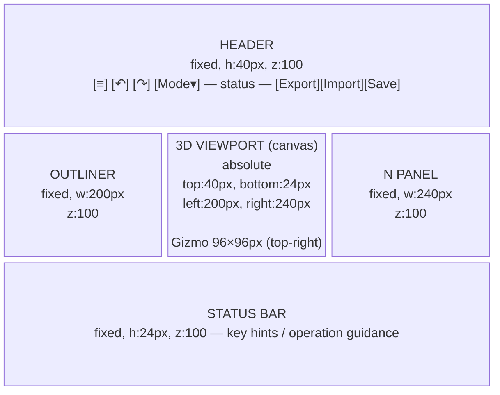
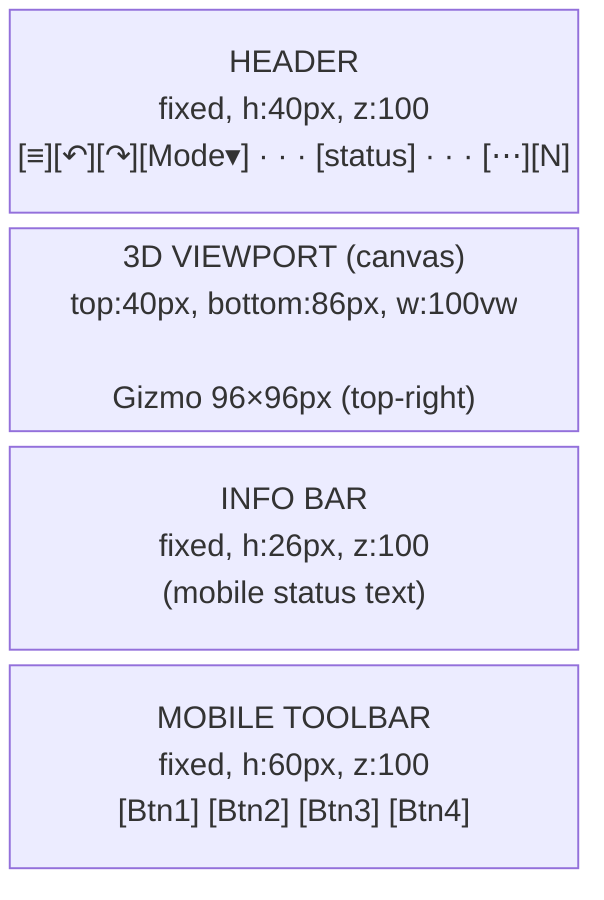

# Layout Design

Defines the placement, dimensions, and responsive behavior of UI components in easy-extrude.

> **When to update this document**
> - When changing the dimensions, position, or z-index of a component
> - When adding a new UI element (panel, drawer, modal, etc.)
> - When the number or order of slots in the mobile toolbar changes
> - When changing responsive breakpoints

---

## Responsive Breakpoints

| Category | Condition | Key Changes |
|----------|-----------|-------------|
| **Desktop** | `window.innerWidth >= 768` | Sidebars always visible, toolbar hidden |
| **Mobile** | `window.innerWidth < 768` | Sidebars become drawers, toolbar shown |

> Touch input detection uses `matchMedia('(pointer: coarse)')`.
> This is independent of the `innerWidth` size check.

---

## Desktop Layout



### Component Dimensions (Desktop)

| Component | Size | Position | z-index |
|-----------|------|----------|---------|
| Header | w:100vw, h:40px | fixed top:0 left:0 | 100 |
| Outliner sidebar | w:200px, h:calc(100vh-64px) | fixed top:40px left:0 | 100 |
| N Panel sidebar | w:240px, h:calc(100vh-64px) | fixed top:40px right:0 | 100 |
| 3D Canvas | w:calc(100vw-440px), h:calc(100vh-64px) | absolute top:40px | 0 |
| Status bar | w:100vw, h:24px | fixed bottom:0 left:0 | 100 |
| Gizmo | w:96px, h:96px | fixed top:46px right:16px (+200px when N panel open, +280px when Context Inspector open — `_updateGizmoOffset()`) | 10 |
| Link Network Overlay | w:220px, h:SVG 152px (160px when 3+ hierarchy layers) + 28px header (collapsed:26px) | fixed bottom:34px left:188px (beside Outliner, above InfoBar); force-hidden during the Context demo. SVG cap 160px keeps the panel top clear of the Map toolbar's lower edge on 720px viewports (ADR-048) | 50 |
| Map Mode toolbar | w:44px min, h:auto | fixed top:50% left:188px (beside Outliner; mobile: left:8px) | 150 |
| Toast | w:auto, max-w:320px | fixed bottom:32px, centered | 150 |
| Onboarding tour card (ADR-065 Phase 6) | w:248px, h:auto | fixed bottom:38px left:192px (offset past Outliner 180px + InfoBar 26px — #26; toasts are bottom-center and never collide) | 100 |
| Context menu | w:auto | absolute (cursor position) | 200 |
| Mode dropdown | w:140px | absolute (below button) | 200 |

---

## Mobile Layout



**Drawers (overlay, not in main flow):**

- **Outliner Drawer** — slides in from left: `fixed top:40px bottom:0 left:0`, w:200px, z:110
- **N Panel Drawer** — slides in from right: `fixed top:40px bottom:0 right:0`, w:240px, z:110

### Component Dimensions (Mobile)

| Component | Size | Position | z-index |
|-----------|------|----------|---------|
| Header | w:100vw, h:40px | fixed top:0 left:0 | 100 |
| 3D Canvas | w:100vw, h:calc(100vh-126px) | top:40px | 0 |
| Info bar | w:100vw, h:26px | fixed bottom:60px left:0 | 100 |
| Mobile toolbar | w:100vw, h:60px | fixed bottom:0 left:0 | 100 |
| Outliner drawer | w:200px, h:calc(100vh-40px) | fixed top:40px left:0 | 110 |
| N Panel drawer | w:240px, h:calc(100vh-40px) | fixed top:40px right:0 | 110 |
| Toast | w:auto, max-w:280px | fixed bottom:**96px**, centered | 150 |
| Context menu | w:auto | absolute (tap position) | 200 |
| Gizmo | w:96px, h:96px | absolute top:48px right:8px | 50 |
| Link Network Overlay | w:220px, h:SVG 152–160px + 28px header | fixed bottom:94px left:8px | 50 |

> **Toast bottom** must be toolbar (60px) + margin (36px) = **96px**.
> On desktop (no toolbar): bottom:32px.
> **Link Network Overlay** on mobile: bottom above toolbar = 94px, left:8px (Outliner is a drawer);
> on desktop: bottom:34px (above 26px InfoBar), left:188px (beside 180px Outliner).

---

## Header Internal Layout

### Desktop
```
[≡] [↶↷] │ [Mode▾] │ ──flex:1── status ──flex:1── │ [Export] [Import] [Save/Load]
```

### Mobile
```
[≡] [↶↷] │ [Mode▾] │ visibility:hidden (flex:1 spacer) │ [⋯] [N]
```

- `_headerStatusEl` must use **`visibility:hidden`**, not `display:none`.
  → It must continue to function as a `flex:1` spacer. Using `display:none` breaks the layout.

---

## Mobile Toolbar Slot Design

The toolbar maintains a **fixed slot count** per state.
Empty slots are filled with `{spacer: true}` to prevent layout shifts.

| App State | Slot 1 | Slot 2 | Slot 3 | Slot 4 | Slot 5 |
|-----------|--------|--------|--------|--------|--------|
| grab.active | ✕ Cancel | Stack | — | ✓ Confirm | — |
| faceExtrude.active | ✓ Confirm | ✕ Cancel | — | — | — |
| **Object Mode** (no selection) | + Add | Edit (disabled) | Delete (disabled) | — | — |
| **Object Mode** (selection) | + Add | Edit | Delete | — | — |
| **Object Mode** (Frame selected) | Delete | Move | Rotate | — | — |
| Edit · 2D-Sketch | ← Object | — | — | Extrude (disabled) | — |
| Edit · 2D-Extrude | ✕ Cancel | — | — | ✓ Confirm | — |
| Edit · 3D | ← Object | Vertex | Edge | Face | Extrude (disabled*) |

`*` Extrude is enabled when a face is included in editSelection.

---

## z-index Hierarchy

```
z:200  ── Modal dialogs (rename, unit conversion)
        ── Dropdown menus (mode selector, ⋯ menu, add menu, context menu)

z:150  ── Toast notifications

z:110  ── Drawers (Outliner, N Panel) ← overlaps header
        ── Context demo Decision Card (ADR-047)

z:100  ── Header (fixed top)
        ── Mobile toolbar (fixed bottom)
        ── Status bar / Info bar (fixed bottom)
        ── Context demo Inspector / Story Bar (ADR-047)

z:50   ── Gizmo (overlay on Three.js canvas)

z:10   ── Three.js labels (MeasureLine distance labels)

z:0    ── 3D canvas (Three.js renderer)
```

---

## N Panel Internal Layout

```
┌─────────────────────────────────┐
│  [×] Close (mobile only)        │
├─────────────────────────────────┤
│  ITEM  Property Group           │
│  ─────────────────────────────  │
│  Name:                          │
│  ┌───────────────────────────┐  │
│  │ Cube                      │  │
│  └───────────────────────────┘  │
│  Description:                   │
│  ┌───────────────────────────┐  │
│  │                           │  │
│  └───────────────────────────┘  │
├─────────────────────────────────┤
│  TRANSFORM  ─────────────────── │
│  Location (World):              │
│  X: [  1.00]  Y: [  0.00]      │
│  Z: [  0.00]                    │
│  Rotation (RPY, deg):           │
│  R: [  0.0]  P: [  0.0]        │
│  Y: [  0.0]                     │
└─────────────────────────────────┘
```

- Numeric fields are read-only (not directly editable)
- N Panel width: 240px
- Group headings: `font-size:11px, opacity:0.6`

---

## Outliner Internal Layout

```
┌─────────────────────────────────┐
│  SCENE HIERARCHY                │
├─────────────────────────────────┤
│  □ Cube           [○] [✕]      │  ← Solid
│  □ Cube.001       [○] [✕]      │  ← Solid
│    ├ ⊕ Origin    [○] [✕]      │  ← CoordinateFrame (indent 12px)
│    └ ⊕ Frame.001 [○] [✕]      │  ← CoordinateFrame (indent 12px)
│  ⊡ Sketch.001     [○] [✕]     │  ← Profile
│  ── Measure.001   [○] [✕]     │  ← MeasureLine
│  ▲ Import.001     [○] [✕]     │  ← ImportedMesh
└─────────────────────────────────┘
```

- Icon legend: `□` Solid / `⊡` Profile / `──` MeasureLine / `⊕` CoordinateFrame / `▲` ImportedMesh
- Indent: CoordinateFrame indented 12px under its parent
- Row height: 28px
- Active row: `background: #3d3d6b`

---

## Context DSL Demo Overlay (ADR-047)

| Component | Position | Dimensions |
|-----------|----------|------------|
| Context Inspector | `fixed; top:40px; right:0; bottom:26px` | width 280px; hidden < 768px |
| Context Layer (ADR-050 — production negotiation / authoring / region ghost) | `fixed; top:40px; right:0; bottom:26px` (same right-edge slot as the demo Inspector; the two are never active simultaneously) | width 280px desktop; **full-width on mobile** (3D-independent overlay, PHILOSOPHY #26). All three `context.mode`s (negotiate/author/ghost) share this one slot |
| Template Gallery (ADR-051 Phase 2 — starter-template picker) | `fixed; inset:0` centred modal over a `rgba(0,0,0,0.6)` backdrop; **z-index 300** (above all edge panels — transient, PHILOSOPHY #26) | dialog `width: min(720px, 92vw); max-height: 86vh`; category-grouped card grid `repeat(auto-fill, minmax(200px, 1fr))` |
| Grasp Search panel (ADR-057 placement — UI→DSL→BFF→grasp-search verification) | The `'grasp'` **tab inside `ContextLayer`** (negotiate mode), not a modal — rides on the existing right dock (`right:0; width:280px` desktop / full-width mobile, **z-index 100**), so **no new edge footprint / no `_updateGizmoOffset` term** (PHILOSOPHY #26) | weights/topN input row + Run button + status line + ranked candidate cards (boolean chips + `objectiveScores` bars + client sort + `selectedRank` highlight) |
| Decision Card | `fixed; right:292px; top:56px` (mobile: `right:12px`) — top-anchored so it never covers the ghost-collapse animation or the StoryBar ✕; shown at step ④ only | width 320px max |
| Story Bar | `fixed; bottom:36px; left:50%` (mobile: `bottom:96px`) | `min(620px, 100vw − 24px)` |
| Uncertainty ghost label | HTML overlay, projected via `SceneView.activeCamera` | z-index 50 (Three.js label tier) |

Demo colors: uncertainty amber `#d5a23a`, decision blue `#3a7bd5`, reveal ripple green `#10b981`.

**Right-edge occupancy while the Inspector is open** (`demo.active && demo.inspectorTab`, desktop):
the N Panel shifts to `right:280px` and the world gizmo offset becomes
`16 + 200·(nPanelVisible) + 280` — both computed from the uiStore demo slice
(gizmo: `AppController._updateGizmoOffset()`, sole owner).
See CODE_CONTRACTS §3 "Edge-Anchored Panels Must Coordinate Occupancy".

---

## Color Palette

The token column is pinned equal to `COLOR` in `src/theme/tokens.js` by the
drift test `src/theme/tokens.test.js` (ADR-065 Phase 0 — same mechanism as the
ADR-064 schema drift tests). One row = one token = one hex. Rows without a
token (`—`) are outside the token vocabulary (e.g. Three.js material presets).
Touched lines carrying one of these hex literals must be migrated to the token.

| Usage | Token | Color |
|-------|-------|-------|
| Background (header, panels) | `bgPanel` | `#242424` |
| Background (secondary) | `bgSecondary` | `#2b2b2b` |
| Background (buttons) | `bgButton` | `#383838` |
| Border | `border` | `#4a4a4a` |
| Text (primary) | `textPrimary` | `#e0e0e0` |
| Text (secondary) | `textSecondary` | `#888888` |
| Accent (selected row) | `accentSoft` | `#3d3d6b` |
| Accent (selected control) | `accent` | `#5c5cff` |
| Danger (Delete) | `danger` | `#c04040` |
| Success (Confirm) | `success` | `#3a7a3a` |
| Active tool / indicator cyan (mobile toolbar, ADR-065 Phase 3) | `accentActive` | `#4fc3f7` |
| 3D face highlight | — | Cyan (Three.js material) |
| Measure line | `measure` | `#f5a623` |
| CoordinateFrame axis X | `axisX` | `#e05252` |
| CoordinateFrame axis Y | `axisY` | `#52e052` |
| CoordinateFrame axis Z | `axisZ` | `#5252e0` |
| Feedback flash — settled fact (ADR-062) | `fxGreen` | `#22c55e` |
| Feedback flash — seed/example (ADR-058) | `fxAmber` | `#d5a23a` |
| Decision blue / landing settle (ADR-047/065) | `fxBlue` | `#3a7bd5` |
| Reveal ripple green (ADR-047) | `fxReveal` | `#10b981` |
| Snap lock orange — status caption + engagement flash (ADR-065 Phase 2) | `fxSnap` | `#ff9800` |

---

## Animations & Transitions

Durations are tokenised in `src/theme/tokens.js` `DURATION` (ADR-065 Phase 0).
All transient 3D effects run through `MotionGovernor` (budget 8, reduced-motion
→ static held cue — ADR-065 Phase 1).

| Element | Animation | Duration |
|---------|-----------|----------|
| Drawer slide in/out | `transform: translateX()` | 200ms ease (`drawer`) |
| Dropdown show/hide (Context ▾ / ⋯ menus) | `eaChromeEnter` slide-fade on open / none when reduced (ADR-065 Phase 3) | 180ms (`chromeEnter`) |
| Toast appear | `eaChromeEnter` slide-fade / in place when reduced (ADR-065 Phase 3) | 150ms (`toastIn`) |
| Toast disappear | after 5000ms: `opacity: 1 → 0` | 300ms (`toastOut`) |
| Button hover (header chrome) | `background`/`border` brighten + 1px lift (`tierAMotion`); colour only when reduced | 150ms (`hover`) |
| Button press (chrome, Tier A) | scale 0.94 down / spring back (`EASING.spring`); none when reduced | 90ms down (`press`), 260ms back (`pressRelease`) |
| Active tool glow (mobile toolbar) | `eaBreatheGlow` breathing box-shadow / static midpoint glow when reduced | 2600ms loop (`breathe`) |
| Locked control (disabled-as-quest, ADR-065 rule 5) | static: dashed border + `cursor:help`; tap prints the gate reason as a toast | — |
| Info-bar hints swap (mode change) | `eaChromeEnter` slide-fade of the new hint set / in place when reduced | 180ms (`chromeEnter`) |
| Proof-feedback landing flash (DOM, ADR-062) | keyframe fade / static tint when reduced | 700ms (`flash`) |
| Link-acceptance ripple (3D) | wireframe sphere expand 1×→4× + fade | 600ms (`ripple`) |
| Lifecycle voxel — materialize (3D, ADR-065 Phase 2 volume revision) | green voxel shell converges onto the appearing entity with a deterministic glitch flicker, then evaporates (`fxGreen`, `voxelFrame` curve); static held shell when reduced | 520ms (`voxelMaterialize`) |
| Lifecycle voxel — dissolve (3D) | cyan voxel fragments scatter outward, tumble, shrink and fade (`accentActive`); static held shell when reduced. Pose ops (Move / Rotate / Face Extrude + their undo/redo) render NOTHING — silent by the volume design | 700ms (`voxelDissolve`) |
| Celebration burst (DOM, ADR-065 Phase 4) | `eaCelebrateBanner` pop + `eaCelebrateParticle` radial fan / static glowing banner, no particles when reduced | 1600ms (`celebration`) |
| Celebration field (3D, ADR-065 Phase 4) | InstancedMesh radial particle burst (`particleFrame` curve) / frozen mid-burst cue when reduced | 1600ms (`celebration`) |
| Grasp three-beat reveal (3D, ADR-065 Phase 5) | committed select: approach slide → finger close → neutral→score colour flood + caption (`revealFrame`); hover previews and reduced motion jump to the final stage | 900ms total (`REVEAL_TIMELINE` 400/240/260) |
| Region-conflict resolve (3D, ADR-065 Phase 5) | old gap band recolours red→green then dissolves (`resolveFrame`, `RegionResolveEffect` via MotionGovernor); the rebuilt settled state renders instantly underneath / static settled-green cue when reduced | 700ms (`regionResolve`) |
| Uncertainty band collapse (3D, ADR-047 + ADR-065 Phase 5) | band condenses onto the nominal while the two extreme wireframes converge onto it; reduced motion snaps immediately and holds a static shell (onSnapped fires at once) | 800ms + 250ms fade (view constants) |
| Onboarding tour card entry (ADR-065 Phase 6) | `eaChromeEnter` slide-fade keyed per quest advance / in place when reduced; the "+ Add" anchor pulse reuses `eaBreatheGlow` (static midpoint glow when reduced) | 180ms (`chromeEnter`) / 2600ms loop (`breathe`) |

---

## Related Documents

- `docs/SCREEN_DESIGN.md` — per-screen information architecture
- `docs/STATE_TRANSITIONS.md` — state transitions
- `docs/adr/ADR-023-mobile-input-model.md` — mobile input model
- `docs/adr/ADR-024-mobile-toolbar-architecture.md` — mobile toolbar architecture
- `.claude/mental_model/3_ui_layout.md` — UI layout coding rules
