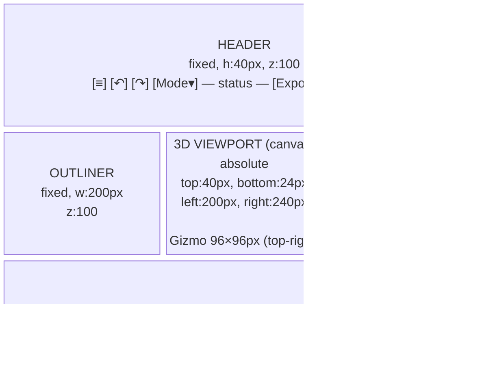
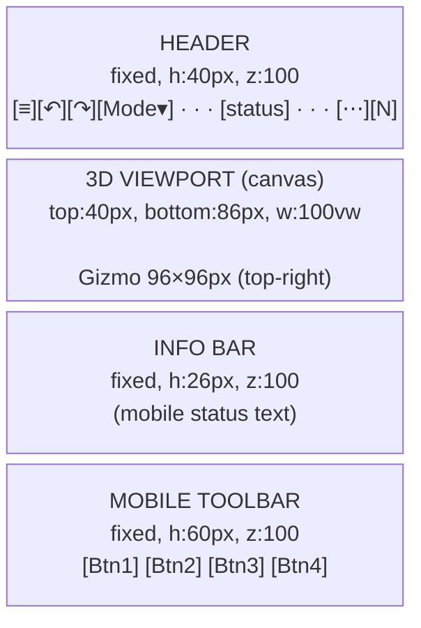

# Layout Design

Defines the placement, dimensions, and responsive behavior of UI components in easy-extrude.

> **When to update this document**
> - When changing the dimensions, position, or z-index of a component
> - When adding a new UI element (panel, drawer, modal, etc.)
> - When the number or order of slots in the mobile toolbar changes
> - When changing responsive breakpoints

---

## Responsive Breakpoints

| Category | Condition | Key Changes |
|----------|-----------|-------------|
| **Desktop** | `window.innerWidth >= 768` | Sidebars always visible, toolbar hidden |
| **Mobile** | `window.innerWidth < 768` | Sidebars become drawers, toolbar shown |

> Touch input detection uses `matchMedia('(pointer: coarse)')`.
> This is independent of the `innerWidth` size check.

---

## Desktop Layout


```mermaid
block-beta
  columns 3
  header["HEADER\nfixed, h:40px, z:100\n[≡] [↶] [↷] [Mode▾] — status — [Export][Import][Save]"]:3
  outliner["OUTLINER\nfixed, w:200px\nz:100"] viewport["3D VIEWPORT (canvas)\nabsolute\ntop:40px, bottom:24px\nleft:200px, right:240px\n\nGizmo 96×96px (top-right)"] npanel["N PANEL\nfixed, w:240px\nz:100"]
  statusbar["STATUS BAR\nfixed, h:24px, z:100 — key hints / operation guidance"]:3
```

### Component Dimensions (Desktop)

| Component | Size | Position | z-index |
|-----------|------|----------|---------|
| Header | w:100vw, h:40px | fixed top:0 left:0 | 100 |
| Outliner sidebar | w:200px, h:calc(100vh-64px) | fixed top:40px left:0 | 100 |
| N Panel sidebar | w:240px, h:calc(100vh-64px) | fixed top:40px right:0 | 100 |
| 3D Canvas | w:calc(100vw-440px), h:calc(100vh-64px) | absolute top:40px | 0 |
| Status bar | w:100vw, h:24px | fixed bottom:0 left:0 | 100 |
| Gizmo | w:96px, h:96px | fixed top:46px right:16px (+200px when N panel open, +280px when Context Inspector open — `_updateGizmoOffset()`) | 10 |
| Link Network Overlay | w:220px, h:SVG 152px (160px when 3+ hierarchy layers) + 28px header (collapsed:26px) | fixed bottom:34px left:188px (beside Outliner, above InfoBar); force-hidden during the Context demo. SVG cap 160px は元々 Map ツールバー下端との干渉を避ける値だった。ADR-103 でツールバーが消え左端は空いたが、cap 自体は 720px 高でのパネル収まり (原則 #26) として残す (ADR-048) | 50 |
| Projection toggle | w:128px, h:22px | fixed top:182px, right = gizmo offset (ADR-103 — ギズモ直下。右端の占有計算は `_updateGizmoOffset()` ただ 1 箇所が持つ, 原則 #26) | 10 (`Z.gizmo`) |
| Scene checks HUD (ADR-105 D1/D3) | w:auto (max-w:244px), h:auto | fixed top:46px left:188px (**左端の占有計算は `view/EdgeOccupancy.js` の `leftEdgeOffset()` ただ 1 箇所が持つ** — Link Network も同じ関数を引く, 原則 #26 / ADR-105 D6。上端は `belowHeaderOffset()`)。場の開閉と独立に常設 — `ctx.active` を読まない | 10 (`Z.gizmo`) |
| Discovery counters (ADR-105 D1) | w:auto, h:22px | ヘッダ内 (`Context ▾` の左隣)。desktop は `≈ conflicts / ⚑ on the floor / ◇ unowned`、mobile は glyph + 数のみ (`compact`)。**新しい端は食わない** — ヘッダの既存 flex 行に載る | 100 (Header) |
| Toast | w:auto, max-w:320px | fixed bottom:32px, centered | 150 |
| Onboarding tour card (ADR-065 Phase 6) | w:248px, h:auto | fixed bottom:38px left:192px (offset past Outliner 180px + InfoBar 26px — #26; toasts are bottom-center and never collide) | 100 |
| Context menu | w:auto | absolute (cursor position) | 200 |
| Mode dropdown | w:140px | absolute (below button) | 200 |

---

## Mobile Layout


```mermaid
block-beta
  columns 1
  header["HEADER\nfixed, h:40px, z:100\n[≡][↶][↷][Mode▾] · · · [status] · · · [⋯][N]"]
  viewport["3D VIEWPORT (canvas)\ntop:40px, bottom:86px, w:100vw\n\nGizmo 96×96px (top-right)"]
  infobar["INFO BAR\nfixed, h:26px, z:100\n(mobile status text)"]
  toolbar["MOBILE TOOLBAR\nfixed, h:60px, z:100\n[Btn1]  [Btn2]  [Btn3]  [Btn4]"]
```

**Drawers (overlay, not in main flow):**

- **Outliner Drawer** — slides in from left: `fixed top:40px bottom:0 left:0`, w:200px, z:110
- **N Panel Drawer** — slides in from right: `fixed top:40px bottom:0 right:0`, w:240px, z:110

### Component Dimensions (Mobile)

| Component | Size | Position | z-index |
|-----------|------|----------|---------|
| Header | w:100vw, h:40px | fixed top:0 left:0 | 100 |
| 3D Canvas | w:100vw, h:calc(100vh-126px) | top:40px | 0 |
| Info bar | w:100vw, h:26px | fixed bottom:60px left:0 | 100 |
| Mobile toolbar | w:100vw, h:60px | fixed bottom:0 left:0 | 100 |
| Outliner drawer | w:200px, h:calc(100vh-40px) | fixed top:40px left:0 | 110 |
| N Panel drawer | w:240px, h:calc(100vh-40px) | fixed top:40px right:0 | 110 |
| Toast | w:auto, max-w:280px | fixed bottom:**96px**, centered | 150 |
| Context menu | w:auto | absolute (tap position) | 200 |
| Gizmo | w:96px, h:96px | absolute top:48px right:8px | 50 |
| Link Network Overlay | w:220px, h:SVG 152–160px + 28px header | fixed bottom:94px left:8px | 50 |

> **Toast bottom** must be toolbar (60px) + margin (36px) = **96px**.
> On desktop (no toolbar): bottom:32px.
> **Link Network Overlay** on mobile: bottom above toolbar = 94px, left:8px (Outliner is a drawer);
> on desktop: bottom:34px (above 26px InfoBar), left:188px (beside 180px Outliner).

---

## Header Internal Layout

### Desktop
```
[≡] [↶↷] │ [Mode▾] │ ──flex:1── status ──flex:1── │ [Export] [Import] [Save/Load]
```

### Mobile
```
[≡] [↶↷] │ [Mode▾] │ visibility:hidden (flex:1 spacer) │ [⋯] [N]
```

- `_headerStatusEl` must use **`visibility:hidden`**, not `display:none`.
  → It must continue to function as a `flex:1` spacer. Using `display:none` breaks the layout.

---

## Mobile Toolbar Slot Design

The toolbar maintains a **fixed slot count** per state.
Empty slots are filled with `{spacer: true}` to prevent layout shifts.

| App State | Slot 1 | Slot 2 | Slot 3 | Slot 4 | Slot 5 |
|-----------|--------|--------|--------|--------|--------|
| grab.active | ✕ Cancel | Stack | — | ✓ Confirm | — |
| faceExtrude.active | ✓ Confirm | ✕ Cancel | — | — | — |
| **Object Mode** (no selection) | + Add | Edit (disabled) | Delete (disabled) | — | — |
| **Object Mode** (selection) | + Add | Edit | Delete | — | — |
| **Object Mode** (Frame selected) | Delete | Move | Rotate | — | — |
| Edit · 2D-Sketch | ← Object | — | — | Extrude (disabled) | — |
| Edit · 2D-Extrude | ✕ Cancel | — | — | ✓ Confirm | — |
| Edit · 3D | ← Object | Vertex | Edge | Face | Extrude (disabled*) |

`*` Extrude is enabled when a face is included in editSelection.

---

## z-index Hierarchy

```
z:200  ── Modal dialogs (rename, unit conversion)
        ── Dropdown menus (mode selector, ⋯ menu, add menu, context menu)

z:150  ── Toast notifications

z:110  ── Drawers (Outliner, N Panel) ← overlaps header
        ── Context demo Decision Card (ADR-047)

z:100  ── Header (fixed top)
        ── Mobile toolbar (fixed bottom)
        ── Status bar / Info bar (fixed bottom)
        ── Context demo Inspector / Story Bar (ADR-047)

z:50   ── Gizmo (overlay on Three.js canvas)

z:10   ── Three.js labels (MeasureLine distance labels)

z:0    ── 3D canvas (Three.js renderer)
```

---

## N Panel Internal Layout

```
┌─────────────────────────────────┐
│  [×] Close (mobile only)        │
├─────────────────────────────────┤
│  ITEM  Property Group           │
│  ─────────────────────────────  │
│  Name:                          │
│  ┌───────────────────────────┐  │
│  │ Cube                      │  │
│  └───────────────────────────┘  │
│  Description:                   │
│  ┌───────────────────────────┐  │
│  │                           │  │
│  └───────────────────────────┘  │
├─────────────────────────────────┤
│  TRANSFORM  ─────────────────── │
│  Location (World):              │
│  X: [  1.00]  Y: [  0.00]      │
│  Z: [  0.00]                    │
│  Rotation (RPY, deg):           │
│  R: [  0.0]  P: [  0.0]        │
│  Y: [  0.0]                     │
└─────────────────────────────────┘
```

- Numeric fields are read-only (not directly editable)
- N Panel width: 240px
- Group headings: `font-size:11px, opacity:0.6`

---

## Outliner Internal Layout

```
┌─────────────────────────────────┐
│  SCENE HIERARCHY                │
├─────────────────────────────────┤
│  □ Cube           [○] [✕]      │  ← Solid
│  □ Cube.001       [○] [✕]      │  ← Solid
│    ├ ⊕ Origin    [○] [✕]      │  ← CoordinateFrame (indent 12px)
│    └ ⊕ Frame.001 [○] [✕]      │  ← CoordinateFrame (indent 12px)
│  ⊡ Sketch.001     [○] [✕]     │  ← Profile
│  ── Measure.001   [○] [✕]     │  ← MeasureLine
│  ▲ Import.001     [○] [✕]     │  ← ImportedMesh
└─────────────────────────────────┘
```

- Icon legend: `□` Solid / `⊡` Profile / `──` MeasureLine / `⊕` CoordinateFrame / `▲` ImportedMesh
- Indent: CoordinateFrame indented 12px under its parent
- Row height: 28px
- Active row: `background: #3d3d6b`

---

## Context DSL Demo Overlay (ADR-047)

| Component | Position | Dimensions |
|-----------|----------|------------|
| Context Inspector (tutorial, ADR-047) | `fixed; left:0; right:0; bottom:<EdgeOccupancy FLOOR>` | height 260px desktop / 220px mobile — **the same container as the production floor** (ADR-106 D2) |
| Context Layer (ADR-050 — production negotiation / authoring / region ghost) | `fixed; left:0; right:0; bottom:<EdgeOccupancy FLOOR>; z:85` (full-width bottom panel, above the InfoBar) | height 260px desktop / 220px mobile. All three `context.mode`s (negotiate/author/ghost) share this one container. The tab row is width-driven, not `flex:1` |
| Document intake (ADR-106 D3 — **provisional** until ADR-108) | `fixed; top:40px; left:0; bottom:<EdgeOccupancy DOCK>; z:120` | width 420px desktop / full-width mobile. Transient overlay (like the Template Gallery), so it does NOT join the edge budget |
| Template Gallery (ADR-051 Phase 2 — starter-template picker) | `fixed; inset:0` centred modal over a `rgba(0,0,0,0.6)` backdrop; **z-index 300** (above all edge panels — transient, PHILOSOPHY #26) | dialog `width: min(720px, 92vw); max-height: 86vh`; category-grouped card grid `repeat(auto-fill, minmax(200px, 1fr))` |
| Grasp Search panel (ADR-057 placement — UI→DSL→BFF→grasp-search verification) | A **section inside `NPanel`**, beside the selected robot (ADR-105 D5 / ADR-106 D3). It was the `'grasp'` tab of the floor, which meant a single-owner question was routed through the room built for multi-owner ones. Rides the existing right dock, so **no new edge footprint / no `_updateGizmoOffset` term** (PHILOSOPHY #26) | weights/topN input row + Run button + status line + ranked candidate cards (boolean chips + `objectiveScores` bars + client sort + `selectedRank` highlight) |
| Parametric asset viewer (ADR-063 Phase 4) | Catalog = the **Assets group of the AddMenu**; sliders = a section inside `NPanel` (ADR-106 D3 — shaping a jig is modelling) | one slider per parameter + commit preview |
| Decision Card | `fixed; right:12px; top:56px` — top-anchored so it never covers the ghost-collapse animation or the StoryBar ✕; shown at step ④ only. The `292px` dodge is gone with the 280px slot (ADR-106 D2) | width 320px max |
| Story Bar | `fixed; left:50%; bottom:<EdgeOccupancy FLOATING>` | `min(620px, 100vw − 24px)` |
| Uncertainty ghost label | HTML overlay, projected via `SceneView.activeCamera` | z-index 50 (Three.js label tier) |

Demo colors: uncertainty amber `#d5a23a`, decision blue `#3a7bd5`, reveal ripple green `#10b981`.

**左端の占有 (ADR-105 D6):** 左端に張り付く要素は 2 つになった (Link Network Overlay と
Scene checks HUD)。占有オフセットの計算は **`src/view/EdgeOccupancy.js`** ただ 1 箇所が持ち、
両者がそれを引く — `188px` の literal を 2 箇所目に書いた瞬間が原則 #26 の違反になるので、
2 つ目の占有者が生まれる PR で literal を関数へ昇格させた。右端の所有者
(`AppController._updateGizmoOffset()`) と分かれているのは、右端が N パネル / Inspector の
**開閉で動く**のに対し左端と上端は動かないため — 所有者は端ごとに 1 つであればよく、
全端で 1 つである必要はない。

**右端の占有 (ADR-106 D2):** 右端 `right:0` の**常設は N パネル 200px ただ 1 つ**である。
かつて 3 者 (N パネル / production の場 / チュートリアル Inspector) が同じ端を要求し、
互いに知らない 3 つの回避策 — ずらす (`NPanel` の `inspectorOpen` シフト)・消す
(`ContextController` の排他 7 箇所)・被せる (場の `z:100` がギズモと投影トグルを隠す) —
が当たっていた。280px スロットの退役でその 3 つは**書く理由を失った**。
世界ギズモの占有式は `16 + 200·(nPanelVisible)` の **2 項**で、`280` の項は無い
(所有者は `AppController._updateGizmoOffset()` ただ 1 つ)。個数は
`src/FloorContainerCensus.test.js` が構文から数える。

**下端の占有 (ADR-106 D6):** 下端も共有資源であり、右端で起きたことを繰り返さないため
**器を移す前に**所有者を置いた。占有量の計算は `src/view/EdgeOccupancy.js` の
`bottomEdgeOffset({ isMobile, tier, floorOpen })` ただ 1 箇所。下端は占有物が
**積み重なる**ので 1 つの数ではなく**段の関数**になっており、段は `BOTTOM_TIER` に
列挙して**未宣言の段では throw する** (原則 #31):

| 段 | 誰が名乗るか | 場が開いたとき |
|---|---|---|
| `above-infobar` | モバイルツールバー | 動かない (InfoBar は下端の基準 — 位置も高さも変えない) |
| `floor` | 場の器そのもの (production / tutorial) | 自分の高さは数えない |
| `dock` | Outliner · N パネル · 文書の入口 | 場の高さだけ退く |
| `floating` | LINK NETWORK · StoryBar · TourCard | 同上 + 余白 |
| `toast` | Toast | 同上 + 中央下の帯 (StoryBar / 場のヘッダ) の予約分 |

場は 3D を**覆わない** (`d_ref` は空間量なので隠して交渉できない)。覆うなら場ではなく
モーダルであり、それは v1 で却下済み。
See CODE_CONTRACTS §3 "Edge-Anchored Panels Must Coordinate Occupancy".

---

## Color Palette

The token column is pinned equal to `COLOR` in `src/theme/tokens.js` by the
drift test `src/theme/tokens.test.js` (ADR-065 Phase 0 — same mechanism as the
ADR-064 schema drift tests). One row = one token = one hex. Rows without a
token (`—`) are outside the token vocabulary (e.g. Three.js material presets).

**Names are roles, not values (ADR-100).** A token is named after what it
REPORTS, never after its hue — `fxGreen` could not survive its own colour
changing, `factTone` can. Adding a colour starts with "what state does this
report?"; a colour with no state to report should be neutral.

**Saturation is spent on state (ADR-100 G1).** The entity default is neutral so
that "carries colour" and "carries meaning" are the same set on screen. The
ground (backdrop, grid) is unchanged from ADR-067 — it was the FIGURE that moved
to neutral, not the ground.

**One meaning, one colour (ADR-100 G2).** `accent` is the only colour for "this
is what you are operating on". It replaced four (Outliner salmon, `accent`
blue-violet, indicator cyan, CF origin gold). The reverse rule holds too: two
meanings never share a hue, machine-checked over `STATE_TOKENS` at
`COLOR_RULES.minHueSeparationDeg`.

**Using a colour is checked too, not just declaring one (ADR-100 G3).** The old
rule — "migrate any line you touch" — was never asked at the moment of writing.
`tokens.test.js` now counts hex literals living OUTSIDE this vocabulary and
fails when that count goes up. Colours that carry DATA meaning (link types,
personas, node types, IFC classes) are declared out of scope in
`src/theme/semantic.js` and excluded from that count by name.

| Usage | Token | Color |
|-------|-------|-------|
| Background (header, panels) | `surface` | `#242424` |
| Background (recessed) | `surfaceSunken` | `#2b2b2b` |
| Background (buttons, raised) | `surfaceRaised` | `#383838` |
| Border | `border` | `#4a4a4a` |
| Text (primary) | `textPrimary` | `#e0e0e0` |
| Text (secondary — lifted from `#888888` for WCAG AA, ADR-100) | `textSecondary` | `#9a9a9a` |
| Scene backdrop, top stop (ADR-067) | `backdropTop` | `#262a4a` |
| Scene backdrop, mid stop / flat pre-stage | `backdropMid` | `#1a1a2e` |
| Scene backdrop, deep stop | `backdropDeep` | `#0e0e18` |
| Ground grid, major lines | `gridMajor` | `#444466` |
| Ground grid, minor lines | `gridMinor` | `#222244` |
| **Entity default body — neutral, no state to report (ADR-100 G1)** | `entityDefault` | `#b9bcc0` |
| **Selection / active / focus — the only colour for it (ADR-100 G2)** | `accent` | `#ff7d2e` |
| Selected-row ground (same meaning, lower strength) | `accentSoft` | `#4a2c18` |
| Feedback — a result is settled (ADR-062, was `fxGreen`) | `factTone` | `#22c55e` |
| Feedback — seed / example / take care (ADR-058, was `fxAmber`) | `cautionTone` | `#d9b23c` |
| Feedback — a decision landed (ADR-047/065, was `fxBlue`) | `infoTone` | `#3a7bd5` |
| Reveal ripple — something came into view (ADR-047, was `fxReveal`) | `revealTone` | `#0dbd97` |
| Snap lock — a constraint engaged (ADR-065 Phase 2, was `fxSnap` orange) | `snapTone` | `#a86ceb` |
| Destructive (Delete, was `danger`) | `dangerTone` | `#c04040` |
| Confirmed (Confirm, was `success`) | `successTone` | `#3a7a3a` |
| Measure line (was `#f5a623` declared / `#f9a825` drawn — one meaning, two sources) | `measure` | `#1fb6d6` |
| CoordinateFrame axis X (ROS REP-103 — never re-tuned here) | `axisX` | `#e05252` |
| CoordinateFrame axis Y (ROS REP-103) | `axisY` | `#52e052` |
| CoordinateFrame axis Z (ROS REP-103) | `axisZ` | `#5252e0` |
| Stage glow / rim light — atmosphere, not state (ADR-067) | `stageGlow` | `#4fc3f7` |
| 3D face highlight | — | Yellow (Three.js material) |

### Why `snapTone` and `measure` moved hue

`accent` is orange, and the wheel around 20–40° was already crowded: snap
(`#ff9800`, 36°), measure (`#f9a825`, 38°) and caution (`#d5a23a`, 40°) all sat
within 16° of it. "One hue, one meaning" is a rule, so something had to move.
Danger keeps red and caution keeps yellow (both culturally locked); snap and
measure have no such anchor, so they moved — measure to cyan, which is the
conventional CAD dimension colour and which the retired indicator cyan vacated.

Today's tightest pair is `successTone` ↔ `factTone` at ~22°, against a 20°
budget. A new state colour must find ~20° of clear wheel or displace an existing
meaning; that cost is deliberate.

---

## Animations & Transitions

Durations are tokenised in `src/theme/tokens.js` `DURATION` (ADR-065 Phase 0).
All transient 3D effects run through `MotionGovernor` (budget 8, reduced-motion
→ static held cue — ADR-065 Phase 1).

| Element | Animation | Duration |
|---------|-----------|----------|
| Drawer slide in/out | `transform: translateX()` | 200ms ease (`drawer`) |
| Dropdown show/hide (Context ▾ / ⋯ menus) | `eaChromeEnter` slide-fade on open / none when reduced (ADR-065 Phase 3) | 180ms (`chromeEnter`) |
| Toast appear | `eaChromeEnter` slide-fade / in place when reduced (ADR-065 Phase 3) | 150ms (`toastIn`) |
| Toast disappear | after 5000ms: `opacity: 1 → 0` | 300ms (`toastOut`) |
| Button hover (header chrome) | `background`/`border` brighten + 1px lift (`tierAMotion`); colour only when reduced | 150ms (`hover`) |
| Button press (chrome, Tier A) | scale 0.94 down / spring back (`EASING.spring`); none when reduced | 90ms down (`press`), 260ms back (`pressRelease`) |
| Active tool glow (mobile toolbar) | `eaBreatheGlow` breathing box-shadow / static midpoint glow when reduced | 2600ms loop (`breathe`) |
| Locked control (disabled-as-quest, ADR-065 rule 5) | static: dashed border + `cursor:help`; tap prints the gate reason as a toast | — |
| Info-bar hints swap (mode change) | `eaChromeEnter` slide-fade of the new hint set / in place when reduced | 180ms (`chromeEnter`) |
| Proof-feedback landing flash (DOM, ADR-062) | keyframe fade / static tint when reduced | 700ms (`flash`) |
| Link-acceptance ripple (3D) | wireframe sphere expand 1×→4× + fade | 600ms (`ripple`) |
| Lifecycle voxel — materialize (3D, ADR-065 Phase 2 volume revision) | green voxel shell converges onto the appearing entity with a deterministic glitch flicker, then evaporates (`fxGreen`, `voxelFrame` curve); static held shell when reduced | 520ms (`voxelMaterialize`) |
| Lifecycle voxel — dissolve (3D) | cyan voxel fragments scatter outward, tumble, shrink and fade (`accentActive`); static held shell when reduced. Pose ops (Move / Rotate / Face Extrude + their undo/redo) render NOTHING — silent by the volume design | 700ms (`voxelDissolve`) |
| Celebration burst (DOM, ADR-065 Phase 4) | `eaCelebrateBanner` pop + `eaCelebrateParticle` radial fan / static glowing banner, no particles when reduced | 1600ms (`celebration`) |
| Celebration field (3D, ADR-065 Phase 4) | InstancedMesh radial particle burst (`particleFrame` curve) / frozen mid-burst cue when reduced | 1600ms (`celebration`) |
| Grasp three-beat reveal (3D, ADR-065 Phase 5) | committed select: approach slide → finger close → neutral→score colour flood + caption (`revealFrame`); hover previews and reduced motion jump to the final stage | 900ms total (`REVEAL_TIMELINE` 400/240/260) |
| Region-conflict resolve (3D, ADR-065 Phase 5) | old gap band recolours red→green then dissolves (`resolveFrame`, `RegionResolveEffect` via MotionGovernor); the rebuilt settled state renders instantly underneath / static settled-green cue when reduced | 700ms (`regionResolve`) |
| Uncertainty band collapse (3D, ADR-047 + ADR-065 Phase 5) | band condenses onto the nominal while the two extreme wireframes converge onto it; reduced motion snaps immediately and holds a static shell (onSnapped fires at once) | 800ms + 250ms fade (view constants) |
| Onboarding tour card entry (ADR-065 Phase 6) | `eaChromeEnter` slide-fade keyed per quest advance / in place when reduced; the "+ Add" anchor pulse reuses `eaBreatheGlow` (static midpoint glow when reduced) | 180ms (`chromeEnter`) / 2600ms loop (`breathe`) |
| Map annotation entry (3D, ADR-093) | every new annotation pops in on `easeOutBack` scale × `easeOutCubic` opacity (re-armed on the undo of a soft delete) / in place when reduced | 280ms (`ENTRY_POP`) |
| Map Hub ping (3D, Tier A, ADR-093) | a train of 2 rings, `easeOutCubic` radius against a `(1-p)³` alpha tail (brightest while small), over a two-frequency core/halo breathe. **Phase per entity** (`phaseFor(entityId)`) so no two Hubs ping together / one parked ring when reduced | 2600ms loop (`HUB_PING_PERIOD`), 700ms when tact-violated |
| Map Anchor datum (3D, Tier A, ADR-093) | graduated survey crosshair + 45° datum square; a long HOLD then a short overshoot re-seat (stillness is the assertion) / still crosshair when reduced | 4200ms loop (`ANCHOR_PERIOD`), 1000ms when tolerance-violated |
| Map Route flow (3D, Tier A, ADR-093) | 5 comet heads + 3 tapering trail beads each, ONE InstancedMesh, additive; bounded positional wobble (never speed offsets — those integrate and bunch) / beads parked at spawn offsets when reduced | continuous (0.20 length/s) |
| Map Boundary hatch (3D, Tier A, ADR-093) | perpendicular hatch ticks with a crest travelling along the wall (per-tick vertex colour, no allocation); replaces ADR-031 §8's deliberate stillness / uniform mid intensity when reduced | 5200ms sweep + 0.30 units/s dash march |
| Map Zone area (3D, Tier A/D, ADR-093) | drifting diagonal drafting hatch (pitch from the region's own bbox) + `breathe()` fill (0.16–0.46, seamless sin²) + 2 rim rings on `easeOutCubic` radius, all on the entity's own phase; L corner ticks are static / frozen hatch + mid-band fill + one held rim when reduced | 6400ms fill loop, 3000ms rim loop |

---

## Related Documents

- `docs/SCREEN_DESIGN.md` — per-screen information architecture
- `docs/STATE_TRANSITIONS.md` — state transitions
- `docs/adr/ADR-023-mobile-input-model.md` — mobile input model
- `docs/adr/ADR-024-mobile-toolbar-architecture.md` — mobile toolbar architecture
- `.claude/mental_model/3_ui_layout.md` — UI layout coding rules
