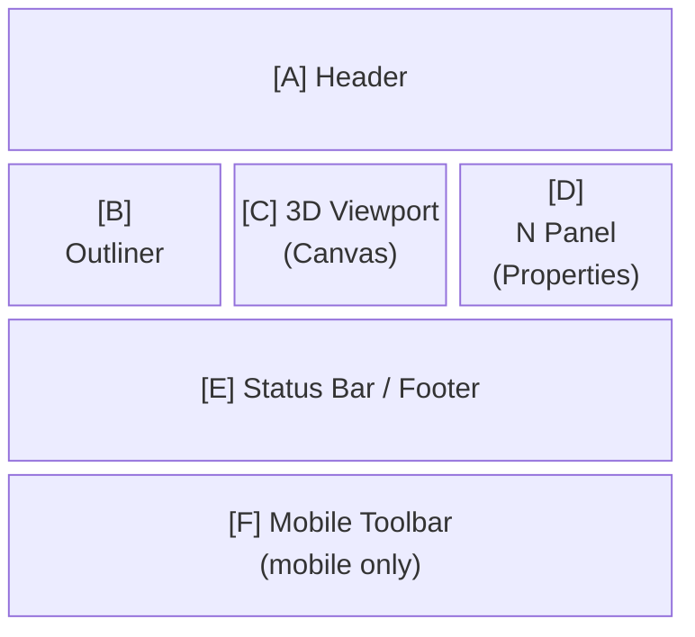

# Screen Information Architecture

Defines the structure and content of information displayed on each screen of easy-extrude.

> **When to update this document**
> - When adding a new mode or sub-state
> - When the toolbar, status bar, or N panel content changes in an existing mode
> - When adding a new entity type that changes the N panel or Outliner display
> - When a difference arises between mobile and desktop

---

## Screen List

| Screen ID | Name | Transition Condition |
|-----------|------|---------------------|
| `S-01` | Object Mode (no selection) | On startup / Escape / Tab |
| `S-02` | Object Mode (object selected) | Click on object |
| `S-03` | Object Mode (CoordinateFrame selected) | Click on CoordinateFrame |
| `S-04` | Edit Mode · 2D Sketch | Select Profile + Tab |
| `S-05` | Edit Mode · 2D Extrude | Confirm Sketch → Enter |
| `S-06` | Edit Mode · 3D (Solid editing) | Select Solid + Tab |
| `S-06b` | Edit Mode · 1D (MeasureLine endpoint drag) | Select MeasureLine + Tab |
| `S-07` | Grab in progress | G key / long press |
| `S-08` | Face Extrude in progress | Edit 3D + select face + E key |
| `S-09` | Measure placement in progress | M key |
| `S-10` | Rect selection in progress (desktop only) | Drag on empty space |
| `S-17` | Context DSL Demo overlay (ADR-047) | Header **Demo** button / `?demo=context` / `window.__easyExtrude.demoContext()` |
| `S-18` | Onboarding tour quest card (ADR-065 Phase 6, desktop only) | First run on a fine pointer (no `ee_tour` localStorage flag); advances from scene facts; suppressed while any Context/demo/gallery overlay is active |
| `S-19` | Home / Launch screen (ADR-089) | On startup when no `ee_home='skip'` flag; reopened via Header **Layout gallery** slot |

---

## Information Area Definitions

Each screen is composed of the following information areas.



**Disabled controls (all screens, ADR-065 Phase 3 "disabled-as-quest")**: a
`disabled` toolbar/header button renders as a stylized *locked* state (dashed
border, legible label, `cursor:help`) instead of the former mute
`opacity:0.35`. Tapping/clicking a locked control shows the unmet gate
condition as an info toast (e.g. "Select an object first", "The Origin frame
is fixed to its Solid") — the reason and the disable flag derive from the
SAME gate-predicate return value (`src/view/ChromeGates.js`); a silent
disabled tap is unrepresentable (PHILOSOPHY #11/#25). The per-screen toolbar
tables below list *which* slots are disabled; the reason wording lives in the
gate module.

**[G] Link Network Overlay** (auto-visible, all Object/Edit screens):
bottom-left panel shown automatically while the scene contains at least one
SpatialLink; hidden when none exist and force-hidden during the Context demo
(S-17). Content (ADR-048): a deterministic layered hierarchy — layer 0 = root
entities (Solid / annotations, color-coded by type), lower layers = CFs under
their parent; faint solid lines = parent-child structure; colored dashed
marching-ants lines (+ arrowhead when directed) = SpatialLinks per
semanticType; same-layer links bow into a bezier. Clicking a node selects the
entity in the viewport; crowded rows show labels only for the selection.
Dimensions / position → `LAYOUT_DESIGN.md`.

---

## Per-Screen Information Definitions

### S-01: Object Mode (no selection)

#### [A] Header
| Element | Content |
|---------|---------|
| Mode selector | `Object Mode ▾` |
| Status | (empty) |
| Header actions | Save / Load / Nodes (desktop, BFF 接続時のみ) / Export / Import / Demo (desktop) / `⋯` menu (mobile) |

#### [B] Outliner
- Lists all objects in the scene
- Each row: icon + name + visibility toggle
- Active row: highlighted
- CoordinateFrames displayed indented under their parent object

#### [C] 3D Viewport
- Shows the ground grid plane (Z=0)
- Displays all object meshes (no selection)
- Top-right: Axis gizmo (mini-axis with X/Y/Z labels)
- Entity identity labels (ADR-070): Solid/Profile/ImportedMesh carry a floating
  HTML name label, disclosed on **selection/hover** (staged — never always-on);
  an assigned IFC class adds a `· Class` badge, colours the accent bar, and
  tints the mesh base colour. CF labels show `⌖ name` (+ RPY readout while
  selected). Shared `EntityLabel` helper; screen-space sizing (#27).

#### [D] N Panel
- Empty (no object selected; hidden or blank)

#### [E] Status Bar
```
G = Grab   M = Measure   Shift+A = Add   Ctrl+Z = Undo
```

#### [F] Mobile Toolbar
| Slot | Button | State |
|------|--------|-------|
| 1 | + Add | enabled |
| 2 | Edit | disabled |
| 3 | Delete | disabled |

---

### S-02: Object Mode (object selected)

#### [A] Header
| Element | Content |
|---------|---------|
| Mode selector | `Object Mode ▾` |
| Status | Object name (desktop: in header center; mobile: `visibility:hidden` to preserve spacer) |

#### [B] Outliner
- Selected object row highlighted

#### [C] 3D Viewport
- White bounding box (`boxHelper`) on selected object
- Selected object's CoordinateFrame shown in X-ray

#### [D] N Panel
| Field | Content |
|-------|---------|
| Name | Text input (editable on double-click) |
| Description | Textarea |
| Location (World) | X / Y / Z (read-only numbers) |
| Rotation (RPY) | R / P / Y, unit: deg (read-only, ZYX Euler order) |

#### [E] Status Bar
```
R = Rotate   G = Grab   Tab = Edit   Shift+D = Duplicate   X = Delete   M = Measure
```

#### [F] Mobile Toolbar
| Slot | Button | State |
|------|--------|-------|
| 1 | + Add | enabled |
| 2 | Edit | enabled |
| 3 | Delete | enabled |

---

### S-03: Object Mode (CoordinateFrame selected)

#### [D] N Panel
| Field | Content |
|-------|---------|
| Name | Text input |
| Location (Local) | X / Y / Z (local coordinates) |
| Rotation (RPY) | R / P / Y, unit: deg (ZYX Euler order) |

#### [E] Status Bar
```
R = Rotate   G = Grab   Delete   Shift+A = Add Frame
```

#### [F] Mobile Toolbar
| Slot | Button | State |
|------|--------|-------|
| 1 | Rotate | enabled |
| 2 | Grab | enabled |
| 3 | Delete | enabled |
| 4 | Add Frame | enabled |
| 5 | (spacer) | — |

---

### S-04: Edit Mode · 2D Sketch

#### [C] 3D Viewport
- Shows rectangle preview on the ground plane (while dragging)
- Yellow marker shown when a snap point is available

#### [D] N Panel
| Field | Content |
|-------|---------|
| Name | Object name |
| Area | Rectangle area (m²) |

#### [E] Status Bar
```
Drag to draw a rectangle. Enter to extrude.
```

#### [F] Mobile Toolbar
| Slot | Button | State |
|------|--------|-------|
| 1 | ← Object | enabled |
| 2 | Extrude | disabled (enabled when area > 0.01) |

---

### S-05: Edit Mode · 2D Extrude

#### [C] 3D Viewport
- Sketch rectangle locked at the base
- Preview cuboid shown at current height
- Extrusion distance label overlaid in 3D space

#### [D] N Panel
| Field | Content |
|-------|---------|
| Name | Object name |
| Height | Extrusion height (m, editable) |

#### [E] Status Bar
```
Height: 1.00 m   Enter to confirm / Escape to cancel
```

#### [F] Mobile Toolbar
| Slot | Button | State |
|------|--------|-------|
| 1 | ✓ Confirm | enabled |
| 2 | ✕ Cancel | enabled |

---

### S-06: Edit Mode · 3D (Solid editing)

#### [C] 3D Viewport
- Sub-elements (vertices / edges / faces) change color on hover and selection:
  - Hovered face: light cyan highlight
  - Selected face: deep cyan
  - Vertex: yellow sphere
  - Edge: yellow line

#### [D] N Panel
| Field | Content |
|-------|---------|
| Name | Object name |
| Sub Mode | Vertex / Edge / Face |
| Selected | Selected sub-element name / count |

#### [E] Status Bar
```
1 = Vertex   2 = Edge   3 = Face   E = Extrude   Ctrl = Snap
```

#### [F] Mobile Toolbar
| Slot | Button | State |
|------|--------|-------|
| 1 | ← Object | enabled |
| 2 | Vertex | enabled / active emphasis |
| 3 | Edge | enabled / active emphasis |
| 4 | Face | enabled / active emphasis |
| 5 | Extrude | disabled (enabled when face selected) |

---

### S-06b: Edit Mode · 1D (MeasureLine endpoint drag)

#### [C] 3D Viewport
- Endpoint spheres turn **green** (`#69f0ae`) on hover
- Dragging snaps to a camera-facing plane through the dragged endpoint

#### [E] Status Bar
```
Tab = Object Mode   Drag endpoint = Reposition   Esc = Object Mode
```
Hover text: `Endpoint 1 — Drag to reposition`

#### [F] Mobile Toolbar
| Slot | Button |
|------|--------|
| 1 | ← Object |
| 2–4 | (spacer) |

---

### S-07: Grab in progress

#### [C] 3D Viewport
- Object follows cursor movement
- Axis lock active: red/green/blue line along the constrained axis
- Stack assist (default ON, ADR-071): object rests on the surface below — another
  object or the ground plane (Z=0); an explicit Z-axis lock suspends the assist
- Ctrl snap: yellow marker on snap target

#### [D] N Panel
| Field | Content |
|-------|---------|
| Axis | X / Y / Z / Free |
| Snap | Off / Geometry |
| Stack | On (default) / Off |
| Delta | Δx, Δy, Δz (current displacement) |

#### [E] Status Bar
```
X/Y/Z = Axis lock   V = Pivot select   Ctrl = Snap   S = Free place (stack off)   Enter = Confirm
```
Stack-off shows `Free (S: stack)`; dragging below grade fires a one-shot warning
toast (never a clamp — footings/piles stay possible, ADR-071).

#### [F] Mobile Toolbar
| Slot | Button | State |
|------|--------|-------|
| 1 | ✓ Confirm | enabled |
| 2 | Stack | enabled |
| 3 | ✕ Cancel | enabled |

---

### S-08: Face Extrude in progress

#### [C] 3D Viewport
- Preview of selected face extruding along its normal
- Extrusion distance label overlaid
- Ctrl snap: yellow marker on snap target

#### [D] N Panel
| Field | Content |
|-------|---------|
| Face | Selected face name |
| Distance | Extrusion distance (m) |

#### [E] Status Bar
```
Distance: 0.50 m   Ctrl = Snap   Enter = Confirm / Escape = Cancel
```

#### [F] Mobile Toolbar
| Slot | Button | State |
|------|--------|-------|
| 1 | ✓ Confirm | enabled |
| 2 | ✕ Cancel | enabled |

---

### S-09: Measure placement in progress

#### [C] 3D Viewport
**Phase 1 (p1 not yet confirmed)**
- Yellow marker on snap candidate near cursor

**Phase 2 (p1 confirmed)**
- p1 marker (fixed)
- p2 candidate marker (live tracking)
- Preview line between p1–p2 with distance label

#### [E] Status Bar
```
Snap to vertex/edge/face. Click to confirm / Escape to cancel.
```

---

### S-10: Rect selection in progress (desktop only)

#### [C] 3D Viewport
- Semi-transparent blue rectangle overlay (follows drag)
- Objects inside the rectangle are highlighted

#### [E] Status Bar
```
Drag to multi-select
```

---

## Information Priority Definitions

Priority of information in each area (highest user attention → lowest):

1. **3D Viewport** — real-time feedback (highest priority)
2. **Status Bar / Header Status** — operation guidance
3. **Toolbar** — available actions
4. **N Panel** — precise numeric information
5. **Outliner** — scene structure overview

---

## Mobile Information Differences

| Information Area | Desktop | Mobile |
|-----------------|---------|--------|
| Export / Import | Header buttons | `⋯` dropdown |
| Header status | Center of header | `visibility:hidden` (preserves spacer) |
| Status string | In header | Footer (`_infoEl`) |
| Outliner | Always visible (left sidebar) | Drawer opened via hamburger menu |
| N Panel | Always visible (right sidebar) | Drawer opened via N button |
| Toolbar | Hidden | Fixed at bottom, 86px tall |
| Context menu | Right-click | Long press (400ms+, movement < 8px) |

---

---

## Lynch Urban Object Screens (planned — ADR-026)

The three new 2D entity types (`UrbanPolyline`, `UrbanPolygon`, `UrbanMarker`)
follow the same Object Mode screen structure as existing entities.  This section
documents the **planned** UX differences from S-02 (Object Mode, object selected).

> These screens are not yet implemented.  Rendering layer (Phase 1) is required
> first.  See `docs/ROADMAP.md` — Lynch Urban Elements Phase 1–3.

---

### S-11: Object Mode (UrbanPolyline selected)

#### [B] Outliner
- Icon: `⟿` (linear path icon) in Lynch color (`#4A90D9` for Path, `#E74C3C` for Edge)
- Lynch class badge displayed when `lynchClass` is set (same position as IFC badge)

#### [C] 3D Viewport
- Bounding box (`boxHelper`) on selected entity
- Polyline rendered as thick colored line (Lynch color); unclassified = grey

#### [D] N Panel

| Field | Content |
|-------|---------|
| Name | Text input |
| Description | Textarea |
| **Lynch Class** | Coloured badge (`Path` / `Edge`) or "Not set" (muted grey) |
|  | `Set / Change` button → opens Lynch picker (filtered to `geometry = 'polyline'`) |
|  | `✕` button → clears classification |
| Vertex count | N vertices (read-only) |

**Lynch Class picker (polyline filter):**
Shows only `Path` and `Edge` entries from `LynchClassRegistry`.
Each row: colored square + label + description.

#### [E] Status Bar
```
G = Grab   X = Delete   Lynch class: Path / Edge
```

#### [F] Mobile Toolbar
| Slot | Button | State |
|------|--------|-------|
| 1 | Grab | enabled |
| 2 | Lynch | enabled (opens Lynch class picker) |
| 3 | Delete | enabled |
| 4 | (spacer) | — |

---

### S-12: Object Mode (UrbanPolygon selected)

#### [B] Outliner
- Icon: `⬡` (hexagon — areal region) in Lynch color (`#27AE60` for District)
- Lynch class badge when classified

#### [C] 3D Viewport
- Bounding box on selected entity
- Polygon rendered as thick colored closed ring + translucent fill; unclassified = grey

#### [D] N Panel

| Field | Content |
|-------|---------|
| Name | Text input |
| Description | Textarea |
| **Lynch Class** | Coloured badge (`District`) or "Not set" |
|  | `Set / Change` button → opens Lynch picker (filtered to `geometry = 'polygon'`) |
|  | `✕` button → clears classification |
| Vertex count | N vertices (read-only) |
| Area (approx.) | Signed XY area m² (read-only, Shoelace formula) |

**Lynch Class picker (polygon filter):**
Shows only `District`.

#### [E] Status Bar
```
G = Grab   X = Delete   Lynch class: District
```

#### [F] Mobile Toolbar
| Slot | Button | State |
|------|--------|-------|
| 1 | Grab | enabled |
| 2 | Lynch | enabled |
| 3 | Delete | enabled |
| 4 | (spacer) | — |

---

### S-13: Object Mode (UrbanMarker selected)

#### [B] Outliner
- Icon: `⬤` (filled circle — point marker) in Lynch color (`#F39C12` Node, `#9B59B6` Landmark)
- Lynch class badge when classified

#### [C] 3D Viewport
- Bounding box on selected entity
- Marker rendered as colored sprite/circle with label; unclassified = grey

#### [D] N Panel

| Field | Content |
|-------|---------|
| Name | Text input |
| Description | Textarea |
| **Lynch Class** | Coloured badge (`Node` / `Landmark`) or "Not set" |
|  | `Set / Change` button → opens Lynch picker (filtered to `geometry = 'marker'`) |
|  | `✕` button → clears classification |
| Location (World) | X / Y / Z (read-only) |

**Lynch Class picker (marker filter):**
Shows `Node` and `Landmark`.

#### [E] Status Bar
```
G = Grab   X = Delete   Lynch class: Node / Landmark
```

#### [F] Mobile Toolbar
| Slot | Button | State |
|------|--------|-------|
| 1 | Grab | enabled |
| 2 | Lynch | enabled |
| 3 | Delete | enabled |
| 4 | (spacer) | — |

---

### S-14: 2D Map Mode — No Active Tool (Pan / Zoom)

Entered from the **Map** button in the header or from the mobile toolbar of a selected Urban entity.

#### [C] Viewport (Orthographic Top-Down)
- Full-screen orthographic camera looking straight down along −Z
- Existing 3D objects and Urban entities visible from above
- Ground-plane grid visible
- OrbitControls disabled; custom 2D pan/zoom active

#### [G] Left Map Toolbar (desktop)
| Button | Color | Tooltip |
|--------|-------|---------|
| ⟿ (Path) | #4A90D9 | Path (Linear) |
| ⟿ (Edge) | #E74C3C | Edge (Boundary) |
| ⬡ (District) | #27AE60 | District (Area) |
| ⬤ (Node) | #F39C12 | Node (Junction) |
| ⬤ (Landmark) | #9B59B6 | Landmark (Point) |
| ← | #aaa | Exit Map Mode |

All type buttons toggle the active drawing tool.

#### [E] Status Bar
```
Map Mode — select a Lynch type on the left to start drawing
```

#### [F] Mobile Toolbar (1 slot used)
| Slot | Button |
|------|--------|
| 1 | ← Exit Map |
| 2–4 | (spacers) |

#### Interaction
| Input | Action |
|-------|--------|
| Left-drag (no tool) | Pan camera |
| Middle-drag | Pan camera |
| Scroll wheel | Zoom in/out (frustumSize ±15%) |
| ESC (no tool) | Exit map mode |

---

### S-15: 2D Map Mode — Drawing (Polyline / Polygon)

Active when a Path, Edge, or District tool is selected in the map toolbar.

#### [C] Viewport
- Cursor dot (Lynch color) follows mouse
- Preview line connects confirmed vertices to cursor
- Polygon: preview ring closes when cursor is near first vertex (< 20 px)

#### [G] Left Map Toolbar
- Active type button highlighted with Lynch color border
- Confirm button (✓, green) shown when ≥ 2 pts (polyline) or ≥ 3 pts (polygon)
- Cancel button (✕, red) shown while drawing

#### [E] Status Bar
```
[Type]  N pts  click to add  Enter / RMB = confirm   ESC cancel
```

#### Interaction
| Input | Action |
|-------|--------|
| Left-click | Add vertex |
| Click near first vertex (polygon ≥ 3 pts) | Confirm and close polygon |
| Enter / RMB (≥ 2 pts polyline, ≥ 3 pts polygon) | Confirm shape |
| ESC | Cancel drawing (stay in map mode) |

After confirmation the entity is created with the Lynch class matching the tool type.
The same tool remains active for rapid repeated placement.

---

### S-16: 2D Map Mode — Drawing (Marker)

Active when Node or Landmark tool is selected.

#### [C] Viewport
- Cursor dot follows mouse in Lynch color

#### [E] Status Bar
```
[Type]  Click to place.   ESC cancel
```

#### Interaction
Single left-click places the marker immediately; the tool remains active.

---

## Context DSL Demo Screens (ADR-047)

### S-17: Context DSL Demo overlay

Entered from the header **Demo** button (desktop) / ⋯ MoreMenu (mobile) /
`?demo=context` / `window.__easyExtrude.demoContext()`. A confirm dialog replaces
the current scene with the compiled `examples/factory_context.json`.
Not an FSM mode — orbit / select / grab stay fully active; only entity visibility
is staged per story step. Exiting (✕) leaves the scene as a normal editable scene.

#### [C] 3D Viewport
- Step ②+: outlet AnnotatedPoint + cell AnnotatedRegion + **UncertaintyGhostView**
  (amber translucent band sweeping the interval [2700, 3000] mm, wireframes at both
  extremes, HTML label `2700–3000 mm · 未確定`, opacity pulse)
- Step ④: blue nominal wireframe at 2800; on approval the band collapses (0.8 s)
  onto the nominal box, a blue ripple fires, and the workbench Solid appears
- Step ⑤: base_plate → robot → container_a/b staggered reveal (150 ms apart,
  green ripple each) followed by all SpatialLink views

#### [G] Context Inspector (right fixed panel, 280px, desktop only)
| Tab | Content |
|-----|---------|
| Given | facts with status badges (measured 緑 / asserted 青 / assumed 琥珀 / unknown 赤点滅), interval display |
| OQ | validator-generated OpenQuestions (count badge) + blocked checks |
| Decision | resolves/nominal/rationale/decidedBy; status flips proposed → agreed on approval |
| Trace | from —kind→ to rows; click highlights the derived 3D entity |
| Accept | acceptance checks; blocked rows show the `blockedBy` chain in red |
| Conflict | live R6 output (ADR-049): per shared variable, `gap` (scalar `[hi,lo)` or per-axis map), the conflicting requirements, and `resolved`/`conflict` badge. Unresolved-count badge on the tab. Populated live during region authoring. |
| Matrix | (ADR-049 Phase 4) actor × variable grid. Cell mark/colour by state: ✕赤=未解決衝突 / ◐琥珀=承認待ち(Decision 提案済) / ✓緑=確定済 / ●緑=主張あり / 空=関与なし、↔=多変数結合。**列ヘッダクリック → ペルソナ射影**(`personaFilter`: 選択 actor 以外を減光)。下部に変数ごとの衝突サマリ(gap・between・resolvedBy + `conflict`/`proposed`/`resolved` バッジ)。バッジ=未承認衝突変数数。 |
| Cluster | (ADR-049 Phase 4) 交渉クラスター解消順序(DSM partitioning)。番号付き縦リストで single/n-ary バッジ・変数・関与 actor・`← after`(dependsOn)。各 step の解消行は **承認ボタン**(single=「確定」、n-ary=「合同確定」)/ 承認済は `resolved · d_ref ✓`。n-ary 合同確定は上流の単一衝突がすべて承認済みのときのみ有効(無効時「← 先に X を確定」)。全承認で上部に完了バナー。バッジ=未承認 step 数。 |

Row click → `onDemoItemSelect` → trace resolution → real selection highlight
(`_switchActiveObject`), link flash + toast for constraint-only targets, or a
"appears in a later step" toast for not-yet-revealed entities (never silent).

#### [H] Decision Card (floating, step ④+)
Subject, interval → nominal, rationale, decidedBy, status pill, and the
**「承認して確定」** button. After approval: green border + agreed state.

#### [I] Story Bar (bottom-center overlay)
Step dots ①–⑥, title + 1–2 line narration (Japanese), ← 戻る / 次へ →, ✕ exit.
**Next is disabled at step ④ until the interval Decision is approved.**
Desktop `bottom: 36px`; mobile `bottom: 96px` (above the toolbar).

#### [J] Region Authoring sub-mode (ADR-049 Phase 3, Header **Author** button)
A separate single-step overlay (`enterAuthoring()`, loads `cell_region_context`). Each
engineer's設置許容ゾーン is a draggable AABB widget on the ground plane — 4 corner handles
(resize) + center handle (translate). Dragging runs R6 live: widgets are **green** when clear
and **red** when their shared variable is in conflict; the Inspector **Conflict** tab updates
each frame. The text DSL stays the contract — a dragged region is written back as a `stated`
admissible (invariant 9). Exit via Story Bar ✕ (disposes widgets).

#### [K] Negotiation sub-mode (ADR-049 Phase 4, Header **交渉** button)
A data-only overlay (`enterNegotiation()`, loads `cell_conflict_context` — **scene is not
replaced**). The Inspector opens on the **Matrix** tab; Matrix and Cluster tabs read the
persona projections (`projectConflictMatrix` / `projectResolutionOrder`). On open nothing is
approved → every conflict/cluster reads `proposed`; the Cluster tab is an **approval flow** —
walk the resolution-order DAG top-down, approving each Decision (n-ary 合同確定 gated behind its
upstream single conflicts), and the Matrix cells flip ◐→✓ live. Single-step Story Bar; no 3D
widgets/ghost. **Mobile**: because this overlay has no 3D dependency, the Inspector renders
full-width below 768px (the only Inspector context that does); reachable via the ⋯ MoreMenu **交渉**.
Exit via Story Bar ✕ (clears projections + approvals, restores Link Network panel).

#### [L] Region ghost overlay (ADR-049 §5.3, Header **ゴースト** button)
A single-step overlay (`enterRegionGhost()`, loads `cell_region_context`, **scene replaced** like
authoring; compiled zone meshes hidden). Each actor's設置許容フットプリント is drawn as a
**persona-coloured** translucent ghost (fill + edge) overlaid on the ground plane; the common
intersection is filled bright as the「合意領域」when non-empty, or — when empty — the binding axis's
no-man's-land is drawn as a **red gap band** labelled「✕ 共通部分なし = 衝突」, so the conflict is
visible in 3D (the output-projection twin of the editable authoring widgets). The **conflict matrix**
is shown alongside (Inspector Matrix tab); clicking an actor column sets `personaFilter`, which the
controller mirrors into the 3D ghosts — the other personas' footprints dim, leaving the selected
actor's region. Read-only (no handles, no drag); the text DSL stays the contract (invariant 9).
**Mobile**: the matrix renders full-width below 768px (same `conflictMatrix`-present rule as
negotiation); reachable via the ⋯ MoreMenu **ゴースト**. Exit via Story Bar ✕ (disposes ghosts,
clears projections, restores hidden scene + Link Network panel).

#### [M] Context-first Negotiation overlay (ADR-050 Phase 2, production)
The production counterpart of [K], rendered by `ContextLayer` from the persistent **`context`**
slice (not the tutorial `demo` slice). Same right-fixed panel (280px desktop; full-width below
768px — 3D-independent, PHILOSOPHY #26) with **Matrix** / **Cluster** tabs reusing the same
prop-driven components. Opened via Header **Context ▾ → Negotiate** (`enterNegotiation()`): it
operates on the **already-loaded** document and never replaces the scene — if no doc is loaded it
shows a guiding warn toast instead of bootstrapping an example (2026-06-18; the cell examples are
reachable as **New Project** templates). The Cluster tab's approve buttons
fire `onApproveContextDecision(ref)` → `createApproveDecisionCommand` (**undoable** on the single
CommandStack — Ctrl+Z reverts the approval and the Matrix cell flips ✓→◐). Panel header shows the
doc name + a live "N unresolved conflicts" line; ✕ closes the overlay (`onContextExit`). Distinct from
[K]: [K] is a tutorial story (transient approvals), [M] mutates the canonical document.

The **Why** tab (`WhyBreadcrumb`, ADR-052 Phase 2) is the φ⁻¹ provenance readout. Selecting a
derived entity in 3D (e.g. a 設置許容ゾーン) climbs the canonical document's derived→source edges
and shows, top-down in 5W1H order, the **Why** the placement exists (KPI / クライテリア / Intent),
the **Gap** (R6 measured-vs-target — red when live, green when Decision-settled), and the **How**
(Decision / Obligation / Constraint) reached. The tab auto-activates on selection and carries a
badge of unresolved Gaps; deselecting (or selecting a non-context entity) clears it to an empty
state that nudges the user to click a derived entity. This reverses the scene's lossy What/How
projection (invariant 9) — the breadcrumb is the user-facing witness that NL ⇄ data stays Mutual
on the data side (ADR-052 §2.2).

The **俯瞰** tab (`WhyTreeView`, ADR-052 Phase 3) is the bird's-eye complement to the Why
breadcrumb: instead of the upward climb from one selected entity, it renders the **whole** canonical
document as the single Why-rooted 5W1H tree (`buildWhyTree`), grouped into the three layers Why
(KPI / クライテリア / Acceptance / Intent) → How (Decision / Obligation / Constraint) → What (Entity /
Fact / Variable). The **Why roots** (the apexes nothing climbs above) are surfaced first with a
`▲ root` badge so the reader sees what every placement ultimately serves; a footer counts nodes /
edges / roots. It refreshes on every doc mutation (add / answer / region-edit / undo / redo), so the
overview always matches the live document. Empty before any actors/variables/requirements exist.

The **Checks** tab (`ChecksPanel`, ADR-062 Phase 4) surfaces the validator's acceptance verdicts
(`checkResults` — pass 緑 / fail 赤 / blocked 琥珀) joined with each check's baked measurement
operands (`ContextService.projectChecks()`). It appears only when the loaded doc declares
acceptance checks; the tab badge counts non-passing checks. Each card shows the verdict badge,
the predicate kind, the violation records verbatim (fail), or the blocking question refs with a
pointer to the Questions tab (blocked). Robotics predicates (`robot_reach` / `collision_free`)
additionally render a **worst-margin near-miss meter**: the fill is the shared ADR-061 curve over
the shortfall (one curve across the grasp funnel and this panel), and the raw worst / required
numbers (geometry length unit) are always printed beside it. Proof-feedback wiring: a run-over-run
unsettled-count delta chip, and a green landing flash on any check whose status just flipped to
pass — e.g. answering the blocking fact on the Questions tab flips a blocked robotics check to
pass right here (the ADR-053 measurement loop closing in the UI). The previous snapshot is
component-local (`usePrevOnChange` over status-aware keys); the panel derives, never re-judges.
The **Robot Cell — Robotics Checks** template ships one check per verdict so the loop is
demonstrable out of the box.

The **Wizard** tab (`WizardPanel`, ADR-063 Phase 3) is the guided-intake route — the canonical
entry for a user who cannot yet fill the blank forms (recognition over recall). Inactive it shows a
start screen (▶ Start guided intake → `onWizardStart`); active it renders a progress trail
(actors → variables → requirements → review, done/current/todo chips derived by the pure
`wizardTrail`), the current step's title + prompt from the `CELL_INTAKE_WIZARD` definition asset
(`wizard/1.0`, `WizardCatalog.js`), the committed entries of that step's kind as read-only cards,
and **the same intake form** the Intake tab uses (shared components — same submit predicate, same
seed chips / KPI asset chips / dual-range slider / live 3-D band, same `onAddDocEntry` commit
path). **Next** is disabled iff the pure step gate `wizardStepGaps` (committed-entry count) is
non-empty, and the same reason list is printed above it (no silent disabled — PHILOSOPHY #11);
**Back** is always allowed; **Exit** leaves at any point with all committed steps intact (each
addition was an undoable command — partial progress is the deliverable). The **Review** screen
lists everything committed and **✓ Finish** (`onWizardFinish`) closes the wizard onto the Matrix
tab — a view transition, not a commit. A blank doc (no actors) now opens on this tab instead of
Intake; the expert Intake tab stays one tab away (progressive disclosure — ADR-063 Goal 3).
The **variables** step additionally embeds the parametric asset viewer (declared by the
definition asset's `assetSource` flag — ADR-063 Phase 5), so the step gate can be satisfied by
shaping an asset in 3-D instead of typing.

The **Assets** tab (`ParametricAssetPanel`, ADR-063 Phase 4) is the parametric 3-D asset viewer.
A catalog screen lists the `PARAMETRIC_CATALOG` assets (robot pedestal / conveyor / cell
footprint) as cards; opening one shows a slider per parameter (range + unit + live value) that
drives a pulsing blue ghost preview in 3-D (`ParametricPreviewView` — never `importFromJson`; the
canonical scene and undo stack are untouched by a live drag). An honest commit-preview block
prints exactly the variables (ref / unit / domain = slider range) and the one asserted fact a
commit will write; **✓ Commit as variables + fact** folds them into the doc as one undoable
command (recommit overwrites by ref, never duplicates). The 3-D state itself is never committed —
the numbers are the artifact (ADR-063 Goal 2).

The **Intake** tab (`IntakePanel`, ADR-051 Phase 1) adds Actors / Variables / Requirements directly
to a blank or loaded doc. A 「自然言語から取り込み」 section (ADR-051 Phase 4 — Entry C) accepts a
free-text utterance and shows a live preview of the Facts the deterministic `extractFacts` bridge
recognises (asserted vs 未確定); committing folds them into the doc as one undoable batch. Vague
values become `unknown` Facts that surface in the Questions tab. While the user types a requirement's **admissible interval** the
RequirementForm drives a live 3-D uncertainty band (ADR-051 Phase 3 — Entry D): an amber swept
volume between `lo` and `hi` with a blue nominal wireframe (`UncertaintyGhostView`), reflecting how
much of the acceptance band is still unfixed. The ghost clears when the form is left or the
requirement is committed (committing records an interval, not a Decision — no collapse animation).

The intake forms carry the ADR-058 "playful input surface" layer (all client-side derivation via
the pure `IntakeAssist` module; the commit boundary — `onAddDocEntry` → DocBuilder → command —
is untouched): a **Why-first trail** (actors → variables → requirements chips that light up as
counts grow, with a pulsing section badge on each addition); **seed chip hover mini-cards** (browse
an example entry's full filled values before flooding the form); a **flood flash + seed-diff tint**
(fields still holding the seed's value keep a dashed amber underline that disappears when
overridden); a **ref live-uniqueness check** (green ✓ free / red ● taken, never blocking) with a
one-click free-number suggestion (`r_reach_2`); **KPI expression asset chips** (ADR-063 Phase 1 —
read-only projection of `RoleKpiCatalog` `role-kpi/2.0`, discipline-grouped; hovering pops a
mini-card listing what the asset fills and which parameters stay the user's to tweak, and one
click fills KPI name / unit / expr / suggested operator — the user then only parameterises:
threshold and target variable. While the expr is still the pristine instantiation, selecting a
variable auto-completes the `{var}` placeholder; a leftover `{…}` placeholder is a named submit
gap, never a silent commit); and a **dual-handle
admissible slider** railed on the constrained variable's domain, writing the same lo/hi state as
the numeric inputs so stroking it drives the 3-D uncertainty band live. On the rigid side
(ADR-058 §B) a disabled submit button is never silent: the missing-reason line above it prints the
same gap list that disables it, and interval checks call the validator's own `isInterval`
predicate (same function reference — no looser UI re-implementation). Selection vocabularies
(roles, disciplines, negotiability, criterion ops, unit datalist suggestions) come from the pure
`IntakeVocabulary` module (ADR-063 Phase 2 — schema enums by reference, disciplines derived from
the KPI catalog keys); no intake field confronts the user as a blank canvas, while unit fields
stay free-text underneath the suggestions (expert escape hatch).

`ContextLayer` is the single panel for all three production overlay **modes** (ADR-050 §4.3),
distinguished by `context.mode`:
- **`negotiate`** (above) — Matrix + Cluster (+ Questions when open) (+ Checks when the doc declares acceptance) + **Why** + **俯瞰** + Wizard + Assets + Intake (+ Grasp when seeded) tabs, undoable approval.
- **`author`** (Phase 3) — opened via **Context ▾ → 領域オーサリング** (`enterAuthoring()`). No
  tabs; the panel lists the live R6 conflicts (green when clear) while the **3D**
  `RegionAuthoringWidget`s are the editing surface — drag a handle to resize/move a footprint;
  release commits an **undoable** region edit to the document (`createEditAdmissibleCommand`).
- **`ghost`** (Phase 3) — opened via **Context ▾ → 許容領域ゴースト** (`enterRegionGhost()`). Matrix
  tab only; each actor's admissible footprint is overlaid in 3D in its persona colour
  (`RegionGhostView`), and clicking an actor column dims the other personas' ghosts.

#### [N] Template Gallery (ADR-051 Phase 2, Entry B)
A transient full-screen modal (`TemplateGallery.jsx`, z-index 300 — above all edge panels,
PHILOSOPHY #26) opened via Header **Context ▾ → New Project** (`openTemplateGallery()`). This is the
single "create new" entry — the former **New Context** direct item was removed (its Empty Project
card here is the blank path). Lists the static `TEMPLATE_CATALOG` as category-grouped cards (Starter:
**Guided Intake (Wizard)** — a blank doc that auto-starts the wizard FSM, ADR-063 Phase 5; Robot
Cell: Simple / Multi-party Conflict / Regions / Robotics Checks; Expert: Empty Project — the blank
sheet shelved as the expert escape hatch, ADR-063 Goal 3). Each example
card carries a **structure preview** (ADR-062 Phase 5): a Why/How/What stacked bar + per-layer node
counts + the `⌗` doc-signature prefix, derived client-side from the ADR-056 canonical form
(`canonicalForm` → pure `structurePreview`; previews computed once by the controller and pushed as
`templateGalleryPreviews`). Layer colours match WhyTreeView; a doc whose derivation fails simply
shows no preview (PHILOSOPHY #11). Clicking a card fires
`onSelectTemplate(id)` → `selectTemplate(id)`, which loads the chosen doc through the single
authoritative path (`adoptDoc` for blank, `loadContext` for examples) and opens the negotiate overlay
[M]. The footer states the scene-replacement consequence explicitly (ADR-051 §7) so **no second
confirm dialog** is shown. ✕ / backdrop click closes (`onCloseTemplateGallery`).

Each example card carries a secondary **✎ Use as a starting point (fork & edit)** action
(ADR-058 Phase 1) → `onForkTemplate(id)` → `forkExample(id)`: it clones the example as the working
doc (regenerating the scene like Open) but **retains the original example as a read-only seed** and
opens on the **Intake** tab. There the RequirementForm shows the seed's filled requirements as amber
**seed-anchor chips** — clicking one floods the form with the example's real KPI / criterion /
admissible values (an editable anchor; the `ref` is suffixed `_copy`) so the user tweaks a filled
example instead of facing a blank schema. The blank (Empty Project) card has no fork action.

#### [O] Grasp Search panel (ADR-057 placement, ADR-054 thread; Header **Context ▾ → Grasp Search…**)
The **`'grasp'` tab inside the production `ContextLayer`** (negotiate mode) — no longer a
central modal (ADR-057 §B). `onOpenGrasp` → `GraspController.openGrasp()` ensures the
negotiate overlay (the tab's host), seeds `context.grasp`, and selects the tab; the former
top-level `graspPanelOpen` flag is gone (the tab appears once seeded, and only when a
renderable layout exists). It rides on `ContextLayer`'s existing 280px right dock, so it adds
**no new screen-edge footprint** (PHILOSOPHY #26). Shows the source-layout summary (`version`,
entity count from `ContextService.getCompiled().layoutDsl`), then **three domain declaration
cards** (ADR-081 Decision 5) — **Seen** (vision camera: preset chips, a **📷 use current view**
button that copies the live viewport camera via `onCaptureViewportCamera`, position / view axis /
FOV fields), **Reached** (always on: a note that robot placement follows the `robot_base` / `tcp`
CoordinateFrame entities — edited via the CF gizmo / N-panel, not a header input (ADR-084 §2) —
+ reach / clearance objective weights), **Grasped** (gripper: preset chips, max opening / finger
clearance). The Seen / Grasped cards have a `declare` toggle; off keeps the card slot and states
the vacuously-true consequence (PHILOSOPHY #15/#11). Presets come from the pure
`GraspDeclarationCatalog` (fork & tweak — the active chip is derived by value equality, editing
forks to "custom"); each enabled card's gap list disables **Run** and prints its reasons.
Below the cards: `topN` + the **Run** button (`onRunGraspSearch`, now carrying the optional
`camera`/`gripper` declarations), a status line driven by the discriminated-union `status`
(idle → compiling → solving → results / error), and the ranked candidate list. Each candidate shows the three boolean chips (`withinReach / ikSolvable /
interferenceFree`), the `totalScore`, and **labelled `objectiveScores` bars** (the order-
explaining signal — ADR-057 §F/G2) with **client-side sort** chips (total / per-objective, never
re-runs the query); clicking a card sets `selectedRank` (`onSelectGraspCandidate`). **Stage-1
spatial ghost (ADR-059)**: a candidate whose typed `pose.kind === 'endEffector'` frame passes
the pure capability gate gets a 3-D ghost — row hover fades in a preview (40%,
`onHoverGraspCandidate`), click commits it (90%) and plays the approach animation (a stylised
two-finger gripper glyph slides in along the −Z frame convention and closes on landing), with a
`frame: world (assumed)` caption and an edges outline on the nearest target solid. Candidates
that fail the gate (`jointSpace` / malformed) show an honest "spatial view unavailable" caption
instead — poses are never heuristically interpreted (a raw `jointSpace.joints` shows as
reference text only). On failure the error state shows the stage + HTTP status +
`details` (400 contract mismatch / 502 upstream drift / 503 service unreachable / BFF down). The
UI only declares the request and displays candidates — solving is the external service's job.

#### [A] Header
Desktop: **Export** / **Import** then a single **Context ▾** dropdown (**New Project** /
**Import Context…** / **Save Context** + production **Negotiate** / **Author** / **Region Ghosts**
+ demo **Tutorial**). Mobile: the same items inside the ⋯ MoreMenu.

---

### S-18: Onboarding tour quest card (ADR-065 Phase 6, desktop only)

A small fixed card in the bottom-left corner (offset past the Outliner and the InfoBar —
PHILOSOPHY #26) that renders the **open quest** of the desktop onboarding tour: label
`GETTING STARTED · n/5`, quest title + one-line instruction (with `kbd` chips for keys),
progress dots, and a ✕ **Skip tour** button. The trail is the core-modeling loop:
**add → select → move (G) → Edit Mode (Tab) → face extrude**. Step eligibility derives
from committed scene facts via the pure `TourMath` (object count, selection, mode, last
CommandStack landing) — a step the user already satisfied is skipped, progress never
regresses, and malformed facts render nothing (#11: no hint beats a wrong hint). While the
open quest is **add**, the Outliner "+ Add" button breathes (`activeGlow` — Tier A
affordance motion pointing at the same anchor the card names). Completing the last quest
shows the green `TOUR COMPLETE` banner (✕ **Close tour**). The card never blocks input
(corner placement, no backdrop); any Context / demo / template-gallery overlay hides it
without resetting progress. Done/dismissed persists to localStorage (`ee_tour`) as a
display **setting** (Widening 3); the mobile counterpart stays the S-01 first-visit
gesture overlay (`pointer: coarse`).

---

### S-19: Home / Launch screen (ADR-089)

The app's launch entry — a full-screen overlay (z-index above all edge panels,
PHILOSOPHY #26) shown **on startup** unless the `ee_home='skip'` localStorage flag
is set. Its job is to lower the first-contact "what do I even start with?" barrier
by turning the first move from *recall* (filling a blank canvas / blank Context)
into *recognition* (picking a process layout from a gallery). It is the **Layout DSL**
entry, distinct from the **Context DSL** `New Project` gallery (S-17 [N], ADR-051).

#### [C] Background (Viewport)
- The BootReveal camera fly-in (ADR-067, Tier D) plays **behind** the overlay so
  the launch screen sits over a living stage rather than a dead splash. The scene
  behind it is the default boot scene until a template replaces it.

#### [P] Home overlay
| Element | Content |
|---------|---------|
| Title | App name / short tagline |
| Layout template cards | One card per `examples/layout_*.json` (Starter: **Pick & Place Cell** / **Conveyor Line** / **Palletizing** / **Factory Cell**) + an **Empty Project** card (escape hatch). Each card: name + one-line description; hover = Tier B affordance. |
| Selecting a layout card | `onSelectLayoutTemplate(id)` → `compileLayout(dsl)` → `SceneService.importFromJson(scene, {clear:true})` (the single authoritative load path — PHILOSOPHY #1) → close overlay → land in **S-01**. |
| Empty Project card | `onStartEmptyProject()` → close overlay onto the default boot scene → **S-01** (no scene replacement). |
| "起動時に表示しない" checkbox | `onToggleHomeSkip(bool)` → persists `ee_home='skip'` (a display **setting**, same流儀 as `ee_tour` — ADR-065 Widening 3). Blender-style. |
| ✕ close | `onCloseHome()` → close onto whatever scene is loaded (equivalent to Empty when nothing was picked). |

The scene-replacement consequence is stated in the footer up front (same
transparency rule as S-17 [N], ADR-051 §7) so no second confirm dialog is shown.

#### [A] Header (reopen affordance)
A **fixed** header slot (desktop) / ⋯ MoreMenu item (mobile) reopens the Home
overlay after it has been skipped — the entry is never hidden (PHILOSOPHY #15
fixed slots / #11 no silent gate).

#### Motion (ADR-089 §5, PHILOSOPHY #30)
Overlay entrance = **Tier D (delight)**, spawned via the MotionGovernor; under
`prefers-reduced-motion` the final state is the whole show. The single motion
reduction boundary stays in `src/theme/motion.js`.

FSM: `uiStore.home` (`null | { status:'open' }`), sole writer `AppController` —
see `docs/STATE_TRANSITIONS.md` § `home`.

---

## Related Documents

- `docs/STATE_TRANSITIONS.md` — state transition details
- `docs/LAYOUT_DESIGN.md` — layout dimensions and placement
- `docs/EVENTS.md` — event reference
- `docs/adr/ADR-008-mode-transition-state-machine.md` — mode transition ADR
- `docs/adr/ADR-023-mobile-input-model.md` — mobile input model
- `docs/adr/ADR-024-mobile-toolbar-architecture.md` — mobile toolbar
