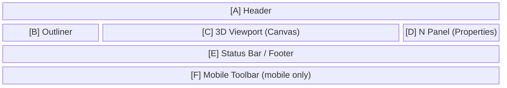

# Screen Information Architecture

Defines the structure and content of information displayed on each screen of easy-extrude.

> **When to update this document**
> - When adding a new mode or sub-state
> - When the toolbar, status bar, or N panel content changes in an existing mode
> - When adding a new entity type that changes the N panel or Outliner display
> - When a difference arises between mobile and desktop

---

## Screen List

| Screen ID | Name | Transition Condition |
|-----------|------|---------------------|
| `S-01` | Object Mode (no selection) | On startup / Escape / Tab |
| `S-02` | Object Mode (object selected) | Click on object |
| `S-03` | Object Mode (CoordinateFrame selected) | Click on CoordinateFrame |
| `S-04` | Edit Mode · 2D Sketch | Select Profile + Tab |
| `S-05` | Edit Mode · 2D Extrude | Confirm Sketch → Enter |
| `S-06` | Edit Mode · 3D (Solid editing) | Select Solid + Tab |
| `S-07` | Grab in progress | G key / long press |
| `S-08` | Face Extrude in progress | Edit 3D + select face + E key |
| `S-09` | Measure placement in progress | M key |
| `S-10` | Rect selection in progress (desktop only) | Drag on empty space |

---

## Information Area Definitions

Each screen is composed of the following information areas.



---

## Per-Screen Information Definitions

### S-01: Object Mode (no selection)

#### [A] Header
| Element | Content |
|---------|---------|
| Mode selector | `Object Mode ▾` |
| Status | (empty) |
| Header actions | Save / Load / Export / Import (desktop) / `⋯` menu (mobile) |

#### [B] Outliner
- Lists all objects in the scene
- Each row: icon + name + visibility toggle
- Active row: highlighted
- CoordinateFrames displayed indented under their parent object

#### [C] 3D Viewport
- Shows the ground grid plane (Z=0)
- Displays all object meshes (no selection)
- Top-right: Axis gizmo (mini-axis with X/Y/Z labels)

#### [D] N Panel
- Empty (no object selected; hidden or blank)

#### [E] Status Bar
```
G = Grab   M = Measure   Shift+A = Add   Ctrl+Z = Undo
```

#### [F] Mobile Toolbar
| Slot | Button | State |
|------|--------|-------|
| 1 | + Add | enabled |
| 2 | Edit | disabled |
| 3 | Delete | disabled |

---

### S-02: Object Mode (object selected)

#### [A] Header
| Element | Content |
|---------|---------|
| Mode selector | `Object Mode ▾` |
| Status | Object name (desktop: in header center; mobile: `visibility:hidden` to preserve spacer) |

#### [B] Outliner
- Selected object row highlighted

#### [C] 3D Viewport
- White bounding box (`boxHelper`) on selected object
- Selected object's CoordinateFrame shown in X-ray

#### [D] N Panel
| Field | Content |
|-------|---------|
| Name | Text input (editable on double-click) |
| Description | Textarea |
| Location (World) | X / Y / Z (read-only numbers) |
| Rotation (RPY) | R / P / Y, unit: deg (read-only, ZYX Euler order) |

#### [E] Status Bar
```
G = Grab   Tab = Edit   Shift+D = Duplicate   X = Delete   M = Measure
```

#### [F] Mobile Toolbar
| Slot | Button | State |
|------|--------|-------|
| 1 | + Add | enabled |
| 2 | Edit | enabled |
| 3 | Delete | enabled |

---

### S-03: Object Mode (CoordinateFrame selected)

#### [D] N Panel
| Field | Content |
|-------|---------|
| Name | Text input |
| Location (Local) | X / Y / Z (local coordinates) |
| Rotation (RPY) | R / P / Y, unit: deg (ZYX Euler order) |

#### [E] Status Bar
```
R = Rotate   G = Grab   Delete   Shift+A = Add Frame
```

#### [F] Mobile Toolbar
| Slot | Button | State |
|------|--------|-------|
| 1 | Rotate | enabled |
| 2 | Grab | enabled |
| 3 | Delete | enabled |
| 4 | Add Frame | enabled |
| 5 | (spacer) | — |

---

### S-04: Edit Mode · 2D Sketch

#### [C] 3D Viewport
- Shows rectangle preview on the ground plane (while dragging)
- Yellow marker shown when a snap point is available

#### [D] N Panel
| Field | Content |
|-------|---------|
| Name | Object name |
| Area | Rectangle area (m²) |

#### [E] Status Bar
```
Drag to draw a rectangle. Enter to extrude.
```

#### [F] Mobile Toolbar
| Slot | Button | State |
|------|--------|-------|
| 1 | ← Object | enabled |
| 2 | Extrude | disabled (enabled when area > 0.01) |

---

### S-05: Edit Mode · 2D Extrude

#### [C] 3D Viewport
- Sketch rectangle locked at the base
- Preview cuboid shown at current height
- Extrusion distance label overlaid in 3D space

#### [D] N Panel
| Field | Content |
|-------|---------|
| Name | Object name |
| Height | Extrusion height (m, editable) |

#### [E] Status Bar
```
Height: 1.00 m   Enter to confirm / Escape to cancel
```

#### [F] Mobile Toolbar
| Slot | Button | State |
|------|--------|-------|
| 1 | ✓ Confirm | enabled |
| 2 | ✕ Cancel | enabled |

---

### S-06: Edit Mode · 3D (Solid editing)

#### [C] 3D Viewport
- Sub-elements (vertices / edges / faces) change color on hover and selection:
  - Hovered face: light cyan highlight
  - Selected face: deep cyan
  - Vertex: yellow sphere
  - Edge: yellow line

#### [D] N Panel
| Field | Content |
|-------|---------|
| Name | Object name |
| Sub Mode | Vertex / Edge / Face |
| Selected | Selected sub-element name / count |

#### [E] Status Bar
```
1 = Vertex   2 = Edge   3 = Face   E = Extrude   Ctrl = Snap
```

#### [F] Mobile Toolbar
| Slot | Button | State |
|------|--------|-------|
| 1 | ← Object | enabled |
| 2 | Vertex | enabled / active emphasis |
| 3 | Edge | enabled / active emphasis |
| 4 | Face | enabled / active emphasis |
| 5 | Extrude | disabled (enabled when face selected) |

---

### S-07: Grab in progress

#### [C] 3D Viewport
- Object follows cursor movement
- Axis lock active: red/green/blue line along the constrained axis
- Stack mode ON: projection line shown below object
- Ctrl snap: yellow marker on snap target

#### [D] N Panel
| Field | Content |
|-------|---------|
| Axis | X / Y / Z / Free |
| Snap | Off / Geometry |
| Stack | Off / On |
| Delta | Δx, Δy, Δz (current displacement) |

#### [E] Status Bar
```
X/Y/Z = Axis lock   V = Pivot select   Ctrl = Snap   S = Stack   Enter = Confirm
```

#### [F] Mobile Toolbar
| Slot | Button | State |
|------|--------|-------|
| 1 | ✓ Confirm | enabled |
| 2 | Stack | enabled |
| 3 | ✕ Cancel | enabled |

---

### S-08: Face Extrude in progress

#### [C] 3D Viewport
- Preview of selected face extruding along its normal
- Extrusion distance label overlaid
- Ctrl snap: yellow marker on snap target

#### [D] N Panel
| Field | Content |
|-------|---------|
| Face | Selected face name |
| Distance | Extrusion distance (m) |

#### [E] Status Bar
```
Distance: 0.50 m   Ctrl = Snap   Enter = Confirm / Escape = Cancel
```

#### [F] Mobile Toolbar
| Slot | Button | State |
|------|--------|-------|
| 1 | ✓ Confirm | enabled |
| 2 | ✕ Cancel | enabled |

---

### S-09: Measure placement in progress

#### [C] 3D Viewport
**Phase 1 (p1 not yet confirmed)**
- Yellow marker on snap candidate near cursor

**Phase 2 (p1 confirmed)**
- p1 marker (fixed)
- p2 candidate marker (live tracking)
- Preview line between p1–p2 with distance label

#### [E] Status Bar
```
Snap to vertex/edge/face. Click to confirm / Escape to cancel.
```

---

### S-10: Rect selection in progress (desktop only)

#### [C] 3D Viewport
- Semi-transparent blue rectangle overlay (follows drag)
- Objects inside the rectangle are highlighted

#### [E] Status Bar
```
Drag to multi-select
```

---

## Information Priority Definitions

Priority of information in each area (highest user attention → lowest):

1. **3D Viewport** — real-time feedback (highest priority)
2. **Status Bar / Header Status** — operation guidance
3. **Toolbar** — available actions
4. **N Panel** — precise numeric information
5. **Outliner** — scene structure overview

---

## Mobile Information Differences

| Information Area | Desktop | Mobile |
|-----------------|---------|--------|
| Export / Import | Header buttons | `⋯` dropdown |
| Header status | Center of header | `visibility:hidden` (preserves spacer) |
| Status string | In header | Footer (`_infoEl`) |
| Outliner | Always visible (left sidebar) | Drawer opened via hamburger menu |
| N Panel | Always visible (right sidebar) | Drawer opened via N button |
| Toolbar | Hidden | Fixed at bottom, 86px tall |
| Context menu | Right-click | Long press (400ms+, movement < 8px) |

---

## Related Documents

- `docs/STATE_TRANSITIONS.md` — state transition details
- `docs/LAYOUT_DESIGN.md` — layout dimensions and placement
- `docs/EVENTS.md` — event reference
- `docs/adr/ADR-008-mode-transition-state-machine.md` — mode transition ADR
- `docs/adr/ADR-023-mobile-input-model.md` — mobile input model
- `docs/adr/ADR-024-mobile-toolbar-architecture.md` — mobile toolbar
