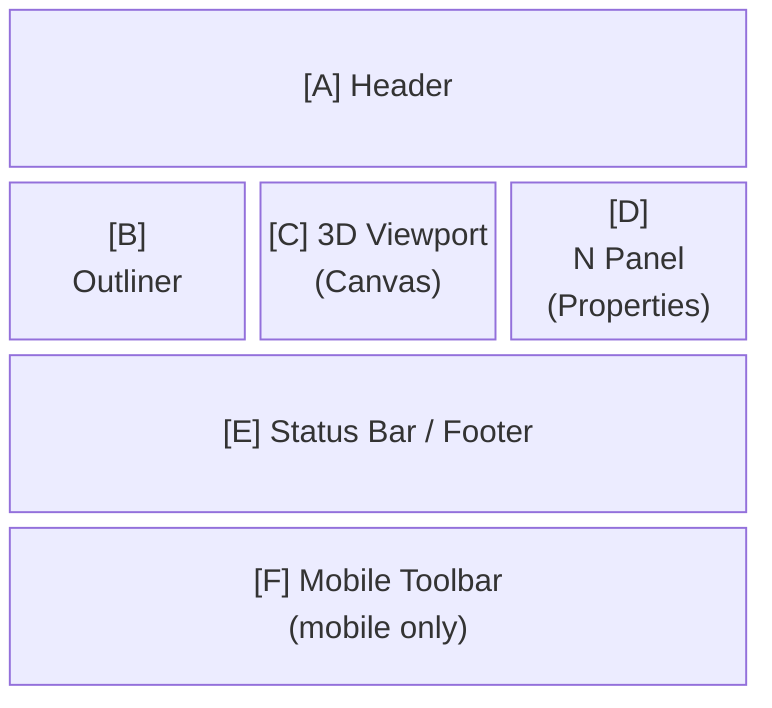

# Screen Information Architecture

Defines the structure and content of information displayed on each screen of easy-extrude.

> **When to update this document**
> - When adding a new mode or sub-state
> - When the toolbar, status bar, or N panel content changes in an existing mode
> - When adding a new entity type that changes the N panel or Outliner display
> - When a difference arises between mobile and desktop

---

## Screen List

| Screen ID | Name | Transition Condition |
|-----------|------|---------------------|
| `S-01` | Object Mode (no selection) | On startup / Escape / Tab |
| `S-02` | Object Mode (object selected) | Click on object |
| `S-03` | Object Mode (CoordinateFrame selected) | Click on CoordinateFrame |
| `S-04` | Edit Mode · 2D Sketch | Select Profile + Tab |
| `S-05` | Edit Mode · 2D Extrude | Confirm Sketch → Enter |
| `S-06` | Edit Mode · 3D (Solid editing) | Select Solid + Tab |
| `S-06b` | Edit Mode · 1D (MeasureLine endpoint drag) | Select MeasureLine + Tab |
| `S-07` | Grab in progress | G key / long press |
| `S-08` | Face Extrude in progress | Edit 3D + select face + E key |
| `S-09` | Measure placement in progress | M key |
| `S-10` | Rect selection in progress (desktop only) | Drag on empty space |
| `S-17` | Context DSL Demo overlay (ADR-047) | Header **Demo** button / `?demo=context` / `window.__easyExtrude.demoContext()` |

---

## Information Area Definitions

Each screen is composed of the following information areas.



**[G] Link Network Overlay** (auto-visible, all Object/Edit screens):
bottom-left panel shown automatically while the scene contains at least one
SpatialLink; hidden when none exist and force-hidden during the Context demo
(S-17). Content (ADR-048): a deterministic layered hierarchy — layer 0 = root
entities (Solid / annotations, color-coded by type), lower layers = CFs under
their parent; faint solid lines = parent-child structure; colored dashed
marching-ants lines (+ arrowhead when directed) = SpatialLinks per
semanticType; same-layer links bow into a bezier. Clicking a node selects the
entity in the viewport; crowded rows show labels only for the selection.
Dimensions / position → `LAYOUT_DESIGN.md`.

---

## Per-Screen Information Definitions

### S-01: Object Mode (no selection)

#### [A] Header
| Element | Content |
|---------|---------|
| Mode selector | `Object Mode ▾` |
| Status | (empty) |
| Header actions | Save / Load / Nodes (desktop, BFF 接続時のみ) / Export / Import / Demo (desktop) / `⋯` menu (mobile) |

#### [B] Outliner
- Lists all objects in the scene
- Each row: icon + name + visibility toggle
- Active row: highlighted
- CoordinateFrames displayed indented under their parent object

#### [C] 3D Viewport
- Shows the ground grid plane (Z=0)
- Displays all object meshes (no selection)
- Top-right: Axis gizmo (mini-axis with X/Y/Z labels)

#### [D] N Panel
- Empty (no object selected; hidden or blank)

#### [E] Status Bar
```
G = Grab   M = Measure   Shift+A = Add   Ctrl+Z = Undo
```

#### [F] Mobile Toolbar
| Slot | Button | State |
|------|--------|-------|
| 1 | + Add | enabled |
| 2 | Edit | disabled |
| 3 | Delete | disabled |

---

### S-02: Object Mode (object selected)

#### [A] Header
| Element | Content |
|---------|---------|
| Mode selector | `Object Mode ▾` |
| Status | Object name (desktop: in header center; mobile: `visibility:hidden` to preserve spacer) |

#### [B] Outliner
- Selected object row highlighted

#### [C] 3D Viewport
- White bounding box (`boxHelper`) on selected object
- Selected object's CoordinateFrame shown in X-ray

#### [D] N Panel
| Field | Content |
|-------|---------|
| Name | Text input (editable on double-click) |
| Description | Textarea |
| Location (World) | X / Y / Z (read-only numbers) |
| Rotation (RPY) | R / P / Y, unit: deg (read-only, ZYX Euler order) |

#### [E] Status Bar
```
R = Rotate   G = Grab   Tab = Edit   Shift+D = Duplicate   X = Delete   M = Measure
```

#### [F] Mobile Toolbar
| Slot | Button | State |
|------|--------|-------|
| 1 | + Add | enabled |
| 2 | Edit | enabled |
| 3 | Delete | enabled |

---

### S-03: Object Mode (CoordinateFrame selected)

#### [D] N Panel
| Field | Content |
|-------|---------|
| Name | Text input |
| Location (Local) | X / Y / Z (local coordinates) |
| Rotation (RPY) | R / P / Y, unit: deg (ZYX Euler order) |

#### [E] Status Bar
```
R = Rotate   G = Grab   Delete   Shift+A = Add Frame
```

#### [F] Mobile Toolbar
| Slot | Button | State |
|------|--------|-------|
| 1 | Rotate | enabled |
| 2 | Grab | enabled |
| 3 | Delete | enabled |
| 4 | Add Frame | enabled |
| 5 | (spacer) | — |

---

### S-04: Edit Mode · 2D Sketch

#### [C] 3D Viewport
- Shows rectangle preview on the ground plane (while dragging)
- Yellow marker shown when a snap point is available

#### [D] N Panel
| Field | Content |
|-------|---------|
| Name | Object name |
| Area | Rectangle area (m²) |

#### [E] Status Bar
```
Drag to draw a rectangle. Enter to extrude.
```

#### [F] Mobile Toolbar
| Slot | Button | State |
|------|--------|-------|
| 1 | ← Object | enabled |
| 2 | Extrude | disabled (enabled when area > 0.01) |

---

### S-05: Edit Mode · 2D Extrude

#### [C] 3D Viewport
- Sketch rectangle locked at the base
- Preview cuboid shown at current height
- Extrusion distance label overlaid in 3D space

#### [D] N Panel
| Field | Content |
|-------|---------|
| Name | Object name |
| Height | Extrusion height (m, editable) |

#### [E] Status Bar
```
Height: 1.00 m   Enter to confirm / Escape to cancel
```

#### [F] Mobile Toolbar
| Slot | Button | State |
|------|--------|-------|
| 1 | ✓ Confirm | enabled |
| 2 | ✕ Cancel | enabled |

---

### S-06: Edit Mode · 3D (Solid editing)

#### [C] 3D Viewport
- Sub-elements (vertices / edges / faces) change color on hover and selection:
  - Hovered face: light cyan highlight
  - Selected face: deep cyan
  - Vertex: yellow sphere
  - Edge: yellow line

#### [D] N Panel
| Field | Content |
|-------|---------|
| Name | Object name |
| Sub Mode | Vertex / Edge / Face |
| Selected | Selected sub-element name / count |

#### [E] Status Bar
```
1 = Vertex   2 = Edge   3 = Face   E = Extrude   Ctrl = Snap
```

#### [F] Mobile Toolbar
| Slot | Button | State |
|------|--------|-------|
| 1 | ← Object | enabled |
| 2 | Vertex | enabled / active emphasis |
| 3 | Edge | enabled / active emphasis |
| 4 | Face | enabled / active emphasis |
| 5 | Extrude | disabled (enabled when face selected) |

---

### S-06b: Edit Mode · 1D (MeasureLine endpoint drag)

#### [C] 3D Viewport
- Endpoint spheres turn **green** (`#69f0ae`) on hover
- Dragging snaps to a camera-facing plane through the dragged endpoint

#### [E] Status Bar
```
Tab = Object Mode   Drag endpoint = Reposition   Esc = Object Mode
```
Hover text: `Endpoint 1 — Drag to reposition`

#### [F] Mobile Toolbar
| Slot | Button |
|------|--------|
| 1 | ← Object |
| 2–4 | (spacer) |

---

### S-07: Grab in progress

#### [C] 3D Viewport
- Object follows cursor movement
- Axis lock active: red/green/blue line along the constrained axis
- Stack mode ON: projection line shown below object
- Ctrl snap: yellow marker on snap target

#### [D] N Panel
| Field | Content |
|-------|---------|
| Axis | X / Y / Z / Free |
| Snap | Off / Geometry |
| Stack | Off / On |
| Delta | Δx, Δy, Δz (current displacement) |

#### [E] Status Bar
```
X/Y/Z = Axis lock   V = Pivot select   Ctrl = Snap   S = Stack   Enter = Confirm
```

#### [F] Mobile Toolbar
| Slot | Button | State |
|------|--------|-------|
| 1 | ✓ Confirm | enabled |
| 2 | Stack | enabled |
| 3 | ✕ Cancel | enabled |

---

### S-08: Face Extrude in progress

#### [C] 3D Viewport
- Preview of selected face extruding along its normal
- Extrusion distance label overlaid
- Ctrl snap: yellow marker on snap target

#### [D] N Panel
| Field | Content |
|-------|---------|
| Face | Selected face name |
| Distance | Extrusion distance (m) |

#### [E] Status Bar
```
Distance: 0.50 m   Ctrl = Snap   Enter = Confirm / Escape = Cancel
```

#### [F] Mobile Toolbar
| Slot | Button | State |
|------|--------|-------|
| 1 | ✓ Confirm | enabled |
| 2 | ✕ Cancel | enabled |

---

### S-09: Measure placement in progress

#### [C] 3D Viewport
**Phase 1 (p1 not yet confirmed)**
- Yellow marker on snap candidate near cursor

**Phase 2 (p1 confirmed)**
- p1 marker (fixed)
- p2 candidate marker (live tracking)
- Preview line between p1–p2 with distance label

#### [E] Status Bar
```
Snap to vertex/edge/face. Click to confirm / Escape to cancel.
```

---

### S-10: Rect selection in progress (desktop only)

#### [C] 3D Viewport
- Semi-transparent blue rectangle overlay (follows drag)
- Objects inside the rectangle are highlighted

#### [E] Status Bar
```
Drag to multi-select
```

---

## Information Priority Definitions

Priority of information in each area (highest user attention → lowest):

1. **3D Viewport** — real-time feedback (highest priority)
2. **Status Bar / Header Status** — operation guidance
3. **Toolbar** — available actions
4. **N Panel** — precise numeric information
5. **Outliner** — scene structure overview

---

## Mobile Information Differences

| Information Area | Desktop | Mobile |
|-----------------|---------|--------|
| Export / Import | Header buttons | `⋯` dropdown |
| Header status | Center of header | `visibility:hidden` (preserves spacer) |
| Status string | In header | Footer (`_infoEl`) |
| Outliner | Always visible (left sidebar) | Drawer opened via hamburger menu |
| N Panel | Always visible (right sidebar) | Drawer opened via N button |
| Toolbar | Hidden | Fixed at bottom, 86px tall |
| Context menu | Right-click | Long press (400ms+, movement < 8px) |

---

---

## Lynch Urban Object Screens (planned — ADR-026)

The three new 2D entity types (`UrbanPolyline`, `UrbanPolygon`, `UrbanMarker`)
follow the same Object Mode screen structure as existing entities.  This section
documents the **planned** UX differences from S-02 (Object Mode, object selected).

> These screens are not yet implemented.  Rendering layer (Phase 1) is required
> first.  See `docs/ROADMAP.md` — Lynch Urban Elements Phase 1–3.

---

### S-11: Object Mode (UrbanPolyline selected)

#### [B] Outliner
- Icon: `⟿` (linear path icon) in Lynch color (`#4A90D9` for Path, `#E74C3C` for Edge)
- Lynch class badge displayed when `lynchClass` is set (same position as IFC badge)

#### [C] 3D Viewport
- Bounding box (`boxHelper`) on selected entity
- Polyline rendered as thick colored line (Lynch color); unclassified = grey

#### [D] N Panel

| Field | Content |
|-------|---------|
| Name | Text input |
| Description | Textarea |
| **Lynch Class** | Coloured badge (`Path` / `Edge`) or "Not set" (muted grey) |
|  | `Set / Change` button → opens Lynch picker (filtered to `geometry = 'polyline'`) |
|  | `✕` button → clears classification |
| Vertex count | N vertices (read-only) |

**Lynch Class picker (polyline filter):**
Shows only `Path` and `Edge` entries from `LynchClassRegistry`.
Each row: colored square + label + description.

#### [E] Status Bar
```
G = Grab   X = Delete   Lynch class: Path / Edge
```

#### [F] Mobile Toolbar
| Slot | Button | State |
|------|--------|-------|
| 1 | Grab | enabled |
| 2 | Lynch | enabled (opens Lynch class picker) |
| 3 | Delete | enabled |
| 4 | (spacer) | — |

---

### S-12: Object Mode (UrbanPolygon selected)

#### [B] Outliner
- Icon: `⬡` (hexagon — areal region) in Lynch color (`#27AE60` for District)
- Lynch class badge when classified

#### [C] 3D Viewport
- Bounding box on selected entity
- Polygon rendered as thick colored closed ring + translucent fill; unclassified = grey

#### [D] N Panel

| Field | Content |
|-------|---------|
| Name | Text input |
| Description | Textarea |
| **Lynch Class** | Coloured badge (`District`) or "Not set" |
|  | `Set / Change` button → opens Lynch picker (filtered to `geometry = 'polygon'`) |
|  | `✕` button → clears classification |
| Vertex count | N vertices (read-only) |
| Area (approx.) | Signed XY area m² (read-only, Shoelace formula) |

**Lynch Class picker (polygon filter):**
Shows only `District`.

#### [E] Status Bar
```
G = Grab   X = Delete   Lynch class: District
```

#### [F] Mobile Toolbar
| Slot | Button | State |
|------|--------|-------|
| 1 | Grab | enabled |
| 2 | Lynch | enabled |
| 3 | Delete | enabled |
| 4 | (spacer) | — |

---

### S-13: Object Mode (UrbanMarker selected)

#### [B] Outliner
- Icon: `⬤` (filled circle — point marker) in Lynch color (`#F39C12` Node, `#9B59B6` Landmark)
- Lynch class badge when classified

#### [C] 3D Viewport
- Bounding box on selected entity
- Marker rendered as colored sprite/circle with label; unclassified = grey

#### [D] N Panel

| Field | Content |
|-------|---------|
| Name | Text input |
| Description | Textarea |
| **Lynch Class** | Coloured badge (`Node` / `Landmark`) or "Not set" |
|  | `Set / Change` button → opens Lynch picker (filtered to `geometry = 'marker'`) |
|  | `✕` button → clears classification |
| Location (World) | X / Y / Z (read-only) |

**Lynch Class picker (marker filter):**
Shows `Node` and `Landmark`.

#### [E] Status Bar
```
G = Grab   X = Delete   Lynch class: Node / Landmark
```

#### [F] Mobile Toolbar
| Slot | Button | State |
|------|--------|-------|
| 1 | Grab | enabled |
| 2 | Lynch | enabled |
| 3 | Delete | enabled |
| 4 | (spacer) | — |

---

### S-14: 2D Map Mode — No Active Tool (Pan / Zoom)

Entered from the **Map** button in the header or from the mobile toolbar of a selected Urban entity.

#### [C] Viewport (Orthographic Top-Down)
- Full-screen orthographic camera looking straight down along −Z
- Existing 3D objects and Urban entities visible from above
- Ground-plane grid visible
- OrbitControls disabled; custom 2D pan/zoom active

#### [G] Left Map Toolbar (desktop)
| Button | Color | Tooltip |
|--------|-------|---------|
| ⟿ (Path) | #4A90D9 | Path (Linear) |
| ⟿ (Edge) | #E74C3C | Edge (Boundary) |
| ⬡ (District) | #27AE60 | District (Area) |
| ⬤ (Node) | #F39C12 | Node (Junction) |
| ⬤ (Landmark) | #9B59B6 | Landmark (Point) |
| ← | #aaa | Exit Map Mode |

All type buttons toggle the active drawing tool.

#### [E] Status Bar
```
Map Mode — select a Lynch type on the left to start drawing
```

#### [F] Mobile Toolbar (1 slot used)
| Slot | Button |
|------|--------|
| 1 | ← Exit Map |
| 2–4 | (spacers) |

#### Interaction
| Input | Action |
|-------|--------|
| Left-drag (no tool) | Pan camera |
| Middle-drag | Pan camera |
| Scroll wheel | Zoom in/out (frustumSize ±15%) |
| ESC (no tool) | Exit map mode |

---

### S-15: 2D Map Mode — Drawing (Polyline / Polygon)

Active when a Path, Edge, or District tool is selected in the map toolbar.

#### [C] Viewport
- Cursor dot (Lynch color) follows mouse
- Preview line connects confirmed vertices to cursor
- Polygon: preview ring closes when cursor is near first vertex (< 20 px)

#### [G] Left Map Toolbar
- Active type button highlighted with Lynch color border
- Confirm button (✓, green) shown when ≥ 2 pts (polyline) or ≥ 3 pts (polygon)
- Cancel button (✕, red) shown while drawing

#### [E] Status Bar
```
[Type]  N pts  click to add  Enter / RMB = confirm   ESC cancel
```

#### Interaction
| Input | Action |
|-------|--------|
| Left-click | Add vertex |
| Click near first vertex (polygon ≥ 3 pts) | Confirm and close polygon |
| Enter / RMB (≥ 2 pts polyline, ≥ 3 pts polygon) | Confirm shape |
| ESC | Cancel drawing (stay in map mode) |

After confirmation the entity is created with the Lynch class matching the tool type.
The same tool remains active for rapid repeated placement.

---

### S-16: 2D Map Mode — Drawing (Marker)

Active when Node or Landmark tool is selected.

#### [C] Viewport
- Cursor dot follows mouse in Lynch color

#### [E] Status Bar
```
[Type]  Click to place.   ESC cancel
```

#### Interaction
Single left-click places the marker immediately; the tool remains active.

---

## Context DSL Demo Screens (ADR-047)

### S-17: Context DSL Demo overlay

Entered from the header **Demo** button (desktop) / ⋯ MoreMenu (mobile) /
`?demo=context` / `window.__easyExtrude.demoContext()`. A confirm dialog replaces
the current scene with the compiled `examples/factory_context.json`.
Not an FSM mode — orbit / select / grab stay fully active; only entity visibility
is staged per story step. Exiting (✕) leaves the scene as a normal editable scene.

#### [C] 3D Viewport
- Step ②+: outlet AnnotatedPoint + cell AnnotatedRegion + **UncertaintyGhostView**
  (amber translucent band sweeping the interval [2700, 3000] mm, wireframes at both
  extremes, HTML label `2700–3000 mm · 未確定`, opacity pulse)
- Step ④: blue nominal wireframe at 2800; on approval the band collapses (0.8 s)
  onto the nominal box, a blue ripple fires, and the workbench Solid appears
- Step ⑤: base_plate → robot → container_a/b staggered reveal (150 ms apart,
  green ripple each) followed by all SpatialLink views

#### [G] Context Inspector (right fixed panel, 280px, desktop only)
| Tab | Content |
|-----|---------|
| Given | facts with status badges (measured 緑 / asserted 青 / assumed 琥珀 / unknown 赤点滅), interval display |
| OQ | validator-generated OpenQuestions (count badge) + blocked checks |
| Decision | resolves/nominal/rationale/decidedBy; status flips proposed → agreed on approval |
| Trace | from —kind→ to rows; click highlights the derived 3D entity |
| Accept | acceptance checks; blocked rows show the `blockedBy` chain in red |
| Conflict | live R6 output (ADR-049): per shared variable, `gap` (scalar `[hi,lo)` or per-axis map), the conflicting requirements, and `resolved`/`conflict` badge. Unresolved-count badge on the tab. Populated live during region authoring. |

Row click → `onDemoItemSelect` → trace resolution → real selection highlight
(`_switchActiveObject`), link flash + toast for constraint-only targets, or a
"appears in a later step" toast for not-yet-revealed entities (never silent).

#### [H] Decision Card (floating, step ④+)
Subject, interval → nominal, rationale, decidedBy, status pill, and the
**「承認して確定」** button. After approval: green border + agreed state.

#### [I] Story Bar (bottom-center overlay)
Step dots ①–⑥, title + 1–2 line narration (Japanese), ← 戻る / 次へ →, ✕ exit.
**Next is disabled at step ④ until the interval Decision is approved.**
Desktop `bottom: 36px`; mobile `bottom: 96px` (above the toolbar).

#### [J] Region Authoring sub-mode (ADR-049 Phase 3, Header **Author** button)
A separate single-step overlay (`enterAuthoring()`, loads `cell_region_context`). Each
engineer's設置許容ゾーン is a draggable AABB widget on the ground plane — 4 corner handles
(resize) + center handle (translate). Dragging runs R6 live: widgets are **green** when clear
and **red** when their shared variable is in conflict; the Inspector **Conflict** tab updates
each frame. The text DSL stays the contract — a dragged region is written back as a `stated`
admissible (invariant 9). Exit via Story Bar ✕ (disposes widgets).

#### [A] Header
Desktop: **Demo** button after Import. Mobile: Demo item inside the ⋯ MoreMenu.

---

## Related Documents

- `docs/STATE_TRANSITIONS.md` — state transition details
- `docs/LAYOUT_DESIGN.md` — layout dimensions and placement
- `docs/EVENTS.md` — event reference
- `docs/adr/ADR-008-mode-transition-state-machine.md` — mode transition ADR
- `docs/adr/ADR-023-mobile-input-model.md` — mobile input model
- `docs/adr/ADR-024-mobile-toolbar-architecture.md` — mobile toolbar
