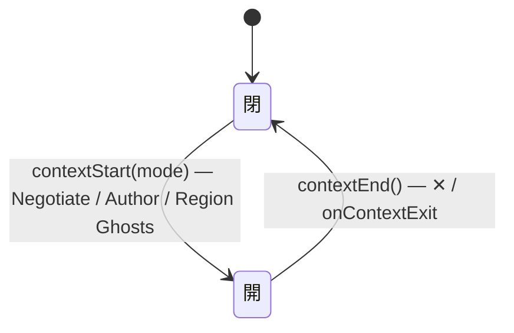

# State Transitions

Records the state machines of easy-extrude — both **UI mode transitions** and
**internal component state machines**.

UI state machines (modes, substates, input gestures) are covered in the sections below.
Internal component state machines (caches, async flags, lifecycle objects) are covered
in the final section.  **Both must be designed here before implementation.**
See ADR-008 for UI mode implementation details.

---

## Top-level Modes

**2 値。** ADR-103 が Map をモードから降ろしたので、トップレベルの選択肢は
OBJECT / EDIT だけになった。視点 (向き・投影) と配置ツールは**直交する別の軸**で、
モードの値ではない — だから `edit` かつ真上から正射で見る、が正当な組み合わせとして
表現できる (旧 MAP モードでは表現不能だった)。

```
                    Tab
  ┌─────────────────────────────────────────────────┐
  |                                                 |
  v                                                 |
OBJECT MODE  ──────────────────────────────> EDIT MODE
  |                                                 | (dispatches on active object dimension)
  | Shift+A → Add Box                               |
  |   → _addObject('box') → OBJECT MODE             |
  |                                                 |
  | Shift+A → Add Sketch                            |
  |   → _addSketchObject() → EDIT MODE · 2D         |
  |                                                 |
  | X / Delete (selected)                           |
  |   → _deleteObject() → OBJECT MODE               |
  └─────────────────────────────────────────────────┘

  直交する軸 (モードの値ではない — どのモードでも独立に動く)

    投影      perspective / orthographic   ← SceneView.setProjection()
    向き      任意 (Z 軸スナップを含む)      ← 軸ギズモ / OrbitControls
    配置ツール null / route|boundary|zone|hub|anchor  ← PlaceToolController
```

### Place tool — 配置ツール (ADR-103 · 旧 Map Mode の描画部分)

`PlaceToolController.state.tool` — 描いている place type (`route` / `boundary` /
`zone` / `hub` / `anchor`)、または `null` (基数 `0..1`、**0 が既定かつ頻出**)。
`state.drawState` — 内側の 2 値 FSM: `idle` / `drawing` (ADR-073 が旧 `pending`
の命名 + 確認ゲートを廃止 — 幾何の完成が即座に自動名で実体を作る)。

**モードではない。** 武装しても `selectionMode` は動かず、カメラも動かず、
キーボードも奪わない。奪うのは *その入力ジェスチャを完全に消費する* 2 つだけ
(RMB = 折れ線の確定 / 一本指ドラッグ = 描画) で、これは原則 #14 の条件を満たす
唯一の場合。ホイール・中ドラッグ・二本指は OrbitControls に残る。

```
tool = null  (何も横取りしない — 通常の選択・編集・orbit)
    │
    │ + Add ▸ Place ▸ <type>  → setTool(type)
    │     SceneView.setDrawGestureActive(true)   ← RMB と 1 本指だけ抑制
    ▼
tool = <type>, drawState = "drawing"
    │
    │   ┌─ PC ───────────────────────────────────────────────────────────┐
    │   │  Route / Boundary   click で頂点追加 → Enter / RMB (≥2) で生成 │
    │   │  Zone               pointerdown → pointerup で矩形生成          │
    │   │  Hub / Anchor       click で即生成                              │
    │   └─────────────────────────────────────────────────────────────────┘
    │   ┌─ Mobile ───────────────────────────────────────────────────────┐
    │   │  全種: 一本指ドラッグ 1 回 (down → move で preview → up で生成) │
    │   └─────────────────────────────────────────────────────────────────┘
    │
    │   _createAnnotation()  (幾何が完成 — 命名フォーム無し, ADR-073)
    │       → 自動名 "<Type> N" (種ごとのカウンタ)
    │       → 実体生成 (AnnotatedLine / AnnotatedRegion / AnnotatedPoint)
    │       → AddAnnotationCommand を push (undo 可)
    │       → drawState = "drawing" のまま (連続配置)
    │
    └─ ESC / RMB (頂点 <2) → cancel() → tool = null
           setDrawGestureActive(false) で orbit が戻る
```

- **禁止**: ツール選択がカメラを倒すこと。描きやすさのために視点を自動で真上へ
  倒すと、それは裏口から復活したモードになる (ADR-103 §未解決)。ユーザーが
  ギズモの Z 軸を押す。
- **`_pickPoint` は `activeCamera` を使う**ので、透視でも正射でも地面 (Z=0) を
  正しく拾う。描画は正射を*要求*しない — 読みやすいだけである。

### Projection — 投影方式 (ADR-103)

`SceneView._projection` — `perspective` / `orthographic`、基数ちょうど 1。
書き手は `setProjection()` ただ 1 箇所で、未知の値は throw する (原則 #31)。

**正射カメラは状態を持たない。** 位置・向き・frustum 高は毎フレーム透視カメラと
`controls.target` から導出される (`_syncOrthoCamera`) ので、保存された姿勢も
独立したズームもパンオフセットも存在しない = ドリフトする対象が無い
(原則 #24 — 逆向きの書き込みは 1 つも無いので閉路にならない)。帰結:

- 投影を切り替えてもカメラは 1 mm も動かない (往復して同じ姿勢に戻る)。
- orbit / dolly / pan / ピンチはどちらの投影でも OrbitControls がそのまま担当する
  (dolly が距離を変え、距離が frustum 高を決めるので「ズーム」として効く)。
- fog を退避する必要が無い (旧 Map の ortho カメラは固定 ~100 units 上空に居たので
  退避が要った — `SceneStage.setFogSuspended()` は同じ ADR で削除した)。

## Edit Mode Substates

State machine held in `SceneModel.editSubstate`.
The initial substate when entering EDIT MODE is determined by the active object's runtime type
(`instanceof Solid` → 3D, `instanceof Profile` → 2D, `instanceof MeasureLine` → 1D).
There is no `dimension` field (removed in ADR-012).

```
Enter EDIT MODE
    |
    v
instanceof Solid ?───> EDIT · 3D ('3d')
    |                       |
    | No                    | Tab / O key / setMode('object')
    |                       v
instanceof Profile ?──> OBJECT MODE
    |
    v
EDIT · 2D-SKETCH ('2d-sketch')
    |
    | Rectangle drag complete → sketchRect saved
    | Enter (area > 0.01)
    v
EDIT · 2D-EXTRUDE ('2d-extrude')
    |                |
    | Enter          | Escape
    | (height > 0)   |
    v                v
EDIT · 3D      EDIT · 2D-SKETCH (back)
    |
    | Tab / O key
    v
OBJECT MODE

instanceof MeasureLine ?──> EDIT · 1D ('1d')
                                |
                                | Tab / Esc / setMode('object')
                                v
                           OBJECT MODE
```

### Substate Details

| substate | Meaning | Transition trigger |
|---------|---------|--------------------|
| `null` | Outside Edit Mode (Object Mode) | After `setMode('object')` call |
| `'2d-sketch'` | Drawing a rectangle on the ground plane | `_enterEditMode2D()` |
| `'2d-extrude'` | Extruding sketch in the height direction | `_enterExtrudePhase()` (Enter key) |
| `'3d'` | Face selection and extrusion on a 3D cuboid | `_enterEditMode3D()` |
| `'1d'` | Endpoint drag on a MeasureLine | `_enterEditMode1D()` |

---

## setMode() Execution Order (ADR-008 contract)

```
setMode(mode) called
    |
    1. Cancel in-progress operations
    |    - grab.active → _cancelGrab()
    |    - faceDragging → clearExtrusionDisplay()
    |    - objDragging → reset flags
    |
    2. Clear active object visual state
    |    - setFaceHighlight(null)
    |    - clearExtrusionDisplay()
    |    - clearSketchRect()
    |    - uiView.clearExtrusionLabel()
    |
    3. Reset controller internal state
    |    - _hoveredFace = null
    |    - _cleanupEditSubstate() → SceneModel.setEditSubstate(null)
    |
    4. SceneModel.setSelectionMode(mode)
    |
    5. Dispatch to new mode
         mode === 'object' → UI update only
         mode === 'edit'   → dispatch on active object runtime type (instanceof)
                             instanceof MeasureLine → _enterEditMode1D()
                             instanceof Profile     → _enterEditMode2D()
                             instanceof Solid       → _enterEditMode3D()
```

**Important**: Always call `setMode('object')` before switching the active object.
Calling `_switchActiveObject()` while in Edit Mode leaves the previous object's visual state dirty.

---

## State Transitions on Object Add / Delete

```
_addObject(type) / _addSketchObject()
    |
    if selectionMode === 'edit'
        → setMode('object')  ← required: clean up Edit Mode
    |
    → SceneModel.addObject(obj)
    → _switchActiveObject(id, true)
    |
    only when type === 'sketch'
        → setMode('edit')  ← enter Edit Mode · 2D immediately

_deleteObject(id)
    |
    if id === activeId && selectionMode === 'edit'
        → setMode('object')  ← required: clear visual state before dispose
    |
    → meshView.dispose()
    → SceneModel.removeObject(id)
    → _switchActiveObject() (to another object)
```

---

## Grab State Machine

Blender-style grab operation started with G key in Object Mode.

```
OBJECT MODE (selected)
    |
    G key → _startGrab()
    |
    v
GRAB ACTIVE (grab.active = true)
    |
    |── mouse move → _applyGrab()
    |── X/Y/Z key → _setGrabAxis(axis)  (axis lock)
    |       re-snapshots segmentStartCorners/segmentStartPositions to current positions
    |       and resets startMouse — preserves accumulated offset from previous constraint
    |       (e.g. X→Y keeps the X movement; switching back to free grab also resets startPoint)
    |── V key → PIVOT SELECT MODE (grab.pivotSelectMode = true)
    |       |── mouse move → _updatePivotHover()
    |       |── left click → _confirmPivotSelect() → GRAB ACTIVE
    |       └── Escape    → _cancelPivotSelect()  → GRAB ACTIVE
    |── 0-9/. key (while axis locked) → numeric input → _applyGrabFromInput()
    |── Ctrl held → _trySnapToOrigin() (origin snap)
    |── Enter / left click → _confirmGrab() → OBJECT MODE
    └── Escape / right click → _cancelGrab() → restore corner positions → OBJECT MODE
```

---

## Face Extrude State Machine

Face extrusion operation in Edit Mode · 3D.

```
EDIT MODE · 3D (face mode)
    |
    mouse move → _hitFace() → setFaceHighlight(fi)
    |
    left click → _handleEditClick() → add Face to editSelection
    |
    E key (at least one face selected) → _startFaceExtrude(face)
    |
    v
FACE EXTRUDE ACTIVE (faceExtrude.active = true)
    |
    |── mouse move → compute distance + _applyFaceExtrude() + setExtrusionLabel()
    |── Ctrl held → _trySnapFaceExtrude() for geometry snap
    |── numeric keys → _applyFaceExtrudeFromInput() (numeric input mode)
    |── Enter / left click → _confirmFaceExtrude() → EDIT MODE · 3D
    └── Escape / right click → _cancelFaceExtrude() → restore corners → EDIT MODE · 3D
```

---

## Mobile Input State Machine

Touch and mouse input are unified via the **Pointer Events API** (`pointerdown` / `pointermove` / `pointerup`).
`_activeDragPointerId` tracks which pointer owns the current edit drag.

### Primary pointer (first finger / mouse)

```
IDLE (_activeDragPointerId = null)
    |
    pointerdown (canvas target) ─────────────────────────────────────────────┐
    |                                                                         |
    ├─ grab.active ──────────────────────────────────────────────────────────>│
    │   button=0 → _confirmGrab()           (IDLE)                           |
    │   button=2 → _cancelGrab()            (IDLE)                           |
    │                                                                         |
    ├─ faceExtrude.active ───────────────────────────────────────────────────>│
    │   button=0 → set _activeDragPointerId ← do NOT confirm yet             |
    │              (wait for pointermove to set distance, confirm on up)      |
    │   button=2 → _cancelFaceExtrude()     (IDLE)                           |
    │                                                                         |
    ├─ editSubstate === '2d-sketch' ─────────────────────────────────────────>│
    │   ray hits ground plane → _sketch.drawing=true                          |
    │   _controls.enabled = false   ← orbit must not interfere with draw      |
    │   set _activeDragPointerId                                               |
    │                                                                         |
    ├─ selectionMode === 'object' ───────────────────────────────────────────>│
    │   hit object → _objDragging=true                                        |
    │                _controls.enabled = false                                |
    │                set _activeDragPointerId                                  |
    │   no hit     → _rectSel.active=true                                    |
    │                set _activeDragPointerId                                  |
    │                (_controls stays ENABLED — orbit must remain usable)     |
    │                                                                         |
    └─ editSubstate === '3d' ────────────────────────────────────────────────>│
        re-run hit test (touch has no prior pointermove)                      |
        → _hoveredFace / _hoveredVertex / _hoveredEdge refreshed              |
        → _handleEditClick()                                                  |
                                                                              ▼
                                              DRAG (_activeDragPointerId set)
                                                  |
                                                  | pointermove (same pointerId)
                                                  |── rectSel: update overlay rect
                                                  |── objDragging: move object(s)
                                                  |── sketch.drawing: update rect p2
                                                  |── faceExtrude: update distance
                                                  |── grab: apply grab
                                                  |
                                                  | pointerup (same pointerId)
                                                  │   wasDragging = true
                                                  │   _activeDragPointerId = null
                                                  │──  faceExtrude → _confirmFaceExtrude()
                                                  │──  sketch.drawing → _confirmSketchRect()
                                                  │──  rectSel → _finalizeRectSel()
                                                  │──  objDragging → reset flags
                                                  v
                                              IDLE
```

### Secondary touch (second finger)

```
DRAG (_activeDragPointerId set) + second touch arrives
    |
    pointerdown (e.pointerType === 'touch', different pointerId)
    |
    ├─ _rectSel.active
    │   → cancel rect selection
    │   → _activeDragPointerId = null   ← release ownership
    │   → return                        ← OrbitControls takes two-finger gesture
    │
    └─ any other drag state
        → return (secondary touch ignored; primary drag continues)
```

### Canvas target guard

`pointerdown` is registered on `window` (to support drag-outside-canvas).
This means it fires for toolbar button taps, overlay menus, etc.

```
pointerdown fired
    |
    if e.target !== canvas → return immediately
    (toolbar click listeners handle these via the 'click' event instead)
```

Without this guard, a toolbar tap fires `_handleEditClick` (clears face/vertex/edge
selection) **before** the button's own `click` handler fires — because `pointerdown`
precedes `click`. The classic failure: tapping "Extrude" clears the face selection.

### Face extrude confirm flow (touch vs. desktop)

```
Desktop:
  left-click (pointerdown+pointerup without move) → confirm immediately on pointerup

Touch:
  tap "Extrude" button → _startFaceExtrude()
      |
      Touch canvas to start drag → _activeDragPointerId set (pointerdown)
      |
      Drag finger → pointermove updates distance
      |
      Lift finger → pointerup: wasDragging=true → _confirmFaceExtrude()

  tap "Confirm" toolbar button → fires both pointerup AND click
      pointerup: wasDragging=false (no canvas drag started) → skip confirm
      click:     → _confirmFaceExtrude()   ← only this path fires
```

The `wasDragging` guard prevents double-confirm when the toolbar button is tapped.

---

## Mobile Toolbar State Machine

On narrow screens (`window.innerWidth < 768`), a floating toolbar replaces keyboard shortcuts.
The toolbar shows a **fixed set of buttons per state** — buttons are disabled (not hidden)
to prevent layout shifts.

```
App state                   Toolbar buttons (→ always the same count)
──────────────────────────────────────────────────────────────────────────
grab.active                 [✓ Confirm]  [✕ Cancel]
faceExtrude.active          [✓ Confirm]  [✕ Cancel]
placeTool !== null          [✕ Done]     (ADR-103: モードではないので「抜ける」ではなく「解除」)
──────────────────────────────────────────────────────────────────────────
Object Mode                 [+ Add]  [Edit*]  [Delete*]
  * disabled if no selection
──────────────────────────────────────────────────────────────────────────
Edit · 1D (MeasureLine)     [← Object]
──────────────────────────────────────────────────────────────────────
Edit · 2D-Sketch            [← Object]  [Extrude*]
  * disabled until rect area > 0.01
──────────────────────────────────────────────────────────────────────────
Edit · 2D-Extrude           [✓ Confirm]  [✕ Cancel]
──────────────────────────────────────────────────────────────────────────
Edit · 3D                   [← Object]  [Vertex]  [Edge]  [Face]  [Extrude*]
  * disabled until a Face is in editSelection; active sub-mode highlighted
──────────────────────────────────────────────────────────────────────────
```

Toolbar button taps use `click` events, not pointer events, so they are
unaffected by the canvas target guard above.

---

## Internal Component State Machines

### Design workflow (required before implementation)

Whenever you introduce a stateful component — a cache, an async flag, a lifecycle
object — draw its state machine here **before writing the implementation**.
The critical question that must be answered for every accessor method:

> **"What does this method return / do in each state?"**

This question, asked at design time, prevents an entire class of bug where callers
receive `null` or stale data and silently fall back to a wrong value.

The checklist:

```
1. Name every possible state the component can be in.
2. Draw all transitions (what event causes each transition).
3. For each public accessor / method:
      - specify its behaviour in every state
      - choose one of: (a) compute on demand (self-healing)
                       (b) throw / assert (precondition violated)
                       (c) eager init (UNINIT state impossible by construction)
      - "return null" is NOT an acceptable answer — it transfers the problem
        to every caller and will be mishandled by N−1 of them.
4. Document the chosen strategy here and in CODE_CONTRACTS.
```

---

### `_worldPoseCache` (SceneService)

**Why this exists here**: 11 of 14 `worldPoseOf()` call sites were missing a
freshness guard because the cache's lifecycle states were never formally designed.
Every accessor silently fell back to `(0,0,0)` before the animation loop had run.
(See PHILOSOPHY #23.)

**States**

```
UNINIT ──[_updateWorldPoses() first call]──→ VALID
VALID  ──[invalidateWorldPose(frameId)]────→ STALE  (entry removed from Map)
STALE  ──[_updateWorldPoses()]─────────────→ VALID
```

`UNINIT` = `_worldPoseCache` is empty (app start, or after `_worldPoseCache.clear()`).
`STALE`  = one or more entries have been removed by `invalidateWorldPose()` but
           `_updateWorldPoses()` has not yet rerun (e.g. during undo/redo, between frames).

**Accessor contract**

| Accessor | UNINIT | VALID | STALE |
|----------|--------|-------|-------|
| `worldPoseOf(id)` | auto-heal: calls `_updateWorldPoses()`, then returns entry | return cached entry | auto-heal: calls `_updateWorldPoses()`, then returns entry |

Strategy chosen: **(a) compute on demand** — `worldPoseOf()` calls `_updateWorldPoses()`
on cache miss so every caller always receives a current pose regardless of when it is
called relative to the animation loop.

```javascript
// SceneService.js
worldPoseOf(frameId) {
  if (!this._worldPoseCache.has(frameId)) this._updateWorldPoses()
  return this._worldPoseCache.get(frameId) ?? null
}
```

**Transition triggers**

| Transition | Trigger | Called by |
|------------|---------|-----------|
| → VALID | `_updateWorldPoses()` | animation loop (every frame) + `worldPoseOf()` on cache miss |
| → STALE | `invalidateWorldPose(id)` | `MoveCommand.apply()` during undo/redo |
| → UNINIT | `_worldPoseCache.clear()` | `_clearScene()` |

---

### `context.wizard` — Guided-intake wizard FSM (ADR-063 Phase 3)

**Why this exists here**: the wizard has 3+ states and its illegal transitions
(advancing past an unsatisfied step, a bulk confirm that bypasses review) are doc
quality accidents — 核 §1.4 requires the machine before the components. The state
was designed in ADR-063 §4 before `WizardPanel` was written.

**States** (stored in `uiStore.context.wizard`, replaced wholesale — a
discriminated union like `context.grasp`, illegal shapes unrepresentable)

```
null (inactive)
  ──[startWizard() — onWizardStart]──────────────→ { defId, status:'step', index:0 }
step(k)
  ──[next, wizardStepGaps === []]────────────────→ step(k+1)   (k < last)
  ──[next, wizardStepGaps === [] , k === last]───→ review
  ──[next, wizardStepGaps ≠ []]──────────────────→ step(k)     (SAME state returned — blocked with printable reasons, never silent)
  ──[back, k > 0]────────────────────────────────→ step(k−1)
  ──[back, k === 0]──────────────────────────────→ step(0)     (stays; no underflow)
  ──[exit — onWizardExit]────────────────────────→ null        (committed steps stay in the doc)
review
  ──[back]───────────────────────────────────────→ step(last)
  ──[finish — onWizardFinish]────────────────────→ null        (+ contextSetTab('matrix'); a view transition, NOT a commit)
any
  ──[contextStart / contextEnd]──────────────────→ null
```

**Guards / invariants**

- `next` is gated by the pure `wizardStepGaps(def, state, doc)` — it counts only
  **committed** doc entries (step-local form drafts are transient and never a
  second source, §1.1). The controller enforces the gate against the
  authoritative `ContextService.getDoc()`; the panel derives the same list from
  the projected slice for display (one predicate, two projections — no silent
  disabled, PHILOSOPHY #11).
- Every step confirm is an immediate CommandStack doc commit (the existing
  `onAddDocEntry` path) — exiting mid-wizard always leaves a valid, undoable
  working doc. There is no all-or-nothing modal commit (ADR-063 §4).
- Sole writer: `ContextController` via the pure `WizardCatalog` transition
  functions (`startWizard` / `nextWizardState` / `prevWizardState`). The panel
  only reads and fires `onWizard*` callbacks (same discipline as the grasp FSM,
  ADR-057 / PHILOSOPHY #5).

---

### `tour` — Desktop onboarding tour FSM (ADR-065 Phase 6)

**Why this exists here**: the tour has 3+ states and a wrong hint is an
experience accident (核 §1.4 trigger — designed in ADR-065 §2 before the
components). It is user-visible APP state (which quest is open), NOT
presentation history — the deliberate ADR-065 §2 carve-out from ADR-062's
"no presentation state in the uiStore".

**States** (stored in top-level `uiStore.tour`, replaced wholesale — a
discriminated union like `context.grasp`/`context.wizard`)

```
null (not shown: mobile pointer, or persisted ee_tour flag)
  ──[boot, fine pointer, no ee_tour — startTour(facts)]→ { status:'active', step:firstOpen }
active(step)
  ──[fact source fires, step.done(facts)]──────────────→ active(next open step)   (satisfied steps SKIPPED)
  ──[fact source fires, last step done]────────────────→ { status:'done' }        (+ persist ee_tour='done')
  ──[fact source fires, step still open]───────────────→ active(step)             (SAME reference — no store write)
  ──[malformed facts]──────────────────────────────────→ active(step)             (held, never advanced on garbage)
  ──[corrupt state (unknown step id)]──────────────────→ null                     (no hint beats a wrong hint #11)
  ──[✕ Skip — onTourDismiss]───────────────────────────→ null                     (+ persist ee_tour='dismissed')
done
  ──[✕ Close — onTourDismiss]──────────────────────────→ null
```

**Guards / invariants**

- Quest trail (pure `TOUR_STEPS` in `src/view/TourMath.js`): add → select →
  grab → edit → extrude. Every `done` predicate reads only **committed** facts:
  Solid count, the committed selection, `selectionMode`, and the last
  CommandStack landing `{label, phase}` (a landing is a committed operation —
  optimistic previews never land).
- Progress only moves FORWARD (`nextTourState` never regresses — undoing the
  added box does not resurrect the add quest; the affordance was demonstrated).
- Fact sources → `AppController._updateTour()`: CommandStack landing listener,
  `objectAdded`, `activeChanged`, `setMode()`. Sole writer: AppController
  (PHILOSOPHY #5); `TourCard` and the Outliner anchor pulse only read.
- An active overlay (Context / demo / template gallery) suppresses rendering
  via the shared `tourVisible` predicate WITHOUT mutating the FSM — the quest
  resumes when the overlay closes.
- Persistence is a display **setting** (ADR-065 Widening 3): only the
  done/dismissed flag (`localStorage.ee_tour`) survives the session; the
  progression itself persists nowhere.

---

### `stage` — the screen claim (ADR-113, absorbing ADR-089's `home`)

**Why this exists here**: taking the whole screen touches the **boot flow** (a
hard-to-reverse app entry) and decides what the user is looking at. Until
ADR-113 the launch Home screen (`home`, ADR-089) and the New Project gallery
(`templateGalleryOpen`, ADR-051) were **two independent fields at the same
z-index 300**, so "how many full-screen claims are up" had no field at all and
the winner of a tie was `UIShell.jsx`'s mount order — 原則 #31's "cardinality is
a state that does not look like one". They are now **one slot**, which makes
two-at-once unrepresentable rather than merely discouraged.

The **skip preference** remains a persisted display setting
(`localStorage.ee_home`), NOT part of the state (§1.1 — settings/derived never
smuggled into the state).

**States** (stored in top-level `uiStore.stage`; claims declared in
`src/view/ScreenClaim.js`)

```
null (nothing claims the screen — the editor is visible)
  ──[boot, no ee_home flag — claimStage(LAUNCH_HOME)]──────────→ { claim:'launch-home' }
  ──[Start ▾ → From a layout template — onOpenHome()]──────────→ { claim:'launch-home' }   (reopen after skip)
  ──[Unexamined / Start ▾ → New Project — openTemplateGallery()]→ { claim:'context-template-gallery' }
{ claim:'launch-home' }
  ──[select layout card — onSelectLayoutTemplate(id)]──────────→ null   (+ compileLayout → importFromJson(clear) → land S-01)
  ──[Empty Project — onStartEmptyProject()]────────────────────→ null   (close onto default boot scene → S-01)
  ──[✕ close — onCloseHome()]──────────────────────────────────→ null   (close onto whatever scene is loaded)
  ──[openTemplateGallery()]────────────────────────────────────→ { claim:'context-template-gallery' }   (swap, never stack)
{ claim:'context-template-gallery' }
  ──[select / fork template — onSelectTemplate(id)]────────────→ null
  ──[✕ or backdrop — onCloseTemplateGallery()]─────────────────→ null
  ──[onOpenHome()]─────────────────────────────────────────────→ { claim:'launch-home' }   (swap, never stack)
any
  ──[toggle "起動時に表示しない" — onToggleHomeSkip(b)]────────→ (same state)   (persists ee_home; NOT a transition)
```

The other two tiers are **not** in this slot and do not transition with it:
`coach` (the mobile gesture hint, auto-dismissing) rides above the stage, and
`dialog` (`uiStore.modal`) rides above both because it asks *about* whatever
holds the stage. Each tier is 0..1 on its own; z-order between tiers is declared
once in `tierZIndex()`, never chosen by a component.

**Guards / invariants**

- Two writers, one each: `AppController` claims/releases `launch-home`,
  `ContextController` claims/releases `context-template-gallery` — both through
  the single pair `claimStage` / `releaseStage` (原則 #1 / #9).
- **Release names its claim.** `releaseStage(LAUNCH_HOME)` is a no-op when the
  gallery holds the stage, so a late close cannot clear a claim someone else has
  taken since.
- Components read `stageIs(stage, CLAIM)` and never their own boolean;
  `HomeScreen` fires `onSelectLayoutTemplate` / `onStartEmptyProject` /
  `onToggleHomeSkip` / `onCloseHome` (same discipline as the tour / wizard panels).
- Layout load rides the **single authoritative path** `compileLayout` →
  `SceneService.importFromJson(scene, {clear:true})` (PHILOSOPHY #1) — Home adds no
  new load logic. Empty Project performs no scene replacement (keeps the default
  boot scene).
- Persistence is a display **setting** (ADR-065 Widening 3, ADR-089 §3): only the
  skip flag (`localStorage.ee_home`) survives the session; the open/null state
  persists nowhere. Boot reads the flag once to decide the initial state.
- Reopen affordance lives in a **fixed** header slot / ⋯ MoreMenu item so a skipped
  Home is never a dead end (PHILOSOPHY #15 / #11).
- A claim that opens behind another is the silent no-op #11 forbids — which is
  exactly what "open the gallery while Home is up" did before ADR-113.
- The ADR-086 deterministic boot slice (no startup ReferenceError) holds on the Home
  path as well.

---

### GSN goal support — 未探索 / 探索中 / 支えあり (PHILOSOPHY #31)

**Why this exists here**: the ledger crossed the 3-state threshold for a `.gsn`
goal's *support* on 2026-07-25 (核 §1.4). This is not a runtime entity, but it is
a state set with an illegal region that used to be reachable in silence: a goal
with **zero** support (0 strategy, 0 solution, 0 sub-goal) rendered identically to
a fully evidenced one, because absence has no node to inspect. The state is now
declared rather than inferred, and the guards are executable
(`gsn_tool.py lint`, CI `pnpm test:gsn`) — the transitions below are enforced, not
described.

**States** (support is structural + a reserved `labels` value; `state` stays the
extension's *freshness* axis and is deliberately orthogonal)

```
unexplored  (labels support-unexplored — nothing named yet, not falsifiable)
  ──[write an assumption naming the check that would settle it]──→ exploring
exploring   (labels support-exploring + ≥1 assumption child — "証拠予定: …")
  ──[run the check; assumption → solution, drop the label]───────→ supported
  ──[decompose instead; add a strategy, drop the label]──────────→ supported
supported   (≥1 strategy / solution / sub-goal, no support label)
  ──[evidence goes stale]───────────────────────────────────────→ (state ToBeReviewed; still supported)
```

**Guards / invariants** — each one is a lint error, not a convention:

- **No undeclared zero.** A goal with no support and no `support-*` label is an
  error. This is the whole point: the empty branch can no longer pass silently.
- **Exactly one declaration.** Two `support-*` labels on one goal is an error.
- **`support-exploring` requires an assumption child.** Without a named check it is
  `support-unexplored` wearing a costume — the label would claim in-flight work
  that does not exist.
- **A declaration of absence dies when support arrives.** A `support-*` label on a
  goal that has gained a strategy/solution/sub-goal is an error, so the forward
  transitions cannot be taken half-way.
- **Support labels are goal-only.** The same label on a strategy or solution is an error.
- Backward transitions (supported → exploring) are not modelled: evidence that goes
  stale moves on the freshness axis (`state ToBeReviewed`), and deleting a branch to
  tidy the tree is forbidden by `/gsn-maintain`'s guardrails — a removed zero is an
  invisible zero again.

---

## CoordinateFrame Body Frame Lifecycle (ADR-037)

### Origin CF is created atomically with every Solid

```
Shift+A → Add Box  /  Extrude Profile  /  Duplicate Solid
    |
    createSolid() / extrudeProfile() / duplicateSolid()
    |   → Solid added to model, objectAdded emitted
    |   → createCoordinateFrame(solid.id, 'Origin', null)
    |       translation=(0,0,0), rotation=identity
    |
    v
OBJECT MODE — Solid selected
    Outliner: Solid
               └── Origin (CF, locked icon, at centroid)
    TC proxy: position = Origin CF worldPos (= centroid)
              quaternion = Origin CF worldQuat (= Solid.bodyRotation)
```

### User CF creation — parent is always Origin CF

```
OBJECT MODE (Solid selected)
    |
    Long-press → "Add Interface Frame"   OR
    Add menu → "Frame" → pick-sub-mode → click
    |
    Solid already has Origin CF (guaranteed since Solid creation)
    effectiveParentId = Origin CF id
    createCoordinateFrame(originId, name, [worldPos])
    push CreateCoordinateFrameCommand(userFrame)
    |
    v
OBJECT MODE — user CF selected
    Outliner: Solid
               └── Origin (locked)
                   └── Frame.001 (user CF)
```

### Undo Solid creation (AddSolidCommand.undo)

```
Undo AddSolidCommand
    |
    childrenRefs (collected by _collectAllDescendantFrames) includes Origin CF
    |
    for each child (reverse order): hide + detach
    detach Solid
    |
    → OBJECT MODE (next object selected or deselected)
```

### Undo / redo of Extrude (ExtrudeSketchCommand)

```
Undo ExtrudeSketchCommand
    |
    find Origin CF via scene.getChildren(solidId)
    deleteObject(Origin CF)   ← disposes meshView
    detachObject(solid)
    reattachObject(profile)   ← Profile survives with its MeshView
    |
    → OBJECT MODE — Profile selected

Redo ExtrudeSketchCommand
    |
    extrudeProfile() → new Solid + new Origin CF (both created fresh)
    |
    → OBJECT MODE — Solid selected
```

### Origin CF lifecycle states

```
ABSENT  ── (before Solid creation)
           Solid created ────────────────────────────────→ PRESENT
PRESENT ── AddSolidCommand.undo() ──────────────────────→ ABSENT
PRESENT ── ExtrudeSketchCommand.undo() ─────────────────→ ABSENT (deleteObject disposes it)
PRESENT ── explicit delete attempt ──────────────────────→ PRESENT (blocked with toast)
PRESENT ── cascade delete (parent Solid deleted) ────────→ gone (disposed)
```

### Origin CF invariants

- `translation = (0,0,0)` in parent-local → worldPos = Solid centroid
- `rotation = identity` in parent-local → worldQuat = Solid.bodyRotation
- `name === 'Origin'`
- Always a direct child of a Solid (`parentId = solid.id`)

Protected operations (toast shown, operation blocked):

| Operation | Guard location |
|-----------|---------------|
| Grab / drag | `_startGrab()` |
| N-panel translation | `onFramePositionChange` (existing) |
| N-panel rotation | `onFrameRotationChange` (existing) |
| Rename | `_renameObject()` |
| Delete | `_deleteObject()` |
| Reparent | `onReparent`, `onFrameParentChange` (existing) |

### TC proxy orientation for Solid (ADR-037 §3)

```
Solid selected → _attachMobileTransform(solid)
    |
    look up Origin CF (direct child with name === 'Origin')
    |
    ├── found:
    │     tcProxy.position   = worldPoseOf(origin).position   (= centroid)
    │     tcProxy.quaternion = worldPoseOf(origin).quaternion (= bodyRotation)
    │
    └── not found (legacy scene, pre-ADR-037):
          tcProxy.position   = getCentroid(solid.corners)
          tcProxy.quaternion = identity   ← world-aligned fallback
```

---

## CoordinateFrame Role under Fixed-Joint SpatialLink (ADR-038)

A CF's **kinematic role** in the constraint graph determines which user operations are
permitted on it every animation frame. The role is derived from `_fastenedTransforms`
(keyed by SpatialLink.id where `jointType === 'fixed' && semanticType !== 'mounts'`).

### CF kinematic role states

```
┌─────────────────────────────────────────────────────────────────────────────┐
│ State          │ Definition                           │ Managed by           │
├─────────────────────────────────────────────────────────────────────────────┤
│ FREE           │ Not in any fixed-joint chain         │ default              │
│ JOINT_SOURCE   │ _fastenedTransforms[link.id]         │ fastenFrame()        │
│                │   .sourceId === this.id              │ unfastenFrame()      │
│ SOURCE_ANCESTOR│ parentId chain of JOINT_SOURCE       │ derived (no field)   │
│                │ includes this CF                     │                      │
│ JOINT_TARGET   │ link.targetId === this.id            │ fastenFrame()        │
│                │ (reference/driver frame)             │ unfastenFrame()      │
└─────────────────────────────────────────────────────────────────────────────┘
```

State is **not stored** on the entity — it is queried each operation via:
- `isFastenedSource(cfId)` → JOINT_SOURCE
- `isInFixedJointSourceChain(cfId)` → JOINT_SOURCE **or** SOURCE_ANCESTOR

### State transitions

```
FREE ──── fastenFrame(thisId, targetId) ────────────────────────→ JOINT_SOURCE
FREE ──── fastenFrame(sourceId, thisId) ────────────────────────→ JOINT_TARGET
FREE ──── parentId-chain of a JOINT_SOURCE CF ──────────────────→ SOURCE_ANCESTOR
                                                                   (implicit; no event)

JOINT_SOURCE ──── unfastenFrame(link) ─────────────────────────→ FREE
JOINT_TARGET ──── unfastenFrame(link) ─────────────────────────→ FREE
SOURCE_ANCESTOR ── all JOINT_SOURCE CFs in chain unfastened ───→ FREE
                                                                   (implicit)
```

### Permitted operations per role

| Operation | FREE | JOINT_SOURCE | SOURCE_ANCESTOR | JOINT_TARGET |
|-----------|------|--------------|-----------------|--------------|
| Grab (translate) | ✓ | ✗ toast | ✗ toast | ✓ |
| R-key rotate | ✓ | ✗ toast | ✗ toast | ✓ |
| TC drag | ✓ | ✗ toast | ✓ (TC blocked separately) | ✓ |
| N-panel translate | ✓ | ✓ (constraint overwrites) | ✓ | ✓ |
| N-panel rotate | ✓ | ✓ (constraint overwrites) | ✓ | ✓ |
| Delete | ✓ | ✓ (link removed too) | ✓ | ✓ |
| Rename | ✓ | ✓ | ✓ | ✓ |

**R-key on SOURCE_ANCESTOR** was previously unguarded (bug #GxGK6):
- `_applyRotate()` wrote `Origin CF.rotation` using the LIVE `Solid.bodyRotation`
- `_updateFastenedFrames()` corrected `Solid.bodyRotation` each frame
- Each frame `_applyRotate()` read the corrected bodyRot → produced a different
  CF rotation → different constraint delta → bodyRot accumulated unboundedly
- Fix: `_startRotate()` CF branch calls `isInFixedJointSourceChain(obj.id)`,
  which checks both JOINT_SOURCE and SOURCE_ANCESTOR states.

### `_updateFastenedFrames()` per-frame writes (constraint active)

Every animation frame while `_fastenedTransforms` is non-empty:

```
JOINT_SOURCE CF:
  ├── source.translation  ← overwritten (world→local back-conversion)
  ├── source.rotation     ← overwritten (world→local back-conversion)
  ├── _worldPoseCache[sourceId] ← overwritten with solver result
  └── source.meshView     ← updatePosition, updateRotation, updateConnectionLine

SOURCE_ANCESTOR CFs (chain between JOINT_SOURCE and rootSolid):
  ├── _worldPoseCache[cf.id]  ← re-propagated from new Solid kinematics
  └── cf.meshView             ← updatePosition, updateRotation, updateConnectionLine

rootSolid (Solid in JOINT_SOURCE's ancestor chain):
  ├── corners[]          ← rigid-body rotated around source CF pivot → translated
  ├── bodyRotation       ← premultiplied by dq (world-space delta quaternion)
  ├── meshView.updateGeometry
  └── meshView.updateBoxHelper
```

JOINT_TARGET CF is **read-only** for the constraint: only `_worldPoseCache[targetId]`
is consumed; target entity fields are never written by `_updateFastenedFrames()`.

---

## Robot roster — 0 / 1 / N robots (ADR-090)

**基数そのものが状態である**実体 (原則 #31)。`mode` や `status` と違って欄が無いため
状態に見えないが、遷移を誤ると事故になる (0 台のまま grasp を解く = 原点に立つ
無限リーチの幽霊ロボットで「候補が出た」と表示する) ので、クラスより先に確定した。

### 状態集合と遷移

```
                    ┌──── seed (新規 boot シーンのみ ─ ensureRobotFrames({seed:true})) ────┐
                    ▼                                                                      │
              ┌──────────┐   addRobot()      ┌────────────┐   addRobot()    ┌───────────┐
              │  none    │ ───────────────▶  │   single   │ ──────────────▶ │   multi   │
              │  (0 台)  │ ◀───────────────  │   (1 台)   │ ◀────────────── │  (N 台)   │
              └──────────┘  delete (要確認)  └────────────┘  delete (要確認) └───────────┘
                    │                              │                              │
   grasp: no-robot (理由つきで停止)      grasp: 暗黙に 1 台を選択     grasp: 明示選択が無ければ no-robot
```

- **権威**: scene (`objects` 内の base/tcp CoordinateFrame 対)。解決は
  `domain/robotFrames.js: resolveRobots()` の 1 箇所 (§1.1)。同一性は base フレームの
  **entity id** — 名前ではない (rename は label 変更にすぎない)。
- **禁止遷移**: **入口通過による none → single** (`importFromJson` / `loadScene` は
  upgrade のみ)。これを許すと台数の真実の源が scene から seed 規則へ戻り、
  ユーザーが削除した 0 台がテンプレ読込で復活する (ADR-090 §力学(4))。
  機械側の問い所は `src/RobotRosterAuthority.test.js` (seed 呼び出しの個数を数える)。
- **guard**: 各遷移の前提は名前付き述語に集約 (原則 #25) —
  `selectRobot(robots, selectedId)` が「どれのことか」を、
  `robotCardinality(robots)` が 0/1/N を返す。呼び出し側で数を数え直さない。
- **削除**: 0 台への遷移を含むため `Origin` のような無条件禁止ではなく **確認**
  (`showConfirmDialog` — 「無言で消える」だけを潰す)。undo は base+tcp を対で復元
  (`AddRobotCommand` / `DeleteCommand`)。

### 各ロボットの TF ロール (`CoordinateFrame.robotRole`)

```
world ──▶ base (robotRole:'base', parentId=null) ──▶ tcp (robotRole:'tcp', parentId=base.id)
```

- 1 台につき base ちょうど 1、tcp は `0..1` (tcp 不在も正当 — `tcpOrientation` を
  省いた要求は core/ が代替軸へフォールバックする。ADR-084 §3)。
- 書き手は `SceneService._setRobotRole()` の 1 箇所で、`robotRoleChanged` を発行する
  (Outliner の ROBOT バッジと grasp パネルの roster は購読側 — 原則 #5/#18)。
- レガシー経路: role 欄を持たない scene / DSL は名前 (`robot_base` + `parentId===null`)
  で 1 台だけ解決し、シーン入口で role を刻む (`_upgradeLegacyRobotFrames`) ので
  名前解決は移行ランプに留まる。

### grasp-search FSM への影響

`context.grasp` の判別 union に `no-robot` が加わった (7 状態)。`no-layout` の直後に
評価され、**BFF へは何も送らない**: 理由つき toast + パネルの gap 表示で止まる
(原則 #11 — 入力が消費されて何も起きない状態を作らない)。ワイヤ形状は ADR-084 の
単数 `robot { base, tcpOrientation }` のまま — 同一性はフロント側の関心なので
契約 (`packages/grasp-contract`) と `core/` は本 ADR で一切変わらない (原則 #29)。

---

## Commit observation metadata — 未刻印 / 刻印済 / 刻印不能 (ADR-092)

コミット 1 個が持つ観測トレーラ (`Model-Effort` / `Task-Class`) の有無。3 状態あるが
第 3 の状態は**不在の終端**なので状態に見えない (原則 #31) — 明示的に置く。

```
                  ┌──────────┐
   git commit ───▶│  未刻印   │
   (Claude)       └──────────┘
                    │      │
   PostToolUse hook │      │ 同一コマンド内で push 済み
   (amend --only)   │      │ (刻む隙間が無い ─ 恒久)
                    ▼      ▼
              ┌──────────┐  ┌────────────┐
              │  刻印済   │  │  刻印不能   │  ← report が母数として数える
              └──────────┘  └────────────┘
                    │
                    └── 再実行しても SHA 不動 (値が同じなら no-op = 冪等)
```

- **権威**: `.claude/hooks/commit-trailers.sh` の 1 箇所のみ (§1.1)。導出規則は
  `scripts/commit-meta.mjs` の純粋関数に置き、書き手 (hook) と読み手 (`report`) が
  同じ規則を**参照**する。二重実装すると遡及分類と新規分類が静かにズレる。
- **禁止遷移**: **公開済みコミットの刻印**。`git branch -r --contains HEAD` が非空なら
  何もしない — amend は SHA を変えるので、push 済みを書き換えると履歴が分岐する。
  安全側に倒した結果が「刻印不能」という終端状態であり、これは*失敗*ではなく
  **宣言された欠測**として `report` の母数に現れる。
- **guard**: rebase / merge 進行中・detached HEAD・マージコミット・直近 300 秒に
  新しいコミットが無い (= コマンド失敗) のいずれかで素通り。判定のどこかが失敗しても
  fail-open (統治の hook がユーザーの作業を壊さない)。
- **副作用の告知**: 刻印は SHA を変えるため、`additionalContext` と `systemMessage`
  で `before → after` を告げる (原則 #11 — 黙って変えない)。
- **人間のコミットは「未刻印」のまま正しい。** hook は Claude のツール呼び出しに
  だけ発火するので、トレーラの不在がそのまま帰属の情報になる。

---

## Map annotation motion — entering / idle × urgent × reduced (ADR-093)

Map 注釈ビュー (`AnnotatedPointView` / `AnnotatedLineView` / `AnnotatedRegionView`) の
**運動**の状態。台帳の閾値 (3 状態以上) を跨いだので図を起こす。重要なのは
**1 本の軸に潰さないこと**: ライフサイクル軸 2 状態 × 直交する修飾子 2 つであり、
4 状態の平坦な集合ではない (平坦化すると `entering` かつ `urgent` のような正当な
組み合わせが表現不能になる — 不正状態ではなく*正当*状態を消してしまう)。

```
  ライフサイクル軸 (実体 1 個につき 1)

     construct / setVisible(true)
            │  _bornAt = null
            ▼
     ┌──────────────┐   t - _bornAt ≥ ENTRY_POP (0.28 s)   ┌──────────┐
     │   entering   │ ────────────────────────────────────▶│   idle   │
     │ (entry pop)  │                                      │ (loop)   │
     └──────────────┘                                      └──────────┘
            ▲                                                   │
            └───────────────────────────────────────────────────┘
                       setVisible(true) が再武装 (soft-delete の undo)

  直交する修飾子 (どちらもライフサイクル軸と独立に立つ)

     urgent  ← ドメインの違反アラーム (setTactTimeViolated / setToleranceViolated /
               setTactViolated / setContainsViolated) — 周期を詰め、色を danger に
     reduced ← OS 設定 (単一境界 src/theme/motion.js の購読)
```

- **権威**: 各 view の `tick(t)` が**唯一の書き手**。位相・曲線は純粋
  `MapVisualMath` が返し、view はそれを scale/opacity へ適用するだけ (原則 #3)。
  `updateScale()` は基準スケールだけを記録し、アニメーション値は書かない — 書くと
  同じチャンネルに 2 人の書き手が生まれる (原則 #4)。
- **基数が本体の状態**: 実体は `0..N`。0 = 空のマップ (tick される view が無い) は
  正当。**N が問題の所在**で、位相が全個体で同一だと「全部が同時に動く」
  = lockstep になる。これは 1 個で試すと**絶対に見えない** (原則 #31)。位相は
  `phaseFor(entityId)` で同一性から導くので、実体が増えるほど散る。
- **禁止**: 幾何 (位置) や名前から位相を導くこと。ドラッグ中/リネーム時に位相が
  飛び、アイドルが痙攣する。id だけが安定同一性であり所有者は `SceneService`。
- **`reduced` は情報を落とさない**: パークしたリング・凍結ハッチ・中間帯の fill・
  停止した bead が残る (原則 #11/#30)。「動きを止める」が「見えなくする」に
  退化しないことは `MapVisualMath.test.js` が全 export について機械で検査する。

---

## 提案 (proposal) — 提案 / 承認 / 取り下げ (ADR-104 D3)

実装は `src/context/Proposal.js` (純粋な遷移表 + guard) と `ContextService` の
`proposeChange` / `approveProposal` / `withdrawProposal` (+ 各 undo)。台帳側の行は
`docs/STATE_LEDGER.md` の本表。**この図が先に在り、コードが後から来た** —
核 §1.4 の「クラスを書く前に状態を論理設計する」の実例なので、順序を残しておく。

鍵を持たない実体・変数を動かそうとしたときに生まれる差分。**「動かそうとすること
はできる」= 提案**であり、これは repo が既に統治している decide / propose の動詞境界
(ADR-056/077) を幾何の編集へ適用したものである。

```
                   鍵を持たない対象へ編集ジェスチャ
                              │
                              ▼
                   ┌─────────────────────┐
      提案者が撤回  │        提案         │  所有者が承認 (guard: G1 ∧ G2)
    ┌──────────────│  from → to + 理由   │──────────────┐
    │              └─────────────────────┘              │
    ▼                        ▲                          ▼
┌──────────┐                 │                    ┌──────────┐
│ 取り下げ │                 │ (guard 失敗は      │  承認    │
│ (終端)   │                 │  ここへ戻る —      │ (終端)   │
└──────────┘                 │  状態は変えない)   └──────────┘
                             └────────────────────────┘
```

- **guard G1 (権限)**: 承認できるのは**対象の所有者の鍵を持つ人だけ** (D5)。
  無効時は理由を同じ述語の返り値から出す (disabled-as-quest / 原則 #11)。
- **guard G2 (楽観ロック)**: `proposal.from === 現在値`。不一致 =
  「提案が書かれた後に誰かが主張を動かした」で、承認は**拒否して理由を出す**
  (ADR-104 U2)。原則 #7 の locking 戦略はここで **optimistic** と決めてある —
  提案を書く側はブロックしない。
- **`stale` という 4 つ目の状態は作らない。** 古びているかは毎回 G2 で**導出**する。
  保存すると導出できる事実の第二の源になる (§1.1 / D4)。
- **承認は 1 コマンド** (ADR-104 U1): 主張を `to` へ書き換える遷移と `Decision` の
  追記は同じ undoable command。「証憑だけ残して主張を戻す」は書けない。
- **差分のない提案は作れない** (D3): `from`・`to`・理由が揃わなければ提案にならない。
  理由はそのまま `Decision.rationale` へ。
- **基数 `0..N`**: 同一変数に複数の提案が**併存する** (後勝ちで上書きしない — U2)。
  0 = 誰も他人のものを触っていない。放置しても現状のまま進むので、衝突とは
  性質が逆 (D4 のカウンタが 3 本に割れている理由)。
- **禁止遷移**: `承認 → 提案` / `取り下げ → 提案` (終端からの復帰)。再度動かしたい
  ときは**新しい提案**を起こす — 履歴を書き換えず追記だけで進む (U3 と同じ規律)。

## 議題 (agenda item) — 議題 / 決着 / 未決のまま閉会 (ADR-104 D4)

場 (合意する場所) に上がったもの。**議題 = 議題化された衝突 ∪ 提案**。

```
   衝突 (文書から毎回導出・揮発)            提案 (上の図)
          │                                    │
          │ 人が「場に上げる」                  │ 提案は生まれた時点で議題
          ▼                                    ▼
        ┌────────────────────────────────────────┐
        │                 議題                    │
        └────────────────────────────────────────┘
             │                          │
   関与者全員の鍵で解決        │        閉会 (結論が出なかった)
             ▼                          ▼
        ┌──────────┐              ┌──────────────────┐
        │  決着    │              │ 未決のまま閉会    │
        │ (証憑)   │              │ (これも証憑)      │
        └──────────┘              └──────────────────┘
             │                          │
             └──── 再燃は「新しい議題」(supersedes: 前回 id) ────┘
```

- **記録の開始点は人の行為** (D4 の 1 行規則): *導出値は保存しない。人の行為は保存する。*
  衝突そのものは文書から毎回導出できるので**保存しない** — 「場を開いて見ているだけ」
  では何も残らない。議題化・承認・閉会は人の行為で再計算できないので残す。
- **「未決のまま閉会」も証憑**: 結論が出なかったことも結論の一種。議題化が歴史なら、
  一方通行に消すのは筋が通らない。
- **再燃は新しい議題** (ADR-104 U3): `supersedes` 参照を持つ**新規行**として起こし、
  証憑の列は追記のみの線形列に保つ。枝分かれ履歴にすると「どれが今の結論か」の
  権威が枝の数だけ生まれる (§1.1)。来歴は Why タブ (ADR-052) が参照を辿って再構成する。
- **決着の guard**: 衝突の解消には**関与する全員の鍵**が要る (既存の n-ary 合同確定と
  同形)。提案の承認は所有者ひとりの鍵 (上の G1)。
- **`decidedBy` は決定時点の鍵集合の部分集合** (ADR-104 U4)。コマンドの引数を
  鍵集合から選ぶ形にして、「持っていない鍵で決めた」を表現不能にする。
  決定時点の鍵集合の基数も焼き込む — 遡って無効化はせず、**当事者が 1 人だった時期の
  決定の個数を数えて出す** (ADR-100 の ratchet と同形)。
- **基数 `0..N`**: 0 = 場に何も上がっていない (正当・頻出)。実装は
  `src/context/Agenda.js` (遷移表 + `settlementGuards`) と `ContextService` の
  `tableConflict` / `settleAgendaItem` / `closeAgendaItemUndecided` (+ undo)。

---

## 場の器 — 閉 / 開 (ADR-106 D1/D4)

閾値未満 (2 状態・不正遷移なし) だが**記録する** — 記録しなければ累積せず、判定が
プロンプト単位に退化して閾値が永遠に跨がれない (核 §1.4)。



要点は**遷移ではなく直交性**である。ADR-106 以前、`context.active` の隣には
`context.loaded` (「文書が採られたか」) が並んでおり、2 つは常に一緒に動いていた —
にもかかわらず読み手はすべて `ContextService.loaded` という別の権威を見ていた。
書き手 1 / 読み手 0 の写しは「まだ使われていない第二の源」であり、使われた瞬間に
ドリフトする。**消せるうちに消した**。

- `context.active` = **下部の場が開いているか**。それだけを意味する。
- 文書の有無 = `ContextService.loaded`。**権威はここだけ**。
- 「文書は在るが場は閉じている」は**正当かつ既定**。ADR-105 以降は通常状態である
  (発見の集約は場の外に住むので、場に入る必要があるかは場に入らずに分かる)。

器が他パネルの可視性を書く辺は **0 本**。かつての 7 本は住所の衝突を回避するために
書かれたもので方針ではなく、住所を下端へ移した結果 **書く理由を失った**
(`src/FloorContainerCensus.test.js` が呼び出し閉包で数える)。

---

## Related ADRs

- **ADR-002**: Two-step Sketch → Extrude workflow
- **ADR-004**: Edit Mode auto-dispatches on active object `instanceof` (dimension field removed in ADR-012)
- **ADR-008**: `setMode()` is the sole mode transition entry point
- **ADR-023**: Mobile input model — Pointer Events API, `_activeDragPointerId`, OrbitControls disable strategy
- **ADR-024**: Mobile toolbar architecture — fixed slot counts, `disabled` vs hidden, `{spacer: true}`
- **ADR-029**: Spatial annotation system — `AnnotatedLine/Region/Point`, `PlaceTypeRegistry`
- **ADR-030**: SpatialLink — typed semantic edges; `L` key two-phase creation flow
- **ADR-031**: Map Mode interaction model — `drawState`, PC vs Mobile platform split (ADR-073 collapsed the FSM to two states: immediate creation, no name form; **ADR-103 took the mode away and kept the tool**)
- **ADR-037**: Body Frame Architecture — Origin CF created atomically with Solid; TC proxy follows Origin CF world pose
- **ADR-093**: Map annotation motion — per-entity animation phase from the entity id (population lockstep is a cardinality defect, #31); ADR-031 §8 replaced
- **ADR-090**: Robot roster — identity moved from the magic name to the entity (`robotRole`), 0/1/N cardinality as an explicit state, grasp gated on a resolved robot
- **ADR-103**: Map is a viewpoint, not a mode — top-level modes back to 2, projection and place tool as orthogonal axes
- **ADR-104**: Ownership / proposal / receipt — the 提案 and 議題 sections above (design only; implementation is IA redesign Phase 4)

---

## § Formal FSM Specification (Moore-Mealy Hybrid)

Runtime implementation of the app's Object Mode operation state machine.
**Status**: Implemented — `src/core/StateMachine.js` + `src/core/editorStates.js` (ADR-039).
**Runtime instance**: `AppController._opState` (`new StateMachine(S_OBJECT_IDLE, [...])`)
**State constants**: exported from `src/core/editorStates.js`

To add a new operation state:
1. Add state constant to `src/core/editorStates.js`
2. Add transitions `{ from: S_OBJECT_IDLE, on: 'BEGIN_X', to: S_X }` + CONFIRM/CANCEL rows to `_opState`
3. Follow the three-phase method contract (see ADR-039 §Method contract)
4. Document the new state in this section below

### Convention

- **Moore output**: always active while in that state (set on entry, held until exit).
- **Mealy action**: executed exactly once on a specific transition edge.
- **Guard format**: 2D array — outer array = OR (any row satisfies), inner array = AND (all conditions in the row must hold).
- Transition precedence: guards evaluated top-to-bottom; first matching transition fires.

### Object Mode — Primary Operations

```json
{
  "states": {
    "S_OBJECT_IDLE": {
      "outputs": {
        "selectionMode": "object",
        "orbitEnabled": true,
        "mobileToolbarSlots": "object-idle"
      }
    },
    "S_GRAB_ACTIVE": {
      "outputs": {
        "orbitEnabled": false,
        "grab.active": true,
        "mobileToolbarSlots": "grab"
      }
    },
    "S_ROTATE_ACTIVE": {
      "outputs": {
        "orbitEnabled": false,
        "rotate.active": true,
        "mobileToolbarSlots": "rotate"
      }
    },
    "S_FACE_EXTRUDE": {
      "outputs": {
        "orbitEnabled": false,
        "faceExtrude.active": true,
        "mobileToolbarSlots": "edit-3d"
      }
    },
    "S_MEASURE_PLACING": {
      "outputs": {
        "orbitEnabled": false,
        "measure.active": true,
        "mobileToolbarSlots": "measure"
      }
    },
    "S_LINK_MODE": {
      "outputs": {
        "spatialLinkMode.sourceId": "captured",
        "statusBar": "Click source CF, then target CF"
      }
    },
    "S_FRAME_PLACEMENT": {
      "outputs": {
        "cursor": "crosshair",
        "framePlacementState.parentId": "captured",
        "parentAxesOverlay.visible": true,
        "mobileToolbarSlots": "frame-placement"
      }
    },
    "S_MOUNT_PICKING": {
      "outputs": {
        "cursor": "crosshair",
        "mountPicking.sourceId": "captured",
        "statusBar": "Tap target frame (or empty space to cancel)"
      }
    }
  },
  "transitions": [
    {
      "from": "S_OBJECT_IDLE",
      "to": "S_GRAB_ACTIVE",
      "event": "keyG",
      "guard": [
        ["activeObj !== null", "NOT isFastenedSource(activeObj)"]
      ],
      "actions": {
        "grab.allStartCorners": "snapshot(_grabHandlesOf(activeObj))",
        "grab.segmentStartCorners": "snapshot(_grabHandlesOf(activeObj))",
        "grab.axis": "null",
        "grab.pivotSelectMode": "false",
        "grab.groundWarned": "false  // ADR-071: below-grade warning re-arms per gesture; stackMode NOT reset here (mobile Stack/Free toggles before start)"
      }
    },
    {
      "from": "S_GRAB_ACTIVE",
      "to": "S_OBJECT_IDLE",
      "event": "confirmGrab",
      "guard": [],
      "actions": {
        "commandStack.push": "createMoveCommand(allStartCorners, currentCorners)",
        "grab.stackMode": "true  // ADR-071: gesture end restores the assistive default (stack ON; ground plane = implicit landing surface)"
      }
    },
    {
      "from": "S_GRAB_ACTIVE",
      "to": "S_OBJECT_IDLE",
      "event": "keyEscape",
      "guard": [],
      "actions": {
        "activeObj.corners": "restore(grab.allStartCorners)"
      }
    },
    {
      "from": "S_OBJECT_IDLE",
      "to": "S_ROTATE_ACTIVE",
      "event": "keyR",
      "guard": [
        ["activeObj instanceof Solid", "NOT hasFastenedChild(activeObj.id)"]
      ],
      "actions": {
        "rotate.startCorners": "snapshot(activeObj.corners)",
        "rotate.pivot": "centroid(activeObj.corners)",
        "rotate.axis": "null",
        "rotate.isMobile": "false"
      }
    },
    {
      "from": "S_ROTATE_ACTIVE",
      "to": "S_OBJECT_IDLE",
      "event": "confirmRotate",
      "guard": [],
      "actions": {
        "commandStack.push": "createSolidRotateCommand(startCorners, currentCorners)",
        "_syncMobileTransformProxy": "call()"
      }
    },
    {
      "from": "S_ROTATE_ACTIVE",
      "to": "S_OBJECT_IDLE",
      "event": "keyEscape",
      "guard": [],
      "actions": {
        "activeObj.corners": "restore(rotate.startCorners)"
      }
    },
    {
      "from": "S_OBJECT_IDLE",
      "to": "S_LINK_MODE",
      "event": "keyL",
      "guard": [["activeObj !== null"]],
      "actions": {
        "spatialLinkMode.sourceId": "activeObj.id"
      }
    },
    {
      "from": "S_LINK_MODE",
      "to": "S_OBJECT_IDLE",
      "event": "targetSelected",
      "guard": [["sourceId !== targetId"]],
      "actions": {
        "showLinkTypePicker": "call(_computeLinkOptions(source, target))"
      }
    },
    {
      "from": "S_LINK_MODE",
      "to": "S_OBJECT_IDLE",
      "event": "keyEscape",
      "guard": [],
      "actions": {}
    },
    {
      "from": "S_OBJECT_IDLE",
      "to": "S_MEASURE_PLACING",
      "event": "keyM",
      "guard": [["selectionMode === 'object'"]],
      "actions": {
        "measure.active": "true",
        "measure.p1": "null",
        "measure.p2": "null"
      }
    },
    {
      "from": "S_MEASURE_PLACING",
      "to": "S_OBJECT_IDLE",
      "event": "pointerUp_p2Confirmed",
      "guard": [["measure.p1 !== null"]],
      "actions": {
        "commandStack.push": "createMeasureLineCommand(p1, p2)"
      }
    },
    {
      "from": "S_MEASURE_PLACING",
      "to": "S_OBJECT_IDLE",
      "event": "keyEscape",
      "guard": [],
      "actions": {
        "measure.active": "false"
      }
    },
    {
      "from": "S_OBJECT_IDLE",
      "to": "S_FRAME_PLACEMENT",
      "event": "_addCoordinateFrame",
      "guard": [["activeObj !== null"]],
      "actions": {
        "framePlacementState.parentId": "activeObj.id",
        "parentAxesOverlay": "show(geometryAncestorCentroid)",
        "cursor": "crosshair"
      }
    },
    {
      "from": "S_FRAME_PLACEMENT",
      "to": "S_OBJECT_IDLE",
      "event": "pointerDown_left",
      "guard": [["pickFramePlacementPoint() !== null"]],
      "actions": {
        "commandStack.push": "createCreateCoordinateFrameCommand(placedFrame)",
        "parentAxesOverlay.visible": false,
        "frameCursorGhost.visible": false,
        "cursor": "default"
      }
    },
    {
      "from": "S_FRAME_PLACEMENT",
      "to": "S_OBJECT_IDLE",
      "event": "keyEscape",
      "guard": [],
      "actions": {
        "parentAxesOverlay.visible": false,
        "frameCursorGhost.visible": false,
        "cursor": "default"
      }
    },
    {
      "from": "S_OBJECT_IDLE",
      "to": "S_MOUNT_PICKING",
      "event": "longPressContextMenu_mountOnFrame",
      "guard": [["activeObj instanceof AnnotatedLine|AnnotatedRegion|AnnotatedPoint"]],
      "actions": {
        "mountPicking.sourceId": "activeObj.id",
        "cursor": "crosshair"
      }
    },
    {
      "from": "S_MOUNT_PICKING",
      "to": "S_OBJECT_IDLE",
      "event": "pointerDown_hitCoordinateFrame",
      "guard": [["hit.obj instanceof CoordinateFrame"]],
      "actions": {
        "commandStack.push": "createMountAnnotationCommand(sourceId, targetId)",
        "cursor": "default"
      }
    },
    {
      "from": "S_MOUNT_PICKING",
      "to": "S_OBJECT_IDLE",
      "event": "keyEscape",
      "guard": [],
      "actions": {
        "cursor": "default"
      }
    }
  ]
}
```

### Notes on Guard Syntax

Guards use a 2-D array encoding:
- `[[A, B], [C]]` means `(A AND B) OR (C)`.
- `[]` means unconditional (always fires, subject to event match).

This mirrors IEC 61499-style state machine notation and the PLC structured text
convention used in the project's robotics integration context.

---

### Edit Mode — Operation States (`_editOpState`)

**Status**: Implemented — `AppController._editOpState` (`new StateMachine(EO_IDLE, [...])`)
**Handler classes**: `src/core/states/EndpointDragState.js`, `src/core/states/SketchDrawState.js`
**State constants**: `EO_IDLE`, `EO_1D_DRAG`, `EO_2D_SKETCH_DRAW` in `src/core/editorStates.js`

Parallel FSM to `_opState`, scoped to operations within Edit Mode.

```json
{
  "states": {
    "EO_IDLE": {
      "outputs": { "editDragActive": false }
    },
    "EO_1D_DRAG": {
      "outputs": {
        "editDragActive": true,
        "orbitEnabled": false,
        "cursor": "grabbing",
        "handler": "EndpointDragState"
      }
    },
    "EO_2D_SKETCH_DRAW": {
      "outputs": {
        "editDragActive": true,
        "orbitEnabled": false,
        "cursor": "crosshair",
        "handler": "SketchDrawState"
      }
    }
  },
  "transitions": [
    {
      "from": "EO_IDLE",
      "to": "EO_1D_DRAG",
      "event": "pointerDown_nearEndpoint",
      "guard": [["editSubstate === '1d'", "findNearestVertex() !== null"]],
      "actions": {
        "EndpointDragState.enter": "call(vertex, endpointIndex)",
        "controls.enabled": false,
        "cursor": "grabbing"
      }
    },
    {
      "from": "EO_1D_DRAG",
      "to": "EO_IDLE",
      "event": "pointerUp",
      "guard": [["activeDragPointerId === e.pointerId"]],
      "actions": {
        "EndpointDragState.confirm": "call() → push MoveCommand if moved",
        "controls.enabled": true,
        "cursor": "default"
      }
    },
    {
      "from": "EO_1D_DRAG",
      "to": "EO_IDLE",
      "event": "cancelEditMode",
      "guard": [],
      "actions": {
        "EndpointDragState.cancel": "call() → restore original corners",
        "controls.enabled": true
      }
    },
    {
      "from": "EO_IDLE",
      "to": "EO_2D_SKETCH_DRAW",
      "event": "pointerDown_onGroundPlane",
      "guard": [["editSubstate === '2d-sketch'", "groundPlane ray-hit succeeded"]],
      "actions": {
        "SketchDrawState.enter": "call() → sets sketch.p1/p2, disables controls",
        "controls.enabled": false
      }
    },
    {
      "from": "EO_2D_SKETCH_DRAW",
      "to": "EO_IDLE",
      "event": "pointerUp",
      "guard": [["activeDragPointerId === e.pointerId"]],
      "actions": {
        "SketchDrawState.confirm": "call() → obj.setRect() if rect large enough",
        "controls.enabled": true
      }
    },
    {
      "from": "EO_2D_SKETCH_DRAW",
      "to": "EO_IDLE",
      "event": "cancelEditMode",
      "guard": [],
      "actions": {
        "SketchDrawState.cancel": "call() → clears sketch.p1/p2",
        "controls.enabled": true
      }
    }
  ]
}
```

### Object Mode — Quick Drag and Rectangle Selection (`_opState` extensions)

`S_QUICK_DRAG` and `S_RECT_SELECT` are appended to the same `_opState` machine (source of truth: `AppController._opState`).

| State | Entry event | Confirm event | Cancel event | Handler class |
|---|---|---|---|---|
| `S_QUICK_DRAG` | `BEGIN_QUICK_DRAG` on pointerdown hitting an object (mouse only) | `CONFIRM` on pointerup **or** Enter key while SUGGESTING | `CANCEL` on mode exit | `QuickDragState` |
| `S_RECT_SELECT` | `BEGIN_RECT_SELECT` on pointerdown on empty space (mouse only) | `CONFIRM` on pointerup | `CANCEL` on second touch / mode exit | `RectSelectState` |

**Handler files**: `src/core/states/QuickDragState.js`, `src/core/states/RectSelectState.js`

**`QuickDragState` internal sub-states** (not tracked by `_opState`):

| Sub-state | Entry condition | Exit condition |
|-----------|----------------|----------------|
| DRAGGING | `enter()` | inference found → SUGGESTING |
| SUGGESTING | `inferSemanticRelationships()` returns a result | inference lost → DRAGGING; Enter key → confirm + link; pointerup → confirm (Phase 1 banner) |

Ghost `SpatialLinkView` + tooltip are shown in SUGGESTING and disposed on any exit (confirm, cancel, inference lost).
See ADR-041 for the full two-tier suggestion system.
