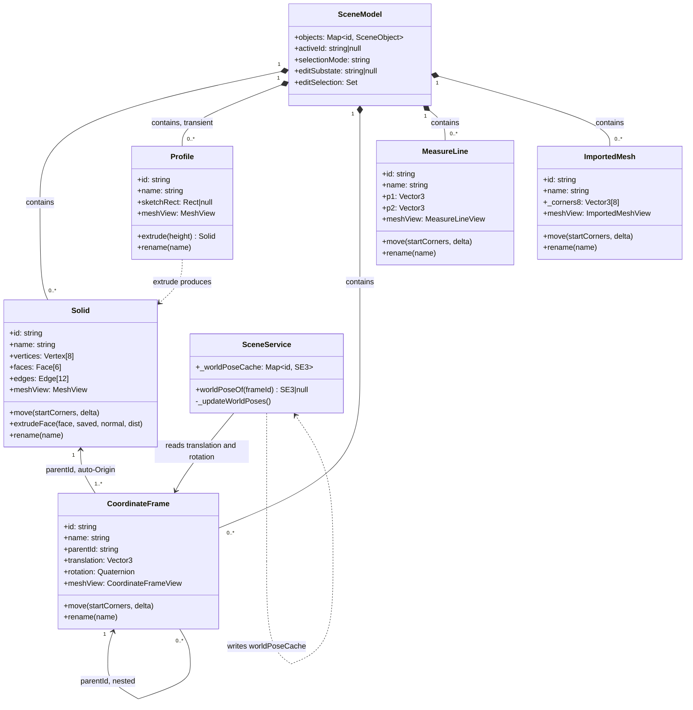
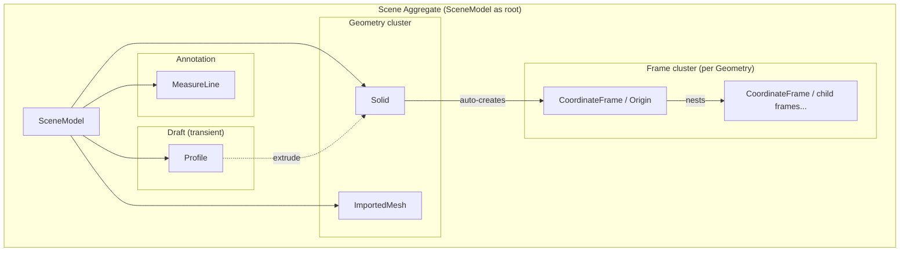

# ADR-020 — Domain Entity Taxonomy Redesign

**Status:** Accepted
**Date:** 2026-03-25
**Supersedes:** Portions of ADR-009 (entity naming), ADR-007 (Cuboid naming)
**References:** ADR-009, ADR-010, ADR-012, ADR-016, ADR-018, ADR-019

---

## Context

The domain entity set has grown organically through DDD Phases 1–5, resulting in
three conceptual problems identified in a design review session:

### Problem 1 — "Cuboid" misrepresents the entity

`Cuboid` was named after its initial shape (a rectangular box). However, since
Phase 5-3 the entity can be deformed arbitrarily via `extrudeFace()`, making it
a general 3D solid body. The name "Cuboid" violates the Ubiquitous Language
principle: a word should mean exactly what the domain means by it, no more, no
less.

### Problem 2 — "Sketch" conflates verb and noun

The word _sketch_ is used in two distinct senses in this codebase:

| Use | Example |
|-----|---------|
| Verb (editor mode) | "Enter sketch mode", "start sketching a rectangle" |
| Noun (domain entity) | `new Sketch(id, name, meshView)` stored in `SceneModel` |

In the editor, `Sketch` as entity is a _transient_ 2D cross-section that exists
only until it is extruded into a `Solid`. It is not a persistent design artifact;
it disappears from the model on extrusion. Calling this transient entity "Sketch"
makes the lifecycle ambiguous and conflates the operation with its intermediate
product.

### Problem 3 — Derived state in the `CoordinateFrame` domain entity

`CoordinateFrame._worldPos` is computed by the animation loop in `SceneService`
and stored directly on the entity. This violates the pure/side-effect separation
rule (CLAUDE.md Constitutional Rule 2): a domain entity's fields should be
domain invariants, not service-layer cache values.

### Problem 4 — Flat type union without categorical structure

All five entity types are stored in the same `Map` inside `SceneModel` with no
explicit sub-categorisation. This obscures which types share capabilities and
makes it harder to enforce capability contracts as new types are added.

---

## Decision

### 1. Rename `Cuboid` → `Solid`

`Solid` accurately reflects the entity's domain meaning: a 3D solid body
represented by a boundary graph (vertices / edges / faces). The word is
established in CAD domain language (OpenCascade, FreeCAD, Fusion 360).

- Source file: `src/domain/Solid.js` (was `Cuboid.js`)
- All `instanceof Cuboid` guards become `instanceof Solid`
- ADR-007 and ADR-009 are partially superseded; ADR-012 graph model is unaffected

### 2. Rename `Sketch` → `Profile`

`Profile` names the _artifact_ (a 2D cross-section, or contour) rather than the
_act_ of drawing it. This separates the noun from the verb.

- Source file: `src/domain/Profile.js` (was `Sketch.js`)
- The _editor mode_ name remains "Sketch mode" / "sketch" in UI strings — the
  mode name is user-facing language, not a domain entity name
- All `instanceof Sketch` guards become `instanceof Profile`
- `Profile.extrude(height)` returns a new `Solid` (same contract as before)
- ADR-009 is partially superseded

### 3. Establish a categorical entity taxonomy

Entities are grouped into four semantic categories. The categories are
**documentation-level** only for now; they are not runtime base classes.
Capability contracts continue to be enforced via `instanceof` type guards.

```
SceneObject (union)
  ├─ Geometry        — occupies 3D space; user-visible shape
  │   ├─ Solid         (deformable 3D solid; editable)
  │   └─ ImportedMesh  (server-computed read-only geometry)
  ├─ Frame           — SE(3) reference frame; no intrinsic shape
  │   └─ CoordinateFrame
  ├─ Annotation      — measurement overlay; no shape, derived from geometry
  │   └─ MeasureLine
  └─ Draft           — transient 2D cross-section; replaced by Solid on extrude
      └─ Profile
```

### 4. Remove `_worldPos` from `CoordinateFrame`; move to SceneService pose cache

`CoordinateFrame`'s domain invariants are its relative transform:
`(parentId, translation: Vector3, rotation: Quaternion)`.

`_worldPos` is **derived state**: it is computed each frame from the parent's
position plus `translation`. It must not live on the entity.

**New design:**

```
CoordinateFrame (Entity)
  Fields (domain invariants):
    id, name, parentId
    translation: Vector3   — offset from parent centroid
    rotation: Quaternion   — relative orientation (intrinsic ZYX = extrinsic XYZ = RPY)

SceneService
  _worldPoseCache: Map<frameId, { position: Vector3, quaternion: Quaternion }>

  _updateWorldPoses()  — called each animation frame; topological-order traversal;
                         writes into _worldPoseCache, NOT into entity fields
  worldPoseOf(frameId) — public query; returns cached SE(3) or null
```

`CoordinateFrameView.update(worldPos, worldQuat)` takes explicit arguments from
the service rather than reading entity fields directly.

---

## Ubiquitous Language

This table is the authoritative glossary for entity naming in this project.

| Term | Domain meaning | Old name | Notes |
|------|---------------|----------|-------|
| **Solid** | A 3D solid body with boundary graph (V/E/F); editable | `Cuboid` | Not necessarily box-shaped |
| **Profile** | A transient 2D rectangular cross-section before extrusion | `Sketch` | Disappears when extruded |
| **CoordinateFrame** | An SE(3) named reference frame child of a Geometry or another Frame | — | Unchanged |
| **MeasureLine** | A 1D distance annotation between two world-space points | — | Unchanged |
| **ImportedMesh** | Read-only geometry computed server-side | — | Unchanged |
| **Sketch mode** | Editor interaction mode for drawing a Profile | — | UI string; not an entity |
| **Extrude** | The operation that replaces a Profile with a Solid | — | `Profile.extrude(h) → Solid` |

---

## Entity Relationship Diagram



### Aggregate boundaries



---

## Capability Matrix

Two distinct rotation operations exist in the editor:

| Operation | Trigger | Description |
|-----------|---------|-------------|
| **Rotate (R key)** | R → axis (X/Y/Z) → drag or type degrees | Applies a rotation to the selected object using R key workflow |
| **Ctrl+drag rotation** | Ctrl + pointer drag on canvas | Freeform rotation using mouse; based on local vertex geometry |

| Entity | Edit Mode | Grab/Move | Pointer drag | Rotate (R key) | Ctrl+drag rot | Face Extrude | Persistent |
|--------|-----------|-----------|-------------|----------------|---------------|-------------|------------|
| `Solid` | ✓ (3D) | ✓ | ✓ | ✗ | ✓ | ✓ | ✓ |
| `Profile` | ✓ (2D) | ✗ | ✗ | ✗ | ✗ | ✗ | ✗ transient |
| `CoordinateFrame` | ✗ | ✓ (G) | ✗ | ✓ (R) | ✗ | ✗ | ✓ |
| `MeasureLine` | ✗ | ✓ (G) | ✗ | ✗ | ✗ | ✗ | ✓ |
| `ImportedMesh` | ✗ | ✓ | ✓ | ✗ | ✗ | ✗ | ✓ |

> Note: `Solid` does not currently support R key rotation. Ctrl+drag rotation relies on local vertex geometry and is therefore blocked for `CoordinateFrame`, `MeasureLine`, and `ImportedMesh`.

---

## Consequences

### Immediate (this ADR)

- `src/domain/Cuboid.js` → `src/domain/Solid.js`; class renamed `Solid`
- `src/domain/Sketch.js` → `src/domain/Profile.js`; class renamed `Profile`
- All `instanceof Cuboid` / `instanceof Sketch` guards updated site-wide
- `CoordinateFrame._worldPos` field removed from entity
- `SceneService._worldPoseCache` introduced; `_updateWorldPoses()` replaces
  direct entity mutation in the animation loop
- `CoordinateFrameView.update(worldPos, worldQuat)` signature changed to accept
  explicit arguments instead of reading from entity
- **Euler convention corrected**: `CoordinateFrame` rotation display changes from
  `Euler('XYZ')` (intrinsic XYZ = extrinsic ZYX) to `Euler('ZYX')` (intrinsic ZYX
  = extrinsic XYZ = RPY), matching the ROS REP-103 convention already adopted for
  the world frame. Affected sites: `CoordinateFrame.js` JSDoc,
  `AppController.js` (`setFromQuaternion` calls), `UIView.js` N-panel label.
  N-panel label changes from "Rotation (Local · XYZ)" to "Rotation (Local · RPY)".

  | Convention | Three.js order | Meaning |
  |-----------|---------------|---------|
  | ~~intrinsic XYZ~~ (old) | `'XYZ'` | X first on body axis → extrinsic ZYX |
  | **intrinsic ZYX** (new) | `'ZYX'` | Yaw→Pitch→Roll on body axes = **ROS RPY** |

### Deferred (follow-up ADRs)

- Category base classes / shared interface (`ISceneObject`) — if needed for
  structural typing (defer until a second concrete use case appears)
- `SceneObject` typedef in `SceneModel.js` updated to reflect new names
- `Profile` lifecycle contract (when/how it is garbage-collected after extrusion)
  may warrant a dedicated ADR if parametric modelling is introduced later

### ADRs partially superseded

| ADR | Superseded aspect |
|-----|-------------------|
| ADR-007 | "Cuboid" naming; shape is now called `Solid` |
| ADR-009 | Entity class names `Cuboid` → `Solid`, `Sketch` → `Profile` |
| ADR-018/019 | `_worldPos` field on `CoordinateFrame`; moved to `SceneService` |
