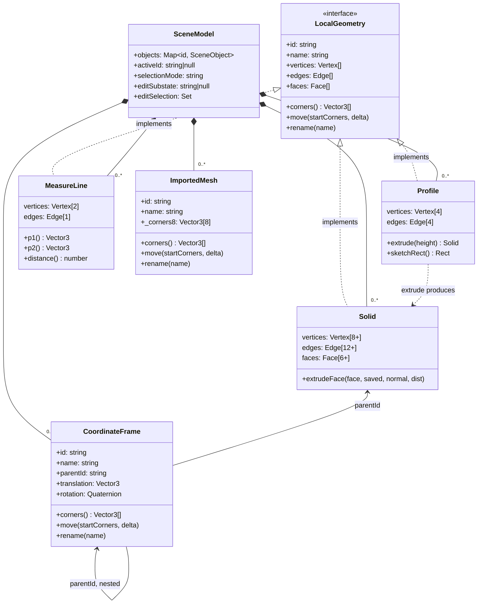

# ADR-021 — Unified Local-Geometry Graph Interface

**Status:** Accepted
**Date:** 2026-03-25
**Extends:** ADR-012 (Graph-based Geometry Model)
**References:** ADR-012, ADR-020, ADR-009, ADR-005

---

## Context

### ADR-012 defined the graph model for `Solid` only

ADR-012 established a dimensional hierarchy built on graph primitives:

| Dimension | Graph primitive | Composition |
|-----------|----------------|-------------|
| 0D | `Vertex` | 1 point in space |
| 1D | `Edge` | 2 Vertices |
| 2D | `Face` | Closed cycle of Edges |
| 3D | `Solid` | Closed polyhedron of Faces |

And "verbs" that raise dimension:

| Verb | Transform | Description |
|------|-----------|-------------|
| sketch | 1D → 2D | Creates a Face (Profile) from two Vertices |
| extrude | 2D → 3D | Creates a Solid from a Face (Profile) |

However, this graph vocabulary was applied **only to `Solid`**. The other
geometric scene objects — `MeasureLine` and `Profile` — were implemented with
their own ad-hoc field names, hiding their structural relationship to the same
graph model:

```js
// MeasureLine — independent field names
p1: Vector3
p2: Vector3

// Profile (was Sketch) — independent field names
sketchRect: { p1: Vector3, p2: Vector3 }

// Solid — graph vocabulary ✓
vertices: Vertex[8]
edges: Edge[12]
faces: Face[6]
```

### ERD organized from names, not from structure

The entity ERD in ADR-020 reflects this disunity: it reads as five structurally
different entities when three of them (`MeasureLine`, `Profile`, `Solid`) are
fundamentally the same concept — an **embedded graph** — at different
topological scales.

The structural commonality is:

| Entity | \|V\| | \|E\| | \|F\| | Graph topology |
|--------|-------|-------|-------|----------------|
| `MeasureLine` | 2 | 1 | 0 | Path P₂ |
| `Profile` | 4 | 4 | 0 | Cycle C₄ (rectangular) |
| `Solid` | ≥8 | ≥12 | ≥6 | B-rep polyhedron |

The word-first ERD makes these look like unrelated types. A structure-first
view reveals they are the same abstraction at different scales.

---

## Decision

### 1. Define the "LocalGeometry" category

A `LocalGeometry` entity is any scene object that carries a complete local
graph (`vertices`, `edges`, optionally `faces`) whose positions are stored
client-side and are mutated by local operations (move, extrude, etc.).

```
LocalGeometry
  ├─ MeasureLine   |V|=2, |E|=1         (1D: path)
  ├─ Profile       |V|=4, |E|=4         (2D: closed loop)
  └─ Solid         |V|≥8, |E|≥12, |F|≥6 (3D: closed polyhedron)
```

`ImportedMesh` and `CoordinateFrame` are **not** `LocalGeometry`:

| Entity | Why excluded |
|--------|-------------|
| `ImportedMesh` | No local graph; geometry lives on server; only a synthetic AABB proxy exists client-side |
| `CoordinateFrame` | Not a shape; represents SE(3) transform only — `translation: Vector3` + `rotation: Quaternion` |

### 2. Unify field vocabulary across all LocalGeometry entities

All `LocalGeometry` entities expose the same graph fields:

```
vertices: Vertex[]   — ordered array of graph nodes
edges:    Edge[]     — connectivity (v0, v1 references)
faces:    Face[]     — optional; only Solid carries faces
```

**Migration:**

| Entity | Old fields | New fields |
|--------|-----------|-----------|
| `MeasureLine` | `p1: Vector3`, `p2: Vector3` | `vertices: Vertex[2]`, `edges: Edge[1]` |
| `Profile` | `sketchRect: { p1, p2 }` | `vertices: Vertex[4]`, `edges: Edge[4]` |
| `Solid` | `vertices: Vertex[8+]`, `edges: Edge[12+]`, `faces: Face[6+]` | unchanged |

Derived accessors are preserved for callers:

```js
// MeasureLine — backward-compatible getters
get p1() { return this.vertices[0].position }
get p2() { return this.vertices[1].position }
get distance() { return this.p1.distanceTo(this.p2) }

// Profile — backward-compatible getter
get sketchRect() {
  return { p1: this.vertices[0].position, p2: this.vertices[2].position }
}
```

### 3. Define a shared LocalGeometry interface

All `LocalGeometry` entities satisfy the following interface (no runtime base
class required; enforced by convention and `instanceof` dispatch):

```js
interface LocalGeometry {
  id:       string
  name:     string
  vertices: Vertex[]
  edges:    Edge[]
  faces:    Face[]        // empty array [] for 1D and 2D entities

  get corners(): Vector3[]  // = vertices.map(v => v.position)
  rename(name: string): void
  move(startCorners: Vector3[], delta: Vector3): void
}
```

`ImportedMesh` and `CoordinateFrame` also implement `corners` / `move` /
`rename` for grab-system compatibility, but do so independently (they are not
`LocalGeometry`).

### 4. Revise the entity taxonomy

The two-axis matrix below is now the canonical classification. Both axes are
orthogonal and together are exhaustive over all current entity types:

|  | **Local graph** | **Proxy (AABB)** | **SE(3) transform** |
|--|----------------|-----------------|---------------------|
| **Shape (persistent)** | `Solid` | `ImportedMesh` | — |
| **Reference** | — | — | `CoordinateFrame` |
| **Annotation** | `MeasureLine` | — | — |
| **Draft (transient)** | `Profile` | — | — |

*Structural axis (columns)*: how geometry is represented in the client.
*Semantic axis (rows)*: what domain role the entity plays.

### 5. Revise the Capability Matrix (MECE)

Symbols: **✓** = implemented · **○** = planned (not yet, but applicable) ·
**—** = not applicable by design

**Translation**

| Entity | G key | Pointer drag |
|--------|-------|-------------|
| `Solid` | ✓ | ✓ |
| `Profile` | — | — |
| `MeasureLine` | ✓ | — |
| `CoordinateFrame` | ✓ | — |
| `ImportedMesh` | ✓ | ✓ |

**Rotation**

| Entity | R key | Ctrl+drag |
|--------|-------|-----------|
| `Solid` | ○ | ✓ |
| `Profile` | — | — |
| `MeasureLine` | — | — |
| `CoordinateFrame` | ✓ | — |
| `ImportedMesh` | — | — |

**Edit**

| Entity | Enter Edit Mode | Face Extrude | Sub-element select (V/E/F) |
|--------|----------------|-------------|---------------------------|
| `Solid` | ✓ (3D) | ✓ | ✓ |
| `Profile` | ✓ (2D) | — | ○ |
| `MeasureLine` | — | — | — |
| `CoordinateFrame` | — | — | — |
| `ImportedMesh` | — | — | — |

**Lifecycle**

| Entity | Persistent | Auto-created | Replaced on operation |
|--------|-----------|-------------|----------------------|
| `Solid` | ✓ | ✓ (Box) | — |
| `Profile` | — (transient) | ✓ | replaced by `Solid` on extrude |
| `MeasureLine` | ✓ | — | — |
| `CoordinateFrame` | ✓ | ✓ (Origin frame) | — |
| `ImportedMesh` | ✓ | ✓ (on geometry.update) | — |

> **Note on `Solid` R key rotation**: Ctrl+drag rotation operates on local
> vertex geometry (and therefore requires `LocalGeometry`). R key rotation is
> a pure SE(3) operation and is applicable to any entity that has a meaningful
> orientation; `Solid` should support it in a future iteration.

---

## Updated ERD

The ERD is now organized around the structural axis first, semantic labels
second.



---

## Consequences

### Immediate

- `MeasureLine.p1` / `MeasureLine.p2` (Vector3 fields) replaced by
  `vertices: Vertex[2]`, `edges: Edge[1]`; `p1` / `p2` / `distance` become
  computed getters
- `Profile.sketchRect` replaced by `vertices: Vertex[4]`, `edges: Edge[4]`;
  `sketchRect` becomes a computed getter
- All `AppController` / `MeasureLineView` sites reading `p1` / `p2` directly
  must migrate to the getter or `vertices[i].position`
- `SceneService.createMeasureLine(p1, p2)` constructs `Vertex` + `Edge` objects
  internally before passing to `MeasureLine`
- `SceneService.createProfile(rect)` constructs 4 `Vertex` + 4 `Edge` objects

### Backward compatibility

`p1` / `p2` / `sketchRect` are retained as **read-only getters** in this
migration phase to avoid breaking all call sites at once. They are marked
`@deprecated` and removed in a follow-up.

### Deferred

- `Profile` vertex-level sub-element selection (Edit 2D → vertex drag) — the
  graph structure makes this straightforward in a future ADR
- `MeasureLine` endpoint drag via Edit Mode — same graph foundation supports it

### ADRs updated

| ADR | Update |
|-----|--------|
| ADR-012 | Dimensional table now covers MeasureLine (1D) and Profile (2D) explicitly, not just Solid (3D) |
| ADR-020 | Capability Matrix replaced by the MECE tables in this ADR |
