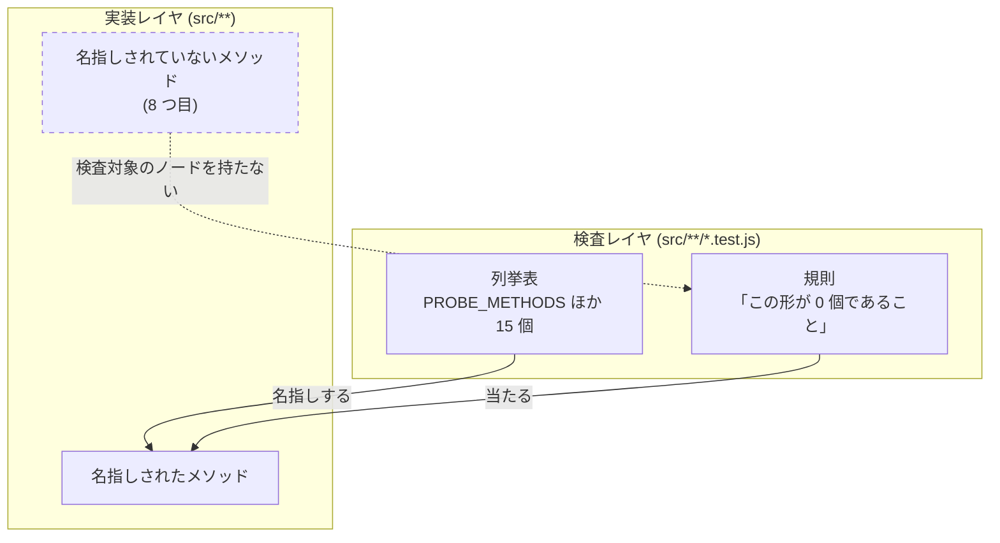
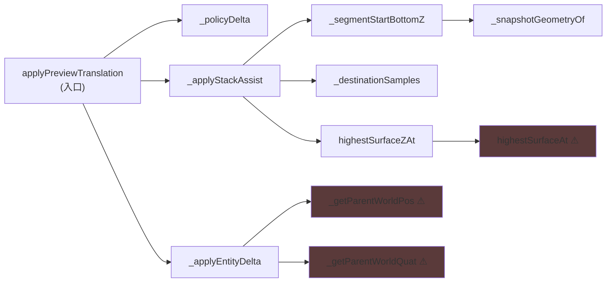

# 102. 列挙表は母集団を持つ — 「場所を並べた表」を廃し、覆うべき集合をコードから導出する

- Status: Accepted (実装済み)
- Date: 2026-07-30
- Deciders: yuubae215, Claude
- Supersedes / Superseded by: なし (ADR-098 / ADR-101 が自ら宣言した限界を回収する)

## Context — Goal と力学 (§1.2 Goal)

**Goal:** 原則 #31 の道具そのものが鮮度を持つこと。「この列挙表は現実を覆っているか」を
**人の記憶ではなく機械が問う**状態にし、表が古びたときに *静かに緑のまま通る* ことを無くす。

### 力学 — 道具の側で原則 #31 が破れていた

原則 #31 (Zero Is a State That Does Not Look Like One) の対処法は
「**必要な種別を列挙して個数を検査する**」である。この repo はそれを 8 本の ADR で
実装してきた (ADR-090 の 0 台、ADR-093 の N 個 lockstep、ADR-096 の既定表、
ADR-097 の pose 入口、ADR-098 のプローブ、ADR-099 の選択の窓、ADR-100 の色、
ADR-101 の writer)。結果、**6 ファイル・15 個の手書き列挙表**が積み上がった。

ところが *列挙する側* もまた表であり、表それ自体が古びる。しかも
**古びた表は違反を見逃すのではなく、緑を出す**。落ちないので誰も気づかない。

この限界は隠れていたのではなく、**ADR が自分で書いて出荷していた**:

> 検査は**名指しした writer の本体**にしか当たらない。8 つ目の writer が
> 増えたら表に足すまで数えられない (ADR-098 のプローブ検査と同じ限界で、埋め方も同じ)
> — ADR-101 §Consequences

「埋め方も同じ」と書いてあるが、埋める行為は**誰かが気づくこと**を前提にしている。
気づきを前提にした規律は、気づかなかった日にだけ必要になる — つまり必要なときには
必ず不在である。これは原則 #31 が名指しする失敗の形そのもの (*在るもの* を辿る検査は、
表に無いものを構造的に見ない) が、**原則 #31 の道具の側**で起きている形である。

### 欠陥の位置 (層マップ)

規則 (T2) は健全だった。欠けていたのは **T1 が S1 ∪ S2 を覆っているかを問う辺**である。

### 実測 — 表は既に古びていた (仮説ではない)

母集団を導出させた**初回の実行**で、手書き表の外に 3 件が落ちてきた:

| 見つかったもの | どの表の外に居たか | 何だったか |
|---|---|---|
| `SceneService.highestSurfaceAt` | `PROBE_METHODS` (7 行) | `!(o instanceof MeasureLine)` で**支える側**を種で門番していた。ADR-098 は載る側の門を 2 枚外したが、その鏡像は誰の表にも無かった |
| `_getParentWorldPos` / `_getParentWorldQuat` | `POSE_COMPUTING_METHODS` (4 行) | pose 決定の閉包の 1 hop 内側で `_worldPoseCache` (live プローブ) を読んでいた |
| `src/view/SelectPulse.js` | `SELECTION_PAINTERS` (9 行) | 選択の tap cue (ADR-068) — 「いま摘んだのはこれ」を塗る 10 個目の描き手 |

**「8 つ目」は増えたのではなく、最初から表の外に在った。** 手で並べた表は
「発見の結果」であり、書いた日の理解の写しでしかない。書いた本人が見落としたものは、
その本人がもう一度読んでも見落とす。

## Options considered

- **A: 表を足すたびにレビューで気をつける。**
  tradeoff: 憲法 Q3 が却下している形そのもの (答えが「誰も開かない散文」)。
  ADR-098 と ADR-101 は実際にこの道を選び、2 回とも同じ限界を出荷した。
  2 回の実例がある以上、3 回目を期待する根拠が無い。

- **B: 母集団を最大に取る (SceneService の全メソッド・全 test ファイルの全 const)。**
  tradeoff: 実測で SceneService 126 メソッド中 37 本が `instanceof` を含み、
  その大半は配置と無関係 (保存/読込・祖先探索・IFC クラス設定)。全 test ファイルの
  大文字 const は 32 個で半分が fixture (`const SEED = {...}`)。
  **無視される規則になる** = 希釈 (原則 #20 / 憲法 Q3)。規則が無いより悪い。

- **C: 表に種別を与え、母集団を持たない種別を 0 個にする。** ← 採用
  tradeoff: 種別の判定に嘘をつく余地が残る (下記 §受け入れるコスト)。
  母集団の導出コードを書く必要がある (呼び出し閉包など)。

- **D: 何もしない。**
  tradeoff: 表は今後も増える (8 本の ADR が 15 個を生んだ = 1 ADR あたり約 2 個)。
  古びる速度は表の数に比例し、気づく確率は反比例する。

## Decision — Strategy (§1.2 Strategy)

### Decision 1 — 列挙表を 4 種に型付けし、`place-list` を 0 個にする

「母集団を持つ」= その表が覆うべき集合を**コードから導出**でき、未分類の個数を
数えられること。

| kind | 母集団 | 鮮度の担保 |
|------|--------|-----------|
| `shape-census` | `src/**` 全体 (走査) | 構造的に新鮮 — 新しいファイルは自動で母集団に入る |
| `derived-partition` | コードから導出した集合 | 未分類 0 個 **+ 逆向き** (宣言の空回り) を両方問う |
| `declared-exception` | 宣言そのもの | 逆向きのみ — 宣言した形が実在するか |
| `place-list` | **無い** | ← これが欠陥。**種別として存在させない** |

`place-list` は「登録できない」形で禁じる。種別を足せる限り次の place-list は必ず
生まれるので、語彙の側で閉じる (`KIND` に無い種別は throw — 原則 #31 の
「未宣言の種で throw する表」と同じ形)。

種別を名乗るだけなら嘘がつけるので、**種別ごとに機械的な痕跡を要求する**:
`shape-census` なら `collectSources(`、`derived-partition` なら
`assertCoversPopulation(`、`declared-exception` なら `assertDeclarationsExist(` が
同じファイルに在ること。宣言と実装の距離を詰める。

### Decision 2 — 母集団は「呼び出し閉包」から導く (pose の場合)

pose 決定に参加するメソッドの母集団を、`applyPreviewTranslation` からの
**`this._x()` 辺の到達集合**として導出する (実測 11 本)。

⚠ = 手書き表の外に居た 3 本。閉包はこれを**人が気づかなくても**母集団に入れる。
新しいメソッドが入口から呼ばれた日にそれは母集団へ入り、呼ばれなくなれば出る。
**人の記憶が母集団の権威でなくなる**ことが要点。

母集団を「SceneService 全体」にしない理由は Option B のとおり。閉包は
*広すぎず狭すぎない* 唯一の自然な境界で、しかも境界の位置を人が選んでいない
(入口を 1 つ名指しすれば残りはコードが決める)。

同じ形で「支える側になれるか」を宣言表へ移した — `SUPPORT_SURFACE_BY_KIND` +
`providesSupportSurfaceFor()` (未宣言の種で throw)。載る側の `SUPPORT_PROBE_BY_KIND`
の**鏡像**であり、鏡像なので検査も鏡像にする。非対称を残すと片側だけが throw し、
もう片側は黙って落ちる — その非対称こそ ADR-098 が消した欠陥の形だった。

### Decision 3 — 表を数える表もまた表である (自己適用)

`src/CensusCoverage.test.js` が登録簿 `CENSUS_REGISTRY` を持ち、母集団を**構文から**
導出する: census 形の test ファイル (`src/census/sources.js` を引くもの) に現れる
`const 大文字 = [` / `= {`。手書きのファイル名リストも表名リストも持たない。

**登録簿自身も登録簿に載る。** 載せないと「表を数える表」だけが数えられない状態になり、
それはこの ADR が閉じている欠陥そのものになる。再帰はここで止まる — 母集団の権威が
構文 (機械が数えられるもの) に降りているため。

### Decision 4 — 走査の道具を 1 箇所へ (§1.1)

`collectSources` / `stripComments` は 6 ファイルに写しで存在し、対象範囲が既に
ずれていた (ある検査は `.jsx` を見て、ある検査は見ない)。`src/census/sources.js` に
正本を置く。**数える道具が数え漏らす**のは、この ADR が閉じている欠陥そのもの。

## Consequences — Evidence と tradeoff (§1.2 Evidence)

- **肯定的:**
  - G1 — ADR-098 / ADR-101 が「埋められない」と宣言した限界が閉じた。**変異で確認済み**:
    pose 決定の閉包に到達する新メソッド (種分岐 + live プローブ読み) を注入すると、
    表を 1 行も触っていないのに 2 本の検査が**その名前を名指しして** fail する。
  - G2 — 表が古びていたことが実測で 3 件出た。うち 1 件 (`highestSurfaceAt`) は
    実際の種の門で、宣言表へ移した。残る 2 件は正当な読みだったので**消さずに宣言**した
    (前提が崩れた日に議論の場所ができる)。
  - G3 — 新しい列挙表は登録しなければ CI が落ちる。`place-list` は種別として書けない。
  - 副産物: 走査の道具が 1 つになり、6 ファイルにあった `.jsx` を見る / 見ないの
    ズレが消えた。

- **受け入れるコスト / 否定的:**
  - **種別の申告に嘘をつく余地は残る。** `place-list` を `shape-census` と名乗る
    ことは、痕跡 (`collectSources(`) が同じファイルに在れば通ってしまう。
    痕跡は「その種別で使われていれば必ず在るもの」であって「それ以外では在り得ない
    もの」ではない。完全な静的判定は不可能なので、**距離を詰めるところで止める**。
  - **census 形でない test ファイルに作った表は見えない。** 母集団を全 test
    ファイルへ広げると fixture が大量に入って希釈する (Option B)。境界を
    「ソースを読む test」に置いたのは**宣言であって推論ではない** — 限界を
    `CensusCoverage.test.js` の冒頭に明記した。
  - 閉包は同一ファイル内の `this.` 辺しか辿らない。他オブジェクト経由や動的
    ディスパッチで pose を決める経路が生まれたら母集団から漏れる。広げると母集団が
    ファイル全体へ膨らむので、意図的に狭く保っている。
  - `POSE_COMPUTING_METHODS` は役割が変わった (規則が当たる母集団 → 人が名前で読む
    一覧)。閉包の中に実在するかだけを逆向きに問う。

- **検証 (証拠):** 論証木は `docs/gsn/adr-102-census-tables-need-a-denominator.gsn`
  (goal ごとの支えの正本はそちら)。
  - `src/CensusCoverage.test.js` — 未登録の表が 0 個 / 種別の痕跡 / `place-list` が
    語彙に無いこと / 母数の liveness。**変異で確認済み**: 登録簿から自分の行を
    抜くと `src/CensusCoverage.test.js::CENSUS_REGISTRY` を名指しして fail する。
  - `src/PosePolicyOwnership.test.js` — 閉包 ∩ 種分岐 = 宣言済みのみ、
    閉包 ∩ live プローブ = 宣言済みのみ、プローブ表 = 宣言表を引くメソッド集合。
    **変異で確認済み** (2 種):
    (a) `providesSupportSurface` を `instanceof MeasureLine` に戻すと 3 本が
    `highestSurfaceAt` を名指しして fail、
    (b) 閉包に到達する新メソッドを注入すると 2 本が `_topZOfNewProbe` を名指しして fail。
  - `src/domain/placement.test.js` — `SUPPORT_SURFACE_BY_KIND` の両向き個数検査、
    未宣言の種で throw、**退役した `instanceof` の門と同じ答えを出すこと** (振る舞いの保存)。
  - `src/theme/tokens.test.js` — `COLOR.accent` の消費者 16 ファイルが
    「描き手 10」+「別の意味 6」に分割され、未分類 0 個。
  - 回帰なし: `pnpm test` 933/933、`pnpm typecheck` clean。
  - **この証拠が構造的に見逃すもの:** 検査は静的 (ソース文字列) なので、実行時に
    しか決まらない経路 (動的ディスパッチ・文字列によるメソッド呼び出し) は見ない。
    また「種別の申告が正しいか」は痕跡までしか問えない (上記コスト欄)。

- **波及 (blast radius):**
  - 新規: `src/census/sources.js`、`src/census/partition.js`、`src/CensusCoverage.test.js`
  - 実装: `src/domain/placement.js` (支持面の宣言表)、`src/service/SceneService.js`
    (`highestSurfaceAt` の種の門を宣言へ)
  - 検査: `src/PosePolicyOwnership.test.js`、`src/theme/tokens.test.js`、
    `src/SelectionOwnership.test.js`、`src/VisibilityOwnership.test.js`、
    `src/IdentityContainment.test.js`、`src/DanglingSelfCallCensus.test.js`、
    `src/domain/placement.test.js`
  - 台帳: `docs/STATE_LEDGER.md` に 3 行 (支持面の宣言 / 原則 #31 の列挙表 / pose 決定に
    参加するメソッド)。3 行とも**基数**が主役の行で、状態集合より基数列のほうが長い —
    この決定が動かしたのが「いくつ在るか」だからである (核 §1.4)。
  - **触らなかったと宣言するもの:** 契約 (`packages/grasp-contract`)・BFF・`core/`。
    この決定は検査レイヤとドメインの宣言表に閉じており、ワイヤ形式を変えない。
    `_worldPoseCache` 自身の鮮度 (原則 #23 の破れ) も ADR-101 のまま — 本 ADR は
    読み手を**数える**だけで、キャッシュは直していない。

## Lens notes

- **グラフ (§1.3):** 決定の中心が呼び出しグラフそのもの。「blast radius = 入口からの
  到達可能ノード集合」という核 §1.3 の定義を、比喩ではなく**実行されるコード**として
  使った初めての ADR。
- **§1.1 の三スケール:** データ (走査の道具の正本を 1 つに)、ドメイン (支える側の
  問いを `placement.js` へ)、依存方向 (`src/census/` は検査の道具なので母集団から除外 —
  道具が対象に混じると規則の *説明* が違反として数えられる)。
- **原則 #31 の自己適用:** 本 ADR は原則 #31 を**原則 #31 の道具に**当てたもの。
  同じ原則が一段上の階層で再発したので、PHILOSOPHY #31 に「道具にも母集団が要る」
  という一文を足すのではなく、**この ADR を #31 の 9 例目として記録する** — 原則の
  文言は変えず、写像 (`.claude/rules/10-principles.md` の §このリポジトリでの写像) に
  問い所を 1 行足すに留める (原則集を太らせない — 希釈の防止)。
