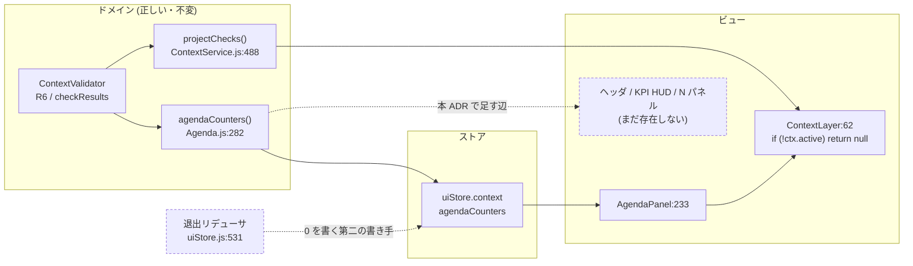

# 105. 「検証されていない」は「問題が無い」ではない — 発見の集約を場の外へ出す

- Status: Proposed
- Date: 2026-08-02
- Deciders: yuubae215, Claude
- Supersedes / Superseded by: なし (ADR-104 D4 が作ったカウンタに**住所**を与え、ADR-050 の
  Context オーバーレイの被覆範囲を縮める)

## Context — Goal と力学 (§1.2 Goal)

**Goal:** 場を開かずに「未解決があるか」が分かる。かつ、そのとき出た `0` が
**「調べて無かった」なのか「まだ調べていない」なのか**を、人が取り違えられない。

IA 再設計 (`docs/ia-redesign/`) の Phase 2。基準は `02-grouping-criteria.md` の
「発見 = 戻り値 (単数の視野で計算できる) / 解消 = 場 (食い違いは 1 人の視野の中に存在しない)」で、
現状の渋滞は**発見と解消を同じ場でやっている**ことに由来する、というのがその帰結だった。

### 力学 1 — 集約は既に在る。描かれる場所が場の中にしかない

ADR-104 D4 で `agendaCounters()` は実装済み (`src/context/Agenda.js:282`) で、
`conflicts` / `agenda` / `unowned` の 3 数を返す。合算しない。0 を隠さない。**中身は正しい。**

しかし描き手は `src/components/Context/AgendaPanel.jsx:233` の 1 箇所だけで、
それは `ContextLayer` の中にいる。そして `src/components/Context/ContextLayer.jsx:62`:

```js
if (!ctx.active) return null
```

**場に入る必要があるかを教えるカウンタが、場に入らないと存在しない。** これが
`02-grouping-criteria.md` が名指しした循環依存の、コード上の正体である。ワイヤーフレーム v8 の
注釈「ヘッダ: シーンスコープ + 発見の集約」が *集約 = 常設 / 展開 = 呼び出し* と書いたのは
この辺を切ること。

### 力学 2 — 退出時に `0` を書く第二の書き手がいる

`src/store/uiStore.js:531` — Context を抜けるリデューサが、他の 14 個のスライスと一緒に
カウンタを `{ conflicts: 0, agenda: 0, unowned: 0 }` へ**戻す**。

したがって画面に残りうる `0` には出所が 2 つある。ドメインが数えた 0 と、
**UI のライフサイクルが書いた 0**。前者は事実で、後者は事実の不在である。
`agendaCounters` は導出値なのに、書き手が `contextSetAgenda` (`uiStore.js:449`) と
この退出パスの **2 つ**ある — 原則 #4 (Every Visual Flag Has One Owner) の違反であり、
より根では原則 #24 (導出値を保存して第二の源にしない) の違反でもある。

### 力学 3 — 文書の基数は `0..1` で、`0` は正当かつ頻出

`ContextService._doc` の初期値は `null` (`src/service/ContextService.js:87`)。
起動直後・ホーム画面・テンプレ選択前は文書が無い。**これは異常系ではなく通常の起動経路**である。

文書 0 件のとき「未解決 0 件」と出すのは嘘になる。台帳 (`docs/STATE_LEDGER.md`) の議題行は
既に「0 = 場に何も上がっていない (正当・頻出。カウンタは 0 を隠さず出す)」と宣言しているが、
それは**文書が在る前提での 0** であって、文書が無いときの 0 は別物である。

### 力学 4 — 共有 KPI はタブの存在自体が文書に依存する

`ContextLayer.jsx:79` — `ctx.checks?.length > 0` のときだけ `Checks` タブが生える。
文書が checks を宣言しなければタブごと存在しない。`02-grouping-criteria.md` の検出した違反
「**共有 KPI が最も場に縛られた場所にある**」がこれである。

### したがって: ここには 0 が 3 種類ある

| 何が起きているか | 今の見え方 | 正しい見え方 | 次の一手 |
|---|---|---|---|
| 文書が無い / まだ検証を走らせていない | `0` (または画面から消滅) | **未検証** | 文書を採る |
| 文書は在るが検査を 1 つも宣言していない | `0` (タブごと消滅) | **検査対象なし** | 検査を宣言する |
| 検査が在り、全部通った | `0` | **全部パス** | 何もしなくてよい |

3 つは**次の一手が全部違う**のに、同じ `0` (ないし同じ「何も出ない」) に潰れている。
原則 #31 の典型 — 不在は検査対象のノードを持たないので、*在るもの*を辿る限り永久に見えない。
ADR-104 D2 が所有者の 0 を 2 種に割ったのと同じ形で、こちらは 3 種になる。

### 位置づけ (層とグラフ)



**ドメインは触らない。** 変わるのは「誰が読むか」と「読めない時に何と言うか」だけである。

## Options considered

- **A: カウンタの描き手をヘッダへ足す (数値のまま)** — 最小。循環依存は切れる。
  tradeoff: 文書 0 件のとき `0 0 0` と出るので、**嘘が常時見える場所へ昇格する**。
  いま嘘は場の中に隠れているぶんまだマシで、A は害を増やす。
- **B: 3 数 + `hasDocument: boolean` を足す** — 判定はできる。
  tradeoff: 状態を boolean で暗黙化する形 (核 §1.4 が名指しで禁じる)。
  かつ「文書は在るが検査 0 件」を表現できないので、3 種のうち 2 種しか割れない。
- **C: 集約を kind 判別の有界 union にし、「未検証」を第一級の値にする** — 採用。
  tradeoff: 消費側が `kind` で分岐する必要があり、描き手のコードが 1 段増える。
  0 を出せば済んだところで**宣言を強制**するので、書く側の手間は確実に増える。
- **D: 現状維持** — tradeoff: Phase 2 の Goal (場を開かずに分かる) が達成されない。
  加えて力学 2 の二重書き手は放置すると「なぜか 0 になる」バグの温床として残る。

## Decision — Strategy (§1.2 Strategy)

### D1. 発見の集約は `ctx.active` に依存しない描き手を持つ

集約 (3 カウンタ + シーンスコープ KPI) の描き手は Context オーバーレイの外に住み、
**場の開閉と独立に**存在する。`ContextLayer` は展開 (場) の器のままで、集約を持たない。

住所そのもの (ヘッダ / 3D 左上 HUD の px) は**この ADR では決めない** —
正本はワイヤーフレーム v8 の注釈と `docs/LAYOUT_DESIGN.md` で、ADR に写すと第二の源になる (§1.1)。

### D2. 集約の型は「未検証」を含む kind 判別の union

```
DiscoverySummary =
  | { kind: 'unexamined' }                                  // 文書が無い / まだ走らせていない
  | { kind: 'examined', conflicts: n, agenda: n, unowned: n }
```

`null` や `undefined` や `0` で代用しない — それらは**推論させる**形であり、本 ADR が
消そうとしているものそのものである。ADR-060 が契約の pose に課した「kind 判別の有界 union」と
同じ形を、画面上の集約へ適用する (原則 #2)。

**未検証は失敗ではない。** 起動直後の正常な状態なので、警告色で出さない。

### D3. 検査 (共有 KPI) の 0 も宣言で割る

`検査対象なし` (`acceptance` が空) と `全部パス` (`checkResults` が全部 pass) を別の値にする。
「✓ 全部パス」を検査 0 件のときに出すのは嘘であり、何も出さないのは原則 #15 (Fixed Slots) 違反。
**正当な 0 は推論させず宣言させ、出口を名指しする** (ADR-090 の「0 台のロボット」と同じ形)。

### D4. 導出値の書き手は 1 つ。UI ライフサイクルは書き手ではない

`uiStore.js:531` の退出リデューサは `agendaCounters` を**書かなくなる**。集約は
`ContextService` (validator 結果 + 文書) から導出され、書き手は 1 つだけになる (原則 #4 / #23)。

「Context を抜けた」は**集約が変わる理由ではない** — 抜けても衝突は 3 件のままである。
UI の遷移が導出されたドメインの事実を書き換えられる限り、その事実は導出値ではなく
第二の源である (原則 #24)。

### D5. エンティティスコープの検証は文書ではなく**選択**に依存する

リーチ / 干渉 / 把持候補は選択された実体の隣 (N パネル) に出し、可用性は
`ctx.active` や文書の有無ではなく**その実体が選ばれているか**で決まる。
`置く → 届くか見る → 置き直す` のループを閉じるための移動で、
ADR-085 の「grasp-search を無フォームで開く」が既に作った先例の一般化である。

### D6. 画面端の占有は既存の 1 箇所が持つ

ヘッダと 3D ビュー上のオーバーレイは有限の端を食う。占有オフセットの計算は
`_updateGizmoOffset()` が右端について既に持っているのと同じく、**呼び出し箇所ごとに
パッチしない** (原則 #26)。新しい占有者を足すなら計算を持つ側に足す。

## Consequences — Evidence と tradeoff (§1.2 Evidence)

**肯定的:**

- 場に入らずに「入る必要があるか」が分かる (Phase 2 の完了条件そのもの)。
- `0` の 3 義性が型で割れるので、「検査していないのに緑」が**書けなくなる**。
- 導出値の書き手が 1 つになり、「Context を抜けたらカウンタが消えた」が構造的に起きない。
- ドメイン (validator / `agendaCounters` / `projectChecks`) を 1 行も変えずに済む。
  ADR-104 の実装がそのまま効く。

**受け入れるコスト / 否定的:**

- 消費側に `kind` 分岐が増える。0 を出せば済んだ場所で宣言を強いる (これは意図した代償)。
- ヘッダと 3D ビュー上の常設要素が増える = 端の予算を食う (D6 が統治する)。
- 「未検証」を正しく出すには**文書が無い経路でも集約を配線する**必要があり、
  現在 Context 配線は `ContextController` に閉じているので配線が 1 本増える。

**検証 (証拠):** `docs/gsn/adr-105-unexamined-is-not-clear.gsn`。
goal ごとの支えの正本は `.gsn` 側 (ここには複製しない — §1.1)。
本 ADR は **Proposed** なので証拠は全て未来形であり、`.gsn` の goal は
`support-exploring` として、何を実行すれば決着するかを `assumption` で名指ししてある。

数える形 (原則 #31 / ADR-102 — 母集団はコードから導出し、手書きの場所リストにしない):

- **発見の集約を描く箇所のうち、`ctx.active` に依存するものが 0 個。** 母集団は
  `agendaCounters` / `projectChecks` の消費者の閉包から導出する (在る描き手を辿らない)。
- **`context.agendaCounters` を書くストア入口が 1 個。** 現在 2 個 (`:449` と `:531`)。
- **`kind` を分岐せずに集約を読む消費者が 0 個。**

**波及 (blast radius):**

| ノード | 変わるか |
|---|---|
| `src/context/Agenda.js` / `ContextValidator.js` / `projectChecks()` | **不変** (ドメインは正しい) |
| `src/store/uiStore.js` | 集約スライスの型と書き手 (D2 / D4) |
| `src/components/Context/ContextLayer.jsx` | 集約を手放す。展開 (場) の器は残る |
| `src/components/Header/` · 3D ビュー上の HUD · `src/components/NPanel/` | 描き手を得る (D1 / D5) |
| `packages/grasp-contract` · `server/` · `core/` | **不変** — ワイヤに載る事実は変わらない (原則 #29) |
| `docs/STATE_LEDGER.md` | 「発見の集約」の行を追加 (基数列 = 文書 `0..1` × 検査 `0..N`) |
| `docs/LAYOUT_DESIGN.md` · `docs/SCREEN_DESIGN.md` | 常設要素の追加に伴い更新 |

## Lens notes

- **様態 (BPMN / CMMN)** — 発見は事象駆動 (文書・シーンが変わるたび再導出) なので CMMN 側。
  場 (解消) は順序のある BPMN 側で、両者を同じ器に入れていたのが `ContextLayer` の 10 タブだった。
- **状態機械 (§1.4)** — 新しい遷移は起こさない。集約は**導出**なので lifecycle を持たない。
  持つのは基数だけであり、それは台帳の基数列の仕事である (§1.4 / 原則 #31)。
- **層 + 契約** — 変わるのはフロント内部の読み手だけで、BFF / コアAPI の契約は不動。
  「発見」はソルバが決定した事実の**表示**であって、解法ではない (CLAUDE.md スコープ境界)。
- **ADR-103 との共鳴** — あちらは「モードではなく視点だった」。こちらは
  「場の中の出来事ではなく、常に在る導出だった」。どちらも**誤分類の是正**であり、
  新しい概念を足していない。

## References

- ADR-104 (所有権・提案・証憑 — D4 が本 ADR の集約を作った) / ADR-050 (Context-first オーバーレイ)
- ADR-090 (0 台のロボット = 基数を一級の状態にする先例) / ADR-060 (kind 判別の有界 union)
- ADR-085 (grasp-search を無フォームで開く — D5 の先例) / ADR-102 (母集団を導出する検査)
- ADR-103 (Map の再分類 — 同じ「誤分類の是正」の形) / ADR-096 (既定を種と入口ごとに宣言する)
- `docs/ia-redesign/03-implementation-order.md` (Phase 2 の順序と完了条件)
- `docs/ia-redesign/02-grouping-criteria.md` (発見 / 解消の物差しと shift-left の導出)
- `docs/ia-redesign/easy-extrude-wireframe-v8.html` (配置とその根拠 — 住所の正本)
- `docs/gsn/adr-105-unexamined-is-not-clear.gsn` (goal ごとの支えの正本)
- ADR-106 (場を下部へ / 右端 280px スロットの退役 — Phase 3。本 ADR が場の外へ出す `Checks` / `Grasp` の
  「出ていったあとの器」を決める ADR。D1 の「`ctx.active` に依存しない」が依存すべき軸 (`loaded`) を名指しする)
