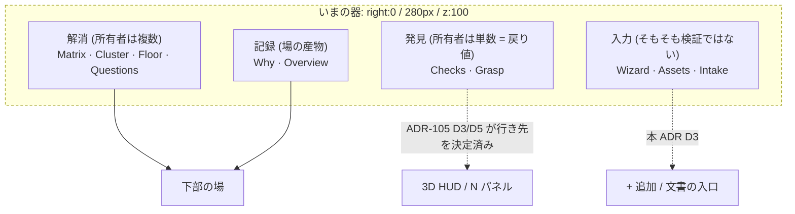

# 106. 場は表であって縦帯ではない — 器を中身の形へ合わせ、右端の排他を「住所」で解く

- Status: Proposed
- Date: 2026-08-02
- Deciders: yuubae215, Claude
- Supersedes / Superseded by: なし (ADR-050 の右端 280px スロットと ADR-047 の
  Context Inspector の**住所**を改める。両 ADR の交渉モデル・チュートリアル構成そのものは不変)

## Context — Goal と力学 (§1.2 Goal)

**Goal:** 交渉している対象を**見ながら**交渉できる。かつ、各ゾーンの責務が一言で言える
— 「この器には何が入るか」に、器の名前だけで答えられる。

IA 再設計 (`docs/ia-redesign/`) の Phase 3。ここで扱うのは**器**であって中身ではない。
中身 (衝突・提案・議題・証憑) は ADR-104 が実装済みで、集約の行き先は ADR-105 が決めた。
残っているのは「**解消**の器がどこにあり、そこに何が入るか」だけである。

### 力学 1 — 器の形が中身の形と合っていない (実測)

`ContextLayer.jsx:133-152` はタブを `flex:1` で横に並べる。器は `right:0; width:280px`
(`ContextLayer.jsx:101`)。タブは**定数 8 枚**(`matrix` / `cluster` / `agenda` (Floor) /
`why` / `tree` (Overview) / `wizard` / `assets` / `intake`) **+ 条件つき 3 枚**
(`questions` / `checks` / `grasp`) で最大 11 枚。

$$w_{tab} = \frac{280}{n} - 2\cdot\text{padding}_x = \frac{280}{n} - 4$$

$n = 10$ で 24px。`fontSize: 10px` の `Overview` は約 45px を要する。
**物理的に入らない** (`02-grouping-criteria.md` の実測)。$n = 11$ でさらに縮む。

そして中身は `actor × variable` の**表**である。表は横長で、280px の縦ストリップは
表に対して最悪の器になる。器と中身の形の不一致であり、タブが読めないのはその症状にすぎない。

### 力学 2 — 右端 280px は 3 者が要求する共有資源で、衝突に**3 通りの回避策**が当たっている

右端 (`right: 0`) を要求するのは N パネル (200px)・production の場 (`ContextLayer`, 280px)・
チュートリアルの Inspector (`ContextDemo/ContextInspector`, 280px) の 3 者。同じ 1 つの衝突に、
**互いに知らない 3 つの回避策**が当たっている:

| 回避策 | 誰が書いているか | 効果 |
|---|---|---|
| **ずらす** | `NPanel.jsx:33` — `right: inspectorOpen ? '280px' : '0'` | チュートリアル中だけ N パネルが 280px 左へ逃げる |
| **消す** | `ContextController` の `:720` `:827` `:982` — `ui.setNPanelVisible(false)`<br>同 `:716` `:807` `:973` — `_linkNetworkView?.setForceHidden(true)` | production の場に入ると N パネルと LINK NETWORK が**消える** |
| **被せる** | `ContextLayer.jsx:101` の `zIndex: 100` | 場が N パネル (z:90)・ギズモ (z:10)・投影トグル (z:10) の上に**乗る** |

3 つ目が最も見えにくく、最も重い。ギズモは `right:16px` / 96px 幅 = 右端 `[16, 112]` を占め、
これは場の `[0, 280]` に**完全に含まれる**。したがって **production の場を開いている間、
ギズモと投影トグルは見えない** — ADR-103 が「投影はモードの外の直交軸」として常設に出したものが、
場に入った瞬間に隠れる。

さらに `_updateGizmoOffset()` (`AppController.js:1644-1656`) は右端の占有計算の唯一の所有者
(原則 #26) だが、その式は

```
offset = 16 + 200·[nPanelVisible] + 280·[demo.active ∧ demo.inspectorTab]
```

であり、**production の場を項として持たない**。つまり原則 #26 の「一箇所で計算する」は
チュートリアルについてしか成立しておらず、production の場は計算に参加せず被せて回避していた。

> **実装順序ドキュメントの訂正 (原則 #19):** `03-implementation-order.md` の Phase 3 は
> 「`_updateGizmoOffset` の `+280` 項が消える」と書いたが、**その項の出所は
> チュートリアルの Inspector であって production の場ではない**。production の場を下部へ
> 移すだけでは項は消えない。項を消すには右端 280px スロット**そのもの**を退役させる必要がある
> (→ D2)。この取り違えは、production の場が占有計算に参加していないという力学 2 の帰結
> そのものである。

**帰結:** ADR-104 は 3D ドラッグが他人の主張に当たったとき提案の下書きを作れるようにしたが、
その対象を選んだときに出るはずの N パネルは、場では消されている。
`docs/LAYOUT_DESIGN.md:215` はこの排他を **"the two are never active simultaneously"** と
仕様として宣言済みであり、回避策はすでに**方針として固まっている**。

### 力学 3 — 10 タブは 4 種の責務の同居で、共通点は「同じ器に入っていること」だけ

`02-grouping-criteria.md` の物差し (クライテリアの所有者が単数か複数か) で割ると:



4 種は**次の一手も、見たいタイミングも、所有者の数も違う**。同居の理由は歴史であり
(ADR-063 Phase 3/4 が Context の文脈で作られたので `ContextLayer` のタブになった —
`02-grouping-criteria.md` の「32 Assets の発見可能性」の項)、設計ではない。

### 力学 4 — 「場が開いている」と「文書が在る」が同時にしか立たない

`uiStore.js:173-175` は 2 つを**別のフィールドで持っている**:

```js
active: false,   // an overlay (negotiate / author / ghost) is shown
loaded: false,   // a context document has been adopted
```

`contextEnd` (`:526-532`) は `active` を落とすが `loaded` は落とさない。つまり
**「文書は在るが場は閉じている」は既に到達可能**である。にもかかわらず
`uiStore.context.loaded` を読むコードは `src/` 全体に **0 個** (読み手はすべて
`ContextService.loaded` という別の権威を見ている — `ContextController.js:699/794/959`,
`GraspController.js:174`)。書かれるだけで読まれないフィールドは、第二の源が
**まだ誰にも使われていない**状態であり、いずれ使われた瞬間にドリフトする (§1.1)。

ADR-105 D1 は「集約の描き手は `ctx.active` に依存しない」と決めたが、では**何に**
依存するのかというと、それは文書の有無 = `loaded` の側である。器が「解消と記録」だけに
なって初めて、`active` は純粋に「場が開いているか」を意味できる。

## Options considered

- **A: 器を広げる / タブを 2 段にする (280 → 420px など)** — 文字は入るようになる。
  tradeoff: 表はまだ縦のまま (形の不一致は残る)。かつ右端の奪い合いは**悪化**し、
  3D の面積をさらに削る。症状 (文字が入らない) だけを見て根本 (器と中身の形) を見ない一手。
- **B: 排他を正式な方針として固める** — `_updateGizmoOffset` に production の項を足し、
  「場では N パネルを畳む」を仕様化する。一貫はする。
  tradeoff: 「交渉している対象を見ながら交渉できない」を**仕様として固定する**。
  ADR-104 が作った 3D ドラッグ由来の提案と正面から矛盾し、ADR-103 が示した教訓
  (誤分類を物理側で固めると誤分類が固定される — 核 §0「論理 → 物理の順」) の再演になる。
- **C: 場を下部の器へ移し、右端 280px スロットを退役させる** — 採用。
  tradeoff: 下端という**別の共有資源**へ引っ越すので、そこで同じ病気を再発させない統治が要る
  (→ D6)。実装は表示層に広く触る (production + チュートリアルの両方)。
- **D: 現状維持** — tradeoff: Phase 3 の完了条件が達成されない。加えてタブは増える一方
  (11 枚目で $w_{tab} = 21$px) で、次に足す人が「入らないので消す」判断をする圧力が
  かかり続ける (原則 #15 違反の温床)。

## Decision — Strategy (§1.2 Strategy)

### D1. 場の器は下部の展開パネル。3D を覆わず、常設しない

`02-grouping-criteria.md` が導いた禁止事項 (**3D を覆う置き方をしない** — 解釈の可視化が
確定後に来ると「そういう意味だったの?」事故になる) を、器の住所として実装する。
下部にする理由は 2 つで、どちらもワイヤーフレーム v8 の注釈が正本:
① `d_ref` は**空間量**なので隠して交渉できない、② `actor × variable` は表なので横長の器が合う。

ステータスバー (`InfoBar`) は位置も高さも変えない — 場は**その上に**開く (原則 #15
Fixed Slots。場の開閉で下端が動くと、キーヒントを読む位置が毎回変わる)。

**住所と寸法の px はこの ADR では決めない。** 正本はワイヤーフレーム v8 の注釈と
`docs/LAYOUT_DESIGN.md` で、ADR に写すと第二の源になる (§1.1)。

### D2. 右端 280px スロットを**退役**させる。排他は方針ではなく衝突の症状だった

production の場とチュートリアルの Inspector の**両方**が下部の器へ移り、
右端 (`right: 0`) の常設は N パネル 200px **だけ**になる。結果として力学 2 の
3 つの回避策は**書く理由を失う**:

| 消えるもの | 場所 |
|---|---|
| `ui.setNPanelVisible(false)` × 3 | `ContextController.js:720 / 827 / 982` |
| `_linkNetworkView?.setForceHidden(true)` × 3 (+ 対の `false` × 1) | 同 `:716 / 807 / 973` (+ `:1427`) |
| `right: inspectorOpen ? '280px' : '0'` | `NPanel.jsx:33` |
| `280·[demo.active ∧ demo.inspectorTab]` の項 | `AppController.js:1650` |
| 「場が z:100 でギズモと投影トグルに被さる」 | `ContextLayer.jsx:101` |

**なぜチュートリアルも一緒に動かすか。** チュートリアルは本番の画面を教えるものなので、
本番の器が変わったのに右端の縦ストリップを教え続けるなら、それは**もうチュートリアルではない**。
教える画面と使う画面の不一致は、UI における §1.1 違反 (同じ「場はどこにあるか」という事実が
2 箇所に書かれ、片方が古い) である。

排他は「方針」の顔をしていたが、実際には**住所の衝突を回避するために書かれた**。
住所を変えれば守るべき衝突が消えるので、方針は消える — ADR-103 が台帳の負債 #1 を
「禁止」ではなく「再分類」で閉じたのと同じ形である。

### D3. 器に残るのは「解消」と「その記録」だけ。出ていくものは**行き先を名指しする**

タブを消すのではなく**移す**。移設先を名指ししないまま消すと機能は無言で到達不能になる
(原則 #11 No Silent Failures / #16 Discovery Is a Deliverable)。

| タブ | 責務 | 行き先 | 根拠 |
|---|---|---|---|
| `matrix` (Matrix) | 解消 | **下部の場** | 表は横長 |
| `cluster` (Cluster) | 解消 | **下部の場** | 解消順序 |
| `agenda` (Floor) | 解消 | **下部の場** | ADR-104 D4 |
| `questions` (Questions) | 解消 (他者に答えてもらう) | **下部の場** | 所有者が複数 |
| `why` (Why) | 記録 (場の産物) | **下部の場** | 証憑は決定の隣 — ADR-104 U1 / ADR-052 |
| `tree` (Overview) | 記録 | **下部の場** | 同上 |
| `checks` (Checks) | 発見 (共有 KPI) | 3D 左上の HUD | **ADR-105 D3** |
| `grasp` (Grasp) | 発見 (エンティティスコープ) | N パネル | **ADR-105 D5** |
| `assets` (Assets) | 入力 = **モデリング** | `+ 追加` (AddMenu) | 架台・コンベア・セル床を作る行為は他のオブジェクト追加と同じ。ADR-103 が Lynch 5 種を AddMenu へ移した先例と同型 |
| `wizard` (Wizard) | 入力 (誘導・順序あり) | **文書の入口** | 場ではない。BPMN 側 |
| `intake` (Intake) | 入力 (熟練者のフォーム) | **文書の入口** | 同上 |

「文書の入口」の**最終的な**住所は Phase 5 (入口の 4 重導線 — Home / Template Gallery /
Wizard / Tour を 1 本へ) が決める。本 ADR が決めるのは **「場のタブではない」ことと、
Phase 5 まで到達可能な暫定の住所を持つこと**の 2 点であり、暫定住所を持たないまま
場から外すことは**しない** (原則 #16 — 発見可能性は成果物であって副作用ではない)。

これで各ゾーンの責務が一言で言える:

| ゾーン | 一言 |
|---|---|
| `+ 追加` (AddMenu) | **置く** — シーンに実体を足す |
| 左 (Outliner) / 左下 (LINK NETWORK) | **辿る** — 在るものの構造 |
| 右 (N パネル) | **選んだものを見る・直す** (エンティティスコープの発見を含む) |
| 上 (ヘッダ) | **未解決が在るかを知る** (シーンスコープの集約 — ADR-105 D1) |
| 下 (場) | **合意する — と、その記録** |
| 3D | **入力の検算 (エコーバック)** — 誰にも覆われない |

### D4. `active` は場の開閉だけを意味する。文書の有無の権威は `ContextService` ただ 1 つ

器が「解消と記録」だけになると、`context.active` は初めて純粋に「下部の場が開いているか」
になる。文書の有無は別の軸で、その権威は `ContextService` である。

読み手 0 個の写し `uiStore.context.loaded` は**退役させる** — 誰も読んでいない第二の源は、
消せるうちに消す (§1.1)。文書の有無を UI 側で知る必要がある描き手 (ADR-105 の集約) は、
`ContextService` から導出された**1 つの投影**を読む。

「文書は在るが場は閉じている」は**正当かつ既定**の状態である。むしろ Phase 2 以降は
それが通常であり、場は必要なときだけ開く (D1 の「常設しない」)。

### D5. タブ集合が縮んだら、退役した値を enum に残さない

`context.inspectorTab` の値域から `checks` / `grasp` / `assets` / `wizard` / `intake` が消える。
**退役の腐敗は違反を*見逃す*のではなく緑を出す** (ADR-103 — `DS_PENDING` が廃止後も
3 リリース enum に残った件) ので、消したこと自体を数える。

### D6. 下端も共有資源である。右端で起きたことを下端で繰り返さない

下端には既に 3 者が住んでいる: `InfoBar` (`bottom:0`, 26px)・LINK NETWORK オーバーレイ
(`bottom:34px; left:188px`)・Toast (`bottom:96px`, 中央)。場が下部に開けば、この 3 者と
必ず干渉する。

したがって**下端の占有オフセットの計算も 1 箇所が持つ** (原則 #26)。右端における
`_updateGizmoOffset()` と同じ役割の所有者を下端に置き、呼び出し箇所ごとにパッチしない。
これを先に決めておかないと、力学 2 の「ずらす / 消す / 被せる」がそのまま下端で再演される
— 本 ADR が消そうとしているのは 280px という数字ではなく、**衝突を各所で回避する形**である。

## Consequences — Evidence と tradeoff (§1.2 Evidence)

**肯定的:**

- 交渉している対象 (N パネル) と関係グラフ (LINK NETWORK) を**見ながら**交渉できる。
  ADR-104 の 3D ドラッグ由来の提案が、初めて対象を見ながら作れる。
- ギズモと投影トグルが場の最中も見える (ADR-103 が常設に出したものが、常設のままになる)。
- 排他の実装が 7 箇所 (`setNPanelVisible` × 3 / `setForceHidden` × 4) 消える。
  **書かなくなるのではなく、書く理由が無くなる**。
- 器の形が中身の形に合う。タブが増えても文字が消えない (横長なので $w_{tab}$ の分母が
  280 ではなく画面幅)。
- 各ゾーンの責務が一言で言える = 次に機能を足す人が住所を**議論せずに**決められる
  (`02-grouping-criteria.md` の目的そのもの)。

**受け入れるコスト / 否定的:**

- 下端という別の共有資源へ引っ越す。D6 の統治を**先に**置かないと同じ病気が再発する。
- チュートリアル (ADR-047 系, `ContextInspector.jsx` 343 行 + `StoryBar.jsx` 121 行) の
  振付を本番と揃える作業が付いてくる。production だけ動かすと `+280` 項は消えず、
  Phase 3 の完了条件は閉じない。
- モバイルでは下端は指の領域で、現行の「場はモバイルで全面」が単純には継承できない。
  寸法の正本は `LAYOUT_DESIGN.md` に置くが、**3D を覆い切らない**という禁止事項は
  モバイルでも降ろさない (覆うなら場ではなくモーダルであり、v1 で却下済み)。
- 移設先が Phase 5 に依存するタブ (Wizard / Intake) があるので、Phase 3 単独では
  暫定住所を 1 つ余分に作る。**暫定であることを宣言する** (宣言しない暫定は恒久になる)。
- **ADR-107 (Phase 3.5) が随伴する。** 器を動かすと場と N パネルが同時に見えるので、
  「変数を選んでいる間の右パネルの所有者」が毎回問われるようになる。本 ADR 単独で
  出荷してよいのは**次の PR で Phase 3.5 を出す**場合だけで、放置すると踏んだ人が
  第二の選択状態を書く (`03-implementation-order.md` §Phase 3.5 が制約の正本)。

**検証 (証拠):** `docs/gsn/adr-106-the-floor-is-a-table-not-a-strip.gsn`。
goal ごとの支えの正本は `.gsn` 側 (ここには複製しない — §1.1)。本 ADR は **Proposed** なので
証拠は全て未来形であり、`.gsn` の goal は `support-exploring` として、何を実行すれば
決着するかを `assumption` で名指ししてある。

数える形 (原則 #31 / ADR-102 — 母集団はコードから導出し、手書きの場所リストにしない):

- **右端 (`right: 0` 相当) を占有する常設 fixed 要素が 1 個** (N パネル)。母集団は
  `src/components/**` の `position:'fixed'` を持つスタイルオブジェクトを構文から導出する
  (在る要素を並べた表にしない — それは `place-list` で、ADR-102 が語彙から消した形)。
- **場の開閉に反応して他パネルの可視性を書く入口が 0 個。** 母集団は `ContextController` の
  場の入口 3 メソッド (`_startNegotiation` / `_startAuthoring` / `_startRegionGhost`) と
  退出経路の**呼び出し閉包**から導出する。
- **`_updateGizmoOffset()` の項が 2 個** (定数 16 + N パネル 200)。280 の項が 0 個。
- **`inspectorTab` の値域に退役した値が 0 個** (`ProjectionAxisOwnership.test.js` が
  `DS_PENDING` について作った道具と同型 — 退役は「消した」ではなく「数えた」で閉じる)。
- **下端の占有オフセットを計算する箇所が 1 個** (原則 #26)。
- **移設された 3 タブが新住所から到達可能** (e2e)。移設の証拠は「消えたこと」ではなく
  **「着いたこと」**である — 原則 #16。
- **`uiStore.context.loaded` の読み手が 0 個であることを根拠に、フィールドが 0 個。**
  (現在: 書き手 1 / 読み手 0 = 未使用の第二の源)

**波及 (blast radius):**

| ノード | 変わるか |
|---|---|
| `src/context/**` (`Agenda` / `Ownership` / `Proposal` / `ContextValidator`) | **不変** — ドメインは器に依存しない (Phase 4 が既に実証済み) |
| `src/command/ProposalCommands.js` + テスト | **不変** — 同上 |
| `src/components/Context/ContextLayer.jsx` | 住所 (右 280px → 下部) とタブ集合 (最大 11 → 6) |
| `src/components/ContextDemo/ContextInspector.jsx` · `StoryBar.jsx` | 同じ器へ (D2) |
| `src/controller/ContextController.js` | 排他 7 箇所が消える |
| `src/components/NPanel/NPanel.jsx` | `inspectorOpen` シフトが消える |
| `src/controller/AppController.js` `_updateGizmoOffset()` | `+280` 項が消える |
| `src/components/AddMenu/AddMenu.jsx` | Assets の入口を得る |
| `src/store/uiStore.js` | `inspectorTab` 値域の縮小、`loaded` の退役 |
| 下端の占有計算 (新設) | D6 の所有者 1 個 |
| `packages/grasp-contract` · `server/` · `core/` | **不変** — ワイヤに載る事実は変わらない (原則 #29) |
| `docs/LAYOUT_DESIGN.md` (§214-226) · `docs/SCREEN_DESIGN.md` | 住所と端の予算の正本なので更新 |
| `docs/STATE_LEDGER.md` | 「場の器」行の追加 (基数 `0..1`) と「文書」行の権威の明記 |
| `docs/STATE_TRANSITIONS.md` | 場の開閉 (2 状態) — 閾値未満だが記録する |

## Lens notes

- **様態 (BPMN / CMMN)** — 器に残る「解消」は順序のある承認フロー = BPMN 側。出ていく
  「置く / 見る / 届くか見る」は探索・裁量のループ = CMMN 側。`02-grouping-criteria.md` が
  「`Wizard` の隣が `Grasp`」と指摘したのは、**2 つの様態が同じ 280px のタブ列に
  同居している**という形の取り違えだった。器を割るのはその是正である。
- **状態機械 (§1.4)** — 新しい遷移は 1 つ (場の `閉 ⇄ 開`、2 状態) で閾値未満。
  ADR-104 の提案・議題の遷移は**不変** (器に依存しない)。効くのは遷移ではなく
  **基数と直交性**の側で、`active` (器) と文書の有無 (`ContextService`) を別軸に
  分けたことが本体である。
- **層 + 契約** — 変わるのはフロント内部の住所だけ。BFF / コアAPI の契約は不動で、
  `src/` が解法を持たないという境界も不変 (CLAUDE.md スコープ境界)。
- **グラフ** — 排他の 7 箇所は「場の入口」から「他パネルの可視性」への辺だった。
  住所を変えると辺が消える。**辺を切るのではなく、辺が引かれた理由を消す**。
- **ADR-103 / ADR-105 との共鳴** — ADR-103 は「モードではなく視点だった」、
  ADR-105 は「場の中の出来事ではなく、常に在る導出だった」、本 ADR は
  「**方針ではなく、住所の衝突の症状だった**」。3 つとも誤分類の是正であり、
  新しい概念を 1 つも足していない。

## References

- ADR-050 (Context-first 交渉オーバーレイ — 右端 280px スロットの出所) /
  ADR-047 (Context DSL チュートリアルの Inspector — 同じスロットの 2 人目の住人)
- ADR-104 (所有権・提案・証憑 — 器に依存しないドメイン。Phase 4 が依存の弱さを実証した) /
  ADR-105 (発見の集約を場の外へ — 出ていく 2 タブの行き先を決めた ADR)
- ADR-103 (Map の再分類 — 「禁止」ではなく「再分類」で閉じる形、および退役した値を数える規律) /
  ADR-102 (母集団を導出する検査 — `place-list` を書かない)
- ADR-063 Phase 3 / Phase 4 (Wizard / Parametric Assets — 場のタブになった歴史的経緯) /
  ADR-052 (Why 来歴 — 記録タブの読み先) / ADR-057 (Grasp タブの出所)
- ADR-094 / ADR-048 (LINK NETWORK — `forceHidden` の 2 軸。排他の被害者側)
- `docs/ia-redesign/03-implementation-order.md` (Phase 3 の順序と完了条件)
- `docs/ia-redesign/02-grouping-criteria.md` (発見 / 解消の物差しと、タブ列の物理的破綻の実測)
- `docs/ia-redesign/easy-extrude-wireframe-v8.html` (配置とその根拠 — 住所の正本)
- `docs/LAYOUT_DESIGN.md` §214-226 (端の予算と寸法の正本)
- ADR-107 (選択できるものが 2 種になる — 本 ADR が場と N パネルを**同時に見せる**ことで
  必ず踏むことになる未決。器を動かすまでこの衝突は存在できなかった)
- ADR-108 (入口は動詞であって対象ではない — 器 (場) と入口 (ヘッダ) は**同じ成長**の 2 つの出口。
  本 ADR だけでは入口が伸び続け、ADR-108 だけでは器が伸び続ける)
- `docs/gsn/adr-106-the-floor-is-a-table-not-a-strip.gsn` (goal ごとの支えの正本)
