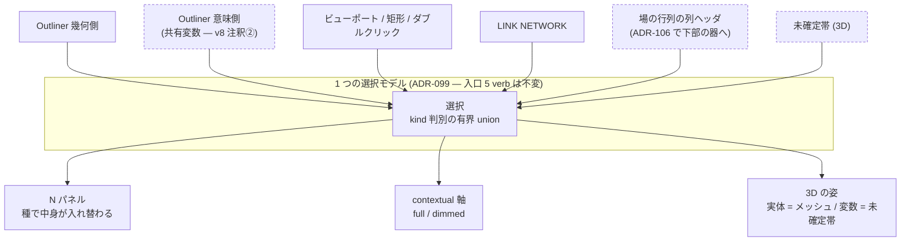

# 107. 選択できるものが 2 種になる — 文書の変数を同じ 1 つの選択モデルへ入れ、混在を型で表現不能にする

- Status: Accepted (実装済み — 選択を kind 判別の有界 union へ (`src/domain/selection.js`)、混在は構築時に throw、種ごとの宣言表 2 つ (`src/view/SelectionKinds.js`) が未宣言の種で throw、場の行列の変数見出しを窓に、変数選択で未確定帯 + 束縛実体の DIMMED、N パネルの body を種で分岐、個数検査 3 本 + e2e 2 本)
- Date: 2026-08-02
- Deciders: yuubae215, Claude
- Supersedes / Superseded by: なし (ADR-099 の「選択の入口は 1 つ」を**保ったまま**、
  選択集合の**要素の種**を 1 から 2 へ広げる。入口の個数は変えない)

## Context — Goal と力学 (§1.2 Goal)

**Goal:** 選んだものについて、全ゾーンが同じことを語る。選べるものが「3D に姿を持つ実体」
だけでなくなっても、それが崩れない。

`02-grouping-criteria.md` §未決 が挙げた 3 つのうちの 1 つ:

> **場で変数を選んでいる間の選択の所有者** — 右パネルは「Robot の詳細」のまま。
> いま選択されているのは Robot か `d_ref` か。選択モデル (ADR-099) との衝突。

ワイヤーフレーム v8 の注釈②⑤は**既に決めている** (共有変数は左の意味側に並び、選ぶと
右パネルの中身が入れ替わる。選択モデルは 1 つ) が、**その判断を記録した ADR が無い**。
非自明かつ ADR-099 の中心と正面から関わるので、ここで起こす。

### 力学 1 — ADR-106 がこの未決を「いつか」から「必ず」へ変える

これまで場に入ると N パネルは**消されていた** (`ContextController` の排他 3 箇所)。
だから「場で変数を選んでいる間、右パネルは誰のものか」は**起こりようがなかった** —
右パネルがそこに無かったからである。

ADR-106 が器を下部へ移すと、場と N パネルが**同時に見える**。その瞬間からこの問いは
毎回起きる。つまりこれは Phase 3 の前提条件ではなく**帰結**であり、
**ADR-106 を実装すると必ず踏む**。未決のまま Phase 3 を出すと、踏んだ人が
その場で最小の回避策を書く — それが ADR-099 が消した「窓ごとに部分集合を書く」形の
再生産になる。

### 力学 2 — 選択の入口は 1 つだが、要素の種は 1 つしか想定していない

`SelectionManager` (ADR-099) は選択を変える唯一の入口で、5 verb
(`selectOnly` / `selectMany` / `clearSelection` / `activateWithinSelection` / `forget`)
と 1 本の `_apply()` が選択集合・可視ハイライト・文脈可視性・リンク強調・パネルを
**同時に**書く。`src/SelectionOwnership.test.js` が入口の個数を数えている。

しかし状態は `_ids: Set<entityId>` であり、**要素の種を持たない**。文書の変数を
入れると id の名前空間が 2 つ (実体 id / 文書の `ref`) になる。

ADR-099 が見つけた欠陥は「窓を辿ると 5 つ、実は undo コールバックの中に 4 つ複製されていた」
だった。ここは同じ形の一段上で、**種を辿ると 1 つに見えるが、実は 2 つになる**。
`Set` は種を持たないので、実装を読んでも見えない。

### 力学 3 — 変数を選ぶと 3D が無言になるのではないか (v8 が名指しした懸念)

> これまで選択できたものは全部 3D に姿を持っていた。`d_ref` は**区間であって物ではない**ので、
> 選択しても 3D が無反応 = 無言になる (原則 #11)。

v8 の答えは「**未確定帯が `d_ref` の 3D での姿**なので無言にならない」。
これは ADR-050 の region ghost / 未確定帯の系譜がすでに持っている表現であり、
新しい可視化を発明していない。

ただしこの答えは `d_ref` について成り立つだけで、**種の規則にはなっていない**。
姿を持たない種を後から選択可能にした瞬間、無言が復活する。

### 力学 4 — 「Robot の選択が消える」は既存語彙で解ける

Robot を見ながら `d_ref` を選ぶと Robot の選択が消える。v8 の答えは、台帳の
LINK NETWORK ノードが既に持つ `focused` / `neighbor` / `context` の語彙と、
ADR-096 の `contextual` 軸 (`full` / `dimmed`) で解ける — **新概念ゼロ**。
変数が選ばれたとき、その変数が制約している実体は消えるのではなく `dimmed` で残る。

### 位置づけ



破線が本 ADR で足す**窓**。**入口は 1 つも増えない** — そこが ADR-099 の要点であり、
本 ADR はそれを崩さないことを主張する ADR である。

## Options considered

- **A: 変数用に第二の選択状態を持つ (`selectedVariable`)** — 最小の差分。
  tradeoff: ADR-099 が畳んだものを再び割る。「いまアクティブなのはどっちか」の決定が
  全窓に複製され、窓ごとに部分集合を書く形が戻る。ADR-099 の census
  (`SelectionOwnership.test.js`) は entity 側しか数えないので、**割れたことに気づけない**
  — 緑のまま壊れる、ADR-103 が名指しした最悪の形。
- **B: 変数を仮想的な entity として `_ids` に混ぜる** — 既存コードがほぼそのまま動く。
  tradeoff: 種がプロパティ値や id の接頭辞で分岐する (原則 #2 違反 — 能力分岐は型で行う)。
  id 衝突は実行時にしか出ず、N パネルの分岐が fall-through すると「宣言された既定」と
  「誰も考えなかった種」が区別不能になる (原則 #31)。
- **C: 選択を kind 判別の有界 union にし、種の混在を表現不能にする** — 採用。
  tradeoff: `_ids: Set` を読んでいる多数の読み取り専用呼び出し箇所が、union を
  経由する形へ変わる。書く側の手間が確実に増える。
- **D: 変数を選択可能にしない (現状維持)** — tradeoff: 場の行列で列 (= 変数) を選んでも
  何も起きない = 無言 (原則 #11)。かつ v8 注釈②の整理が崩れる — 変数を選べるのに
  どのナビゲータにも載っていない実体が生まれる。ADR-106 で場と N パネルが同時に
  見えるようになると、この無言は毎回目に入る。

## Decision — Strategy (§1.2 Strategy)

### D1. 選択は kind 判別の有界 union。混在は書けない

```
Selection =
  | { kind: 'empty' }
  | { kind: 'entities',  ids:  [id, ...]  }   // N ≥ 1、3D に姿を持つ実体
  | { kind: 'variables', refs: [ref, ...] }   // N ≥ 1、文書の共有変数
```

**`empty` を第一の枝にする。** 0 個は `entities` の要素数 0 ではない — 種の無い状態である。
「空の entities」と「空の variables」が別物として書けてしまう形は、同じ事実に 2 つの表現を
与える (§1.1)。ADR-099 が「0 個は正当かつ頻出」と宣言した状態を、種が増えても
1 つの表現に保つ。

**混在 (`Robot` 1 個 + `d_ref` 1 個) は表現不能。** 混在を許すと N パネルが
「どちらの詳細を出すか」を決めねばならず、その決定に自然な答えは無い —
*決定の不在*を既定値で埋める形になる (原則 #31)。矩形選択もビューポートのピックも
幾何側しか拾わないので、混在は意図した操作ではなく事故でしか生まれない。

### D2. 入口は 5 verb のまま。窓は増えるが入口は増えない

Outliner の意味側・場の行列の列ヘッダ・未確定帯のクリックは**窓**であって入口ではない。
`SelectionManager` の 5 verb と `_apply()` 1 本を通る (ADR-099 D1)。
`src/SelectionOwnership.test.js` の個数検査は、**種が増えても母集団の作り方を変えずに**
効き続けなければならない — 効かなくなるなら、それは A 案を選んだ証拠である。

### D3. 名前空間を静的に区別する

実体 id と文書 `ref` を同じ `Set` に入れない。両者は別の世界の名前で、たまたま
文字列として比較できるだけである。原則 #21 (座標空間を型・API 形状で静的に区別する)
と同型の規律を**名前空間**へ当てる — 命名規約 (`var:` 接頭辞など) やレビューに頼らない。

### D4. 選択可能な種は 3D の姿を**宣言**する。宣言の無い種は選択可能にしない

`d_ref` の姿は**未確定帯** (ADR-050 の region ghost / 未確定帯の系譜)。
これを 1 件の答えではなく**種ごとの宣言表**にする — 未宣言の種で `throw` し、
fall-through させない (`EXPLICIT_DEFAULTS` / `PLACEMENT_BY_KIND` /
`SUPPORT_SURFACE_BY_KIND` と同じ既定表の規律)。

これが原則 #11 (No Silent Failures) を**種のレベルで**保証する形である。
「今の 2 種は姿を持つ」は事実だが規則ではない。規則にしないと、3 種目を足した人が
無言を再導入し、しかもテストは緑のままになる。

### D5. 変数を選んでも文脈は消えない — 既存の `contextual` 軸で残す

変数が選ばれたとき、その変数が制約している実体は `contextual` 軸の **DIMMED** で残る
(ADR-096 の 2 軸 / ADR-099 の `_claimContext`)。**新しい語彙を足さない。**

強度の上界も既存の形をそのまま使う: FULL = 選択集合ちょうど、DIMMED = 連鎖 − 選択集合。
変数の「連鎖」は**その変数を制約する要求が指す実体の集合**であり、実体側の
TF 連鎖と同じ扱いをする。

### D6. 右パネルの中身は種で分岐し、未宣言の種で throw する

N パネルの表示は `Selection.kind` で切り替わる (v8 注釈⑤の決定)。
分岐表は宣言であって `if` の連鎖ではなく、未宣言の種で `throw` する。
原則 #17 (Complete Polymorphic Interfaces) の要求「多態的に呼ばれるメソッドは
全実装型に存在させる」を、種が 2 つになる**その変更と同じコミットで**満たす。

## Consequences — Evidence と tradeoff (§1.2 Evidence)

**肯定的:**

- 場の行列で列を選んでも無言にならない = ADR-106 が同時に見せる 2 つのゾーンが
  同じ選択を語る。
- ADR-099 の「入口は 1 つ」が、選べるものが増えても崩れない。入口の個数検査が
  そのまま延命する (作り直さない)。
- 「選択できるのにどのナビゲータにも載っていない実体」が生まれない (v8 注釈②)。
- 新しい可視化・新しい語彙を 1 つも足していない — 未確定帯も `contextual` 軸も
  `focused/neighbor/context` も既にある。

**受け入れるコスト / 否定的:**

- `_ids: Set` を読んでいる読み取り専用の呼び出し箇所が union 経由へ変わる。
  `AppController._selectedIds` / `_objSelected` は getter なので窓口は 1 つだが、
  その先の消費者は数が多い。
- 混在を禁じるので、「Robot を見ながら `d_ref` も選ぶ」は**できない**。
  代わりに D5 の DIMMED が「Robot が視界から消えない」を担う。これは意図した代償で、
  もし実測で不足なら足すべきは混在ではなく**文脈の強度**である。
- 種ごとの宣言表 (D4 / D6) が 2 つ増える。宣言は書く手間であり、それが目的でもある。

**検証 (証拠):** `docs/gsn/adr-107-selection-has-two-kinds.gsn`。
goal ごとの支えの正本は `.gsn` 側 (§1.1)。本 ADR は **Proposed** なので証拠は全て未来形で、
goal は `support-exploring` として決着条件を `assumption` で名指ししてある。

数える形 (原則 #31 / ADR-102 — 母集団はコードから導出する):

- **選択集合に書く入口が 5 個のまま。** 種が 1 → 2 になっても増えない。母集団の作り方は
  `SelectionOwnership.test.js` の既存の census をそのまま使う (作り直したら A 案の兆候)。
- **混在した選択を構築できる経路が 0 個。** 母集団は 5 verb の引数型から導出する。
- **選択可能な種のうち、3D の姿を宣言していないものが 0 個** (D4)。
- **N パネルの種分岐が未宣言の種で throw する** (D6)。fall-through が 0 個。
- **場の行列の列ヘッダから 1 クリックで変数が選べ、3D に未確定帯が出る** (e2e — 無言でない)。
- **変数選択時に、制約されている実体が DIMMED で残る** (`FULL === 選択集合` の上界を
  変数側でも焼く。ADR-099 が N=25 で焼いたのと同じ理由 — 1 個の fixture では
  `4N` と `N` が区別できない)。

**波及 (blast radius):**

| ノード | 変わるか |
|---|---|
| `src/controller/SelectionManager.js` | 状態が `Set` から union へ。verb の個数は不変 |
| `src/SelectionOwnership.test.js` · `src/controller/SelectionManager.test.js` | 母集団の作り方は不変、種の軸が足される |
| `src/view/VisibilityAxes.js` · `contextual` の主張 | 変数の「連鎖」の定義が足される (軸は不変) |
| `src/components/NPanel/**` | 種ごとの宣言表 (D6) |
| `src/view/OutlinerBridge.js` / `OutlinerView.js` | 意味側の窓 (幾何 ⇄ 意味) |
| 場の行列 (ADR-106 の下部の器) | 列ヘッダが窓になる |
| 未確定帯 / region ghost 系 | 変数の姿として選択に反応する |
| `src/context/**` · `packages/grasp-contract` · `server/` · `core/` | **不変** — 選択は presentation 状態でワイヤに載らない (原則 #29 / ADR-099) |
| `docs/STATE_LEDGER.md` | 「選択」行の更新 (要素の種が 2、混在の非在を宣言) |
| `docs/SCREEN_DESIGN.md` · `docs/LAYOUT_DESIGN.md` | Outliner の意味側と N パネルの種分岐 |

## 実装で変わったこと (2026-08-02 — 俯瞰と実装の食い違いを残す)

黙って上の記述を書き換えると判断の履歴が消えるので、**変わった 4 点をここに足す**
(原則 #19)。上の Decision / Consequences は Proposed 時点の判断のまま残してある。

### 1. 窓は ADR-106 を待たずに実在した

Phase 3.5 は「Phase 3 と同じ PR か直後」と決めていたが、変数を選ぶ窓
(`ConflictMatrix.jsx`) は**今日の器の中に既に在った**。器が下部へ移るのは
「場と N パネルが**同時に**見える」ためであって、窓が生まれるためではない。
したがって本 ADR は Phase 3 に**先行して**実装できた — 器が動いたとき、
踏んだ人が回避策 (`selectedVariable`) を書く余地が既に無い状態になっている。

**向きの訂正**: 実装の行列は変数が*行*・actor が*列*である (v8 の図は逆)。
「列ヘッダ」は**変数の見出しセル**を指す — 向きは器の都合で、窓は同じ。

### 2. 3D の姿は 1 つではなく 3 通りの帰結を持つ (D4 の精密化)

D4 は「変数の姿は未確定帯」と 1 つの答えを書いていたが、実装すると
**変数の種類で帰結が割れる**:

| 変数 | 3D の答え |
|---|---|
| 領域 Variable (footprint を持つ) | 未確定帯 (ADR-050 の region ghost) |
| スカラー Variable (区間) | 帯は無い。束縛している実体が DIMMED で残る |
| どちらも無い変数 | **0** — N パネルが「まだ空間に姿を持たない」と述べる |

3 つ目は `VariableHasAThreeDShape` の仮説が**部分的に反証された**形である。
答えは無言を許すことではなく、**0 を宣言させること**にした (原則 #31 の
「正当な 0 は推論させず宣言させる」)。宣言表は種 (`variables`) の単位で持ち、
インスタンスごとの帰結はパネルが述べる — 表を変数インスタンスの単位にすると
文書ごとに表が伸び、宣言表ではなくなる。

### 3. `_apply` の中の描画が painter へ降りた (遷移は割れていない)

種ごとの描画を宣言表から引くため、`_apply` の中にあったハイライト書き込みが
`_paintMeshHighlight` / `_paintUndecidedBand` へ移った。**全種ぶんの painter が
毎回呼ばれる**ので、種を離れるとその描画は同じ 1 遷移で解放される
(`_claimContext` と同じ丸ごと再計算の規律)。

これは遷移を割る新しい機会でもあるので、検査を 1 本足した:
**painter の呼び手が `_apply` の 2 行ちょうど**であること。窓が painter を直に
呼べるなら「ハイライトだけ書いて文脈可視性を書かない」が復活する — ADR-099 が
消した形そのものである。

`SelectionOwnership.test.js` の既存 census は**規則も母集団も変えずに**通った。
変えたのは `_apply` の本体を切り出す**錨**だけ (引数名 `ids` → 選択の union) で、
これは A 案の兆候ではない。

### 4. Outliner の意味側 (v8 注釈②) は着手していない

窓は 1 つでも「入口が増えない」の主張は成立し、意味側は左ゾーンの構造に触るので
器が動く Phase 3 と同時のほうが安い。**やらないことを宣言**しておく —
名指ししない未着手は無言の削除と区別がつかない。

## Lens notes

- **状態機械 (§1.4)** — 選択は依然として遷移に guard を持たない。効くのは
  **不正状態を表現不能にする**側で、今回増えたのは基数ではなく**要素の種**である。
  台帳の選択行は基数列に `0..N` を持っていたが、種の列は無かった — 種は状態に見えない
  (原則 #31 の一段上の同型)。
- **型 = 能力の契約 (原則 #2)** — 「実体か変数か」で右パネルの中身も 3D の姿も
  文脈の連鎖も変わる。これは能力分岐であって、プロパティ値やフラグで分けるものではない。
- **ADR-099 との関係** — あちらは「窓を辿ると 5 つ、実は undo コールバックの中に
  4 つ複製されていた」。こちらは「**種を辿ると 1 つに見えるが、実は 2 つになる**」。
  `Set` は種を持たないので、実装を読んでも見えない — 同じ盲点の一段上。
- **ADR-106 との関係** — 器を動かすまでこの衝突は**存在できなかった** (右パネルが
  場では消されていた)。設計欠陥が回避策に隠されていた例であり、回避策を外すと
  隠れていた問いが出てくる。これは Phase 3 の失敗ではなく、回避策が何を隠していたかの
  証拠である。

## References

- ADR-099 (選択の往復を 1 つの入口へ — 入口の個数を数える census の出所) /
  ADR-096 (可視性の 2 軸 — `contextual` の主張先)
- ADR-106 (場を下部へ — この未決を「必ず踏む」ものに変える ADR) /
  ADR-050 (未確定帯 / region ghost — 変数の 3D の姿の系譜)
- ADR-094 / ADR-095 (LINK NETWORK の `focused` / `neighbor` / `context` 語彙) /
  ADR-102 (母集団を導出する検査) / ADR-060 (kind 判別の有界 union)
- ADR-096 / ADR-097 / ADR-102 (種ごとの宣言表 — 未宣言の種で throw する先例)
- `docs/ia-redesign/02-grouping-criteria.md` §未決 (この項目の出所)
- `docs/ia-redesign/easy-extrude-wireframe-v8.html` 注釈②⑤ (決定そのもの — 住所の正本)
- `docs/ia-redesign/03-implementation-order.md` §Phase 3.5 (順序と完了条件 —
  Phase 3 と同じ PR か直後の PR という制約もそこが正本)
- `docs/gsn/adr-107-selection-has-two-kinds.gsn` (goal ごとの支えの正本)
