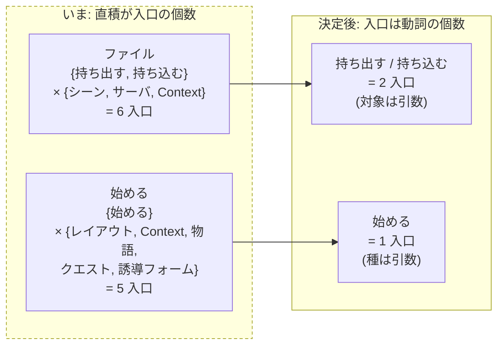

# 108. 入口は動詞であって対象ではない — 「動詞 × 対象」の直積をヘッダから畳む

- Status: Accepted (実装済み — ヘッダの常設入口を desktop 7 / mobile 7 へ畳み (ファイル系 6 → 2・始める系 5 → 1)、対象は宣言表の引数へ。入口の個数は ratchet が **超えても下回っても** fail させ、母集団は `Header.jsx` の JSX から構文で導出する。種ごとの宣言表 5 つが未宣言の値で throw。Node Editor は `toggle-surface` へ再分類。条件つき表示の入口は 0 個になった (消さずに理由つき disabled)。Tour の**欠けていた再入口**を新設。`01-inventory.md` の 48 行すべてに住所が付き、被覆は検査が数える)
- Date: 2026-08-02
- Deciders: yuubae215, Claude
- Supersedes / Superseded by: なし (ADR-089 / ADR-051 / ADR-047 / ADR-063 / ADR-065 が
  それぞれ**正しく**作った入口の、**並べ方**を改める。各入口の中身・演出・目的は不変)

## Context — Goal と力学 (§1.2 Goal)

**Goal:** 入口の個数が、対象の種類が増えても増えない。ユーザーが「どれを押すのか」ではなく
**「何をしたいのか」**で選べる。

IA 再設計の Phase 5 (残りの棚卸し)。`02-grouping-criteria.md` は 25-37 を
「クライテリアの所有者は単数か複数か」で割ったが、**この帯 (38-48) には効かなかった** —
ファイル操作も入口もそもそも検証ではないからである。効かないこと自体が導出条件になり、
実測から第二の物差しが出た。

### 力学 1 — 「始める」入口が 5 つある (数えたら 4 ではなかった)

`src/components/Header/Header.jsx` から導出した個数:

| 入口 | 呼び出し | 出所 |
|---|---|---|
| `Layouts` → HomeScreen (レイアウトテンプレ) | `onOpenHome` (`:110`) | ADR-089 |
| `New Project` → TemplateGallery (Context テンプレ) | `onOpenTemplateGallery` (`:319`) | ADR-051 Phase 2 |
| `Tutorial` → 6 ステップの物語 | `onContextDemoClick` (`:332`) | ADR-047 |
| Tour カード (5 クエスト・左下・デスクトップのみ) | `uiStore.tour` / `TourCard.jsx` | ADR-065 Phase 6 |
| Wizard (誘導インテーク) | `ContextLayer` のタブ | ADR-063 Phase 3 |

`03-implementation-order.md` は「入口の **4 重**導線」と書いていた。数えると **5** で、
`Tutorial` が落ちていた。**記憶は母集団の権威ではない** (ADR-102) — この ADR 自身が
その規律で始まっている。

### 力学 2 — ファイル操作は「2 動詞 × 3 対象」の直積が入口になっている

| 対象 → / 動詞 ↓ | シーン JSON | サーバ | Context 文書 |
|---|---|---|---|
| **持ち出す** | `Export` (`:111`) | `Save` (`:98`) | `Save Context` (`:321`) |
| **持ち込む** | `Import` (`:112`) | `Load` (`:99`) | `Import Context…` (`:320`) |

6 つがヘッダに**平坦に並んでいる**。ユーザーは「保存したい」と思ってから、
**どの保存か**を 3 択で当てにいく。動詞は 2 つしかないのに、選択肢は 6 つある。

### したがって: 2 帯は別の課題に見えて、同じ 1 つの欠陥である

**対象ごとに入口を生やすと、対象が増えるたびにヘッダが伸びる。** 伸びは有界でない。
これは ADR-060 が契約について禁じた「`optional` 兄弟を生やさない (無限成長の防止)」の
**UI 版**である。ADR-106 が場について測った「280px に 10 タブ = 文字が入らない」も
同じ成長の別の出口であり、**器を変えても生やす側を止めなければ再発する**。

### 力学 3 — 機能 40 (Node Editor) は誤分類でここに居た

`Save` / `Load` / `Nodes` は同じクラスタに並び、3 つとも「BFF 接続時のみ表示」で
条件が同じ (`Header.jsx:29-30` のコメントがそう書いている)。つまり Node Editor は
**ファイル操作だから**そこに居るのではなく、**表示条件が同じだから**そこに居る。

`02-grouping-criteria.md` が `32 Assets` について見つけたのと同じ形 — 住所が
**タスクの近さではなく実装された時期と条件**で決まった証拠である。Node Editor は
第二の**編集器** (Geometry DAG) であって、持ち出し / 持ち込みの動詞を持たない。

01-inventory の 48 行のうち 1 行が、どのグルーピングにも Phase にも現れていなかった。
母集団は 48 ではなく実質 47 だった (原則 #31 / ADR-102)。

## Options considered

- **A: 入口をメニューの階層へ押し込む (`File ▾` の下に 6 項目)** — ヘッダは短くなる。
  tradeoff: **個数は減らない**、深さに移すだけ。「保存したい」から「どの保存か」を
  当てにいく構造はそのまま残り、対象が 4 つ目になれば項目も増える。症状 (横幅) だけを見て
  根本 (直積) を見ない一手で、ADR-106 の却下案 A (器を広げる) と同型。
- **B: 動詞ごとに 1 入口。対象は入口の中で選ぶ** — 採用。
  tradeoff: 1 クリックで済んでいた `Export` が 2 手になる。よく使う対象への
  近道 (キーバインド / 直近の対象の既定) を別に設計する必要がある。
- **C: 対象を 1 つに統合する (シーンと Context を 1 ファイル形式へ)** — 入口は 2 つになる。
  tradeoff: **これは IA ではなくデータモデルの変更**であり、ADR-050 が
  「`.ctx.json` が正準、raw ジオメトリでは `.json`」と決めた区別を壊す。
  UI の都合でドメインの区別を消すのは依存方向が逆 (核 §1.1 Clean Architecture)。
- **D: 現状維持** — tradeoff: 対象が増えるたびヘッダが伸びる。次に増える対象は
  既に見えている (テンプレ種の追加・サーバ側の版管理) ので、伸びは仮定ではなく予定である。

## Decision — Strategy (§1.2 Strategy)

### D1. 入口は**動詞**で数える。対象は入口ではなく引数

ファイル系は **2 入口** (`持ち出す` / `持ち込む`)、始める系は **1 入口** (`始める`) にする。
対象 (シーン / サーバ / Context 文書、レイアウトテンプレ / Context テンプレ / 物語 /
クエスト / 誘導フォーム) は入口の**中で**選ぶ。

**これは「メニューを 1 段深くする」ことではない** (却下案 A)。違いは、
**対象が増えても入口の個数が変わらない**こと — 直積の片側を引数へ落とすので、
成長は入口の個数ではなく引数の値域に吸収される。

### D2. 入口の個数は**有界**である。増やすなら版を上げる意図的な行為として

ヘッダの常設入口の個数に**上界を宣言し、検査する**。ADR-100 が「宣言外の色」に
ratchet を置いたのと同じ形で、「正当な非ゼロを宣言させる予算」にする。

これが本 ADR の本体である。D1 だけなら今日の 11 個が 3 個になるだけで、
**明日また生える**。生やす側を止めなければ、同じ ADR を 2 年後にもう一度書くことになる。

### D3. 「始める」の 5 種は消さない。**種として引数に並べる**

Home / Template Gallery / Tutorial / Tour / Wizard は**それぞれ正しい理由で作られた**
(ADR-089 / ADR-051 / ADR-047 / ADR-065 / ADR-063)。中身も演出も目的も変えない。
変えるのは**並べ方**だけである。

種ごとの宣言表を持ち、**未宣言の種で throw** する (`EXPLICIT_DEFAULTS` /
`PLACEMENT_BY_KIND` と同じ既定表の規律)。6 種目を足す人は表に行を足さねばならず、
そのとき D2 の上界に当たる。

### D4. 機能 40 (Node Editor) はファイル群から出す — 第二の編集器として住所を持つ

「BFF 接続時のみ」という**表示条件の一致**を住所の根拠にしない。Node Editor は
Geometry DAG の編集器であり、持ち出し / 持ち込みの動詞を持たない。

**表示条件が同じであることは、同じ場所に居る理由ではない。** これを規則として書くのは、
同じ誤分類が `Assets` (ADR-106 D3 で `+ 追加` へ移した) と Node Editor で
**2 回**起きているからである — 2 例目なので Yellow Card ではなく規則になる
(CLAUDE.md の Q2)。

### D5. ADR-089 の「起動の初手」は不変。畳むのはヘッダの常設入口

ADR-089 が決めた「起動時にホーム画面へ着地する / Blender 式スキップ設定」は
**そのまま**である。本 ADR が畳むのは**ヘッダに常設された再入口**であって、
起動経路ではない。両者は別の問いで、混ぜると ADR-089 の Goal (初手の障壁を下げる) が
入口整理の巻き添えになる。

## Consequences — Evidence と tradeoff (§1.2 Evidence)

**肯定的:**

- 入口の個数が対象の種類から**独立**する。テンプレ種を足してもヘッダは伸びない。
- 「何をしたいのか」で選べる (`保存` を押してから対象を選ぶ) ので、
  対象の名前 (`Export` と `Save` の違い) を覚えていなくても到達できる。
- ADR-106 が器について、本 ADR が入口について、**同じ成長**を別の出口で止める。
  片方だけでは再発する。
- 01-inventory の 48 行すべてが、初めてどこかのグループに属する (40 が拾われる)。

**受け入れるコスト / 否定的:**

- `Export` が 1 手から 2 手になる。近道 (キーバインド / 直近の対象を既定にする) を
  別に設計する必要があり、それを設計しないと**熟練者にとっては純粋な劣化**である。
- 「始める」を 1 入口にすると、Tutorial や Tour への到達が 1 段深くなる。
  初回ユーザーにとって最も重要な 2 つが深くなるので、**起動経路 (ADR-089) が
  それを補っているという前提**に依存する — その前提が崩れたら D3 の並べ方を見直す。
- 入口の上界 (D2) は、正当な追加も止める。止めた上で「版を上げる意図的な行為」として
  通す手順が要る。手順が無い上界は、いずれ黙って引き上げられる。

**検証 (証拠):** `docs/gsn/adr-108-entrances-are-verbs-not-objects.gsn`。
goal ごとの支えの正本は `.gsn` 側 (§1.1)。実装により 4 つの goal はすべて `solution` を
持ち、未来形の `assumption` は解決済み。実行結果は
`src/HeaderEntranceCensus.test.js` (19/19) · `src/InventoryCoverage.test.js` (6/6) ·
`pnpm test` (1050/1050) · `pnpm test:e2e` (41/41、うち ADR-108 の 3 本が新規)。

数える形 (原則 #31 / ADR-102 — 母集団はコードから導出する):

- **ヘッダの常設入口が宣言された上界以下** (D2)。母集団は `Header.jsx` の
  ボタン / メニュー項目を構文から導出する (手書きの入口リストにしない —
  それは `place-list` で、ADR-102 が語彙から消した形)。**現在の実測値をベースラインとして
  定数に焼き**、超えても下回っても fail させる (ADR-100 の ratchet と同じ)。
- **「始める」の種ごとの宣言表が、未宣言の種で throw する** (D3)。
  母集団は種の enum から導出する。
- **同じ動詞の入口が対象ごとに複数存在しない** (D1)。母集団は動詞 → 入口の写像から導出。
- **01-inventory の 48 行のうち、どのグループにも属さない行が 0 個** (D4)。
  これは表そのものの被覆検査で、`CensusCoverage.test.js` の形をドキュメントへ当てる。
- **移設後も 5 種すべてへ到達できる** (e2e)。原則 #16 — 畳むことは消すことではない。

**波及 (blast radius):**

| ノード | 変わるか |
|---|---|
| `src/components/Header/Header.jsx` | 常設入口が畳まれる (本体) |
| `src/components/Home/HomeScreen.jsx` · `Context/TemplateGallery.jsx` | 呼ばれ方が変わる。中身は不変 |
| `src/components/Onboarding/TourCard.jsx` · `ContextDemo/**` | 到達経路のみ |
| `src/components/Context/WizardPanel.jsx` | ADR-106 D3 の「文書の入口」= ここへ合流 |
| Node Editor (`src/view/NodeEditorView.js` · `AppController:3668`) | 住所のみ (D4) |
| `src/controller/AppController.js` のコールバック登録 | 動詞単位へ |
| ドメイン (`src/domain/**` · `src/context/**`) · 契約 · `server/` · `core/` | **不変** |
| `docs/SCREEN_DESIGN.md` · `docs/LAYOUT_DESIGN.md` | ヘッダの入口表 |
| `docs/STATE_LEDGER.md` | **3 行を新設** — 「ヘッダの常設入口」(基数 desktop 7 / mobile 7・接続状態で動かない) / 「始める」の種 (5・0 だった Tour) / ファイル動詞 × 対象 (入口 1 × 引数 3) |
| `docs/ia-redesign/01-inventory.md` | 40 の住所が埋まる |
| ADR-089 | **不変** (D5 — 起動経路は畳まない) |

## 実装で変わったこと (俯瞰との食い違いを残す — 原則 #19)

黙って上の本文を書き換えると判断の履歴が消えるので、実装で分かったことをここに足す。

### 1. 「畳むと 1 段深くなる」は Tour について**誤り**だった — 深くなるのではなく 0 だった

上の受け入れコストは「Tutorial や Tour への到達が 1 段深くなる」と書いている。
実装で経路を確認すると、**Tour には入口が 1 つも無かった**: 左下カードは初回だけ
種が撒かれ (`_startTourIfNeeded`)、`✕` が `ee_tour=dismissed` を永続化して二度と戻らない。
つまり 5 種のうち 1 種は「深くなる」以前に**到達不能**で、畳む前のほうが悪かった。

したがって畳み込みは削除ではなく**復元**を含む: `onTourRestart` を新設し、
`_restartTour()` が永続フラグを消して再度種を撒く (ユーザーが要求した以上、
「二度と再種しない」はもう成り立たない)。0 台のロボット・0 個の選択と同じ形で、
**「入口が 0 個」は状態に見えなかった** (原則 #31) — 5 種を*引数として列挙*させたことが、
その 0 を初めて可視にした。

### 2. 条件つき表示の入口を「数えるか」は、**消滅**して決着した

GSN の `EntranceRatchetIsPlanned` は「BFF 接続時のみの入口を数えるべきか」を反証点に
挙げ、答えを「数える」としていた。実装では別の答えになった — `Save` / `Load` / `Nodes`
を**消すのをやめた**ので、条件つき表示の入口が **0 個**になった。

消える入口は入口の個数を接続状態の関数にするので、D2 の上界が「どちらの数のことか」を
持ってしまう。消さずに `requires` を宣言し、満たされないときは理由つきで disabled に
する (原則 #15 固定スロット / 原則 #11 無言禁止)。**上界を数えようとしたことが、
数える対象が二値だったことを炙り出した。**

### 3. ratchet の母集団は `item()` 呼び出しではなく「レイアウト関数直下の要素」

GSN は「`SmallBtn` / `item()` 呼び出しを構文で数える」と書いていた。これは実装すると
**却下案 A と区別がつかない** — `item()` は畳んだあと引数であって入口ではないので、
それを数えると「深さへ移しただけ」でも数が減らない。

母集団は `DesktopHeaderContents` / `MobileHeaderContents` **直下の JSX 要素**に置き、
引数の側は別の規律で縛った: 引数は宣言表からしか出られない
(`src/HeaderEntranceCensus.test.js` の「ヘッダの component は動詞の配線を持たない」)。
入口を数える検査と、引数が表から来ることを問う検査は別の問いである。

### 4. 被覆表は「対象外」も**決着として宣言**させる形になった

`01-inventory.md` の行 1-24 (モデリング中核) は 02 にも 03 にも番号として現れない。
覆えていないのではなく「動かさないと決めた」ものだったが、**空欄では忘れられた行と
区別がつかない**。§被覆表 には「IA 再設計の対象外 — 住所は変わらない」も決着として
書かせ、決着セルが空の行を 0 個で数える (原則 #31 — 正当な 0 は推論させず宣言させる)。

### 5. D4 の「規則へ昇格」は、原則の追加ではなく**検査**へ降ろした

上の D4 は「2 例目なので Yellow Card ではなく規則になる」と書いている。規則にはしたが、
**常時 load の原則行は増やさなかった** — ADR-092 / ADR-098 が同じ場面で採った判断
(原則を増やすとプロンプト希釈と衝突する) と揃える。降ろし先は 3 つ:

- **書く瞬間に問う場所** = `src/HeaderEntranceCensus.test.js` (入口は動詞を宣言しないと
  母集団に残れない。表示条件は宣言欄に存在しない)
- **ルール台帳** = `docs/CODE_CONTRACTS.md` の 1 行
- **記録** = `docs/PHILOSOPHY.md` の Yellow Cards に 2 文脈 (Assets / Node Editor) を明記

3 例目 (この検査で拾えない形 — 例えばヘッダの外で条件が住所を決めた事例) が出たら
原則化を再検討する。

### 6. 多入口の動詞を 1 つだけ**宣言**した

`toggle-surface` (Outliner / N パネル / Node Editor) は D1 の「1 動詞 1 入口」に
反するが、これは直積ではない — **対象が選ばれない**。トグルはその面の状態の表示そのもの
なので、メニューへ畳むと (a) 1 タップで可逆だった操作が 2 手になり、(b) 開閉が画面から
消える (原則 #15 / #4)。例外は `MULTI_ENTRANCE_VERBS` に理由つきで宣言し、
**宣言しても D2 の上界は動かない**ので「例外にすれば通る」にはならない。

### 7. 副産物: 宣言外の色リテラルが 779 → 773 に減った

2 つの bespoke ドロップダウンを 1 つの宣言駆動コンポーネントへ畳んだ結果、重複していた
スタイルが消え、無効行の色は `COLOR.textSecondary` になった。ADR-100 の ratchet は
**下回っても fail する**ので、ベースラインを同じコミットで 773 へ下げた。

## Lens notes

- **様態 (BPMN / CMMN)** — 「始める」は目標駆動で順序がある (BPMN 側)、
  ファイル操作は事象駆動で裁量 (CMMN 側)。**それでも同じ欠陥を共有している**のが
  この ADR の要点で、直積の問題は様態に依存しない。物差しは様態より一段抽象が高い。
- **層 + 契約** — 却下案 C (対象の統合) を退けた理由が依存方向である。
  UI の都合でドメインの区別 (`.ctx.json` が正準 / raw ジオメトリは `.json` — ADR-050) を
  消すのは、依存を外向きに向けること (核 §1.1 Clean Architecture 違反)。
  **IA は対象の数を減らせない。並べ方だけを決められる。**
- **ADR-060 との同型** — あちらはワイヤに `optional` 兄弟を生やさない統治。
  こちらは画面に入口を生やさない統治。どちらも「1 つ足すのは安いが、
  足し続けるコストは誰も払わない」形への対処で、**上界の宣言**が共通の道具である。
- **ADR-106 との関係** — 器 (場) と入口 (ヘッダ) は違う場所だが、
  **同じ成長**の 2 つの出口である。ADR-106 だけを実装するとヘッダが伸び続け、
  本 ADR だけを実装すると器が伸び続ける。片方だけでは再発する。

## References

- ADR-089 (起動ホーム画面 — 起動経路は D5 で不変) / ADR-051 Phase 2 (Template Gallery) /
  ADR-047 (チュートリアル) / ADR-065 Phase 6 (Tour) / ADR-063 Phase 3 (Wizard)
- ADR-050 (`.ctx.json` が正準 — 却下案 C が壊そうとした区別)
- ADR-060 (`optional` 兄弟を生やさない = 無限成長の防止。本 ADR はその UI 版) /
  ADR-100 (宣言外を ratchet で止める = 正当な非ゼロを宣言させる予算)
- ADR-106 (場を下部へ — 同じ成長のもう 1 つの出口) / ADR-102 (母集団を導出する検査) /
  ADR-096 · ADR-097 (種ごとの宣言表 — 未宣言の種で throw する先例)
- `docs/ia-redesign/02-grouping-criteria.md` §第二の物差し (実測と導出の正本)
- `docs/ia-redesign/01-inventory.md` (48 行の母集団 — 40 が覆われていなかった)
- `docs/ia-redesign/03-implementation-order.md` §Phase 5 (順序と完了条件)
- `docs/gsn/adr-108-entrances-are-verbs-not-objects.gsn` (goal ごとの支えの正本)
