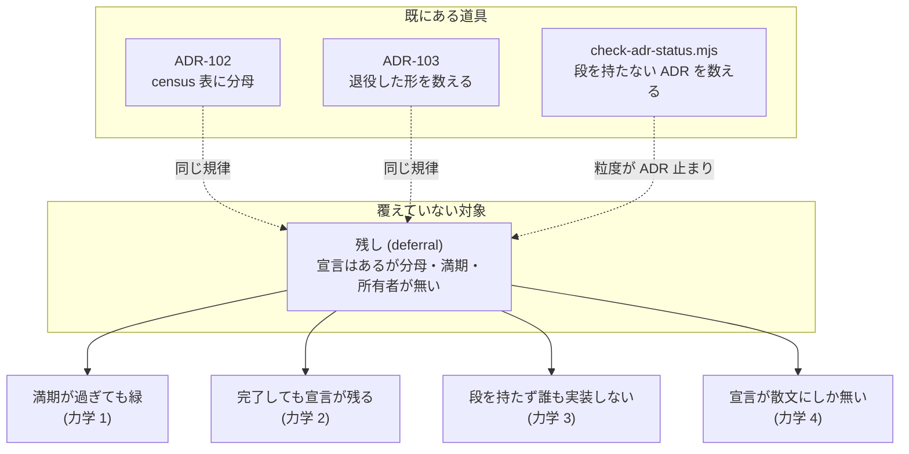

# 109. 残しは宣言であって記憶ではない — 「後でやる」に母集団と満期を与える

- Status: Accepted (実装済み 2026-08-04 — 登録簿 10 行 + `scripts/check-deferrals.mjs` の **5 つ**の問いが CI gate で走る。宣言外 31 箇所を ratchet で固定、満期は**登録簿側でも**機械が読む 〔D6 — 実装中に D3 が半分しか届いていないと分かった〕、機械が読めない満期 6 件を第 2 の予算として宣言)
- Date: 2026-08-04
- Deciders: yuubae215, Claude
- Supersedes / Superseded by: なし (ADR-102 が census 表に与えた分母、ADR-103 が
  退役した形に与えた計数、`scripts/check-adr-status.mjs` が ADR に与えた段 — その
  3 つと**同じ規律を「残し」という対象に**当てる。既存の検査はどれも置き換えない)

## Context — Goal と力学 (§1.2 Goal)

**Goal:** *「後でやる」と書かれたものが、書かれた事実だけで消えない。* 残しの個数が
いつでも数えられ、満期の過ぎた残しと、もう残っていない残しが、機械に見える。

出発点はユーザーからの 2 項目の申し送り (FLOOR_TARGETS の `grasp` / ADR-107 の
Outliner 意味側) と「他にも残しがあるかリポジトリ検査」という指示である。検査した
結果、**個々の残しよりも、残しの数え方のほうが欠陥だった** — 以下はすべて実測で、
散文の転記ではない。

### 力学 1 — 満期は無言で過ぎる (緑のまま)

`src/view/DocIntake.js:54` はこう宣言している:

```js
export const PROVISIONAL_UNTIL = 'ADR-108 (IA Phase 5 — 入口の統合)'
```

ADR-106 D3 は Wizard / Intake を場のタブから出すとき、**恒久の住所は Phase 5 が
決める**と書いた。そして「宣言しない暫定は恒久になる」という正しい認識のもと、
暫定であることをコードの中に置いた。ここまでは意図どおりである。

**ADR-108 (Phase 5) は 2026-08-03 に Accepted・実装済みになり、この住所を決めていない。**
満期は過ぎた。しかし何も落ちない — `PROVISIONAL_UNTIL` は人が読む文字列であって、
機械が読む期限ではないからである。同じポインタの写しは 7 箇所ある
(`src/view/FloorTabs.js` の `RETIRED_FLOOR_TABS` 2 行 / `docs/STATE_LEDGER.md` /
`src/store/uiStore.js` / `src/controller/ContextController.js` 2 箇所 /
`src/components/Doc/DocIntakeLayer.jsx` / ADR-106 本文) が、**7 箇所すべてが同時に
静かに古くなった**。

宣言は在った。分母と満期が無かった。

### 力学 2 — 完了しても宣言は残る (これも緑)

ADR-060 は「本リポジトリ (未着手、残作業 1〜5)」として 5 項目を挙げている。実測:

| ADR-060 の残作業 | 今日の実際 |
|---|---|
| `vendor/grasp-contract` submodule pin | **消滅** — ADR-082 が submodule ごと repo 内へ吸収した。項目が指す対象が存在しない |
| `contract.response.d.ts` 再生成 | 済み (`gen:contract-types` が CI に在る) |
| `GraspSearchPanel.jsx` を kind 判別へ | **済み** — `:792` が `pose.kind === 'jointSpace'` を読んでいる |
| kind 別 conformance fixture | 済み (`packages/grasp-contract/examples/` に両 kind) |
| `Kinematics.js` の連鎖順を doc コメントで明示 | 未確認 (残っている可能性) |

5 項目のうち 3 つは完了、1 つは対象ごと消滅、1 つだけが残っている。**しかし ADR-060 の
Status 行は今も「本リポジトリ側の追従は未着手」と読める。** これは ADR-103 が名指しした
腐敗と同型である — *退役の腐敗は違反を見逃すのではなく**緑を出す***。残しの側でも同じで、
**完了した残しの宣言は「まだ残っている」という嘘を、誰も落とさないまま出し続ける**。

### 力学 3 — 段を持たない残しは誰も実装しない (既知の欠陥の再発)

`scripts/check-adr-status.mjs` は既にこの病気を 1 つの領域で治療している — 順序表に
段を持たない ADR を数える。だがその母集団は「`docs/ia-redesign/` を参照する ADR」に
閉じており、**残しはそこに入らない**:

- ADR-107 の Outliner 意味側 (v8 注釈②) は `03-implementation-order.md` §Phase 3 の
  散文に「引き受けなかったもの」として宣言されている。ADR は段を持つが、**この項目は
  持たない**。宣言の粒度が ADR より細かいと、ADR 単位の検査は素通りする。
- ADR-091 は `Proposed` のまま `src/` からの参照 **0 件**。ADR-043 / 044 / 046 は
  `Draft` のまま。IA レーンの外なので段の検査の母集団に入らない。
- `core/` レーン: ADR-081 Phase 4 (実ソルバ差し替え) と pick-sequence 集計 UI、
  ADR-078 / ADR-077 の「pydantic が暫定正本、中立化は後続」、ADR-079 の consumer 追従。
  どれも ADR 本文にだけ在る。
- **参照先の無いポインタ (5 例目)**: `03-implementation-order.md` は「状態と基数 →
  `docs/STATE_LEDGER.md` §提案中の実体」と名指ししていたが、**その節は存在しなかった**。
  段を持つ提案中の実体の置き場所が指定されているのに宛先が無い、という形で、
  力学 1 (満期の空振り) と力学 3 (段の欠落) の中間にあたる。本 PR で節を起こした。

### 力学 4 — 宣言を持たない残しもある

`src/view/HeaderEntrances.js:265-287` の `FLOOR_TARGETS` は `grasp` 行を持つ。ADR-106 で
**この行は場を開かなくなった** (パネルは N パネルに開く) ので、`open-floor` という動詞の
下に居る根拠を失っている。コメントは「別の変更として起票する」と正しく書いているが、
起票されていない — つまり**残しであることを、コメントの散文以外の誰も知らない**。

### 力学の総和

4 つの力学は別々の症状に見えて、同じ 1 つの欠陥である:

> **残しは「欄」を持たない。** `status` や `mode` は値を持つ欄なので状態として認識されるが、
> 「まだやっていないこと」は**それ自体がノードを持たない**。だから *在るもの* を辿る
> 読み方 — ADR を並べる / 段を並べる / コードを読む — は、定義上どれも残しを素通りする。

これは原則 #31 そのものであり、ADR-102 (census 表に分母が要る) と ADR-103 (退役した形を
数える) が既に 2 回踏んだ穴の 3 回目である。2 例で原則へ昇格済みなので、ここで必要なのは
新しい原則ではなく**道具を残しへ当てること**である (希釈回避 — Q3)。



## Options considered

- **A: 見つけた残しを個別に ADR 起票して終える** — tradeoff: 今日の 4 件は片付くが、
  次に「後でやる」と書かれた瞬間に同じ状態へ戻る。**今日この ADR を書いている理由
  そのもの** (前回の PR が正しく申し送りを書いたのに、それが散文だったから今日の検査が
  要った) が、この案が効かない証拠である。症状を数えて根本を見ない一手。
- **B: 残しを禁止する (未着手のまま出荷しない)** — tradeoff: ADR-106 D3 の暫定住所も
  ADR-098 の `DECLARED_GAPS` も**正しい判断だった** — 範囲外を隠さず宣言する形は、
  無理に同じ PR へ詰め込むより強い。禁止は分割の粒度を粗くするだけで、隠れた残し
  (宣言されない残し) を増やす方向に働く。数えられる残しは資産である。
- **C: 残しを第一級の宣言にし、母集団を導出して数え、満期を機械に読ませる (採用)** —
  tradeoff: 登録簿という新しい表が増え、その表自身が分母を持つ必要がある (ADR-102 の
  `place-list` の罠)。だから**母集団は語彙から導出**し、登録簿は「導出された母集団のうち
  宣言されたもの」に限る。
- **D: 残しに期限日 (日付) を付ける** — tradeoff: 日付は誰も守らないし、守らなくても
  何も起きない。**満期の正しい形は日付ではなく「何が起きたら満期か」という条件**である
  (`PROVISIONAL_UNTIL` は既にこの形を選んでいた — 欠けていたのは、その条件を機械が
  評価しないことだけだった)。

## Decision — Strategy (§1.2 Strategy)

**残しを、宣言・満期・所有者を持つ第一級の対象にする。** 5 つの決定:

### D1 — 残しは登録簿の行になる (`docs/DEFERRAL_LEDGER.md`)

行が持つ欄は 5 つ。どれも空にできない:

| 欄 | 意味 | 空にできない理由 |
|---|---|---|
| `id` | `DEF-NNN` | 参照できない残しは会話でしか指せない |
| 所在 | ファイル:行 または ADR §節 | 「どこかに在る」は所在ではない |
| **満期** | *条件* (「ADR-112 が Accepted になったら」)。日付ではない | 却下案 D |
| **ticket** | ADR 番号 または 段 (Phase N)。`—` は禁止 | 力学 3 — 段を持たない項目は誰も実装しない |
| lane | `ia` / `core` / `contract` / `app` | レーンが違う残しを同じ速度で催促しない |

### D2 — 母集団は語彙から導出する (登録簿は分母ではない)

残しの語彙 (`未着手` / `暫定` / `申し送り` / `後続 PR` / `次セッション` / `保留` /
`引き受けなかった` / `PROVISIONAL_UNTIL`) を `docs/` と `src/` から数え、**登録簿の行に
覆われていない個数**を ratchet で縛る (ADR-100 の形 — 超えても下回っても fail)。

数えるのは *在る残し* ではなく **宣言されていない残しの個数**である。登録簿を分母に
したら、それは ADR-102 が語彙から消した `place-list` そのものになる。

### D3 — 満期は機械が読む

`PROVISIONAL_UNTIL` が名指しする ADR が `Accepted` になった時点で検査が落ちる。
満期を人の記憶に置かない。**今日この規則を書くと即座に 1 件落ちる** (`ADR-108` は
Accepted) — それが正しい: 落ちるべきものが今日まで落ちていなかった。本 PR は
ポインタを ADR-112 (Proposed) へ張り替える。**実装ではなく、満期の付け替えである。**

### D4 — 逆向きにも検査する (完了した残しの宣言は消さねばならない)

登録簿の行が指す残しが実在しなくなったら fail。`DECLARED_GAPS` と
`ProjectionAxisOwnership.test.js` が既に採っている形 (ADR-103) — 力学 2 が
「宣言だけが生き残る」を実演した以上、片方向の検査では足りない。

### D5 — レーンの外の残しも同じ表に載せる (催促の速度だけ分ける)

*(D6 は実装中に足した — 経緯は下の §D6 に書く。俯瞰の時点では D1〜D5 の 5 決定だった。)*

`core/` / `contract` レーンの残し (ADR-081 Phase 4 ほか) は、フロントの段とは所有者も
リリース単位も違う。**表から外すのではなく `lane` 欄で区別する** — 外した瞬間に
力学 3 の「母集団の外」が再生産される。

### D6 — 満期は登録簿の側でも機械が読む (実装中に追加 — 2026-08-04)

**D3 は半分しか実装されていなかった。** 初版の検査が読む満期はコード側の
`PROVISIONAL_UNTIL` だけで、**登録簿の満期欄は 10 行すべてが散文**だった。DEF-009 の
「ADR-091 が Accepted になったとき」が到来しても何も落ちない — つまり**力学 1 (満期が
無言で過ぎる) が、それを直すために作った成果物の中で再生産されていた**。

原因は D3 の書き方にある: D3 は「`PROVISIONAL_UNTIL` が名指しする ADR が Accepted に
なったら落ちる」と*実装を名指しして*決定を書いたので、満期の宣言がもう 1 箇所
(登録簿) に増えたときに規則が追随しなかった。**満期を書く欄を作ったことと、その欄を
読む機械が在ることは別の事実である** — 前者だけで「満期は機械が読む」と言えてしまう
形が残っていた。

決定 2 つ:

- **`満期=ADR-NNN` を登録簿の満期欄が持てる唯一の機械可読 trigger にする。** その ADR が
  `Accepted` になった日に Q2 が落ちる。**位置ではなく token で読む** — 満期欄の散文は
  履歴 (「元は ADR-108 を指していた」) を含むので、「最初に現れた ADR」のような位置の
  規則は散文を書き換えた日に黙って別の ADR を指し始める。
- **trigger を強制せず、持たない行を数える (Q5)。** 満期条件が ADR の採択に対応しない行は
  実在する — DEF-004 (ADR-060) や DEF-008 (ADR-098) の ADR はとうに Accepted で、残って
  いるのは*その決定への追従*である。ここに trigger を書けば「満期は去年過ぎた」と主張する
  ことになり、**嘘の trigger は満期が無いことより悪い** (辿れない参照は空欄より悪い —
  Q3 と同じ理由)。よって書けないこと自体は正当とし、**その正当な非ゼロを予算として
  宣言させる** (現在 6/10。原則 #31 — 正当な 0/N は推論させず宣言させる)。

**限界も同時に宣言する:** Q5 が縛るのは*個数*であって条件の真偽ではない。「Phase 4 が
出たとき」が本当に来たかは今日も人が見るしかない。満期の機械化は **4/10** までしか
届いていない。

## Consequences — Evidence と tradeoff (§1.2 Evidence)

- **肯定的:** 「残しはもう無いか?」が、記憶ではなく `pnpm test:deferrals` の返り値で
  答えられる。満期が過ぎた暫定が緑を出せなくなる。完了した残しの宣言が居座れなくなる。
- **肯定的 (今日の実収穫):** この規律を当てる作業そのものが、7 箇所の古いポインタと
  ADR-060 の 3 件の完了済み宣言を暴いた。**規律の導入が最初の 1 回で元を取っている。**
- **受け入れるコスト:** 表が 1 つ増える。`未着手` と書くたびに行を足す義務が生まれ、
  「宣言せずに黙って残す」ほうが安くなる誘惑が残る — これは ratchet の baseline が
  受け止める (宣言外の個数が上がれば落ちる)。
- **受け入れるコスト (正直な限界):** 語彙による導出は**日本語の慣用に依存する**。
  英語で `TODO` と書けば別の語彙で、`// later` と書けばどの語彙にも入らない。
  母集団は「宣言された残し」に対しては完全だが、**宣言する気の無い残しは捕まらない**。
  これは検査の限界として宣言しておく — 推論させない。
- **検証 (証拠 — 実測、2026-08-04):** `docs/gsn/adr-109-a-deferral-is-a-declaration-not-a-memory.gsn`。
  `pnpm test:deferrals` が緑 — **宣言済み 10 件 / 宣言外 31 箇所 (baseline 31) /
  満期切れ 0 件 / 満期が機械可読 4 件・散文のみ 6 件 (baseline 6)**。5 本の問いは
  (1) 宣言外の残しの個数 = baseline (超過も下回りも fail)、(2) 満期が過ぎた宣言 = 0 件
  (コード側 `PROVISIONAL_UNTIL` + 登録簿の `満期=ADR-NNN` の**両方**)、(3) 登録簿の全行が
  実在する ticket を持つ、(4) 実在しない残しの宣言 = 0 件、(5) 機械が読めない満期の個数
  = baseline。
- **変異で確認済み (緑が本物か):** (a) ADR-111 の Status を `Accepted` に書き換えると
  Q2 が DEF-003 を名指しして fail、(b) DEF-002 の `満期=ADR-110` を散文に戻すと Q5 が
  「7 件 (baseline 6 から増えた)」で fail。どちらも復元で緑に戻る。
- **波及 (blast radius):** 新規 `docs/DEFERRAL_LEDGER.md` + `scripts/check-deferrals.mjs`
  + `package.json` の `test:deferrals` + **CI gate ジョブのステップ**。既存コードの挙動は
  1 行も変えない (`PROVISIONAL_UNTIL` の文字列 1 つを除く — 満期の付け替え)。**`src/` は
  1 行も触っていない。** `docs/NAVIGATION.md` に索引行。

## Lens notes

- **様態 (§1.3):** 残しは BPMN ではなく **CMMN** である。「順に片付ける手順」ではなく
  「満期という事象で発火する裁量処理」— だから期限日 (BPMN 的な逐次) ではなく満期条件
  (却下案 D) を選んだ。
- **§1.1 真実の源は一つ:** 残しの*内容*の正本は元の ADR / コードのままで、登録簿は
  **所在と満期と ticket だけ**を持つ索引である。内容を写したら第二の源になる。
- **原則 #31 の 3 例目:** ADR-102 (表の分母) / ADR-103 (退役した形) に続く。原則は
  既に在るので**追加しない** — 足すのは検査だけ (Q3 — 答えが「誰も開かない散文」なら
  成果物は文書の行ではなくチェックである)。
