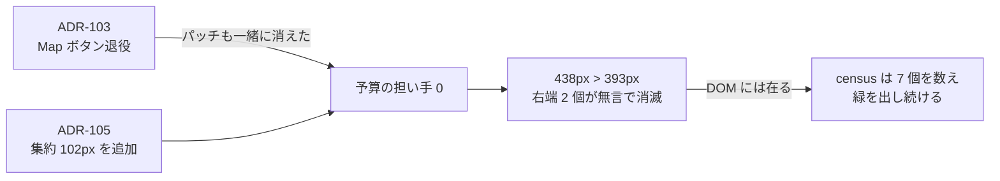

# 114. 届く入口の個数は、宣言された入口の個数ではない — 端の幅と自由度に欄を与える

- Status: Accepted (実装済み — 上端に幅の予算を置き mobile ヘッダの切り落とし 2 個を 0 個に、カメラ自由度 → タッチジェスチャの割当表で pan を復活、double-tap を純粋述語の判定下へ、drawer の backdrop を導出へ、狭レイアウト述語の 4 実装を 1 つに)
- Date: 2026-08-06
- Deciders: yuubae215, Claude
- Supersedes / Superseded by: なし (ADR-108 の入口 ratchet と ADR-105 D1/D2 の集約、
  ADR-106 D6 の端の所有者を **いずれも保ったまま**、それらが数えていなかった量を足す)

## Context — Goal と力学 (§1.2 Goal)

**Goal:** タッチ利用者が、カメラの 3 自由度と常設入口の全部に **実際に届き**、
届いていない操作が無言で誤爆しない。

出発点はユーザーからの 3 行の報告である。

> ・モバイルモードで N パネルしまえない
> ・ダブルタップのズームが誤爆しやすい
> ・Pan ができない

実機幅で計測したところ、**別々の症状に見えて、3 つとも同じ形をしていた**:
*在るもの*は数えられており、**在らないものに欄が無かった**。

### 力学 1 — 上端は高さだけが資源として扱われ、幅には所有者が居なかった

`Header.jsx` は `overflow:hidden` を持つ。実測 (Playwright, 4 デバイス幅):

| ビューポート | ヘッダが要求する幅 | 画面外へ出た入口 |
|---|---|---|
| 320px (iPhone SE / Galaxy S9+) | 438px | `⋯` と **N パネルのトグル** |
| 375px / 393px (iPhone 12 / Pixel 5) | 438px | **N パネルのトグル** (x=398..430, 1px も画面に無い) |

N のトグルは DOM に在る。`aria-label` も持つ。`docs/EVENTS.md` にも
「N button (mobile) | click | Toggle N Panel drawer」と書いてある。**押せないだけ**である。
だから `HeaderEntranceCensus` は mobile の入口を 7 個と数え、ratchet は緑を出し続けた。

数えるべきは「在る入口」ではなく「**画面に入らなかった入口**」で、*在るもの*を辿る
検査は定義上それを見ない (原則 #31)。

**そして、これは 2 度目である。** `docs/code_contracts/ui_layout.md` の
"Mobile Header Overflow" にはこう書いてあった:

> Map button hides its `<span>` text label on mobile (padding tightened to `4px`) —
> **without this the N-panel icon is clipped on 375px viewports**.

同じ症状が同じ場所で既に起きており、直し方は**特定の住人 (Map ボタン) に当てた
1 箇所のパッチ**だった。ADR-103 が Map ボタンを退役させたとき、パッチも一緒に消えた。
残高を見ている者が居ないので、ADR-105 が 102px の集約 (`DiscoveryCounters`) を足した
日に予算は静かに破れた。原則 #26 が「呼び出し箇所ごとのパッチ禁止」と言うのは、
パッチが**間違っているから**ではなく、パッチは自分が守っていた不変条件を
**持ち去るから**である。



### 力学 2 — 割当を持たない自由度は、行を持たないので読めない

`SceneView` の構築子に 1 行:

```js
this.controls.touches = { ONE: THREE.TOUCH.ROTATE, TWO: THREE.TOUCH.DOLLY_ROTATE }
```

この行は 2 つを宣言している。宣言されていないのは pan で、**宣言されていないものは
行として現れない**。したがってコードを読んでも「pan が無い」は見えず、実際 pan は
出荷から一度も触れなかった。2 本指ドラッグは常に dolly + rotate を返す。

### 力学 3 — ブラウザの `dblclick` を判定なしで信じていた

```js
_onDblClick(e) {
  …
  if (hit && hit.id !== this._scene.activeId) this._selMgr.selectOnly(hit.id)
  this.focusSelection()          // 判定は 0 個
}
```

見ていなかったもの: **移動量** (ブラウザは離れた 2 タップもまとめる)、
**あいだに起きたこと** (1 本指ドラッグ = オービットを挟んでも `dblclick` は出る)、
**当たり**。3 つ目が最も重い — `_focusSphere()` は選択が空だと**シーン全体**へ
フォールバックするので、*空振りの誤爆*が取りうる中で最大のカメラ跳躍を起こす。

### 力学 4 — 開閉と backdrop が 2 欄で、書き手が 2 箇所

`nPanelVisible` と `backdropCallback` は必ず同時に動くのに、`_toggleNPanel()` は
前者しか書かず、後者は `onNPanelToggle` ハンドラの中だけで書かれていた。
`N` キー経路と outliner の「もう片方を閉じる」行は前者だけを通る。**backdrop 無しで
開いた drawer は、画面外のトグルでしか閉じられない** — 力学 1 と噛み合って、
報告された「しまえない」を二重にしていた。

### 力学 5 — 「狭いか」に 4 通りの答えがあった

`window.innerWidth < 768` の直書き、`useIsMobile()` の同一実装 3 コピー、そして
`matchMedia('(pointer: coarse)')`。3 番目は**別の問いへの答え**である
(粗いポインタの広いタブレットは狭くない)。それが `bottomEdgeOffset({isMobile})` へ
渡されていたので、端の占有量が入力デバイスで変わっていた。

## Options considered

- **A: 症状ごとに直す** (N ボタンを小さくする / `DOLLY_PAN` にする / `dblclick` に
  `pointerType` を足す) — tradeoff: 3 行で終わる。**却下**: これは "Mobile Header
  Overflow" が既に 1 度やった直し方で、パッチは退役とともに消える。次に住人が
  1 人増えた日に同じ ADR をもう一度書くことになる。
- **B: 上端の住人を減らす** (N トグルを `⋯` へ畳む) — tradeoff: 幅は一気に空く。
  **却下**: トグルは自分の面の状態表示なので、メニューに隠すと 1 手と状態読みの
  両方を失う (原則 #15)。加えて入口の個数を減らすだけでは、次に足された住人が
  また右端を押し出す — 数えるものが変わっていない。
- **C: 端の幅に予算を置き、自由度に割当表を置き、判定を述語にする** (採用) —
  tradeoff: 表と検査が増える。宣言を書かずに住人を足せなくなる (それが目的)。
- **D: 現状維持** — tradeoff: なし。**却下**: モバイルで N パネルが開けも閉じもせず、
  pan が存在しない。

## Decision — Strategy (§1.2 Strategy)

**「宣言された個数」と「届く個数」を別々に数え、後者の母集団を*在らないもの*の側に置く。**

### D1 — 上端は 2 次元の資源。幅にも所有者を置く

`EdgeOccupancy` に `HEADER_METRICS` (実寸) と `TOP_EDGE_OCCUPANTS` (住人ごとの占有幅)
を置く。`Header.jsx` は寸法を**自分で決めず**同じ表から読むので、予算は現実の写しになる
(§1.1)。合計が `MIN_SUPPORTED_WIDTH` (= 320px, `view/Viewport.js` が宣言) に収まることを
機械が問い、**未宣言の住人では throw する** (既定 0 で埋めると、幅を書き忘れた入口が
「予算を消費しない住人」として合計に現れず、予算だけが緑になる)。

狭レイアウトで落とすのは**語であって入口ではない**: `Object Mode ▾` → `Obj ▾`、
集約の内訳語を落として桁を 1 桁 + `9+` に固定。**3 数は合算しない** — ADR-104 D4 が
禁じており、狭さが削ってよいのは *数の桁* であって *数の個数* ではない。
落ちた語は `title` / `aria-label` に残る。

実測 (320px): 438px → **314px**、画面外 0 個。

### D2 — カメラ自由度 → タッチジェスチャの割当表 (`view/CameraGestures.js`)

母集団を**自由度の側** (`CAMERA_DOF` = orbit / dolly / pan) に置き、表が全射である
ことを機械に問わせる。`OrbitControls` の `touches` はこの表からの**翻訳**であって
第二の宣言ではない。`DOLLY_ROTATE` → `DOLLY_PAN` は 2 本指の回転を捨てるが、
捨てるのは重複である (1 本指が既に回している)。

### D3 — double-tap は純粋述語が判定する (`view/TapGesture.js`)

`acceptDoubleTap({firstTap, secondTap, cameraMovedBetween, hitSomething, hasSelection})`。
ブラウザの `dblclick` は**候補であって決定ではない**。却下時は必ず理由を返す
(呼び手が握り潰してよいが、*なぜ*落としたかは常に言える — 原則 #11)。
空振り (当たりも選択も無い) は受理しない = シーン全体へのフォールバックは
「意図の最も薄いジェスチャ」への最大の応答だったので閉じる。

### D4 — backdrop は drawer から**導出**する

`_syncDrawerBackdrop()` を唯一の書き手にし、`_toggleNPanel()` を唯一の入口にする
(原則 #1 / #4)。副産物として、どの経路で開いた drawer も**暗くなった 3D を叩けば閉じる**。

### D5 — 「狭いか」は 1 つの述語 (`view/Viewport.js`)

`isNarrowViewport()` (レイアウトの幅) と `hasFinePointer()` (入力の粗さ) を
**別の名前**で持つ。畳めるように見えるのは今日の端末分布がそうなっているだけで、
それは規則ではない。React 側の購読は `useIsNarrowViewport()` ただ 1 つ。

## Consequences — Evidence と tradeoff (§1.2 Evidence)

- **肯定的:** 報告 3 件が閉じる。加えて、次に上端へ住人を足す人は幅を宣言しない限り
  検査に落ちる = 3 度目が起きない。pan / dolly / orbit の全射は自由度を足した日に問われる。
- **受け入れるコスト:**
  - 2 本指ローテートを失う (1 本指と重複していた)。
  - 狭レイアウトで集約の桁が 1 桁 + `9+` になる (**精度**を落とす。**区別**は落とさない)。
  - `MIN_SUPPORTED_WIDTH` = 320px を約束として固定した。これを上げるのは
    「約束を下げる」宣言で、レビューで必ず目に入る。
- **検証 (証拠):** GSN 論証木 `docs/gsn/adr-114-reachable-is-not-declared.gsn`。
  - `src/view/EdgeOccupancy.test.js` — 予算が最小対応幅に収まる / 未宣言の住人で throw /
    狭寸法が実際に効いている / 幅に理由がある
  - `src/HeaderEntranceCensus.test.js` — mobile に描かれる住人が全員予算に載っている
    (母集団は JSX から導出) / 実際に描かれている行の合計が 320px に収まる
  - `src/view/CameraGestures.test.js` — 割当の無い自由度 0 個 / 未宣言で throw /
    翻訳が `DOLLY_PAN`
  - `src/view/TapGesture.test.js` — 距離・オービット・空振りの却下と理由の非空
  - `e2e/mobile-reach.spec.js` (320px, touch) — **押せるコントロールの矩形**を測り
    画面外 0 個 / N トグルで開いて**閉じる** / 暗転を叩いて閉じる /
    走っているアプリの `touches.TWO === DOLLY_PAN`
- **波及 (blast radius):** `Header.jsx` `ModeDropdown` `HeaderMenus` `DiscoveryCounters`
  `EdgeOccupancy` `Viewport` `CameraGestures` `TapGesture` `SceneView` `AppController`、
  および狭レイアウト述語を読む 16 ファイル。**触っていない**と宣言するもの: desktop
  レイアウト (幅に余裕がある)、`mouseButtons` (PC の割当)、place tool のジェスチャ停止
  (`_orbitDefaults` は 2 本指を奪っていないので不変)、ドメイン・契約・BFF・`core/`。

## Lens notes

**この証拠が構造的に見逃すもの (宣言):**

1. **単体の幅予算は実レンダリング幅を見ない** — フォント・ロケール・ユーザー拡大。
   だから e2e を併設する。逆に e2e は**列挙した幅でしか**見ない (320px のみ)。
   320px 未満・横向き・ブラウザ UI ぶんの目減りは対象外。
2. **母集団は `MobileHeaderContents` の中だけ** — ADR-108 が既に宣言した既知の穴
   (ヘッダの外に生えた常設 chrome は数えない) をそのまま引き継ぐ。
3. **double-tap の実機再現は残る。** `TapGesture.test.js` は述語が正しいことしか示さず、
   *ブラウザがいつ `dblclick` を合成するか* は示さない。Playwright の合成タッチでは
   `dblclick` が出ないことを実測で確認済み — つまりこの穴は仮定ではなく既知である。

**検査自体が一度素通りした記録 (原則 #19):** `e2e/mobile-reach.spec.js` の初版は
`header.children` (直接の子) の矩形を測っていた。`ModeDropdown` は `position:relative`
のラッパ div に包まれており、ラッパは flex-shrink できるので、**中のボタンが画面外へ
出てもラッパの矩形は viewport 内に留まる**。ラベルを元に戻す負の対照実験でこの版は
緑を出し、`querySelectorAll('button')` へ変えて初めて落ちた。「指が届くか」を問うなら、
測るのは**指が触れる箱**でなければならない — 母集団の取り違えは、規則が正しくても
検査を空回りさせる。
