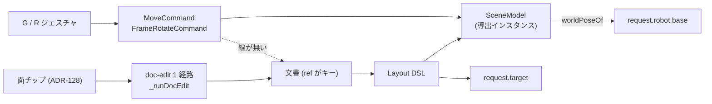
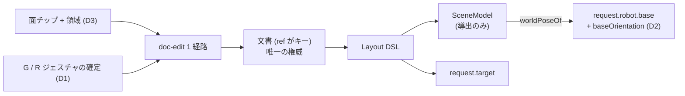

# 129. 宣言は、それを書いたインスタンスより長生きする — 配置・据付姿勢・掴む領域を文書の実体 (ref) に預ける

- Status: Proposed (未実装。**3 判断で 1 つの MVP** — 分割して出さない。採択 = 実装で段 G-5)
- Date: 2026-08-14
- Deciders: yuubae215, Claude
- Retires: GREP:docs/DEFERRAL_LEDGER.md::DEF-031 · GREP:docs/DEFERRAL_LEDGER.md::DEF-032 · GREP:docs/dogfooding/ux-scenarios.md::文書由来
- 段: **G-5** (`docs/grasp/implementation-order.md`)。前提: G-2 / G-3 (ともに完了)
- Supersedes / Superseded by: なし (ADR-128 D4「宣言の権威は文書」を、掴む場所**以外**の宣言へ広げる)

## Context — Goal と力学 (§1.2 Goal)

**Goal:** *ユーザーが宣言した事実は、宣言の対象になった実体と同じ寿命・同じ経路で
生き死にする。宣言が実行時インスタンスに寄生して、実体は生きているのに宣言だけが
静かに消える — あるいは実体が消えたのに宣言だけが残る — 状態を無くす。*

Goal は「grasp のループが回るようにする」ではない。それは**解の形をした要件**で、
下の却下案 A でも満たせてしまう。満たしたい性質は **寿命の一致**であって、ループが
回るのはその帰結である。

### 3 つの穴は 3 つではない

直前の観測は 3 件の欠落として並んだ。並べ方が間違っていた。

| ユーザーが言うこと | 語彙 | 値がいま住む場所 | 寿命 | export | undo | 実体が消えたとき |
|---|---|---|---|---|---|---|
| ここに置く | **在る** (`entity.position` — Context / Layout 両方) | `SceneModel` のインスタンス (`createMoveCommand` が書く) | セッション | 載らない | シーンにだけ効く | 一緒に消える (偶然) |
| こう据え付ける | **在る** (`entity.rotation` — 同上) | 同上。加えてワイヤに**欄が無い** | セッション | 載らない | 同上 | 同上 |
| この面のここを掴む | 在る (`entity.graspFeature`) | **文書** | 文書と同じ | 載る | 同じ mutation | **同じ mutation で消える** |

3 行目だけが正しい。ADR-128 D4 が「権威は文書、書き手は既存の doc-edit 1 経路」と
決めたからで、**その判断は 1 行分しか適用されていない**。

**実測 (2026-08-14):**

- `createMoveCommand` (`src/command/MoveCommand.js`) が書くのは `sceneModel.getObject(id)`
  だけで、文書へ向かう経路は 1 本も無い。`FrameRotateCommand` も同じ。
- `schema/context-0.5.schema.json` の `hydratedEntity` は `position` も `rotation` も
  **既に持つ**。`schema/layout-1.0.schema.json` も同じ。**語彙は最初から在る。**
- `ContextService._refForSceneId(sceneId)` が既に「シーンのインスタンス → 文書の `ref`」を
  返す。**接続点も在る。**
- `GraspController._graspTargets()` は `getCompiled().layoutDsl.entities` を読み、
  `_resolveRobotDeclaration()` は `SceneService.worldPoseOf()` を読む。
  **片方は文書、片方はインスタンス。**

無いのは **入力面から語彙への線**だけである。

### これは ADR-128 の主題が一段上に出たもの

ADR-128 は「書けない宣言は宣言ではない」と決め、掴む場所についてそれを実行した。
**同じ文が配置についても真である**ことは、その日には見えていなかった — 配置には
G / R という入力面がちゃんと在るので、「書けない」ようには見えないからである。
実際には**書けている先が違う**。書き込み先が導出物なら、*書けたこと*と*宣言したこと*は
別の事実になる。

### 同一性のキー — 型か、インスタンスか

宣言のキーは 2 通りしか無い:

| キー | 誰が与えるか | 寿命 | 壊れたときの検出 | 破棄 |
|---|---|---|---|---|
| `ref` (文書の実体) | 文書 | 文書と同じ | `compileContext` が dangling を **throw** | 文書の mutation |
| `sceneId` (シーンのインスタンス) | 実行時 | セッション | 無い | GC |

`ref` は文書が与える**型レベルの同一性**で、`sceneId` は再インポートのたびに作り直される
導出物の同一性である。宣言を後者に預けると、後始末は「たまたま一緒に消えた」に依存する。
今日は消えているが、それは**設計ではなく偶然**であり、偶然は検査できない。

### なぜ黙って壊れるか (原則 #31)

ワークを動かして Run すると、返るのは **古い位置での正しい答え**である。エラーでも
警告でもなく、棄却ファネルにも出ない。「動かしたのに答えが変わらない」は欄を持たない。

ADR-117 がこれを既知の限界として散文に書いたのが 2026-08-11 で、**3 日そのまま在り、
その間に同じ形の穴が 2 つ増えた** (DEF-031 / DEF-032)。散文は数えられないので累積しない。

### 寿命の関係として書くと

要求:

```
L(宣言) ≥ L(宣言の対象)      かつ      宣言の消滅 ⇔ 対象の消滅
```

現状:

```
L(配置)     = L(セッション) < L(実体)     ← 静かに切れる
L(据付姿勢)  = L(セッション) < L(実体)     ← 静かに切れる (加えてワイヤに欄が無い)
L(掴む場所)  = L(文書)      = L(実体)     ← 正しい (ADR-128)
```

### 書き込み経路 — 現在



`GR → MC → SCENE` の枝が文書へ戻らないので、`SCENE` は配置について**第二の源**に
なっている (§1.1)。しかも `request` の 2 欄が別々の源を読んでいる。

### 決定後



`worldPoseOf` は残るが、それは**導出のアクセサ**であって源ではない — 文書と同じ値を
返すことが構造的に保証される。

## Options considered

- **A: 探索の瞬間にシーンを読む** (`resolveGraspTargets` が `worldPoseOf` を読む)
  — tradeoff: 呼び出し 1 箇所で**安い**。しかし (1) 探索の入力がエクスポートした文書から
  再現できず、`docs/dogfooding/` の記録が「そのセッションでのみ真」になる、(2) 閉じるのは
  3 つのうち 1 つだけで、据付姿勢と領域には別々の手当てが要る = **同じ欠陥に 3 回
  対処する**、(3) 「シーンが権威」を 1 か所だけ認めると、文書とシーンの二源が**制度化
  される**。後始末の観点では最悪の案である — 宣言はインスタンスに残ったまま、それを
  読む側だけが増える。
- **B: ジェスチャの確定を文書への書き込みにする** — tradeoff: 確定ごとに再コンパイル +
  再インポート。連続操作が重く、再インポートを跨いで選択・カメラ・ゴーストが保たれるかは
  未検証。**採用。**
- **C: 配置もパネルの数値欄で入力する** (ADR-128 D1 の形をそのまま踏襲) — tradeoff:
  判断の一貫性はあるが、G / R という入力面が既に在るのに**もう 1 つ入力面を作る**ことに
  なり、同じ属性に書き手が 2 つできる (原則 #1)。3D エディタとして退行でもある。
- **D: 現状維持 + 散文で限界を書く** — tradeoff: 既にやってあり、3 日で穴が 2 つ増えた。

## Decision — Strategy (§1.2 Strategy)

### D0 — 宣言の同一性は文書の `ref`。インスタンスは宣言を持たない

以下の 3 つはこの一文の**適用**であって、独立した 3 機能ではない。

### D1 — ジェスチャの確定は文書への書き込みである (`ref` を持つ実体に限る)

- Grab / Rotate の**確定時**に、`_refForSceneId` が `ref` を返す実体については
  `entity.position` / `entity.rotation` を **ADR-128 と同じ doc-edit 経路**
  (`createDocEditCommand` → `_runDocEdit`) で書く。
- **ドラッグ中は書かない。** 中間姿勢は宣言ではない (書けば undo スタックが 60fps で伸びる)。
- `ref` を持つ実体では `createMoveCommand` / `FrameRotateCommand` を**使わない**。両方が
  生きていると同じ姿勢に書き手が 2 つできる (原則 #4)。シーン側の位置は再コンパイル →
  再インポートで着く。
- `ref` を**持たない**実体 (文書由来でないアドホックなオブジェクト) には書かない。それは
  欠落ではなく**状態**で、「この物は宣言されていない = 探索の対象にならない」と画面に
  出す (原則 #31 / #11)。今日それは無言で、しかも grasp 側から見ると存在すらしていない。
- **境界は語彙であって、ジェスチャの種類ではない** (下の Lens notes 参照)。

### D2 — 据付姿勢を契約に足す (`robot.baseOrientation`)

- request 側 optional の追加なので **`contractVersion` は上げない** (ADR-083/084 の先例、
  ADR-119 D1 と同じ)。**次の意図的な版上げは ADR-122 D2 のまま**で、DEF-029 はそちらに
  乗り続ける — この ADR に相乗りさせない。
- `core/` は宣言があるときだけ目標をベース姿勢の逆回転で戻して解く。無ければ従来どおり
  恒等 (ADR-084 §3 / ADR-127 D3 の規律: **宣言した瞬間にだけ挙動が変わる**)。
- **壊れた四元数は素朴判定へ落とさず throw** (ADR-127 D3 と同型 — 無言の格下げは嘘)。
- 未宣言は「回転していない」ではなく「**述べていない**」。`core/` が恒等で解くこと自体は
  変えられない (向き無しでは解けない) ので、区別は**フロントが画面に出す** —「据付姿勢は
  未宣言。直立と仮定して解いています」。`jointLimits` の不在を「無限」と読ませなかったのと
  同じ判断で (ADR-127 D4)、違いは *仮定を消せない*ぶん**言う**しかないことである。

### D3 — 掴む領域をパネルから書けるようにする

- 面チップの下に u / v の範囲を置く。
- **どちらの軸が u かは `inPlaneAxesOrThrow` が既に決定的に持っている**ので、画面はその
  名前を**表示する**だけ (第二の源を作らない)。DEF-031 は「面の 2 軸のどちらが u かを
  画面上で正しく名指しする設計が要る」ことを先送りの理由に挙げたが、**その名前の権威は
  既に在り**、要るのは呼び出しだけである。
- 確認は既存の `GraspSampleView` がそのまま担う — 領域を狭めるとサンプル点が減るのが
  3D に出る。**新しい確認面を作らない** (ADR-128 D1 の「入力はパネル・確認は 3D」を継ぐ)。

### D4 — 3 つで 1 つの MVP。分割して出さない

分けると、どれか 1 つが入った時点で「宣言の権威は文書」が**半分だけ**真になる。半分だけ
真の規律は規律ではない — それがまさに ADR-128 D4 が 1 行分しか適用されなかった今日の
状態であり、この ADR が存在する理由そのものである。検査も 3 本に割れず 1 つの形で書ける
(D5)。

### D5 — 後始末の検査は往復 (fixpoint) で書く。値では書かない

主張は「宣言は対象と同じ寿命を持つ」なので、問うのは値ではなく**寿命**である:

1. **往復:** 宣言する → `.ctx.json` へエクスポート → 新しいセッションで読み直す →
   **同じ探索リクエストが出る**。原則 #28 の形 (商・正規形の上の fixpoint)。値を比べる
   検査は「たまたま今のセッションで一致する」を緑にする。
2. **負の対照:** 実体を消す → 宣言も消える。dangling `ref` は `compileContext` が
   **throw する** (静かに残らないことを、消えたことではなく*音*で問う)。
3. **入口の個数:** 宣言された姿勢を書く入口がちょうど 1 つ
   (`src/PosePolicyOwnership.test.js` の母集団に doc-edit 経路を足す — ADR-097 / ADR-101 が
   pose の入口を数えた表の続き)。`MoveCommand` と doc-edit が両方 `ref` 実体に効いている
   状態を、検査が落とす。

## Consequences — Evidence と tradeoff (§1.2 Evidence)

### 得られるもの

- grasp のループ (掴む場所 → ハンド → 確認 → ワーク配置 → アーム配置 → 確認) が
  **全部の手で**回る。今日は 6 手のうち 1 手が黙って効かない。
- 探索の入力がエクスポートした文書から再現できる。`docs/dogfooding/` の記録が
  「そのシーンでのみ真」でなくなる。
- 宣言の寿命が 1 つになるので、消し忘れ・取り残しが構造的に発生しない。
  **後始末が規律ではなく型の帰結になる。**

### 受け入れるコスト / 否定的

- **確定ごとに再コンパイル + 再インポート。** 連続ドラッグの確定が重い。選択・カメラ・
  ゴーストが再インポートを跨いで保たれるかは**未検証** — D5-1 の往復で決着させる。
  保たれないならそれは「安くする」以前に**正しくない**ので、この ADR の実装の一部として
  直す (速度の最適化は別段でよいが、状態の消失は別段にしない)。
- `createMoveCommand` / `FrameRotateCommand` は消えない (アドホック実体には要る) ので、
  **2 つの経路が用途で分かれた状態**が残る。分かれたことを D5-3 で釘付けする。
- 契約: request スキーマに `robot.baseOrientation`、`core/` の pydantic + 準拠テストを
  同一 PR。**版は上げない**。
- 状態台帳: 「宣言された姿勢を書く入口」と「実体が `ref` を持つか (基数)」の 2 件は
  `docs/STATE_LEDGER.md` §提案中の実体 に記録済み (Accepted・実装時に上の台帳へ**移す**)。
- **同じ形の 4 例目を宣言して残す:** ハンド仕様・カメラ・重みは今日パネルの React state に
  住んでおり、**キーを持たない** (リロードで消え、export に載らず、undo の外)。この MVP には
  入れない — それらは実体の属性ではなく*探索の設定*で、どの実体に属するのか (ハンドは
  ロボットの子か、独立した実体か) を決める別の判断が要る。DEF-033 として登録した。

### 検証 (証拠)

`docs/gsn/adr-129-a-declaration-outlives-the-instance.gsn` が **goal ごとの支えの正本**。
現在 4 goal すべてが `support-exploring` (未着手) で、各々に満期 trigger を持たせてある —
名指しした検査が実在した日に `pnpm test:gsn-debt` が「exploring を solution へ昇格させよ」と
落ちる。

| 主張 | 問い所 (満期) |
|---|---|
| 宣言はリロードとエクスポートを跨いで生き残る | `src/service/ContextService.test.js` の往復 |
| 据付姿勢がワイヤに載る / 未宣言が仮定として画面に出る | `packages/grasp-contract/schema/grasp-search-request.schema.json::baseOrientation` + `core/tests/` |
| 領域がパネルから書ける | `src/components/Grasp/GraspSearchPanel.jsx::uMin` |
| 宣言された姿勢を書く入口がちょうど 1 つ | `src/PosePolicyOwnership.test.js` |

### 波及 (blast radius)

- `src/controller/handler/GrabOperationHandler.js` / 回転ハンドラ — 確定の行き先
- `src/command/MoveCommand.js` · `src/command/FrameRotateCommand.js` — 用途の分岐
- `src/controller/ContextController.js` · `src/context/DocBuilder.js` — 書き込み verb の追加
  (ADR-128 の `setGraspFeature` の隣)
- `src/service/ContextService.js` — 再インポートを跨ぐ状態の保持
- `packages/grasp-contract/schema/grasp-search-request.schema.json` ·
  `core/easy_extrude_core/contract/models.py` · `core/easy_extrude_core/engine/ur_solver.py`
- `src/components/Grasp/GraspSearchPanel.jsx` · `src/domain/graspFeature.js` (領域入力)
- `src/PosePolicyOwnership.test.js` (母集団 +1) · `docs/STATE_LEDGER.md` ·
  `docs/dogfooding/ux-scenarios.md` (§既知の限界の該当項を消す — `Retires:`)

## Lens notes

- **様態 (§1.3):** BPMN。ジェスチャ確定 → 文書書き込み → 再コンパイル → 再描画 は
  決め打ちの逐次で、事象駆動の裁量処理ではない。
- **§1.1:** 権威は文書ただ 1 つ。シーンは導出で、`worldPoseOf` は導出のアクセサであって
  源ではない。この ADR 以後、「シーンを読む」と「文書を読む」が同じ値を返すことが
  構造的に保証される。
- **ADR-128 D1 と矛盾しない。** あちらは「**新しい**入力面を 3D に作らない」と決めた
  (選択モデルとヒットテストに波及するから)。ここで決めるのは**既に在る**入力面 (G / R) の
  書き込み先で、選択モデルにもヒットテストにも触れない。
- **却下した一般化:** 「すべてのシーン変更を文書へ書き戻す」(押し出し・ブーリアン・
  スケッチ) は**採らない**。それは ADR-054 / ADR-055 が禁じたシーンの逆コンパイルで、
  幾何の**生成手順**は文書の語彙に無い。書き戻すのは**文書が既に語彙を持っている属性
  だけ** (`position` / `rotation`) — 境界は**語彙の有無**であって、ジェスチャの種類ではない。
- **原則 #31:** 「宣言されていない実体」は基数 0 / N を取る状態だが `mode` 欄を持たない。
  台帳の基数列に記録する (`docs/STATE_LEDGER.md`)。
