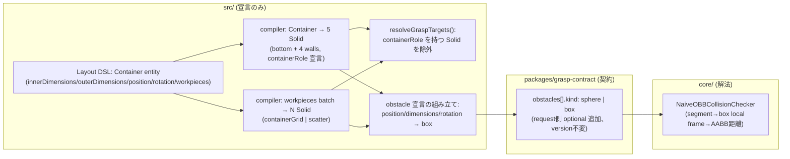

# 133. A container is five solids with a declared role, not a new primitive

- Status: Proposed
- Date: 2026-08-15
- Deciders: yuubae215 (via `/whiteboard` session)
- Retires: なし — 既存の sphere obstacle 表現 (`kind` を足すだけ)・既存の `robotRole` パターン・ADR-078 の `core/` scene 層 (`derive_obstacles` / `POST /pick-sequence`) はいずれも変更せず、後者は今回の実装スコープにも入らない (触らない対象として明示)。ADR-078 の "Still deferred: 箱/半空間障害物の厳密干渉" は OBB 近似までを本 ADR が引き受け、完全な半空間 (薄板) 干渉は DEF-036 として切り出す (退役ではなく残しなので Retires の対象外)。
- Supersedes / Superseded by: なし (ADR-078 / ADR-122 の "エディタ側への申し送り" を受ける子 ADR。両者は Status 変更しない)

## Context — Goal と力学

**Goal(解ではなく性質):** ワークピースの集合を、コンテナという文脈のもとで「整列」または
「ばら」に配置して宣言すると、既存の単発 grasp search (1 回に 1 対象を選んで実行する
現行フロー) がそれらを対象・障害物として扱える。ワークを 1 個ずつ手で置く必要がなく、
コンテナの壁がロボットの手を阻む物としても正しく扱われる。

**力学・出発点:**
- ADR-078 (Accepted) が `core/` 側に bin-picking scene 層 (`SceneEntity` の kind/persistence、
  `derive_obstacles`、`POST /pick-sequence`) を実装済みだが、BFF ルート・クライアント・
  中立 wire スキーマが無く「実装済みなのに誰も呼んでいない」(ADR-122 の発見 (b))。
  ADR-078 自身が「コンテナ配置・ワーク配置の UI/DSL 拡張はエディタ側への申し送り」として
  明示的に保留していた。
- ADR-122 (Proposed, 未実装) が pick-sequence に契約と入口を与える D2 と、配置は宣言せず
  集合から導出する D3 を設計済みだが未着手。
- 今回のリクエストはこの申し送りの実装だが、**BFF / `pick-sequence` 配線は意図的に除外**
  する(ユーザー指示: 「BFF は後回し、GitHub Pages の静的ページで検証できる程度で」)。
  GitHub Pages は BFF/core を持たない静的ホストで、grasp 検索は ADR-117 の stub lane
  (`mocks/graspStub`) がスキーマ準拠の捏造値で答える。よって本 ADR のスコープは
  **既存の単発 grasp-search リクエストにコンテナ由来のワークを流し込めるところまで**とし、
  複数ピックの逐次探索・最上面自動選択・ピック後の縮小ループは対象外。

**層マップ上の位置(CLAUDE.md のスコープ境界表):**
- Layout DSL 語彙・コンパイラ・障害物「宣言」の組み立ては `src/` (フロント) の責務。
- 干渉判定の「解き方」(sphere か box かの幾何アルゴリズム) は `core/` の責務のまま
  ("Declaration only: interference and occlusion are solved in core/" — contract 記載)。
  本 ADR は front→core の**境界を保ったまま**、宣言できる形状の語彙を box に広げる。



## Options considered

- **A(採用): Container を専用 entity type にし、コンパイル時に 5 Solid (containerRole 宣言) +
  N workpiece Solid に展開。障害物表現を sphere→box(kind 判別 union)に拡張。**
  — tradeoff: 層をまたぐ変更 (schema + compiler + domain + contract + core) だが、
  各層が単一責務を保ったまま追加できる。既存の box-obstacle 変換コードを壁とワークで
  共用できる (壁もワークも「ただの Solid」になるため)。
- B: Container を「Solid + 属性 (kind:"container")」として表現し、壁は生成しない
  (壁は front 側で仮想的に obstacle 宣言するだけで、実体としては存在しない)
  — tradeoff: エンティティ数が減り実装は軽いが、壁が Outliner で選択・編集できず、
  robotRole の前例(宣言された属性で型付けする)からも外れる。ユーザーが明示的に
  「5 つの直方体からなる」と定義したため却下。
- C: 障害物表現は sphere のまま、コンテナ機能だけ先に入れる
  — tradeoff: 実装は小さいが、全軸ランダム回転する「ばら」配置のワークに対して
  sphere 近似は過大/過小のどちらの方向にもズレが大きく、機能の価値が薄い
  (ユーザーが「重なり許容」を選んだ理由と衝突判定の精度は別軸なので、精度側だけ
  下げる理由が無い)。却下。
- D: `core/` の scene 層 (`derive_obstacles` / `pick-sequence`) をこの ADR で前倒し配線する
  — tradeoff: ADR-122 の設計判断 (D2/D3 の実装順序) を追い越すことになり、BFF ルート・
  中立 wire スキーマという別の大きい残し (DEF-006) を同時に開けてしまう。ユーザーが
  明示的に「後回し」と指定したスコープを超える。却下 (§5 過剰モデリング禁止)。

## Decision — Strategy

**D1. Container は Layout DSL の専用 entity type。**
`schema/layout-1.0.schema.json` の entity `type` enum に `"Container"` を追加。属性:
`innerDimensions {x,y,z}` / `outerDimensions {x,y,z}` / `position` / `rotation` / `workpieces`
(D3 参照)。壁厚・底厚は宣言しない — `(outer−inner)/2` (X/Y 各軸)、`outer.z−inner.z` (底) から
**導出**する。二重に宣言すると内寸と厚みが食い違う余地が生まれる (§1.1) ため、
どちらか一方を導出値にする方が安全で、両方を実測値として扱いたいというユーザーの意図
(「内寸、外寸…など」) にも合う。

**D2. コンパイル時に Container を 5 つの Solid へ展開する。**
1 bottom + 4 walls (`wallXNeg`/`wallXPos`/`wallYNeg`/`wallYPos`)。各 Solid は
`containerRole: "bottom"|"wallXNeg"|"wallXPos"|"wallYNeg"|"wallYPos"` と
`containerRef: <Container の ref>` を持つ。これは `robotRole` (ADR-090) と同型の統治:
**型は宣言された属性で決まり、名前や geometry の推測では決まらない** (PHILOSOPHY #2)。
壁/底は個別に選択可能な普通の `Solid` として Outliner に現れる (却下案 B は不採用)。

**D3. workpieces バッチ宣言が N 個の Solid に展開される。**
Container のフィールドとして:
```jsonc
"workpieces": {
  "dimensions": {"x":..,"y":..,"z":..},
  "count": 30,
  "placement": "containerGrid" | "scatter",
  "seed": 42,                 // scatter は必須。containerGrid は既に決定的なので無視
  "layers": 3, "spacing": 4,  // containerGrid のみ
  "rotation": "fullAxis"      // scatter のみ。現状唯一の許容値 — 未知値は throw (原則 #31、
                               // 「回転なし」を既定値で表現しない。次の回転種別を足すときは
                               // 値を 1 つ追加する意図的な行為にする)
}
```
コンパイラが `<containerRef>_wp_<i>` の ref を持つ N 個の `Solid` を生成する。各々
`containerRef` を持つが `containerRole` は持たない (壁と違い pickable から除外しない)。
- **containerGrid**: 内寸とワーク寸法から列・行を自動割付 (`cols = floor(innerX / (dimX + spacing))`
  等)、`layers` 段で積み重ねる。決定的 (シード不要)。
- **scatter (ばら)**: シード固定の擬似乱数で内寸範囲に XY をサンプリング、Z はワークの
  重なりをオフセットで表現する山積み風の値 (実衝突回避はしない — D5 参照)。各ワークの
  向きは全軸ランダム回転 (シード由来)。

**D4. `resolveGraspTargets()` に containerRole 除外フィルタを追加する。**
`src/domain/graspTargets.js` の pickable-target 解決に「`containerRole` を持つ Solid は
除外する」を足す。既存の「CoordinateFrame は構築上除外」と同じ形の追加ルールであり、
新しい述語ではなく既存関数の 1 分岐。ワーク (containerRole 無し) は除外されず、
既存ロジックのまま pickable になる。

**D5. 障害物宣言を sphere から box (kind 判別 union) へ拡張する。**
- `packages/grasp-contract`: `obstacles[]` item に `kind: "sphere"|"box"` を追加。box は
  `center` + `halfExtents [x,y,z]` + `orientation` (quaternion)。request 側の optional 追加
  なので `contractVersion` は上げない (ADR-083/084 の先例) が、item は `additionalProperties:false`
  の閉じたオブジェクトなのでスキーマ自体の更新は要る。
- `core/easy_extrude_core/engine/feasibility.py`: 新規 `NaiveOBBCollisionChecker`
  (進入線分を箱のローカル座標系へ変換し、AABB との最短距離を probe_radius と比較)。
  既存 `NaiveSphereCollisionChecker` は残し、`obstacle.kind` で分岐する
  (dispatch は `types.Obstacle` 側に持たせるか checker 側に持たせるかは実装時に決める —
  ADR 本文では境界だけ固定する)。回転を考慮した **OBB** を選ぶ (ユーザー確認済み —
  全軸ランダム回転する scatter ワークに対し AABB は緩すぎる)。
- `src/domain/graspTargets.js` の obstacle 生成 (`obstaclesExcluding` 相当) を、対象 Solid
  (壁・ワーク問わず) の `position`/`dimensions`/`rotation` から直接 box 宣言を組み立てる形に
  変更する。これは幾何の**受け渡し**であって干渉判定そのものではない — 契約が既に
  "Declaration only: interference and occlusion are solved in `core/`" と明記しており、
  この境界は変えない。sphere 生成コードは互換のため残すか削除するかは実装時に決める
  (使う場面が無くなれば削除 — 未使用の verb を残さない、ADR-132 の先例)。

**D6(明示的にやらないこと)。** BFF `/pick-sequence` ルート・クライアント配線
(ADR-122 D2 の残り)、複数ピックの逐次探索・最上面自動選択・ピック後の縮小ループ
(`core/scene/` 層は既存実装のまま呼ばない)、wire スキーマの中立化 (DEF-006)、
壁の厳密な半空間・薄板干渉 (OBB を超えるもの、DEF-036 として新規登録)。

## Consequences — Evidence と tradeoff

**肯定的:**
- 壁とワークが「ただの Solid」になることで、box-obstacle 変換コードを両方で共用でき、
  新しい特殊ケースを増やさない。
- `containerRole` は `robotRole` と同じ統治パターンの 2 例目 — 「宣言された属性で型付けする」
  が単発の判断ではなく繰り返し使える形だと確認できる。
- GitHub Pages (stub lane) だけで UI 経路 (コンテナ配置→ワーク生成→grasp search 実行) の
  疎通は検証できる。実幾何の正しさは `core/` の pytest に閉じ、front 側は形の受け渡しに
  留まる。

**受け入れるコスト / 否定的:**
- scatter 配置は物理的な重なりを解消しない (山積み「風」の見た目のみ)。ワークが実際には
  貫通した状態で grasp 候補が生成されうる — デモ・検証用途と割り切る (D3 で明記)。
- OBB は半空間・薄板の厳密干渉ではない (壁の厚みが薄い場合、進入経路が壁のごく近くを
  通る候補で誤判定が起こりうる)。DEF-036 で残しとして登録する。
- sphere と box の 2 表現が併存する期間ができる (contract・core 両方)。統一しない理由は
  既存 sphere 消費者 (もしあれば) を壊さないため — 実装時に他の呼び出し元の有無を確認する。

**検証(証拠):**
- `schema/layout-1.0.schema.json` の Container 追加 → 既存 schema conformance テスト
  (`pnpm test` 内の layout schema 検証群) が新 entity type を許容することを確認。
- コンパイラの Container→5 Solid / workpieces→N Solid 展開 → 新規
  `src/context/ContainerCompiler.test.js` (仮称): containerGrid が内寸をはみ出さないこと、
  scatter がシード固定で決定的に同じ配置を返すこと (round-trip)、壁 5 枚の合計体積が
  outerDimensions − innerDimensions の体積差と一致すること。
- `resolveGraspTargets` のフィルタ → `src/domain/graspTargets.test.js` に
  「containerRole を持つ Solid は pickable リストに出ない」ケースを追加。
- box 障害物の幾何的正しさ → `core/tests/test_engine.py` に `NaiveOBBCollisionChecker` の
  ユニットテスト (回転した箱に対する既知の交差/非交差ケース)。**GitHub Pages / stub lane は
  ここを検証しない** — stub はスコア・距離を捏造する契約 (ADR-117) なので、幾何の正しさは
  `pnpm test:core` でしか見えない。この境界は本文で明示する (構造的な見落とし宣言)。
- 契約変更 → `packages/grasp-contract/test/contract.test.mjs` (稼働していれば — DEF-029 参照)
  と BFF 側 `.d.ts` 再生成後の型チェック。

**波及(blast radius):**
`schema/layout-1.0.schema.json` / `src/context/*` (コンパイラ) / `src/domain/graspTargets.js` /
`packages/grasp-contract/schema/grasp-search-request.schema.json` / BFF `contract.request.d.ts` /
`core/easy_extrude_core/engine/feasibility.py` + `types.py` / `core/tests/test_engine.py` /
`mocks/graspStub` (box 形状リクエストが conformance test を通ることの確認)。
触らないと明示するもの: `core/easy_extrude_core/scene/*`、`server/src` の新規ルート、
`packages/grasp-contract` の pick-sequence 用スキーマ。

実装時に `docs/STATE_LEDGER.md` へ追記が要る新規基数: Container 個数 (`0..N`, 権威=Layout DSL
entities 配列)、`containerRole` (5 値 + 不在 `0..1` per Solid, 権威=コンパイラの唯一の書き手)、
workpieces 配置ポリシ (`containerGrid`/`scatter` の 2 値, 権威=Container の `workpieces.placement`)。

## Lens notes

- **型は宣言された属性の契約 (PHILOSOPHY #2)**: `containerRole` は `robotRole` の直接の
  横展開。命名規約 (`ref` に "wall" を含む等) や geometry 推測 (寸法比から壁と判定) は
  意図的に採らない — ADR-090 が robotRole で潰した「名前で見分ける」バグ形を再導入しない。
- **真実の源は一つ (§1.1)**: 壁厚は inner/outer から導出し、二重管理しない。壁 Solid の
  幾何 (position/dimensions) は Container 宣言からの導出であって、Container と壁 Solid の
  どちらが正本かという曖昧さを残さない — 正本は常に Container、壁は投影 (ADR-131 の
  「投影」と同じ語彙)。
- **層 + 契約**: front (宣言) と core (解法) の境界は sphere→box 拡張後も不変。契約側の
  `additionalProperties:false` を壊さない形で kind を足す (ADR-060/118/119 と同じ閉じた
  判別 union の統治)。
- **様態**: Container 展開もワーク展開も BPMN 的な決定的パイプライン (宣言→コンパイル→
  シーン) で、CMMN 的な裁量処理ではない。scatter の「乱数」もシード固定なので決定的
  (同じ入力から同じ出力 — 原則 #6 の変換規律と両立)。
