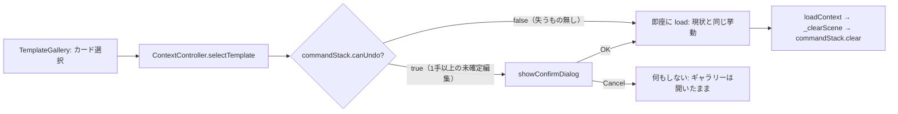

# 134. A project-open boundary confirms only when something is at stake

- Status: Accepted
- Date: 2026-08-15
- Deciders: yuubae215 (via `/whiteboard` session)
- Retires: GREP:src/controller/ContextController.js::needs\sno\sconfirm\sdialog · GREP:src/components/Context/TemplateGallery.jsx::no\ssecond\sconfirm\sdialog\sis\sneeded（この 2 箇所のコメントが表していた「テンプレ選択は無条件に確認なし」という運用を消す。GREP は文言で示す — 行番号は編集のたびにずれる）
- Supersedes / Superseded by: ADR-051 §7 の運用（Template Gallery の「フッタの注記で足りるので確認ダイアログは不要」という実装解釈）を amend（ADR-051 全体を supersede するものではない。§7 の原文自体はデモ入口 (`ContextDemoController`) 向けの決定で、そちらは今回変更しない — 下記 Context 参照）

## Context — Goal と力学

**Goal（解ではなく性質）:** テンプレート選択によるシーン破棄は、失うものが実在するときに
限りユーザーが認知した上で起きる。失うものが無ければ追加の摩擦を課さない。

**力学・出発点:**
- `ContextController.selectTemplate(id)` (`src/controller/ContextController.js:313`) は
  blank / example いずれの分岐でも `_loadThen` → `ContextService.loadContext` →
  `_projectScene({preserveUndeclared:false})` → `_clearScene()` を通り、無条件に全実体を
  dispose する。直後に `AppController._onContextLoaded()`
  (`src/controller/AppController.js:2332`) が `this._commandStack.clear()` を呼ぶため、
  Undo でも戻せない。
- この「確認なし」は事故ではなく ADR-051 §7 の運用としてコード上明記された意図的な設計
  だった: `ContextController.js:257-261` のコメントは「gallery footer が disclaimer なので
  確認ダイアログは不要 (ADR-051 §7)」と書き、`TemplateGallery.jsx` の Header docstring も
  同じ根拠を繰り返す。実際の唯一の警告は `TemplateGallery.jsx` フッタの 10px・#888 の
  一文のみで、確認を要求する経路が存在しない。
- ただし **ADR-051 §7 の原文**は Template Gallery の話ではない。§7 は「デモ/初期シーン
  挙動の透明化」というタイトルの通り `ContextDemoController` (Tutorial デモ入口) 向けの
  決定で、そちらは実際に `showConfirmDialog` を通す（`ContextDemoController.js:124`、毎回
  無条件表示）。Template Gallery 側が §7 を「フッタで足りる」という別解釈へ流用したのは
  Phase 2 実装時の判断であり、ADR-051 本文には Gallery 向けの明示的な決定が無い —
  つまり今回覆すのは ADR-051 の決定そのものではなく、**その決定を誤って援用したコード側の
  解釈**である（だから ADR-051 全体は supersede しない）。
- 隣接する別トリガ（doc-edit の再生成）で同じ形の消失が起き、ADR-131 として一度直っている
  （`ref` を持たない実体の保護）。今回のトリガ（テンプレ選択 = ドキュメント丸ごと差し替え）は
  その保護の対象外で、意図的に対象外のまま — ここで直すのは「未宣言実体が消える」ことでは
  なく「**ユーザーが積んだ undo できる作業**が無警告で消える」こと。

## Options considered

- **A（採用）: `commandStack.canUndo` を条件にした confirm ゲート。** 既存の
  `showConfirmDialog` パターン（`ContextDemoController.enter()`、
  `AppController._deleteObject` のロボット/リンク削除ガード）をそのまま再利用する。
  — tradeoff: 「失うもの」の定義が undo スタックの有無に縛られる（後述 Consequences）。
- B: 常に確認ダイアログを出す（ADR-051 §7 のデモ入口と同じ挙動に揃える）
  — tradeoff: 実装は単純だが、真っさらな状態でテンプレを選ぶ最も多い操作にまで毎回
  クリックを課す。摩擦の否定で始まった Goal（「失うものが無ければ追加の摩擦を課さない」）
  に反するため却下。
- C: 現状維持（フッタの注記のみ）
  — tradeoff: 実装コストゼロだが、undo 不能な破壊が無警告で起きる欠陥をそのまま残す
  （原則 #11「無言の失敗禁止」— この場合は失敗ではなく無言の**成功する破壊**だが、
  「入力は消費されたのに取り消せない」という帰結は同型）。却下。
- D: 破棄されるものの内訳（実体数など）を確認文言に出す
  — tradeoff: `_clearScene()` が dispose する実体集合と undo スタックの中身は別物で、
  「何個消えるか」を正しく数えるには新しい母集団の定義が要る。今回の Goal は「失うものが
  在るか」の二値判定で足りるため、過剰実装として却下（核 §5 過剰モデリング禁止）。

## Decision — Strategy

**D1. `selectTemplate(id)` の入口に confirm ゲートを 1 つ追加する。** 破壊的な読み込み処理
（blank / example 両分岐）を `_loadTemplate(meta)` に切り出し、`selectTemplate` 本体は
`this._ctrl._commandStack.canUndo` を見て:
  - `false`（プロジェクト境界後にユーザーがまだ何も undo 可能な操作をしていない）→
    今までどおり即座に `_loadTemplate` を呼ぶ。摩擦ゼロ。
  - `true`（1 手以上の undo 可能な編集が積まれている）→ `showConfirmDialog` で
    「現在のシーンを "{テンプレ名}" に差し替えますか？未保存の変更は失われます」を出し、
    OK で `_loadTemplate`、Cancel で何もしない（ギャラリーは開いたまま — テンプレ選びを
    やり直せる）。

**D2. 同一性の所有者は新設しない。** 「失うものが在るか」の答えは既存の単一権威
`CommandStack.canUndo` (`src/service/CommandStack.js:93`) をそのまま消費する。ADR-051 §7 が
デモ入口向けに定めた「常に確認」という別の閾値とは独立した、Gallery 専用の判定。

**D3. Gallery の footer 文言・docstring は「確認ダイアログ不要」の主張を外す。** 文言自体
（テンプレ選択がシーンを差し替えるという事実）は変えない — 事実は変わっていない。変わるのは
「だから確認ダイアログは要らない」という結論の部分のみ。

## Consequences — Evidence と tradeoff

**肯定的:**
- 最も多い操作（真っさらな状態からテンプレを選ぶ）の摩擦は今までと完全に同じ（ゼロクリック
  増加）。
- 未確定の作業がある状態での破棄は、既存の delete-robot / delete-frame ガード
  (`AppController.js:1450-1481`) や demo 入口 (`ContextDemoController.enter()`) と同じ
  `showConfirmDialog` パターンを再利用するため、UI 語彙が増えない。

**受け入れるコスト / 否定的:**
- 「失うもの」の定義を `commandStack.canUndo` に固定した。プロジェクト境界後に 1 手も
  undo 履歴を残さない操作（例: カメラ移動のみ、選択のみ）は「何も失っていない」として
  無警告で通る。これは既存の undo/redo 契約自体の粒度に従っており、本 ADR が新しく持ち込む
  近似ではない。
- 確認ダイアログのキャンセル後、Gallery は開いたままになる（前の状態を維持する UX 判断）。
  閉じて何もしない UX との違いは今回テストしない — 「キャンセルで即座に別の破壊的操作へ
  誘導しない」ことのみ検証する。

**検証（証拠）:**
- `src/controller/ContextController.test.js` に 2 ケースを追加する:
  1. 未編集の初期状態（`canUndo === false`）→ テンプレ選択 → 確認なしで即座に
     `loadContext` が呼ばれる。
  2. 1 手でも操作後（`canUndo === true`）→ テンプレ選択 → `showConfirmDialog` が呼ばれ、
     `loadContext` はまだ呼ばれない。callback に `true` を渡すと `loadContext` が呼ばれ、
     `false` を渡すと呼ばれない。
- **構造的な見落とし宣言**: この検証はモーダルの視認性（文言が実際に読まれるか）を測らない
  — 測るのは「`canUndo` の値に応じて確認要求の有無が切り替わるか」の二値のみ。ボタンの
  クリック順序・フォーカス管理などの実機 e2e は対象外（このガードの正しさは分岐条件の
  正しさに尽きるため、ユニットテストで十分という判断 — 過剰な e2e 追加は見送る）。

**波及（blast radius）:**
- `src/controller/ContextController.js`（`selectTemplate` の分割、confirm ゲート追加）
- `src/components/Context/TemplateGallery.jsx`（docstring の「確認不要」主張のみ削除、
  footer 文言・レイアウトは無改変）
- 触らない: `_clearScene` / `_projectScene` / Undo 契約 / ADR-131 の未宣言実体保護ロジック
  / `ContextDemoController`（デモ入口は既存どおり毎回確認、無改変）/ ADR-051 §7 本文

## Lens notes

`docs/STATE_LEDGER.md` に新しい行は起こさない — 触る実体（Template Gallery の選択フロー）は
「確認する/しない」の分岐が 1 つ増えるだけで、台帳が既に管理する `CommandStack` の
undo スタック（削除された実体の可視/不可視保持と同じ節、`docs/STATE_LEDGER.md` 89 行目
「削除された実体」の隣接概念）を**新しい状態として持ち込まず、その `canUndo`
(= `this._undo.length > 0`) を読むだけの derived judgement**として消費する。新しい
mode/lifecycle も新しい基数 (0/1/N) も導入しないため、遷移設計（核 §1.4 の閾値 = 3 状態
以上）は発動しない。
