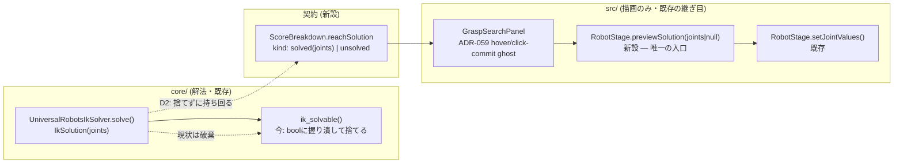

# 135. Reachability is drawn, not declared — the discarded IK joint solution rejoins the wire

- Status: Proposed
- Date: 2026-09-14
- Deciders: yuubae215 (via `/whiteboard` session), Claude (pairing)
- Retires: GREP:core/easy_extrude_core/engine/feasibility.py::解の有無を\sbool\sに写すだけ（`ik_solvable()` が `UniversalRobotsIkSolver.solve()` の代表解を保持せず bool 一枚に潰して捨てている、という現状のふるまいを表す docstring 自身。実装時にこの一文を消せない設計になっていたら D2 が未達）
- Supersedes / Superseded by: なし (ADR-127「UR の解析解 IK」・ADR-128「フロント配線」に連なる子 ADR。両者の Status・本文は変更しない)

## Context — Goal と力学 (§1.2 Goal)

**Goal(解ではなく性質):** 把持候補・据付姿勢が「実際にロボットの腕がその関節配置で
リーチしている」ことを、`ikSolvable: true/false` という一枚の bool ではなく、**その関節配置を
取った腕の見た目**として画面上で確認できる。到達不可の候補では関節解を捏造しない
(黙って rest pose のまま、または非表示)。

解の形で来た要件(「実測ダイアログを増やす」「core/ にリアルタイム IK を追加する」)を
一段持ち上げた結果、**新しい計算は要らない**ことが分かった — 欲しい性質を満たす材料は
ADR-127/128 で既に両端が揃っている:

- **core/ 側は既に代表解を計算している。** `UniversalRobotsIkSolver.solve()`
  (`core/easy_extrude_core/engine/ur_solver.py:151`) は UR の閉形式解析解から
  6 関節角の代表解 1 つを `IkSolution(joints=tuple(best))` として返す
  (ADR-127 D5 — 「段階0 が問うのは可解性なので 8 解を出さない」で代表解 1 つに
  既に決定済み)。ところが呼び出し側 `ik_solvable()`
  (`core/easy_extrude_core/engine/feasibility.py:140-142`) は
  「解の有無を bool に写すだけ」で、計算済みの `joints` をその場で捨てている。
  パイプライン (`pipeline.py:349`) も契約 (`contract/models.py:81` の
  `ScoreBreakdown.ik_solvable: bool`) も bool しか知らない。ADR-120 が名指しした
  「測らなかった値」と同じ形だが、こちらは**測ったのに捨てている**という一段違う欠陥。
- **フロント側には描画の継ぎ目が最初から空けてある。** `RobotStage.setJointValues(values)`
  (`src/view/RobotStage.js:71-76`) の doc コメントは「Values come from outside this class
  (e.g. **a future grasp-contract response**)」と明記しており、この機能のために意図的に
  空けられていた。今は `_applyRestPose()` (`RobotStage.js:60-63`) から
  `ROBOT_REST_POSE` という固定値を渡す 1 箇所でしか呼ばれていない。
- **UI 側は到達可否の bool 表示を既に持っている。** `GraspSearchPanel.jsx:1334` の
  `chip('IK', sc.ikSolvable)` と、ADR-059 の Stage-1 spatial ghost
  (hover-preview / click-commit コールバック) が候補選択の土台を既に持つ。

対象は**既存の把持探索フロー(対象オブジェクトの表面から生成された候補)に限る**。
対象オブジェクトなしで自由に置いた TCP 姿勢だけを単体チェックする経路は、現状の
`GraspController._graspTargets()` (`src/controller/GraspController.js:591`) が
`target: { surfaceSamples: ... }` を必須にしており存在しない — 新設すれば
request 側の新しいエントリポイント + BFF ルートという別の残しを開くことになるため、
**本 ADR のスコープから明示的に外す**(ユーザー確認済み、§1.2 「解ではなく性質」に
照らして最小の対象で Goal を満たせる方を採った)。

**層マップ上の位置(CLAUDE.md のスコープ境界表):** front (`src/`) は解かない
(境界は不動)。core/ が既に決定した事実 (`joints`) を、契約経由でそのまま運んで
**描画するだけ**(ADR-060「ワイヤは決定された事実のみ、演出はクライアントで導出」)。
関節角をロボット entity の永続ドメイン状態として持つことはしない — ADR-084/085 の
「関節/キネマティックチェーンをモデル化しない」という non-goal は不動のまま
(joints はビュー限定の一過性の表示状態であって、シーンに保存される実体の pose ではない)。



## Options considered

- **A(採用): 代表解をパイプライン出力まで持ち回り、契約に kind 判別 union で足し、
  RobotStage の既存の継ぎ目 (`setJointValues`) に新しい単一入口を1つ足して配線する。**
  — tradeoff: response 契約変更を伴うので `contractVersion` の版上げが要る
  (CI `contract-wall` が強制)。新規の解法は無く、既に計算済みの値を運ぶだけなので
  実装コストは小さい。
- **B: core/ 側に「代表解を返す」専用の新エンドポイント/新フィールドを別建てし、
  既存の `ik_solvable` 契約フィールドとは独立させる。**
  — tradeoff: 同じ候補について 2 回リクエストする形になり (1 回は候補一覧取得、
  もう 1 回は選んだ候補の解取得)、真実の源が「候補のスコア」と「候補の解」に
  分裂する (§1.1 違反)。1 候補 1 レスポンスに解を同梱する案 A の方が単純。却下。
- **C: 対象オブジェクトなしで自由に置いた TCP 姿勢の IK チェックも同時に作る
  (新しい軽量リクエスト種別 + BFF ルート)。**
  — tradeoff: `GraspController._graspTargets()` が候補生成に必須としている
  ターゲット幾何(surfaceSamples)を持たない新経路が要り、スコープが
  「握り潰されている値を運ぶ」から「新しい入口を作る」へ膨らむ。ユーザーが
  「把持候補のみでまず良い」と明示的に選択したため却下(過剰モデリング回避、核 §5)。
- **D: RobotStage にリアルタイム(毎フレーム)IK ソルバを WASM で持たせ、TCP を
  ドラッグしながら関節が追従するティーチング機能にする。**
  — tradeoff: `robotics-wasm` (C++ KDL+ruckig) には現状 IK バインドが無く、
  `ComputeBackend` の差し替え口 (ADR-053) も未配線のデッドコードで、実質新規
  サブシステムの立ち上げになる。ユーザーが最初の要望(リアルタイムティーチング)から
  明示的に後退し「リアルタイムでなくていい、到達可否が視覚的に分かればいい」と
  スコープを絞ったため却下。
- **E: 現状維持(bool チップのみ)。** — tradeoff: Goal 未達。計算済みの値が
  捨てられ続ける。

## Decision — Strategy (§1.2 Strategy)

**D1. 契約に `reachSolution` を kind 判別の閉じた union として追加する。**
`packages/grasp-contract/schema/grasp-search-response.schema.json` の
候補スコア項目 (`ScoreBreakdown` 相当) に

```jsonc
"reachSolution": {
  "oneOf": [
    { "kind": "solved",   "joints": [/* number × 6, ラジアン */] },
    { "kind": "unsolved" }
  ]
}
```

を足す(`additionalProperties:false` の閉じた union、ADR-060/118/119 と同じ統治)。
候補ごとに必ずどちらか一方を持ち、欄の省略は許さない(未評価と `unsolved` を
区別する必要が無い — `ik_solvable` は既に必ず評価される値であり、ADR-120 の
「未評価は鍵の不在で示す」パターンは今回は要らない)。**response 契約の変更なので
`contractVersion` を 5→6 に上げる**(schema と `contract-version.json` を同一 PR で、
ADR-082/084 §4)。

**D2. core/ のパイプラインが `IkSolution.joints` を捨てずに持ち回る。**
`feasibility.py` の `ik_solvable()` は bool 判定用としてそのまま残すか、
`pipeline.py:349` 呼び出し側が `solver.solve()` を直接呼んで `IkSolution` を保持し
bool 判定にも使う形にリファクタするかは実装時に決める(境界だけ本文で固定する
— ADR-133 D5 と同じやり方)。**FK 往復チェックをテストに含める** — ADR-127 実装時に
「肘の平面を x-z で解いていて真値と 0.05rad 近くずれたが、桁も符号も妥当なので
値を見ても気づけなかった。捕まえたのは FK 往復で、かつ FK 自身を DH から独立に
固定していたから」という教訓があり、今回運ぶ `joints` も同じ罠(自己整合な誤りは
往復検査を通る)を踏みうる。

**D3. RobotStage に「今どの関節値を描くか」を決める唯一の新規入口を足す。**
現状の書き手は `_applyRestPose()` 1 箇所のみ(常に `ROBOT_REST_POSE` を渡す)。
候補プレビューが増えると書き手が 2 つになるため、`previewSolution(joints | null)`
のような 1 メソッドへ一本化し、内部で「`null` → rest pose 復帰、値あり → その値」を
決める(原則 #4 — 最後の書き込み勝ちの再発防止)。既存の `setJointValues()` は
内部ヘルパーとして残す。この新規入口は `src/PosePolicyOwnership.test.js` が
監視する母集団(`SceneService.applyPreviewTranslation` からの呼び出し閉包、
`POSE_ENTRY = 'src/service/SceneService.js'`)の**対象外である**ことを明示する —
`RobotStage` はビュー層の一過性の演出(joint 値)を描くだけで、実体のシーン pose
(並進・回転、`SceneModel` に保存される状態)を書く経路ではないため。書き手は
当面 1 つ(D4 のみ)なので、census 型の母集団監視をこの入口向けに新設するのは
今回見送る(過剰モデリング回避 — 2 つ目の書き手ができたときに再検討する、
Consequences に明記)。

**D4. GraspSearchPanel の既存 ghost コールバックの隣に配線する。**
ADR-059 の hover-preview / click-commit コールバック (`GraspSearchPanel.jsx`) が
候補の `score.reachSolution` を見て、`kind:"solved"` なら `joints` を
`RobotStage.previewSolution()` へ渡し、`kind:"unsolved"` またはホバー解除時は
`null` を渡す。既存の bool チップ (`chip('IK', sc.ikSolvable)`) は残す
(骨格描画は追加の確認手段であって置き換えではない)。

**D5(明示的にやらないこと)。** 対象オブジェクトなしの自由 TCP 姿勢チェック
(却下案 C、新しい request 種別・BFF ルートが要る)。`robotics-wasm` への IK バインド・
`ComputeBackend` の実配線・毎フレームのリアルタイム追従(却下案 D)。関節角を
ロボット entity の永続ドメイン状態にすること(ADR-084/085 の non-goal は不動)。
`PosePolicyOwnership.test.js` の母集団を `RobotStage` の書き込みまで広げること
(書き手が 1 つのうちは見送り)。

## Consequences — Evidence と tradeoff (§1.2 Evidence)

**肯定的:**
- Goal 達成に新しい解法ロジックが要らない — ADR-127 の代表解計算と
  `RobotStage.setJointValues` という両端は既に揃っており、今回は「運ぶ」だけ。
  front/core の境界(src/ は解かない)を一度も越えない。
- `reachSolution` が閉じた kind union なので、次に代表姿勢以外の表現(例えば
  将来複数解を見せたくなった場合)を足すときも「union に 1 種足す」という
  意図的な版上げ行為になる(ADR-060 の統治の踏襲)。
- `RobotStage.previewSolution()` が唯一の入口になることで、将来 2 つ目の
  書き手が現れても「同じ入口を呼ぶ」以外の道が無くなる。

**受け入れるコスト / 否定的:**
- response 契約変更なので `contractVersion` の版上げ・BFF 型再生成・conformance
  テスト更新という一連の版上げ作業が要る(ADR-082/084 §4 が要求する定型コスト)。
- `RobotStage` に新しい書き込み入口が 1 つ増える。今回は census 型の母集団監視を
  見送る判断をしたので、2 つ目の書き手が将来できたときにこの ADR を読み返して
  `PosePolicyOwnership.test.js` 相当の統治を検討する必要がある(ADR-102 の教訓
  ―「母集団は手で並べない」―をこの入口にいつ適用するかの判断を先送りしている)。
- 対象オブジェクトなしの自由姿勢チェック(D5)は今回満たさない。ユーザーの
  当初の要望(リアルタイムティーチング)からは後退したスコープであることを
  明示しておく — 需要が戻れば却下案 C/D を再検討する別 ADR が要る。

**検証(証拠):** 論証木は `docs/gsn/adr-135-reachability-is-drawn-not-declared-the-discarded-ik-solution-rejoins-the-wire.gsn`
(goal ごとの支えの正本はそちら)。起票時点の証拠はすべて未来形であり、そう宣言する。
実装時に閉じる予定の検査:
- core/: `IkSolution.joints` がパイプライン出力まで生き残ることのユニットテスト
  (`core/tests/test_engine.py`)。**FK 往復チェックを含める**(D2 参照 — ADR-127 の
  「自己整合な誤りは往復検査を通る」を再発させないため)。
- 契約: `reachSolution` の往復テスト(`core/tests/test_contract.py` /
  `test_contract_conformance.py`)、`solved`/`unsolved` 両方のケース。
- フロント: `RobotStage.previewSolution()` の 3 ケース(`null` → rest pose /
  値あり → その値 / 値あり → `null` で rest pose に復帰)の新規テスト。
  `GraspSearchPanel` 側はホバー時に `previewSolution` が呼ばれること、
  選択解除時に `null` で呼ばれることの 2 方向。
- **この証拠が構造的に見逃す変化を宣言する**: 静的な単発ホバーの往復テストは、
  候補 A → B → 選択解除のように**素早く連続で切り替えたとき**に古い解が
  レンダリングに残る競合(ADR-098/101 と同型の「1 フレーム古い状態」)を見逃す。
  同じ要求を 2 回以上通す遷移シーケンス(A 選択 → B 選択 → 選択解除、を 1 つの
  テストにする)をこの検証に含めることを実装時の必須項目として明記する。

**波及(blast radius):**
`core/easy_extrude_core/engine/feasibility.py` / `pipeline.py` / `contract/models.py` /
`packages/grasp-contract/schema/grasp-search-response.schema.json` +
`contract-version.json` (5→6) / BFF `contract.response.d.ts` 再生成 /
`src/components/Grasp/GraspSearchPanel.jsx` / `src/view/RobotStage.js`。
触らないと明示するもの: `resolveGraspTargets` / 候補生成ロジック本体 /
`robot_base`・`tcp` CoordinateFrame の pose 機構(ADR-084/085 は不動) /
`PosePolicyOwnership.test.js` の母集団定義 / `robotics-wasm` レーン全体。

## Lens notes

- **型は宣言された属性の契約 (PHILOSOPHY #29)**: `reachSolution` は「ソルバが
  決定した事実」のみを運ぶ閉じた kind union で、演出(どちらの向きから見せるか、
  アニメーションで遷移させるか等)はクライアント側の `previewSolution` 呼び出しに
  留める。ADR-060 の統治をそのまま踏襲するので新しい統治パターンは増えない。
- **真実の源は一つ (§1.1)**: 候補の解は `UniversalRobotsIkSolver.solve()` が
  唯一の計算者であり続ける(却下案 B のように別エンドポイントへ分裂させない)。
  `RobotStage` の関節値も `previewSolution()` が唯一の入口になる。
- **層 + 契約**: front (描画) と core (解法) の境界は本 ADR で一度も越えない —
  「新しい解法をどちらに置くか」という判断そのものが今回は要らない、という
  珍しい形の境界確認(いつもは越境しそうになった箇所を塞ぐ ADR だが、今回は
  「越境しなくて済むことを確認した」ADR)。
- **状態機械は不要**: `reachSolution` は 2 値の閉 union、`RobotStage` が描く関節値も
  2 種(rest / preview)で、遷移に guard も禁止遷移も無い。核 §1.4 の閾値(3 状態
  以上、または不正遷移が事故になる)に届かないため、状態機械の設計は起こさない。
