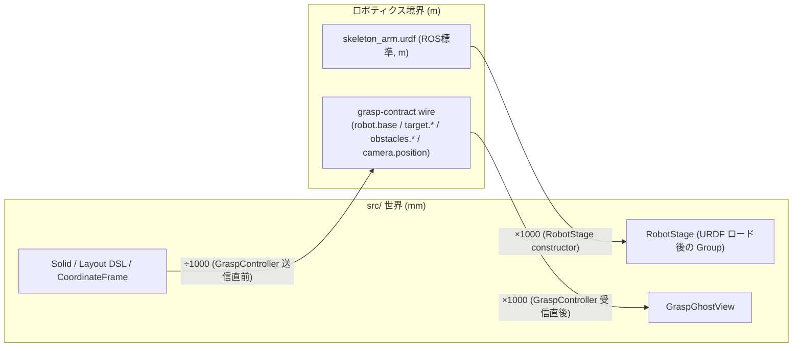

# 136. 世界単位はミリメートル — ロボット/URDF/grasp-contract はワイヤ境界でのみメートルに変換する

- Status: Accepted
- Date: 2026-09-18
- Deciders: yuubae215, Claude
- Retires: GREP:src/model/CuboidModel.js::Vector3\(-1,\s*-1,\s*-1\) · GREP:src/domain/robotFrames.js::x:\s*-2,\s*y:\s*2,\s*z:\s*0 · GREP:src/controller/GraspController.js::declaration\.base\s*=\s*\[p\.x
- Supersedes / Superseded by: なし(ADR-084/119/127/129 が築いた grasp-contract の座標系まわりの決定を覆さず、それらが暗黙のまま残していた単位の食い違いに答える)

## Context — Goal と力学

`src/` の Three.js world 座標に、**2 つの無関係な単位規約が無変換で同居していた**。

1. Solid / Layout DSL(`examples/`・`templates/`・`schema/layout-1.0.schema.json`・
   `LayoutCompiler.js`)は寸法・位置を **mm の生数値**としてそのまま world-unit に
   使う(600×500×800mm の作業台が `dimensions:{x:600,y:500,z:800}` になる)。
   `docs/CODE_CONTRACTS.md` の「Annotation Marker Screen-Space Scale」
   「Ground Grid Scales With Scene Radius」は、この "mm-scale scenes" を
   既に前提として書かれている。
2. ロボット骨格(`public/robot/skeleton_arm.urdf`、実物 UR5e の DH パラメータを
   ROS/URDF 標準どおり**メートル**で記述)と、`packages/grasp-contract` の
   grasp-search リクエスト(`plan.reachMin/reachMax`・`camera.position`・
   `gripper.maxOpening` の例値、`core/tests/data/grasp-req.json` の target 点
   `[1,0,0]` など)は一貫して**メートル**を前提にしている。`ROBOT_FRAME_DEFAULTS`
   の既定位置 `{x:-2,y:2,z:0}` もこの系列の数値。

この 2 系列は**同じ Three.js シーングラフの同じ world 座標**を共有しているのに、
どちらの境界にも変換が無い。結果:

- 表示: URDF 由来のロボット骨格(リーチ ≒0.85 world-unit)が、mm 系の
  ロボットペデスタル(300×300×120)の隣に置かれると 1000 分の1近いサイズで描かれる。
  Add で足す既定キューブ(`createInitialCorners()` の ±1、2mm 相当)も同じ理由で
  mm 系シーンの中で見えない点になる(ユーザー報告の起点)。
- 機能: `GraspController._resolveRobotDeclaration()` は `worldPoseOf()` の
  結果(mm 系の CoordinateFrame 世界位置)をそのまま `robot.base` としてワイヤへ
  乗せ、`surfaceSamplesFor`/`obstaclesExcluding`(Layout DSL 由来、mm)も無変換で
  `target.surfaceSamples`/`obstacles` に乗る。一方 `plan.reachMin/reachMax` は
  ユーザーがメートルで入力する。core/ 側は `robot.base`・`target` 点・`reachMin/Max`
  を**同じ単位として距離計算する**(`core/tests/data/grasp-req.json` が実測として
  そう仮定している)ので、mm 系の値がメートル前提の reach 判定に混ざった瞬間、
  distance 計算そのものが無意味になる。ADR-119 が「対象幾何が文書由来でシーン由来
  でない」非対称として名指しし、「どちらが所有するかは別 ADR」と保留していたのが
  この決定にあたる。
- 逆方向も同型: `GraspGhostView.showCandidate()` は応答の `cartesianFrame.position`
  (メートル、`GraspGhostMath.renderableEndEffectorFrame` がそのまま返す)を mm 系
  シーンの `_group.position` に無変換で書く。往復のどちらの向きにも境界が無い。

Goal: **世界座標系の 1 unit が指す物理量を、シーン中のどの実体についても一致させる**
(§1.1 真実の源は一つ)。ロボットの見た目のサイズだけでなく、grasp-search の距離判定
そのものが単位の食い違いで壊れている状態を直す。

## Options considered

- **A: world-unit = mm を単一の正とし、ロボティクス側(URDF ロード / grasp-contract
  ワイヤ)の境界でだけ mm⇄m を変換する。**
  tradeoff: URDF 自体はメートルのまま(ROS/URDF エコシステムとの互換性を保つ)なので
  「ネイティブ単位そのままの URDF ファイル」に対して「読み込み側で ×1000 する」という
  一見非対称な変換が 1 箇所生まれる。ただし `docs/CODE_CONTRACTS.md` に既に
  グリッド・アノテーションマーカーの類似パターン(表示側でスケール補正を持つ)が
  あり、この codebase の既存語彙に馴染む。
- **B: world-unit = m(SI)を単一の正とし、Solid / Layout DSL / 保存済みシーン
  JSON の取り込み境界(LayoutCompiler・SceneImporter・3D エディタでの直接入力欄)で
  mm→m を変換する。**
  tradeoff: `examples/`・`templates/`・`schema/`(すべて公開スキーマ扱い、
  CLAUDE.md のレイヤ表で「フロントの公開スキーマ」)の意味論を変えずに済ませるには
  変換点を LayoutCompiler の 1 関数に封じ込められればよいが、3D エディタでの
  直接編集(ハンドルドラッグ・寸法入力欄)や、当事者が既に保存している可能性のある
  scene-JSON(`docs/dogfooding/`)など、**変換点を列挙しきれない**境界が Solid 側に
  複数ある。1 箇所でも取りこぼすと同じ症状(1000 倍ズレ)が別の場所で再発する。
- **C: 現状維持。**
  tradeoff: grasp-search の距離判定(reach 判定・干渉判定)がロボットと mm 系ワーク
  を同じシーンに置いた瞬間に意味を失う、実測済みの機能バグを放置する。却下。

## Decision — Strategy

**Option A を採用する。** `src/` の Three.js world-unit は **mm** を単一の正とする
(Solid・Layout DSL・CoordinateFrame・既存の `examples/`/`templates/`/`schema/` は
無変更)。ロボティクスが関わる境界にだけ、変換を 1 箇所ずつ集約する:

新設する唯一の権威定数は `src/domain/worldUnits.js` の `MM_PER_METER = 1000` と、
その上に立つ `mmToM`/`mToMM`(スカラー・[x,y,z] 点の両方)。変換はちょうど 4 箇所:

1. **`RobotStage`(URDF → シーン)**: ロードした `robot`(URDF ルート)に
   `scale.setScalar(MM_PER_METER)` を適用。`_group`(CF 駆動の world 位置、mm)は
   無変更 — Three.js の行列合成が子の並進を自動でスケールするので、
   `worldPoseOf()` が返す tcp/base の世界位置は以後 mm で一貫する。
2. **`robotSkeleton.js`(`TCP_LOCAL_SEED`)**: URDF の順運動学(m)から導出される
   tcp のローカル既定オフセットを `mToMM` で変換してから CF へ渡す。
3. **`GraspController`(送信: mm → m)**: `_resolveRobotDeclaration()` の `base`、
   および `target.surfaceSamples[].point` / `obstacles[].center` / `.radius` を
   `mmToM` で変換。`baseOrientation`/`tcpOrientation`/`normal`(無次元)、
   `plan.*`/`camera.*`/`gripper.*`(ユーザーがメートルで直接入力)は無変換。
   `GraspDeclarationCatalog.visionFromViewportCamera()`(ビューポートカメラを
   capture する経路)も同じ境界なので同様に `mmToM`。
4. **`GraspController`(受信: m → mm)**: `renderableEndEffectorFrame()` が返す
   候補姿勢の `position` を `mToMM` で変換してから `showCandidate`/
   `nearestTargetIndex` へ渡す — 表示とヒット判定の両方が同じ 1 回の変換を使う。

ドメイン層(`domain/graspTargets.js` の `surfaceSamplesFor`/`obstaclesExcluding`、
`renderableEndEffectorFrame` 自体)は**純粋なまま mm/m どちらの単位も知らない** —
変換は「シーンとワイヤの境界を組み立てる」`GraspController`/`RobotStage`/
`GraspDeclarationCatalog` という、境界の役割を持つ場所にだけ置く(原則 #3)。

副次的に、mm を正とするなら「Add で足す既定サイズ」もそれに合わせて直す:
`CuboidModel.createInitialCorners()` の ±1(2mm 相当)を ±50(100mm 角、
小部品として妥当な既定サイズ)に、`ROBOT_FRAME_DEFAULTS`/`ROBOT_ADD_OFFSET`
の既定オフセットを ×1000 に変更する。

## Consequences — Evidence と tradeoff

### 得られるもの
- grasp-search の距離判定(reach envelope・target/obstacle との距離)が、
  ロボットと mm 系ワークを同じシーンに置いても物理的に正しい値で core/ に届く
  (ADR-119 が保留していた「対象幾何の非対称」の実害側が解消)。
- ロボット骨格の見た目のスケールが、シーン中の他の実体(作業台・ペデスタル等)と
  一致する。
- `examples/`・`templates/`・`schema/`・既存の scene-JSON(未知の量を含む)は
  無変更 — 変換点が枚挙可能な 4 箇所に閉じている(Option B の非有界な変換点列挙を
  回避)。

### 払うもの / 受け入れるコスト
- `RobotStage` に「URDF はメートルのまま、読み込み側で ×1000 する」という
  一見非対称な定数が 1 つ増える(コメントで意図を明示する)。
- 既存のテスト fixture(`GraspController.test.js` の `ROBOT_POSES`・
  `robotFrames.test.js` の既定位置)が「world-unit の意味」を暗黙にメートルとして
  書いていたので、mm へ書き換える(期待するワイヤ出力の値そのものは変わらない —
  変換後に同じ値へ収束するよう入力側を ×1000 するだけ)。

### 検証(証拠)
| 主張 | 問い所 |
|------|-------|
| `robot.base`/`target.surfaceSamples`/`obstacles` がメートルでワイヤに乗る | `src/controller/GraspController.test.js`(既存の `base:[-2,2,0]` 系アサーションを mm 系 fixture 入力に更新した上で維持 / `surfaceSamples[0].point[2]` と `obstacles[0].center` を m 単位の期待値に更新) |
| 応答側の候補位置が mm 系シーンへ正しく戻る | `src/controller/GraspController.test.js`(`EE_POSE` の `frame.position` が `showCandidate` に渡る時点で ×1000 されていることを assert) |
| ロボット既定シードが mm 系である | `src/domain/robotFrames.test.js`(`robotBaseSeedPose(0)` の期待値を mm へ更新) |
| ビューポートカメラ capture もメートルに変換される | `src/context/GraspDeclarationCatalog.test.js`(`visionFromViewportCamera` の入力を mm、期待値を m に更新 — 丸め粒度 `round4` は変換後も 0.1mm 相当を保つ) |
| ロボット骨格のワールド変換が mm で一貫する | `RobotStage` 経由で `worldPoseOf` されたロボット関連 CF の位置が Solid と同じ order-of-magnitude であること(手動確認 — 専用ユニットテストは THREE 依存のため `test:context` レーンの対象外。機械可読な満期 `docs/gsn/adr-136-world-unit-is-millimeters.gsn` の `PATH:e2e/robot-scale-parity.spec.js`) |

実装後の実測: `pnpm test` 1157 本中 1147 green(fail 10 はいずれも本 ADR 実装前から存在する
環境依存の失敗 — `git stash` で同一 10 本が再現し、本変更による新規失敗は 0)。

> **訂正 (ADR-137, 2026-09-19):** この行は実態と合っていない。依存をインストールした環境で
> 同じコミットを測り直すと **1293 本中 1293 green・fail 0** である。当時の 10 件は import 段階の
> 失敗で、サブテストが登録されないぶん総数も 1157 に減っていたと見られる —「本 ADR 実装前から
> 存在する既存の失敗」として記録された事実は実在しない。書き換えではなく追記で残す(原則 #19:
> 判断の履歴を消さない)。
`pnpm test:adr` 136 本すべて OK。`pnpm test:gsn` / `pnpm test:gsn-debt` green
(`DEBT_BASELINE` 34→35、理由は `scripts/check-gsn-debt.mjs` の同日付コメントに記録)。

論証木: `docs/gsn/adr-136-world-unit-is-millimeters.gsn`

## Lens notes

グラフ / 層 + 契約レンズ(§1.3): この決定が動かすノードは正確に 4 つ
(`RobotStage`・`robotSkeleton.js`・`GraspController`・`GraspDeclarationCatalog`)
に閉じており、

> **訂正 (ADR-137, 2026-09-19):** この枚挙は**母集団を取り違えている**。4 つは*変換点*としては
> 正しいが、単位の決定が動かすのは変換点ではなく **world-unit で書かれたあらゆる定数の意味**で
> ある。変換を必要としない 3 つ(`AppController._restStarterCube` の重心 `z=0.5`、
> `SceneView` の `camera.position.set(6,-4,3)` と `far=100`)は定義上この枚挙に現れず、
> 結果として**起動直後の画面に何も描かれなくなった** — カメラが 100mm キューブの内側に入り、
> ロボットは far 平面の外に出た。原則 #31: 母集団を「在る変換」で定義した瞬間、消費者は外へ落ちる。
> 正しい母集団は「world-unit スケールの事実を**消費している**箇所」で、これは変換点を真に含む。
> 詳細と修正は ADR-137。

Solid・Layout DSL・`packages/grasp-contract` のスキーマ構造そのもの
(フィールド追加・削除)には触れない — 単位という「フィールドの意味」だけを固定する
決定であり、`contractVersion` は上げない(ADR-083/084 の先例: request 側の意味論的
明確化は構造変更ではない)。
