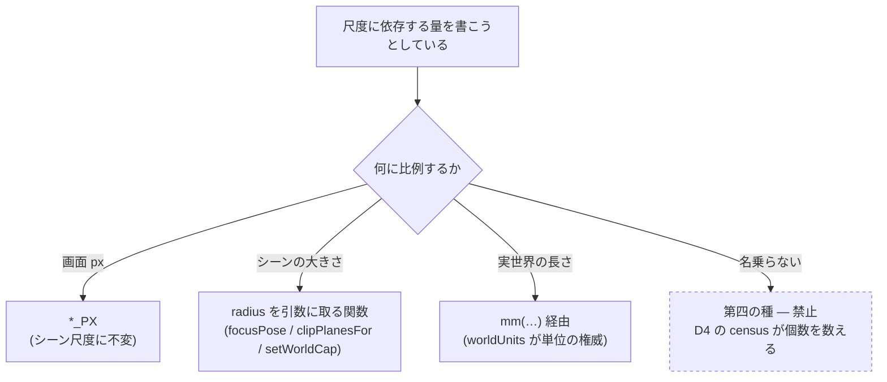

# 137. 尺度に依存する量は自分の単位を名乗る — world-unit を持つ定数の個数を数える

- Status: Proposed
- Date: 2026-09-19
- Deciders: yuubae215, Claude
- Retires: GREP:src/view/SceneView.js::0\.1,\s*100 · GREP:src/view/SceneView.js::position\.set\(6,\s*-4,\s*3\) · GREP:src/controller/handler/FaceExtrudeHandler.js::SNAP_THRESHOLD\s*=\s*0\.15 · GREP:src/domain/placement.js::SUPPORT_TOLERANCE\s*=\s*0\.001
- Supersedes / Superseded by: なし (ADR-136 を**覆さない** — その 4 箇所の変換は正しい。
  ADR-136 が数えた母集団が「ロボティクス境界の個数」であって「world-unit を持つ定数の
  個数」ではなかった、という一段上の欠落に答える)

## Context — Goal と力学

出所は ADR-136 実装後の `/whiteboard` レビュー。ADR-136 は「変換点はちょうど 4 箇所」と
宣言し、**その 4 箇所は正しい**。にもかかわらず、実装後の**起動直後の既定シーンが壊れて
いた** — Outliner は `Cube selected` と出ているのに画面には何も無い。実測すると原因は
変換漏れではなく、カメラが starter cube の**内側**に入っていたことだった。

### 力学 1 — world-unit は ADR-136 以前から一意ではなかった

ADR-136 の Context は「mm は既に Solid / Layout DSL の規約であり、そちらは無変更」と
書いた。これは **Layout DSL 経由で入ってくる内容**についてだけ真で、**エディタ native の
経路**(boot / Add / snap / 接地判定 / framing)は一貫して**メートル**を前提にしていた。
同じ repo の中に、1 unit = 1 m を明記した権威が複数在る:

| 番地 | 書かれている前提 |
|------|-----------------|
| `src/view/SceneView.js:111` | "The 20-unit grid is **sized for meter-scale scenes**" |
| `src/view/SceneView.js:41` | `PerspectiveCamera(60, aspect, 0.1, 100)` — far = 100 |
| `src/view/SceneView.js:43` | `camera.position.set(6, -4, 3)` |
| `src/domain/placement.js:62` | `SUPPORT_TOLERANCE = 0.001` ←「接地判定の許容 (**1 mm**)」 |
| `src/service/SceneService.js:2671` | `tolerance = 0.001` ←「**1 mm** — matches the stack-snap rest tolerance」 |
| `src/controller/handler/FaceExtrudeHandler.js:21` | `SNAP_THRESHOLD = 0.15` ←「Snap distance threshold in **world units**」 |
| `src/controller/AppController.js:1141` | 「Halve the ±1 localCorners → a **1 m cube**」 |

`0.001` を「1 mm」と呼ぶコメントは、**1 world-unit = 1 m** と言っている。ADR-136 は
この対のうち **Add 側 (`createInitialCorners` ±1 → ±50・`ROBOT_FRAME_DEFAULTS` ×1000)**
だけを mm へ動かし、**対になる view / 判定側を動かさなかった**。

### 力学 2 — なぜ見えなかったか (原則 #31)

`mode` / `status` は値を持つ欄なので状態として認識されるが、**「この数値の単位」には欄が
無い**。裸の数値リテラルは型でも命名でも自分の単位を名乗らない。ADR-136 は変換点を 4 つ
正確に列挙したが、その母集団は「**ロボティクスがシーン境界を跨ぐ点**」という*別の種*から
導かれている。world-unit を単位に持つ定数は、その種に属さないので、*在るもの* (変換点) を
辿る数え方では **定義上出てこない**。

数えるべきは在る変換点ではなく、**単位を名乗っていない量の個数**である。

### 力学 3 — 証拠のレーンが構造的に見逃した

ADR-136 の実測は「`pnpm test` 1157 本中 1147 green、fail 10 はいずれも環境依存」。
レビューで `node_modules` を入れて測り直すと **1293 / 1293 green** になった — 落ちていた
10 本は `three` / `ajv` / `typescript` を要求するファイル、すなわち **まさに ADR-136 が
触った view 層**であり、差分の 136 本は「落ちた」のではなく **母集団から静かに外れて
いた**。緑は「その形の証拠が見える範囲で通った」以上を意味しない。

### 力学 4 — 正しい導出は既に在り、boot だけが呼んでいない

`src/view/CameraMath.js` の `focusPose` / `clipPlanesFor` (ADR-068) は near を
`radius · 0.001` で**シーンに比例**させると明記し、その doc は「固定 near は
**mm-authored layouts** で Z-fight を起こす」ことまで書いている。**同じ教訓は一度
学習済み**なのに、`SceneView` コンストラクタはその導出を通らない。だから正解は
`0.1 / 100 / (6,-4,3)` を mm へ retune することではなく、**boot を既存の 1 つの導出に
通して、その定数を種類ごと消す**ことである (核 §1.1)。

### 実測 (式)

```
カメラ距離   d  = ‖(6, −4, 3)‖ = √61       ≈ 7.81 world-unit
starter cube 半幅 h = 50 × 0.5              = 25   world-unit   (_restStarterCube)
                d < h   ⟹ カメラは cube の内側           ← 前後スクリーンショットの差
far = 100      ⟹ 可視域は 100 world-unit で打ち切り
ロボット既定位置 ‖(−2000, 2000, 0)‖ ≈ 2828   = far の 28 倍     ← 追加しても写らない

正しい関係 (focusPose):  dist = (r / sin(fov/2)) × 1.3
                        r = 25, fov = 60°  ⟹ dist ≈ 65 ≫ h
```

**Goal (解ではなく性質): 尺度に依存する量が、自分の単位と根拠を自分で名乗る。そして
「名乗っていない量の個数」が毎 PR 数えられる。**

## Options considered

- **A: 見つけた定数を mm へ retune する (実装だけ、ADR を起こさない)。**
  tradeoff: 今回の 7 箇所は直る。しかし母集団は依然として**人の記憶**のままで、次に
  world-unit を持つ定数を書いた人が同じ穴を開ける。**ADR-136 がまさにこれをやった** —
  4 箇所を正確に直し、数え方は変えなかった。却下。
- **B: world-unit を型で運ぶ (branded type / newtype)。**
  tradeoff: 原則 #21 (座標空間を静的に区別する) と同じ手で、最も強い。しかし JS に
  newtype が無く、`THREE.Vector3` 全域に及ぶので blast radius が view 層全体。
  今日の問題 (数えられないこと) に対して過大 (核 §5 過剰モデリング禁止)。却下するが、
  **D4 の限界が耐えられなくなった日の次の一手**として名指ししておく。
- **C (採用): 尺度依存量の種を 3 つに閉じ、第四の種 (裸の定数) の個数を数える。**
  tradeoff: 種の判定は sink (消費点) の列挙に依るので、sink 自体は導出されない
  (§Consequences で限界として宣言する)。
- **D: 現状維持。**
  tradeoff: 起動直後の既定シーンが壊れたまま出荷される。却下。

## Decision — Strategy

### D1 — 尺度依存量は三種のいずれかとして宣言する。第四の種は無い

| 種 | 何に比例するか | 書き方 | 既存の先例 |
|----|---------------|--------|-----------|
| **画面空間** | 画面 px (シーン尺度に不変) | `*_PX` | `SnapSystem.SNAP_PX = 25` / `GrabOperationHandler.SNAP_PX = 30` |
| **シーン由来** | シーンの bounding radius | radius を引数に取る関数 | `_updateGridScale(radius)` / `focusPose(center, radius, …)` / `clipPlanesFor(radius, …)` / `setWorldCap(radius * 0.5)` |
| **宣言された物理長** | 実世界の長さ | `worldUnits` の `mm(…)` 経由 | (D2 で新設) |



原則 #27 (画面 px 目標 + world 上限の**対**) はこの表の上に立つ: 対の片側だけを書くのが
鏡像の同一バグだという規律は変わらず、ここで足すのは「**どちらでもない第四の種**を
書かせない」という一段下の規律である。

### D2 — `mm(n)` を足す。単位を呼び出し側の構文に乗せる

`src/domain/worldUnits.js` に `mm(n)` を足し、絶対物理長はこれを通す。単位が呼び出し側の
**構文**に現れるので、次に書く人が単位を選ばずに済まない。

ADR-136 の `MM_PER_METER` / `mmToM` / `mToMM` / `mmPointToM` / `mPointToMM` は
**ワイヤ変換の権威として不変**。`mm()` は変換ではなく「この数値は mm である」という
**宣言**であり、役割が違う (同じモジュールに置くのは単位の権威が一つだから — §1.1)。

### D3 — boot も同じ 1 つの導出を通す (核 §1.1)

`SceneView` コンストラクタの `0.1 / 100`・`(6, -4, 3)`・`GridHelper(20, 20)` が持つ
暗黙の尺度を消し、boot は既定シーンの bounding sphere で `fitCameraToSphere` を通す
(`_updateGridScale` も同じ呼びで効く)。`BootReveal` は「UNTOUCHED な既定 pose へ着地する」
契約なので、**着地先が定数ではなく導出になる**だけで flight 自体は不変。

定数を retune するのではなく、**定数の種類ごと消す**のが要点である。retune は今日の
シーン尺度に対してだけ正しく、明日 m 系のアセットを読んだ日に同じ欠陥へ戻る。

### D4 — 数えるのは「三種のどれでもない量の個数」。母集団は sink の構文から導出する

*在る定数*を辿ると、定義上「宣言されていない定数」は出てこない (原則 #31)。だから
辿るのは定数ではなく **消費点 (sink)** のほうで、そこに**リテラル数値が直接届いている
箇所**を数える:

- `camera.near` / `camera.far` への代入、`camera.position.set(…)`
- `*.scale.setScalar(…)` / `new THREE.GridHelper(…)`
- `fitCameraToSphere(…)` の radius 実引数
- world 座標 (`.z` / `distanceTo` / corner) と比較される閾値

ratchet のベースラインを定数に焼き、**超えても下回っても fail** させる (ADR-100 の手 —
「宣言外は 0 であるべきだが今は N 箇所ある」を隠さず定数にする)。置き場所は
`src/WorldUnitCensus.test.js`、`src/census/sources.js` の登録簿へ登録する (ADR-102)。

### D5 — 問い所を散文に置かない (核 §1.2 Q3)

ADR-136 は `docs/CODE_CONTRACTS.md` に 1 行足した。**その行が在る状態でこの欠陥が
commit された** — 散文は書く瞬間に問われない。この ADR の成果物は D4 の検査であり、
文書の行ではない。

加えて **起動直後の既定シーンが実際に画面へ写っていること**を問う e2e を 1 本
(`e2e/boot-framing.spec.js`)。ADR-136 の GSN が満期に置いた
`e2e/robot-scale-parity.spec.js` と同じ穴 — 見た目は `node --test` レーンが構造的に
見えない — を、今度は boot 側で塞ぐ。

### 状態・基数

この決定は実体の状態も基数も増やさないので、`docs/STATE_LEDGER.md` に新しい行は起きない。
**これは宣言であって既定ではない** (原則 #31 — 正当な 0 は推論させず宣言する): 数える
対象は実体ではなく**定数**であり、その累積器は台帳ではなく D4 の census である。

## Consequences — Evidence と tradeoff

### 得られるもの
- 起動直後の既定シーンが、シーン尺度に関わらず framing される (D3)。
- 次に world-unit を持つ量を書いた人が、書く瞬間に単位を問われる (D1/D2/D4)。
- ADR-136 の 4 箇所の変換は**そのまま正しく残る** — この ADR はその上位の数え方だけを直す。

### 払うもの / 受け入れるコスト
- **限界の宣言 (推論させない):** D4 の母集団は sink の**手書き列挙**であり、sink 自体は
  導出されない。新しい view が独自に `near` を書けば、その sink がこの表に登録されるまで
  census は見ない — ADR-102 が名指しした `place-list` の形が**一段上に残る**。今日それを
  導出へ広げないのは、sink を導出するには「world 座標とは何か」を型で持つ必要があり、
  それが却下した **Option B** そのものだから (核 §5)。**この限界が耐えられなくなった日が、
  Option B へ差し替えるトリガである。**
- `mm()` を通す分だけ、絶対長の記述がわずかに冗長になる。
- boot 経路が導出に変わるので、`BootReveal` の着地先が定数でなくなる (契約は不変だが、
  テストは「定数と一致」ではなく「導出と一致」を問う形へ変える必要がある)。

### 検証(証拠)

| 主張 | 問い所 |
|------|-------|
| 三種のどれでもない量が増えない | `src/WorldUnitCensus.test.js` (D4 の ratchet — ベースライン定数を上下どちらへ外れても fail) |
| 起動直後の既定シーンが画面に写る | `e2e/boot-framing.spec.js` (D5 — 既定 Solid の投影面積が viewport の妥当な割合に収まる) |
| boot の framing が既存の 1 つの導出を通る | `src/view/CameraMath.test.js` + `SceneView` の boot 経路テスト (D3) |
| ADR-136 の 4 変換点が壊れない | 既存 `src/controller/GraspController.test.js` / `src/context/GraspDeclarationCatalog.test.js` が無改訂で green |

**本 ADR 起票時点で上記はすべて未来形である** (Status = Proposed)。実装は別スコープ。
goal ごとの支えの正本は `docs/gsn/adr-137-a-world-unit-constant-has-no-field-of-its-own.gsn`。

レビュー時に取得済みの実測 (この ADR の Context を支える証拠):
- `pnpm test` = 1293 / 1293 green (依存導入後)。ADR-136 実測時の「1157 中 1147」は
  `node_modules` 不在下の値で、差分 136 本は view 層。
- `pnpm typecheck` / `test:adr` (136 本) / `test:gsn-debt` / `test:deferrals` すべて green
  — **いずれもこの欠陥を構造的に見ない**ことが、D5 が必要な理由の実測である。
- boot 前後のスクリーンショット (`c1c9a3e` vs `28e6d6c`、同一操作列): 前は starter cube が
  接地して framing され、後は画面に何も写らない。

### 波及(blast radius)

触るノード: `src/domain/worldUnits.js` (D2) · `src/view/SceneView.js` (D3) ·
`src/controller/AppController.js` の boot 経路 (D3) ·
`src/controller/handler/FaceExtrudeHandler.js` · `src/domain/placement.js` ·
`src/service/SceneService.js` (D1 の三種へ寄せる) · 新設 `src/WorldUnitCensus.test.js` ·
`src/census/sources.js` · 新設 `e2e/boot-framing.spec.js`。

**触らないと宣言するもの:** `packages/grasp-contract` (契約は不変 — 単位の話はワイヤの
構造を変えない) · `core/` · ADR-136 の 4 変換点の**変換そのもの** · `examples/` /
`templates/` / `schema/` (公開スキーマ、mm のまま)。

## Lens notes

**グラフ / 層レンズ (§1.3):** ADR-136 は *robotics ⇄ scene* という**層の境界**を正しく
名指しして 4 辺を数えた。この ADR が名指しするのは層の境界ではなく、**同じ層の内側に
散らばった属性** (量の単位) であり、辺ではなくノードの性質なので、辺を数えるレンズでは
原理的に見えない。同じ図の上で「何を数えているか」が違う — ADR-136 が間違っていたのでは
なく、**問いが一段上に在った**。

**原則 #31 の再演としての位置:** 「ある種の道具を作る側が、その原則を踏む」形は
ADR-115 (宣言はあるが読む機械が無い) で一度記録されている。ここでは ADR-136 が
**変換点を正確に数えながら、数えるべき母集団を取り違えた** — 数え方そのものが
*在るもの*を辿っていた。次に同じ形を踏むとすれば D4 の sink 表であり、その限界は
上に宣言した。
