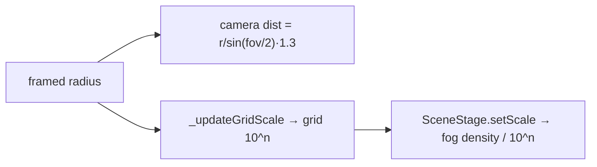

# 137. 起動画面もフレーミングの入口 — 単位の決定は「変換する箇所」ではなく「world-unit を消費する箇所」を数える

- Status: Accepted
- Date: 2026-09-19
- Deciders: yuubae215, Claude
- Retires: GREP:src/controller/AppController.js::multiplyScalar\(0\.5\) · GREP:src/view/SceneView.js::position\.set\(6,\s*-4,\s*3\) · GREP:src/view/GraspGhostView.js::GLYPH_MIN_WORLD\s*=\s*0\.05
- Supersedes / Superseded by: なし(ADR-136 を覆さない — その決定を**完成させる**。ADR-136 の Lens notes が「動かすノードは正確に 4 つ」と書いた枚挙の**母集団**を訂正する)

## Context — Goal と力学(§1.2 Goal)

ADR-136 は world-unit を mm と決め、ロボティクスがシーンへ跨ぐ 5 箇所すべてに変換を置いた。
その変換は正しい。実測でも、セルテンプレを読み込んだ状態で Add ▸ Robot すると骨格は
mm 系ペデスタルと同じ縮尺で描かれる(=ADR-136 の Goal は達成されている)。

**にもかかわらず、起動直後の画面には何も描かれなくなっていた。**

```
起動直後 (ADR-136 実装後、本 ADR 以前):
  Outliner      : "Cube" · selected        ← シーンは実体を 1 個持っている
  ビューポート   : 空                       ← 画面は 0 個を提示している
  ズームアウト  : 点になるだけで復帰不能      ← grid も再スケールされない
```

原因は 3 つの数字で、どれも **world-unit スケールを持つのにメートル時代のまま**だった:

| 箇所 | 値 | ADR-136 後の意味 |
|------|-----|-----------------|
| `AppController._restStarterCube()` | 重心 `z = 0.5`、`localCorners × 0.5` | 100mm キューブを 50mm に縮め、底面を **z = −24.5mm**(地面下)へ沈める |
| `SceneView` コンストラクタ | `camera.position.set(6, -4, 3)` | 原点から 7.81mm — **半径 25mm のキューブの内側** |
| 同上 | `far = 100` | ロボットは既定で 2828mm 先 = **far 平面の外** |

そして **`GLYPH_MIN_WORLD = 0.05`**(`GraspGhostView`)は 0.05mm の下限になり、
永久に効かない床として残った。

### 力学 1 — 枚挙の母集団が「変換する箇所」だった

ADR-136 は変換点を 4 箇所と枚挙し、その枚挙自体は正しい。しかし単位の決定が動かすのは
変換点だけではない — **world-unit で書かれたあらゆる定数の意味**が動く。上の 3 つは
どれも変換を必要としないので「変換点の枚挙」には最初から現れない。

これは原則 #31 の形そのものである: 数えるべきだったのは*在る変換*ではなく、
***world-unit スケールの事実を消費している箇所***。母集団を「変換」で定義した瞬間、
消費者は定義上その外に落ちる。

`_restStarterCube` は同じ形をもう一段細かく示している — 「既定キューブの大きさ」という
**1 つの事実に書き手が 3 人**いた(`createInitialCorners` / `SceneService` の stagger /
`_restStarterCube`)。ADR-136 は 2 人に届き 3 人目に届かなかった。**事実に権威が無ければ、
一斉に直すことはできない**(§1.1)。

### 力学 2 — 起動は「フレーミングの入口」なのに、どこも通っていなかった

`docs/CODE_CONTRACTS.md` には既にこの規則が在った:

> Ground Grid Scales With Scene Radius — … Any new "frame the scene" entry point must
> route through `fitCameraToSphere`, not set camera position directly

**規則は在ったが、起動経路はこの規則より古い。** 「新しい入口は」と書かれた規則は
既存の入口を一度も問わない。テンプレ読み込み・文書採用・STEP インポートは全部
`fitCameraToSphere` を通っており、通っていない入口は**起動ひとつ**だった —
そしてそれがユーザーが最初に見る画面である。

### 力学 3 — 見た目の主張を、見た目を見ないレーンが承認していた

ADR-136 の検証表は 5 行のうち 4 行を `node --test` で埋め、5 行目 —
**「ロボット骨格のワールド変換が mm で一貫する」** だけを

> (手動確認 — 専用ユニットテストは THREE 依存のため `test:context` レーンの対象外)

と書き、満期 `PATH:e2e/robot-scale-parity.spec.js` 付きで GSN の
`support-exploring` に降ろした(`DEBT_BASELINE` 34→35)。

**その手動確認は実行されなかった。** `pnpm test` は 1293/1293 green、`typecheck` も
`test:adr` も `test:gsn` も green のまま、起動画面が真っ黒になった。
**画面を見ないレーンは、画面について緑を出す。**

なお ADR-136 の Consequences は実測を「1157 本中 1147 green(fail 10 は本 ADR 実装前から
存在する環境依存の失敗)」と記録しているが、同じコミットを依存インストール済みの環境で
測り直すと **1293 本中 1293 green・fail 0** である。当時の 10 件は import 段階の失敗で、
サブテストが登録されないぶん総数も減っていたと見られる —「既存の失敗」として記録された
事実は実在しない(本 ADR で訂正済み、原則 #19)。

## Options considered

- **A: 3 つの定数を mm へ書き換える。**
  tradeoff: 最小の差分で症状は消える。しかし `SceneView` のカメラ定数は「世界の大きさ」の
  **第三の源**のままで、次に単位・既定サイズが動いた日にまた取り残される。ADR-136 が
  踏んだ穴を、同じ形で 1 回浅くするだけ。
- **B(採用): 起動を他の入口と同じ「フレーミングの入口」にし、消費者から重複した
  事実を取り上げる。**
  カメラ姿勢をハードコードされた定数から**シーンから導出される値**へ降ろし、
  既定サイズの事実は `DEFAULT_HALF_EXTENT` 1 箇所に集約する。加えて、見た目の主張を
  焼く e2e レーン(ADR-136 が満期として名指しした当のファイル)を実際に起こす。
  tradeoff: 起動時に 1 回フレーミングが走るぶん、初期カメラ姿勢は「作者が選んだ絵」から
  「計算された絵」に変わる。既存の開幕ショットを保つには画角の根拠を定数化する必要がある
  (→ `BOOT_VIEW_RADIUS`、下記 D2)。
- **C: 現状維持 + 既知の不具合として記録。**
  tradeoff: 起動直後に何も見えないのは、このアプリを開いた人が**最初に**遭遇する状態で、
  回避操作も無い。却下。

## Decision — Strategy(§1.2 Strategy)

**Option B を採用する。** 4 つの決定に分ける。

### D1 — 既定サイズの事実に権威を与え、消費者から複製を取り上げる

`CuboidModel.DEFAULT_HALF_EXTENT` を **export** し、これを「既定 Solid の大きさ」の
唯一の源とする(§1.1)。`_restStarterCube()` は**寸法を触ることをやめ、置くだけ**にする:

```js
// before: 大きさも位置も書く(= 第二の書き手)
const local = solid.localCorners.map(c => c.clone().multiplyScalar(0.5))
solid.setPose(new THREE.Vector3(0, 0, 0.5), solid.orientation, local)

// after: 位置だけ書く。「接地」は半径から導出される
solid.setPose(new THREE.Vector3(0, 0, DEFAULT_HALF_EXTENT), solid.orientation, solid.localCorners)
```

副作用として起動キューブは 50mm → 100mm(Add の既定と同寸)になる。ADR-089 follow-up の
「2m は大きすぎる」という判断は**絶対サイズについての判断**で、100mm は既にその条件を
満たしている — 起動キューブだけ別サイズにする理由は ADR-136 以後もう無い。

### D2 — 起動を `fitCameraToSphere` の入口にする(`_frameScene`)

「シーンをフレーミングする」入口を `_frameScene(minRadius)` 1 つに集約し、起動時
(`_restStarterCube()` の直後)に通す。`_focusSphere` と境界計算を共有する
`_boundingSphereOf(ids)` を切り出し、**選択に狭めるかどうか**だけを呼び出し側の違いにする。

開幕ショットの画角は保つ。ただし保ち方は「カメラを引く」ではなく
**「フレーミングする球を大きくする」**(`BOOT_VIEW_RADIUS = 300mm`):



カメラだけ引くと grid と fog は近い視点用のまま残り、正しく構図された開幕ショットが
霧で半分沈む(実装中に実測した)。**「視界の大きさ」を表す数を 1 つにすれば、カメラ・
grid・fog は自動的に同じ話をする**(§1.1)。300mm は恣意的な値ではなく、従来の
開幕ショット(半径 0.866 の球を 7.81 離れて見る ≒ 画面高の 11%)を
`dist = r/sin(fov/2)·1.3` で逆算した値である。

`SceneView.focusPose` / `fitCameraToSphere` の引数は**増やさない** — margin を通す案は
実装中に採ったが、grid と fog がその margin を知らないため上記の霧問題を生み、破棄した。

### D3 — Add ▸ Robot も同じ入口を通す

ロボットは既定で原点から 2828mm に生える。100mm の部品を映している視界はそこへ届かず、
その視界の far 平面は 100mm しかない。`_addRobot()` の末尾で `_frameScene()` を通し、
**追加したものが画面に在る**ことを保証する(原則 #11)。STEP インポート
(`geometryApplied` → `fitCameraToSphere`)と同じ扱いで、新規の方針ではない。

### D4 — 見た目の主張を焼くレーンを起こす(`e2e/robot-scale-parity.spec.js`)

ADR-136 が満期として名指ししたファイルを実装する。読み取り口は
`window.__easyExtrude.worldScale()`(`cameraState`/`viewState`/`touchGestures` と同じ
read-only スナップショットの系譜)。**値ではなく個数を返す**のが要点である:

| 返すもの | なぜ値では足りないか |
|---|---|
| `solidsOutsideView` | 「シーンに在るが画面に無い」は**欄を持たない**。在るものを辿る検査は定義上素通りする(原則 #31 / ADR-090・096 と同じ形) |
| `minSolidZ` | 「接地している」は誰も印字しない数についての主張 |
| `skeletonHeights[]` | URDF のスケールは THREE が行列を合成して初めて観測可能 — `node --test` からは原理的に見えない |

母集団は**種別の列挙**(solids / robot skeletons)から作り、画面に写っているものを
辿らない。`RobotStage.worldSpan()` / `RobotStageSet.worldSpans()` を read-only 計測として
追加(URDF 未解決は key を省かず `null` — 欠落と未ロードは別の事実)。

## Consequences — Evidence と tradeoff(§1.2 Evidence)

### 得られるもの
- 起動直後にキューブが地面に接して見える。Add ▸ Robot したロボットが画面に在る。
- 「世界の大きさ」の源が 3 つ(既定キューブ・カメラ定数・単位)から 1 つに減り、
  次の単位/既定サイズ変更が取り残す先が無くなる。
- 見た目についての主張が、見た目を見るレーンで問われるようになった。
- ADR-136 の GSN 借金が**満期到来で解消**し `DEBT_BASELINE` 35 → 34。
  **ADR-126 の満期機構が実際に発火して借金を減らした最初の例**(印字ではなく機械であることの実測)。

### 払うもの / 受け入れるコスト
- 起動カメラ姿勢が「作者が置いた絵」から「計算された絵」になる。開幕ショットの画角は
  `BOOT_VIEW_RADIUS` に根拠つきで保存したが、**画角を変えたい人が編集する場所が移った**。
- Add ▸ Robot がカメラを動かす。手で構図を作った直後にロボットを足すと視点が変わる
  — 「追加したものが見えない」より小さい害として受け入れる(#11)。
- e2e レーンは `gate` と別ジョブで、CI での不安定さは依然この suite が引き受ける
  (ADR-064 Phase 4 の判断は変えない)。

### 検証(証拠)

| 主張 | 問い所 | 実測 |
|------|-------|------|
| 起動直後、キューブは接地し視界内にある | `e2e/robot-scale-parity.spec.js`(`minSolidZ` / `solidsOutsideView` / `distToTarget`) | green。**修正前のコードに同 spec を当てると `minSolidZ` が `24.5` を返して fail する**(計測だけを移植した worktree で確認 — 落ちない検査は何も守らない) |
| ロボット骨格は mm 系で描かれ、追加後に画面内にある | 同 spec(`skeletonHeights[0]` / `camera.far`) | green(骨格高さ実測 **574mm**、far **13344mm**)。修正前は far が `100` で fail |
| 既存挙動を壊していない | `pnpm test` / `pnpm typecheck` / `pnpm test:e2e` | 1293/1293 green・typecheck green・e2e **58 passed / 10 skipped**(skip は stub レーン専用) |
| 契約・ADR・登録簿・論証木 | `test:contract` 30 / `test:adr` / `test:deferrals` / `test:gsn` / `test:gsn-debt` | すべて green(debt 34/34) |
| 開幕ショットが従来と同じ画角である | 手動(スクリーンショット比較、main 対比) | カメラ距離 **780mm**(逆算値 780mm と一致) |

**この証拠が構造的に見逃すもの(宣言する):** e2e はピクセルを比較しない。
「画面に在る」は frustum 内在で判定しているので、**他の物体に完全に隠れている / 不透明度 0 /
マテリアルが黒** といった "描かれているのに見えない" 種類の欠陥は通過する。
また測るのは desktop 1280×800 の 1 解像度のみで、`mobile-reach.spec.js` の系譜
(宣言と実測を別レーンで数える)はここには持ち込んでいない。

### 波及(blast radius)
触った到達可能ノード: `CuboidModel`(export 追加)、`AppController`(`_restStarterCube` /
`_frameScene` / `_boundingSphereOf` / `_addRobot` / `worldScale`)、`CameraMath`(定数 3 つ)、
`SceneView`(変更なし — margin 案は破棄)、`GraspGhostView`(床 1 つ)、
`RobotStage` / `RobotStageSet`(read-only 計測)。

**触らなかったと宣言するもの:** ADR-136 が置いた 5 つの変換点(レビューで 1 つずつ確認し、
方向・対象ともに正しい)、`packages/grasp-contract` と `contractVersion`(単位の意味も
ワイヤ形状も変えていない)、`core/`、`examples/` / `templates/` / `schema/`、
`SceneStage` の fog/dust 機構そのもの(スケール駆動は既に正しく、渡す数を直しただけ)。

## Lens notes

**枚挙レンズ(原則 #31)の自己適用。** 本 ADR の一次的な成果は 3 つの定数の修正ではなく、
**母集団の定義の訂正**である。単位の決定に対する正しい母集団は「変換する箇所」ではなく
「world-unit スケールの事実を消費する箇所」で、後者は前者を真に含む。

同じ構造が一段上にもある: ADR-136 は「手動確認に委ねる」と**正しく宣言**し、
GSN の借金として**正しく登録**し、機械可読な満期まで**正しく付けた**。仕組みは全部
在った。欠けていたのは**その手動確認を実行する人**だけで、そこには欄が無い。
借金として宣言された時点で「後でやる」は可視化されるが、**可視化は実行ではない** —
だから本 ADR は満期を早め、散文の約束を実行されるレーンへ降ろした(Q3)。

論証木: `docs/gsn/adr-137-the-boot-view-is-framed-not-hard-coded.gsn`
