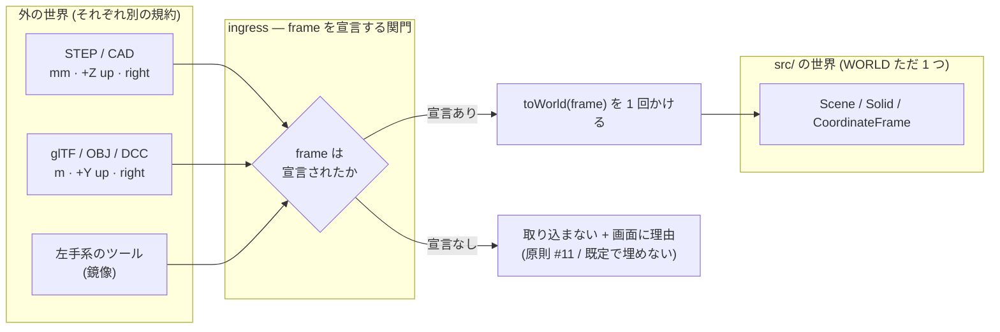

# 139. 外から来た座標は自分の frame を宣言してから世界に入る — 単位・利き手・up 軸を 1 つの値にし、既定で埋めない

- Status: Proposed
- Date: 2026-09-20
- Deciders: yuubae215, Claude
- Retires: GREP:CLAUDE.md::\+X\s*forward,\s*\+Y\s*left,\s*\+Z\s*up · GREP:src/service/SceneService.js::_applyGeometryUpdate\(\{\s*objectId,\s*positionsB64
- Supersedes / Superseded by: なし (ADR-136/138 を覆さない — あれは *単位* 1 軸の話で、
  本 ADR はそれを含む 4 軸の話。ADR-018/037 の CoordinateFrame 実体も覆さない —
  あれは Local ⇄ World の**親子**の話で、World そのものの**規約**には触れていない)

## Context — Goal と力学

出所は当事者の経験的指摘: 「他のツールからデータをインポートした時に必要なんじゃないか。
何回も world の型が合わなくて失敗してます。右手系左手系、上が +Z なのか +Y なのかとか。」

ADR-137 は却下案 B を「world 座標を型で持つ」と一行で書いた。そこで想定していた型は
**単位だけのブランド** (`Millimetres` vs `Metres`) であり、**当事者が名指しした問題より
狭い**。利き手と up 軸は単位と**独立な軸**なので、単位ブランドでは 1 つも捕まらない。

### 力学 1 — 壊れ方は 4 軸あり、互いに独立である

| 軸 | 取りうる値 | 間違えると |
|----|-----------|-----------|
| 単位 | mm / m / inch | 1000 倍・25.4 倍のズレ (ADR-136/138 が扱った軸) |
| 利き手 | right / left | **鏡像**になる。左右が入れ替わり、回転の符号が反転する |
| up 軸 | +Z up (ROS/CAD) / +Y up (glTF・OBJ・多くの DCC) | 90° 転ぶ |
| forward 軸 | +X / −Z / … | 方位が変わる |

4 軸が独立ということは、**単位を直しても残り 3 つは無傷で残る**ということである。
ADR-136/138 は 1 軸目を閉じたが、残り 3 軸には今日も欄が無い。

### 力学 2 — この repo の world 規約は「散文にしか無い」

`CLAUDE.md` の 1 行:

> **ROS world frame** (+X forward, +Y left, +Z up). Right-handed. Matches ROS REP-103.

これが**唯一の正本**である。実測すると、この規約を**読む機械は 1 つも無い**:

- `schema/layout-1.0.schema.json` の top-level = `version / meta / strategy /
  strategyOptions / entities / constraints` — frame も unit も無い。
- `schema/scene-1.3.schema.json` の top-level = `version / objects / links /
  transformGraph / operationGraph`、`required: [version, objects]` — 同上。
- `packages/grasp-contract` の response — `frame` は *pose の親フレーム参照* であって
  座標系の**規約**ではない。
- geometry ingress `SceneService._applyGeometryUpdate({objectId, positionsB64, …})` —
  サーバ (STEP 変換) から来た生の `positions` を **無変換・無宣言**で
  `BufferGeometry` に書き、`initCorners()` で AABB を作って世界に置く。

つまり **ADR-115 と同じ形**である: 宣言は在る (CLAUDE.md の 1 行) が、**読む機械が無い**。
ADR-137 が「散文は書く瞬間に問われない」と言った、その一段上の再演。

### 力学 3 — 不在には欄が無い (原則 #31)

`positions: number[]` という型は「この数列がどの frame の値か」を**言えない**。
言えないから、間違った frame で来たデータは**エラーを出さずに通る** — 90° 転んだ
モデルが、どこにも失敗の痕跡を残さずにシーンに乗る。当事者の「何回も失敗している」は
この形で、**気づくのは目で見たときだけ**である。

そして最悪の既定は「宣言が無ければ ROS だと思う」— これは PHILOSOPHY の Yellow Card
「必須入力の欠落に既定値を与えない」(幽霊ロボットの先例) そのもので、
**「ROS だと宣言された」と「誰も考えなかった」が区別不能**になる。

### 力学 4 — 原則 #21 は宣言されていて、この軸では一度も具体化されていない

原則 #21「座標空間 (Local/World 等) は型・API 形状で**静的に区別**する。命名規約や
レビューに頼らない」。`.claude/rules/10-principles.md` の §このリポジトリでの写像 に
行を持つのは #1 #2 #14 #18 #19 #24 #30 #31 #32 で、**#21 の行は無い**。
Local ⇄ World の親子は `CoordinateFrame` 実体 (ADR-018/037) が持っているが、
**World そのものの規約** (利き手・up・単位) は型でも API 形状でも区別されていない。

**Goal (解ではなく性質): 座標の集まりは、それがどの frame の値かを自分で宣言して
から世界に入る。宣言されていない frame は既定で埋めず、可視な理由とともに拒まれる。**

## Options considered

- **A: 単位だけをブランドする** (`Millimetres` / `Metres`)。ADR-138 Option B の原形。
  tradeoff: 4 軸のうち 1 軸しか覆わない。利き手・up 軸は無傷で通る — **当事者が
  報告した失敗のほうが残る**。却下。
- **B: 型引数つきの点型** (`Point<WorldZUpRightMM>` 等、phantom type)。
  tradeoff: 最も強く、`toWorld()` を通さない生の配列が world sink に代入できなくなる。
  ただし **frame は実行時データ**である — どのファイルを開いたかをコンパイル時の型は
  知らない。さらにこの repo は `GeometryEngine` / `SceneView` / `AppController` が
  `@ts-nocheck` で、ingress の大半が checkJs の外。**単独では成立しない**。
- **C (採用): frame を「閉じた値」として持ち、変換行列をそこから導出する。宣言は
  ingress の必須入力とし、既定を与えない。**ブランドは B を*縮めて*併用する
  (checkJs が効く範囲だけの追加の網)。
- **D: 現状維持** (CLAUDE.md の散文 + 慣習)。
  tradeoff: 当事者が実際に何度も踏んでいる。却下。

## Decision — Strategy

### D1 — `Frame` は 4 つの欄を持つ閉じた値。`WORLD` はその 1 インスタンス

```js
/**
 * @typedef {object} Frame
 * @property {'right'|'left'} handedness
 * @property {'+X'|'-X'|'+Y'|'-Y'|'+Z'|'-Z'} up
 * @property {'+X'|'-X'|'+Y'|'-Y'|'+Z'|'-Z'} forward
 * @property {number} mmPerUnit      // mm:1, m:1000, inch:25.4
 */
```

`src/domain/worldFrame.js` に `WORLD = {handedness:'right', up:'+Z', forward:'+X',
mmPerUnit:1}` (ROS REP-103) を置き、**`CLAUDE.md` はこの定数を名指しするだけにする**
(核 §1.1 — 表を複製しない)。規約が散文から値へ移る = 読む機械を持てるようになる。

`mmPerUnit` が ADR-136/138 との接続点: 単位は 4 軸のうちの 1 つとして `Frame` に
吸収され、`mm()` は「world-unit で書かれた絶対長の宣言」として残る (役割が違う)。

### D2 — `toWorld(frame)` は純粋関数。矛盾した frame は throw する

```
toWorld(f) : Matrix4 = Scale(f.mmPerUnit) · BasisChange(f.up, f.forward, f.handedness)

well-formedness:  up ∦ forward                              (平行なら基底にならない)
                  sign(det) = +1 ⟺ f.handedness = 'right'   (利き手と基底の整合)
```

`up` と `forward` が平行、または宣言した利き手が基底の行列式の符号と食い違う frame は
**構築時に throw する** — 「+Y up にしたのに forward を +Y のままにした」という、
実際に起きるほうの間違いがここで止まる。既定値に落とさないのは原則 #31
(未宣言の種で throw する `EXPLICIT_DEFAULTS` / `PLACEMENT_BY_KIND` と同じ手)。

### D3 — ingress は frame を**必須入力**として受ける。既定は無い



対象の ingress: `SceneService._applyGeometryUpdate` (STEP/サーバ幾何) ·
`SceneImporter.parseImportJson` (scene-1.3) · `LayoutCompiler` (Layout DSL)。
宣言が無い入力は **無言で通さない** — 取り込みを止めて画面に理由を出す (原則 #11)。

### D4 — egress も frame を刻む。我々の出力は次のツールの「宣言なき入力」である

`scene-1.3` / `layout-1.0` / geometry payload に `frame` ブロックを足す。刻まずに
出すと、D3 を自分のファイルに対してすら満たせない (往復した瞬間に宣言が消える)。

これは**公開スキーマの変更 = 意図的な版上げ行為**なので、スキーマと版を同一 PR で
上げる (`scene-1.4` / `layout-1.1`)。grasp-contract の response 契約には触れない —
あちらの `frame` は pose の親参照であって座標規約ではなく、別の事実である。

### D5 — 検証は**キラルな fixture**で行う。対称な fixture は利き手を検出できない

```
det(toWorld(f)) < 0  ⟺  f.handedness ≠ WORLD.handedness   (鏡像が起きた)
∀f: toWorld(WORLD ← f) ∘ toWorld(f ← WORLD) = I            (往復は恒等 — 原則 #28 の形)
```

**ここが検査の設計そのものが主張になる点である** (ADR-120 と同型): 立方体や球で
往復テストを書くと、**鏡像写像でも一致してしまう** — 対称な形は自分が裏返ったことを
知らない。だから fixture は**キラル** (左右非対称、例えば 3 軸の長さが全て異なる L 字)
でなければならない。対称 fixture で緑になる利き手バグは、当事者が報告した
「何回も失敗する」形そのものである。

加えて、D3 の「宣言なき ingress の個数」を数える census を置く (ADR-137 D4 と同じ手 —
母集団は ingress の構文から導出し、baseline 0)。

### 型ブランドの位置づけ (Option B を縮めて併用)

`toWorld()` の戻り値だけに JSDoc の phantom brand を付ける:

```js
/** @typedef {[number,number,number] & {readonly __world: unique symbol}} WorldPoint */
```

`tsc --noEmit` が効く範囲では、生の `[number,number,number]` を `WorldPoint` へ
代入できなくなる = **変換を通したことが型で分かる**。ただし ingress の大半は
`@ts-nocheck` の下に在るので、**これは主たる防御ではなく追加の網**である
(主たる防御は D2 の throw と D3 の必須入力)。過大評価しないことを宣言しておく。

### 状態・基数

この決定は実体の状態を増やさないので `docs/STATE_LEDGER.md` に状態の行は起きない。
**基数の行は起こす**: `Frame` の基数は「世界に 1 つ (`WORLD`)、入力ごとに 0 or 1」で、
**0 が正当に見えてしまうのが本 ADR の敵**である (宣言なし = 0 個 = 欄が無い)。
0 のとき何が起きるかを台帳に書く — 「既定に落ちる」ではなく「取り込まない」と。

## Consequences — Evidence と tradeoff

### 得られるもの
- 単位・利き手・up・forward の 4 軸が**1 つの値**に集まり、変換が 1 つの純粋関数になる。
- 宣言なき取り込みが**可視な失敗**になる (今日は無言で 90° 転ぶ)。
- world 規約が散文から値へ移り、**読む機械を持てる**ようになる (ADR-115 の形を 1 つ閉じる)。
- 外部ツール連携が「想定が合うことを祈る」から「宣言を突き合わせる」に変わる。

### 払うもの / 受け入れるコスト
- **公開スキーマの版上げが要る** (`scene-1.4` / `layout-1.1`)。既存ファイルは
  frame 未宣言なので、**移行の扱いを決める必要がある** — 本 ADR はそこを
  「旧版は読めるが、読んだ時点で frame を人に尋ねる」と提案するに留め、UI の形は
  実装時に決める (ここを今決めると画面設計を先取りすることになる)。
- 型ブランドは checkJs の外 (`@ts-nocheck` の ingress) では効かない。**主たる防御では
  ないと宣言済み**。
- `Frame` を 4 欄に閉じたので、原点オフセットや非一様スケールは表現できない。
  意図的 — それらは `CoordinateFrame` 実体 (ADR-018/037) の仕事で、**規約と配置は
  別の事実**である。混ぜると「どちらが持ち主か」が再び曖昧になる。

### 検証(証拠)

| 主張 | 問い所 |
|------|-------|
| 矛盾した frame は構築できない | `src/domain/worldFrame.test.js` (up ∥ forward / 利き手と det の不一致で throw) |
| 往復が恒等 (原則 #28 の fixpoint) | 同上 — **キラルな fixture**で `toWorld` の往復を焼く |
| 鏡像が検出される | 同上 — `det < 0 ⟺ handedness 相違` を assert。対称 fixture では通らないことも併せて示す |
| 宣言なき ingress が 0 個 | `src/FrameDeclarationCensus.test.js` (母集団は ingress の構文から導出、baseline 0) |
| 宣言なき取り込みが画面に出る | e2e (原則 #11 — 無言の no-op を禁じる) |

**本 ADR 起票時点で上記はすべて未来形である** (Status = Proposed、実装は別スコープ)。
goal ごとの支えの正本は
`docs/gsn/adr-139-an-imported-coordinate-declares-its-frame.gsn`。

### 波及(blast radius)

触る (予定): `src/domain/worldFrame.js` (新設) · `src/service/SceneService.js`
(`_applyGeometryUpdate`) · `src/service/SceneImporter.js` · `src/service/SceneExporter.js` ·
`src/layout/LayoutCompiler.js` · `schema/scene-1.3 → 1.4` · `schema/layout-1.0 → 1.1` ·
`CLAUDE.md` (散文 → 名指し) · 新設 census / e2e。

**触らないと宣言するもの**: `packages/grasp-contract` の response 契約 (あちらの
`frame` は別の事実 — pose の親参照) · `core/` · ADR-136 の 4 変換点 ·
`CoordinateFrame` 実体の親子構造 (ADR-018/037)。

## Lens notes

**層 + 契約レンズ (§1.3):** 本 ADR が足すのは新しい層ではなく、既存の ingress/egress
境界に**通っていなかった 1 つの契約項目**である。ADR-136 は同じ境界で *単位* を
閉じた。本 ADR は同じ境界で *基底* を閉じる — 境界は同じで、運ぶ事実が 1 つ増える。

**原則 #21 の初めての具体化:** ダイジェストの §写像 に #21 の行は無い。本 ADR が
Accepted になったとき、その行は「#21: `Frame` / `toWorld()` / `WorldPoint` ブランド」
になる。**宣言されていて一度も具体化されていない原則**は、違反を見逃すのではなく
「守られていることになっている」— ADR-103 が名指しした退役の腐敗と同じ効き方をする。

**なぜ「型」だけでは足りないか (当事者の問いへの直接の答え):** frame は**実行時の
事実**である。どのファイルをどのツールが書いたかは、コンパイル時の型が知りうる情報
ではない。だから決定の重心は型ではなく「**宣言を必須入力にし、既定を与えない**」
ほうに在る。型 (ブランド) が守れるのは「変換を通したかどうか」だけで、
「正しい frame を宣言したかどうか」は型には書けない。
