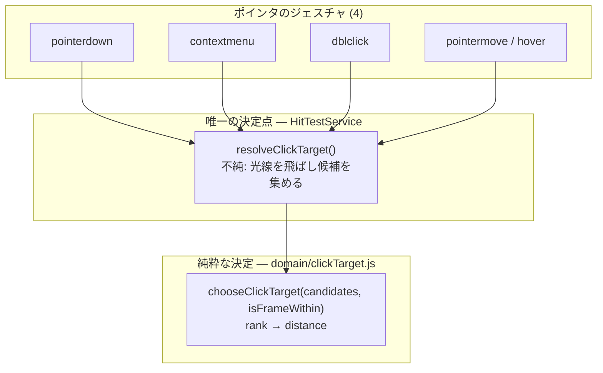

# 140. クリックは書かれた順ではなく奥行きで解決する — ロボットを「最後の手段」から body へ戻し、3 つの写しを 1 つの決定点へ畳む

- Status: Accepted (実装済み — 純粋な決定 `src/domain/clickTarget.js` + 唯一の決定点 `HitTestService.resolveClickTarget()`、4 ジェスチャ (pointerdown / contextmenu / dblclick / hover) が同じ入口を通り、手書きの優先順位は所有者の外に 0 個。死んでいた 4 つ目の写し `AppController._hitAnyEntityForLink()` を削除)
- Date: 2026-09-20
- Deciders: yuubae215, Claude
- Retires: GREP:src/controller/AppController.js::if\s*\(\s*!\s*result\s*\)[\s\S]{0,80}hitRobotStage · GREP:src/controller/AppController.js::isCfDescendantOf\s*\([\s\S]{0,120}hitAnyObject
- Supersedes / Superseded by: なし (ADR-084 §2 の「骨格は view-only decoration で、クリックは `robot_base` へ解決する」機構は不変 — 変えるのはその機構に**到達できるかどうか**。ADR-090 の「どのロボットか」も不変)

## Context — Goal と力学 (§1.2 Goal)

**Goal: 見えているものをクリックしたら、見えている通りの一番手前のものが選ばれる。**
ロボットの骨格だけがこの規律の例外になっている状態を無くす。

依頼は解の形で来た (「本体クリックでも base フレーム選択とみなしてほしい」)。しかし
調べると**その解は既にコードに在った** — `HitTestService.hitRobotStage()` が骨格の
ヒットを `robot_base` 実体へ解決する機構は ADR-084 §2 以来ずっと在る。欠けていたのは
識別ではなく、**その経路に到達する条件**だった。

### 力学 1 — 「優先順位」ではなく「無条件の敗北」だった

3 つのハンドラすべてが、骨格をこう扱っていた:

```js
if (!result) result = this._hitTest.hitRobotStage()
```

これは優先順位ではない。**光線上のどこにも何も当たらなかったときだけ**腕を見る、
という意味である。距離は比較に一度も入らない。したがって:

| ポインタの下にあるもの | 選ばれるもの (ADR-140 以前) |
|---|---|
| 腕 (手前 2 m) + 床スラブ (奥 40 m) | **床** |
| 腕 (手前) + 腕が立っているペデスタル (奥) | **ペデスタル** |
| 腕だけ | 腕 ✓ |

同梱の pick-and-place セル 3 種はすべて、ロボットをペデスタルの上・作業台の手前に
置く。つまり**負ける構図のほうが既定**で、「腕をクリックすると家具が選ばれる」が
日常的に踏まれていた。

### 力学 2 — 1 つの規則に 3 人の著者がいた (§1.1)

PHILOSOPHY #22 (Narrower Scope Wins in Hit-Testing) は 3 箇所に**写しで**実装されて
いた: `_onPointerDown` · `contextmenu` ハンドラ · `_onDblClick`。しかも既にドリフト
していた —

- `_onDblClick` の写しには **CF-descendant 例外が無い** (Solid を CF より先に見る)
- 同じく **annotation フォールバックが無い**

ので、ダブルクリックは直前のシングルクリックと**別の実体**を解決しうる。
**どの写しも単体では正しく読める。** 食い違いは 3 つを同じ視野に入れたときだけ
見え、そうする場所は repo のどこにも無かった。

さらに 4 つ目の写しが**死んだまま**残っていた: `AppController._hitAnyEntityForLink()`
は `HitTestService.hitAnyEntityForLink()` と同じ規則の祖先で、呼び出し元は 3 箇所とも
service 側を使っており、誰からも呼ばれていなかった。これは検査を書いて初めて出てきた
— *在る呼び出し*を辿る読み方では、呼ばれていないものは定義上出てこない。

### 力学 3 — hover は 4 つ目の、別の顔をした写しだった

`_onPointerMove` のカーソル判定は 4 つのヒットテストのうち **3 つ**を見て
`CoordinateFrame` を見ていなかった。つまり CF ギズモの上では既定カーソルが出るのに、
クリックすると CF が選ばれる。**カーソルが、クリックがしない約束をしていた。**

### この決定の位置



## Options considered

- **A: `hitRobotStage()` を Solid より前に呼ぶ。** tradeoff: 無条件の勝敗を逆向きに
  するだけ。骨格は**シーン最大の体積**なので、今度は腕の手前にある小さな実体が
  選べなくなる (#22 の直接の違反)。1 行で済むが、症状を反対側へ移すだけ。却下。
- **B: 骨格のヒットボックスを縮める。** tradeoff: 「当たり判定を狭くして負けを
  減らす」= 規則ではなく調整。どこまで縮めれば十分かに答えが無く、次のシーンで
  また踏む。却下。
- **C (採用): 候補に scope rank を与え、同 rank 内は距離で決める。決定は 1 箇所。**
- **D: 現状維持 + ドキュメントに「腕は Outliner から選んでください」と書く。**
  tradeoff: 画面に見えているものが画面から選べない、を仕様にする。却下。

## Decision — Strategy (§1.2 Strategy)

### D1 — 規則を 1 つの純粋関数として書き出す

`src/domain/clickTarget.js` に `chooseClickTarget(candidates, isFrameWithin)` を置く。
純粋 (THREE も DOM も無し) なので `node --test` で問える — **規則がハンドラの中に
居たことが、3 年間テストを 1 本も持てなかった理由**である (原則 #3)。

「この frame はその body の一部か」は呼び出し側 (シーングラフ = `isCfDescendantOf`)
から**渡す**。ここで `parentId` を読み直すと、所有していない答えの第二の源になる (§1.1)。

### D2 — scope rank → 同 rank 内は距離

```
rank:  frame 0  <  { solid, robot } 1  <  annotation 2
勝者 = argmin over rank, then argmin over distance
例外: frame が body の一部でないとき、その frame は body を遮らない (ADR-140 以前と同一)
```

**`solid` と `robot` が同 rank であることが決定の本体**である。ロボットの腕は
シーンの中の **body** であって、格下の何かではない。rank を共有させることが、
2 つを固定の勝者ではなく**距離比較**へ送る唯一の方法だった。

距離が完全に同値のときは、配列の順ではなく**宣言された種の順**で決める
(`CLICK_KIND_TIE_ORDER`)。「集め方の形」が答えを左右してはならない — ADR-140 以前の
規則はまさに *順序*そのものだった。

### D3 — 語彙を閉じ、未宣言の種で throw する

`CLICK_SCOPE_RANK` に無い kind は `clickScopeRank()` が throw する。既定 rank に
落とすと「宣言された rank」と「誰も考えなかった種」が区別不能になる (原則 #31 —
`EXPLICIT_DEFAULTS` / `PLACEMENT_BY_KIND` と同じ手)。

**throw は勝敗より先に**行う。「最も近いときだけ未知の種に気づく」規則は、自分の
テストを通って現場で落ちる。

### D4 — 4 ジェスチャすべてを同じ入口へ

`resolveClickTarget()` が不純な半分 (光線を飛ばし候補を集める) を持ち、決定は D1 へ
委譲する。`_onPointerDown` / `contextmenu` / `_onDblClick` / hover の 4 つがこれを
呼ぶ。hover も通すので、**カーソルはクリックがしない約束をしなくなる**。

### D5 — 所有者の外に優先順位が 0 個であることを検査が数える

`src/ClickTargetOwnership.test.js`。母集団は手で並べず、**`resolveClickTarget` の
本体から構文で導出**する (ADR-102) — 5 つ目の候補が決定点に足された日に、表へ足すのを
忘れても母集団に入る。数えるのは *在るヒットテスト*ではなく
**同じ関数本体で 2 本以上を突き合わせている箇所の個数** (= 手書き優先順位の署名)。

初回実行が**実際に 2 件出した**: 死んでいた `_hitAnyEntityForLink` (力学 2) と、
`hitFace` を母集団に含めたことによる誤検知。後者は母集団の取り違えで、
「`HitTestService` の `hit*` を全部」ではなく「**決定点が突き合わせている候補**」が
正しい母集団だった — 検査の側で原則 #31 を踏んだ 1 例。

### 状態・基数

新しい status / mode / lifecycle は生えない。**基数の行は起こす** —
`docs/STATE_LEDGER.md` に「ポインタ位置の候補ヒット」(0〜4 が正当) と
「優先順位を決める場所」(**1 であるべきで、ADR-140 以前は 4 だった**) を追加。
効くのは状態数ではなく基数の欄である。

## Consequences — Evidence と tradeoff

### 得られるもの

- 腕をクリックすると腕が選ばれる (同梱セル 3 種で日常的に踏んでいた構図)。
- シングルクリックとダブルクリックが同じ実体を解決する (写しのドリフト解消)。
- カーソルとクリックが一致する (CF ギズモ上の既定カーソルが消える)。
- 規則が**テスト可能な場所**へ出た。

### 払うもの / 受け入れるコスト

- **hover が毎回 4 本の光線を飛ばす** (以前は最大 3 本、最小 1 本)。CF の走査が
  増えた分だけ pointermove が重い。correctness を取った意図的な交換で、シーンが
  巨大化して問題になれば候補収集の遅延評価が次の一手 (今は YAGNI)。
- **無関係な CF がロボット骨格を遮らなくなった** — 以前は骨格が最後の手段だったので
  「腕に重なった無関係な CF」は必ず勝っていた。いまは body として距離比較に入る。
  ロボット自身の base/tcp frame は containment で勝つので影響は「腕の上に描かれた
  他実体の CF」に限られる。**挙動が変わることを宣言する** (黙って変えない)。
- annotation は距離比較に参加せず rank で常に body に負ける。ADR-140 以前と同じ形を
  保った (報告された欠陥は solid↔robot であり、annotation を動かすと blast radius が
  広がる)。**非対称であることを宣言**しておく。

### 検証 (証拠)

| 主張 | 問い所 | 実測 |
|---|---|---|
| 腕が手前なら腕が勝つ | `src/domain/clickTarget.test.js` | 16 / 16 green |
| 種の語彙が閉じている (未宣言で throw、**負ける位置でも**) | 同上 | green |
| 距離同値が配列順に依存しない | 同上 | 初版は**落ちた** — `nearest` が先頭優先だったので宣言された種順を足した |
| 所有者の外に優先順位が 0 個 | `src/ClickTargetOwnership.test.js` | 6 / 6 green。母集団は決定点の本体から導出 |
| 退役した形が戻っていない | 同上 | green |
| 4 ジェスチャが同じ入口を通る | 同上 | green |

**検査が噛むことを実測した。** `_onPointerDown` に退役した形 (`if (!result) result =
hitRobotStage()` + 手書きの CF/Solid 突き合わせ) を再注入すると、6 本中 **3 本が
fail** する (所有者の外の優先順位 / 退役形の復活 / 入口を通るジェスチャ数)。
落ちない検査は何も守らない。

**この証拠が構造的に見逃す変化 (宣言):** 上記はすべて純粋な決定に対する検査であり、
**候補を集める側の正しさは一切問うていない** — `RobotStage.raycast` が返す距離が
本当に骨格表面までの距離か、CF の ±0.4 world-unit のフォールバック箱が画面上で
妥当な大きさか (ADR-136 以後これは **0.4 mm** であり、別の欠陥の疑いがある) は、
この形の証拠の外側にある。実際にクリックして選ばれることは**人が画面で見るしかない**
(e2e は起こしていない — 理由は下記)。

### 波及 (blast radius)

- 触った: `src/domain/clickTarget.js` (新設) · `src/controller/HitTestService.js`
  (3 メソッドが距離を返す + `resolveClickTarget`) · `src/controller/AppController.js`
  (4 ジェスチャの呼び出し置換、死んだ写し 1 つ削除)。
- **触らないと宣言するもの**: `EntityScopeChecks.js` · `robotFrames.js` (ロボット
  識別そのもの — 正しく動いている) · grasp 側のロジック · `RobotStage.raycast` の
  内部 · `hitAnyEntityForLink` (リンク先選びは**別の問い**。統合しないことを
  `DECLARED_MULTI_HIT_METHODS` に宣言して数える) · 契約 (`contractVersion` 不変)。
- 越境なし (`src/` → `core/` の解法持ち込み無し)。

## Lens notes

**グラフレンズ (§1.3):** この決定が足したのはノードではなく**辺の収束**である。
4 ジェスチャ × 4 ヒットテストの直積 (最大 16 の書き方) が、4 → 1 → 1 の扇へ畳まれた。
ADR-108 が「入口は動詞であって対象ではない」で畳んだのと同じ形で、こちらは
*入力の解決*の側。

**原則 #22 の初めての具体化:** `.claude/rules/10-principles.md` の §写像 に #22 の行は
無かった。#21 について ADR-139 が指摘したのと同じで、**宣言されていて一度も
具体化されていない原則**は違反を見逃すのではなく「守られていることになっている」。
本 ADR が Accepted になったことで #22 の写像は
「`CLICK_SCOPE_RANK` / `chooseClickTarget()` / `ClickTargetOwnership.test.js`」になる。

**e2e を起こさなかった理由 (宣言):** この規則の e2e は「ロボットの上のピクセルを
クリックする」形になるが、それは**カメラ姿勢とビューポート寸法に依存する**ため、
ADR-098 が踏んだ「緑のまま欠陥を出荷する」形に近い (画面座標に依存する証拠は、
座標が変わった日に主張の意味が変わる)。ADR-137 の `worldScale()` のように
**値ではなく個数**を報告する read-only スナップショットを足すのが正しい形で、
それは `hitTestState()` のような新しい観測窓を要する。GSN 木に
`support-exploring` として登録し、満期を `PATH:e2e/click-target.spec.js` とした。
