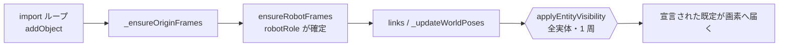

# 143. 宣言された既定は、読み込んだシーンにも届かなければならない — import は合成を一度通る

- Status: Accepted
- Date: 2026-09-20
- Deciders: yuubae215, Claude (pairing)
- Retires: なし — 本 ADR は経路を 1 本足すだけで、殺す形を持たない。ADR-142 が
  退役させた `ROBOT_BASE_SEEDED: false` は同 ADR の `Retires:` が既に問うている
  (同じ義務を 2 つの ADR に書くと、片方だけ履行されたときに緑が出る — 原則 #32)
- Supersedes / Superseded by: なし (ADR-096 の**決定は 1 行も変えない** — 宣言された
  既定が届かない経路が 1 本あったことを塞ぐ。ADR-142 の既定値も不変)

## Context — Goal と力学 (§1.2 Goal)

ADR-142 (`EXPLICIT_DEFAULTS[ROBOT_BASE_SEEDED]` を `true` へ) の**検証中に**見つかった。
実ブラウザで Home のピック&プレイスセルを選ぶと、腕 (`RobotStage`) は正しく描かれる
— ADR-142 の Goal は満たされている — が、同じロボットの `robot_base` フレームは:

```
cf_robot_base:  explicit = true ,  drawn = false
```

**Goal: 実体が「表示」と宣言されているなら、その実体は実際に描かれている。**
軸 (行が語る値) と画素が食い違わない、という ADR-096 の G1 そのものであり、本 ADR は
新しい性質を導入しない — 既存の性質が届いていない経路を 1 本塞ぐだけである。

### 力学 1 — 合成に入口が 1 つ足りなかった

`SceneService.applyEntityVisibility()` は ADR-096 が定めた唯一の合成点 (原則 #4)。
シーンへ入る経路は全部そこを通る……はずだった。実際の呼び出し元は 4 箇所:

| 経路 | 合成を呼ぶか |
|------|------------|
| `reattachObject()` (undo/redo の復帰) | ✅ |
| `setExplicitVisible()` (Outliner の目) | ✅ |
| `declareExplicitVisible()` (`addRobot()` 等) | ✅ |
| `setContextualFrames()` (選択) | ✅ |
| **`importFromJson()` (テンプレート / .ctx.json)** | ❌ **呼ばない** |

import は `this._model.addObject(entity)` + `emit('objectAdded')` だけを行う。
そして `CoordinateFrameView` は構築時に `this._group.visible = false`
(「hidden until explicitly shown」) なので、**読み込まれた CF の画素は、その種が
何を宣言していようと伏せられたまま**になる。宣言は行 (Outliner) には届き、画素には
届かない — ADR-096 が「4 つの公開ドア」を潰して消したはずの食い違いが、合成を
**呼ばない 1 本**として残っていた。

### 力学 2 — なぜ 3 年ぶんの import が誰にも見えなかったか

**値がたまたま一致していたから**である。ADR-142 以前、import 経路で到達しうる種の
宣言はすべて `false` だった (`COORDINATE_FRAME: false`, `ROBOT_BASE_SEEDED: false`;
`GEOMETRY: true` の Solid は meshView が可視で構築されるので合成を呼ばなくても合う)。
つまり「**一度も合成していない**」と「**合成して非表示になった**」が同じ画面を出す。

不在は検査対象のノードを持たない (原則 #31)。しかも既存の e2e は同じ不変条件を
既に問うている — `e2e/smoke.spec.js` の「the row never lies」が
`drawn === explicit || contextual !== null` を全実体について主張している。
それでも見つからなかったのは、**その母集団が `atBoot` だから**: ブートのシーンは
import を一度も通らない。検査は正しく、**母集団が経路を覆っていなかった**。

ADR-142 が `ROBOT_BASE_SEEDED` を `true` に倒した瞬間、偶然の一致が壊れて欠陥が
初めて観測可能になった。**ADR-142 が欠陥を作ったのではなく、隠れ場所を無くした**
(ADR-132 D5 が add 経路の行の目の欠陥を露出させたときと同じ形 — ADR-096 の
`robot_base` 行のコメントが既に記録している)。

### 位置

service 層 1 箇所 (`SceneService.importFromJson` の末尾)。ドメイン・契約・DSL・
`VisibilityAxes` の純粋表はいずれも無改変 (原則 #29)。

## Options considered

- **A (採用): import の末尾で、モデル上の全実体に対し合成を一度走らせる。**
  tradeoff: import 1 回につき O(実体数) の合成呼び出しが増える。合成は純粋関数 +
  mesh への代入で、`_updateWorldPoses()` が既に同じ母集団を 1 周しているので
  オーダーは変わらない。
- **B: 取り込んだ実体だけを覚えておいて、その id にだけ合成を走らせる。**
  tradeoff: 「取り込んだ実体」は import ループの戻り値では足りない —
  `_ensureOriginFrames()` と `ensureRobotFrames()` がそのあとで**新しい CF を作る**
  ので、3 箇所の生成点それぞれが自分の産物を合成へ回す義務を負う (原則 #32 の
  逆をやることになる: 義務が 3 箇所に散る)。取りこぼしは静かに再発する。却下。
- **C: `addObject()` 自身が合成を呼ぶ (= あらゆる生成点で自動的に通る)。**
  tradeoff: 最も網羅的だが、`addObject` はコマンド・undo・内部再構築からも
  呼ばれ、まだ親も pose も確定していない途中状態で合成が走る。ADR-096 が
  `reattachObject` を**専用の入口**にしたのは、まさにその途中状態を避けるため。
  合成のタイミングを生成点ごとに考えることになり、`applyEntityVisibility` の
  「1 箇所」という性質は保てても「**いつ**呼ぶか」が散る。却下 (ただし将来、
  生成点の数が増えたら再考に値する — その日は B/C の比較からやり直す)。
- **D: `CoordinateFrameView` を可視で構築する (構築時の既定を反転)。**
  tradeoff: 症状 (robot_base が伏せられる) は消えるが、**宣言された既定を
  view のコンストラクタという第二の源に複製する**ことになる (§1.1 違反)。
  `COORDINATE_FRAME: false` を宣言した種まで一瞬描かれてちらつく。却下。

## Decision — Strategy (§1.2 Strategy)

**案 A。** `SceneService.importFromJson()` の末尾 (`_adoptBelowGradeIntent()` の後、
`return` の直前) で、モデル上の全実体を合成へ通す:

```js
for (const obj of this._model.objects.values()) this.applyEntityVisibility(obj.id)
```

置き場所が末尾なのは、**その時点までに実体が全部揃っているから**である:
import ループ → `batchRebuildSolids` → `_ensureOriginFrames` → `ensureRobotFrames`
→ links → `_updateWorldPoses` がすべて終わっている。とくに `ensureRobotFrames()` は
`robotRole` を刻む/補う場所なので、これより前に合成すると `isRobotBaseFrame()` が
まだ偽で、`robot_base` が**ただの CF**として `COORDINATE_FRAME: false` を拾う —
ADR-132 が add 経路で踏んだ順序の罠と同じもの。

母集団を「取り込んだ id」ではなく**モデル全体**にするのは §Options B の理由による。
merge import (`clear:false`) で残っている既存実体を巻き込むが、合成は冪等であり、
`_explicitVisibleOf()` は**ユーザー自身の `explicit` 書き込みを既定より先に読む**ので、
ユーザーが目で決めた状態を再合成が上書きすることはない。



### 変わらないもの

- `EXPLICIT_DEFAULTS` の値 (ADR-142 が決めた `ROBOT_BASE_SEEDED: true` を含む)、
  `composeVisibility`、`defaultExplicit()` の throw、軸の書き手 — すべて無改変。
- 合成点は**今も 1 箇所** (`applyEntityVisibility`)。本 ADR が増やすのは
  *呼び出し元*であって、*ピクセルを書く場所*ではない (原則 #4 は保たれる)。
- ブート経路は import を通らないので無影響 (「the row never lies」の `atBoot`
  アサーションは無改変で緑)。

## Consequences — Evidence と tradeoff (§1.2 Evidence)

- **肯定的:**
  - 読み込んだシーンで「行は表示・画素は非表示」が起きなくなる。ADR-096 の G1 が
    ブートだけでなく **import 後のシーンでも**成立する。
  - ADR-142 の既定反転が画面まで到達する。`robot_base` の軸表示が目を触らずに出る。
  - 将来 `EXPLICIT_DEFAULTS` に `true` を宣言する種が増えても、import 経由で
    黙って伏せられることがない (次の同型欠陥を先に塞ぐ)。
- **受け入れるコスト / 否定的:**
  - import の末尾に O(N) の合成が 1 周増える (計測上は `_updateWorldPoses` と
    同オーダー、実測で体感差なし)。
  - 生成点が将来増えたとき、「末尾で 1 周」は新しい生成点が末尾より後に来ると
    また取りこぼす。案 C (生成点そのものを縛る) との比較は、生成点が 3 を超えた
    日にやり直す価値がある — その旨を Options に残した。
- **検証 (証拠):** 論証木の正本は
  `docs/gsn/adr-143-a-declared-default-must-reach-the-loaded-scene.gsn`。
  - `e2e/smoke.spec.js` に回帰を 1 本追加 — Home からピック&プレイスセルを選び、
    (1) 目を一度も触らずに `robotState()[0].skeletonVisible === true`、
    (2) **読み込んだシーンという母集団に対して** `drawn === explicit || contextual !== null`
    を全実体で主張する。修正前は `robot_base(explicit=true, drawn=false)` で赤、
    修正後に緑になることを両方向で確認済み (赤→緑の両実行を PR に記載)。
  - 観測できない実体の**個数を宣言する**: 注釈系 (`AnnotatedRegion` /
    `AnnotatedPoint`) の meshView は `group` も `cuboid` も持たないため
    `visibilityState()` の `drawn` が `null` になる。黙って filter すると
    「違反 0 件」と「そもそも数個しか見ていない」が同じ緑になるので、
    観測できた個数に下限を課してから違反を数える (原則 #31)。
    **この 2 種の画素は本 ADR の証拠が構造的に見ていない** — 残りの検査対象。
- **波及 (blast radius):** `src/service/SceneService.js` (`importFromJson` 末尾の
  1 ループ + 理由コメント)、`e2e/smoke.spec.js` (回帰 1 本)、`docs/STATE_LEDGER.md`
  (「実体の可視性」行の権威欄)、`docs/adr/README.md`、GSN 2 本
  (新規 + ADR-142 の木の exploring goal を支えへ昇格)。ドメイン・契約・DSL・
  `VisibilityAxes.js`・合成そのものは無改変。

## Lens notes

- **§1.1 真実の源:** 既定の権威は `EXPLICIT_DEFAULTS`、合成の権威は
  `applyEntityVisibility` — どちらも動かしていない。動いたのは「権威に**到達する
  経路**の個数」で、これは値でも所有者でもないため、コードを読んでも表を読んでも
  見えない種類の欠落だった (数えるべきは経路の個数 — 原則 #31)。
- **原則 #31 の二段目:** 検査は在った (「the row never lies」)。欠けていたのは
  **母集団**で、ブートという 1 つの入り口しか覆っていなかった。「検査が在るか」と
  「検査の母集団が経路を覆っているか」は別の事実であり、前者だけを数えると緑が出る。
  ADR-115 が「宣言したこと」と「読む機械が在ること」を分けたのと同じ形の、
  **母集団版**である。
- **原則 #19 (Q1/Q2/Q3):** Q1 — 「シーンへ実体を入れる経路は合成を一度通す」という
  暗黙ルールが `docs/code_contracts/` に無い。Q3 — その問いは散文ではなく
  `e2e/smoke.spec.js` の母集団として降ろした (読み込んだシーンを母集団に持つ
  検査が在る限り、次に合成を呼ばない経路が増えた日に赤が出る)。

## References

- ADR-096 (可視性 2 軸 + 既定の宣言) — 本 ADR が守る不変条件の出どころ
- ADR-142 (テンプレート/import 由来のロボットは既定で表示する) — 偶然の一致を
  壊して本欠陥を可視化した変更。本 ADR はその検証中に発見された
- ADR-132 (Decision 5) — 同型の「隠れ場所が無くなって見えた」先例
- ADR-115 — 「宣言したこと」と「読む機械が在ること」を分けて数える先例
- PHILOSOPHY #4 (表示状態の所有者は 1 つ), #11 (無言の失敗の禁止),
  #19 (ドキュメントドリフトはバグ), #31 (0 は状態に見えない), #32 (義務は発火側に)
