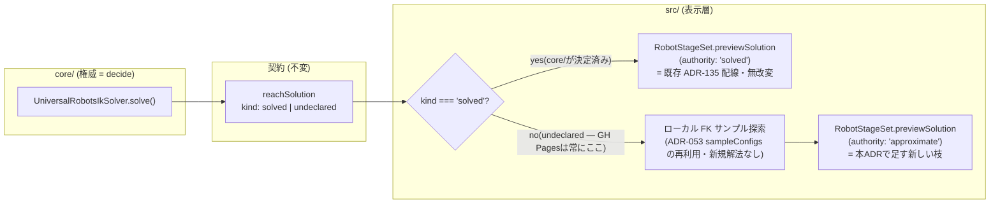

# 144. クライアントの腕プレビューは「未決定の埋め合わせ」であって「もう一つの解法」ではない

- Status: Accepted (実装済み 2026-09-21)
- Date: 2026-09-21
- Deciders: yuubae215, Claude (pairing)
- Retires: なし — 純粋加法的な追加。ADR-135 が確定した `reachSolution` 判定・IK チップ表示・
  `RobotStageSet.previewSolution()` の唯一入口はどれも無改変のまま残り、`solved` 以外の場合に
  新しい入力経路を 1 つ足すだけ(消える既存コードが無い)。
- Supersedes / Superseded by: なし(ADR-135 の続き — ADR-135 の decide 側は一切変更しない)

## Context — Goal と力学(§1.2 Goal)

**Goal(解ではなく性質):** GitHub Pages(および `core/` を起動していないローカル環境全般)で
grasp-search の候補を選んだとき、腕がおおよそどんな配置になりそうかを画面上で確認できる。
ただし「これは実際に到達可能な解である」という主張は一切しない — 権威の無い近似は
権威のふりをしてはならない(原則 #11 の裏返し)。

**現状の力学:**

- ADR-135 で `GraspController._syncArmPreview()` (`src/controller/GraspController.js:786`) が
  `candidate.score.reachSolution.kind === 'solved'` のときだけ `RobotStageSet.previewSolution()`
  へ関節角を渡す配線を確定した。`reachSolution` は `core/` の `UniversalRobotsIkSolver.solve()`
  だけが計算する、契約上の**決定された事実**(kind 判別の閉 union、`packages/grasp-contract`)。
- GitHub Pages のデプロイ(`.github/workflows/deploy.yml:53` の `pnpm build:stub`)は
  `VITE_GRASP_STUB=1` で `mocks/graspStub/` を使う。スタブは意図的に IK を解かず、常に
  `reachSolution: { kind: 'undeclared' }` を返す(ADR-135 実装時の差分1、および `solve.js:375`)。
  静的ホスティングである以上 `core/`(Python)を動かせないので、これは環境の欠陥ではなく
  トポロジ上の必然。
- CLAUDE.md のスコープ境界は明確: 「`src/` は解法を持たない。IK / 干渉 / リーチ / 把持安定性の
  *解き方* は `core/` にのみ書く」。したがって `UniversalRobotsIkSolver` の解析解をそのまま
  JS に移植する、という選択肢はこの境界に正面から触れる。
- 一方で **ADR-053**(ロボティクス KPI メソッド)は、GitHub Pages 単体で検証できる「測定器」
  として FK サンプリング(`src/robotics/Kinematics.js: sampleConfigs` / `forwardKinematics`)を
  クライアント側にすでに許容している。ただし ADR-053 は §7.1/§10.1/§11.5 で毎フェーズ
  「IK ソルバ(KDL)は使わない」「IK / 特異点 Jacobian / 可動ソルバは非目標」と**繰り返し明記**
  しており、許されているのは FK 到達点群への最近傍判定(boolean `reachable` / 数値 `margin`)
  であって、関節配置そのものを解くことではない。

**層マップ上の位置:** 本 ADR の変更は**すべて `src/` の内側**(表示層)に閉じる。
`core/`・`packages/grasp-contract`・`server/`(BFF)はどれも触らない。`contractVersion` は
不変。ADR-053 がすでに切っている「front 側の測定器(近似・非権威)」というレーンを、
FK サンプリングの**新しい消費先**(boolean ではなく関節ベクトル)として一段拡張する形になる
— 「decide は core/、propose/近似は front の非権威レーン」という ADR-056/077 の動詞境界
(decide/propose)と同型の切り分けを、grasp-search の腕プレビューにも適用する。



## Options considered

- **A(採用): 既存の FK サンプリング(ADR-053)を関節ベクトル探索に転用し、型で権威を分けた
  近似プレビューを `reachSolution.kind !== 'solved'` のときだけ表示する。**
  — tradeoff: 精度はサンプリング分解能に依存し、特異点・干渉は一切考慮しない粗い近似になる。
  ただし新しい解法方程式を一切書かないので、`src/` は解法を持たないという境界を越えない。
- **B: `UniversalRobotsIkSolver` の解析的 IK を JS に移植してクライアントにも持つ。**
  — tradeoff: 同じ計算(UR の閉形式解析解)を Python と JS の 2 か所に書くことになり、
  真実の源が 2 つに分裂する(§1.1 違反)。CLAUDE.md の AI ガードが名指しする「IK の解き方を
  `src/` に書く」その形そのもの。却下。
- **C: `core/`+BFF をどこか(Cloud Run 等)にデプロイし、GitHub Pages からもそこを叩く。**
  — tradeoff: 本来の3層構成をそのまま満たす一番正しい解だが、常時稼働インフラのホスティング
  コスト・運用が発生し、「静的サイトだけで完結する」という GitHub Pages 選定の前提から外れる
  デプロイ位相の決定であって、本 ADR の Goal(ゼロ追加インフラで近似確認したい)とは別の意思
  決定。排他ではないので将来別 ADR で検討してよいが、今回のスコープには含めない。
- **D: 現状維持。** — tradeoff: GitHub Pages 版では腕が恒久的に動かないまま。Goal 未達。

## Decision — Strategy(§1.2 Strategy)

**D1. 新しい解法を書かず、ADR-053 が既に持つ FK サンプリングを関節ベクトル探索に転用する。**
`src/robotics/Kinematics.js` の `sampleConfigs`(可動関節を limit 内でグリッドサンプル、
`MAX_SAMPLE_CONFIGS` で総当たり爆発をガード済み)と `forwardKinematics` を使い、候補の
エンドエフェクタ frame(`candidate.pose` が `kind:'endEffector'` のとき)に対して**最も近い
FK 結果を持つサンプル済み関節配置**を選ぶ。方程式を立てて解く「ソルバ」を新設するのではなく、
ADR-053 がすでに許容し実装済みの「測定器」の**出力を変える**(boolean/margin → 関節ベクトル)
だけ。距離が許容誤差を超えたら **配置なし(`null`)を返す**(近いだけの誤った配置を無理に
出さない — 原則 #11 の裏返しをここでも守る)。

**D2. 権威を型で分ける(原則 #2 — フラグや同名キーでなく型で分岐)。**
クライアント近似の結果は、契約の `reachSolution`(`kind: 'solved'|'undeclared'`)とは
**別のフィールド名・別の形**で表す。例:

```js
// 契約由来(core/ が決定した事実、無改変)
{ kind: 'solved', joints: [...] }        // reachSolution
{ kind: 'undeclared' }

// クライアント専用(本ADRで新設、契約に一切乗らない)
{ origin: 'clientApproximate', joints: [...], toleranceMm } | null
```

`kind` という判別子を再利用しない・`additionalProperties` の形も変えることで、契約側の
`reachSolution` を検証するコード(ajv 等)に近似結果を誤って渡しても構造的に通らないように
する。近似結果はワイヤに一切乗らず(`packages/grasp-contract` 無改変)、`core/` にも送らない。

**D3. ゲート条件は「core/ が決めたか」1 つだけ(§1.1 — 環境フラグを新設しない)。**
「GitHub Pages かどうか」を検出する第二の信号は作らない。`reachSolution.kind !== 'solved'`
という**既存の唯一の事実**をそのままゲートに使う。GitHub Pages は単にこの条件が恒常的に
真になる環境というだけで、ローカルの `pnpm dev:stack` で `robot.kinematics` が UR 形状で
ないロボットを使った場合も同じ枝に自然に乗る(一貫した一般化であり特別扱いではない)。

**D4. 書き手は増やさず、唯一の入口の引数を拡張する(原則 #4 は不動)。**
`RobotStageSet.previewSolution(robotId, joints|null)`(ADR-135 D3/D4 で確定した唯一の入口)
は削除・複製せず、第二引数を `{ authority: 'solved'|'approximate', joints } | null` へ拡張する
形で近似を受け付ける。表示材質・色などの**視覚差(演出)の書き手はこのメソッド 1 箇所のまま**
— `authority` に応じてゴースト調(破線・低彩度・キャプション)を出し分けるのもここでのみ行う。
呼び出し側(`GraspController._syncArmPreview`)は `solved` → D1 済みの経路(無改変)、
`undeclared` → D1 の近似探索、を切り替えて渡すだけ。

**D5(明示的にやらないこと)。** UR 解析的 IK の JS 移植(却下案 B)。`core/`+BFF の外部
ホスティング(却下案 C、排他ではないが別 ADR)。近似結果を `ikSolvable` チップや
`reachSolution` へ昇格させること、あるいは近似の存在を理由に `mocks/graspStub/` 自体を
「解けたことにする」よう書き換えること(スタブは「IK を解いていない」という事実を今後も
正直に `undeclared` で返し続ける — ADR-135 が守った「誰も決めていない腕を捏造しない」を
近似導入後も維持する)。

## Consequences — Evidence と tradeoff(§1.2 Evidence)

**肯定的:**
- GitHub Pages のデモで腕がまったく動かない、という Goal 未達の状態を解消できる —
  追加インフラ費用ゼロで実現できる(却下案 C と違い常時稼働サーバが要らない)。
- 新しい解法ロジックを一切書かない。ADR-053 がすでに正当化・実装した FK サンプリングの
  **消費先を変えるだけ**なので、「`src/` は解法を持たない」境界を一度も越えない。
- 型分離(D2)により、近似結果が契約の `reachSolution` に構造的に混入できない — 将来の
  実装者が「動くから」と近似値を `solved` として送り返すような取り違えを型が防ぐ。

**受け入れるコスト / 否定的:**
- 近似はサンプリング分解能に依存する粗い配置で、特異点・自己干渉・障害物干渉は一切考慮しない。
  「本物っぽく見えて実は違う」状態は原則 #11 に反するリスクがあるため、実装時は視覚的に
  明確な区別(色・破線・キャプション「未検証の概算」等)を D4 の唯一入口に必ず持たせる必要が
  ある — これを怠ると近似が権威を騙る事故になる。
- サンプル探索は `MAX_SAMPLE_CONFIGS` 有限個からの最近傍選択なので、許容誤差を満たす配置が
  無ければ **何も表示しない(rest のまま)** ことを明示的に選ばなければならない。「とりあえず
  一番近いものを出す」という無言のフォールバックは禁止(原則 #11)。
- `RobotStageSet.previewSolution` の引数形状が変わるため、既存呼び出し箇所・テストの更新が
  要る(ただし書き手の数は増えない — D4)。

**検証(証拠):** 論証木は `docs/gsn/adr-144-an-approximate-preview-is-not-a-second-solver.gsn`
(goal ごとの支えの正本はそちら)。起票時に「実装 PR で閉じる」と宣言した 5 つは、実装コミットで
以下のとおり閉じた(実行結果は PR 本文に転記):

- D3 のゲート — `solved` のとき近似探索が**一度も呼ばれない**ことを
  `src/controller/GraspController.test.js` が焼く。「呼ばれなかった」は出力に痕跡を残さない
  (どちらの枝でも payload は在る)ので、在るものではなく **鎖が触られた回数**を数える
  (`countingChain` の Proxy — 原則 #31)。
- D2 の型分離 — `src/robotics/ApproximateReachPreview.test.js` が契約の
  `grasp-search-response.schema.json#/$defs/reachSolution` を ajv で compile し、近似結果が
  **invalid** になることを焼く。同じ validator が `solved` / `undeclared` を **valid** と
  するところまで同じテストで主張する(全部拒否する壊れた validator でも緑になるのを防ぐ
  = 負の対照だけでは何も示さない)。
- 原則 #11 — 許容誤差を超えたら `null`(ユニット)、および **実ブラウザで腕が rest のまま**
  (e2e S11b)。S11b は S11 の対照で、「常に一番近いものを出す」実装は S11 では緑になり
  S11b でだけ落ちる。
- ADR-135 D3 の不変 — `RobotStageSet.previewSolution` は今も唯一の書き手(引数が広がっただけ)。
  `previewAssignments` / `jointValuesFor` の N=2 テストは無改変で緑。
- 契約不変 — `pnpm test:contract` 緑 (`contractVersion=6` のまま)。`packages/grasp-contract` ·
  `core/` · `server/` · `mocks/graspStub/` はいずれも 1 行も変えていない。

## 実装で分かったこと(起票時の前提との差分 — 原則 #19)

**1. D1 は「最近傍サンプル 1 回」では Goal を満たさない。** 6 関節・限界 ±2π の格子では、
1 回の総当たりの最近傍は数百 mm 外す(実測: 4 サンプル/関節で中央値 175mm)。そのまま許容誤差に
かけると常に `null` = 腕は永久に動かない。実装は同じ格子を**窓を半分ずつ狭めながら再サンプル**
する多スタート版にした(8 スタート × 12 ラウンド)。**新しい方程式は 1 行も足していない** —
`sampleConfigs` + `forwardKinematics` を繰り返し呼ぶだけで、D1 の「測定器の出力を変える」
範囲に留まる。実測は 100 点の到達可能点に対し 98% が 1mm 以内・1 回あたり約 57ms。

**2. 手を動かせない関節は格子から外す。** UR の `wrist_3` は軸がフランジを通るので位置を
1mm も変えない。それでも格子を 4 倍にするため、**測って**(`positionInfluentialJoints` —
固定の 4 配置で各関節を小突いて TCP を見る)1 サンプルに畳む。手書きの除外リストにしなかったのは
別の URDF が来た日に黙って嘘になるから(§1.1)。このために `sampleConfigs` に**関節ごとの
サンプル数**(配列形)を足した — 長さが合わない配列は throw(埋めた 1 は「誰かが 1 を選んだ」に
見える = 原則 #31)。

**3. 巻き上がった等価解は巻き戻して返す。** 限界 ±2π なので格子は手首が 6.1 rad 回った配置を
拾う。−0.2 rad と同じ物理回転・同じ手の位置だが、画面では誰も言っていない主張に見える。
返す前に(−π, π] へ書き直す — **探索ではなく表記の正規化**で、FK が変わっていないことは
「宣言した `errorMm` と返り値を FK に通した実測が一致する」形で焼いてある。

**4. 一致させているのは手の位置だけで、姿勢は見ていない。** 6 自由度を位置 3 拘束に当てるので
手首の向きは自由に残る。これは精度の不足ではなく**この近似が何でないか**の宣言であり、
ゴースト表示(半透明)と行のキャプションが必要な理由そのもの。契約の `reachSolution` が
姿勢まで含む解であるのと非対称であることを、ここに明示しておく。

**5. 既定のシーンでは、そもそも腕が対象に届かない。** Shift+A で足したロボットは原点から
2.8m に立ち(ADR-083)、UR5e の到達は 0.9m。だから既定シーンでは近似は正直に `null` を返し、
腕は rest のままになる — **仕様どおりだが Goal の証拠にはならない**。e2e S11 は Home の
単腕ピック&プレイスセル(台座と対象が同じセルに在る実配置)で問い、既定シーン側は S11b が
「動かないこと」を焼く。**近似が使えるのは腕が実際に届くセルに限る**という限界は、ADR の
Goal 文の暗黙の前提だったものをここで明示に変えたもの。

**6. 証拠の面を 1 つ足した。** 「GitHub Pages で腕が動く」は画素の主張なのでユニットレーンでは
原理的に問えない(THREE も URDF も `?raw` も無い)。`window.__easyExtrude.armPreview()` が
各 stage の**書き込んだ後の関節角と unverified フラグ**を読み戻す(ADR-137 の `worldSpan()` と
同じ手)。「渡したつもり」では緑にならない。

**波及(blast radius):** 新設: `src/robotics/ApproximateReachPreview.js`(THREE-free の純粋
モジュール)。変更: `src/robotics/Kinematics.js`(`sampleConfigs` に関節ごとのサンプル数 —
加法的)、`src/domain/robotConfig.js`(`needsApproximatePreview` / `previewPayloadFor`)、
`src/controller/GraspController.js`(`_syncArmPreview` の `undeclared` 枝と鎖の注入)、
`src/view/RobotStage.js` / `RobotStageSet.js`(`previewSolution` の引数形状と未検証表示・
読み戻し用スナップショット)、`src/view/robotSkeleton.js`(`ROBOT_CHAIN` = 同じ URDF の
5 人目の消費者)、`src/controller/AppController.js`(注入と `armPreview()`)、
`src/components/Grasp/GraspSearchPanel.jsx`(行のキャプション)。**触っていない**:
`packages/grasp-contract/*`・`core/*`・`server/*`・`mocks/graspStub/*`(スタブは
`undeclared` を返し続ける — 正直さを変えない)。

**状態台帳(核 §1.4):** 実装コミットで `docs/STATE_LEDGER.md` の「腕が描く関節配置
(骨格プレビュー)」行を更新した — ADR-135 の `rest`/`preview` 2 値の `preview` 側に権威
サブ次元 `solved`/`approximate` が乗り、`approximate` を持つ stage の基数は `0..1`
(主語の腕だけ、しかも届くときだけ)。

## Lens notes

- **§1.1 真実の源は一つ**: 却下案 B を退けた理由はまさにこれ — UR の解析解を Python と JS の
  2 か所に書けば、同じ計算に 2 つの源ができる。ADR-127 が `core/` に確定した唯一の計算者を
  複製しない。
- **原則 #2 型は能力の契約**: 近似結果を `kind` ではなく `origin` という別の判別子・別の形で
  表すことで、フラグや同名キーでの取り違えを構造的に防ぐ。
- **原則 #4 表示状態の書き手は一つ**: `RobotStageSet.previewSolution` の引数を拡張するだけで、
  2 つ目の書き手は作らない。
- **原則 #11 無言の失敗禁止**: 許容誤差を超えた近似は「一番近いものを出す」ではなく明示的に
  「無い」を返す。
- **原則 #29(ワイヤは厳格・クライアントは演出)**: 近似はどこまでも「クライアントの演出」に
  留め、契約(ワイヤ)には一切追加しない — ADR-0005/060 の統治をそのまま踏襲。
- **層 + 契約(§1.3)**: 変更は `src/` の内側だけに閉じることを図(mermaid)で確認した。
  ADR-053 がすでに切っていた「front 側の測定器レーン(近似・非権威)」を一段拡張する形で、
  新しい境界を作らずに既存の decide/propose の動詞境界(ADR-056/077)へ素直に合流させた。
