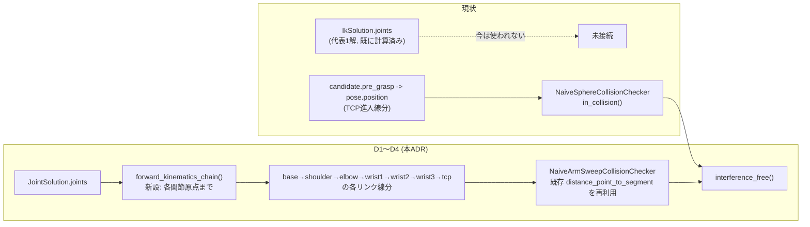

# 145. base と TCP の間にある腕は干渉判定から見えていない

- Status: Proposed
- Date: 2026-09-21
- Deciders: yuubae215 (via `/whiteboard` session), Claude (pairing)
- Retires: なし — 純粋な追加 (新規 `CollisionChecker` 実装 + Protocol 拡張のみ、response 契約は不変)。ADR-127 D5 (代表解を決定的に1つだけ公開する規律) は覆さず維持する
- Supersedes / Superseded by: なし (ADR-081 の干渉ドメイン段・ADR-127 の解析解 IK・ADR-135 の `reachSolution` 配線、いずれも Status・本文は変更しない子 ADR)

## Context — Goal と力学 (§1.2 Goal)

**きっかけ:** 単腕ピック&プレイスセル (`examples/layout_pick_place_cell.json`) で供給ビンを
Grasp 対象にすると、肘・前腕がロボットのペデスタルにめり込んで描画される。`/whiteboard`
セッションでコードを読み、原因を切り分けた。

**Goal (解ではなく性質):** ロボットが選ぶ関節配置が、把持探索の設計時検証において
周辺構造物 (自身のペデスタル含む) と実際に干渉しないことを保証できる。

### 診断で確定した事実 (問い自体への回答)

1. **座標系は原因ではない。** `SceneView.js:67` は `camera.up.set(0, 0, 1) // ROS
   convention: +Z is up` を明示し、URDF (`skeleton_arm.urdf`) は ROS/URDF 標準どおり
   m・Z-up のまま読み込む。`RobotStage` が掛けるのは一様 `×1000` スケール (ADR-136) のみで
   軸の入れ替えは無い。front (`feasibility.py:137` のコメント) と core が同じ +X前方・+Z上の
   規約を共有している。
2. **解析解 IK は内部で最大8解を計算しているが、ワイヤに出るのは代表1解だけ。**
   `UniversalRobotsIkSolver.solve()` は UR の閉形式解析解 (Hawkins 2013) で最大8解を得るが、
   **ADR-127 D5** が「段階0が問うのは可解性なので8解を出さない」と決め、関節総移動量最小の
   代表解1つ (`JointSolution`) だけを返す。ADR-135 もこの1解構造 (`reachSolution:
   solved(joints)|undeclared`) を維持したまま実装済み。
3. **干渉判定は TCP の進入経路しか見ていない。関節解も腕リンクの幾何も入力に取っていない。**
   `NaiveSphereCollisionChecker` / OBB 版 (ADR-133 D5) の `in_collision(candidate, obstacles)`
   は `candidate.pre_grasp -> candidate.pose.position` の**線分1本**を障害物と照合するだけで、
   `IkSolution.joints` を一切受け取らない。ペデスタル自体は `examples/layout_pick_place_cell.json`
   の `robot_pedestal` として `fixture`/`static` の障害物に正しく含まれている ── しかし
   供給ビンの把持点はペデスタルから離れた位置にあり、進入経路もそこを通らない。**肘・前腕が
   base から手首へ向かう途中でペデスタルへ回り込む区間は、このチェッカのどの入力にも
   現れない。** 8解のどれを選んでも判定結果は変わらない (判定が関節配置そのものを見ていない
   ため) ので、事実2 (代表解のみ) を単独で直しても本症状は解決しない。

### 層マップ上の位置 (CLAUDE.md のスコープ境界表)

干渉の解き方は `core/` の責務。本 ADR は `core/easy_extrude_core/engine/feasibility.py` /
`ur_kinematics.py` の内部にのみ新しい判定ロジックを足す。`src/` は解かない境界を一度も
越えない。

## Options considered

- **A (採用): 腕リンクの FK スイープを `CollisionChecker` に追加する。**
  base→shoulder→elbow→wrist1→wrist2→wrist3→tcp の各リンクを線分近似し、既存の TCP 進入
  経路チェックと同じ障害物リストに対して照合する。現行の代表1解のままで、肘・前腕の
  回り込みを検出できる。
  — tradeoff: 干渉段のコスト (安い順フィルタ, ADR-081 実施記録) がリンク本数分増える。
  代表解が「たまたま」常に干渉するケース (全8解のどれを選んでも回り込む姿勢) は
  この案だけでは救済できず、単に候補が正しく棄却されるだけになる。
- **B (見送り・残しとして登録): 干渉なしになるまで代替解 (最大8解) を探索する
  モードを追加する (ADR-127 D5 の再開)。**
  — tradeoff: A で棄却された候補のうち、実は別の elbow-up/down・wrist-flip 配置なら
  干渉しない解があるケースを救済できる。ただし `reachSolution` の意味論を「代表1解」から
  「複数候補から選ばれた1解」へ広げるかどうかの判断 (response 契約の版上げを伴い得る) と、
  探索順序 (関節総移動量最小を最初に試し、干渉ありなら次点へ、という優先順位の設計) が
  未決で、A の実装・実測を経ないと必要性の見積りすらできない。
- **C (現状維持):** 却下 — 供給ビンのように「把持点自体はペデスタルから離れているが、
  腕の経路上でペデスタルに触れる」という報告済みの症状を放置する。

## Decision — Strategy (§1.2 Strategy)

**Option A を採用する。**

**D1. `ur_kinematics.py` に `forward_kinematics_chain(dh, joints) -> tuple[Mat4, ...]`
を新設する。** 既存 `forward_kinematics()` (フランジの最終変換のみ返す) はこの関数の
最終要素を返す薄いラッパへリファクタするか、独立実装のまま残すかは実装時に決める
(境界だけ本文で固定する — ADR-133 D5 と同じやり方)。DH 変換 `T_i = Rz(θ_i)·Tz(d_i)·
Tx(a_i)·Rx(α_i)` の**累積積の各段**(= 各関節原点のワールド変換)を返す。

**D2. `feasibility.py` に `NaiveArmSweepCollisionChecker` を新設する。** 各リンク区間
(base→shoulder, shoulder→elbow, …, wrist3→tcp) を線分とみなし、**既存の
`distance_point_to_segment`**(TCP進入経路チェックと同じ幾何プリミティブ、第二の源を
作らない §1.1)をリンクごとに呼んで障害物 (球/OBB) と照合する。1本でも交差すれば
干渉ありとする。

**D3. `CollisionChecker.in_collision()` のシグネチャに関節解を追加する。**
`in_collision(candidate, obstacles, joints: Optional[JointSolution] = None)` のように
拡張する (Protocol は `core/` 内部境界でありワイヤに出ないので `contractVersion` 不変)。
既存 `NaiveSphereCollisionChecker` / OBB 版は新引数を無視してよく、後方互換を保つ。

**D4. 宣言が無いときは腕スイープを評価しない。** `robot.kinematics` 未宣言時の
`NaiveIkSolver` が返す `IkSolution.joints` は占位の1数 (`(angle,)`) であり、6関節の
実配置ではないため腕の実ジオメトリを再構成できない。型で分岐する (`isinstance
JointSolution`, 原則 #2) ── `JointSolution` を持たない候補は既存の TCP 進入経路のみの
判定にフォールバックする。これは ADR-127 D3 と同じ「宣言した瞬間にだけ挙動が変わる」
規律の踏襲であり、既存テンプレ・既存テストの結果を無言で変えない。

**D5 (明示的にやらないこと)。** Option B (干渉なしになるまで代替解を探索するモード、
ADR-127 D5 の再開)。A の実装・実測を経てから必要性を判断する。`docs/DEFERRAL_LEDGER.md`
に DEF-037 として登録する (満期 = 本 ADR が Accepted になり A が実装された後、実運用で
「代表解が常に干渉して候補が失われる」ケースが確認された時点)。

## Consequences — Evidence と tradeoff (§1.2 Evidence)

**肯定的:**
- 既存の代表1解のまま、腕の実ジオメトリを初めて干渉判定の入力に含められる。ペデスタルの
  ようにTCP進入経路から離れた場所にある障害物と、肘・前腕の回り込みを検出できる。
- Protocol 拡張のみで response 契約 (`reachSolution`) は不変 — `contractVersion` 据え置き、
  BFF 型再生成・conformance 更新も不要。
- 宣言が無ければ挙動を変えない (D4) ので、既存テンプレ・既存テストは無傷のまま。
- 干渉判定のリンク幾何・障害物幾何ともに `distance_point_to_segment` という単一の計算を
  再利用するため、第二の源を増やさない。

**受け入れるコスト / 否定的:**
- 新規 `forward_kinematics_chain` の FK 往復検証が要る。ADR-127 の教訓 (「肘の2リンク
  問題を誤った平面で解いても、桁・符号が妥当なので値を見ても気づけない。捕まえたのは
  FK 往復で、かつ FK 自身を DH から独立に固定していたから」) を再演しないよう、中間関節
  原点の期待値は手計算 (または既存 `forward_kinematics` の最終値との整合) で独立に固定する。
- 干渉段のコスト実測 (ADR-081 実施記録の安い順フィルタ順序: リーチ→IK→把持性→可視性→
  干渉) が変わりうる — リンク本数分の距離計算が増えるため、実装時に再測定して挿入位置を
  確認する。
- 全8解のどれを選んでも常に干渉するケースは本 ADR では救済しない (D5)。候補が正しく
  棄却されるだけで、Option B が無いと「別配置なら掴めたはず」の候補を失う。

**検証 (証拠):**

| 主張 | 問い所 |
|------|--------|
| 新規 FK チェーンが正しい (中間関節原点まで) | `core/tests/test_ur_kinematics.py` — 既存 `forward_kinematics` の最終値と `forward_kinematics_chain` の最終要素が一致すること + 中間関節原点を DH から独立に手計算した値と照合 (ADR-127 と同じ独立固定の規律) |
| 腕スイープが実際にペデスタル干渉を検出する | 本症状を再現するテンプレ (`templates/` に単腕セル + ペデスタル至近の低い供給ビンを追加) + `core/tests/test_templates.py` に受け入れ値を固定 (ADR-081 のテンプレ精度規律を踏襲) |
| 未宣言 kinematics では挙動が変わらない | `core/tests/test_engine.py` — 占位解 (`IkSolution` だが `JointSolution` でない) でスイープが起動せず、既存 TCP 経路判定のみが効くことを assert |
| ファネル恒等式が保たれる | 既存プロパティテスト (`generated = Σ rejected_by_* + feasible`) がリンク本数増加後も成立すること |
| 健全性: 干渉なしの候補は実際に全リンクが障害物から離れている | `core/tests/test_engine.py` の新規ケース (境界: probe_radius ちょうどの接触) |

**この証拠が構造的に見逃す変化を宣言する:** 上記はすべて「ある1つの代表解について、
その腕ジオメトリが正しく干渉判定される」ことを検証する。**代表解の選び方自体
(ADR-127 D5 の関節総移動量最小) が干渉を考慮していない**という事実は、この検証群では
見えない ── 選ばれた代表解がたまたま毎回干渉する入力では、候補が単に失われ続けても
全テストは緑のままである。この見逃しの救済が Option B (D5, 見送り) の対象。

**状態台帳 (核 §1.4):** 本 ADR が触る状態と基数の行は `docs/STATE_LEDGER.md` の
**「§提案中の実体」表の「干渉判定が見る幾何スコープ」**行 (表はそちらが正本 — ここに
複製しない, §1.1)。現状 1 状態 (`TCP進入線分のみ`) が、D1〜D4 実装後は2状態
(`TCP進入線分` / `TCP進入線分 + 腕リンクのFKスイープ`) になる。基数はチェッカ実装
1リクエストにつきちょうど1、腕リンクのFKスイープが走るかは `robot.kinematics` 宣言の
有無で `0..1`。Accepted・実装済みになった時点で上の本台帳へ移す (ADR-129 と同じ手順)。

**波及 (blast radius):**
`core/easy_extrude_core/engine/feasibility.py` / `ur_kinematics.py` / `ur_solver.py`
(FK呼び出し箇所の配線変更、間接) / `pipeline.py` (干渉段への関節解の受け渡し配線) /
`templates/` (受け入れフィクスチャ追加) / `core/tests/`。
触らないと明示するもの: `packages/grasp-contract` (契約不変) / BFF 型 / `src/` 全体
(front は解かない境界を越えない) / `reachSolution` の意味論 (ADR-135 は不動) /
ADR-127 D5 (代表解1つのみ公開、覆さない)。

## Lens notes

- **型は宣言された属性の契約 (PHILOSOPHY #29 / 原則 #2):** 「腕の実ジオメトリを
  再構成できるか」の分岐は `JointSolution` という既存の部分型の有無で行う (isinstance
  1箇所)。新しい kind 判別や真偽フラグを増やさない。
- **層 + 契約:** 干渉ドメインの守備範囲が「TCP進入経路」から「腕全体のリンク」へ広がるが、
  front/core の境界 (解法は core/ のみ) は一度も越えない。ワイヤ (`reachSolution` の形) も
  不変 ── ADR-060 の統治 (ワイヤは決定された事実のみ) に触れる変更ではなく、`core/` 内部の
  判定精度が上がるだけ。
- **真実の源は一つ (§1.1):** リンク位置は `forward_kinematics_chain` という1つの計算から
  のみ導出する。障害物との距離計算も TCP 経路と腕リンクで同じ `distance_point_to_segment`
  を共有し、幾何プリミティブの第二の実装を作らない。
- **状態機械は不要:** 本 ADR が触る状態 (`JointSolution` の有無による分岐) は既存の2値
  union の消費側であり、新しい状態を追加しない。核 §1.4 の閾値 (3状態以上) に届かない。

論証木: `docs/gsn/adr-145-the-arm-between-base-and-tcp-is-invisible-to-interference.gsn`
