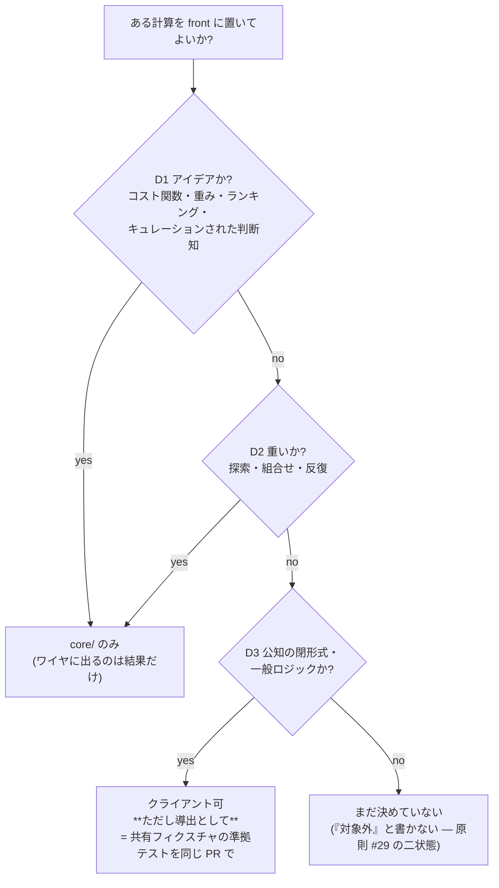

# 146. 閉形式は複製してよい、アイデアは複製してはならない — 置き場所を決める 3 軸

- Status: Accepted (2026-09-21 — D1〜D3 の規律と D5 の問い所を同 PR で実装)
- Date: 2026-09-21
- Deciders: yuubae215 (「探索が必要な処理はバックエンドサーバに、一意な解が出るものは
  クライアントでもできるように」「アイデアが必要なコスト関数とかを含まない一般的な
  ロジック。アイデアはサーバ側に隠すとともに、重たい処理もバックエンドの責務」
  「この境界の判断は毎回迷われるため、どこかに記録しておいてほしい」)、Claude (pairing)
- Retires: GREP:CLAUDE.md::制約の解法 — CLAUDE.md の AI ガードが持っていた
  **話題の列挙**による判定 (「『制約の解法』に当たるコード (IK / 干渉 / リーチ / 安定性の
  解き方)」という一文) を、下の 3 軸へ置き換える。列挙は列挙に無い計算が来た日に何も
  答えないので、置き換えは**削除を伴う**。同じ列挙が §スコープ境界 の箇条書きにも
  複製されていたので、そちらも 3 軸を名指しするだけに変えた (軸を 2 か所に書かない —
  §1.1。規則の置き換えで第二の源を作るのは、置き換えそのものより悪い)。
  **trigger に `/` を含めない**: 登録簿の満期語彙と同じパーサを通るので、スラッシュを
  含む regex は最初の `/` で切れ、`IK` だけの検査に退化する (実際いちど退化させた —
  退役の腐敗は違反を見逃すのではなく**緑を出す**という ADR-103 が、trigger の書き方
  そのものにも効く)。
- Supersedes / Superseded by: ADR-144 の却下案 B の**理由**を差し替える (却下そのものは
  維持 — 下の D6)。ADR-053 §7.1/§10.1/§11.5 の「front に IK を置かない」も同じ理由の
  差し替えを受ける。どちらの ADR も Status・本文は変更しない。

## Context — Goal と力学 (§1.2 Goal)

**きっかけ:** ADR-145 の実装を依頼した当事者が、同じ依頼の中で置き場所の規則を述べた。
その規則は既存の記録と 2 か所で当たっていた (ADR-144 却下案 B / CLAUDE.md の AI ガード)
ので、実装を止めて判断を仰いだ。返ってきたのが上の Deciders 欄の言葉であり、最後の一文
(「**毎回迷われるため、どこかに記録しておいてほしい**」) が本 ADR の存在理由である。

**Goal (解ではなく性質):** ある計算をフロントに置いてよいかが、**その計算の性質から
判定でき**、判定した人が変わっても同じ答えになる。

**なぜ今日それが成り立っていないか。** CLAUDE.md の AI ガードは
「IK / 干渉 / リーチ / 安定性の**解き方**を `src/` に書こうとしたら中断」と書いている。
これは**話題の列挙**であって規則ではない。列挙には 3 つの穴がある:

1. **列挙に無い計算が来た日に何も答えない。** ADR-145 が足した
   `forward_kinematics_chain` は「干渉判定のための腕の幾何」だが、FK 自体は
   4 つのどれでもない。単位変換・正規化・座標変換も同じ。
2. **列挙に在る計算でも、理由が違えば答えが違う。** ADR-053 は FK サンプリングによる
   到達判定を front に**許している** — 「リーチ」は列挙に在るのに。実際に効いている
   規則は列挙ではなく「権威ある判定か、非権威の測定器か」だった。
3. **理由を説明できないので、当たったときに議論が振り出しに戻る。** ADR-144 は
   却下案 B を **§1.1 (源が 2 つに割れる)** で退けた。列挙ではなく原則で論じたのは
   正しいが、§1.1 は*複製*を禁じているのであって*クライアントに置くこと*を禁じて
   いない。この区別が無いと、次に同じ問いが来たとき同じ長さの議論をやり直す。

**そして実際にやり直した。** ADR-144 は 2026-09-21 に Accepted になり、**同じ日**に
当事者が逆向きの規則を述べた。1 日ももたなかったのは、規則が判定可能な形で書かれて
いなかったからである。

## Options considered

- **A (採用): 3 軸 + 優先順位で判定する。** アイデア → 重さ → 一意性の順に問い、
  最初に真になった軸が置き場所を決める。
  — tradeoff: 「アイデアか」は人の判断であり grep できない。判定を機械へ降ろしきれない
  ぶん、**降ろせる部分 (D3 の導出であること) だけを機械に問わせる**。
- **B: 現状維持 (話題の列挙を足していく)。** 却下 — 上の 3 つの穴は列挙を伸ばしても
  閉じない。列挙が長くなるほど、列挙に無い計算に出会う確率は上がる。
- **C: 「探索か一意か」の 1 軸だけにする** (当事者の最初の言葉そのまま)。却下 —
  この軸だけだと**コスト関数がクライアントへ出てしまう**。加重スコアの重み
  (ADR-076) は一意で軽いが、まさに隠したい知である。当事者自身が 2 度目の発言で
  「アイデアはサーバ側に隠す」と足したのがこの穴の修正であり、本 ADR はそれを
  軸の優先順位として固定する。
- **D: §1.1 を理由に複製を一切禁じる** (ADR-144 の立場)。却下 — この repo は既に
  複製を**導出として**許す機構を持っている (BFF は schema から型を導出し、
  `pnpm test:contract` が準拠を焼く)。同じ機構が使えるのに front だけ禁止するのは
  一貫していない。禁じるべきは*複製*ではなく**源を 2 つにすること**である。

## Decision — Strategy (§1.2 Strategy)

**D1. アイデア軸 (排他的・最優先)。** コスト関数・重み・ランキング・ヒューリスティック・
キュレーションされた判断知は `core/` にのみ置く。理由は性能でも一意性でもなく
**競争上の知だから**である。**この軸は他の 2 軸に優先する** — 一意で軽くてもアイデア
なら出さない。ワイヤに載るのは *ソルバが決定した事実* だけ (ADR-060 / 原則 #29 の
そのままの帰結であり、新しい統治ではない)。

**D2. 重さ軸。** 探索・組合せ・反復は `core/` の責務。計算資源をユーザーの端末に
押し付けない。

**D3. 一意性軸。** 公知の閉形式・一般ロジック (順運動学・DH 変換・幾何プリミティブ・
単位変換・正規形) はクライアントに置いてよい。**ただし第二の源ではなく*導出*として**:

> **複製してよい。ただし共有フィクスチャの準拠テストを同じ PR で置くこと。**

これが ADR-144 の §1.1 への回答である。§1.1 が禁じているのは*同じ事実が二箇所に
書ける構造*であって、*同じ計算が二つの実行環境に在ること*ではない。源が 1 つで
あり続けることを**機械が問う**なら、二つ目は源ではなく導出である — BFF が schema
から型を導出し `pnpm test:contract` がそれを焼くのと、形が同じ。

**D4. 判定順序は D1 → D2 → D3。** 最初に真になった軸が置き場所を決める。どれも
真にならない計算は「**まだ決めていない**」であり、**「対象外」と書かない**
(原則 #29 の二状態でいえば*契約あり*でも*明示的対象外*でもない — 対象外と書けば
次に問われたとき「決着済み」に見える。ADR-129 D6 / DEF-034 と同じ扱い)。

**D5. 記録先と問い所。** 規則は `CLAUDE.md` の AI ガードを**書き換えて**置く
(列挙を残したまま足すと源が 2 つになる — だから `Retires:` に載せた)。そのうえで、
**降ろせる部分を機械へ降ろす** (原則 #19 Q3 — 答えが「誰も開かない散文」なら成果物は
文書の行ではなくチェック):

| 問い | 問い所 |
|---|---|
| 宣言された複製に共有フィクスチャが実在するか | `src/robotics/CrossLanguageDerivation.test.js` の `CROSS_LANGUAGE_DERIVATIONS` |
| **両言語の消費者が実際にそれを読んでいるか** | 同上 (宣言ではなく本文を読んで照合する — ADR-115「宣言したことと読む機械が在ることは別の事実」) |
| 数が実際に一致するか | 同テスト (JS 側) + `core/tests/test_ur_kinematics.py` (Python 側)、**同じファイルの同じ数** |
| 複製の個数 | `DECLARED_DERIVATION_COUNT = 1` (ratchet — 超えても下回っても落とす) |

**D6 (明示的にやらないこと)。** UR 解析解 IK の JS 移植そのもの。ADR-144 の却下は
**理由が差し替わっても結論は維持する**: D3 の条件 (導出として置く) は満たせるが、
移植の是非は *ADR-144 の近似プレビューを退役させるか* という別の判断を含み、それは
本 ADR の Goal (置き場所の規則を記録する) の外にある。よって JS 側の解析解 IK は
**未実装**のまま残し、**DEF-040** として登録する (満期 = GitHub Pages の腕プレビューの
精度が実測で不足と判断されたとき)。**却下の理由が差し替わったことと、結論が維持される
ことは別の事実**なので両方書く — 理由だけ書き換えて結論を黙って残すと、次に読む人は
「まだ §1.1 で禁じられている」と読み、同じ議論をもう一度やり直すことになる。

## Consequences — Evidence と tradeoff (§1.2 Evidence)

**肯定的:**
- 置き場所の判定が**計算の性質から**できるようになる。列挙に無い計算 (FK チェーン・
  単位変換・正規形) にも同じ手順で答えが出る。
- ADR-053 が FK サンプリングを front に許していた**実際の理由**が言語化される
  (一意性軸に乗り、アイデアでも重くもない)。今まで例外に見えていたものが規則の
  帰結になる。
- 既に在る複製 (URDF を解く JS の FK と、そこから導出された DH を解く Python の FK) に
  **初めて問い所が付いた**。実装前は両者が一致している保証は無く、ずれれば
  「探索が棄却した腕と画面の腕が別物」になるが、それは表示の乱れに見えるので
  原因に辿り着けない (ADR-141 の一段深いところでの同じ欠陥)。

**受け入れるコスト / 否定的:**
- **「アイデアか」は grep できない。** D1 の判定は人が行う。機械に降ろせたのは D3 の
  「導出であること」だけで、D1/D2 は散文のままである。これは規則の弱点として
  そのまま残る — 隠すより数えるほうがましなので、下の限界宣言に書く。
- **登録簿の母集団を導出できない。** 「同じ計算が 2 言語に在る」はコードの構文から
  導出できない (ADR-102 の言う「母集団を持たない表」に最も近い形)。検査が捕まえるのは
  *宣言された行の腐り*であって**宣言されなかった複製**ではない。**塞げない穴は数える**
  (ADR-092 §4 / ADR-115) — **DEF-039** として登録した。
- 複製を許した以上、URDF を触る人は 2 つのレーンを緑にする責任を負う。これは
  コストだが、**今日は責任が誰にも無かった**ので、増えたのはコストではなく所在である。

**検証 (実行結果):**

| 主張 | 問い所 | 結果 |
|---|---|---|
| 2 つの FK 実装が同じ腕について同じ答えを出す | `fixtures/cross-language/ur5e-forward-kinematics.json` の 24 配置を両言語が読む | **一致** (最大差 < 1e-9) |
| その検査は空振りでない | フィクスチャの `a3` を **1mm** だけ動かす負の対照 | **2 件 fail**、報告された最大差 `0.001000` = 与えた摂動そのもの |
| 関節の順序も一致する | `movableJoints(chain)` vs フィクスチャの `jointOrder` | 一致 (順序がずれた腕も*腕*として描けるので、画面では気づけない) |
| フィクスチャ自身が退化していない | 24 配置の TCP x がすべて相異なること + 件数下限 | 緑 (全部 0 のフィクスチャでも上の 2 つは緑になるため) |
| `pnpm test:core` | pytest | **198 passed** |
| 新規 JS レーン | `node --test src/robotics/CrossLanguageDerivation.test.js` | **6 passed** |

**この証拠が構造的に見逃す変化を宣言する:** 上記はすべて **`ur5e-forward-kinematics`
という宣言された 1 件**について、両言語が一致することを問う。**宣言されなかった複製**
(誰かが明日 `src/` にスコアの重みを書き写す) は、この検査群では原理的に見えない —
母集団が人の記憶だからである (DEF-039)。同じ理由で **D1「アイデアか」の判定自体も
見えない**: コスト関数が front に現れても、フィクスチャを持たないので登録簿に載らず、
載らないものは数えられない。ここが本 ADR の最も弱い辺であり、隠さず書いておく。

**状態台帳 (核 §1.4):** `docs/STATE_LEDGER.md` に「**言語をまたぐ導出の個数**」行を
足した (基数 = 宣言された複製の個数、今日ちょうど 1)。

**波及 (blast radius):** 新設 `fixtures/cross-language/` (+ README + 生成器
`scripts/gen-cross-language-fk.mjs`)、`src/robotics/CrossLanguageDerivation.test.js`。
変更 `CLAUDE.md` (AI ガードの書き換え = `Retires:`)、`core/tests/test_ur_kinematics.py`
(Python 側の消費者)、`docs/DEFERRAL_LEDGER.md` (DEF-039 / DEF-040)、`docs/STATE_LEDGER.md`。
**触っていない**: `packages/grasp-contract`・`server/`・`core/` の実装コード・
`src/` の実装コード (テストと生成器のみ)・ADR-144 / ADR-053 の Status と本文
(理由を差し替えただけで結論は動かしていない — D6)。`contractVersion` は 6 のまま。

## Lens notes

- **§1.1 真実の源は一つ:** 本 ADR は §1.1 を**緩めていない**。禁じる対象を
  *複製*から**源が 2 つになること**へ精密化し、源を 1 つに保つ機械を条件として
  要求した。ADR-144 の立場との差は厳しさではなく**どこを縛るか**である。
- **原則 #29 (ワイヤは厳格・クライアントは演出):** D1 はこの原則の置き場所版。
  ワイヤに載るのが「決定された事実」だけなら、その事実を*決めた知*も同じ側に留まる。
- **原則 #19 Q3 (どこで問われるか):** 規則を散文だけで置かないために D5 を足した。
  ただし降ろせたのは 3 軸のうち 1 つだけであり、**降ろせなかったことを数える**
  (DEF-039) ところまでを規律に含める。
- **ADR-102 (母集団を持たない表):** 登録簿はまさにその危険な形をしている。
  母集団を構文から導出できない以上、**表の行を分母にしない** — 数えるのは
  「宣言された行が腐っていないこと」と「宣言されなかった複製という塞げない穴」の 2 つ。
- **状態機械は不要:** 本 ADR が触る状態は「宣言された複製か否か」の 2 値のみ。

論証木: `docs/gsn/adr-146-a-closed-form-may-be-copied-an-idea-may-not.gsn`
