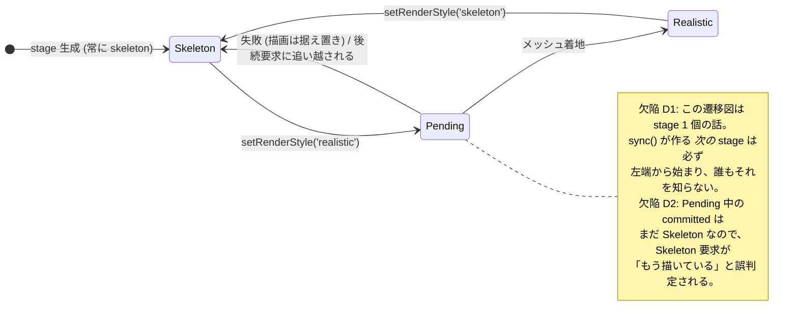

# 148. どちらの腕を描くかはシーンが決める — stage 集合の基数 N に権威が無かった

- Status: Accepted (実装済み 2026-09-22)
- Date: 2026-09-22
- Deciders: yuubae215 (「ここまでの実装内容の検証してください」→ 検証結果を受けて
  「修正 + ADR を起票」)、Claude (pairing)
- Retires: なし — 本 ADR は既存の判断を殺さない。`957b06b` / `6483b09` が足した
  描画スタイル軸 (`ROBOT_RENDER_STYLE`) はそのまま生き、**権威の置き場所だけ**が
  stage から stage 集合へ移る。`RobotStage.setRenderStyle` も消えない (基数 1 側の
  権威として残り、集合がそれを呼ぶ)。
- Supersedes / Superseded by: なし。ADR-141 の「どの腕か」軸 (`ROBOT_MODELS` は
  ちょうど 1 行) には**触れていない** — 本 ADR が扱うのは同じ 1 台をどう描くかで、
  両スタイルの関節原点が数値一致することは `RobotVisualStyleAgreement.test.js` が
  既に焼いている。

## Context — Goal と力学 (§1.2 Goal)

**きっかけ:** 当事者が「ここまでの実装内容の検証してください」と述べた。直前の 2
コミット (`957b06b` UR5e 実メッシュの追加、`6483b09` 180° ズレの修正) は全 CI レーン
green で、ユニット 1386 件・e2e 59 件・統治レーン 8 本すべて通っていた。**それでも
ブラウザには 2 つの欠陥が在った。**

**Goal (解ではなく性質):** *このシーンが描く腕の見た目は 1 つに決まっており、画面に
在るどの腕もそれを描いている。* 「stage にスタイルを配る」は解の形で、持ち上げた
性質がこれ。

**なぜ成り立っていなかったか — 基数に欄が無い (原則 #31):**

`RobotStage` は「自分が描くスタイル」を基数 1 で正しく所有していた。台帳の行も
「stage 1 個につきちょうど 1」と書かれていた。しかし `RobotStageSet` は 0/1/N 台の
容れ物 (ADR-090) であり、**「このシーンはどちらのスタイルか」という基数 N の問いには
誰も答えていなかった**。`RobotStageSet.setRenderStyle` は*その瞬間に生きている* stage
への fan-out にすぎず、集合側は何も覚えない。

**実機で再現した 2 つの症状** (ブラウザに一時プローブを入れて観測。修正後は
`robotAppearance()` が正規の読み戻し):

| # | 操作 | 観測 | 期待 |
|---|------|------|------|
| D1 | `setRobotAppearance('realistic')` → Add ▸ Robot | `["realistic","skeleton"]` | 両方 realistic |
| D2 | `realistic` を await せず直後に `skeleton` | `["realistic"]` (**最後の要求が負ける**) | `["skeleton"]` |

D2 の機序: 冪等ガード `if (style === this._renderStyle) return` が比べているのは
**確定済み**スタイルであって**要求中**のものではない。realistic の load が飛んでいる
あいだ `_renderStyle` はまだ `'skeleton'` なので、それを打ち消すはずの `'skeleton'`
要求が「もう描いている」と判定され、**supersession トークンを上げずに** early return
する。トークン機構 (原則 #24) 自体は正しく書かれていたのに、その手前のガードが黙って
それを飛ばしていた。

**なぜ緑だったか — 証拠の形が構造的に見逃していた:** `node --test` レーンは
`RobotStage` を構築できない (`URDFLoader.parse` が `DOMParser` を要求)。追加された
唯一のテスト `RobotVisualStyleAgreement.test.js` は 2 つの URDF の*データ*だけを見て
おり、`setRenderStyle` の非同期ライフサイクルは**全レーンでカバレッジ 0** だった。
D1 は基数 N でしか現れず (1 台のシーンでは fan-out と宣言が一致する)、D2 は
**同じ要求を 2 回通さないと現れない** (1 回なら確定と要求中は必ず一致する) —
`/whiteboard` §5 が ADR-098→101 の先例として名指ししている形そのもの。

## Options considered

- **A: 集合が宣言を持ち、`sync()` が新しい stage に適用する** — tradeoff: 基数 N の
  権威が 1 箇所に立つ。義務が発火事象 (stage 生成) の側に乗る (原則 #32)。
  `sync()` が毎フレーム呼ばれるので fire-and-forget の promise を 1 つ足すことになる
  (stage 生成時のみ、最大 1 回/ロボット)。
- **B: `RobotStage` のコンストラクタに style を渡す** — tradeoff: 一見すると自然だが、
  スタイルを知っているのは `RobotStageSet` なので結局集合が宣言を持つ必要があり、
  A の一部にしかならない。しかも「生成時にしか決められない」形になり、生成後に
  宣言が変わる経路 (まさに `setRenderStyle`) と二重管理になる。
- **C: `AppController` が sync 後にスタイルを配り直す** — tradeoff: 権威が view の
  外へ漏れる。ADR-087/090 が視覚状態の所有者を view 側に置いた判断と逆行し、
  「誰が配り忘れてもよい」形に戻る (ADR-143 が閉じた欠陥と同型)。
- **D: 現状維持 (コンソール限定機能なので実害が小さい)** — tradeoff: 「一時的だから
  統治しない」は次の UI 追加で必ず表面化する。しかも D2 は将来の UI トグルで
  *普通に起きる操作* (連打) であり、コンソール限定であることは D2 を軽くしない。

## Decision — Strategy (§1.2 Strategy)

**A を採る。加えて、緑を出していた証拠の形そのものを直す。**

- **D1 — 基数 N の権威を `RobotStageSet` に立てる。** `_renderStyle` が「このシーンが
  描くスタイル」の唯一の書き手 (原則 #4)。`sync()` が stage を作った**その場で**
  `stage.setRenderStyle(this._renderStyle)` を呼ぶ — 義務は、それを発火させる事象の側に
  置く (原則 #32)。宣言が `skeleton` のときは冪等に no-op なので、「既定はどちらか」を
  二箇所に書かない。**基数 0 でも宣言は保持される** (0 台のシーンで宣言が消えるのは
  fan-out には表現できない正当な状態)。
- **D2 — 冪等ガードを*確定*ではなく*settled* と比べる。** 「この stage が向かっている
  先」= `pending ?? committed` を純粋関数 `settledStyle` / `isRedundantStyleRequest`
  として `domain/robotVisualStyle.js` に置く (原則 #3 — 判断は純粋、書き込みだけが
  メソッド)。これで `node --test` レーンが**ブラウザ無しでこの規則を問える**。
- **D3 — 未宣言のスタイルで throw する。** 旧実装は
  `style === REALISTIC ? load : buildSkeleton()` の三項演算子だったので、タイポ
  (`'realstic'`) は**skeleton を描いたうえでタイポを `_renderStyle` に記録**していた。
  `assertRenderStyle` が語彙外を拒否する — `EXPLICIT_DEFAULTS` / `PLACEMENT_BY_KIND` /
  `SUPPORT_SURFACE_BY_KIND` と同じ形 (原則 #31)。
- **D4 — 失敗は報告する。** 旧実装は catch して `console.error` し、**resolved promise を
  返していた** = 呼び手に「切り替わった」と「失敗して据え置いた」の区別が無い
  (原則 #11)。reject させる。腕を blank にしない設計は維持する (失敗時は読み込みが
  成功しなかっただけで、描画中の腕には一切触れていない)。集合側は `allSettled` で
  受け、**1 台も切り替わらなかったときは宣言もロールバックする** — どの腕も描いて
  いないスタイルをシーンが名乗るのは、D1 と同じ「宣言 ≠ 実測」の欠陥だから。
- **D5 — 読み戻しを生やす。** `window.__easyExtrude.robotAppearance()` が
  `{declared, drawn}` の **2 レーン**を返す。1 つにまとめない: この欠陥は 2 つが
  食い違っていたことそのものであり、意図のスナップショットなら両方とも緑になる
  (ADR-114「宣言と実測は別レーンで数える」)。`worldSpan()` (ADR-137) /
  `armPreview()` (ADR-144) と同じ手。
- **D6 — 解放を 1 箇所に。** `RobotStage._disposeTree()` が geometry/material を解放する
  唯一の場所。`dispose()` は `_styleLoadToken` を上げるので、**飛行中の load が着地した
  ときに自分で自分を解放する** (旧実装では ~9MB が GC 任せで落ちていた — 原則 #9)。

## Consequences — Evidence と tradeoff (§1.2 Evidence)

- **肯定的:** 「このシーンが描く腕」が 1 つの事実になった。基数 0 (宣言のみ)・1・N
  (全台一致) がすべて表現でき、かつ**読み戻せる**。タイポと未宣言が黙って既定へ
  落ちない。失敗が呼び手に届く。
- **受け入れるコスト / 否定的:**
  - `sync()` が fire-and-forget の promise を 1 つ発行する (stage 生成時のみ)。失敗は
    `console.error` へ落ちる — `sync()` は同期 API (毎フレーム呼ばれ boolean を返す)
    なので await できず、ここだけは報告先がコンソールになる。
  - **部分失敗の扱いは非対称である** (隠さず書く): 全 stage が失敗したときだけ宣言を
    巻き戻し、一部失敗では宣言を保つ。全 stage が同じ URL を取りに行くので実際には
    全失敗が普通の形だが、「一部だけ realistic」の状態は表現でき、次に作られる stage
    は宣言を再試行する。これは判断であって自明ではない。
  - `RobotStage` の非同期ライフサイクルのうち**書き込み側** (material の再 clone、
    pose の引き継ぎ、group への付け替え) は依然として `node --test` から見えない。
    純粋部分だけを引き出したので、見えない範囲は狭まったが 0 にはなっていない。
- **検証 (証拠):** 論証木は `docs/gsn/adr-148-the-scene-not-the-stage-owns-which-arm-is-drawn.gsn`
  (goal ごとの支えの正本はそちら)。実行結果:
  - `src/domain/robotVisualStyle.test.js` — 7 tests pass。純粋規則 (語彙・settled・
    冪等判定) と、**2 回通す**形の回帰を焼く。
  - `e2e/robot-appearance.spec.js` — 5 tests pass。基数 0 の宣言 / 切替の往復 + mm
    parity / **D1 (N=2)** / **D2 (2 要求)** / **D3 (タイポ)**。
  - **負の対照 (主張の本体):** 読み戻し `robotAppearance()` を入れたまま D1/D2 の修正
    2 行だけを戻すと、**ちょうど 3 番と 4 番が落ち、他の 3 本は通る**。テストが
    新しいアクセサではなく欠陥そのものを射ていることの証拠。
  - `pnpm test` 1393 passed / `typecheck` / `build` / `test:e2e` 64 passed 12 skipped /
    `test:stub` 35 / `test:contract` (contractVersion=6 据え置き) / `test:adr` /
    `test:gsn` / `test:gsn-debt` / `test:deferrals` / `test:commit-meta` /
    `test:trailers` すべて green。
  - **契約は 1 バイトも触っていない** — `packages/grasp-contract` / `server/` /
    `core/` / `mocks/graspStub/` に変更なし。これは view 層だけの判断。
- **波及 (blast radius):** `src/domain/robotVisualStyle.js` (純粋規則を追加) ·
  `src/view/robotVisualStyle.js` (再 export) · `src/view/RobotStage.js` ·
  `src/view/RobotStageSet.js` · `src/controller/AppController.js` (読み戻し 1 つ) ·
  `docs/STATE_LEDGER.md` (基数 N の行)。**触っていないと宣言するもの:**
  運動学・TCP seed・reach 包絡 (源は `skeleton_arm.urdf` のまま — ADR-088/141)、
  `ROBOT_MODELS` の基数 1 (ADR-141)、`previewSolution` の唯一入口 (ADR-135 D3)、
  可視性の所有者 (ADR-087)、契約と `contractVersion`。

## Lens notes

- **様態 (BPMN vs CMMN):** スタイル切替は逐次フローではなく**事象駆動**
  (要求・着地・追い越し・dispose)。ゆえに「手順の順序」ではなく**状態と遷移**で
  モデル化した — `committed` と `pending` を分けたのがその帰結で、1 変数に潰していた
  ことが D2 の直接の原因 (ADR-103 が「モード」1 変数に 3 軸を潰していた形と同型)。
- **基数 (§1.4 / 原則 #31):** 台帳の既存行は基数 1 側だけを埋めていた。基数 N 側の
  行が無いことは**台帳を読んでも見えない** — 数えるべきは在る行ではなく、実体が
  取りうる基数のうち**行を持たない基数**である。
- **証拠の形:** 「1 回の切替で確認した」は D2 に対して原理的に無力。要求が毎回同じでも、
  *確定*と*要求中*が食い違う窓は 2 要求目にしか開かない。

## References

- 台帳: `docs/STATE_LEDGER.md` (基数 0/1/N の行 — 本 ADR で N 側を追加)
- ADR-090 (0/1/N 台のロボットと `RobotStageSet` の新設), ADR-141 (「どの腕か」軸 —
  本 ADR は触れない), ADR-143 (宣言された既定が読み込んだシーンへ届かなかった —
  同じ「宣言 ≠ 実測」), ADR-114 (宣言と実測は別レーン), ADR-137 / ADR-144
  (読み戻しアクセサの先例), ADR-103 (1 変数に潰した複数の軸), ADR-101 (同じ要求を
  2 回通さないと出ない欠陥)
