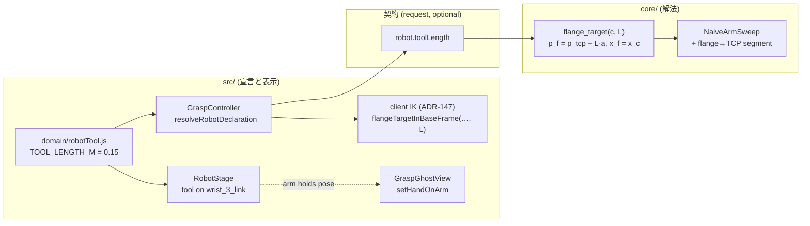

# 150. ツールはフランジに固定され、腕は一度だけ現れる

- Status: Accepted
- Date: 2026-09-23
- Deciders: yuubae215 (当事者の報告と合意), Claude (実装)
- Retires: GREP:src/view/RobotStage.js::_loadRealisticRobot · GREP:core/easy_extrude_core/engine/ur_solver.py::_basis_from_z · GREP:src/robotics/CrossLanguageDerivation.test.js::楽な近道の否定
- Supersedes / Superseded by: なし (ADR-147 の gauge の**意味**を D5 で正す — ADR-147 本体の決定 [閉形式をクライアントでも解く] は不変。ADR-149 の既定 [初見は realistic] も不変で、D1–D3 はその*初見*を 1 回にする)

## Context — Goal と力学(§1.2 Goal)

出所は当事者の `/whiteboard` 依頼 (2026-09-23) の 3 つの報告と 1 つの合意:

1. 「スポーン直後は簡易メッシュで、1 秒かそこらでリアリスティックに切り替わるのが違和感」
2. 「メッシュの構造だけ見ると関節構造がちょっと異なる。DH 的には同じなのでしょうけど」
3. 「ピック検証のときツールがフランジに取り付いてない。普通はフランジに固定されるはず」
4. 合意: ツール長 150mm、吸引でも TCP は同じでよい (「干渉評価の結果は変わるかもね」)

**Goal (解ではなく性質):**

- **G1** — 画面に出る腕の見た目は常に*シーンが宣言したスタイル*だけであり、途中で別の形を見せない。
- **G2** — 2 つのスタイルは同じ腕の 2 つの見た目なので、**シルエット (骨の通り道) も一致**する。
- **G3** — 表示されるツールは**フランジに剛体で付いており**、その先端が把持点 (TCP) に一致する。すなわち**解かれたアームがそのツールを持っている**。

### 観察した原因 (実コード)

| 報告 | 原因 |
|---|---|
| 1 | `RobotStageSet.sync()` が作る stage は同期の skeleton で起動し、直後に `setRenderStyle('realistic')` が ~9MB を **stage ごとに** fetch・parse して差し替えていた。共有キャッシュ無し。 |
| 2 | 関節原点 (DH) は完全一致 (ADR-148 の Agreement test)。違うのは**肩の横オフセット d4=0.1333 をどこに描くか** — 純正 UR は上腕を z=+0.138・前腕を z=+0.007 に置き段差を肩と肘に振り分ける。skeleton は両方 z=0 に置き段差を**全部手首で**立ち上げていた。 |
| 3a | IK は**フランジ = 把持点**で解いていた。ツール長は契約にも `core/` にも存在しなかった。 |
| 3b | グリッパは `GraspGhostView` の**画面 40px 固定のグリフ**で、候補 frame に浮いていた — 腕の子ではなく、実寸でもない。 |
| 3c | **(実装中に発見)** 平行ジョーの閉じ軸 (候補 frame の x — `core/` の把持ゲートが幅を測る軸) は、フランジ座標で `(−cos 2r, sin 2r)` — **roll の 2 倍で回っていた**。剛体のツールを描くと、ほぼ全候補でジョーが判定と違う向きを向く。 |

3c は次の測定で確認した (旧 gauge, `flange_target` の x と `frame_axes` の x のなす角):

| roll | 0° | 45° | 90° | 180° |
|---|---|---|---|---|
| なす角 | 180° | 90° | 0° | 180° |

原因は ADR-147 の gauge がフランジの x を `basisFromZ(+approach)` から**張り直して**いたこと。候補 frame は `basisFromZ(−approach)` から張るので、`bx_c = −bx_f`, `by_c = by_f` となり

$$x_c = -\cos r\, b_x + \sin r\, b_y \;=\; -\cos 2r\; x_f + \sin 2r\; y_f .$$

ADR-147 はこれを「180° 回すだけでは一致しない」と**焼いていた** — 観察は正しかったが、観察されていたのは張り直しの欠陥だった。

## Options considered

### ① スポーン時のちらつき
- **A (採用)**: 実写アセットを 1 つの共有資産にし (1 fetch, stage は clone)、起動時に先読み。宣言スタイルが描けるまで腕を**隠し**、`RobotAppearanceToggle` の固定スロットに `LOADING…` を出す。失敗したら skeleton を見せて toast。
- B: skeleton を半透明で見せたまま実写へクロスフェード — 切り替わり自体が残る (G1 不成立)。
- C: 共有キャッシュだけ — 2 台目以降は即時だが、**1 台目が先読み完了前にスポーンされる**とちらつきは残る (e2e の負の対照が実際にこれを示した)。

### ③ ツール長の置き場所
- A: `gripper.toolLength` — 把持性ゲートのカードは**既定で OFF** (`grip.enabled: false`) なので、既定の探索にはツールが載らない。「ゲートを切るとツールが外れる」は物理的に誤り。
- **B (採用)**: `robot.toolLength` — **取付けの事実**として常に宣言。ハンド種別と独立 (当事者の「吸引でも TCP は同じ」と一致)。request 側 optional 追加なので contractVersion 不変 (ADR-083/084)。
- C: 表示だけ (グリフをフランジの子にする) — IK はフランジ = 把持点のままなので、**指が把持点を 150mm 突き抜ける**。見た目を直して嘘を増やす。

### ③' gauge (3c)
- **A (採用)**: フランジ = 候補 frame を**自身の x 軸まわりに 180° 回した固定の取付け** (x そのまま、y・z 反転)。
- B: 現状維持してツールを roll に合わせて回す — 剛体でないツールを描くことになり G3 と矛盾。

## Decision — Strategy(§1.2 Strategy)

- **D1 共有アセット** — `createSharedAsset(load)` (純粋, `domain/robotVisualStyle.js`) が `idle → loading → ready | failed` を持ち、失敗は非 sticky (次の要求で再試行)。`view/realisticRobotAsset.js` が 1 回だけ load し、stage には `template.clone()` (関節は自前、geometry は共有 — `userData.sharedGeometry` で `_disposeTree` が geometry を解放しない)。`RobotStageSet` の生成時に先読みする。状態機械は `docs/STATE_TRANSITIONS.md` §Realistic asset。
- **D2 初見** — `RobotStage` は生成時に `declaredStyle` を受け取り、skeleton 以外なら skeleton を**構築したまま隠す** (アクセサは初フレームから動く)。宣言スタイルが着地したら 1 度だけ表示。load が失敗したら skeleton を表示してから reject を上げる (**不可視のまま残さない** — 原則 #11)。可視性の書き手は分離: group (`setVisible`) = Outliner の目、robot ノード = stage の初見 (原則 #4)。
- **D3 読み込み表示** — `RobotStageSet.subscribe()` が `loading` (0→1 / 1→0 の辺) と `adoptFailed` を発行 (原則 #5)。`AppController` が `uiStore.robotAppearanceLoading` と error toast へ中継し、`RobotAppearanceToggle` が同じスロットで `LOADING…` を出す (原則 #15)。
- **D4 ツール** — `robot.toolLength` (m)。`core/`: `flange_target(c, L)` がフランジを TCP から approach の逆向きに L 戻し、腕スイープは**フランジ→TCP 区間**をリンクと同じ問いにかける。front: `_resolveRobotDeclaration` が常に `TOOL_LENGTH_M` を宣言し (リクエストもクライアント IK も同じ経路を読む — §1.1)、`RobotStage` が `toolParts(L)` を `wrist_3_link` の子として描く (指先 = z=L を**構成で**保証)。腕が候補を持っているとき (posed かつ visible) ゴーストはハンドを描かない (`setHandOnArm`)。
- **D5 gauge** — $x_f = x_c,\; z_f = a,\; y_f = z_f \times x_f \;(= -y_c)$, $p_f = p_{tcp} - L\,a$。変わるのは各枝の θ6 だけで、リンク原点・ツール区間は不変。ただし代表解の選び方 (関節総移動量最小, ADR-127 D5) は θ6 を含む和なので、**代表の枝が変わる候補がある** (下記)。`ur_solver._basis_from_z` (pose_codec の規則の写し) は不要になり削除。
- **D6 シルエット** — `skeleton_arm.urdf` の **visual のみ**を移動: 上腕の骨 z=0.138、前腕の骨 z=0.007、肘の knuckle が両者を繋ぎ、手首の立ち上がりは 0.007→0.1333。関節原点は 1 バイトも触らない。

## Consequences — Evidence と tradeoff(§1.2 Evidence)

- 肯定的:
  - スポーンは 1 回の見た目で現れる。2 台目以降は fetch 無し (clone のみ)。
  - ツールの先端 = 解いた TCP、閉じ軸 = 判定した軸 — 画面・判定・解が同じツールを持つ。
  - ツールが隣のワーク・トレーの壁に刺さる候補は棄却される (当事者の予想どおり干渉評価が変わる)。
- 受け入れるコスト / 否定的:
  - **ペデスタル受け入れ値が 10 → 4 に変わった** (`templates/single-arm-pedestal-cell`)。36 候補中 18 で代表の枝が変わり、判定が反転したのは 8 件 (7 件は上腕が台へ潜る枝 [肩 +115°前後] から潜らない枝 [−125°前後] へ、1 件は逆)。旧値は*誤った x 軸に対して測った θ6* が代表を決めていた数である。`test_arm_sweep_rejects_the_elbow_that_dives_into_the_pedestal` は代表解に頼るのをやめ、**潜る枝を名指しで**選ぶ形に直した (検査したい性質と無関係な理由で前提が崩れたため)。
  - 起動時に ~9MB を先読みする (ロボット 0 台のシーンでも)。ADR-149 が realistic を既定にした時点で受け入れたコストの前倒しであり、skeleton を宣言したシーンでは先読みしない。
  - 共有 geometry はアプリ寿命のあいだ保持される (キャッシュ = 解放しない、が宣言された挙動)。
  - `server/src/grasp/contract.request.d.ts` の再生成は ADR-133 の box 障害物の型も拾った (既存のドリフト — 導出物は手で半分だけ再生成できない)。response 側 `.d.ts` の既存ドリフトは本 PR の範囲外として触れていない。
- 検証(証拠): 論証木 `docs/gsn/adr-150-the-tool-is-bolted-to-the-flange-and-the-arm-appears-once.gsn` が goal ごとの支えの正本。主なもの:
  - e2e `a spawned arm never shows the skeleton before its realistic first look` — URDF の応答を**スポーン後まで保留**し、全アニメーションフレームで `shown` を標本化。**負の対照**: 隠す規則を無効化すると落ちる (`shown` が `[null]` でなく `["skeleton"]`)。保留しない版は隠す規則を無効化しても緑だった (先読みが先に着く) — そのため保留する形にした。
  - e2e `when the mesh cannot load…` — 404 で skeleton が見え、toast が出て、`loading` が false に戻る。
  - `domain/robotVisualStyle.test.js` — 遷移表、N 要求で 1 load、後からの要求で再 load 無し、失敗の非 sticky。
  - `RobotVisualStyleAgreement.test.js` — 上腕/前腕の骨の平面が UR メッシュと一致。**負の対照**: 旧 URDF で 2 件落ちる。
  - `CrossLanguageDerivation.test.js` / `core/tests/test_ur_kinematics.py` — フィクスチャ全 24 件が `toolLength` を明示 (0 と非 0 を両方含む)、フランジ = 候補 frame の x 軸 180° 回転 + L 戻し (最大差 < 1e-9)、toolLength を無視した写しは一致しない。
  - `core/tests/test_engine.py` — ツール区間にだけ触れる障害物は宣言時のみ棄却 (対照: L=0 は通す)、宣言は solver と sweep に同じ長さで渡る、負の長さは拒否。
  - `src/domain/robotTool.test.js` — 指先 = TCP、ジョーは ±X、`wrist_3_link` の frame = DH フランジ frame (姿勢込み — FK フィクスチャは位置しか見ていなかった)。
  - `GraspController.test.js` — ツール先端が候補位置に機械精度で一致 / ハンドは posed かつ visible の腕が持つときだけ隠れる、solved→unsolved→solved で毎回追従。
  - `packages/grasp-contract` — `robot.toolLength` を受理、負を拒否 (contractVersion=6 据え置き)。
- 波及(blast radius): `core/engine/{ur_solver,feasibility,pipeline}.py`、request schema (`robot` に 1 プロパティ)、`src/robotics/graspPoseGauge.js`、`GraspController`、`RobotStage` / `RobotStageSet` / 新 `realisticRobotAsset.js`、`GraspGhostView`、`RobotAppearanceToggle` / `uiStore` / `UIViewBridge` / `AppController`、`public/robot/skeleton_arm.urdf` (visual のみ)。**触らなかった**: response 契約、`Retires` 以外の ADR-147 の決定、ADR-149 の既定、関節原点、TCP seed (DEF-044)。

## 残し (Deferred)

- **ピック検証を「単体ワーク」と「トレー内の全ワーク」に分ける** (当事者依頼の 4 点目) — 別 PR。**当事者の決定 (2026-09-23): フロントは案 B まで** = ワークごとに既存の `/grasp-search` を投げて「今取れるか」を並べ、順序は答えない。トレー検証は**バックエンド接続時だけ**開放する。`/pick-sequence` を契約まで配線する案 A は採らない。→ **DEF-043**。
- **シーンの `tcp` CoordinateFrame はフランジ位置に seed されたまま** (ADR-088 の `TCP_LOCAL_SEED`)。ツール先端へ動かすと seed の導出・既存シーン・`tcpOrientation` の意味に波及するので本 ADR では触れていない。→ **DEF-044**。

## Lens notes

- 様態: スポーン → 読み込み → 表示は事象駆動 (CMMN) — load の完了/失敗という事象で状態が動く。ゆえに逐次フローではなく資産ごとの状態機械で書いた (D1)。
- 状態台帳: 「実写アセット」(新行, 4 状態 → 状態機械)、「腕の初見」(新行, 2 状態)、「ロボットのツール」(新行, 基数 0/1) を `docs/STATE_LEDGER.md` に同じコミットで追加。
