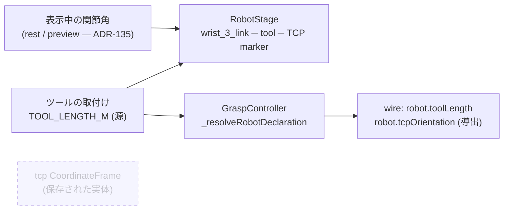

# 151. TCP はツールの取付けから導出する — シーンに独立して保存しない

- Status: Proposed
- Date: 2026-09-23
- Deciders: yuubae215 (推奨案に合意・本セッションは起票のみと指示), Claude (起票)
- Retires: GREP:src/view/robotSkeleton.js::TCP_LOCAL_SEED
- Supersedes / Superseded by: なし (ADR-084 §2 / ADR-085 / ADR-088 の「`tcp` は base の子の CoordinateFrame 実体で、seed は休止姿勢のフランジ」を**置き換える予定** — 本 ADR が Accepted になる PR で、それらの ADR の該当節に `Superseded by ADR-151` を付す)

## Context — Goal と力学(§1.2 Goal)

出所: ADR-150 (PR #409) のピック検証スクリーンショットで、当事者が「**tcp のラベルの位置とロボットゴーストの tcp の位置が離れている**」と指摘し、「**SSOT は設計原則ですよ**」と述べた。

**Goal (解ではなく性質): 「TCP はどこか」という事実の源が 1 つであり、画面に出る TCP の印・探索に渡る TCP・腕が持つツールの先端が常に同じ点を指す。**

### 観察 (実コード, 2026-09-23)

離れて見えた原因は**2 つ重なっている**:

1. **`tcp` フレームは休止姿勢に固定された*保存された実体*である。** `robotRole:'tcp'` の CoordinateFrame が `robot_base` の子として、ADR-088 の `TCP_LOCAL_SEED` (休止姿勢でのフランジ位置, `view/robotSkeleton.js`) に置かれる。候補を選んで腕がプレビュー姿勢を取っても、この実体は動かない — スクリーンショットで大きく離れていたのは主にこちら。
2. **休止姿勢ですら 150mm ずれる。** ADR-150 D4 でツール (150mm) がフランジに付き IK はツール先端で解くようになったが、seed はフランジのまま (ADR-150 で DEF-044 として宣言)。

これは**同じ事実が 3 か所に書ける**構造である (核 §1.1 のトリガ):

| 源 | 内容 | 書き手 |
|---|---|---|
| `tcp` CoordinateFrame (シーン・Layout DSL・`.ctx.json` に保存) | 休止姿勢のフランジ位置 + 姿勢 (seed は恒等) | seed / ユーザーの編集 / 読み込み |
| `TOOL_LENGTH_M` (ADR-150) | フランジ → TCP = +Z 方向に 0.15 m | 定数 |
| 腕の FK (表示中の関節角) + ツール | 画面の腕が実際に持っているツール先端 | `RobotStage` (rest / preview — ADR-135) |

しかも 1 行目は**探索に何も効いていない**。`tcp` 実体がワイヤに運ぶのは `robot.tcpOrientation` (姿勢のみ) で、`core/` がそれを読むのは運動学未宣言時の素朴 cone 判定 (`NaiveIkSolver`) だけ。出荷モデル (UR5e) では front が常に `robot.kinematics` を宣言するので解析解 IK が使われ、`tcpOrientation` は読まれない。**画面に出ていて、編集でき、保存され、何も決めていない** — 最も気づきにくい第二の源の形 (ADR-103 の「退役の腐敗は緑を出す」と同型)。

### 力学

- **向きの問題**: `tcp` 実体を*腕に追従させる*には、プレビュー (view 状態, ADR-135) の関節角でシーンの実体の姿勢を書くことになる。表示が保存データを書く逆流 (核 §1.1 の依存方向違反、原則 #4 の第二の書き手)。
- **基数**: `tcp` は ADR-090 以降「ロボット 1 台につき 0 か 1」(`Robot.tcpFrame` は null 可)。取り除いても基数の語彙は既に在る。
- **参照の広さ**: `src/` で 9 ファイル (`robotFrames` / `SceneService` / `AddRobotCommand` / `GraspController` / `robotSkeleton` / `SceneView` / `OutlinerBridge` / `CoordinateFrame` / `uiStore`)、テスト・e2e で 5 ファイル、`tcp` フレームを含むサンプル 5 本 (`examples/layout_pick_place_cell.json` ほか)。

## Options considered

- **A (採用 — 当事者合意)**: **TCP の源をツールの取付け (フランジ → TCP) ただ 1 つにし、`tcp` はそこから導出して描くだけにする。** 画面の TCP の印は `RobotStage` がツールと同じく `wrist_3_link` の子として描くので、休止でもプレビューでも**構成上**ツール先端に居る。`tcp` はシーンの独立した実体ではなくなり、ユーザーは直接動かせない。既存シーンに保存された `tcp` は読み込み時に採用しない。
  - tradeoff: 保存形式と Outliner から `tcp` 行が消える (発見可能性 — 原則 #16 は viewport の印で担う)。既存サンプル 5 本の移行が要る。
- B: **`tcp` 実体を源にしてツール長を導出する** (休止姿勢のフランジ → `tcp` の相対変換 = ツールの取付け)。`tcp` を動かすとツール長が変わる直感的な操作が残る。
  - 却下理由: `tcp` は休止姿勢の実体なので**プレビュー中のずれ (原因 1) が解消しない**。解消するにはプレビューの関節角で実体を書くことになり、表示が保存データを書く逆流になる。加えて、ツールの取付けが任意の 6 自由度になり、契約の `robot.toolLength` (+Z スカラー) では表せなくなる。
- C: **`tcp` 実体を残し、姿勢だけ休止姿勢の FK + ツールから導出して読み取り専用にする**。
  - 却下理由: 保存される限り読み込んだ値は第二の源のまま (無視するなら保存する意味が無い)。プレビュー中は「休止の `tcp`」と「腕の先端」の 2 つの TCP が画面に並び、ずれ (原因 1) は残る。
- D: 現状維持 (DEF-044 のまま seed だけ直す)
  - 却下理由: 原因 2 しか直らず、3 つの源は 3 つのまま。

## Decision — Strategy(§1.2 Strategy)

- **D1 源は 1 つ** — 「TCP = フランジ ∘ ツールの取付け」。取付けの源は `domain/robotTool.js` (今は `TOOL_LENGTH_M`、+Z スカラー)。**TCP の位置・姿勢を独立に保存する場所を持たない。**
- **D2 画面の TCP は腕の子** — `RobotStage` がツールと同じ `_attachTool` の中で、ツール先端 (z = L) に TCP の印 (軸三脚 + ラベル `tcp`) を `wrist_3_link` の子として置く。休止・プレビュー・スタイル切替のどれでも、印はツール先端に**構成で**居る (比較・同期のコードを持たない)。
- **D3 `tcp` 実体を退役** — `SceneService` は `tcp` CoordinateFrame を生成しない (`AddRobotCommand`・`ensureRobotFrames`)。`Robot.tcpFrame` は常に null になり、`robotFrames` の `tcp` 解決は**読み込み時の移行経路**だけに残す。
- **D4 移行** — 既存シーン / Layout DSL / `.ctx.json` の `robotRole:'tcp'` (と旧名 `tcp`) の実体は読み込み時に**採用せず取り除き、取り除いた件数を警告として提示**する (原則 #11 — 無言で消さない)。サンプル 5 本は同じ PR で書き換える。
- **D5 ワイヤ** — `robot.tcpOrientation` は `tcp` 実体からではなく、**休止姿勢の FK ∘ ツールの取付け**の世界姿勢から導出する (素朴 cone 判定の後方互換のため送り続ける。契約は不変、contractVersion=6 のまま)。
- **D6 Outliner** — `tcp` 行は出さない (導出物は実体ではない)。ロボットの行を選べば viewport で TCP の印が見える、を発見経路とする。

### 実装時に決めることとして残すもの

- TCP の印の見た目 (軸三脚のサイズは原則 #27 の「画面 px 目標 + world 上限」の対で決める)。
- ツールの取付けを 6 自由度 (オフセット + 姿勢) に広げるか — 広げる場合は request の optional 追加で済むか、`toolLength` を置き換えるか (response は不変)。**本 ADR の範囲では +Z スカラーのまま**。

## Consequences — Evidence と tradeoff(§1.2 Evidence)

- 肯定的:
  - TCP の源が 1 つになり、画面の印・探索に渡る姿勢・ツール先端が同じ点を指す (Goal)。
  - プレビュー中も印が腕と一緒に動く — 表示が保存データを書く経路を作らずに。
  - 「編集できるが何も決めていない」実体が消える。
- 受け入れるコスト / 否定的:
  - 保存形式から `tcp` が消える (読み込み時の移行 + 警告で吸収)。
  - `tcp` を手で動かしてツールの向きを表す操作は無くなる (ADR-084 §3 が想定していた「CF 編集で `tcpOrientation` を向け直す」操作)。出荷モデルでは効いていなかった操作である。
  - Outliner から `tcp` 行が消える。
- 検証(証拠): 論証木 `docs/gsn/adr-151-the-tcp-is-derived-from-the-tool-mount-not-stored-in-the-scene.gsn` が goal ごとの支えの正本。**本 ADR は起票のみで、証拠はすべて予定** — 予定している形:
  - e2e: 候補を選んで腕がプレビュー姿勢を取ったとき、TCP の印の世界位置 = 候補の位置 (許容差内)。**同じ要求を 2 回** (候補 #1 → #2 → 選択解除) 通し、毎回追従すること。
  - unit: `tcpOrientation` の導出値 = 休止姿勢の FK ∘ 取付けの姿勢 (機械精度)。
  - census: シーンに `robotRole:'tcp'` の実体が**0 個**であること (種類を列挙して数える — 原則 #31)、移行で取り除いた件数が警告として出ること。
  - `Retires:` の `TCP_LOCAL_SEED` が消えていること (`pnpm test:adr` が Status 遷移で問う)。
- 波及(blast radius): `src/domain/robotFrames.js`, `src/service/SceneService.js`, `src/command/AddRobotCommand.js`, `src/controller/GraspController.js`, `src/view/{robotSkeleton,SceneView,OutlinerBridge,RobotStage}.js`, `src/domain/CoordinateFrame.js` (`robotRole` の語彙), `src/store/uiStore.js`, サンプル 5 本, e2e (`smoke` の robot 削除系ほか)。**触らない**: 契約 (request/response とも)、`core/`、ツール長の値。

## 残し (Deferred)

- 本 ADR は**起票のみ** (当事者の指示, 2026-09-23)。実装は別セッション・別 PR。ADR-150 の DEF-044 (seed がフランジのまま) は本 ADR の実装で消える — DEF-044 の ticket を ADR-151 へ付け替えた。

## Lens notes

- 核 §1.1 (真実の源は一つ): 同じ事実が 3 か所に書ける構造がトリガ。採用案は源を 1 つに畳み、残りを導出にする。
- 核 §1.1 依存方向: 却下案 B/C の決め手は「表示 (view 状態) がモデルを書く」逆流を作るかどうか。
- 状態台帳: `docs/STATE_LEDGER.md` の「ロボット CF の TF ロール」行。`tcp` の基数は「ロボット 1 台につき 0 か 1」→ 実装後は「**実体としては常に 0** (導出の印は腕ごとに 1)」。本 PR ではその行に予定を注記し、行の書き換えは実装 PR で行う (起票のみの本 PR では状態は変わっていない)。
