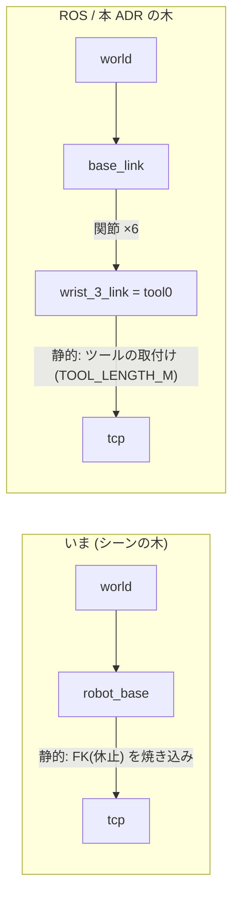
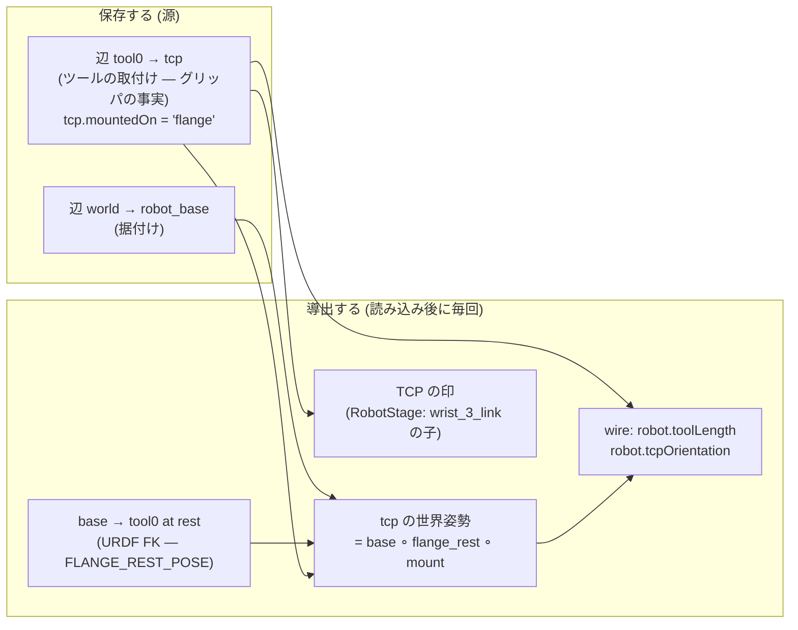

# 151. TCP はツールの取付けから導出する — シーンに独立して保存しない

- Status: Accepted (2026-09-23 実装 — 起票時の案 A を実装セッションの当事者対話で A′ へ改訂。下の「改訂」節)
- Date: 2026-09-23
- Deciders: yuubae215 (起票時に推奨案へ合意 → 実装セッションで a/b/c と「tcp は共有点、インタフェース定義として残す」を決定), Claude (起票・実装)
- Retires: GREP:src/view/robotSkeleton.js::TCP_LOCAL_SEED
- Supersedes / Superseded by: ADR-084 §2 / ADR-085 / ADR-088 の「`tcp` の変換は base 相対で、seed は休止姿勢のフランジ位置」を置き換える (各 ADR の該当節に `Superseded by ADR-151` を付した)。`tcp` という実体・ロール・基数 (ADR-090) は置き換えない

## Context — Goal と力学(§1.2 Goal)

(この節は起票時のまま。決定は下の「改訂」節で起票時の案 A から A′ へ改めた。)

出所: ADR-150 (PR #409) のピック検証スクリーンショットで、当事者が「**tcp のラベルの位置とロボットゴーストの tcp の位置が離れている**」と指摘し、「**SSOT は設計原則ですよ**」と述べた。

**Goal (解ではなく性質): 「TCP はどこか」という事実の源が 1 つであり、画面に出る TCP の印・探索に渡る TCP・腕が持つツールの先端が常に同じ点を指す。**

### 観察 (実コード, 2026-09-23)

離れて見えた原因は**2 つ重なっている**:

1. **`tcp` フレームの親が間違っている — 木に腕の関節の辺が無い。** `robotRole:'tcp'` の CoordinateFrame は **`robot_base` の直接の子**で、その辺 (base → tcp) には休止姿勢の順運動学の結果 (ADR-088 の `TCP_LOCAL_SEED` = 休止姿勢でのフランジ位置, `view/robotSkeleton.js`) が**静的変換として焼き込まれている**。フレーム自体は木の一員として正しく振る舞っている (base を動かせば一緒に動く) が、base と tcp の間にあるはずの 6 つの関節の辺を飛ばしているので、関節角が変わっても tcp の世界姿勢は変わらない。候補を選んで腕がプレビュー姿勢を取っても印が動かないのはこのため — スクリーンショットで大きく離れていたのは主にこちら。 (起票初版はこれを「休止姿勢に固定されたフレーム」と書いたが不正確だった。下の「TF の語彙で言い直す」を参照)
2. **休止姿勢ですら 150mm ずれる。** ADR-150 D4 でツール (150mm) がフランジに付き IK はツール先端で解くようになったが、seed はフランジのまま (ADR-150 で DEF-044 として宣言)。

### TF の語彙で言い直す (当事者の問い, 2026-09-23)

当事者の問い: 「ROS の TF のように、剛体ツリーがフレームと同型概念ではなかったか?」— **そのとおりで、本 ADR の問題はその言葉で最も正確に書ける。**

- TF では、フレームは木の節点であり、**保存されるのは辺 (親 → 子の変換) だけ**である。節点の世界姿勢は常に根からの辺の合成で**導出**される。辺には関節で変わるもの (`joint_states`) と固定のもの (静的変換) がある。
- UR の標準の木は `base_link → shoulder → … → wrist_3_link → tool0 (flange) → tcp` で、**`tool0 → tcp` がツールの取付けという 1 本の静的な辺**になる。関節角が変われば tcp の世界姿勢は自動的に変わる。フレームが「どこかの姿勢に固定される」ことは TF には無い。
- このアプリの木は **`world → robot_base → tcp`** で、腕の 6 関節の辺が**シーンの木に存在しない** (腕の木は `RobotStage` が読み込む URDF の中にだけある)。そのため `robot_base → tcp` という 1 本の辺が、「6 つの関節の辺を休止姿勢で合成した結果」+「ツールの取付け」を**定数として代わりに持っている**。

つまり欠陥は「フレームという概念の誤用」ではなく、**導出されるべき値 (休止姿勢の順運動学) を辺として保存したこと**であり、それが第二の源になっている。これは TF の規律 (保存するのは辺だけ) を破っている。

これは**同じ事実が 3 か所に書ける**構造である (核 §1.1 のトリガ):

| 源 | 内容 | 書き手 |
|---|---|---|
| `tcp` CoordinateFrame の辺 `robot_base → tcp` (シーン・Layout DSL・`.ctx.json` に保存) | 休止姿勢の FK を焼き込んだ静的変換 (姿勢の seed は恒等) | seed / ユーザーの編集 / 読み込み |
| `TOOL_LENGTH_M` (ADR-150) | フランジ → TCP = +Z 方向に 0.15 m | 定数 |
| 腕の FK (表示中の関節角) + ツール | 画面の腕が実際に持っているツール先端 | `RobotStage` (rest / preview — ADR-135) |

しかも 1 行目は**探索に何も効いていない**。`tcp` 実体がワイヤに運ぶのは `robot.tcpOrientation` (姿勢のみ) で、`core/` がそれを読むのは運動学未宣言時の素朴 cone 判定 (`NaiveIkSolver`) だけ。出荷モデル (UR5e) では front が常に `robot.kinematics` を宣言するので解析解 IK が使われ、`tcpOrientation` は読まれない。**画面に出ていて、編集でき、保存され、何も決めていない** — 最も気づきにくい第二の源の形 (ADR-103 の「退役の腐敗は緑を出す」と同型)。

### 力学

- **向きの問題**: `tcp` 実体を*腕に追従させる*には、プレビュー (view 状態, ADR-135) の関節角でシーンの実体の姿勢を書くことになる。表示が保存データを書く逆流 (核 §1.1 の依存方向違反、原則 #4 の第二の書き手)。
- **基数**: `tcp` は ADR-090 以降「ロボット 1 台につき 0 か 1」(`Robot.tcpFrame` は null 可)。取り除いても基数の語彙は既に在る。
- **参照の広さ**: `src/` で 9 ファイル (`robotFrames` / `SceneService` / `AddRobotCommand` / `GraspController` / `robotSkeleton` / `SceneView` / `OutlinerBridge` / `CoordinateFrame` / `uiStore`)、テスト・e2e で 5 ファイル、`tcp` フレームを含むサンプル 5 本 (`examples/layout_pick_place_cell.json` ほか)。

## 改訂 — 起票時の案 A から実装時の A′ へ (2026-09-23, 当事者対話)

起票時の案 A は「**`tcp` 実体を退役**し、TCP の源を `TOOL_LENGTH_M` (+Z スカラー) にする」だった。実装前の俯瞰で当事者が 3 点を指摘し、決定を改めた。**履歴を消さないため (原則 #19) 起票時の案はそのまま下の Options に残す。**

| 問い (当事者) | 分かったこと | 決定への影響 |
|---|---|---|
| 「`TOOL_LENGTH_M` は姿勢情報を持つのか? オフセットやアライメントが要る TCP もある」 | 持たない。+Z スカラーでは横にずれた TCP・回転した TCP を表せない。しかも `tcp` を退役させると**向きを書ける唯一の場所**が消え、後で 6 自由度化するときに源をもう一度移すことになる | 源を **6 自由度の取付け `T_tool0→tcp`** にし、**ロボットごとに保存**する (D1) |
| 「tcp が Context に登場しなくなるなら、グリッパの情報を毎回定義し直すことになる。保存したくなる」 | 取付けを保存するなら、それは TF で言う**辺 `tool0 → tcp`** そのもの。起票時の A も文章では「tcp を正しい親 (tool0) の子に付け直す」と書きながら、決定では実体ごと退役させていた — 自己矛盾だった | `tcp` を残し、**変換の意味**を base 相対から取付けへ変える (D2) |
| 「tool0 はロボットのもの、tcp はグリッパとロボットが共有するもの。共有点はインタフェース定義として残すべき」「tool0 → tcp は機種に依らないのでは?」 | そのとおり。tool0 (ISO 9409-1 のフランジ) は**機械的**な接点でロボットが持つ。tcp は**機能上**の接点で、ロボット (IK の目標) とグリッパ (把持の点) が同じ名前で指す。`tool0 → tcp` はフランジ座標系が規格で揃う限り機種に依存しない (機種で変わるのは導出値 `base → tcp` のほう)。俯瞰で私が「機種が保存されていないので同じファイルから違う TCP が復元される」と書いたのは、この 2 つを混同した誤りで撤回した | `tcp` = インタフェース定義。Context の関係から名前で参照できる (起票時に懸念した「関係の付け替え」は不要になった) |

## Options considered

- **A′ (採用 — 実装時の当事者合意)**: `tcp` を残し、その**保存する変換を取付け `tool0 → tcp` (6 自由度) に変える**。世界姿勢は base ∘ 休止姿勢のフランジ ∘ 取付け として常に導出し、画面の印は腕 (`RobotStage`) が `wrist_3_link` の子として描く。`tcp` 自身のフレームビューは描かない。
  - tradeoff: 取付けの**編集**はワイヤ・`core/` が 6 自由度を受け取れるようになるまで開けない (第一段は +Z のみ受け付け、編集は理由つきで拒否 — DEF-045)。
- A (起票時の採用案 → 改訂で却下): `tcp` 実体を退役し、源を `TOOL_LENGTH_M` にする。
  - 却下理由: 上の改訂表。姿勢を表せない源に畳むと 6 自由度化で源をもう一度移すことになり、ロボットとグリッパの共有点が Context から消える。
- B: `tcp` 実体を源にしてツール長を導出する (休止姿勢のフランジ → `tcp` の相対変換 = ツールの取付け)。
  - 却下理由: `tcp` の親は `robot_base` のままなので**プレビュー中のずれ (原因 1) が解消しない**。解消するにはプレビューの関節角で実体を書くことになり、表示が保存データを書く逆流になる。
- C: `tcp` 実体を残し、姿勢だけ休止姿勢の FK + ツールから導出して読み取り専用にする。
  - 却下理由: 保存される限り読み込んだ値は第二の源のまま。プレビュー中は「休止の `tcp`」と「腕の先端」の 2 つの TCP が画面に並ぶ。
- D: 現状維持 (DEF-044 のまま seed だけ直す)
  - 却下理由: 原因 2 しか直らず、3 つの源は 3 つのまま。

## Decision — Strategy(§1.2 Strategy)

- **D1 源は辺 `tool0 → tcp` ただ 1 つ。** グリッパが持つ事実で、ロボットごとに `tcp` フレームの `translation` / `rotation` として保存する (mm / 四元数、フランジ座標系)。`mountedOn: 'flange'` がそれを宣言する (scene 1.3 / layout 1.0 / context 0.5 のスキーマに追加 — 閉じた語彙 `['flange']`)。`TOOL_LENGTH_M` はロボット追加時の**既定値**に退いた (`DEFAULT_TOOL_MOUNT`)。
- **D2 `tcp` はインタフェース定義として残る。** tool0 (機械的接点) はロボットが持ち URDF から導出する — 保存しない。tcp (機能上の接点) はロボットとグリッパが共有し、Context の関係から名前で参照できる。シーン上の親は従来どおり `robot_base` (ロボットとの対応づけ)。世界姿勢は `SceneService._throughFlange` が base ∘ `FLANGE_REST_POSE` ∘ 取付け と合成する — 腕の関節の辺がシーンの木に入る唯一の場所で、導出であって保存ではない。
- **D3 画面の TCP は腕が描く 1 つだけ。** `RobotStage._attachTool` がツールと TCP の印 (REP-103 の軸三脚 + ラベル `tcp`) を `wrist_3_link` の子として取付けの位置・姿勢に置く。休止・プレビュー・スタイル切替のどれでも**構成上**ツール先端に居る (比較・同期のコードを持たない)。`tcp` のフレームビューは描かない (`applyEntityVisibility`)。Outliner の `tcp` 行の目は**ロボットの目を映す** (軸を base から導出 — 行が「非表示」と言いながら印が見える、を作らない。ADR-096 G1)。`tcp` の目を押すと「腕と一緒に描かれる」と案内する。
- **D4 移行。** `mountedOn` を持たない `tcp` (旧形式 — 値は base 相対の休止姿勢) は、読み込み時 (`_upgradeLegacyRobotFrames`) に**実体・id・名前・関係を保ったまま**値だけを既定の取付けへ置き換え、件数を警告として出す (原則 #11)。**変換はしない** — 旧値は探索に効いておらず、任意の base 相対値を変換すると誰も宣言していないオフセット・回転つきの取付けを製造するため。サンプル 5 本は同じ PR で書き換えた。
- **D5 ワイヤ (契約不変、contractVersion=6 のまま)。** `robot.toolLength` は取付けの +Z 長から、`robot.tcpOrientation` は D2 の世界姿勢から導出する。どちらもロボット自身の `tcp` を読む (`toolMountOf` — 宣言と描画の 1 つの読み手)。
- **D6 第一段の制限。** ワイヤが言えるのは +Z スカラーだけなので、+Z 方向でない取付けは探索を**理由つきで止める** (`TOOL_MOUNT_NOT_AXIAL_REASON`)。取付けの手編集 (移動・回転・N パネル・再親子化・モバイルのツールバー) も、すべての入口が同じ述語 `toolMountEditBlockedReason` を問い理由を出す。削除はできる (D7)。
- **D7 `tcp` の無いロボット。** グリッパとの接点が未宣言の状態 (基数 0 は正当)。探索は `TOOL_MOUNT_UNDECLARED_REASON` を出して止まる — 150 mm や 0 を補わない (原則 #31: 「宣言された値」と「誰も考えなかった値」を区別不能にしない)。腕はツールも印も描かない。

## Consequences — Evidence と tradeoff(§1.2 Evidence)

- 肯定的:
  - TCP の源が 1 つになり、画面の印・探索に渡るツール長と姿勢・ツール先端が同じ点を指す (Goal)。プレビュー中も印が腕と一緒に動く — 表示が保存データを書く経路を作らずに。
  - 取付けが 6 自由度の形で保存されるので、第二段 (ワイヤ・`core/` の 6 自由度化) で源を移し直す必要が無い。
  - Context の関係 (`f_robot → tcp` ほか) はそのまま有効。
- 受け入れるコスト / 否定的:
  - 取付けは第一段では編集できない (表示と理由のみ)。`tcp` を手で動かしてツールの向きを表す操作 (ADR-084 §3 の想定) は第二段まで無い — 出荷モデルでは効いていなかった操作である。
  - 旧形式ファイルの `tcp` の値は捨てる (件数を警告)。
  - `SceneService` の TF 合成に「flange-mounted tcp だけ親の測り方が違う」分岐が 1 つ入った (`_throughFlange` に集約)。
- 検証(証拠): 論証木 `docs/gsn/adr-151-the-tcp-is-derived-from-the-tool-mount-not-stored-in-the-scene.gsn` が goal ごとの支えの正本。実行したもの:
  - e2e `e2e/tcp-mount.spec.js` (7 本): 独立な 2 経路 (シーンの TF 合成 = 純粋な URDF FK / 腕の印 = URDFLoader の木から THREE が合成した行列) の一致を、追加直後・両スタイル・ロボットを 2 回動かした後・旧形式 1 件/2 件の読み込み後に問う。編集入口の拒否と理由、`tcp` 行が腕の目を映すこと、現行形式の読み込みでは警告が出ないこと (正当な 0)。
  - e2e `e2e/grasp-stub.spec.js` S12 (stub レーン): 候補 #1 → #2 → #1 と同じ要求を 2 回通し、腕が候補を取るたびに印の世界位置 = 候補の TCP (1 mm 以内)、探索のやり直しで rest に戻る。
  - 突然変異で検査が効くことを確認: 印をフランジに置く → e2e 1 本目が 150 mm の乖離で落ちる / 印を腕の根に付ける → S12 が落ちる。
  - unit: `robotTool.test.js` (取付け → ツール長、非軸方向の拒否、印 = 指先、ギャップ 3 種)、`robotFrames.test.js` (tcp の 2 形の網羅)、`GraspController.test.js` (ワイヤのツール長 = そのロボットの取付け、tcp 無し・非軸方向・旧形式で送らない)、`LayoutDecompiler.test.js` (`mountedOn` の往復)、`ChromeGates.test.js`、`IdentityContainment.test.js` (`mountedOn` の解釈は `robotFrames.js` だけ)。
  - `Retires:` の `TCP_LOCAL_SEED` は消えた (`pnpm test:adr`)。
- 波及(blast radius): `src/domain/{robotFrames,robotTool,CoordinateFrame}.js`, `src/robotics/UrdfChain.js`, `src/service/{SceneService,SceneSerializer}.js`, `src/layout/{LayoutCompiler,LayoutDecompiler}.js`, `src/controller/{AppController,GraspController,UIStateManager}.js`, `src/controller/handler/RotationHandler.js`, `src/view/{robotSkeleton,SceneView,RobotStage,RobotStageSet,ChromeGates}.js`, `schema/{scene-1.3,layout-1.0,context-0.5}.schema.json`, サンプル 5 本, e2e (smoke の 2 本は `tcp` を「普通の CF」として使っていたので、ユーザーが置く CF に差し替えた)。**触らない**: 契約 (request/response とも)、`core/`、ツール長の既定値。

## 残し (Deferred)

- **DEF-045 — 第二段 (未実装): 取付けの 6 自由度をワイヤと `core/` に通す。** request の `robot` に取付けの姿勢を足し (`robot` は `additionalProperties:false` なのでスキーマ更新は要るが optional 追加で contractVersion は不変 — ADR-083/084 の先例)、`toolLength` はその特殊形として退役、`core/` のフランジ目標を `T_tcp · T_mount⁻¹` に、フランジ → TCP の干渉スイープを一般の線分に、クライアントの閉形式 (ADR-147) も同じ式に。そのとき D6 の制限と編集の拒否を外す。満期は登録簿の行。
- DEF-044 (seed がフランジのまま) は本 ADR の実装で消えた。

## Lens notes

- 核 §1.1 (真実の源は一つ): 同じ事実が 3 か所に書ける構造がトリガ。採用案は源を 1 つに畳み、残りを導出にする。
- 核 §1.1 依存方向: 却下案 B/C の決め手は「表示 (view 状態) がモデルを書く」逆流を作るかどうか。
- TF (剛体の木): フレーム = 木の節点、保存するのは辺だけ、世界姿勢は常に導出。本 ADR の欠陥は「辺 `robot_base → tcp` に導出値 (休止 FK) を保存した」ことで、決定は「`tcp` を正しい親 (tool0) に付け、辺 = ツールの取付けだけを保存する」ことに言い換えられる。
- 状態台帳: `docs/STATE_LEDGER.md` の「ロボット CF の TF ロール」行と、新設の「tcp の取付けの形」行。`tcp` の基数は「ロボット 1 台につき 0 か 1」のまま (起票時の予定「実体としては常に 0」は改訂で取り消した)。0 の意味が「接点が未宣言 — 探索は理由つきで停止」に確定した。
- TF (改訂で効いたもう一つの読み): tool0 は機械的接点 (ロボットが持つ・URDF から導出)、tcp は機能上の接点 (ロボットとグリッパが共有・名前で参照される)。保存するのは両端が決まっている辺だけ — `world → base` と `tool0 → tcp`。
