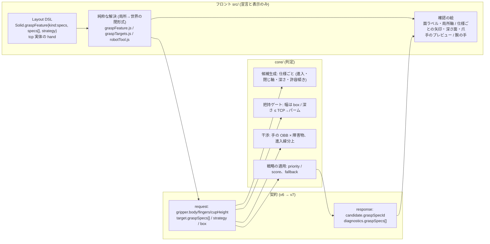

# 152. 把持仕様と把持戦略を語彙にし、手の形を判定に通し、宣言はすべて 3D で確かめられる

- Status: Proposed
- Date: 2026-09-25 (改稿 2026-09-26 — 当事者のレビューで「把持仕様」「把持戦略」の語彙と「+x ってどこ?」の確認を追加)
- Deciders: yuubae215 (要求: 掴む場所の「どう」とグリッパ形状の宣言を 1 PR で / 「設定しただけで、どう設定されたか視覚的に確認する手段が無い」/ 「ワーク把持仕様と把持戦略があるよね、そのための語彙は必要」/ 「+x と言ってもそれってどこ?ってなる、その確認はすごく重要」), Claude (起票)
- Retires: GREP:src/domain/robotTool.js::0\.21 \* L · GREP:src/domain/graspFeature.js::FACES:\s+'faces'
- Supersedes / Superseded by: ADR-128 D2 の `graspFeature` の kind `faces` を `specs` へ置き換える (読み込み時に無損失で移行 — D1)。ADR-118 の「ジョーの面導出」の説明 (面 = 接触面) を正す (Context §2)。ADR-150 D1 の「ツール = フランジ→TCP の線分」を、手の形が宣言されたときに限り置き換える。ADR-128 D1 の「入力はパネル、確認は 3D」を全宣言へ一般化する

## Context — Goal と力学(§1.2 Goal)

**Goal:** *ユーザーが、ワークごとに「どこを・どちらから・どの軸で挟んで・どの深さまで」
掴むか (把持仕様) を名前つきで N 個宣言でき、それらをどう使うか (把持戦略) を宣言でき、
「どんな形の手で」掴むかを宣言できる。その宣言は **探索の判定と画面の絵の両方へ同じ値で**
届き、宣言した人は、宣言した語 (「+x」) が **この物体のどこを指すか** を走らせる前に 3D で
確かめられる。*

当事者の要求 (2026-09-24〜26):

1. ワークの掴む場所 — **どこを・どう**掴むか
2. グリッパの形状 — 筐体の縦横高さ or 円筒寸法、爪の長さ・厚み
3. 設定した項目が、どう設定されたか視覚的に確認できない
4. 「上から降りて、左右を挟んで、上面から 20 mm 下」 — **ワーク把持仕様と把持戦略**という
   語彙が要る
5. 「+x と言っても、それってどこ?」 — 語が物体のどこを指すかの確認が重要

### §1 いま在るもの (実測 2026-09-25)

| 宣言 | 語彙 | 判定に効くか | 3D で見えるか |
|---|---|---|---|
| 掴む面 (`graspFeature.faces`) | `+x…-z` の 6 面 (物体の**局所**軸) | ✅ サンプルを作る | △ サンプル点のみ (`GraspSampleView`)。**どの面が `+x` かは描かれない** |
| 面上の領域 (`region`) | 面の 2 軸に対する 0..1 の矩形 (u,v) | ✅ 領域内の 3×3 格子 (i/4 の位置) | △ 点だけ。矩形そのものは描かれない |
| 進入方向 | **無い** (面法線の逆向きに固定 + `sampling` の傾き・ロール総当たり) | — | 候補のゴーストでのみ事後に |
| 閉じ軸 | **無い** (ロール総当たり) | — | — |
| 掴む深さ | **無い** (TCP は面の上に乗る) | — | — |
| 仕様の複数・優先 | **無い** (面の和集合が 1 つ) | — | — |
| ジョーの開口 / クリアランス | `maxOpening` / `fingerClearance` | ✅ 開口ゲート | ✗ |
| カップ径 | `cupDiameter` | ✅ シールゲート | ✗ |
| フランジ→TCP | `robot.toolLength` (取付け, ADR-151) | ✅ IK と腕スイープ | ✅ 腕の TCP の印 |
| **筐体・爪の寸法** | **無い** | ✗ ツールは太さ 0 の線分 (`arm_link_segments`) | △ `toolParts` が `toolLength` の**割合**から描く (`0.21·L` 等) |

最後の行が要求 2 の核心で、**画面の手と判定の手が別物**である。見えている爪がトレーの壁を
貫通していても「取れる」が返る — 画面がリクエストに載っていない幾何を説明している
(ADR-117 と同型の欠陥)。

### §2 「面」が 2 つの意味を兼ねている

- 候補の生成 (`core/.../candidates.py`) は、サンプル点を **TCP の着地点**、進入方向を
  **その点の法線の逆向き**に取る。つまり宣言された面は **「手がやって来る面 (進入面)」**。
- ところが ADR-118 と `graspFeature` のスキーマ説明は、ジョーの `±x` を
  **「爪が触れる対向面 (接触面)」** として書いている。
- 実際には、`±x` を宣言すると手は **横から x 方向に**進入し、爪はロール角次第で y か z に
  閉じる。把持幅はサンプル点の広がりを閉じ軸に射影して測るので、**測っているのは進入面の
  広がりであって、爪が挟む物体の厚みではない**。直方体ではたまたま同じ数になることが多く、
  表に出なかった。

「上から降りて、左右を挟んで、上面から 20 mm 下」は現場の把持指定として最も普通の形だが、
今の語彙では **言えない**。**進入面・閉じ軸・深さは独立の 3 事実**で、1 つの「面」に畳めない。
そしてこの 3 事実を束ねた「掴み方 1 つ」には名前が無く、「上から挟むのがダメなら横から吸う」
のような **掴み方どうしの関係** (戦略) を言う場所も無い。

### §3 語が指す場所が見えない

`+x` は **物体の局所軸**である (物体を回すと `+x` 面も一緒に回る)。これは語を安定させる
正しい選択だが、画面上の物体を見ている人には「どの面が +x か」が分からない — 回転した
物体ではなおさらで、ワールドの X 軸の向きとも一致しない。チップの `+x` を押した人が、
自分の意図した面を押せたかを知る手段が **サンプル点が出るまで無い**。

同じ欠陥は他の欄にもある。ADR-128 D1 の「入力はパネル、確認は 3D、描くのは **ワイヤに
載る値**」は掴む場所のサンプル点 1 欄にしか適用されておらず、開口・カップ径・取付けの
長さは数字の欄として存在するだけ。0 件が返ったとき、宣言の誤りか正しい不可能かを区別する
材料が画面に無い。要求 3・5 は、この規律を **1 欄 → 全欄**、さらに **値 → 語** へ広げる
ことを求めている。

### 位置づけ (層と契約)



`src/` に置くのは **宣言の解決 (局所 → 世界の回転) と、宣言そのものの絵**だけ。
「当たるか」「閉じられるか」「どの仕様の候補を返すか」は `core/` (CLAUDE.md §AI 向けガード)。
**3D の確認は判定を含まない** — 手の絵が壁に重なって見えても赤くはしない。

## 用語 (ubiquitous language — 一概念一名)

| 語 | 英名 (コード・DSL) | 意味 | 持ち主 |
|---|---|---|---|
| **把持仕様** | `GraspSpec` | ワークの掴み方 1 つ。名前つき。下の 5 事実を束ねる | ワーク (Solid) — N 個 |
| 進入面 | `approach.from` | 手がやって来る面 (局所軸名 `+x…-z`)。進入方向 = その面の法線の逆向き | 仕様 |
| 進入領域 | `approach.region` | 進入面上で TCP の軸が通ってよい範囲 (u,v ∈ 0..1 の矩形) | 仕様 |
| 許容傾き | `approach.tiltTolerance` | 進入方向からの傾きの上限 (rad)。未宣言 = `sampling` の刻みをそのまま使う | 仕様 |
| 閉じ軸 | `closing` | 爪が閉じる物体の局所軸 (`x|y|z`)。**接触面** = その軸の ±面 (導出。宣言しない) | 仕様 (ジョーのみ) |
| 深さ | `depth` | 進入面から TCP までの距離 (Layout の長さ単位 = mm)。未宣言 = 0 (面上) | 仕様 (ジョーのみ) |
| 対象の手 | `hand` | この仕様が想定する手の種類 (`parallelJaw|suction`) | 仕様 |
| **把持戦略** | `GraspStrategy` | そのワークの仕様群を **どう使うか** | ワーク (Solid) — 0 か 1 |
| 順序 | `strategy.order` | `priority`: 仕様を並び順に試し、候補を持つ最初の仕様の候補だけを返す / `score`: 全仕様の候補をスコア順に混ぜる | 戦略 |
| 退路 | `strategy.fallback` | `none`: 仕様のどれにも候補が無ければ 0 件 / `derived`: そのときだけ手からの導出 (ADR-118) で探す | 戦略 |
| 手の形 | `hand` (tcp 実体) | 筐体 (円筒/箱) + 爪 (長さ・厚み・幅) or カップ高さ | tcp 実体 (ADR-151 の共有点) |

「仕様」は **何を** (ワークの性質 — 取っ手の位置・触ってはいけない面は幾何から導けない)、
「戦略」は **どう使うか** (選び方) で、別の実体に分ける。戦略が仕様の中に散ると
(仕様ごとに `priority: 3` を書く等)、並べ替えが N 箇所の書き換えになり、同順位という
表現不能であるべき状態が表現できてしまう。**順位は配列の順序そのもの**にする。

## Options considered

**どう掴むか (要求 1・4)**

- **E: 把持仕様 (N 個・名前つき) + 把持戦略 (0/1) を `graspFeature` の新しい kind `specs` にし、
  旧 `faces` は仕様へ無損失で移行する** — tradeoff: DSL の語彙が増え、候補生成に分岐が
  入り、仕様ごとの結果を返すため response が版上げになる。得るもの: 要求 4 の文が 1 行の
  宣言になり、§2 の読み違いが宣言のある所から正される。
- **E′: 仕様は足すが戦略は足さない (仕様の和集合で探す)** — tradeoff: 安いが「上から挟むのが
  ダメなら横から吸う」が言えない。和集合でスコア順に混ぜると、優先したい掴み方が低スコアで
  埋もれる。却下。
- **F: 面の語彙に「接触面」と「進入面」の 2 種を足す** — tradeoff: 面の宣言が 2 通りに読め、
  ADR-128 の 4 状態が 8 になる。却下。
- **G: 把持姿勢 (6 自由度) を直接宣言させる** — tradeoff: 厳密だが、ユーザーが書くのは
  「上から・左右を・20 mm」で四元数ではない。解の形で来た要件を Goal に上げると、欲しいのは
  姿勢ではなく 3 つの拘束 + 優先関係である (§1.2)。却下。
- **H: `faces` と `specs` を両方残す** — tradeoff: 同じ「上面だけ」を 2 通りに書ける = 第二の源
  (§1.1)。却下 — `faces` は `specs` へ移行し退役 (`Retires:`)。

**手の形 (要求 2)**

- **A: 寸法を `gripper` (契約) と tcp 実体 (シーン) に宣言し、`core/` が干渉に使う** — 採用。
- **B: 形は描画用だけ、判定は線分のまま** — 見える爪が判定されない欠陥を固定する。却下。
- **C: メッシュ (STL)** — 契約に非閉の巨大 payload + `core/` にメッシュ干渉の重さ。要求は
  箱/円筒 + 爪で言える。**やらないとは書かない** — `body.kind` を足す拡張点として残す。

**確認 (要求 3・5)**

- **J: 欄ごと・語ごとに、ワイヤに載る値から描く絵を 1 つ持たせ、対応を表にして数える** — 採用。
- **K: 走らせた結果 (候補ゴースト) で確認させる** — 0 件のとき確認材料が無い。却下。
- **L: 局所軸名をやめ、「上面/前面」の世界向きの名前で宣言させる** — 物体を回すと
  「上面」が上でなくなり、宣言が物体に付いてこない。却下 — 宣言は局所軸のまま、**表示に
  いまの世界向きを導出して添える** (D2)。

## Decision — Strategy(§1.2 Strategy)

採用: **E + A + J**。1 PR で入れる (当事者決定)。

### D1 — 把持仕様と把持戦略を Layout DSL の語彙にする

`Solid.graspFeature` の kind union を `anywhere | specs` にする (`faces` は退役):

```jsonc
"graspFeature": {
  "kind": "specs",
  "specs": [                                   // 順序 = 優先順位。1 個以上
    {
      "name": "上から側面挟み",
      "hand": "parallelJaw",
      "approach": {
        "from": "+z",
        "region": { "uMin": 0.3, "uMax": 0.7, "vMin": 0.2, "vMax": 0.8 },   // 省略 = 面全体
        "tiltTolerance": 0.2                                                   // 省略 = sampling の刻み
      },
      "closing": "x",                           // 省略 = ロール総当たり (今と同じ)
      "depth": 20                               // mm。省略 = 0
    },
    {
      "name": "上面吸着",
      "hand": "suction",
      "approach": { "from": "+z", "region": { "uMin": 0.25, "uMax": 0.75, "vMin": 0.25, "vMax": 0.75 } }
    }
  ],
  "strategy": { "order": "priority", "fallback": "none" }   // 省略 = この既定を**宣言したものとして**画面に出す
}
```

- **仕様の不正は `malformed`** (黙って無視しない): `closing` が `from` の軸と同じ
  (`+z` から来て `z` で閉じる)、吸引の仕様に `closing`/`depth`、名前の重複、空の `specs`。
  graspFeature の状態は ADR-128 の 4 つ (`derived / declared-anywhere / declared-specs /
  malformed`) のまま — `declared-faces` を `declared-specs` へ改名するだけで数は増やさない。
- **手と仕様の不一致は不正ではない**: ジョーの仕様は吸引の手では使えないだけ。探索では
  その仕様を **理由つきで除外**し、パネルに「上面吸着: いまの手 (parallelJaw) では使えない」
  と出す。**全仕様が除外されたら探索を止めて理由を出す** (`fallback: derived` へ黙って落とさない)。
- **戦略の省略は既定値の押し付けではない** — `priority` / `none` は ADR-119 D3「宣言が勝つ」と
  同じ既定だが、パネルは「戦略: 優先順 · 退路なし (既定)」と**省略されたことを言う** (原則 #31)。
- **旧 `faces` の移行 (無損失):** 読み込み時に `faces[i]` → 仕様 `{ name: "<face>", hand: いまの手,
  approach: { from: face, region } }` (閉じ軸・深さ・許容傾きは省略 = 今と同じ候補集合)、
  戦略は `{ order: "score", fallback: "none" }` (= 今の「和集合をスコア順」と同じ答え)。
  移行した件数を警告で出す (ADR-151 の旧形式 tcp と同じ作法)。`examples/` と `templates/` の
  DSL は同じ PR で書き換える。**書き出しは `specs` だけ** — `faces` を書く経路を残さない。
- Context DSL 側の `hydratedEntity` も同じ PR で同じ形にする (ADR-117 の非対称を再発させない)。

### D2 — 「+x ってどこ?」を物体の上で答える

語は **局所軸のまま**保存し (物体と一緒に回る — 案 L の却下理由)、表示に **いまの世界向きを
導出して添える**:

- **面ラベル:** 把持パネルが開いているあいだ、対象の 6 面の中心に `+X`〜`−Z` のラベルを描き、
  物体の **局所軸の三脚** (赤緑青、物体と一緒に回る) を添える。世界の軸とずれていることが
  そのまま見える。
- **チップにいまの向きを添える:** パネルの面チップを `+z · 上` / `+x · 前` / `-y · 右` のように、
  局所面の法線をいまの世界姿勢で回した向きから導出した語で表示する (ROS 世界系: +X 前 /
  +Y 左 / +Z 上)。どの世界軸とも 30° 以上ずれていれば `· 斜め` と言う (嘘の「上」を付けない)。
  **導出であって保存しない** — 物体を回せば添え字が変わり、宣言は変わらない。
- **指す前に光る:** チップにホバー (タッチでは押下中) すると、その面が 3D で塗られる。
  進入面は塗り、閉じ軸から導出した **接触面 2 枚** は縞で塗り分け、進入面と接触面が
  別物であることを絵で言う (§2 の読み違いを、次の人が繰り返さないための絵)。
- 3D で面をクリックして **入力**する経路は作らない (ADR-128 D1 の線 — 選択の所有者 ADR-099 を
  「実体単位」から「面単位」へ広げる別判断)。「対象外」とは書かない: **まだ決めていない**
  (DEFERRAL_LEDGER に行を起こす)。

### D3 — 手の形を宣言する

`gripper` の各 kind に **閉じた**形の欄を足す。座標はフランジ座標系 (ADR-150 D5: +Z がフランジ面から
外向き、ジョーは ±X に閉じる)。単位はリクエスト幾何と同じ。

```jsonc
// parallelJaw
"body":    { "kind": "cylinder", "radius": 0.035, "length": 0.07 }    // または
           { "kind": "box", "size": [0.09, 0.05, 0.07] },             // フランジ面から +Z へ
"fingers": { "length": 0.05, "thickness": 0.008, "width": 0.02 }      // 爪 1 本 (thickness = X, width = Y, length = Z)
// suction
"body":    { … 同上 … }, "cupHeight": 0.02                            // 径は既存の cupDiameter
```

- `body.kind` は `cylinder | box` の閉じた union (`obstacles` と同じ統治)。メッシュは kind を足す形でのみ入る。
- 爪は開口 `maxOpening` の位置 (内面間距離 = `maxOpening`) に置く — 進入中の爪は開いている。
- **形は取付けを導出しない。取付けは形と矛盾してはならない。** ジョーでは TCP (= `toolLength`,
  源は ADR-151 の取付け) が爪の範囲内 `body.length ≤ toolLength ≤ body.length + fingers.length`、
  吸引ではカップ面 `toolLength = body.length + cupHeight` (相対許容 1e-6)。外れていれば
  **理由つきで探索を止める** (既定で直さない — 直せばどちらが正か分からない)。
- **形の未宣言は状態として残す** (原則 #31)。`body`/`fingers` が無ければ `core/` は従来どおり線分で
  判定し、**腕に描く手も線分**にする — 判定されない形を描かない。パネルは「手の形が未宣言 —
  干渉は線分で近似」と言う。
- シーン側の源は **tcp 実体** (ADR-151 がロボットとグリッパの共有点として残した実体) の
  `hand: { kind, …寸法 }`。グリッパのパネルはこの 1 つを読み書きし、ワイヤの `gripper`・
  腕の絵 (`toolParts`)・手のプレビューは **同じ `hand` から導出**する (§1.1)。
- 出荷シーンは**数字で書かれた既定の手** (現行の絵と同じ見た目の実寸) を宣言した状態で始める。
  **割合の式 (`0.21 * L` ほか) は退役**する。`hand` の無い旧シーンは埋めずに「未宣言」で読む。

### D4 — ワイヤ (契約 v6 → v7)

**request** (optional 追加):

```jsonc
"gripper": { "kind": "parallelJaw", "maxOpening": …, "body": {…}, "fingers": {…} },
"target": {
  "surfaceSamples": [ … ],          // 導出 / anywhere / fallback:derived のときだけ
  "graspSpecs": [                   // 順序 = 優先順位。手と一致した仕様だけを載せる
    { "id": "上から側面挟み",
      "samples": [ { "point": […], "normal": […] } ],   // 進入領域の格子 (面上)
      "closingAxis": [1, 0, 0],     // 世界座標・単位ベクトル (省略 = ロール総当たり)
      "depth": 0.02,                // リクエスト単位 (省略 = 0)
      "tiltTolerance": 0.2 }        // 省略 = sampling の刻み
  ],
  "strategy": { "order": "priority", "fallback": "none" },
  "box": { "center": […], "halfExtents": […], "orientation": […] }   // 対象そのものの OBB
}
```

**response** (版上げ — 仕様ごとの結果は *ソルバが決定した事実* なのでワイヤに載せる。
クライアントが候補の姿勢から仕様を逆算するのは脆い導出で、`score` 戦略では「上位に居ない」と
「候補が無い」を区別できない):

- 各候補に **必須** `graspSpecId: string | null` (null = 導出のサンプルから生まれた候補)。
  optional 兄弟ではなく必須の nullable にする (閉層に optional を生やさない — ADR-060)。
- `diagnostics` に **必須** `graspSpecs: [{ id, candidatesGenerated, feasible }]`
  (仕様を送らなければ空配列)。段ごとの棄却内訳を仕様ごとに割るのは今回しない (残し)。
- `contractVersion` 6 → 7。Schema + `contract-version.json` + BFF 導出型 + `core/` pydantic +
  スタブ (`mocks/graspStub`) + 両端の準拠テストを同一 PR で (ADR-082/084 §4)。

### D5 — `core/` の判定 (すべて `core/`)

- **候補生成 (仕様ごと):** 進入方向 = サンプル法線の逆向き。`tiltTolerance` があれば `sampling` の
  傾きのうち `|t| ≤ tiltTolerance` のものだけを使う。`closingAxis` があればロールを「閉じ軸が
  フランジ X に一致する 2 通り (0, π)」に絞る。TCP を点から進入方向へ `depth` だけ進める。
- **把持幅:** `closingAxis` と `box` があれば、幅を **box の閉じ軸方向の厚み** から測る
  (§2 を宣言のある所から正す)。無ければ従来どおり。
- **深さのゲート (把持性):** `depth > toolLength − body.length` (パームが進入面より下へ潜る) なら
  不可、`rejectedByGrasp`。爪先が底を突き抜けるかは床・トレー底との干渉として判定する。
- **手の干渉:** `body` と 2 本の爪を **フランジ座標の OBB** とし (円筒は外接 OBB — **保守側の近似**。
  偽の「当たる」は出うるが偽の「取れる」は出さない)、把持姿勢と、プリグラスプ→把持の進入線分上の
  離散点 (端点を含む。数は `core/` の内部定数) で障害物と交差判定。当たれば `rejectedByInterference`。
- **戦略の適用:** `priority` は仕様を順に評価し、feasible を持つ最初の仕様の候補だけをスコア順に
  返す。`score` は全仕様を混ぜてスコア順。どちらでも仕様ごとの `diagnostics.graspSpecs` は
  **全仕様ぶん**埋める (返さなかった仕様も数える — 原則 #31)。`fallback: derived` は全仕様が 0 件の
  ときだけ `surfaceSamples` で探す。
- 対象を障害物から除く規則 (対象は自分の把持を妨げない) は変えない — `box` は幅と深さの判定にだけ使う。

### D6 — 宣言はすべて 3D で確かめられる (欄・語 ↔ 絵の対応表)

ADR-128 D1 の規律を全宣言へ一般化する。確認の絵は **判定をしない** (当たり・不可を色で言わない)。

| 宣言の欄・語 | 3D の確認 (描く値) | 描く所 |
|---|---|---|
| 面の名前 (`+x…`) | 面ラベル + 局所軸の三脚 + チップのホバーで面を塗る (D2) | 対象の面 |
| 進入面 + 進入領域 | 領域の **矩形の輪郭** + 格子点 (既存の点) | 進入面上 |
| 進入方向 + 許容傾き | 領域中心からの **進入矢印** (プリグラスプ距離の長さ) + 許容傾きの **円錐** | 対象の外 |
| 閉じ軸 | **接触面 2 枚を縞で塗る** + 閉じ方向の両矢印 | 対象の両脇 |
| 深さ | 進入面から `depth` 下の **深さ面** (半透明の薄い矩形) | 対象の中 |
| 開口 + 爪 | 深さ面上に **開いた爪 2 本の断面** (内面間 = `maxOpening`) | 対象の両脇 |
| カップ径 | 進入面上にカップの円 | 進入面上 |
| 手の形 (`hand`) | 腕の先の手 (`RobotStage`) を **宣言寸法から** 描く | フランジ |
| 仕様 × 手 | **静的な手のプレビュー**: 選んだ仕様の領域中心・進入・深さ・開口に宣言寸法の手を半透明で置く | 対象の上 |
| 戦略 | 仕様リストの並び順 = 優先順 (番号バッジ)、候補が返ったら仕様ごとの `feasible / generated` | パネル |
| 取付けと形の矛盾・仕様の除外 | 描かない — パネルの理由文 | パネル |

- 仕様が N 個あるとき、3D は **パネルで選んでいる 1 つ** の仕様を描き、他は面の塗りだけを薄く出す
  (N 個の矢印・爪を同時に描くと語が絵に埋もれる — 1 と N は別世界、原則 #31)。
- 絵はワイヤに載せる解決済みの値 (`target.graspSpecs[i]` / `gripper`) から計算する。パネルの
  入力文字列から描かない (ADR-128 D1)。
- **対応表は機械に数えさせる:** `CONFIRMATION_BY_FIELD` に、`graspFeature` の仕様・戦略の欄と
  `gripper` の宣言欄 (スキーマから列挙) のそれぞれの絵を登録し、**表に行が無い欄の個数 = 0** を
  テストで問う。未登録の欄では throw する (欄を足した人が絵を忘れると CI が落ちる)。

## Consequences — Evidence と tradeoff(§1.2 Evidence)

- **肯定的:**
  - 「上から降りて、左右を挟んで、上面から 20 mm 下。ダメなら上面を吸う」が 2 つの仕様 +
    戦略 1 行で書ける。掴み方に名前が付き、結果が仕様ごとに返る。
  - `+x` が物体のどこかを、チップの添え字・面ラベル・ホバーの塗りで走らせる前に確かめられる。
  - 画面の手と判定の手が同じ宣言から作られる。見えている爪は判定されている。
- **受け入れるコスト / 否定的:**
  - 6 層 (Layout/Context/scene スキーマ・契約 request/response・BFF・`core/`・スタブ・描画) に及ぶ
    大きい 1 PR で、**response の版上げ (v7) を伴う**。
  - `faces` の退役で旧ドキュメントは移行される (無損失だが書き出しの形は変わる)。
  - 円筒の外接 OBB は保守側。進入線分の離散化は薄い障害物をすり抜けうる。
  - 導出 (未宣言・`anywhere`) の把持幅の読み違い (§2) は **正さない** — 既存の答えが動く。
- **検証 (証拠):** goal ごとの支えの正本は
  **`docs/gsn/adr-152-how-to-grasp-and-what-grasps-are-declarations-and-each-is-seen.gsn`**。
  起票時点では全枝が `support-exploring`。主要な問い所:
  - 語彙と状態: `src/domain/graspFeature.test.js` (仕様の不正 5 種が malformed / 旧 `faces` の移行が
    同じサンプル集合を作る / 戦略の省略が「既定」として区別される)
  - 面の向きの導出: 純粋関数のテスト (回転した物体で `+x · 上` になる / 30° 超で `· 斜め`)
  - 手: `src/domain/robotTool.test.js` (爪先 z = `body.length + fingers.length`、割合の式 0 個、取付け
    との矛盾で停止)
  - 判定: `core/tests` (爪がトレー壁を貫通する候補の棄却 — 負の対照: 形なしでは通る / 閉じ軸宣言で
    幅 = box 厚み / 深さ超過で rejectedByGrasp / priority と score で返る候補の違い / 仕様ごとの
    diagnostics が全仕様ぶん / 仕様なしリクエストの結果が変更前と一致)
  - 確認: `src/view/GraspDeclarationConfirmation.test.js` (`CONFIRMATION_BY_FIELD` の穴 0)
  - 契約: `pnpm test:contract` (v7、contract-wall 緑) + `server/test/grasp.contract.test.js` +
    `core/tests/test_contract_conformance.py` + `mocks/graspStub/conformance.test.js`
- **波及 (blast radius):** `schema/layout-1.0.schema.json`・Context DSL の hydratedEntity・scene スキーマ・
  `packages/grasp-contract/` (request/response/examples/version)・BFF 導出型・`mocks/graspStub`・
  `src/domain/{graspFeature,graspTargets,robotTool}.js`・`src/context/{DocBuilder,GraspDeclarationCatalog}.js`・
  `src/controller/GraspController.js`・把持パネル・`src/view/{GraspSampleView,RobotStage}.js` (+ 新規の
  確認ビュー)・`core/easy_extrude_core/{contract,engine}/`・`templates/`・`examples/`・
  `docs/STATE_LEDGER.md` (hand: 未宣言/宣言/取付けと矛盾、仕様: 使える/手と不一致/不正、
  仕様の基数 0/1/N、戦略: 省略/宣言)。
- **残し (DEFERRAL_LEDGER へ実装 PR で起票):** (1) 導出の把持幅を box から測る修正、
  (2) 3D で面をクリックして入力する経路 (選択の所有者の判断)、(3) 仕様ごとの段別棄却内訳。

## Lens notes

- **1.1 真実の源は一つ:** 仕様の源は Solid の `graspFeature`、手の源は tcp 実体の `hand`。
  ワイヤの `graspSpecs`/`gripper`・絵・パネルの添え字はすべて導出。取付け (`toolLength`) と形は
  別の事実なので互いに導出せず、矛盾を止める規則だけを置く。`faces` と `specs` を並べないのも同じ理由。
- **1.1 ドメイン:** 「仕様」(ワークの性質) と「戦略」(選び方) は別の実体。順位は戦略側の配列順序が
  持ち、仕様に数値の優先度を持たせない (同順位を表現不能にする)。
- **1.4 状態:** `graspFeature` は 4 状態のまま、仕様は 使える / 手と不一致 / 不正 の 3 状態、`hand` は
  未宣言 / 宣言 / 取付けと矛盾 の 3 状態。仕様の基数 (0 は不正、1、N) を台帳の基数列に書く。
  いずれも解決関数の戻り値の判別で足り、クラスの状態機械は不要。
- **§AI 向けガード:** 局所 → 世界の回転、面の世界向きの語、爪の配置、プレビューの姿勢は公知の閉形式
  (軸 3) で `src/`。当たり・閉じられるか・深さ・どの仕様を返すかは判定 (軸 2) で `core/`。戦略は
  ユーザーの宣言であって `core/` の重み付けではない (アイデアを front に写していない)。
- **様態:** 宣言 → 解決 → 絵 / ワイヤ は逐次 (BPMN)。戦略の `priority` も逐次 (仕様を順に試す)。
