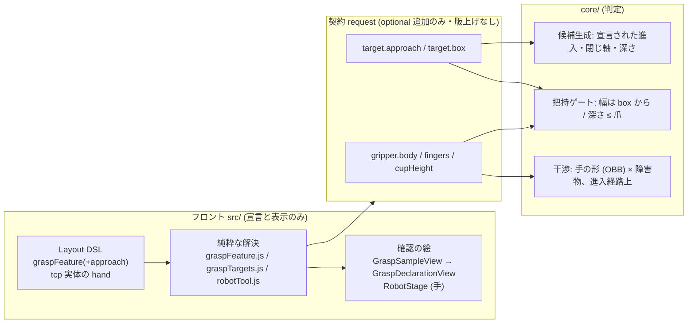

# 152. どう掴むか・何で掴むかを宣言にし、宣言はすべて 3D で確かめられる

- Status: Proposed
- Date: 2026-09-25
- Deciders: yuubae215 (要求: 掴む場所の「どう」とグリッパ形状の宣言、両方を 1 PR で / 「設定しただけで、どう設定されたか視覚的に確認する手段が無い」の指摘), Claude (起票)
- Retires: GREP:src/domain/robotTool.js::0\.21 \* L
- Supersedes / Superseded by: なし。ADR-119 D2 / ADR-128 D2 の把持フィーチャに `approach` を足し (面と領域の語彙は変えない)、ADR-118 の「ジョーの面導出」の意味を正す (下の Context §2)。ADR-150 D1 の「ツール = フランジ→TCP の線分」を、手の形が宣言されたときに限り置き換える。ADR-128 D1 の「入力はパネル、確認は 3D」を全宣言へ一般化する

## Context — Goal と力学(§1.2 Goal)

**Goal:** *ユーザーが「このワークのどこを・どの向きで・どの深さまで」「どんな形の手で」
掴むかを宣言でき、その宣言が **探索の判定と画面の絵の両方へ同じ値で**届く。宣言した
人は、宣言が何を意味したかを走らせる前に 3D で確かめられる。*

当事者の要求は 3 つ (2026-09-24/25):

1. ワークの掴む場所 — **どこを・どう**掴むか
2. グリッパの形状 — 筐体の縦横高さ or 円筒寸法、爪の長さ・厚み
3. 「設定した項目は、どう設定されたか視覚的に確認する手段が無くない?」

### §1 いま在るもの (実測 2026-09-25)

| 宣言 | 語彙 | 判定に効くか | 3D で見えるか |
|---|---|---|---|
| 掴む面 (`graspFeature.faces`) | `+x…-z` の 6 面 | ✅ サンプルを作る | ✅ サンプル点 (`GraspSampleView`) |
| 面上の領域 (`region`) | 面の 2 軸に対する 0..1 の矩形 (u,v) | ✅ 領域内の 3×3 格子 (i/4 の位置) | △ 点だけ。**矩形そのものは描かれない** |
| 進入方向 | **無い** (= 面法線の逆向きに固定 + `sampling` の傾き・ロール総当たり) | — | 候補のゴーストでのみ事後に |
| 掴む深さ | **無い** (TCP は面の上に乗る) | — | — |
| ジョーの開口 / クリアランス | `maxOpening` / `fingerClearance` | ✅ 開口ゲート | ✗ |
| カップ径 | `cupDiameter` | ✅ シールゲート | ✗ |
| フランジ→TCP | `robot.toolLength` (取付け, ADR-151) | ✅ IK と腕スイープ | ✅ 腕の TCP の印 |
| **筐体・パーム・爪の寸法** | **無い** | ✗ ツールは太さ 0 の線分 (`arm_link_segments`) | △ `toolParts` が `toolLength` の**割合**から描く (`0.21·L` 等) |

最後の行が要求 2 の核心で、**画面の手と判定の手が別物**である。絵には筐体と爪があるが、
判定が知るのは線分 1 本だけなので、爪が隣のワークやトレーの壁を貫通していても
「取れる」が返る — 絵は判定されていない形を見せている (ADR-117 と同じ形の欠陥:
*画面が、リクエストに載っていない幾何を説明している*)。

### §2 「面」が 2 つの意味を兼ねている

要求 1 の「どう」を足そうとして、既存モデルの読み違いが見つかった。

- 候補の生成 (`core/.../candidates.py`) は、サンプル点を **TCP の着地点**とし、
  進入方向を **その点の法線の逆向き**に取る。つまり宣言された面は
  **「手がやって来る面 (進入面)」** である。
- ところが ADR-118 と `graspFeature` のスキーマ説明は、ジョーの面 `±x` を
  **「爪が触れる対向面 (接触面)」** として書いている
  (`FACES_BY_GRIPPER_KIND` のコメント: *Jaws close across two opposed side faces*)。
- 実際に起きていることは: `±x` を宣言すると、手は **横から x 方向に**進入し、爪は
  ロール角に応じて y か z 方向に閉じる。把持幅はサンプル点の広がりを閉じ軸に
  射影して測るので、**測っているのは「進入面の広がり」であって、爪が挟む物体の厚みではない**。
  直方体ではたまたま同じ数になることが多いので、これまで表に出なかった。

「上から降りて、左右の側面を挟み、上面から 20 mm 下を掴む」は、現場の把持指定として
最も普通の形である。しかし今の語彙では **言えない**: 上面 `+z` を宣言すると上から
降りるが閉じ軸はロール任せになり、側面 `±x` を宣言すると横から来てしまう。
**進入面・閉じ軸・深さは独立の 3 つの事実**で、1 つの「面」に畳めない。

### §3 宣言が 3D で見えないこと自体が欠陥

ADR-128 D1 は「入力はパネル、確認は 3D、描くのは意図ではなく**ワイヤに載る値**」と決め、
掴む場所のサンプル点でそれを実装した。しかし同じ規律は **その 1 欄にしか適用されていない**。
開口・カップ径・クリアランス・取付けの長さは数字の欄として存在するだけで、
入力した人は「80 mm と書いたことが、このワークに対して何を意味するか」を
結果が返るまで見られない。結果が「0 件」なら、それが宣言の誤りなのか正しい不可能なのかを
区別する材料が画面に無い (原則 #11 の手前の失敗 — 無言ではないが、読めない)。

要求 3 は、この規律を **1 欄 → 全欄** へ広げることを求めている。広げ方を決めなければ、
今回足す欄 (進入方向・深さ・手の寸法) も同じく見えないまま増える。

### 位置づけ (層と契約)



`src/` に置くのは **宣言の解決 (局所座標 → 世界座標の閉形式) と、宣言そのものの絵**だけ。
「当たるか」「閉じられるか」は `core/` (CLAUDE.md §AI 向けガード 軸 2)。
**3D の確認は判定を含まない** — 手の絵が壁に重なって見えても、赤くはしない
(色で当たりを言えば、それは干渉判定の第二の源になる)。

## Options considered

**手の形 (要求 2)**

- **A: 寸法を `gripper` (契約) と tcp 実体 (シーン) に宣言し、`core/` が干渉に使う**
  — tradeoff: 契約・スキーマ・シーン・`core/`・描画の 5 層に及ぶ。得るもの: 絵と判定が
  同じ宣言から作られる。
- **B: 形は描画用の宣言だけにし、判定は線分のまま** — tradeoff: 安いが §1 の欠陥
  (見える爪が判定されない) を宣言つきで固定する。却下。
- **C: メッシュ (STL) を読み込んで干渉に使う** — tradeoff: 表現力は最大だが、契約に
  メッシュを載せる = 巨大・非閉の payload、`core/` にメッシュ干渉を入れる重さ。今回の
  要求 (筐体の箱/円筒 + 爪) は閉じた数個のプリミティブで言える。**やらないとは書かない**
  — 箱で足りないハンドが出た日の拡張点として `kind` を足す形で残す (下 D1)。
- **D: 現状維持** — 却下 (要求そのもの)。

**どう掴むか (要求 1)**

- **E: `graspFeature` に `approach` (進入面・閉じ軸・深さ) を足す。面と領域は「どこに TCP を
  置くか」の意味に正す** — tradeoff: 候補生成の分岐が `core/` に 1 つ増える。
- **F: 面の語彙に「接触面」と「進入面」の 2 種を足す** — tradeoff: 面の宣言が
  2 通りに読めるようになり、ADR-128 の 4 状態がそのまま 8 状態になる。却下。
- **G: 把持姿勢 (6 自由度) を直接宣言させる** — tradeoff: 厳密だが、ユーザーが書くのは
  「上から・左右を・20 mm」であって四元数ではない。**解の形で来た要件を Goal に上げる**
  (§1.2) と、欲しいのは姿勢そのものではなく 3 つの拘束である。却下。

**確認 (要求 3)**

- **H: 宣言の欄ごとに、ワイヤに載る値から描く絵を 1 つ持たせ、欄と絵の対応を表にして
  数える** — tradeoff: 絵が増える。得るもの: 欄を足した人が絵を忘れられない。
- **I: 走らせた結果 (候補ゴースト) で確認させる** — tradeoff: 追加コストゼロだが、0 件の
  とき確認材料が無い (§3)。却下。

## Decision — Strategy(§1.2 Strategy)

採用: **A + E + H**。1 PR で入れる (当事者決定)。

### D1 — 手の形を宣言する (契約 request・optional)

`gripper` の各 kind に **閉じた**形の欄を足す。単位はリクエスト幾何と同じ (契約は単位を
名指ししない)。座標は **フランジ座標系** (ADR-150 D5: +Z がフランジ面から外向き、ジョーは
±X に閉じる)。

```jsonc
// parallelJaw
"body":    { "kind": "cylinder", "radius": 0.035, "length": 0.07 }   // または
           { "kind": "box", "size": [0.09, 0.05, 0.07] },            // フランジ面から +Z へ
"fingers": { "length": 0.05, "thickness": 0.008, "width": 0.02 }     // 爪 1 本の寸法

// suction
"body":    { … 同上 … },
"cupHeight": 0.02                                                     // カップの高さ (径は既存 cupDiameter)
```

- `body.kind` は `cylinder | box` の閉じた union (`obstacles` と同じ統治)。**メッシュは
  kind を 1 つ足す形でのみ入る** (案 C の拡張点)。
- 爪の `thickness` は閉じ軸 (X) 方向、`width` は Y 方向、`length` は Z 方向。爪は開口
  `maxOpening` の位置 (内面間距離 = `maxOpening`) に置かれる — 進入中の爪は開いているから。
- **形は取付けを導出しない。取付けは形と矛盾してはならない。** TCP (= `toolLength`, 源は
  ADR-151 の取付け) は、ジョーでは爪の範囲内 `body.length ≤ toolLength ≤ body.length + fingers.length`、
  吸引ではカップ面 `toolLength = body.length + cupHeight` (許容 1e-6 相対) に在ること。
  外れていれば **理由つきで探索を止める** (既定で直さない — 直せばどちらが正か分からない)。
  ジョーで TCP が爪の途中にあるのは正当で、そこから先端までが「TCP より先に出る爪」
  `tipOverhang = body.length + fingers.length − toolLength` になる (D2 の深さの上限に効く)。
- **形の未宣言は状態として残す** (原則 #31)。`body` / `fingers` が無ければ `core/` は
  従来どおり線分で判定し、**腕に描く手も線分 (未宣言の見た目) にする** — 判定されない
  形を描かない (§1 の欠陥の再発防止)。パネルは「手の形が未宣言 — 干渉は線分で近似」と言う。
- シーン側の源は **tcp 実体** (ADR-151 がロボットとグリッパの共有点として残した実体)。
  `hand: { kind, …寸法 }` を tcp の CoordinateFrame に持たせ、Layout DSL / scene /
  context スキーマに同時に足す。グリッパのパネルは tcp の `hand` を読み書きする 1 本の入口
  になり、ワイヤの `gripper` と腕の絵 (`toolParts`) は **同じ `hand` から導出**する (§1.1)。
- 出荷シーンは**数字で書かれた既定の手** (UR 向け汎用 2 爪: 現行の絵と同じ見た目の実寸)
  を宣言した状態で始める。**割合の式 (`0.21 * L` ほか) は退役する** (`Retires:`)。旧形式の
  シーン (hand 無し) は読み込み時に埋めず「未宣言」のまま読む。

### D2 — どう掴むかを宣言する (`graspFeature.approach`)

面と領域の意味を **「TCP を置く場所 (進入面上の領域)」** に正し、独立の 3 事実を足す:

```jsonc
"graspFeature": {
  "kind": "faces",
  "faces": [{ "face": "+z", "region": { "uMin": 0.3, "uMax": 0.7, "vMin": 0.2, "vMax": 0.8 } }],
  "approach": {
    "closing": "x",        // ジョーのみ: 爪が閉じる物体の局所軸 (x|y|z)。吸引では書けない
    "depth": 20            // 進入面から TCP までの深さ (Layout の長さ単位 = mm)。既定 0 = 面上
  }
}
```

- **進入方向は面から決まる** (面法線の逆向き — 既存どおり)。新しいのは *閉じ軸* と *深さ*
  だけで、語彙の追加は最小になる。閉じ軸は進入面の法線と平行であってはならない
  (`+z` 面に `closing: z` は宣言エラー — `malformed` へ。黙って無視しない)。
- `approach` を持てるのは `kind: faces` だけ。`anywhere` / 導出はこれまでどおり (閉じ軸は
  ロール総当たり、深さ 0)。つまり **既存の答えは 1 ビットも動かない** — 変わるのは
  宣言が現れた所だけ (ADR-084 §3 の規律)。
- ワイヤへは世界座標に解決して載せる (`src/` の閉形式、軸 3):

  ```jsonc
  "target": {
    "surfaceSamples": [ … 進入面の領域内の格子点 (深さの分だけ内側へずらさない — 点は面上) … ],
    "approach": { "closingAxis": [1, 0, 0], "depth": 0.02 },   // 世界座標・リクエスト単位
    "box": { "center": […], "halfExtents": […], "orientation": […] }  // 対象そのものの OBB
  }
  ```
- `core/` の変化 (判定はすべて `core/`):
  - **候補生成:** `closingAxis` があれば、ロールを「閉じ軸がフランジ X に一致する 2 通り
    (0, π)」に絞る。TCP を点から進入方向へ `depth` だけ進めた位置に置く。
  - **把持幅:** `target.box` があれば、幅を **box の閉じ軸方向の厚み** から測る
    (サンプル点の広がりではなく) — §2 の読み違いを、宣言のある所から正す。box が無ければ
    従来どおり。
  - **深さのゲート (把持性):** `depth > toolLength − body.length` (TCP からパームまでの距離を深さが超える =
    パームが進入面より下へ潜る) なら不可、`rejectedByGrasp` として数える。爪の先端が対象の底を突き抜けるかは
    障害物 (床・トレー底) との干渉として D3 で判定する。
- `target.box` は `obstacles` の box 形と同じ形 (`$defs` で共有)。対象を障害物から除く規則
  (対象は自分の把持を妨げない) は変えない — box は幅と深さの判定にだけ使う。

### D3 — 手の形で干渉を判定する (`core/`)

`body` と 2 本の爪を **フランジ座標の OBB** とし (円筒は外接 OBB — **保守側の近似であることを
宣言する**: 円筒の角の外側で当たりと言いうる。偽の「取れる」は出さない向き)、
解かれた姿勢で世界へ置いて、障害物 (sphere / box) との交差を判定する。

- 判定する姿勢は **把持姿勢と、プリグラスプ→把持の進入線分上の離散点** (端点を含む)。
  離散数は `core/` の内部定数 (契約に載せない)。
- 爪は開口 `maxOpening` の位置で判定する (進入中は開いている)。
- 当たれば既存の干渉段で棄却 (`rejectedByInterference`)。**response は変えない**:
  どの部品が当たったかを返す欄は足さない (閉じたスコア層に optional 兄弟を生やさない
  — ADR-060)。当たった部品を知りたい要求が出たら、それは版上げを伴う別判断。
- 形が未宣言なら従来の線分スイープのみ (D1)。

### D4 — 宣言はすべて 3D で確かめられる (欄 ↔ 絵の対応表)

ADR-128 D1 の規律「入力はパネル、確認は 3D、描くのは **ワイヤに載る値**」を、把持に
関わる全宣言へ一般化する。確認の絵は **判定をしない** (色で当たり・不可を言わない)。

| 宣言の欄 | 3D の確認 (描く値) | 描く所 |
|---|---|---|
| 面 + 領域 | 領域の **矩形の輪郭** + 格子点 (既存) | 対象の面上 |
| 進入方向 | 領域中心から法線に沿った **進入矢印** (プリグラスプ距離の長さ) | 対象の外 |
| 深さ | 進入面から `depth` 下の **深さ面** (半透明の薄い矩形) | 対象の中 |
| 閉じ軸 + 開口 | 深さ面上に **開いた爪 2 本の断面** (内面間 = `maxOpening`) | 対象の両脇 |
| 手の形 (`hand`) | 腕の先の手 (`RobotStage`) を **宣言寸法から** 描く | フランジ |
| 手 × 掴む場所 | **静的な手のプレビュー**: 領域中心・宣言の進入・深さ・開口に、宣言寸法の手を半透明で置く | 対象の上 |
| カップ径 | 進入面上にカップの円 | 対象の面上 |
| 取付けと形の矛盾 | 描かない — パネルの理由文 (D1 の停止) | パネル |

- 最後の「手のプレビュー」が要求 3 への直接の答え: **走らせる前に**「この手をここに
  この向きで入れる」が見え、爪がトレーの壁に重なっていれば人の目で分かる。当たりの
  判定はしない (判定は走らせてから `core/` が返す)。
- プレビューの位置・姿勢は、ワイヤに載せる解決済みの値 (`target.approach` / 領域中心 /
  `gripper`) から計算する。意図 (パネルの入力文字列) から描かない (ADR-128 D1)。
- **対応表は機械に数えさせる** (§After fixing a bug Q3): 宣言の欄を列挙した表
  `CONFIRMATION_BY_FIELD` を置き、`gripper` / `graspFeature` の宣言欄 (スキーマから導出)
  のうち **表に行が無い欄の個数 = 0** をテストで問う。未登録の欄では throw する
  (原則 #31 — 欄を足した人が絵を忘れると CI が落ちる)。

### D5 — 契約の版

すべて **request の optional 追加**で、response は変えない → `contractVersion` は上げない
(ADR-083/084 の先例)。`gripper` の枝・`target` は閉じたオブジェクトなのでスキーマ本体は
更新する。BFF の導出型・`core/` の pydantic・準拠テストは同一 PR。

## Consequences — Evidence と tradeoff(§1.2 Evidence)

- **肯定的:**
  - 画面の手と判定の手が同じ宣言から作られる。見えている爪は判定されている。
  - 「上から・左右を挟んで・20 mm 下」が語彙になる。§2 の読み違い (進入面の広がりを
    把持幅と測る) が、宣言のある所から正される。
  - 宣言した直後に、その意味が 3D で見える。0 件が返ったとき、宣言の誤りか正しい不可能かを
    見分ける材料が画面に在る。
- **受け入れるコスト / 否定的:**
  - 5 層 (Layout/scene スキーマ・契約・BFF・`core/`・描画) に及ぶ大きめの 1 PR。
  - 円筒の外接 OBB は保守側 — 角の外側で偽の「当たる」が出うる (偽の「取れる」は出ない)。
    外接の近似であることは `core/` のコメントと本 ADR に宣言する。
  - 導出 (`anywhere` / 未宣言) の場合の §2 の読み違いは **正さない**。正すと既存の答えが
    動く。これは残しとして登録する (下)。
  - 干渉の離散化は進入線分上の有限点 — 薄い障害物を点の間ですり抜けうる。
- **検証 (証拠):** goal ごとの支えの正本は **`docs/gsn/adr-152-how-to-grasp-and-what-grasps-are-declarations-and-each-is-seen.gsn`**。
  起票時点では全枝が `support-exploring` (証拠予定を `assumption` に名指し)。主要な問い所:
  - 形の往復と、取付け × 形の矛盾で止まること: `src/domain/robotTool.test.js`
  - 絵の爪先と判定の爪先が同じ数: `robotTool.test.js` (`toolParts(hand)` の爪先 z = `body.length + fingers.length`)
  - 承認なしの答えが動かない: `core/tests` で `approach` / `body` 無しのリクエストの結果が
    変更前と一致 (回帰の固定)
  - 爪がトレー壁を貫通する候補が棄却される: `core/tests` (負の対照: 線分モデルでは通る)
  - 閉じ軸の宣言で幅が box の厚みになる: `core/tests` (§2 の食い違いを数で焼く)
  - 欄 ↔ 絵の対応に穴が無い: `src/view/GraspDeclarationConfirmation.test.js` (`CONFIRMATION_BY_FIELD`)
  - 契約: `server/test/grasp.contract.test.js` + `core/tests/test_contract_conformance.py`
- **波及 (blast radius):** `schema/layout-1.0.schema.json` (graspFeature.approach, CoordinateFrame.hand)・
  scene / context スキーマ・`packages/grasp-contract/schema/grasp-search-request.schema.json`・
  BFF の導出型・`src/domain/{graspFeature,graspTargets,robotTool}.js`・`src/controller/GraspController.js`・
  グリッパのパネル・`src/view/{GraspSampleView,RobotStage}.js` (+ 新規の確認ビュー)・
  `core/easy_extrude_core/{contract,engine}/`・`templates/`・`docs/STATE_LEDGER.md`
  (hand: 未宣言/宣言/取付けと矛盾 の 3 状態、approach: 無し/有り/malformed)。
- **残し (DEFERRAL_LEDGER へ実装 PR で起票):** 導出 (未宣言・`anywhere`) の把持幅を box から
  測るように正すこと — 既存の答えを動かすので、別判断として満期を置く。

## Lens notes

- **1.1 真実の源は一つ:** 手の事実の源は tcp 実体の `hand`。ワイヤの `gripper` 寸法・
  腕の絵・プレビューの絵はすべてそこから導出する。取付け (`toolLength`) と形は別の事実
  (TCP が爪のどこにあるかは設計者の選択) なので、片方からもう片方を導出せず、矛盾を
  止める規則だけを置く。
- **1.4 状態:** `hand` は 未宣言 / 宣言 / 取付けと矛盾 の 3 状態 (矛盾はパネルで止まる)。
  `graspFeature` は ADR-128 の 4 状態のまま (`approach` の不正は `malformed` に畳む — 新しい
  状態を増やさない)。台帳へは実装 PR で追記。
- **§AI 向けガード:** 局所 → 世界の回転、爪の配置、プレビューの姿勢は公知の閉形式 (軸 3)
  で `src/`。当たり・閉じられるか・深さが足りるかは判定 (軸 2) で `core/`。プレビューが
  色を持たないのはこの線を守るため。
- **様態:** 宣言 → 解決 → 絵 / ワイヤ は逐次 (BPMN)。状態機械は `hand` の 3 状態のみで
  クラスは不要 (解決関数の戻り値の判別で足りる)。
