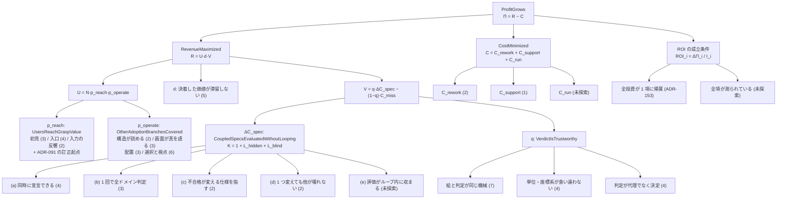

# 153. 投資はすべて利益の式の 1 項に吊る — 事業木を式から導出し、吊られていない木を数える

- Status: Accepted (**2026-09-27 実装** — 事業木 `profit-growth.gsn` を利益の式から導出し直し、ADR の木 58 本をすべてちょうど 1 項に吊った。`check-gsn-debt` G5 が吊られていない木・二重に吊られた木の個数を、G6 が吊り先の項と木の申告 (項・変更の種類) の一致を問う)
- Date: 2026-09-27
- Deciders: yuubae215 (要求: 「grasp のゴールに、お互いに依存関係のある仕様決めに対して何度もループせずに効率的に評価できる、を追加」/「メタゴールから要素分解し、必要なゴールを算出。算出の指針は算数の問題のように文章・図・式の三位一体」/「個別で木ができているものはすべて接続する。事業的な goal が無いのに実行していることになり、投資対効果が測れない」), Claude (起票・実装)
- Retires: GREP:docs/DEFERRAL_LEDGER.md::\| DEF-05[123] \| · GREP:.claude/skills/adr/SKILL.md::事業木への接続は保留してよい
- Supersedes / Superseded by: なし (`.claude/skills/adr/SKILL.md` §GSN 併設 の「事業木への接続は保留してよい」を改める。ADR-126 の `check-gsn-debt.mjs` に 5 つ目の問いを足す)

## Context — Goal と力学(§1.2 Goal)

**Goal:** *開発投資 (ADR とその論証木) はすべて、利益の式のちょうど 1 項に帰属しており、
帰属していない投資と二重に帰属した投資が機械に見える。* 投資対効果
`ROI_i = ΔΠ_i / I_i` の分子は、投資 i が動かす項が決まっていなければ書けない。

### 力学 1 — 57 本中 5 本しか吊られていなかった

2026-09-26 の gsn-maintain 棚卸しの実測:

| 事業木との関係 | 本数 | 例 |
|---|---|---|
| 事業木の solution から吊られている | 5 | 094 / 095 / 097 / 098 / 109 |
| 木の側に「接続は保留」の context を持つ | 35 | 096, 099–102, 104–108, 110–114, 118–126, 129, 133–139, 144, 145, 152 |
| 事業木に一切触れていない | 17 | 081, 103, 127, 128, 130–132, 140–143, 146–151 |

35 本の「保留」のうち、台帳 (`docs/DEFERRAL_LEDGER.md`) に満期の行を持つのは
110〜112 の 3 本 (DEF-051〜053) だけで、残りは「次に事業木を読み直す機会に確定する」
という散文だった。`pnpm test:gsn` も `pnpm test:gsn-debt` も緑 — **吊られていないことを
数える機械が無かった** (原則 #31: 不在はノードを持たないので、在るものを辿る検査は素通りする)。

### 力学 2 — 吊り先が無かった (原因は事業木の側)

売上の枝は `ByAdoptionFunnel` の 3 goal (価値が滞留しない / 入力で価値に到達できる /
その他の採用障壁) だけを持っていた。どれも**利用者が価値に着くまで**の主張で、
**着いた先の価値そのもの** — 判定が速く・正しく出ること — に goal が無かった。
grasp 系の木 (081、118〜152 の大半) は吊り先を持てず、ADR-152 の木は「その枝は
事業木に無い」と自分で記録していた。話題 (UI / grasp / 統治) で枝を切っていたので、
新しい話題の ADR が来るたびに吊り先が無かった。

### 力学 3 — 当事者の要求は「項」の形をしている

「お互いに依存関係のある仕様決めに対して、何度もループせずに効率的に評価できる」は
*ループ回数*という量についての主張である。量で書ける goal は、式の項として置けば
子 goal を算出できる。話題として置くと、何を子に持つべきかが決まらない。

## Options considered

| 案 | 内容 | 採否 |
|---|---|---|
| A | 話題で枝を切る (UI / grasp / 統治) — 旧来の形 | 却下 — 話題は項を持たず ΔΠ_i を式で書けない。新しい話題のたびに吊り先が無くなる (力学 2) |
| B | 1 本の木を寄与するすべての項に吊る | 却下 — 二重計上で ΣΔΠ_i が Π を超える。副次的な寄与は木の側の context に書く |
| C | 吊り先を木の側に書く (旧 adr skill の「保留」) | 却下 — 35 本がこの形で溜まった。接続の正本は事業木側に 1 つ (§1.1) |
| D | Proposed の木は吊らない | 却下 — solution は goal を増やさないので、吊っても事業木の `ToBeDeveloped` は増えない。成熟度は木の側の state が持つ |
| **E** | **事業木の goal を利益の式の項から導出し、全木をちょうど 1 項に吊り、吊られていない木を数える** | **採用** |

## Decision — Strategy(§1.2 Strategy)

### D1 — 事業木の goal を利益の式から導出する(文章・図・式の三位一体)

算数の文章題と同じく、**式が枝の数を決め、図が構造を持ち、文章が各項の意味を持つ**。
和の項には全項の子を、積の項には全因子の子を置く。どの因子にも枝が要る (積なので 1 つが 0 なら全体が 0)。

**式** (正本は `profit-growth.gsn` の context `ProfitFormula` — ここは導出の筋):

```
Π        = R − C                                         利益 = 売上 − 経費
R        = U · d · V                                     売上 = 利用者 × 届く率 × 1 回の価値
U        = N · p_reach · p_operate                       利用者 = 流入 × 到達率 × 継続率
V        = q · ΔC_spec − (1 − q) · C_miss                1 回の価値 = 正しさ × 節約 − 誤判定の出戻り
ΔC_spec  = K₀ · (t_e0 + t_m0) − K₁ · (t_e1 + t_m1)       節約 = 従来のループ費用 − ツールのループ費用
K        = 1 + L_hidden + L_blind                        ループ回数 = 1 + 後から見つかる依存 + 何を変えるか探す回数
C        = C_rework + C_support + C_run                  経費 = 手戻り + サポート + 運用
ROI_i    = ΔΠ_i / I_i,  ΔΠ_i ≈ (∂Π/∂x_i) · Δx_i          投資 i は吊られた項 x_i にだけ寄与を帰属させる
```

**文章** — 各項の読み:

- `V` の符号は `q` が決める。誤判定は価値 0 ではなく**負** (現場の出戻り `C_miss`) なので、
  速さだけ・正しさだけでは V は立たない。
- 当事者の要求「依存し合う仕様を何度もループせずに評価できる」は `ΔC_spec` の項で、
  `K₁` を下げることと同じ意味である。仕様を 1 つずつ順に決めると、後の仕様で前の仕様が
  覆り (壁に当たらない進入方向にしたら届かない)、そのたびにループが 1 回増える — これが
  `L_hidden`。不合格のあと何を変えるか当て推量で探す回数が `L_blind`。
- よって `K₁` を下げる手段は項から直接 4 つ算出され、評価時間の 1 つを足して子 goal が 5 つになる:
  (a) 依存する仕様を 1 か所に同時に宣言できる、(b) 1 回の評価が全ドメインを同時に判定する
  → `L_hidden`。(c) 不合格が変えるべき仕様を指す → `L_blind`。(d) 1 つ変えても他が壊れない
  → `t_m`。(e) 評価がループの中に収まる速さで返る → `t_e`。

**図** — 事業木の goal の骨格 (葉の solution = 各 ADR の木は省略。括弧内は吊られた木の数):



### D2 — 全 ADR の木をちょうど 1 項に吊る

各木は、事業木のいずれかの項の goal の下に `solution Adr<NNN>Tree` として吊り、
`artifacts` に木のパスを書く。solution の summary は木の top goal 名と「なぜこの項か」を 1 文で持つ。
木の goal ごとの証拠と鮮度の正本は木の側で、事業木は寄与する項だけを持つ (§1.1)。
主たる寄与先が複数考えられる木は 1 つを選び、起票時の予定先と違う場合は solution の summary に理由を書く。
木の側の「保留」context は「接続済み — 正本は事業木側」に書き換えた (git 履歴に旧記述が残る)。

### D3 — 吊られていない木・二重に吊られた木を数える (`check-gsn-debt` G5)

母集団は `docs/gsn/adr-*.gsn` の構文から導く (人の記憶の登録簿にしない)。数えるのは
事業木の **solution** の artifacts だけで、context / assumption からの参照 (=「接続予定」の散文) は
数えない。0 回も 2 回以上も fail する。

### D4 — 起票と同じ PR で吊る (adr skill の改訂)

`.claude/skills/adr/SKILL.md` §GSN 併設 の「事業木への接続は保留してよい」を
「起票と同じ PR で吊る」に改めた。保留を許した理由 (「証拠が未来形のうちに接ぐと事業木の
`ToBeDeveloped` を増やすだけ」) は solution で吊る形では成り立たない — solution は goal を増やさない。
吊り先の項が事業木に無いときは、**項を足す** (式を 1 段分解する) のが正攻法で、木を吊らずに置くことではない。

### D5 — 吊り先の妥当性を「独立した 2 つの申告の一致」で問う (`check-gsn-debt` G6)

G5 は「ちょうど 1 回」しか問わないので、誤った項に吊っても緑になる。項の選び方の妥当性を
機械に問わせるため、**2 つの別々の問いに別々に答えさせ、答えが噛み合うかを見る**:

| 申告する側 | 問い | タグ |
|---|---|---|
| 事業木の goal | 自分はどの項か / どんな種類の変更なら動かせるか | `term-*` (1 個) + `admits-*` (1 個以上) |
| ADR の木の top goal | 自分はどの項を動かすか / 自分は何を変えたか | `term-*` (1 個) + `change-*` (1 個) |

「どの項に効くか」は解釈で揺れるが、「何を変えたか (入口・画面の語り・宣言の語彙・判定の範囲・
絵と判定の一致・単位・統治の道具 …)」は ADR の Decision からほぼ一意に読める。後者を前者と
独立に書かせ、**項の goal が受け入れる種類の表** (`admits-*`) と突き合わせる。

```
一致  ⇔  term(木) = term(吊り先の最も近い祖先 goal)  ∧  change(木) ∈ admits(吊り先の最も近い祖先 goal)
```

項と種類の語彙は事業木のタグから導く (スクリプトに表を持たない — §1.1)。事業木に無い項・種類を
木が名乗ったら落ちる (原則 #31: 未宣言の種を既定で通さない)。

| 項 (term-) | 受け入れる変更の種類 (admits-) |
|---|---|
| p-reach | entrance / first-view / intake |
| p-operate | presentation / manipulation / selection |
| delivery | governance |
| l-hidden | declaration / judgement-scope |
| l-blind | diagnosis |
| t-modify | declaration-lifecycle |
| t-eval | performance |
| q | depiction-parity / quantity / judgement-correctness |
| c-rework | governance / boundary |
| c-support | safety |
| c-run | performance |
| roi | governance |

(この表の正本は `profit-growth.gsn` の各 goal の labels。ここは読むための写し。)

**当てた結果:** 2 本が起票時の予定先と食い違った — ADR-102 (変えたのは census という統治の道具 =
governance。予定先 PlacementIsPredictable = p-operate は governance を受けない → C_rework へ) と
ADR-105 (変えたのは画面の語り = presentation。予定先 ReworkCostMinimized = c-rework は presentation を
受けない → ScreenSaysWhatIsTrue へ)。どちらも副次的な寄与は木の側に残る。

**限界:** 2 つの申告を同じ人が同時に書けば一致させられる。問えるのは「吊った場所」と
「何を変えたか」が食い違う形だけで、admits の表そのものの妥当性は人の判断である
(広げるときは理由をその goal の summary に書く)。

## Consequences — Evidence と tradeoff(§1.2 Evidence)

論証木: [`docs/gsn/adr-153-every-investment-hangs-on-one-term-of-the-profit-formula.gsn`](../gsn/adr-153-every-investment-hangs-on-one-term-of-the-profit-formula.gsn)
(goal ごとの支えの正本は `.gsn` 側)。

- 事業木に吊られた木: **5 / 57 → 58 / 58** (ADR-153 自身の木を含む)。二重計上 0。
- 項と変更の種類が吊り先と一致: **58 / 58** (項 18・種類 17)。負の対照: 102 と 105 の吊り先を入れ替えると、両方が項と種類の両方で落ちる。
- 決着した残し: DEF-051 / 052 / 053 (110〜112 の木の事業木接続) — 各行の満期
  `GREP:docs/gsn/profit-growth.gsn::<top goal>` が発火したので行を削除した。
- 事業木の fan-out 1 の警告 2 件 (`ByScreenBandwidthBarriers` / `ByDirectManipulationTrust`) は、
  項の分解として 2 goal ずつ持つようになって消えた。
- 宣言された未支持 goal は差し引き 0: 支えを得て `support-unexplored` を外した 2
  (`ReworkCostMinimized` / `SupportCostMinimized`) と、式から算出されて未探索として足した 2
  (`EvaluationTurnaroundStaysInsideTheLoop` = t_e / `EveryTermIsMeasured` = ROI の分子)。

### 引き受けなかったもの(宣言する — 推論させない)

- **項の測定。** 帰属は決まったが、今日数値が毎 PR で出ている項は `d` の分母
  (`pnpm test:deferrals` の滞留件数) だけである。ROI の分子は依然として出ない —
  `EveryTermIsMeasured` (未探索) と `BusinessTargetsUnset` (数値目標の未設定) が別々の欠落として持つ。
  `K₀ / K₁` は dogfooding 記録から取れる見込み (`LoopCountIsNotYetMeasured`)。
- **主たる寄与先の正しさ (部分的)。** G6 は「吊り先」と「何を変えたか」の食い違いを落とすが、
  2 つの申告を同じ人が揃えて書けば通る。admits の表の妥当性も人の判断 (`PrimaryTermIsAJudgement`)。
  反証は項ごとの測定が入ったときに起きる。
- **価格・導入形態・CAD/PLC 接続・信頼性の証明** の採用障壁は、依然として
  `AdoptionBranchesUnexplored` が未展開として宣言している。
- **`C_run` と `t_e`** は同じ計測 (テンプレごとの応答時間) を共有できる可能性があるが、未探索のまま。

## Lens notes

- §0 三位一体: 式 (項と分解) / 図 (goal の骨格) / 文章 (各項の読み) を D1 に置き、
  式の正本は事業木の context に 1 つ。
- §1.1: 接続の正本を木の側の散文から事業木の solution へ移した。
- §1.2: Goal を「接続する」(解) から「投資が 1 項に帰属し、帰属しないものが見える」(性質) へ持ち上げた。
- 原則 #31: 数えるのは在る接続ではなく吊られていない木の個数。
- 原則 #32: 「接続する」という義務を、木の側の「いつか」から起票の PR (事象) へ移した。

## References

- ADR-109 (残しは宣言であり記憶ではない) / ADR-126 (主張である残しは論証木に住む — G1〜G4)
- ADR-081 (段階フィルタ — ΔC_spec の (b) に吊った) / ADR-152 (「その枝は事業木に無い」の記録)
- `docs/gsn/profit-growth.gsn` / `scripts/check-gsn-debt.mjs` / `.claude/skills/adr/SKILL.md`
