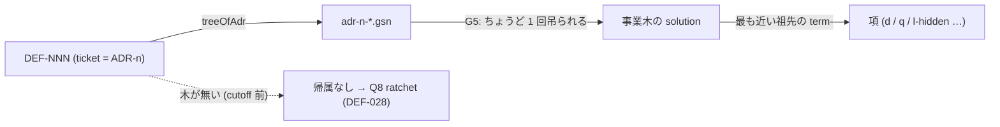

# 154. 残しは 1 行ずつ、利益の式のちょうど 1 項を滞留させる — 帰属は ticket から導出し、帰属しない行を数える

- Status: Accepted (**2026-09-27 実装** — `check-deferrals` Q8 が登録簿の各行を ticket → 木 → 吊り先の項と導出し、帰属しない行を ratchet (10)、2 項以上を fail にする。帰属の読み手を `scripts/gsn-attribution.mjs` に切り出し、`check-gsn-debt` G5 / G6 と共有)
- Date: 2026-09-27
- Deciders: yuubae215 (問い: 「DEF は GSN ツリーに繋がりますか？残しの管理をゴールに紐付けておかないとな」— 一拍俯瞰の推奨案「ratchet で縛り DEF-028 に紐付ける」を採択)
- Retires: なし — 消える表現は無い。木の無い ADR に紐づく残しが「GSN 側から見えない」事実 (ADR-126 の assumption `PreCutoffTreesStayMissing` / DEF-028) は今も成り立つ。変わるのはその個数が数えられることで、宣言を消すのは DEF-028 の木が書かれたときである
- Supersedes / Superseded by: なし (ADR-109 の ticket 欄に「帰属を運ぶ」意味を足し、ADR-153 の帰属を木から登録簿の行へ 1 段延ばす)

## Context — Goal と力学(§1.2 Goal)

**Goal:** *宣言された残しは 1 行ずつ、利益の式のちょうど 1 項に帰属していることが機械に
見え、帰属していない行は個数として数えられる。* 副次的に、滞留を**項ごとに**言えるようになる。

### 力学 1 — 全体としては繋がっていたが、1 行ずつは繋がっていなかった

2026-09-27 の実測 (登録簿 34 行):

| 経路 | 状態 |
|---|---|
| 残し**全体** → 項 `d` | 繋がっている。ADR-109 の木が `DecidedValueDoesNotStallBeforeUsers` (`term-delivery`) に吊られ、滞留件数が `d` の分母として毎 PR 出ている |
| **1 行ずつ**: ticket の ADR → `adr-NNN-*.gsn` → 吊り先の項 | 24 行は届く。ただし**ファイル名の規約を人が辿れば**であって、辿る機械は無かった |
| 届かない行 | 10 行 (DEF-004 / 006 / 009 / 017 / 018 / 019 / 020 / 022 / 024 / 050)。ticket の ADR (060 / 078 / 091 / 032 / 027 / 015 / 017 / 044 / 064 / 076) が木を持たない |

`d` の分母は「何件止まっているか」は言うが、「**どの項の価値が**止まっているか」は言わない。
`ROI_i = ΔΠ_i / I_i` の議論で残しを片付ける順序を決めるには後者が要る。

### 力学 2 — 見えないことは宣言されていたが、数えられていなかった

DEF-028 と ADR-126 の assumption `PreCutoffTreesStayMissing` は「その 11 本に紐づく残しは
GSN 側から見えず、登録簿が受け続ける」と**散文で宣言している**。何件が見えないかは誰も
数えていなかった — ADR-153 力学 1 (「接続は保留」の散文 35 本がどの検査でも緑) と同型
(原則 #31: 不在はノードを持たない)。

### 力学 3 — 語彙は足りている。無いのは線だけ

| 言いたい文 | いまの語で |
|---|---|
| DEF-037 はどの項の価値を滞留させているか | ticket (ADR-145) → 木 → 吊り先の項 — **言える** |
| 項 `q` に何件の残しが滞留しているか | 導出はできるが印字されていない |
| この残しはどの項にも帰属していない | **数える場所が無い** |

## Options considered

- **A: 登録簿に `goal` 列を足す** — tradeoff: ticket が既に木を決め、木は G5 で項をちょうど
  1 つ決める。列を足すと同じ事実を 2 か所に書き、ticket を直して goal 列を直し忘れる日が来る
  (§1.1 / ADR-129 の「語を足すと第二の源」)。
- **B: 帰属を ticket から導出し、帰属しない行を ratchet で縛る (採択)** — tradeoff: 帰属の粒度は
  **木 = 項**で止まり、木の中のどの goal を止めているかは言わない (項の滞留を数える Goal には足りる)。
- **C: B に加えて、木の無い 10 本の ADR の木も今回書く** — tradeoff: DEF-028 ごと決着するが PR が
  大きくなり、044 / 091 のように判断の閉じていない ADR の論証を急いで書くことになる。
- **D: 現状維持** — tradeoff: 1 行ずつの帰属は人がファイル名を辿る作業のまま。帰属しない行が
  増えても何も落ちない。

## Decision — Strategy(§1.2 Strategy)

### D1 — 帰属は導出する (列を足さない)

```
term(row) = { term(site(treeOfAdr(n))) | ADR-n ∈ ticket(row), treeOfAdr(n) ≠ null }
```

`site(tree)` は事業木で木を吊った場所の最も近い祖先 goal の `term-*` (ADR-153 D5 と同じ読み)。
ticket が同じ項に落ちる ADR を複数持つのは許す (集合なので 1 項)。

### D2 — `check-deferrals` Q8 ATTRIBUTION

| `|term(row)|` | 扱い |
|---|---|
| 1 | 帰属。項ごとの滞留として印字する (`項ごとの滞留 (ADR-154): l-hidden 8 · q 6 · …`) |
| 0 | 帰属なし。**`UNATTRIBUTED_BASELINE` で超えても下回っても fail** (ADR-103 — 古い baseline は数を記憶に戻す)。正当な 0 は ticket が cutoff 前の木の無い ADR のときだけで、その木を書く義務は DEF-028 が持つ |
| ≥ 2 | **fail**。1 行の残しを 2 項の滞留として読むと二重計上になる — G5 が木について禁じた形の、行の側の鏡像 |

### D3 — 帰属の読み手は 1 か所

事業木の走査 (`collectHungTrees` / `collectHangSites` / `topGoalLabels`) を `check-gsn-debt.mjs` から
`scripts/gsn-attribution.mjs` に切り出し、G5 / G6 と Q8 が同じ関数を import する。「ADR と木の同一性は
ファイル名の接頭辞 `adr-NNN-`」という規約も `treeOfAdr()` 1 か所に置く (`expiry-trigger.mjs` を切り出した
ADR-126 と同じ理由 — 2 つ目のパーサを書かない)。



## Consequences — Evidence と tradeoff(§1.2 Evidence)

論証木: [`docs/gsn/adr-154-a-deferral-stalls-exactly-one-term.gsn`](../gsn/adr-154-a-deferral-stalls-exactly-one-term.gsn)
(goal ごとの支えの正本は `.gsn` 側)。事業木では `DecidedValueDoesNotStallBeforeUsers` (`term-delivery`) に
`solution Adr154Tree` として吊った。

- `pnpm test:deferrals` — 項に帰属 24 件・帰属なし 10 件 (baseline 10)。項ごとの滞留:
  l-hidden 8 · q 6 · delivery 3 · t-modify 2 · p-reach 2 · p-operate 1 · c-rework 1 · roi 1。
- 負の対照: DEF-005 の ticket を木の無い ADR-060 に変えると 11 件で fail。ticket を
  `ADR-081 · ADR-109` (l-hidden と delivery) にすると 2 項で fail。
- `pnpm test:gsn-debt` — 切り出しの前後で出力が同一 (58/58 吊り・58/58 一致)。
- 波及: `scripts/check-deferrals.mjs` / `scripts/check-gsn-debt.mjs` / `scripts/gsn-attribution.mjs`、
  `docs/DEFERRAL_LEDGER.md` / `docs/STATE_LEDGER.md`。`src/`・`core/`・契約・登録簿の列構成は触らない。

### 限界 (宣言する — 推論させない)

- **帰属は ticket が決める。** 残しの**中身**がその項に本当に効くかは問えない — ticket を書いた人の
  判断に依存する。G6 の「2 つの申告を同じ人が揃えれば通る」と同じ限界。
- **粒度は項まで。** 木の中のどの goal を止めているかは言わない。項の滞留を数える Goal には足りるが、
  「この残しが決着したらどの goal が支えを得るか」は、知識的な残し (GSN の未支持 goal — ADR-126) の
  側でしか言えない。
- **ticket が段 (ADR でない) の行**は定義上帰属なしに数えられる。2026-09-27 時点で該当 0 行。

## Lens notes

- §1.1: 帰属を列ではなく導出にした。事業木の読み手を 1 か所に寄せた。
- §1.2: 「DEF を goal に紐付ける」(解) を「行ごとに 1 項に帰属し、帰属しない行が見える」(性質) へ持ち上げた。
- 原則 #31: 数えるのは繋がっている行ではなく**帰属しない行の個数**。N (2 項以上) も不正な基数として落とす。
- 原則 #33: 語彙は充足 — 無かったのは線だけ (ADR-129)。

## References

- ADR-109 (残しの登録簿) / ADR-126 (主張である残しは論証木に住む・DEF-028) / ADR-153 (投資は利益の式の 1 項に吊る — G5 / G6)
- `scripts/check-deferrals.mjs` Q8 / `scripts/gsn-attribution.mjs` / `docs/DEFERRAL_LEDGER.md`
