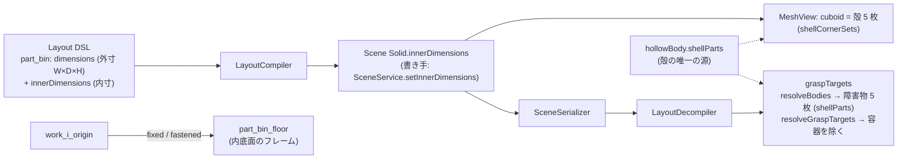

# 155. ツールは自分の長さで描き、ビンは 1 つの殻として置く — TCP の名札は他の名札と同じ仕組みで出す

- Status: Accepted (**2026-09-28 改訂・実装** — D1〜D5。初版 (2026-09-27) の D2 は撤回して置き換えた — 下の「改訂の記録」)
- Date: 2026-09-27 (改訂 2026-09-28)
- Deciders: yuubae215 (`/whiteboard` の問い「TCP のラベル小さくない？」「供給トレー上にたこ焼きみたいに球がならんで爪楊枝みたいにラインが刺さるのは何で？ツール長さとトレー深さとワークの置かれ方の関係性をみたい」→ 提案 1〜3 を採択、「トレーを 5 つの直方体でモデル化して」。改訂時の問い「供給トレーを表現する語彙はどうしました？内寸、外寸とか？」「語彙は在る、無いのは線だけ — って同じ PR スコープ内で他にもあったりしない？」→ 推奨案で賛成・ワークは parts bin の子・W/D/H は基準軸 +x・天 +z・右手系), Claude (起票・実装)
- Retires: GREP:src/view/RobotStage.js::_buildLabel · GREP:src/view/GraspSampleView.js::WHISKER · GREP:examples/layout_pick_place_cell.json::part_bin_wall · GREP:examples/layout_pick_place_cell.json::output_tray_wall · GREP:src/view/RobotStage.js::setText\('tcp'\) · GREP:src/view/GraspDeclarationMath.js::sub\(tcp,
- Supersedes / Superseded by: なし (ADR-151 決定 b の**適用範囲**を軸の棒に限ると明記する。ADR-133 の **D2 の画面側と D4** を実装する — 実体種別 `Container` (D1) と `workpieces` 展開 (D3) は DEF-041 のまま。ADR-128 のサンプル表示に線の意味を足す)

## Context — Goal と力学

**Goal (解ではなく性質): ビンの底のワークを狙うとき、ツール長・ビンの深さ・ワークの
高さの関係が、探索を走らせる前に画面で読める。容器は 1 つの実体として外寸と内寸で言え、
画面の容器と判定の容器は同じ形をしている。ワークは容器の子として容器と一緒に動く。
画面の名札は、どれも同じ仕組みで同じ大きさに読め、実体の名前を言う。**

当事者の観察は 2 つで、どちらも「絵が事実と違う」形をしていた。

**(1) TCP の名札だけが小さく、見た目も違う。** 他の名札は `EntityLabel` (ADR-070) — 画面 px
一定の HTML 札。TCP の名札は `RobotStage._buildLabel` の **world 寸法のスプライト** (文字高
`0.5 × 0.4 × 150 mm = 30 mm`) だった。ADR-151 で印を腕へ移したとき `EntityLabel` から外れ、
当事者決定 b「印の大きさは world 固定」 — **軸の棒**についての決定 — に相乗りしていた
(1 語が 2 事実を運んでいた — 原則 #33 (1))。しかも文字は `'tcp'` の直書きで、tcp 実体の
名前 (2 台目は `tcp_2`) を読んでいなかった。

**(2) 供給ビンの上に球が 3×3 に並び、短い線が刺さる。** ADR-128 の `GraspSampleView` —
Run が送るサンプル点そのもの。線は面の外向き法線を**マーカ半径 × 3 の固定長**で描いたもの
(長さに意味が無い)。点がビンの**上**に出たのは、サンプルの `part_bin` が**中身の詰まった箱
1 個**で、空洞もワークも無かったから — 探索はビンを蓋の上から掴んでいた。

**語彙は在った。** 容器は既存の Solid で外寸 `dimensions` + 内寸 `innerDimensions`
(ADR-133 D1/D5) と言え、壁厚・底厚は導出。ワークを容器の子にする関係は `jointType: fixed` +
`semanticType: fastened` (ADR-038 — `robot_base → robot_mount` と同じ語)。無かったのは線で、
`innerDimensions` は**障害物の分割にしか届かず**、コンパイラ・シーン・保存・逆コンパイル・
描画のどれも運んでいなかった (読み込んだシーンの探索では一度も効いていなかった)。

量の関係 (サンプルの既定値、mm):

- 外寸 `W 200 × D 150 × H 150`、内寸 `W 184 × D 134 × H 140` → 壁厚 `(200−184)/2 = 8`、底厚 `150 − 140 = 10`
- 縁 `z_rim = 950`、内底面 `z_floor = 810`、ワーク上面 `z_top = 810 + 25 = 835`、ツール長 `L = 150`
- フランジ `z_flange = z_top + L = 985` → 縁からの余裕 `z_flange − z_rim = 35`
- `z_top + L − z_rim < 0` のときフランジ (とその先の手首) は縁の下に入る。この不等式の片側
  (`z_top + L`) が画面の線の端点として見えることが D3。当たるかどうかの判定は `core/` のまま。

## Options considered

- **D1 (TCP の名札)**
  - A (採用): 軸の棒は world 固定のまま、名札だけ `EntityLabel` で印の位置に出し、文字は tcp 実体の名前。
  - B: スプライトに `sizeAttenuation:false`。— 大きさは直るが見た目は別物のまま、名札の仕組みが 2 つ残る。却下。
  - C: 名札も決定 b に含める。— 文字はオーバーレイ (原則 #27)。却下。
- **D2 (容器の形)**
  - A (初版で採用 → **撤回**): サンプル文書で底板 1 + 側板 4 の 5 Solid を手で並べる。— 容器という
    束の名前が消え (原則 #33 (2))、外寸は説明文にしか無く、内寸はどこにも書かれず、壁厚が 4〜8 か所に
    散る (§1.1)。ワークは世界座標で、ビンを動かすと置き去り。壁がどの容器のものかをデータが知らず D4 も書けない。
  - B (採用): 容器は **1 つの Solid (外寸 + 内寸)**。殻は `hollowBody.shellParts` ただ 1 か所から導出し、
    画面 (`MeshView`) と障害物 (`graspTargets`) が同じ関数を呼ぶ。`innerDimensions` をコンパイラ・シーン・
    保存・逆コンパイルに通す。
  - C: `Container` 実体種別 + `workpieces` 展開 (ADR-133 D1/D3)。— Outliner・選択・コンパイラ・ギャラリーへ波及し、要求より大きい。DEF-041 のまま。
- **D3 (線の意味)**
  - A (採用): 軸方向の取付けが宣言されていれば線を**ツール** (TCP → フランジ) として描き、端にフランジ点。
    フランジの式は `robotTool.flangeOf` 1 本 (手のプレビューと共有)。未宣言なら短い法線。
  - B: 手の形まで各点に描く。— 9 点 × 手の形は読めない (形の絵は ADR-152 の手プレビューが持つ)。却下。
  - C: 縁との余裕を数値化・色分け。— 「当たるか」の判定は `core/` (§AI 向けガード軸 1)。却下。
- **D4 (W/D/H)** — 当事者決定: 基準軸 +x、天 +z、右手系。問いは「長辺と短辺のどちらを +x に当てるか」。
  - A (採用): **W = ローカル +x、D = +y、H = +z、容器は W ≥ D (長辺を +x) を正規形にする**。
  - B: 正面規約 (手前から見た幅が W)。— 「正面」という新しい語が要り、置き場所で変わる事実を寸法に混ぜる。却下。
  - C: 規約なし。— 同じトレーが「200×150、回転 0」と「150×200、90° 回転」の 2 通りに書け、正規形が無い (原則 #28)。却下。
- **D5 (子の関係)** — 当事者決定: ワークは parts bin の子。
  - A (採用): 既存の語 `fixed` + `fastened` (ADR-038) で `work_i_origin` を容器の内底面フレーム `part_bin_floor` に拘束する。
  - B: `parentRef` を Solid へ広げる。— 「剛に取り付いて一緒に動く」の言い方が 2 つになる (第二の源)。Solid の親子はシーンに無く、姿勢を書く入口の個数 (ADR-097/101 の census) まで波及する。却下。

## Decision — Strategy

**D1. TCP の名札は `EntityLabel` で、文字は tcp 実体の名前。** `RobotStage` は factory を注入で
受け取り、印を作る `_attachTool` で名札を作り、`_detachTool` / スタイル切替 / `dispose` で解放する
(原則 #9)。文字の書き手は `setTcpName` ただ 1 つで、`AppController._syncRobotStage` が毎フレーム
`robot.tcpFrame.name` を渡す (2 台目は `tcp_2`、名前の変更が届く)。

**D2. 容器は 1 つの Solid (外寸 + 内寸)。**
- 殻の唯一の源 = `src/domain/hollowBody.js` の `shellParts` (本体座標) / `shellCornerSets` (8 隅からの三線形)。
  底板は外寸いっぱい、±x 壁は外寸 D いっぱい、±y 壁はその間。上は開いている。
- シーン: `Solid.innerDimensions` (null = 詰まった立体)。書き手は `SceneService.setInnerDimensions`
  ただ 1 つで、`hollowBodyGap` で外寸と照合する。合わない宣言は**適用せず** `innerDimensionsRejected`
  → toast (原則 #11)。読み込み 2 経路と複製がこれを呼ぶ。
- 描画: `MeshView.setShell` で `cuboid` の幾何そのものが殻 5 枚になる。ピック・支え・スナップが読む
  メッシュが殻なので、空洞の中のワークをクリックでき、ワークは内底面に載る (支え = `part_bin`)。
- 往復: `LayoutCompiler` → シーン DTO → `SceneSerializer` → `LayoutDecompiler` が `innerDimensions` を運ぶ
  (無ければキー自体を出さない — 原則 #31)。
- 探索: `resolveBodies` = 全実体 (障害物の母集団)、`resolveGraspTargets` = 容器を除く (掴む対象)。
  述語は `hollowBody.isContainer` 1 つ (ADR-133 D4)。
- 面の編集: 殻の三角形は実体の 6 面に対応しないので、容器は面ピックを返さず、Edit Mode は理由つきで
  拒否する (`CONTAINER_EDIT_DEFERRED_REASON`)。外寸と内寸を一緒に変える編集は DEF-055。

**D3. サンプルの線はツール。** `GraspSampleMath.sampleLines` が線分とフランジ点を返し、
フランジは `robotTool.flangeOf(tcp, approachDir, L)` — `GraspDeclarationMath.handPreview` と
同じ 1 本の式。ツール長は `axialToolLengthMm(robot)`。

**D4. W/D/H。** `hollowBody.DIMENSION_WORDS` が対応表の唯一の置き場所。ワイヤ (スキーマ) は x/y/z の
まま — W/D/H は人が読む語で、スキーマに第二の綴りを足さない。容器 (内寸を持つ Solid) は
`LayoutValidator` が W ≥ D と「内寸 < 外寸」を問い、違反は文書の入口で拒否する。普通の Solid には
正規形を課さない (既存の Solid を壊さない — 当事者確認「トレーのモデルだけの話」)。N パネルは Solid の
**本体座標の**寸法を W/D/H で、容器なら内寸も並べて出す (世界の外接箱は回した物体では W/D/H ではない)。

**D5. ワークは容器の子。** サンプルは `part_bin` に内底面フレーム `part_bin_floor` を持たせ、
`work_i_origin → part_bin_floor` を `fixed` / `fastened` で結ぶ。容器を動かすとワークが同じだけ動く。

**この絵が見せないもの (宣言):** 傾いた進入 (`tiltTolerance`)、平行ジョーの把持深さ、フランジより先
(手首・腕)。直進・深さ 0 の場合の絵であって、判定ではない。

## Consequences

- 肯定的:
  - 容器は「外寸・内寸」で 1 実体として言え、画面・Outliner・障害物・保存が同じ宣言から出る。
  - サンプルのセルは「ビンの底のワークを取る」問題を解き、ワークは内底面に載り、容器と一緒に動く。
  - 線の端 (フランジ) が縁より上か下かが Run の前に見える。フランジの式は 1 本。
  - 名札の仕組みが 1 つになり、TCP の名札は実体の名前を他と同じ大きさで言う。
  - `innerDimensions` が初めて読み込んだシーンの探索まで届く (以前は分割関数があるのに届いていなかった)。
- 受け入れるコスト:
  - 容器は面の押し出し・Edit Mode ができない (DEF-055)。寸法の変更は文書で行う。
  - 殻は非同期の Wasm 経路を通らず同期で作る (5 箱 = 120 頂点。読み込み時の数個分)。
  - `templates/single-arm-pedestal-cell/` と `core/tests/test_engine.py` は旧サンプル (詰まった箱のビン) を
    写した受け入れ固定値のまま (直すと core の既存の答えが動く — 別判断。README に明記)。
  - スキーマ外の経路 (シーン JSON の読み込み) で届いた不正な内寸は、障害物側では従来どおり詰まった箱に
    倒れる (ADR-133) — 画面側は toast で言う。
- 検証 (証拠): goal ごとの支えの正本は **`docs/gsn/adr-155-the-tool-is-drawn-at-its-length-and-the-bin-is-a-shell.gsn`**。
- 波及 (blast radius): `hollowBody` (新設) / `graspTargets` / `Solid` / `SceneService` / `SceneSerializer` /
  `LayoutCompiler` / `LayoutDecompiler` / `LayoutValidator` / `MeshView` / `HitTestService` / `AppController` /
  `UIStateManager` + `UIViewBridge` + `NPanelGeneric` / `RobotStage` + `RobotStageSet` + `SceneView` /
  `GraspController` / `GraspSampleView` + `GraspSampleMath` / `GraspDeclarationMath` / `robotTool` /
  サンプル文書 1 本 / e2e S12・S14。**触らない**: 契約 (`innerDimensions` は layout 1.0 に既存)・`core/`・`templates/` の固定値。

## 改訂の記録 (原則 #19 — 判断の履歴を消さない)

初版 (2026-09-27, PR #416 の最初のコミット) の D2 は、当事者の「5 つの直方体で」を**文書の 5 実体**として
実装した。当事者の問い「内寸、外寸とか？」で、語彙 (`innerDimensions`) が在るのに**線を引かずデータのほうを
崩した**ことが分かった。同じ PR を棚卸しすると同じ形がほかに 4 つ在った:

| 迂回した事実 | 在った語 | 初版がしたこと | 改訂 |
|---|---|---|---|
| フランジの位置 | `handPreview` の式 | 別の式で書き直した | `flangeOf` 1 本 (D3) |
| TCP 名札の文字 | tcp 実体の名前 | `'tcp'` 直書き | `setTcpName` (D1) |
| ワークがビンの中 | `fixed` / `fastened` | `above` + 世界座標 | D5 |
| 縁・上面の高さ | 実体の寸法 | 説明文に数値を写した | 説明文から数値を消した |

「5 つの直方体」は当事者の意図 (容器として干渉させる) としては正しく、改訂でも殻は 5 箱のまま —
変わったのは、それを**宣言**するのではなく 1 つの宣言から**導出**すること。

## Lens notes

- 語彙 (原則 #33): 足した語は W/D/H (軸の名前、表 1 つ) だけ。割ったのは「TCP の印の大きさ」(棒 / 名札)。
  それ以外は既存の語に線を引いた。
- 状態台帳: 「容器の空洞」(詰まった / 殻 / 拒否)、「TCP の名札」、「サンプルの線の意味」を
  `docs/STATE_LEDGER.md` に記録。
- 正規形 (原則 #28): 容器の寸法は W ≥ D で 1 通りに決まる (180° 回転を除く)。

## 残し

- DEF-055 — 容器の外寸・内寸を画面で編集する操作 (面の押し出しと Edit Mode) は未実装。外寸と内寸をどう一緒に動かすかをまだ決めていない。
- DEF-041 — `Container` 実体種別と `workpieces` 展開 (ADR-133 D1/D3) は未実装。D2 の画面側と D4 は本 ADR で実装した。
