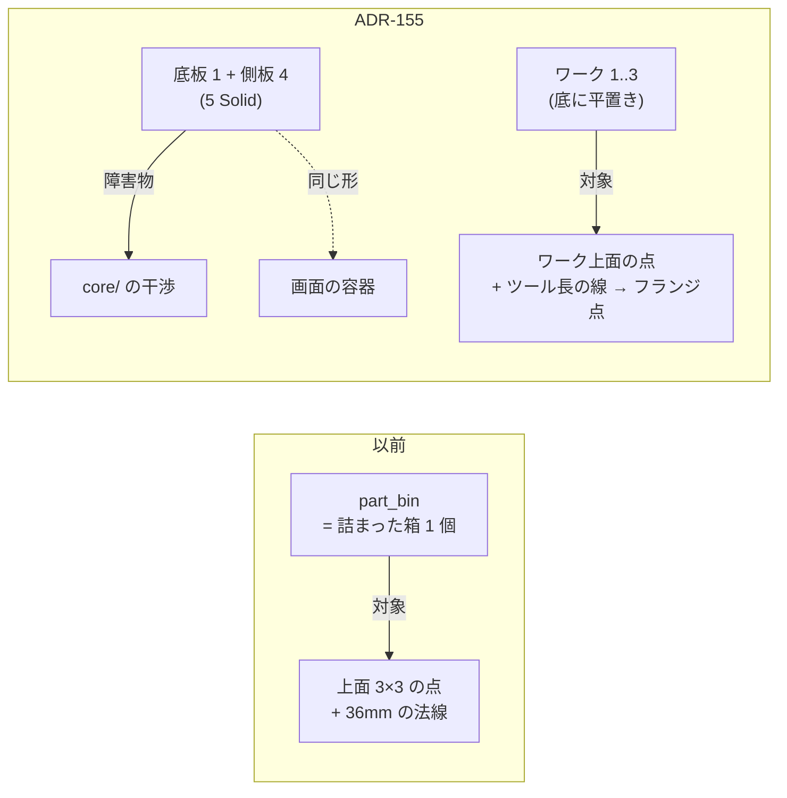

# 155. ツールは自分の長さで描き、ビンは殻として置く — TCP の名札は他の名札と同じ仕組みで出す

- Status: Accepted (**2026-09-27 実装** — D1 / D2 / D3 すべて)
- Date: 2026-09-27
- Deciders: yuubae215 (`/whiteboard` の問い「TCP のラベル小さくない？」「供給トレー上にたこ焼きみたいに球がならんで爪楊枝みたいにラインが刺さるのは何で？ツール長さとトレー深さとワークの置かれ方の関係性をみたい」→ 俯瞰の提案 1〜3 を採択し、「トレーを 5 つの直方体でモデル化して。そうしないと干渉するでしょ」を追加), Claude (起票・実装)
- Retires: GREP:src/view/RobotStage.js::_buildLabel · GREP:src/view/GraspSampleView.js::WHISKER · GREP:examples/layout_pick_place_cell.json::"part_bin" · GREP:examples/layout_pick_place_cell.json::"output_tray"
- Supersedes / Superseded by: なし (ADR-151 決定 b の**適用範囲**を軸の棒に限ると明記する — 決定 b 自体は変えない。ADR-128 のサンプル表示に線の意味を足す。ADR-133 D2 を**サンプルの文書で**先に実現する — 実体種別 `Container` (D1) と展開 (D3) は DEF-041 のまま)

## Context — Goal と力学

**Goal (解ではなく性質): ビンの底のワークを狙うとき、ツール長・ビンの深さ・ワークの
高さの関係が、探索を走らせる前に画面で読める。探索は実際に掴むもの (ワーク) について
解き、画面の容器と判定の容器は同じ形をしている。画面の名札は、どれも同じ仕組みで同じ大きさに読める。**

当事者の観察は 2 つで、どちらも「絵が事実と違う」形をしていた。

**(1) TCP の名札だけが小さく、見た目も違う。** 他の名札 (座標フレーム・Solid 名・注釈) は
`EntityLabel` (ADR-070) — 画面 px 一定の HTML 札で、暗い下地とアクセントバーを持つ。
TCP の名札は `RobotStage._buildLabel` の **world 寸法のスプライト**で、文字高は
`0.5 × 軸長 = 0.5 × 0.4 × 150 mm = 30 mm`。引けば点になる。ADR-151 で印を腕
(`wrist_3_link`) の子に移し、tcp のフレームビューを描かなくなったときに `EntityLabel` から
外れた。その際の当事者決定 b「印の大きさは world 固定」は**軸の棒**についての決定で、
名札はそれに相乗りしていただけ — 名札の大きさを決めた行はどこにも無い (1 語が 2 事実を運んでいた — 原則 #33 (1))。

**(2) 供給ビンの上に球が 3×3 に並び、短い線が刺さる。** これは ADR-128 の
`GraspSampleView` — Run が送るサンプル点そのもの。球は `GRID = 3` の格子、線は面の外向き
法線を**マーカ半径 × 3 の固定長**で描いたもの (長さに意味が無い)。点がビンの**上**に出たのは、
サンプル文書 `examples/layout_pick_place_cell.json` の `part_bin` が **200×150×150 の
中身の詰まった箱 1 個**で、ワークも空洞も無かったから — 探索は「ビンそのものを蓋の上から
吸着で掴む」問題を解いていた。

量の関係 (サンプルの既定値、単位 mm):

- ビンの縁 `z_rim = 950`、底板の上面 `z_floor = 810`、ワーク上面 `z_top = 810 + 25 = 835`
- ワークの沈み `z_rim − z_top = 115`、ツール長 `L = 150`
- フランジの高さ `z_flange = z_top + L = 985` → 縁からの余裕 `z_flange − z_rim = 35`
- **ビンが深くなるか (`z_rim ↑`)、ワークが薄くなるか (`z_top ↓`)、ツールが短くなる (`L ↓`) と、
  `z_top + L − z_rim < 0` でフランジ (とその先の手首) は縁の下に入る** — この不等式の片側
  (`z_top + L`) が画面の線の端点として見えることが D3 の中身。当たるかどうかの判定は
  `core/` のまま。

## Options considered

- **D1 (TCP の名札)**
  - A (採用): 軸の棒は world 固定のまま、名札だけ `EntityLabel` で印の位置に出す。
  - B: スプライトに `sizeAttenuation:false` を付けて画面一定にする。— 大きさは直るが
    見た目 (下地・アクセント) は別物のまま、名札の仕組みが 2 つ残る (§1.1)。却下。
  - C: 名札も world 固定の決定 b に含めると明文化する。— 決定 b の理由 (「ツールと一緒に
    拡縮する腕の一部」) は文字に当てはまらない。文字はオーバーレイ (原則 #27)。却下。
- **D2 (容器の形)**
  - A: 既存 Solid の `innerDimensions` (ADR-133 D5) をサンプルに宣言する。— 障害物は 5 箱に
    割れるが、**シーングラフは 1 個の詰まった箱のまま描かれる** (DEF-041)。中のワークは
    箱に埋もれて見えず、画面と判定の形が食い違う。当事者の要求「5 つの直方体で」にも合わない。却下。
  - B (採用): サンプル文書で**底板 1 + 側板 4 の 5 Solid** を置き、ワーク 3 個を底に置く。
    画面・Outliner・障害物 (`obstaclesExcluding` は Solid ごとに 1 箱) がすべて同じ 5 枚になる。
  - C: `Container` 実体種別 + `workpieces` 展開 (ADR-133 D1/D3) を今回実装する。— Outliner・
    選択・コンパイラ・ギャラリーへ波及し、要求 (このセルで関係を見たい) より大きい。DEF-041 のまま。
- **D3 (線の意味)**
  - A (採用): 軸方向の取付けが宣言されていれば、線を**ツールそのもの** (TCP = サンプル点 →
    フランジ = 点 + 法線 × L) として描き、端にフランジ点を置く。未宣言なら従来の短い法線。
  - B: 手の形 (筐体・爪) まで各点に描く。— 9 点 × 手の形は読めない。形の絵は仕様に焦点を
    当てたときの手のプレビュー (ADR-152) が既に持つ。却下。
  - C: 縁との余裕を数値で出す / 当たりを色分けする。— 「当たるか」の判定は `core/` の責務
    (§AI 向けガード軸 1)。front が色で答えれば第二の判定になる。却下。

## Decision — Strategy

**D1. TCP の名札は `EntityLabel` で出す。** `RobotStage` は名札の factory を注入で受け取り
(`createLabel` — renderer/DOM を知らないまま)、印を作る `_attachTool` で名札を作り、
`_detachTool` / スタイル切替 / `dispose` で解放する (原則 #9: 名札は名指す印より長生きしない)。
毎フレーム `RobotStageSet.updateLabelPositions(activeCamera)` が印の世界位置へ投影する。
腕が隠れている・最初の見た目を待っている間は名札も出さない。`_buildLabel` (world スプライト) は削除。
決定 b は**軸の棒**についての決定として残る。

**D2. サンプルのビンとトレーは 5 つの直方体。** `part_bin` → `part_bin_floor` +
`part_bin_wall_{px,nx,py,ny}` (外寸 200×150×150、底板 10、側板 8)、`output_tray` →
`output_tray_floor` + `output_tray_wall_*` (外寸 250×150×40、底板・側板 5)。ワーク
`work_1..3` (60×40×25、1 個は 30° 回転) をビンの底に置く。関係は `above` (側板 → 底板、
ワーク → 底板、底板 → 作業台)。実体同士は重ならない (確認済み)。

**D3. サンプルの線はツール。** `GraspSampleMath.sampleLines(samples, {radius, toolLengthMm})`
が純粋に線分とフランジ点を返し、`GraspSampleView` は描くだけ。ツール長は探索の主語の
ロボットの取付けから `axialToolLengthMm(robot)` (新設 — 仕様の手プレビューと共有し、
2 つの overlay がツール長で食い違えないようにする) で読む。

**この絵が見せないもの (宣言):** 傾いた進入 (`tiltTolerance`)、平行ジョーの把持深さ、
フランジより先 (手首・腕)。直進・深さ 0 の場合の絵であって、判定ではない。

## Consequences

- 肯定的:
  - 名札の仕組みが 1 つになり、TCP の名札は他と同じ大きさ・見た目で読める。
  - サンプルのセルは「ビンの底のワークを取る」問題を解き、画面の容器と判定の容器が同じ 5 枚。
  - 線の端 (フランジ) がビンの縁より上か下かが、Run の前に見える。
- 受け入れるコスト:
  - 側板・底板も把持対象の候補として並ぶ (容器を対象から外す ADR-133 D4 は DEF-041 のまま)。
    選択の既定は無い (ADR-117 — N なら明示選択) ので、誤って容器を掴む探索は起きない。
  - サンプルの実体数が 8 → 19 に増え、Outliner が長くなる。
  - `templates/single-arm-pedestal-cell/` と `core/tests/test_engine.py` は旧サンプル
    (詰まった箱のビン) をワイヤ単位に写した**受け入れ固定値**で、今回は触らない
    (直すと core の既存の答えが動く — 別判断)。README に「ADR-155 以前のサンプルの写し」と明記した。
- 検証 (証拠): goal ごとの支えの正本は **`docs/gsn/adr-155-the-tool-is-drawn-at-its-length-and-the-bin-is-a-shell.gsn`**。
- 波及 (blast radius): `RobotStage` / `RobotStageSet` / `SceneView` / `AppController` の描画ループ 1 行 /
  `GraspSampleView` + `GraspSampleMath` / `GraspController` のツール長の読み (2 か所 → 1 関数) /
  `robotTool.axialToolLengthMm` / サンプル文書 1 本 / e2e S12 の対象名。**触らない**: 契約・`core/`・
  `templates/` の固定値・`innerDimensions` の障害物分割 (ADR-133 D5 — 今回のサンプルは使わない)。

## Lens notes

- 語彙 (原則 #33): 語は既に在った (`EntityLabel`、`innerDimensions` / Solid、`toolLength`)。
  足した語は無い。割ったのは「TCP の印の大きさ」(棒 / 名札)。確かめる手段 (4) が欠けていた
  「ツール長 × 深さ」に絵を足した。
- 状態台帳: 「TCP の名札」(ロボットにつき 0..1、印と同じ基数) と「サンプルの線の意味」
  (`tool` / `normal` の 2 — 取付けの宣言から導出) を `docs/STATE_LEDGER.md` に追記。
