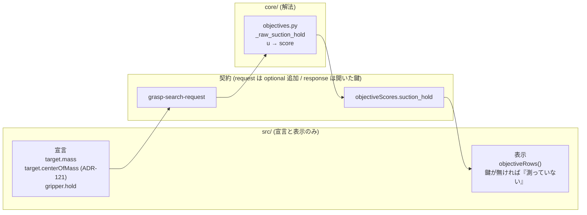

# 156. 吸着の保持は宣言された質量と保持力から採点する — 「掴めない」と「最良」を物理の両端にする

- Status: Proposed (未実装 — ADR だけの回。前提は ADR-121 の `target.centerOfMass`)
- Date: 2026-09-29
- Deciders: yuubae215, Claude
- 段: **G-1b** (`docs/grasp/implementation-order.md`)。前提: **G-1 (ADR-121)** — 重心が宣言された事実として運ばれていること
- Retires: なし — objective を 1 つ足すだけで、既存のものは置き換えない。`grasp_stability` は ADR-121 D4 の理由 (既存の応答値が黙って変わる) でそのまま残す
- Supersedes / Superseded by: なし (ADR-121 D4 が仮に `com_offset` と呼んだ objective を、吸引については `suction_hold` として具体化する。ADR-120 の「評価不能は鍵の不在」と ADR-075 の「絶対基準の正規化」にそのまま乗る)

## Context — Goal と力学

要件は 2 回に分けて出た:

> 吸着の場所によって把持の確率を算出するモデル作れたりする？スコアでいいと思うけど。
> 絶対掴めない場所と、重心を安定させて掴める場所を最大・最小にして正規化するみたいな。

> 質量と吸着力も入力に持って、完全版で進めて

**Goal (性質):** 吸着ハンドの候補ごとに、**その位置で吸ったときに対象が外れないか**が
スコアに現れる。外れる位置は 0、この対象とこのハンドの組で物理的に最良の位置は 1。
値は宣言された量 (質量・重心・保持力) だけから決まり、量が欠けていれば推測で埋めない。

### 力学 (1) — いまのスコアは吸着の保持を見ていない

- `NaiveSuctionGraspChecker` (ADR-118 D4) が問うのは**シールが張れるか** (カップ径ぶん
  平坦な面があるか) だけ。張れたシールが**対象の重さに耐えるか**は問われていない。
- `grasp_stability` は進入方向と法線の内積 = 正対度しか見ない。重心の真上を吸っても、
  端を吸って大きくモーメントがかかっても、正対していれば同じ点になる。
- ADR-121 は「重心が無いと吸引の判定が成立しない」と書いたが、**重心だけでも成立しない**。
  モーメントが保持力を超えるかどうかは、重さ (質量) と保持力 (ハンドの能力) が無いと
  比べられない。今日、どちらも契約のどこにも無い。

### 力学 (2) — 「最大・最小で正規化」には 2 つの読み方があり、片方は禁止されている

- **その回の候補集合の min / max で割る** — ADR-075 が禁止している (相対正規化)。
  候補集合が変わると基準が動き、別のリクエストと比べられなくなる。
- **物理から解析的に出した両端で割る** — 「外れる」(u = 1) と「この対象で可能な最良」
  (u = u_best) は、どちらも問題の条件だけで決まる。候補集合に依存しない。
  `reach_margin` がロボットのリーチ範囲 (問題の条件) で割っているのと同じ形で、許される。

依頼の意図は後者で読める (「絶対掴めない場所」「重心を安定させて掴める場所」は
どちらも物理の言葉)。この ADR は後者を採る。

### 力学 (3) — 「確率」ではなくスコアである

式から出るのは**決定的な余裕の写像**であって、成功確率ではない。確率にするには実際の
成功・失敗の記録で較正する必要があり、それは dogfooding (`docs/dogfooding/`) の記録が
溜まってからの話になる。依頼者も「スコアでいい」と言っている。確率を契約に載せることは
ADR-122 D4 (歩留まりは決定的レーンの外) とも衝突する。

### 位置づけ (層)



CLAUDE.md §AI 向けガード の 3 軸で問うと、これは**軸 1 (アイデア — コスト関数)** に当たる。
閉形式の静力学から組むが、「どの破壊様式を数えるか」「何を 1 とするか」はスコア設計の判断で
あって公知の閉形式ではない。よって**計算は `core/` のみ**、フロントは宣言と表示だけを持つ。

## Options considered

- **A: 物理の両端で正規化する保持余裕 (採用)** — 静力学の利用率 u から、u = 1 を 0 点、
  u = u_best を 1 点とする。tradeoff: 入力が 3 つ (質量・重心・保持力) 要り、どれかが
  欠けると評価できない。
- **B: その回の候補の min / max で正規化** — 入力が少なくても順位は出る。tradeoff:
  ADR-075 違反。候補集合が変わるとスコアの意味が変わり、テンプレ間で比べられない。却下。
- **C: 質量に依存しない幾何だけの版** (偏心 d⊥/r と傾きだけで採点) — 入力は重心だけ。
  tradeoff: 相対的な良し悪しは出るが、「絶対に掴めない」という閾値が引けない。
  依頼者が「完全版で」と明言したので主案にしない。A の式は質量と保持力を消去すると C に
  退化するので、C は A の特殊ケースとして失われない。
- **D: `grasp_stability` の意味を書き換える** — ADR-121 D4 が既に却下している
  (既存の応答値が黙って変わる)。
- **E: 何もしない** — 吸着ハンドで、重心から遠い端を吸う候補が上位に来続ける。

## Decision — Strategy

### D1 — 入力は 3 つの宣言。どれも request 側の optional 追加で、版を上げない

| 語 | 置き場所 | 意味 | 単位 |
|---|---|---|---|
| `centerOfMass` | `target` | 重心 (ADR-121 D1 — 出所つきの kind union)。この ADR は追加しない | world と同じ長さ単位 (mm — ADR-136) |
| `mass` | `target` | 対象の質量。**誰かが採った値** (実測・図面・カタログ) | kg |
| `hold` | `gripper` の `suction` 枝 | 吸着ハンドの保持能力の束: `{ force, friction }` | `force` は N、`friction` は無次元 |

- `hold` は**束に名前を付けたもの** (原則 #33-2)。`force` と `friction` はいつも一緒に
  使われ、片方だけでは保持が判定できない。だから束の中ではどちらも **required** にし、
  束ごと optional にする。「保持力は宣言したが摩擦は宣言していない」状態を表現できなくする。
- `hold.force` は**使う人が採った保持力**。カタログの理論吸着力に安全率を掛けるかどうかは
  使う人が決めて、その結果を書く。ソルバは安全率を持たない (持つと、宣言した値と判定に
  使った値の 2 つの源ができる)。
- `hold.friction` は**カップのパッドと対象面の間の**静止摩擦係数。本当は組 (パッド × 対象面)
  の性質だが、1 リクエスト 1 ハンド 1 対象なので、今はハンド側に置いて足りる
  (前提は GSN の assumption に置く)。
- `target` と `gripper.suction` はどちらも `additionalProperties: false` なので、
  **スキーマ自体の更新は要る** (CLAUDE.md §AI 向けガード)。optional 追加なので
  `contractVersion` は上げない (ADR-083/084 の先例)。
- 質量を材質・寸法・「何に近いか」から**推定**するのは ADR-121 D3 と同じく propose レーン
  (`core/recommendation/`) の仕事で、ワイヤには乗らない。乗るのは人か決定的な規則が
  **採った**値だけ。

### D2 — 利用率 u は、吸着の 2 つの破壊様式の静力学で決める

記号: 接触点 p、その点の対象の外向き法線 n (単位ベクトル)、カップ半径 r = `cupDiameter`/2、
重心 c、質量 m、標準重力 g₀ = 9.80665 m/s²、重力方向 ẑ_down = (0, 0, −1)
(ROS world frame — CLAUDE.md)、保持力 F = `hold.force`、摩擦係数 μ = `hold.friction`。

重力 **W** = m·g₀·ẑ_down。カップに掛かる荷重を 3 つに分ける:

```
F_n     = −W · n                           引き剥がす力 (正 = 対象がカップから離れる向き。負 = 押し付け)
F_t     = | W − (W · n) n |                面に沿う力
M_peel  = | τ − (τ · n) n |,  τ = (c − p) × W      カップをめくる向きのモーメント
```

2 つの破壊様式 (どちらも剛体カップ・静的つり合いの閉形式):

- **めくれ (peel)** — 吸着力 F はカップ中心に、外力はその上に掛かる。カップの縁を支点に
  倒れないためには、縁の反力が負にならないこと: `M_peel ≤ (F − F_n) · r`。
- **すべり (slip)** — 面を押し付けている力は `F − F_n`。すべらないためには
  `F_t ≤ μ · (F − F_n)`。

それぞれを 1 以下なら持つ形に書き直し、大きいほうを取る:

```
u_peel = ( F_n + M_peel / r ) / F
u_slip = ( F_n + F_t / μ   ) / F
u      = max( u_peel, u_slip )          u < 1 ⇔ 外れない
```

`M_peel / r` は長さの比なので、長さ単位 (mm) は u から消える。u は無次元で、
質量 (kg)・g₀ (m/s²)・F (N) の単位だけがそろっていればよい。

**形状係数 k (めくれの項の重み) は持たない。** 縁まわりのつり合いから係数 1 が出るので、
調整つまみを置く理由が無い。係数を置けば、それは閉形式ではなく**アイデア**になり、
誰かがその値を決める責任を負う。

### D3 — 正規化の両端は物理から出す: u = 1 が 0 点、u_best が 1 点

**最良の下限 u_best** — 引き剥がす向き (F_n ≥ 0) の姿勢すべてについて、
θ を重力と −n のなす角 (0 ≤ θ ≤ π/2) とすると

```
u ≥ u_slip ≥ (m g₀ / F) · (cos θ + sin θ / μ) ≥ (m g₀ / F) · min(1, 1/μ)  =:  u_best
```

最後の不等号は、`cos θ + sin θ / μ` が [0, π/2] で上に凸なので最小が端点 (θ = 0 または π/2)
にあることから出る。等号は、重心がカップの軸上にあり (M_peel = 0)、θ が端点のときに成り立つ。
**u_best は候補集合に依存しない** (m・F・μ だけで決まる) — ADR-075 の絶対基準を満たす。

```
score = clamp( (1 − u) / (1 − u_best),  0,  1 )
```

- u ≥ 1 (外れる) → **0**。
- u = u_best (この対象とこのハンドで物理的に最良) → **1**。
- 押し付ける向き (F_n < 0。下から持ち上げる姿勢) では u < u_best になりうる。clamp で 1 に
  収める。u_best が下限になるのは引き剥がす向きの姿勢だけ、という範囲を ADR が宣言しておく。

**u_best ≥ 1 のときは、全候補が 0 点であって「評価不能」ではない。** 素直に `NormSpec` に
渡すと幅 (1 − u_best) が 0 以下になり、`normalize()` は `None` (評価不能 — ADR-120) を返す。
けれど「このハンドではどの位置でも保持できない」は**決定された事実**であって、測れなかった
のではない。事実を「測っていない」として描くと、利用者はハンドが弱いことを知らないまま
重みを疑う。だから実装は u_best ≥ 1 を `NormSpec` に渡す前に分け、鍵を出したうえで 0 を入れる。

### D4 — 何か 1 つでも欠けていれば鍵を出さない (ADR-120 / ADR-121 D2)

`suction_hold` の鍵が `objectiveScores` に**出ない**条件を列挙しておく (原則 #31 — 種を列挙する):

| 欠けているもの | 扱い |
|---|---|
| `target.mass` | 評価しない (鍵なし) |
| `target.centerOfMass` | 評価しない (鍵なし)。図心で代用しない (ADR-121 D2) |
| `gripper.hold` | 評価しない (鍵なし) |
| ハンドが `parallelJaw` | 評価しない (鍵なし)。吸着の破壊様式はジョーには当てはまらない |

どれも 0 点ではない。0 点は「外れる」という決定された事実にだけ使う (D3)。

**分かっている限界:** 鍵が無い理由 (どれが欠けたか) はワイヤに載らない。閉じたスコア層に
理由の欄を生やさない統治 (ADR-060) のためで、クライアントは自分が送ったリクエストから
理由を**導出**できる (何を送らなかったかはクライアントが知っている)。

### D5 — objective の名前は `suction_hold`。ADR-121 D4 の `com_offset` (仮) は吸引についてこれで具体化する

`com_offset` は「重心のずれ」を名乗るが、この objective が測るのは**ずれだけでなく重さと
保持力の比**である。名前が測る量より狭いと、クライアントは名前が嘘をついている量で
メーターを描く (ADR-118 力学 (2) の `openingNearestMiss` と同じ形)。

平行ジョーで重心を使う objective (把持軸まわりのモーメント・すべり) は**まだ決めていない**。
それが必要になったとき、ジョーの破壊様式に合わせて別の名前で足す。

### D6 — 今回決めないこと (「対象外」ではない)

- **u ≥ 1 をハードゲートにするか** — 「外れる」は決定された事実なので、本来は
  `graspable: false` として候補を落とすのが筋かもしれない。けれどそれは feasibility の段を
  増やし、応答の near-miss (`graspNearestMiss` の kind union) に `hold` を足す
  **response の版上げ**になる。まずスコアとして入れて、実際の順位で「0 点の候補が上位に
  残って困る」ことが観測されたら、その日に版上げとして別 ADR を起こす。
- **動的荷重** (搬送時の加速度) — 今回は静荷重だけ。加速度を足すなら `m (g₀ ẑ_down − a)`
  に置き換えるだけで式は変わらないが、a をどこで宣言するか (ロボット側の運動計画か、
  使う人の宣言か) が決まっていない。
- **n まわりのねじり** — 重心が偏ったまま傾くと n まわりのモーメントも出る。摩擦で受けると
  仮定し、今回は数えない。
- **確率への較正** — 力学 (3)。

## Consequences — Evidence と tradeoff

### 得られるもの

- 吸着の候補の順位に**重さに耐えるか**が入る。重心から遠い端を吸う候補が下がり、
  重心の真上を吸う候補が上がる。
- 0 点と 1 点がどちらも物理の言葉で読める (「外れる」「この組で最良」)。
  別のリクエストのスコアと比べられる。
- 「このハンドでは保持できない位置しかない」が、全候補 0 点として**見える**
  (評価不能と区別される — D3)。

### 払うもの

- **入力が 3 つ要る。** どれかが欠ければ評価されない。宣言の手間がスコアの前提になる。
- **1 点は余裕の大きさではない。** 重い対象を弱いハンドで吸うと u_best が 1 に近くなり、
  最良の位置でも余裕は薄い。それでも最良の位置は 1 点になる。スコアが言うのは
  「この組で可能な範囲のどこにいるか」であって、「どれだけ余裕があるか」ではない。
  余裕そのもの (1 − u) を見せたいなら別の事実として足す — 1 つの語に 2 つの事実を
  運ばせない (原則 #33-1)。
- **剛体カップの静力学は近似である。** ベローズや柔らかいパッドはめくれ方が違う。
  高忠実度の模型への差し替えは `_raw_suction_hold` の中で閉じ、契約 (0-1 の値) は変わらない。
- 状態台帳に行が 1 つ増える (`docs/STATE_LEDGER.md` — 吸着保持の入力束と、保持できる位置の
  有無)。

### 波及 (blast radius)

実装時に触るもの:

- `packages/grasp-contract/schema/grasp-search-request.schema.json` — `target.mass`、
  `gripper` の `suction` 枝に `hold`。**response スキーマは触らない**
  (`objectiveScores` は開いた鍵の写像なので、鍵が 1 つ増えるだけ)。
- `core/easy_extrude_core/engine/objectives.py` — `suction_hold` を `OBJECTIVE_REGISTRY` へ。
  `core/.../engine/types.py` (`TargetObject.mass` / `SuctionGripper.hold`)、
  `core/.../engine/pipeline.py` (ワイヤ → ドメインの変換)、`core/.../contract/models.py` (binding)。
- BFF の導出型 (`pnpm --filter easy-extrude-bff run gen:contract-types` で再生成)。
- フロントの宣言面: 新しいスキーマ欄は `CONFIRMATION_BY_FIELD`
  (`src/view/GraspDeclarationConfirmation.test.js` — 母集団はスキーマ) が確かめる絵を要求する。
- 式の正本は実装と同じ PR で `docs/ALGORITHMS.md` へ移し、この ADR はそこを参照する形にする
  (§1.1 — 式を 2 か所に置かない)。

触らないと宣言するもの: `mocks/graspStub/` (スタブは `suction_hold` を計算しない。
計算しなければ ADR-120 の規律で鍵が出ないだけで、契約違反ではない)、`grasp_stability`、
`NaiveSuctionGraspChecker` (シールの判定と保持の判定は別の問い)。

### 検証 (証拠) — 未実装

goal ごとの支えの正本は論証木 `docs/gsn/adr-156-suction-hold-is-scored-from-declared-mass-and-hold.gsn`。
予定している問い所:

| 主張 | 問い所 (予定) |
|------|-------------|
| 重心の真上・法線が重力に沿う候補が 1 点、外れる候補が 0 点 | `core/tests/test_engine.py` の `suction_hold` の境界値テスト |
| 候補集合を変えてもスコアが変わらない (絶対基準) | 同じ候補を別の候補集合に混ぜて同じ値が出ること |
| 入力が 1 つでも欠ければ鍵が出ない (D4 の 4 行) | 欠けた種ごとに鍵が**無い**ことを assert (値ではなく鍵の不在で比べる — ADR-120) |
| u_best ≥ 1 は「評価不能」ではなく 0 点 | 弱いハンドで鍵が**在り**、値が 0 であること |
| 長さ単位が u から消える | 同じ幾何を mm と m で与えて u が一致すること |

## Lens notes

- **様態:** 判定は候補ごとの純粋関数 (入力 → u → score) で、事象も状態遷移も持たない。
- **状態 (核 §1.4):** 吸着保持の入力束は「揃っている / 欠けている」、保持できる位置は
  「ある (u_best < 1) / 無い (u_best ≥ 1)」の 2 状態ずつ。遷移を持たない値の区別なので
  `docs/STATE_TRANSITIONS.md` には節を起こさない。台帳 `docs/STATE_LEDGER.md` に行を足した。
- **依存方向:** 計算は `core/` のみ。`src/` から `core/` を import する経路は作らない
  (越境は契約だけ)。
