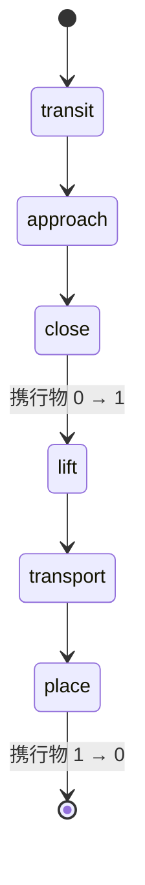

# 157. 干渉は瞬間ではなく動作の相で問う — 相ごとの判定・棄却の帰属・全相分析・引き上げの宣言

- Status: Accepted (2026-09-30 当事者合意 — 相の範囲・引き上げの宣言・全相分析の 3 点を当事者が決定。同じ PR で実装)
- Date: 2026-09-30
- Deciders: yuubae215, Claude
- 段: **G-8** (`docs/grasp/implementation-order.md`)。前提: ADR-145 (腕の干渉) / ADR-152 D5 (手の形の干渉)
- Retires: なし — 既存の 3 チェッカ (進入線分・腕・手の形) は消さず、**進入相の部位**として同じ実装のまま使う。`rejectedByInterference` も残る (相の内訳はその分解であって置換ではない)
- Supersedes / Superseded by: なし

## Context — Goal と力学

当事者の言葉 (2026-09-30):

> 干渉の状態遷移は重要だと思うよ。さらに、あったらあったでどの状態で干渉したかも分析できると思う。

直前の棚卸しで、干渉判定の 3 チェッカが**ピック動作のどこを見ているか**を並べた:

| 動作 | 進入線分 | 腕 | 手の形 |
|---|---|---|---|
| 待機 → pre_grasp | ✗ | ✗ | ✗ |
| 進入 (pre_grasp → 把持点) | ✓ | 把持姿勢の 1 瞬間だけ | ✓ (6 点) |
| 爪を閉じる | ✗ | — | ✗ (爪は開いたまま) |
| 引き上げ (ワークを持った状態) | ✗ | ✗ | ✗ |

ビンピッキングで一番事故が起きやすい**引き上げ**が一切判定されておらず、しかも
**判定していないことが応答のどこにも現れない**。`rejectedByInterference` は 1 つの数で、
「進入で腕が隣のワークに当たった」と「(判定していないので) 引き上げは当たらなかった」を
区別できない — 原則 #31 の「在るものを辿る検査は不在を素通りする」そのものである。

**Goal (性質):**

- **G1 (被覆)** — 候補の成立をピック動作の**相ごとに**問い、判定していない相は
  「当たらない」ではなく「判定していない (理由つき)」と応答が言う。
- **G2 (帰属)** — 干渉による棄却を「どの相で」当たったかに帰属させ、足すと
  `rejectedByInterference` に戻る。
- **G3 (分析)** — 求めたときだけ、全相を最後まで評価し「どの相で・どの部位が・どの障害物に」
  当たったかを集計して返す。これは答え (候補・ファネル) を 1 ビットも変えない。

「30fps で共有してほしい」という最初の要求は解の形だった。干渉は静止したシーンに対する
判定なので入力が変わらない限り答えも変わらない — 周期で取りに行くのではなく、
**相の事実を 1 回で受け取る**形にすれば、再生 (アニメーション) はクライアントの導出になる
(再生そのものは残し — DEF-059)。

### 語彙 (原則 #33)

| 言いたい文 | 欠けていた語 | 足した語 |
|---|---|---|
| 「引き上げ中に、持ったワークがトレーの壁に当たる」 | 動作の段階の列に名前が無い / 持ったワークに名前が無い | **動作相** (`transit` / `approach` / `close` / `lift` / `transport` / `place`) と部位 **`held`** |
| 「進入相で腕が隣のワークに当たって棄却された」 | 1 つの数が相 × 部位 × 障害物を兼務 | 相の内訳 `interferencePhases`、分析の `hits` |
| 「搬送相はまだ判定していない」 | 判定していないと当たらなかったが同じ形 | 相ごとの **`evaluated` / `unevaluated{reason}`** |
| 「引き上げは真上に 50mm」 | 引き上げの方向と距離に語が無い | Solid の宣言 **`lift {along, distance}`** |

「段」は判定の段 (リーチ → IK → 把持性 → 可視性 → 干渉、ADR-081) で既に使われている。
動作の段階は**相**と呼び、干渉の段の中をさらに割るものとする (同名異義を作らない)。

## Options considered

- **A: 相ごとの判定 + 相の内訳を応答に必須で載せる + 分析は要求したときだけ (採用)**
  — tradeoff: response の閉じた層に必須欄が 2 つ増える = 版上げ (v7 → v8)。
- **B: 引き上げの判定だけを既存の干渉チェッカに足す** — tradeoff: 版上げは要らないが、
  棄却が増えた理由を誰も読めない (1 つの数のまま)。「判定していない相」も言えないまま。
  当事者の「どの状態で干渉したか分析できる」を満たさない。
- **C: 分析を常に行う (モードを持たない)** — tradeoff: 全相を最後まで評価するので
  最悪で相の数倍の計算になる。通常の探索 (編集中に何度も投げる) を遅くする理由が無い。
- **D: 現状維持** — tradeoff: 引き上げの干渉が「取れる」として出荷され続ける (q を下げる)。

## Decision — Strategy

### D1. 動作相は 6 つの**順序つきの列**で、判定は相ごとに行う



分岐の無い直線フロー (BPMN 型)。相ごとに**動く物体の集合**が違い、とくに**携行物 (`held`)
の基数が `close → lift` で 0 → 1 に遷移する** — 今の実装はここがずっと 0 のまま固定されて
いた。相の定義と被覆の宣言表 `PHASE_COVERAGE` (相 × 部位 → `evaluated` / `atEndOnly` /
`unevaluated` / `notMoving`) の正本は `core/easy_extrude_core/engine/phases.py` ただ 1 箇所。
表は**未宣言の相・部位で throw** する (原則 #31 の既定表の規律)。

| 相 | tcpPath | arm | hand | held |
|---|---|---|---|---|
| transit | unevaluated | unevaluated | unevaluated | notMoving |
| approach | evaluated | **atEndOnly** (把持姿勢の代表解だけ) | evaluated (6 点) | notMoving |
| close | notMoving | notMoving | evaluated (爪の掃引 — 厳密) | notMoving |
| lift | evaluated (形が未宣言のときの代理) | unevaluated | evaluated (閉じた手) | evaluated |
| transport | unevaluated | unevaluated | unevaluated | unevaluated |
| place | unevaluated | unevaluated | unevaluated | unevaluated |

`unevaluated` のセルの個数は ratchet で数える (超えても下回っても fail — ADR-100 と同形)。

### D2. 相の判定は 3 値で、応答は 6 相すべてに行を持つ

候補ごとの相の判定は `clear` / `collides{部位, 障害物}` / `unevaluated{reason}`。
応答 `diagnostics.interferencePhases` は**相の順に 6 行ちょうど**を持つ kind 判別の union:

```jsonc
{ "phase": "approach", "kind": "evaluated",   "rejected": 4 }
{ "phase": "lift",     "kind": "unevaluated", "reason": "liftUndeclared" }
```

`unevaluated` の行に `rejected` は**無い** (0 と評価不能は同じ数に見える — ADR-120)。
理由の語彙は閉じている: `notYetDecided` / `gripperUndeclared` / `handShapeUndeclared` /
`targetBoxUndeclared` / `liftUndeclared`。どの相が判定されるかはリクエストの宣言だけで
決まる (候補に依らない)。

### D3. 棄却は**最初に当たった相**へ帰属させる

相 k の判定は、それより前の相が `clear` であることを前提にしている (爪を閉じられるのは
進入できた手だけ)。したがって帰属は動作の順で短絡する:

$$\text{棄却相}(c) = \min\{\,k \mid v_k(c) = \texttt{collides}\,\}$$

$$\texttt{rejectedByInterference} = \sum_{k \,\in\, \text{evaluated}} \texttt{rejected}_k$$

後者は応答の不変条件で、`core/` とスタブの両方でテストが焼く。

### D4. 爪を閉じる相は**掃引体積で厳密に**判定する

平行ジョーの爪は閉じ軸 (フランジ x) に沿って並進するだけなので、開いた位置
(内面間 `maxOpening`) から閉じた位置 (内面間 = 対象 box の閉じ軸方向の厚み
`w = 2 Σ hᵢ |aᵢ·x|`) までの掃引は**それ自体が 1 つの箱**になる:

$$c_x = \pm\frac{x_{open} + x_{closed}}{2},\quad h_x = \frac{t}{2} + \frac{x_{open} - x_{closed}}{2},\quad x_{\cdot} = \frac{\text{内面間}}{2} + \frac{t}{2}$$

離散化しないので刻みのすり抜けが無い。吸引ハンドはこの相に動く部品を持たないので
`evaluated` かつ常に `clear` (`notMoving` を宣言した行)。形か対象 box が未宣言なら
`unevaluated` (幅を推測しない)。

### D5. 引き上げは**宣言**する — 既定値を持たない (当事者決定 2)

Layout DSL の Solid (掴まれる側) に `lift: {along, distance}` を宣言する。

- `along: "reverseApproach"` — 進入してきた向きを逆にたどる (候補ごとに方向が違う)
- `along: "worldUp"` — ワールド +Z (ROS REP-103)
- `distance` — mm (ワイヤでは m)

未宣言なら引き上げ相は `unevaluated{liftUndeclared}` で、**既定の 50mm などで埋めない**
(必須入力の欠落に既定値を与えない — PHILOSOPHY Yellow Card)。引き上げ相で動くのは
閉じた手 (形が未宣言なら TCP の線分) と**携行物 = 対象 box**。携行物は `t ∈ (0, 1]` の
6 点で置く (t = 0 は閉じた直後の状態そのもので、対象が元々触れている床・隣のワークとの
**静止接触**は動作が起こした干渉ではない)。同じ理由で携行物は相対 1e-6 だけ縮めて置き、
面一の接触を当たりにしない。宣言の確認の絵は、対象の上に描く引き上げの矢印
(`CONFIRMATION_BY_FIELD['target.lift']`)。

### D6. 全相分析はリクエストの宣言で求め、答えを変えない (当事者決定 3)

リクエスト `graspSearch.interferenceAnalysis: "allPhases"` (optional、既定
`firstCollision`) を送ると、干渉の段に達した全候補について**判定される全相を最後まで**
評価し、応答 `diagnostics.interferenceAnalysis` に集計を返す:

```jsonc
{ "kind": "allPhases", "candidatesAnalysed": 32,
  "phases": [ { "phase": "lift", "collided": 7,
                "hits": [ { "part": "held", "obstacleIndex": 3, "candidates": 5 } ] } ] }
```

`collided` は相ごとに非排他 (1 つの候補が複数の相で当たりうる)。`obstacleIndex` は
リクエストの `obstacles[]` の添字で、名前への写像はリクエストを組んだフロントが持つ
(名前をワイヤに載せない)。求めなかったときは `{ "kind": "firstCollision" }` —
欄の省略で示さない (ADR-135 と同じ選択)。**候補・順位・ファネルは両モードで同一** で、
テストが同じリクエストを 2 モードで流して比べる。

フロントでは:

- **バックエンドがあるときだけ**提示する。スタブ・未接続ではボタンを理由つき disabled
  にする (固定スロット — 原則 #15)。スタブは分析を返さない (数を捏造しない)。
- 走っている間フロントに影響を及ぼさない: 分析は**直前の探索結果のリクエストの写し**を
  送り直すもので、状態は探索 (`context.grasp`) とは別のスロット `context.graspAnalysis`
  に住む。探索パネル・選択・ゴースト・編集はそのまま使える。結果が返った時点で探索が
  やり直されていれば、結果は捨てずに **stale** と表示する (stale は保存せず、
  分析したリクエストと今の結果のリクエストの同一性から毎回導出 — 原則 #23)。

### D7. 契約 v7 → v8

response の閉じた層 (`diagnostics`) に必須の `interferencePhases` と
`interferenceAnalysis` を足すので版上げ。request 側の `target.lift` と
`interferenceAnalysis` は optional 追加 (ADR-083/084 の先例)。

### D8. 理由の文は画面からはみ出さない

阻止理由・エラー文は長い 1 語 (ref 名・パス) を含む。スマホ幅で横にはみ出して見切れて
いたので、パネル内の理由文は**折り返す** (`overflow-wrap: anywhere`) — 省略記号で
切らない (理由は全文が読めて初めて理由である — 原則 #11)。

## Consequences — Evidence と tradeoff

- 肯定的:
  - 引き上げで当たる候補が「取れる」として返らなくなる (q)。
  - 棄却の相が見えるので、どの宣言を変えればよいかが読める (L_blind)。
  - 判定していない相が応答に行として出るので、残し (transit / transport / place /
    腕の途中姿勢) が数えられる。
- 受け入れるコスト / 否定的:
  - 手の形と対象 box を宣言したリクエストでは、**閉じる相で新たに棄却が出うる**
    (爪の掃引が隣のワークを通る候補)。既存の答えが変わるのは意図した修正である。
  - 引き上げの携行物は 6 点の離散判定で、刻みより薄い**水平な**障害物 (蓋) はすり抜けうる。
  - 腕は引き上げ相で判定しない (`unevaluated` を宣言 — DEF-058)。
  - 版上げ 1 回。
- 検証(証拠): goal ごとの支えの正本は `docs/gsn/adr-157-interference-is-asked-per-motion-phase.gsn`。
  入口: `core/tests/test_motion_phases.py` (相ごとの fixture・帰属の恒等式・2 モードの答えの
  同一性・被覆表の ratchet)、`mocks/graspStub/conformance.test.js` (スタブの恒等式)、
  `packages/grasp-contract/test/contract.test.mjs`、`src/domain/targetLift.test.js`、
  `src/view/GraspDeclarationConfirmation.test.js`。
- 波及(blast radius): `core/engine` (feasibility / phases / pipeline / types) · 契約 ·
  BFF 型 · スタブ · `src/domain` (lift の解決・ワイヤ) · パネル · 宣言の絵 · 3 つの DSL スキーマ。
  **触らない**: ADR-017 の WebSocket、ADR-027 の Wasm 経路 (相の事実は小さくゼロコピーは要らない)。

## 残し

- **DEF-057** — transit / transport / place の相は**未実装** (軌道計画 = 探索、ADR-146 軸 2 で `core/` の責務)。
- **DEF-058** — 腕の途中姿勢は**未実装** (進入中・引き上げ中の IK を刻んで腕を判定する)。
- **DEF-059** — 相の時系列の再生は**未実装** (フロントの導出。30fps の要求はここで満たす)。

## Lens notes

- 様態: 動作相は分岐の無い逐次フロー (BPMN)。候補ごとの相の判定は、その列の上の
  最初の `collides` で止まる短絡評価。
- 状態台帳: 動作相・相の判定・全相分析の実行 (`context.graspAnalysis`) の 3 行を
  `docs/STATE_LEDGER.md` に追加。分析の実行は `running` / `done` / `failed` + 不在で
  3 状態を跨ぐので `docs/STATE_TRANSITIONS.md` §Grasp interference analysis に節を起こした。
