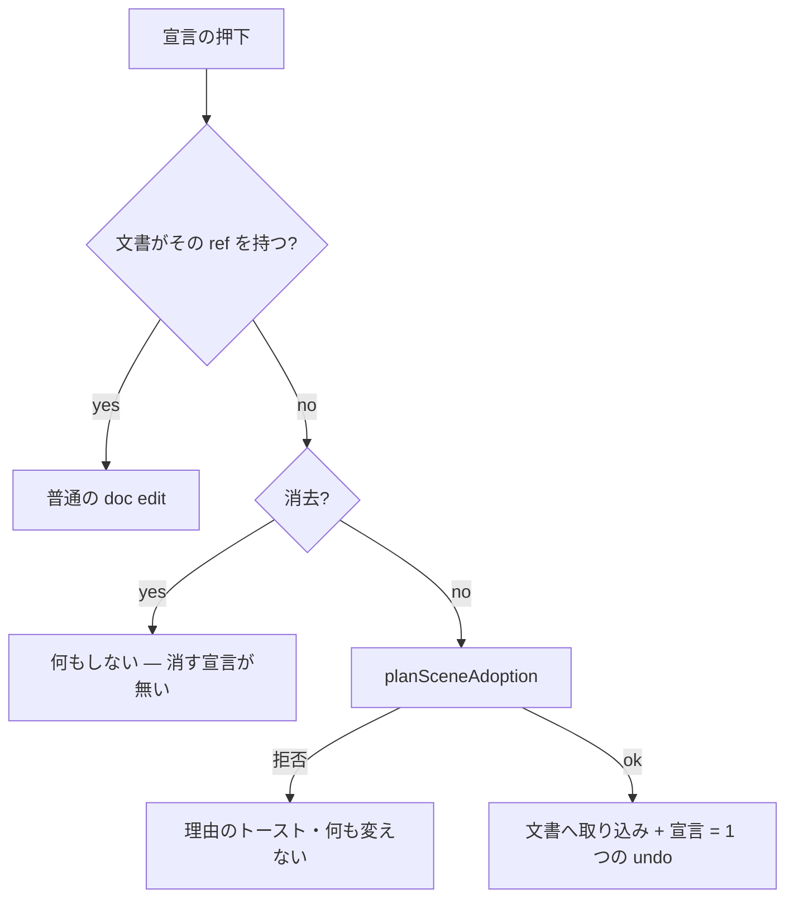

# 159. 画面の物に宣言する押下が、その物を文書へ取り込む — 「先に文書を採れ」をやめる

- Status: Accepted (実装済み 2026-10-02 — D1〜D4)
- Date: 2026-10-02
- Deciders: yuubae215, Claude
- 段: なし (DEF-049 の決着。ADR-152 が残した判断)
- Retires: GREP:src/controller/GraspController.js::GRASP_DECLARATION_NEEDS_DOCUMENT — 「先に文書を採れ」のトースト。`src/ScreenAdoption.test.js` が、文書 0 個での宣言が通ることを問う (トーストが戻れば同じテストが落ちる)。**DEF-049** は同じ PR で登録簿から消した
- Supersedes / Superseded by: なし (ADR-129 D0「宣言の同一性は文書の `ref`」を保ったまま、ADR-132 の「探索は画面について解く」と継ぎ目を閉じる。ADR-132 D4 が退役させた quick-start とは**別の動詞**である — §Options の B と D)

## Context — Goal と力学 (§1.2 Goal)

**Goal:** *画面に置いた物には、その場で宣言できる。宣言は文書と同じ寿命・同じ経路
(undo・エクスポート・再生成) を持つ。*

### 見つかり方 — 当事者の言葉

> Grasp Search するのに Context をまずは作れとか読み込め、って…なんか微妙じゃない？
> 気軽に Grasp Search できないやん。

スクリーンショットでは、把持パネルで質量・重心・把持仕様を入れようとするたびに
`Grasp specs are saved in a context document — adopt one first (Context ▾)` が出て、
同じトーストが 2 枚重なっていた (2 回押した — 押して何も起きなければ人はもう一度押す)。

### 力学 (1) — 探索は画面について解くのに、宣言は文書にしか書けない

| 事実 | 源 | 文書が 0 個のとき |
|---|---|---|
| 探索する幾何 | 画面 (ADR-132 — `decompileLayout`) | 動く |
| 宣言 (把持仕様・質量・重心・lift) | 文書の実体 `ref` (ADR-129 D0) | **書く場所が無い** |

ADR-132 で探索は文書無しで動くようになったが、宣言の側は文書を前提にしたまま
残った。ADR-152 の実装で「無言で消える」を「理由を出す」に変えたが (原則 #11)、
宣言そのものを可能にするには判断が要るとして DEF-049 に置いた。

### 力学 (2) — 文書が在っても、画面で足した物には無言で書けなかった

`setEntityGraspFeature` / `setEntityMassDeclaration` は、文書に無い `ref` に対して
**変化の無い clone** を返す (担体を捏造しないため)。`ContextController` はそれを
そのまま doc edit として実行し undo に積んでいた。つまり文書を読み込んだあと Shift+A で
足した箱に質量を入れると、**押下は消費され、undo 記録が 1 つ増え、何も書かれない** —
原則 #11 の最悪形が、文書 0 個の壁の陰に隠れていた。2 つは同じ欠陥 (宣言する押下が、
文書に無い物について何も言えない) の 2 つの基数 (文書 0 個 / 文書 1 個だが物 0 個) である。

## Options considered

- **A: 宣言をシーンのインスタンスに持たせる** (tcp の手 — ADR-152 D3 — と同じ扱い)。
  安いが ADR-129 D0 に反し、文書とシーンの二源が制度化される。宣言はエクスポートで
  運ばれず、文書を後から採ると衝突する。tcp の手の例外は広げない。**却下。**
- **B: 宣言する押下で、その物を文書へ取り込む (文書が無ければ起こす)。** 文書は
  画面からの導出 (φ⁻¹) なので**失うものが無い**。**採用。**
- **C: トーストに「画面から文書を作る」ボタンを置き、1 タップ挟む。** 明示的だが
  手数が 1 つ増え、「気軽に」を満たさない。押下はすでに「この物について言いたい」の
  表明なので、もう 1 回確認するのは同じ問いを 2 度聞くことになる。当事者が B を選んだ
  (2026-10-02)。
- **D: 押下で quick-start の文書を読み込む** (ADR-132 以前の形)。選ばれていない文書で
  画面を**入れ替える** — ADR-132 D4 が語彙から消した動詞そのもの。**却下。** B との差は
  「別の文書を採る」か「画面から文書を起こす」かで、前者はシーンを捨て、後者は捨てない。

## Decision — Strategy (§1.2 Strategy)

### D1 — 宣言の入口は 1 つ。物が文書に無ければ、同じ押下が取り込む

`ContextController._declareAbout(ref, …)` が `setGraspFeature` / `setMassDeclaration` の
唯一の経路になる (原則 #1)。

`GraspController` は文書の有無を問わずここへ委譲する。文書 0 個でも 1 個でも
同じ経路を通るので、力学 (2) の無言の no-op も同時に消える。

### D2 — 取り込む実体は φ⁻¹ の読み、誰が頼んだかは given fact が言う

- 実体は `decompileLayout` が出す正規形 — 探索がすでに読んでいるのと同じもの。
  文書は「探索が見たもの」を言う。Origin とその下の frame は実体に畳まれて一緒に入る。
- 取り込むのは**宣言した 1 つだけ**。画面の他の物は未宣言のまま残る (ADR-131)。
  勝手に全部を文書へ入れると、頼んでいない物が文書の実体になる。
- ADR-046 不変条件 1 (誰も頼んでいない仕様の禁止) は、given fact
  `f_on_screen` (「画面に置いた物」) からの `derives` trace で満たす。頼んだのは、
  その物について宣言した利用者である。
- 文書が無ければ `createBlankDoc` から起こす。

### D3 — 物は compiled id で作り直される。だから undo はスナップショットで戻す

文書は実体を `solid_<ref>` で投影する。Shift+A の箱は `obj_…` で生まれているので、
取り込みは物を**作り直す**。`ref` (パネルと探索が鍵にするもの) は変わらず、
**シーンの id だけが変わる**。

- 取り込む id は再生成の**前に** footprint へ入れる (`ContextService.adoptFromScene`)。
  入れなければ ADR-131 の保存規則が古い物を残し、同じ物が 2 個になる。
- 前の文書の再生成では元の物は戻らない (前の文書はそれを投影していない、あるいは
  存在しない)。よって `AdoptFromSceneCommand` の undo は、押下の瞬間に取った
  **シーン全体のスナップショット**を元の id ごと戻し、文書 (0 個も含む) と footprint を
  戻す (`ContextService.restoreSnapshot`)。undo は LIFO なので、redo のときシーンは
  スナップショットと同じで、同じ取り込みが同じ compiled id で再び成り立つ。
- 初めての取り込みは `contextLoaded` ではなく `contextChanged` を出す。何も入れ替えて
  いないので、undo スタック・選択・カメラは利用者のもののまま。

### D4 — 作り直すと何かが宙に浮く物は、理由つきで拒否する

`planSceneAdoption` (純粋, `src/domain/sceneAdoption.js`) は、作り直したとき古い id を
指したまま残るものがあれば拒否する: **自分の一部でない子** (`has-children`) と
**SpatialLink** (`linked`)。黙って切らない (原則 #11)。拒否の理由は閉じた語彙
`ADOPTION_REFUSAL` で、未宣言の理由は throw する (原則 #31)。これらを取り込めるように
するのは別判断 (子・リンクごと文書へ入れるか、指し先を張り替えるか) — DEF-060 として残し、
**ADR-163 で決着** (2026-10-04: シーン全体を逆変換してから連結成分ごと入れる。この 2 つの拒否理由は退役し、
拒否は `unconvertible` だけになった)。

## Consequences — Evidence と tradeoff (§1.2 Evidence)

### 得られるもの

- 文書を作る・読む手順を踏まずに、画面の物へ把持仕様・質量・重心を宣言できる。
- 宣言はその瞬間から文書の事実なので、エクスポート・undo・再生成を ADR-129 と同じ
  経路で通る。二源にならない。
- 文書が在るのに画面で足した物への宣言が無言で消える欠陥 (力学 2) が消える。

### 払うもの

- **取り込んだ物のシーン id が変わる** (`obj_1_…` → `solid_obj_1_…`)。`ref` は変わらず、
  パネルと探索は ref で引くので影響しない。id を握っている外部 (保存済みの BFF シーン
  記録など) から見ると別の id になる。
- undo はシーン全体の再読み込みになる (スナップショットの `importFromJson`)。物が多い
  シーンでは 1 回の undo が重い。
- `f_on_screen` は「画面に置いた」以上のことを言わない。なぜその物が要るかの Why は
  文書に無いままで、それは利用者が後から足す。

### 波及 (blast radius)

| 触ったもの | 中身 |
|---|---|
| `src/domain/sceneAdoption.js` (新) | 計画と拒否理由 — 純粋 |
| `src/context/DocBuilder.js` | `adoptSceneEntity` / `docDeclaresEntity` / `ON_SCREEN_FACT_REF` |
| `src/layout/LayoutDecompiler.js` | id → ref の規則を `solidRefOfSceneId` として公開 (Pass B もそれを呼ぶ — 源は 1 つ) |
| `src/service/ContextService.js` | `adoptFromScene` / `restoreSnapshot` / `getProjectedIds` (再生成は `_projectScene` 1 本のまま) |
| `src/service/SceneService.js` | `snapshotJson()` |
| `src/command/AdoptFromSceneCommand.js` (新) | 1 つの undo |
| `src/controller/ContextController.js` | `_declareAbout` が唯一の宣言経路。`_reproject` は文書 0 個 (undo 後) で何もしない |
| `src/controller/GraspController.js` | 文書の有無のガードとトーストを削除 |

**触らなかったもの:** 契約 (`packages/grasp-contract`) と `core/` — ワイヤは変わらない。
tcp の手 (ADR-152 D3 のシーン経路) と lift の宣言 UI (まだパネルから書けない — ADR-157)。

### 検証

- `src/ScreenAdoption.test.js` (本物の ContextController + ContextService、id を保つ fake
  シーン): 文書 0 個で宣言 → 文書 1 個・宣言あり・物は compiled id で 1 個だけ・他の物は残る /
  undo 1 回で文書 0 個・元の id / redo / 文書が在って物が無い場合の取り込み / 消去は取り込まない /
  リンクを持つ物の拒否で何も変わらない。
- `src/domain/sceneAdoption.test.js`: Origin と frame ごと 1 実体 / 他の物は入らない /
  3 つの拒否理由 / 未宣言の理由で throw。
- `src/controller/GraspController.test.js`: 文書 0 個でも唯一の書き手へ委譲し、旧トーストを出さない。
- `e2e/grasp-stub.spec.js` S10 を「理由が出る」から「その場で宣言できる」へ書き換えた。
- `e2e/grasp-stub.spec.js` S10 は undo まで押す (本物の SceneService + パネル): 宣言 →
  Ctrl+Z で『not declared — sampling』に戻り、ロボットの台数が変わらない。
- **この証拠で見えないもの:** S10 はロボットの*台数*を見るが、関節状態・選択・カメラが
  押下前と同じかは問わない。拒否の 2 理由 (子・リンク) は単体テストだけで、画面では
  走らせていない。

### 実装で分かったこと (2026-10-02)

e2e の初回実行で、undo の後も把持パネルが『declared: 1 grasp spec』のまま残った。
パネルの roster は宣言の setter の promise の後にしか導出し直されておらず、**文書を
変える他の経路 (undo / redo) では古いまま**だった — これは ADR-159 以前からの普通の
doc edit の undo にも在った欠陥である。`AppController` が `contextChanged` で
`refreshGraspTargets()` を呼ぶようにした (原則 #5 — 表示は事象を購読する)。roster は
署名で重複を落とすので、変化の無い事象は何も書かない。

## 残し

- ~~子・リンクを持つ物の取り込み (D4 の拒否、DEF-060)~~ — **ADR-163 で決着** (2026-10-04)。子・リンクの
  相手は、文書に無い物の連結成分として一緒に文書へ入る。

## Lens notes

- §1.1: id → ref の規則は decompiler に 1 つ。「文書がこの物を持つか」は
  `docDeclaresEntity` に 1 つ。
- §1.4: 文書の基数 0 → 1 の遷移が、新たに宣言の押下からも起きる (`docs/STATE_LEDGER.md`)。
- 原則 #11: 拒否・取り込みのどちらもトーストで言う。無言の no-op だった経路 (力学 2) を閉じた。
- 原則 #31: 「文書が在るが物が無い」という基数は欄を持たず、文書 0 個の壁の陰で見えなかった。
