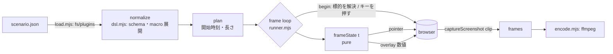

# 160. 画面収録は宣言されたシナリオを仮想時間で撮る — screencast DSL と録画環境

- Status: Accepted (実装済み 2026-10-03 — `tools/screencast/`、README hero を同 PR で生成)
- Date: 2026-10-03
- Deciders: yuubae215, Claude
- 段: なし (開発ツール。製品の段表には載らない)
- Retires: なし — 退役させる既存の収録手段が無い (README の hero はこれまで存在しなかった)
- Supersedes / Superseded by: なし

## Context — Goal と力学

### 要求

> README 用の hero gif を作成してください。新規シーン作成、2d sketch、3d extrude で良いです。
> 次回もシナリオ変わって使い回せるように、録画環境は残してスキル化もしてください。
> シナリオ記述は DSL 化をお願いします。DSL のデータ構造はエコシステム化を目指してください。

**Goal:** *製品の操作を、手で撮り直さずに、何度でも同じ品質で動画にできる。
撮る内容を変えるときに書き換えるのは「何をするか」の宣言だけで、録画の機構には触らない。*

### 力学 (1) — この環境の描画は遅く、実時間で撮るとカクつく

コンテナの Chromium は GPU を持たず WebGL をソフトウェア (SwiftShader) で描く。実測で
1 フレームの描画 + 撮影に 0.6〜1.2 s かかる。実時間の画面録画 (Playwright `recordVideo`・
CDP screencast) では 1〜2 fps の紙芝居になり、しかも**どのフレームが落ちるかが実行ごとに
変わる** (再現不能)。

### 力学 (2) — 「撮る内容」と「撮る機構」が同じスクリプトに居ると使い回せない

Playwright スクリプトを直書きすると、カーソルの曲線・キー表示・字幕の時間・出力の
エンコード設定が操作手順と同じ関数に混ざる。次のシナリオで変えたいのは手順だけなのに、
機構ごと複製することになる (核 §1.1 — 同じ事実の二箇所目)。

### 力学 (3) — DSL はワイヤである (原則 #29)

シナリオファイルは人と道具の間を渡るファイル形式 = ワイヤ。原則 #29 は全ワイヤを
「閉じた版付き契約」か「明示的対象外」の二状態に置く。DSL を名乗るなら前者であり、
**拡張の入口を 1 つだけ名指し**しないと、各シナリオが勝手な欄を生やして無限成長する
(ADR-060 が grasp 契約で防いだ形と同じ)。

## Options considered

- **A: 実時間録画 (recordVideo / CDP screencast) + 後処理で補間。** 安いがフレーム落ちが
  非決定的で、補間は UI の文字を溶かす。**却下。**
- **B: 仮想時間で 1 フレームずつ撮る。** ページの時計 (Date・timer・
  `requestAnimationFrame`) を Playwright `page.clock` で握り、1 フレームごとに
  正確に 1/fps 進めて撮る。描画速度は出力に一切現れない。**採用。**
- **C: 製品側に録画モード (固定 dt の描画ループ) を作る。** B と同じ効果だが製品に
  ツールの都合が入る (依存の向きが逆 — 核 §1.1)。**却下。**

DSL の形について:

- **D: YAML/自由記述の手順書。** 書きやすいが閉じた契約にならない。**却下。**
- **E: JSON + JSON Schema、`do` で判別する閉じた union + `x-<ns>/<name>` の拡張種 1 つ。** **採用。**

## Decision

### D1 — 三層を互いの欄を借りない形で分ける

| 層 | 欄 | 問い |
|---|---|---|
| WHAT | `steps` (+ `macros` / `imports`) | 何が起きるか |
| HOW IT LOOKS | `style` (accent・カーソル・キー HUD・字幕の位置) | どう見せるか (演出) |
| WHERE | `outputs` (gif / mp4 / webm) | どこへ出すか |

加えて `app` (どのページを・どの状態から) と `capture` (fps・仮想時計・pace)。
**演出はクライアント (overlay) で導出し、手順に混ぜない** — 原則 #29 の「演出はワイヤに
足さない」をツールの内部に写したもの。

### D2 — 純粋と副作用の分離 (原則 #3)

- **時間割は宣言された長さだけから決まる**: `start_i = Σ_{j<i, blocking} dur_j × pace`。
  標的がどこに在るかには依存しない → `screencast plan` がブラウザ無しで全時間割を出せる。
- **フレームの絵は純関数**: `frameState(t, plan, resolved, style)`。`resolved` は
  各 step の `begin` が解決した座標だけ。overlay (shadow DOM) は数値を当てるだけで何も決めない。

### D3 — 閉じた union と拡張の入口は 1 つ

core の種は `title caption move click drag key type wait focus use` で閉じる
(`additionalProperties`/`unevaluatedProperties: false`)。拡張は `x-<namespace>/<name>` の
種だけで、その payload は**宣言したプラグイン自身の JSON Schema** が検証する (core schema は
x-* の中身を見ない)。宣言の無い x-* 種は load 時に落ちる。手本 = `plugins/page-eval.mjs`。

再利用は 2 段: **macro** (引数付きの手順。`"${p}"` 全体置換は型を保つ) と **library**
(`version: "screencast-library/1.0"` の macro 集。`imports` で読む)。製品固有の操作経路
(`ee/add`・`ee/extrude`…) は library に一度だけ書き、UI が変わったらそこだけ直す。

標的 (`target`) は 7 種の閉じた union: `text` / `role` / `selector` / `viewport` (比) /
`canvas` (比) / `world` (3D 座標 — ページが宣言した probe で投影) / `relative`。
`world` のために製品へ読み取り専用 `window.__easyExtrude.worldToScreen` を 1 つ足した
(既存の `cameraState` 等と同じ診断面)。カメラの初期姿勢が変わってもシナリオが同じ物を指す。

### D4 — 版の規律

`version` は `screencast/1.0` (scenario) と `screencast-library/1.0` (library)。
**種・欄を足すのは minor (1.x)、意味を変える・消すのは major**。schema の `ease` enum と
`src/ease.mjs`、schema の step union と `CORE_ACTIONS` は `test/dsl.test.mjs` が束ねる
(同じ語彙の二表現 — `schema/` の drift-binding test と同じ手)。CI `test:screencast` が回す。

### D5 — 演出の宣言 (原則 #30 Motion Tier)

overlay の動きはすべて **Affordance** (操作の可視化 — カーソル・押下のリップル・キー HUD・
字幕) か **Delight** (タイトルカード) で、Fact を装う動きは無い。linear 補間は使わない:
カーソルは弧 (二次ベジェ) + inOutCubic、押下は outCubic の squash、HUD は outBack 入場 /
inCubic 退場、新しいキーは古いキーを即座に引退させる (列にしない)。待機中も ±2px の
非整数比正弦でカーソルが漂う (停止状態を作らない)。

## Consequences

- README の hero (`docs/media/hero-sketch-extrude.gif` / `.mp4`) は
  `pnpm screencast record tools/screencast/scenarios/hero-sketch-extrude.screencast.json` で再生成できる。
- 収録は遅い (≈1.2 s/frame ⇒ 15 s の動画で ≈10 分)。`--stills` で任意時刻だけ撮れば
  構図の確認は数分で回る。
- `docs/media/` に生成物 (GIF ≈ 数 MB) が入る。再生成のたびに git 履歴が太るので、
  hero の撮り直しは意図して行う。
- **出力は撮影枚数に対して検証される (2026-10-03 追補)。** 初版の hero GIF は 238 枚中
  23 枚 (1.5 s = タイトルカードのみ) で終わっており、README では静止画に見えた。原因は
  2 段: (1) zoom camera が CDP に端数の clip を渡し、Chromium が約 1/9 の frame を
  1279×719 等に丸める (clip の算術では回避できないことを実測)、(2) frame 寸法の変化で
  ffmpeg 6.1 が filter graph を再構築し、paletteuse が再構築に耐えず **exit 0 のまま**
  早期終了する。`encode.mjs` は全レーンで出力寸法を明示の W×H にし (`-2` は frame ごとに
  揺れる)、GIF は等寸の可逆中間 (FFV1) に正規化してから palette を作る/使う。さらに
  全出力を ffprobe し、**尺**と寸法が撮影と合わなければ失敗させる (枚数では測らない —
  GIF muxer は同一の連続 frame を 1 枚の長い delay に畳む)。
- 状態台帳: 製品の実体の状態には触れない (step の begun/ended はツール内部の一過性の
  集合で、台帳の対象外ではなく**製品の実体ではない**)。

## Evidence

goal ごとの支えの正本は論証木 `docs/gsn/adr-160-screencasts-are-declared-scenarios-recorded-on-virtual-time.gsn`
(事業木 `profit-growth.gsn` の `FirstLookShowsAUsableScene` に吊った)。入口だけ挙げる:

- `tools/screencast/test/*.test.mjs` (21 件): 語彙の二表現の一致、macro 展開の失敗形、
  時間割、click/drag の押下区間、idle drift の連続性、camera の fold と端の clamp、
  frameState の純粋性、ffmpeg 引数 (GIF は正規化 pass の後でしか palette を触らない / 出力高は明示)。
- 実録: hero シナリオを本 PR で撮り、`docs/media/` に置いた。
