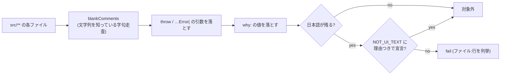

# 161. UI は英語で話す — 画面の言語と入力の言語を分ける

- Status: Accepted (実装済み 2026-10-04 — `src/UiLanguageCensus.test.js` + `src/census/uiText.js`)
- Date: 2026-10-04
- Deciders: yuubae215, Claude
- 段: なし (横断の規約。製品の段表には載らない)
- Retires: なし — 退役させる仕組みが無い (言語はこれまで決められていなかった。消した日本語の文言は検査が全体で数える)
- Supersedes / Superseded by: なし

## Context — Goal と力学

### 要求

> UIに日本語が混ざっているのはなんで？ → UIは英語に統一して、テストも入れて

**Goal:** *画面に出る文言の言語が 1 つに決まっていて、決まっていることを機械が問う。*

### 力学 (1) — 決めていないことは、書き手の言語として毎回決まる

`index.html` は `lang="en"` で、ヘッダ・パネル・トーストの文言は英語だった。ところが
UI の言語を定めた ADR は無く、i18n の仕組みも無い。この repo は設計散文 (ADR・コメント・
宣言表の `why`) を日本語で書くので、決めていない限り、書いた日の書き手の言語がそのまま
画面に出る。実際に出ていたのは 3 系統:

| 系統 | 例 | 箇所 |
|------|----|------|
| JSX の直書き | 「工程レイアウトを選んで始める」「起動時に表示しない」「3D: 未確定帯を表示中」 | `HomeScreen.jsx` / `NPanelVariable.jsx` / `GraspSearchPanel.jsx` |
| データ | テンプレのカード名・説明、サンプルシーンの実体名 (「作業台」「供給ビン (バラ積みワーク)」) | `LayoutTemplateCatalog.js` / `examples/*.json` (148 文字列) |
| 既定値 | `narrateProvenance()` は `lang` を省くと日本語 (呼び出し側は全て `'en'` を渡していたので表に出ていなかった) | `ProvenanceNarrative.js` |

### 力学 (2) — 日本語であること自体は欠陥ではない

`SynonymQuotient` (キュレーション同義語商) と `NlIntake` は日本語の**入力**を読むための
語彙を持つ (「以上」「約」「不明」)。これを消すと日本語で書かれた要求が決定的 core に
届かなくなる — 消してはいけない日本語がある。だから「`src/` に日本語が 0 個」は規則に
ならない。

### 力学 (3) — 開発者向けの散文も同じファイルに居る

`throw new Error('未宣言の種 …')` や宣言表の `why:` は日本語で書かれ、UI の文言と同じ
ファイルに混在する。ファイル単位で除外すると、そのファイルに足された UI 文言が素通りする。

## Decision

**D1 — 画面の言語は英語。** `src/` が画面に出す文言 (JSX のテキスト・属性、トースト、
理由文、テンプレのカード) と、テンプレとして同梱するデータ (`examples/*.json` の全文字列
— テンプレを選ぶとそのままシーンの実体名・説明になる) は英語で書く。i18n の仕組みは
入れない (切り替える言語がまだ 1 つしか無い — 仕組みは 2 つ目が要る日に入れる)。

**D2 — 入力の言語は日英どちらも受ける。** `SynonymQuotient` / `NlIntake` の日本語は
入力の語彙で、表示ではない。検査は**理由つきの宣言** (`NOT_UI_TEXT`) としてこれを残す。

**D3 — 既定は英語。** 言語を引数に取る語り手 (`narrateProvenance` / `narrateWhyTree`) は、
省略時に英語を返す。日本語版は `lang: 'ja'` で明示したときだけ。

**D4 — 開発者向けの散文は構文で分ける。** コメント・`throw new X(…)` / `…Error(…)` の
引数・`why:` の値は画面に出ないので日本語のままでよい (この repo の設計散文の言語)。
これを**構文で**落とすのは `src/census/uiText.js` ただ 1 箇所。落とす語彙はこの 3 つに
限る — 増やすほど UI 文言が散文の顔をして素通りする。

## 機械側の問い所

`src/UiLanguageCensus.test.js`:

1. **母集団はコードから導出する** — `collectSources()` の全ファイルから D4 の散文を落とし、
   日本語が残るファイルを数える。`NOT_UI_TEXT` の宣言 (入力語彙 2 + 明示 `ja` 1) 以外は
   0 個。宣言が空回りしたら (日本語が消えたのに宣言が残る) それも落とす
   (`assertCoversPopulation` — ADR-102)。
2. `examples/*.json` の全文字列と `LAYOUT_TEMPLATE_CATALOG` に日本語が 0 個。
3. 語り手の既定 (`lang` 省略) が英語。
4. 道具自身の検査 — 散文を落とし、隣の UI 文言は残すことを fixture で問う
   (空回りする検査は緑を出す)。

## Consequences

- 構造的に見逃すもの (テスト冒頭にも宣言): `why:` 以外の鍵に置かれた設計散文は UI 文言
  として数える (誤検知側に倒す)。逆に、`why` の値を画面に描く経路を新しく作れば、その文は
  検査の外にある。`server/` と `core/` が返す文は数えない (ワイヤに載るのはソルバが決定した
  事実で、提示文はクライアントで導出する — 原則 #29)。
- `HeaderEntrances.MULTI_ENTRANCE_VERBS` と `TapGesture` の却下理由は `why:` でも `throw` でも
  ない値なので英訳した。後者は今は描かれていないが、原則 #11 で描かれうる理由文である。
- 単体テストが自前で持つ fixture (`graspTargets.test.js` の「ロボット台座」等) は
  UI ではないので触らない。`e2e/` と BFF の OpenAPI の例はサンプルの名前に追従した。
- 過去の ADR が引用する日本語の実体名 (ADR-046 の「床敷設構内コンセント」等) は、
  当時の事実として書き換えない。

## References

- ADR-102 (母集団を機械に数えさせる — `assertCoversPopulation`)
- ADR-056 / ADR-077 (決定的 core の語彙 — 入力語彙を残す理由)
- 原則 #31 (正当な非ゼロは推論させず宣言させる)
