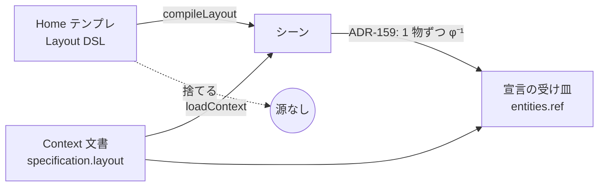

# 162. テンプレは文書として開く — コンパイルした源を捨てない

- Status: Accepted (実装済み 2026-10-04 — D1〜D3)
- Date: 2026-10-04
- Deciders: yuubae215, Claude
- 段: なし (不具合の根本。ADR-089 の Home テンプレと ADR-159 の取り込みの継ぎ目)
- Retires: GREP:src/controller/AppController.js::compileLayout\(dsl\) — DSL をコンパイルして捨てる読み込み。`src/TemplateDocument.test.js` と `e2e/grasp-stub.spec.js` S15 が、テンプレの物への宣言が普通の doc edit になることを問う
- Supersedes / Superseded by: なし (ADR-089 の「テンプレはシーンの種であって成果物ではない」を、**文書の種**へ改める。ADR-089 の Home 画面・カタログはそのまま)

## Context — Goal と力学 (§1.2 Goal)

### 要求

> シングルアームサンプルのワーク1のmassを設定しようとするとワーニングです。サンプルシーン
> 呼び出した時って、コンテキストは未定義ですか？ … データモデルの設計失敗ですかね…？
> → 「あー、SSOTの問題ですね」

**Goal:** *文書 (テンプレ) から生まれた物は、画面から逆算せずに宣言できる。* 宣言の受け皿は、
その物を生んだ源と同じものにする。

### 力学 — シーンを作る入口が 2 本あり、片方だけが源を捨てていた

- 宣言 (mass・重心・把持仕様) は文書の `specification.layout.entities[ref]` に住む (ADR-129 D0)。
  語は `layout-1.0` と `context-0.5` の両スキーマに在り、**語彙の欠落ではない**。
- Home のテンプレは `compileLayout(dsl) → importFromJson` だけを通り、DSL を捨てていた。文書は
  0 個のまま (先に開いていた文書があれば**それが**残り、新しいシーンの横に古い文書が並ぶ)。
- だから宣言は ADR-159 の画面からの取り込みへ回る。取り込みは画面を 1 物ずつ逆コンパイル
  (`links: []`) するので関係を運べず、ビンの床へ `fastened` のワークは**毎回** `LINKED` で拒否
  された (DEF-060)。DEF-060 は「画面で生まれた物」の残しなのに、**文書生まれの物が迷い込んでいた**。

数え方で言えば (原則 #31): シーンの全実体のうち文書が持つ数を $n_\text{decl}$ とすると、
テンプレ読み込み直後は $n_\text{decl} = 0$ で、STATE_LEDGER の「テンプレをそのまま使う
セッションでは未宣言の実体が 0」は**逆**だった。

## Options considered

- **A: テンプレの読み込み = DSL を持つ文書を開く** — tradeoff: テンプレの後は文書が 1 個在る
  (Context パネルが文書を語る)。物を動かすと文書へ書く (ADR-129 D1) ので、運ばれる物も書く必要が出る (D3)。
- **B: DEF-060 を解く (子・リンクごと取り込む)** — tradeoff: 1 物ずつの逆算を続けたまま関係を
  運ぶ規則を足すことになる。源を捨てたまま源を復元する機構で、二源の形 (§1.1) を温存する。
  画面で生まれた物の問題としては別に残る。
- **C: 現状維持** — サンプルのワークに宣言できない。

## Decision — Strategy (§1.2 Strategy)

### D1 — テンプレは、その Layout DSL を `specification.layout` に持つ文書として開く

`DocBuilder.docFromLayout(dsl, name)` (純粋) が文書を作る。DSL は**そのまま**入れる
(`compileContext(doc).layoutDsl` は DSL と同じシーンへコンパイルされる — 全テンプレで検査)。
全実体・全制約を given fact `f_layout_template` から trace する (ADR-046 不変条件 1 — 誰も頼んで
いない仕様を置かない)。

### D2 — 読み込みは文書の唯一の入口 `ContextService.loadContext` を通る

`AppController._loadLayoutTemplateDsl` は `loadContext(docFromLayout(dsl, name))` を呼ぶだけになる。
undo の消去・選択の解除・カメラの framing は `_onContextLoaded` が持つ (文書の読み込みと同じ)。
先に開いていた文書は入れ替わる — 古い文書が残る経路は消えた。

### D3 — 確定した移動は、固定ジョイントで運ばれた物の姿勢も文書へ書く

D1 で初めて表に出た既存の欠陥 (ADR-129 D1)。文書の物の確定移動は文書へ書かれ、書き込みは再生成を
起こす。書いていたのは**選択だけ**で、ビンに `fastened` のワークは古い姿勢のまま書かれ、再生成で
そこへ戻った (S14 が 463mm のずれで落ちた)。

- 「どれが運ばれるか」は純粋関数 `domain/fixedJointFollowers.js` の 1 箇所。運ぶ辺の述語
  `drivesSourcePose` (fixed かつ mounts でない) は `SceneService._reactivateLiveLinks` と共有する。
- 運ばれた物の姿勢は世界姿勢のパスで動くので、確定直後に読むと 1 フレーム古い。
  `SceneService.fixedJointFollowersOf(ids)` がそのパスを自分で走らせてから返す
  (原則 #23 — 鮮度はアクセサが持つ)。
- `ContextController.recordConfirmedPoses` が「動かした物 ∪ 運ばれた物のうち宣言できる物」を
  1 つの doc edit で書く。Grab と Aim の両方がここを通る。

## Consequences — Evidence と tradeoff (§1.2 Evidence)

### 得られるもの

- テンプレの物への宣言は普通の doc edit。id もリンクも変わらず、undo 1 回で戻る。
- テンプレの後に古い文書が残らない。
- 文書の物を動かすと、運ばれた物も一緒に文書へ書かれる (テンプレ以外の文書でも)。

### 払うもの

- テンプレの後は文書が 1 個在る。Context パネルとバリデータの OpenQuestion がテンプレについて語り始める。
- ADR-159 の取り込み (`Started a document from the screen`) は、テンプレの物では起きなくなる。
  Shift+A の物では従来どおり起きる。

### 検証 (証拠)

論証木: `docs/gsn/adr-162-a-template-opens-as-a-document.gsn` (goal ごとの支えの正本)。

- `src/TemplateDocument.test.js`: 全テンプレ (母集団は `LAYOUT_TEMPLATE_CATALOG`) で文書が妥当かつ
  DSL と同じシーン / ワーク 1 への質量宣言で警告なし・id とリンク不変 / 先の文書が残らない。
- `src/domain/fixedJointFollowers.test.js`: N=2 で運ぶ / 向き / 推移 / mounts と非 fixed / 両方選択。
- `e2e/grasp-stub.spec.js` S15 (新): Home → サンプル → ワーク 1 → declare mass → DEF-060 が出ない →
  Ctrl+Z で未宣言へ。**旧コードで落ちることを確認済み**。S14 (ビンを動かすとワークが付いてくる) は
  D3 なしでは落ち、D3 で通る。
- `src/TemplateDocument.test.js`「確定移動の書き手は…」: Grab と Aim が共有する `recordConfirmedPoses` が
  運ばれた物 (N=2) を書き、運ばれていない物は書かない。D3 を戻すと落ちる。
- **この証拠で見えないもの:** Aim (回転) で運ばれた物は、書き手の単体テストだけで e2e では走らせて
  いない (e2e は Grab のみ)。文書が在るときの Context パネルの見え方は検査していない。

### 波及 (blast radius)

| 触ったもの | 中身 |
|---|---|
| `src/context/DocBuilder.js` | `docFromLayout` / `TEMPLATE_FACT_REF` |
| `src/controller/AppController.js` | `_loadLayoutTemplateDsl` が `loadContext` を通る |
| `src/domain/fixedJointFollowers.js` (新) | 運ばれる物の閉包と、運ぶ辺の述語 |
| `src/service/SceneService.js` | `fixedJointFollowersOf` / `_reactivateLiveLinks` が述語を共有 |
| `src/controller/ContextController.js` | `recordConfirmedPoses` が運ばれた物も書く |

**触らなかったもの:** 契約 (`packages/grasp-contract`) と `core/`、ADR-159 の取り込み経路、
`examples/*.json`。

## 残し

- **DEF-060 は残る**が、範囲は「画面で生まれた物」に戻った (テンプレの物はもう来ない)。

## Lens notes

- §1.1: 宣言の受け皿は、物を生んだ源 (文書) 1 つ。「運ばれる」の読みは `drivesSourcePose` 1 つ。
- §1.4: 文書の基数がテンプレの読み込みで 0 → 1 になる (`docs/STATE_LEDGER.md` を更新)。
- 原則 #23: 運ばれた物の鮮度は `fixedJointFollowersOf` が持つ。
