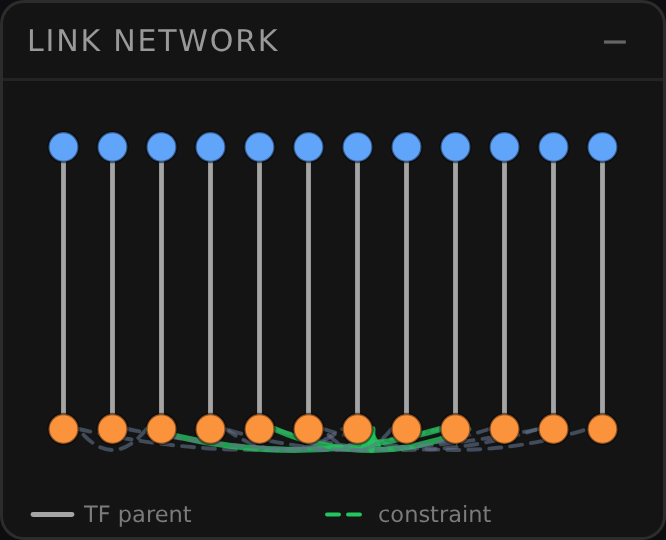
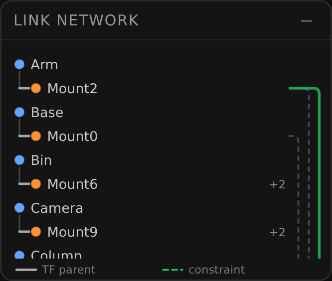

# 2026-07-26 — LINK NETWORK をインデントアウトラインへ (ADR-095) 実測

当事者の苦情「**横にツリーが同じ行として伸びてる**のが見づらい」に対する
幾何入れ替え (深さ→y / 兄弟→x  ⇒  ノード順→y / 深さ→x) が、**絵の上で**
何を変えたかの記録。

ユニットテストが持てるのは「ラベルに何 px 割り当てられるか」までで、
**その幅で実際に名前が読めるか**は人が見るしかない。ここはその見た分の置き場。

- 端末幅: **390px** (deviceScaleFactor 3、モバイル既定 = 当事者の主戦場)
- シーン: **Solid 12 個**、それぞれ body frame + ユーザー CF 1 個。リンク 11 本
  (kinematic 4 = mounts/revolute、topological 7 = adjacent)。
  Solid 12 個は ADR-095 が名指しした `denseMode` 発火点そのもの
  (`W / maxRowCount = 196/12 = 16.3px < DENSE_SLOT 22`)

## 実測値 (DOM から取得。目視ではなく数値で残す)

| | before (ADR-094 実装) | after (ADR-095) |
|---|---|---|
| SVG に含まれる実体ラベル | **0 個** | **24 個** (全ノード) |
| SVG に含まれる text 要素 | 2 (`TF parent` / `constraint` = 凡例だけ) | 26 (24 ラベル + 凡例 2) |
| ノードの点 | 24 | 24 |
| グラフ SVG 高さ | 152px (固定) | **400px** (行数から導出) |
| スクロール表示域 | — (スクロールなし) | 146px (`MAX_PANEL_H − LEGEND_H`) |
| パネル全体の高さ | 180px | 188px (= header 28 + 146 + legend 14) |
| リンク縮退バッジ | 無し | `+1` ×2 行 / `+2` ×8 行 (レーン上限 3 の超過分) |

**`denseMode` は「ラベルが小さくなる」ではなく「名前が全部消える」だった。**
before の SVG から取れる文字列は凡例の 2 行だけで、実体名は 1 つも無い。
「情報が多いのもあると思ったけど」という当事者の留保は正しく、問題は情報量ではなく
*固定・希少な軸に可変量を割り当てていたこと* だったことが数値で確定する。

パネルの占有寸法は before と同じ枠に収まっている (180px @最小 / 188px @最大 =
SVG 152 / 160 + header + legend)。左端占有契約 (ADR-048 §2.3 / 原則 #26) は
無改変で守られている — 変わったのは *高さの使い方* だけで、*高さそのもの* ではない。

## 絵

| before (Solid 12 個) | after (Solid 12 個) |
|---|---|
|  |  |

after で読めるようになったこと:

- **名前が読める。** これが G1 で、before では 1 つも読めない。
- **深さが階段として読める。** `Arm` の下に一段インデントした `Mount2` があり、
  辺を目で辿らずに親子が分かる (G2)。before は縦線を 24 本たどる必要があった。
- **縮退の向きが反転した。** 右ガターの `+2` は「ここに 2 本、描けなかったリンクが
  ある」であり、混雑のコストを**リンク表示が払っている**。before は同じ混雑を
  ラベルが払っていた (= 全部消えた)。
- **凡例が固定されている。** スクロール域の外に出したので、下までスクロールしても
  「どちらが TF 親でどちらが制約か」が画面から消えない。

## 既知の見え (欠陥ではない)

**最下行が見切れる。** 表示域 146px は行ピッチ 16px の整数倍ではないので、
スクロール可能なときは最終行が途中で切れる (上の after 画像の `Column`)。
行数へスナップすると `MIN_PANEL_H = 152` の床 (ADR-048 §2.3) を割るため採らない。
切れた行は「まだ下がある」のアフォーダンスとして機能する (原則 #16) ので、
既知の見えとして記録し、直さない。

## 再現手順

`pnpm dev` を上げ、リポジトリ直下に probe ページを置いて撮る (probe はコミットしない —
`LinkNetworkView` の公開 API `update(entityInfos, links)` だけを叩くので、
アプリ全体を操作せずに同じ絵が出る):

```js
const view = new LinkNetworkView(id => console.log('select', id))
view.setMobile(true)
view.update(entityInfos, links)      // 上表のシーン (Solid 12 個)
```

before は `git show <ADR-094 の commit>:src/view/LinkNetworkLayout.js` と
`LinkNetworkView.js` を一時ファイルへ書き出し、import を差し替えた写しを
同じ probe から呼ぶ。**同一の `update()` 呼び出しで両方が撮れる**のは、
データ契約 `{name, type, parentId}` を動かさなかったからである。

## 残っている観察待ち (反証されうる仮説)

GSN `SiblingComparisonLossIsAcceptable` — 兄弟が横一列に並ばなくなったので
「兄弟同士の比較」が縦の走査になる。当事者の苦情はまさにその横並びだったので
意図した交換だが、逆向きの不満 (「兄弟が見比べにくくなった」) は当事者の実利用でしか
反証できずテストでは閉じない。出たら**兄弟をインデント同一の連続行として視覚的に
括る (グループ罫)** 方向で回収する — 行を増やさずに済む。
