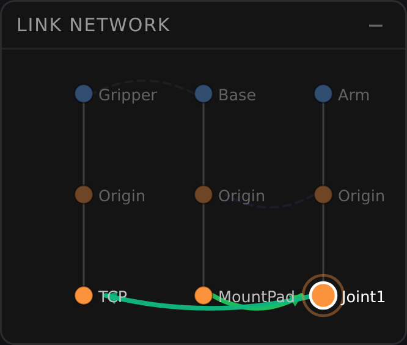
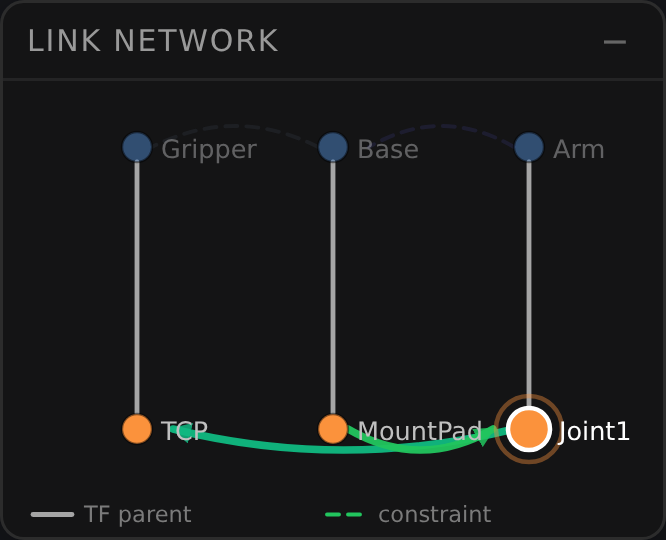

# 2026-07-26 — LINK NETWORK の TF ツリー回帰 (ADR-094) 実測

ADR-094 の 3 欠陥 (D1 ノード集合の category error / D2 無情報な body frame 行 /
D3 逆向きの視覚差) が **絵の上で** 消えたことの記録。ユニットテストが持てるのは
「ノードが何行目にいるか」までで、**どちらの線が骨格に見えるか**は人が見るしかない
(GSN `LegendAndScreenshotPlanned`)。ここはその見た分の置き場。

- 端末幅: **390px** (deviceScaleFactor 3、モバイル既定 = 当事者の主戦場)
- シーン: Solid 3 個 (Base / Arm / Gripper) — それぞれ body frame + ユーザー CF 1 個。
  リンク 4 本 = kinematic 2 (mounts/revolute・fastened/fixed) + topological 2 (adjacent・above)
- 選択: `Joint1` (focus+context が効いた状態で撮る — 平常状態だけ見ると
  「focus 時にどう変わるか」が写らない)

## 実測値 (DOM から取得。目視ではなく数値で残す)

| | before (ADR-094 以前) | after |
|---|---|---|
| 行数 `L` | **3** | **2** |
| SVG 高さ | **160px** (`MAX_PANEL_H` に昇格) | **152px** (`MIN_PANEL_H`) |
| ラベル | Gripper, Base, Arm, **Origin, Origin, Origin**, TCP, MountPad, Joint1 | Gripper, Base, Arm, TCP, MountPad, Joint1, *(凡例)* TF parent, constraint |
| ノード | 9 (`grip@L0 base@L0 arm@L0 grip_o@L1 base_o@L1 arm_o@L1 grip_tcp@L2 base_mount@L2 arm_j1@L2`) | 6 (`grip@L0 base@L0 arm@L0 grip_tcp@L1 base_mount@L1 arm_j1@L1`) |
| 木辺 | `rgba(255,255,255,0.18)` 幅 1 | `rgba(255,255,255,0.62)` 幅 1.6 |
| 凡例 | 無し (ADR-048 §2.2.1 の未実装決定) | 2 行 (TF parent / constraint) |

苦情「Origin が真ん中の行にきて、上に item name、下に Frame」は、**中段そのものが
消えた**ことで文字通り無くなった。ユーザー CF (TCP / MountPad / Joint1) は最下段の
圧迫から解放され、`L >= 3` による最大高への昇格も解けている。

## 絵

| before | after |
|---|---|
|  |  |

after で読めるようになったこと:

- **骨格が木辺**。白い実線が TF 親子で、緑の弧が制約。before はこれが逆
  (木辺が画面で最も薄い線) で、TF ツリーとして読ませたい絵の骨組みが最も見えなかった。
- **中段が空いた**。3 段が 2 段になり、縦の余白が「TF 深さ 1 段ぶん」として読める。
- **凡例が確認になっている**。D1/D2 を直す前は凡例は「読み方の説明書」だったが
  (説明書が要る絵はまだ直っていない — ADR-094 Option F の却下理由)、いまは
  既に読める絵に名前を付けているだけ。

## 再現手順

`pnpm dev` を上げ、リポジトリ直下に probe ページを置いて撮る (probe はコミットしない —
`LinkNetworkView` の公開 API `update(entityInfos, links)` だけを叩くので、
アプリ全体を操作せずに同じ絵が出る。データ契約を動かさなかったことが、before/after を
**同一の呼び出しで**比較できる理由でもある):

```js
const view = new LinkNetworkView(id => console.log('select', id))
view.setMobile(true)
view.update(entityInfos, links)      // 上表のシーン
view.setSelection(new Set(['arm_j1']))
```

`git stash push src/view/LinkNetworkView.js` を挟めば同じ probe で before が撮れる。

## 残っている観察待ち (反証されうる仮説)

GSN `OriginSeparateSelectionHarmless` — 融合後はパネルから Solid と body frame を
**別々に選べない**。body frame は編集ロック済み (ADR-037 §4) なので実害は無いと
判断したが、これはテストでは閉じない。当事者の実利用で「body frame だけを選びたかった」が
出たら、融合ノードに副次的な選択経路 (long-press 等) を足す方向で回収する。
