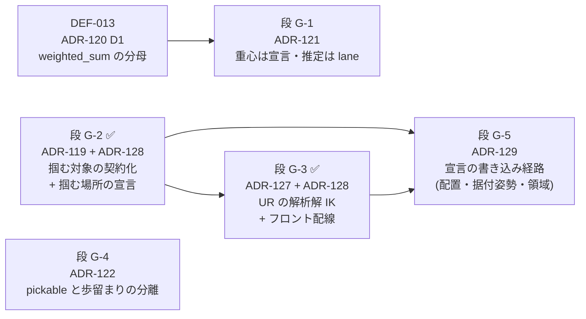

# grasp レーン — 実装順序表

**この文書は段の正本である。** 設計判断の正本は各 ADR、残しの索引は
`docs/DEFERRAL_LEDGER.md`、ここが持つのは **順序と依存**だけ (§1.1 — 内容を写さない)。

## なぜ段が要るか (2026-08-12 起票 — ADR-123 §Consequences)

grasp レーンには順序表が無く、`scripts/check-adr-status.mjs` の `PHASED_PLANS` は
**IA 再設計レーン 1 件だけ**を見ていた。その結果 ADR-119 / 121 / 122 は「段を持たない
ADR」の検査の母集団に入っていなかった。

けれど **依存は実在する** — ADR-120 D1 が入らないと ADR-121 は成立しない (重心不在で
全候補が不当に低く見えるので `com_offset` を足しても意味が読めない)。この順序は
2026-08-12 まで **ADR 本文の散文にしか無かった**。ADR-109 が名指しした
「段を持たない項目は誰も実装しない」の形である。

順序表を持つレーンは現在 2 つ (IA / grasp)。`PHASED_PLANS` の限界宣言
(「二つ目の段階計画が生まれた日が、この配列を導出へ差し替えるトリガである」) が
**到来した** — が、今日は導出へ広げない。2 件では「順序表とは何か」を定義する規則の
ほうが対象より大きい (§5 過剰モデリング禁止)。**3 つ目が生まれた日**が次のトリガで、
その判断はこの段落が持つ。

## 段

依存の向きは `→` で読む (左が先)。

| 段 | ADR | 状態 | 前提 | 残しの行 |
|---|---|---|---|---|
| **G-1** | ADR-121 | **未着手** (Proposed) | **G-0 (完了)** — 重心不在で全候補が不当に低く見える状態を先に直す | DEF-015 |
| ~~**G-2**~~ | ADR-119 | **完了** (Accepted 2026-08-14) — D1 の契約宣言に D2/D3 (把持フィーチャ + 入力面) が続いた。UI の所有者は **ADR-128** が決めた | なし | — (DEF-014 決着) |
| ~~**G-3**~~ | ADR-127 | **完了** (2026-08-14) — `core/` の解析解 IK に加え、フロントが `robot.kinematics` を送る配線が入った (**ADR-128**)。6 数は URDF から導出するので写しが無い | **G-2** の下地の上に載る | — (DEF-030 決着) |
| **G-4** | ADR-122 | **未着手** (Proposed) | なし。ただし D2 (pick-sequence の入口) は ADR-078 のシーン層に依存 | DEF-016 |
| **G-5** | ADR-129 | **未着手** (Proposed) | **G-2 / G-3 (ともに完了)** — 掴む場所の宣言と doc-edit 経路が在って初めて「同じ経路を配置へ広げる」が最小の一手になる | DEF-031 / DEF-032 (この段が閉じる) · DEF-033 (同じ形の 4 例目として切り出し) |

**着手順の推奨 (2026-08-14 再々改訂):** G-0 / G-2 / G-3 は完了。次は **G-5 (ADR-129
宣言の書き込み経路)** → **G-1 (ADR-121 重心)** → **G-4 (ADR-122 pickable と歩留まり)**。

G-5 を先に置く理由: G-1 も G-4 も「答えの質」を上げる段だが、**G-5 が閉じるまで
ユーザーの手のうち 1 つ (ワーク配置) が黙って効かない**。効かない入力の上で答えの質を
上げても、その質は画面から確かめられない — 実際 G-0 の検証手順 (`docs/dogfooding/`) は
シーンを動かさない前提で書かれており、それは限界ではなく**回避**だった。

G-4 の D2 (`pick-sequence` の入口) は `contractVersion` を上げる回になるので、
**DEF-029 (死んだ 3 本目の端) はそこへ相乗りしたまま**である。G-5 の D2
(`robot.baseOrientation`) は **request 側の追加なので版を上げない** — 相乗り先は
移らない。

## 完了した段

| 段 | ADR | 完了 |
|---|---|---|
| — | ADR-117 (探索に対象を載せる + 静的スタブ) | 2026-08-11 |
| — | ADR-118 (ハンドを種別に / 吸引を一級に — 契約 v5) | 2026-08-11 |
| — | ADR-120 D2 / D3 (評価不能を 0 点として描かない) | 2026-08-12 |
| **G-0** | ADR-120 D1 (評価不能を分母から外す — 実ソルバ側) | 2026-08-14 |
| **G-2** | ADR-119 (掴む対象の契約化 D1 + 掴む場所の宣言 D2/D3) | 2026-08-14 |
| **G-3** | ADR-127 (UR の解析解 IK) + ADR-128 (フロント配線) | 2026-08-14 |
| — | ADR-128 (掴む場所の入力面 / `robot.kinematics` 配線 / `plan{}` リーチ入力) | 2026-08-14 |

---

**問い所:** `pnpm test:adr` (`scripts/check-adr-status.mjs` の `PHASED_PLANS` —
このディレクトリを参照する ADR で段を持たないものが 0 本であることを問う)
