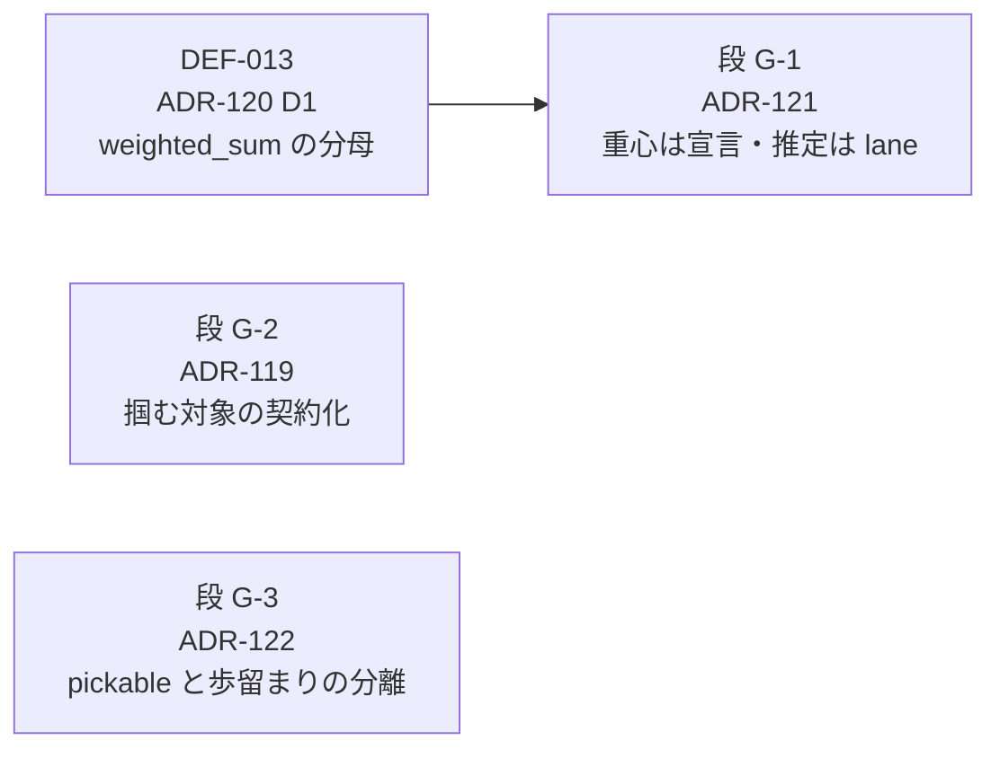

# grasp レーン — 実装順序表

**この文書は段の正本である。** 設計判断の正本は各 ADR、残しの索引は
`docs/DEFERRAL_LEDGER.md`、ここが持つのは **順序と依存**だけ (§1.1 — 内容を写さない)。

## なぜ段が要るか (2026-08-12 起票 — ADR-123 §Consequences)

grasp レーンには順序表が無く、`scripts/check-adr-status.mjs` の `PHASED_PLANS` は
**IA 再設計レーン 1 件だけ**を見ていた。その結果 ADR-119 / 121 / 122 は「段を持たない
ADR」の検査の母集団に入っていなかった。

けれど **依存は実在する** — ADR-120 D1 が入らないと ADR-121 は成立しない (重心不在で
全候補が不当に低く見えるので `com_offset` を足しても意味が読めない)。この順序は
2026-08-12 まで **ADR 本文の散文にしか無かった**。ADR-109 が名指しした
「段を持たない項目は誰も実装しない」の形である。

順序表を持つレーンは現在 2 つ (IA / grasp)。`PHASED_PLANS` の限界宣言
(「二つ目の段階計画が生まれた日が、この配列を導出へ差し替えるトリガである」) が
**到来した** — が、今日は導出へ広げない。2 件では「順序表とは何か」を定義する規則の
ほうが対象より大きい (§5 過剰モデリング禁止)。**3 つ目が生まれた日**が次のトリガで、
その判断はこの段落が持つ。

## 段

依存の向きは `→` で読む (左が先)。

| 段 | ADR | 状態 | 前提 | 残しの行 |
|---|---|---|---|---|
| **G-0** | ADR-120 D1 | **未着手** — D2/D3 は実装済み (スタブ・クライアント) | なし | DEF-013 |
| **G-1** | ADR-121 | **未着手** (Proposed) | **G-0** — 重心不在で全候補が不当に低く見える状態を先に直す | DEF-015 |
| **G-2** | ADR-119 | **未着手** (Proposed) | なし (G-0 / G-1 と独立) | DEF-014 |
| **G-3** | ADR-122 | **未着手** (Proposed) | なし。ただし D2 (pick-sequence の入口) は ADR-078 のシーン層に依存 | DEF-016 |

**着手順の推奨:** G-0 → G-1 を先に閉じる (唯一の固定された依存)。G-2 / G-3 は
並行してよい。

## 完了した段

| 段 | ADR | 完了 |
|---|---|---|
| — | ADR-117 (探索に対象を載せる + 静的スタブ) | 2026-08-11 |
| — | ADR-118 (ハンドを種別に / 吸引を一級に — 契約 v5) | 2026-08-11 |
| — | ADR-120 D2 / D3 (評価不能を 0 点として描かない) | 2026-08-12 |

---

**問い所:** `pnpm test:adr` (`scripts/check-adr-status.mjs` の `PHASED_PLANS` —
このディレクトリを参照する ADR で段を持たないものが 0 本であることを問う)
