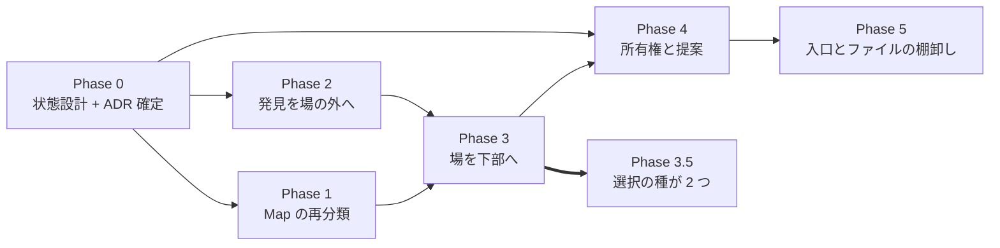

# 実装順序 (IA 再設計 段階「引き継ぎ」)

設計の逆順ではなく**土台から**。良いゾーン分割は良い開発分割になるので、
独立性の高いゾーンは後回しにできる。

正本の所在:

- **配置とその根拠** → `easy-extrude-wireframe-v8.html` の注釈①〜⑧ (最新版)
- **住所の物差しと却下した物差し** → `02-grouping-criteria.md`
- **設計判断** → **ADR-103** (Map の再分類 — Phase 1、実装済み) /
  **ADR-104** (所有権・提案・証憑 — Phase 4、実装済み) /
  **ADR-105** (発見の集約を場の外へ — Phase 2、Proposed) /
  **ADR-106** (場を下部へ・右端 280px スロットの退役 — Phase 3、Proposed) /
  **ADR-107** (選択の要素の種が 2 つになる — Phase 3.5、Proposed) /
  **ADR-108** (入口は動詞であって対象ではない — Phase 5、Proposed)
- **状態と基数** → `docs/STATE_LEDGER.md` §提案中の実体

**この表は段の全数である。** 起票済みの ADR で段を持たないものは 0 本でなければならない
— 段の無い ADR は「順序の外」ではなく**誰も実装しない ADR**になる。実際 ADR-107 は
Phase 3 の*帰結*として起票されたのに、この文書のどこにも現れないまま 1 度 commit された
(原則 #31 — *在る段*を辿る読み方では、無い段は出てこない)。

ここには**順序と、各段の完了条件**だけを置く (§1.1 — 複製しない)。

---

## Phase 0 — 状態を先に設計する (コードより前)

核 §1.4 の閾値を既に跨いでいる (提案・議題がそれぞれ 3 状態)。**クラスを書く前に**:

- [x] `docs/STATE_TRANSITIONS.md` に **提案** (`提案 → 承認 / 取り下げ`) と
      **議題** (`議題 → 決着 / 未決のまま閉会`) の節を起こす。guard と禁止遷移を列挙。
- [x] ADR-104 の**未解決 4 点**を決める → ADR-104 §未解決 4 点の決着 (U1〜U4)。
      **#1 は yes** (承認 = 主張更新 + 証憑記録の 1 undoable command)、#2 は楽観ロック
      guard で併存、#3 は新議題 + `supersedes`、#4 は記録時点の鍵集合を焼き込む。
- [x] ADR-103 / ADR-104 を Accepted へ。

**完了条件: 達成。** 不正状態が型で表現不能になる設計が図で描けている
(`stale` を状態にしない・`decidedBy ⊆ 決定時点の鍵集合`・終端からの復帰なし)。

## Phase 1 — Map の再分類 (ADR-103)

他のどの段にも依存しない**独立した削除**なので、最初に片付けると以降の見通しが良くなる。

- [x] `MapModeController.state.active` の撤去 → `PlaceToolController` へ再分類。
      描画状態 (`idle` / `drawing`) はツール状態として残った。
- [x] Lynch 5 種を `+ 追加` の **Place** グループへ。ヘッダの Map ボタンと Map ツールバー
      (`left:188px`) を削除。pan / wheel / pinch は OrbitControls へ返した。
- [x] 投影方式 (正射 / 透視) をギズモ直下のトグルへ。向きの入口はギズモのまま (足さない)。
      正射カメラは透視カメラからの**毎フレーム導出**にした (状態を持たない)。
- [x] 随伴更新: `STATE_LEDGER` (行の入れ替え + 負債 #1 と #3 を閉じる) /
      `STATE_TRANSITIONS` §Top-level Modes・§Place tool・§Projection /
      `SCREEN_DESIGN` S-14〜S-16 / `LAYOUT_DESIGN` / `CODE_CONTRACTS` 4 行 / `NAVIGATION`。

**完了条件: 達成。** トップレベルモードは 2 値で、`edit` かつ正射で真上から見られる
(e2e「正射のまま Edit Mode に入れる」が焼いている)。

## Phase 2 — 発見を場の外へ (最小で効果が最大)

現行の循環依存 (**場に入らないと場に入る必要があるかが分からない**) を断つ段。
権限も提案も要らないので、Phase 3 以降と独立に出荷できる。

**設計判断は ADR-105** (Proposed)。要点: カウンタの中身は ADR-104 D4 で既に正しく、
欠けているのは**住所**と**文書 0 件のときに何と言うか**である。ここには 0 が 3 種類ある
(未検証 / 検査対象なし / 全部パス) ので、kind 判別の union で割る。

- [ ] ヘッダに 3 カウンタ (`≈ 衝突` / `⚑ 議題` / `◇ 未所有`)。衝突は**導出値**なので保存しない。
      **描き手が `ctx.active` に依存しない**こと (現在の唯一の描き手 `AgendaPanel.jsx:233` は
      `ContextLayer.jsx:62` の `if (!ctx.active) return null` の内側にいる) と、
      **退出リデューサ (`uiStore.js:531`) が `{0,0,0}` を書くのをやめる**ことが本体。
- [ ] シーンスコープの KPI を 3D ビュー左上の HUD へ。**0 件は宣言**する
      (「✓ 全部パス」は嘘、消すのは #15 違反 — 原則 #31)。
- [ ] エンティティスコープの検証 (リーチ / 干渉 / 把持候補) を右パネル (選択物の隣) へ。
      = `置く → 届くか見る → 置き直す` のループを閉じる。

**完了条件:** Context 文書を読み込まなくても「未解決があるか」が分かる。
`Grasp Search` が `Robot` を選んだ状態から 1 クリックで届く。

## Phase 3 — 場を下部へ / 右ドックの奪い合いを解く

**設計判断は ADR-106** (Proposed)。要点: 排他は**方針ではなく、住所の衝突の症状**だった。
同じ 1 つの衝突 (右端 `right:0` を 3 者が要求する) に、互いに知らない**3 つの回避策**が
当たっている — ずらす (`NPanel.jsx:33`) / 消す (`ContextController` の 7 箇所) /
被せる (`ContextLayer` の `zIndex:100` がギズモと投影トグルを隠す)。住所を変えれば、
回避策は**書く理由を失う**。

- [ ] `ContextLayer` のタブ (定数 8 + 条件つき 3 = 最大 11 枚) を解体し、**議題 (衝突 ∪ 提案)**
      を下部展開パネルへ。表は横長なので器の形が合う。3D を覆わない (空間量は空間で検算する)。
      器に残るのは**「解消」と「その記録」の 2 種だけ** (ADR-106 D3 の行き先表)。
- [ ] N Panel と右ドックの排他を解消。**production の場だけでなくチュートリアルの
      Inspector (ADR-047) も同じ器へ移す** — `_updateGizmoOffset` の `+280` 項の出所は
      チュートリアル側なので、production を動かすだけでは項は消えない (ADR-106 が
      この記述の取り違えを訂正した)。教える画面と使う画面は一致していなければならない。
- [ ] 入力系タブ (Wizard / Assets / Intake) は「置く」側へ移すか、別の入口へ。
      特に **Assets は架台・コンベア・セル床を作る = モデリング**なので `+ 追加` が住所。
      Wizard / Intake の最終的な住所は Phase 5 が決める — Phase 3 が決めるのは
      「場のタブではない」ことと、**暫定住所を持つ**こと (名指ししない移設は無言の削除)。
- [ ] **下端の占有計算の所有者を先に置く** (原則 #26)。下端には既に InfoBar・
      LINK NETWORK・Toast が住んでいる。所有者を後から置くと、その時点で書かれた
      パッチを剥がす作業になり、剥がし残しが緑を出す。

**完了条件:** 右端の常設は N Panel だけになり、全ゾーンの責務が一言で言える。
場を開いている間もギズモと投影トグルが見える (ADR-103 が常設に出したものが常設のまま)。

## Phase 3.5 — 選択の種が 2 つになる (ADR-107)

**Phase 3 と同じ PR か、その直後の PR で出す。**後回しにできない段である理由は、これが
Phase 3 の*前提条件*ではなく**帰結**だからである — 器を下部へ移すと場と N パネルが
**同時に見える**ようになり、「場で `d_ref` を選んでいる間、右パネルは誰のものか」が
**毎回起きる**。これまでこの問いが起こらなかったのは右パネルが場では消されていたから
であって、決着していたからではない (`ContextController` の排他がこの問いを隠していた)。

未決のまま Phase 3 を出すと、踏んだ人がその場で最小の回避策 (`selectedVariable` の
第二の選択状態) を書く。それは ADR-099 が消した「窓ごとに部分集合を書く」形の再生産で、
しかも既存の census は entity 側しか数えないので**割れたことに気づけない = 緑のまま壊れる**。

- [ ] 選択を **kind 判別の有界 union** へ (`empty` / `entities` / `variables`)。
      `empty` は `entities` の要素数 0 ではなく**独立した第一の枝**。混在は型で表現不能。
- [ ] **入口は 5 verb のまま** (ADR-099 D1)。Outliner の意味側・場の行列の列ヘッダ・
      未確定帯のクリックは**窓**であって入口ではない。`SelectionOwnership.test.js` の
      母集団の作り方を**変えずに**効き続けること — 作り直したら A 案を選んだ証拠。
- [ ] 実体 id と文書 `ref` を同じ集合に混ぜない (名前空間を静的に区別 — 原則 #21 の同型)。
      `var:` 接頭辞のような命名規約に頼らない。
- [ ] **種ごとの宣言表を 2 つ足す** — 3D の姿 (変数 = 未確定帯、ADR-050 の系譜) と
      N パネルの中身。どちらも**未宣言の種で throw** する (`EXPLICIT_DEFAULTS` /
      `PLACEMENT_BY_KIND` / `SUPPORT_SURFACE_BY_KIND` と同じ既定表の規律)。
      「今の 2 種は姿を持つ」は事実だが規則ではない。
- [ ] 変数を選んでも文脈は消えない — 制約されている実体は `contextual` 軸の **DIMMED**
      で残る (ADR-096 / ADR-099 `_claimContext`)。**新しい語彙を足さない。**

**完了条件:** 場の行列で列 (= 変数) を選んでも無言にならず、3D に未確定帯が出る。
選択に書く入口が **5 個のまま**で、混在した選択を構築できる経路が **0 個**、
3D の姿を宣言していない選択可能種が **0 個**、N パネルの種分岐の fall-through が **0 個**。
変数選択時の `FULL === 選択集合` の上界を**変数側でも**焼く (ADR-099 が N=25 で焼いたのと
同じ理由 — 1 個の fixture では `4N` と `N` が区別できない)。

## Phase 4 — 所有権と提案 (ADR-104)

ここまでの土台の上に載る。**Phase 0 の #1 が未決のまま着手しない。**

- [x] 鍵の集合 (`0..N`)。`src/context/Keyring.js` + `uiStore.context.keyring`。
      集合なので切替が無く、**モードにならなかった**。0 は既定値で埋めていない。
- [x] 実体ごとの所有者 (`requirement.owner`, context/0.5)。**2 種の 0 を型で分け**、
      未宣言は R10 が 1 件 1 問として出し、個数を ratchet (同梱例 12 件) で数える。
      `by` からの推論はしない — 由来は権限ではない。
- [x] 3 状態を `EDIT_PERMISSION` (DIRECT / PROPOSE_ONLY / READ_ONLY) の型で表現。
      判定と**理由**が同じ述語の返り値から出る (`editPermission`)。
- [x] 提案は差分 + 理由を運ぶ。欠けた提案は `makeProposal` が構築を拒否し、
      理由は承認時にそのまま `Decision.rationale` へ渡る。
- [x] 承認は所有者の鍵を持つ人だけ。署名は service が鍵集合から作り、guard に
      落ちると `null` を返すので**コマンドを組み立てられない**。衝突の解消は
      関与全員 (`settlementGuards` が欠けている鍵を名指しする)。
- [x] 3D ドラッグからの主張書き換えは所有権で分岐するようになった —
      鍵があれば直接編集 (従来どおり)、無ければ提案の下書きへ落ちる。
      **モードの中に閉じ込められていた「主張を動かす」が、モードの外の判断になった。**

**完了条件: 達成。** `src/command/ProposalCommands.test.js` が 3 本とも焼いている
— 鍵ゼロで他人のものを触ると提案になり、承認で証憑が `Decision` として残り
(Why タブが辿れる形)、鍵を全部持つと直接編集になって証憑は 1 件も増えない。

**Phase 3 との関係 (宣言):** 器 (下部の場) は未着手なので、提案・議題の表示は
既存 `ContextLayer` の `Floor` タブに間借りしている。ドメイン・コマンド・検査は
器に依存しないので、Phase 3 が来たときに動くのは**表示先だけ**。

## Phase 5 — 残りの棚卸し

**設計判断は ADR-108** (Proposed)。要点: この 2 項目は別の課題に見えて**同じ 1 つの欠陥**
だった — どちらも**「動詞 × 対象」の直積が入口の個数になっている**。したがって ADR も 1 本。

物差しの導出と実測は `02-grouping-criteria.md` §第二の物差し (25-37 を割った
「所有者の数」は*検証*の物差しなのでこの帯には効かず、効かないこと自体が導出条件になった)。

- [ ] 入口を **1 本**へ (機能 43〜47)。**数えたら 4 ではなく 5 だった** —
      `Layouts` / `New Project` / `Tutorial` / Tour カード / Wizard。この行が
      「4 重導線」と書いていたのは記憶からで、記憶は母集団の権威ではない (ADR-102)。
      5 種は消さず**引数として並べる** (それぞれ ADR-089/051/047/065/063 が正しく作った)。
- [ ] ファイル系を **2 入口** (`持ち出す` / `持ち込む`) へ (機能 38〜42)。
      現在は 2 動詞 × 3 対象 = 6 入口がヘッダに平坦に並んでいる。対象は引数へ落とす。
- [ ] **入口の個数に上界を宣言して検査する** (ADR-108 D2 — ここが本体)。
      畳むだけなら明日また生える。ADR-100 の ratchet と同じ形で、実測値をベースラインに焼く。
- [ ] **機能 40 (Node Editor) をファイル群から出す。** 「BFF 接続時のみ」という
      表示条件が `Save`/`Load` と一致するという理由でそこに居るだけで、動詞を持たない。
      01-inventory の 48 行のうち唯一どのグループにも属していなかった行。

**完了条件:** 入口の個数が対象の種類から独立する (テンプレ種を足してもヘッダが伸びない)。
01-inventory の 48 行すべてがどこかのグループに属する。
熟練者の近道 (キーバインド / 直近の対象) が同じ PR で設計されている。

---

## 依存関係

Phase 1 と Phase 2 は**互いに独立**なので並行して出せる。

Phase 3 → Phase 4 の辺は「提案の行き先 (器) が要る」という依存として引いたが、
**実装してみると器への依存は表示層だけだった**ので、Phase 3 より先に Phase 4 を
出した (既存 `ContextLayer` の `Floor` タブに間借り)。図は判断の履歴として
残す — 依存が思ったより弱かったことも記録の一部である (原則 #19)。

Phase 3 ⇒ Phase 3.5 の**太い辺**は他の辺と種類が違う。他が「前提が要る」なのに対し、
これは「**出した瞬間に問いが発生する**」— Phase 3 を単独で出せてしまうことが危険の所在で、
猶予は次の PR までしかない。Phase 3.5 は Phase 4 / Phase 5 のどちらの前提でもないので、
図の上では末端に見える。**末端に見えることと後回しにできることは別である。**
